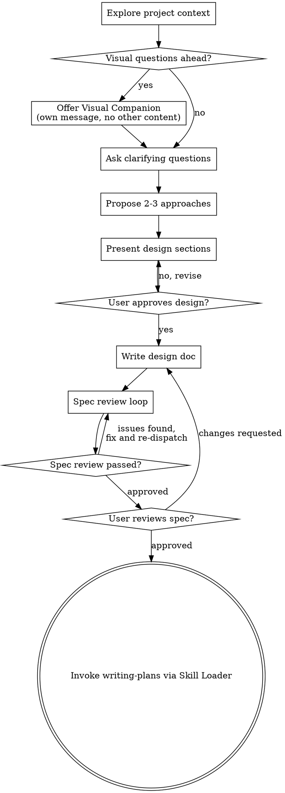

# Brainstorming Ideas Into Designs

Help turn ideas into fully formed designs and specs through natural collaborative dialogue.

Start by understanding the current project context, then ask questions one at a time to refine the idea. Once you understand what you're building, present the design and get user approval.

<HARD-GATE>
Do NOT invoke any implementation skill, write any code, scaffold any project, or take any implementation action until you have presented a design and the user has approved it. This applies to EVERY project regardless of perceived simplicity.
</HARD-GATE>

## Anti-Pattern: "This Is Too Simple To Need A Design"

Every project goes through this process. A todo list, a single-function utility, a config change — all of them. "Simple" projects are where unexamined assumptions cause the most wasted work. The design can be short (a few sentences for truly simple projects), but you MUST present it and get approval.

## Checklist

You MUST create a task for each of these items and complete them in order using your **Task Tracker** capability:

1. **Explore project context** — check files, docs, recent commits
2. **Offer visual companion** (if topic will involve visual questions and you have a **Visual Companion** capability) — this is its own message, not combined with a clarifying question.
3. **Ask clarifying questions** — one at a time, understand purpose/constraints/success criteria
4. **Propose 2-3 approaches** — with trade-offs and your recommendation
5. **Present design** — in sections scaled to their complexity, get user approval after each section
6. **Write design doc** — save to your project's `docs/specs/YYYY-MM-DD-<topic>-design.md` and commit
7. **Spec review loop** — dispatch `spec-document-reviewer` via your **Subagent Dispatcher** capability with precisely crafted review context; fix issues and re-dispatch until approved (max 5 iterations, then surface to human)
8. **User reviews written spec** — ask user to review the spec file before proceeding
9. **Transition to implementation** — invoke `writing-plans` via your **Skill Loader** capability to create implementation plan

## Process Flow

**The terminal state is invoking writing-plans.** Do NOT invoke frontend-design, mcp-builder, or any other implementation skill. The ONLY skill you invoke after brainstorming is writing-plans.

## The Process

**Understanding the idea:**
- Check out the current project state first (files, docs, recent commits)
- Focus on understanding: purpose, constraints, success criteria

**Exploring approaches:**
- Propose 2-3 different approaches with trade-offs
- Present options conversationally with your recommendation and reasoning

**Presenting the design:**
- Once you believe you understand what you're building, present the design
- Scale each section to its complexity: a few sentences if straightforward, up to 200-300 words if nuanced
- Ask after each section whether it looks right so far

**Design for isolation and clarity:**
- Break the system into smaller units that each have one clear purpose, communicate through well-defined interfaces, and can be understood and tested independently

**Working in existing codebases:**
- Explore the current structure before proposing changes. Follow existing patterns.
- Don't propose unrelated refactoring. Stay focused on what serves the current goal.

## After the Design

**Documentation:**
- Write the validated design (spec) to `docs/specs/YYYY-MM-DD-<topic>-design.md`
- Commit the design document to git

**Spec Review Loop:**
After writing the spec document:
1. Dispatch `spec-document-reviewer` via your **Subagent Dispatcher** capability.
2. If Issues Found: fix, re-dispatch, repeat until Approved.
3. If loop exceeds 5 iterations, surface to human for guidance.

**User Review Gate:**
After the spec review loop passes, ask the user to review the written spec before proceeding:
> "Spec written and committed to `<path>`. Please review it and let me know if you want to make any changes before we start writing out the implementation plan."

**Implementation:**
- Invoke the `writing-plans` skill via your **Skill Loader** capability to create a detailed implementation plan.

## Visual Companion

If your agent environment supports a **Visual Companion** capability (a browser-based companion for showing mockups, diagrams, and visual options), you may offer it to the user.

**Offering the companion:** When you anticipate that upcoming questions will involve visual content, offer it once for consent:
> "Some of what we're working on might be easier to explain if I can show it to you in a web browser. Want to try it?"

**This offer MUST be its own message.** Do not combine it with clarifying questions. Wait for the user's response before continuing.
