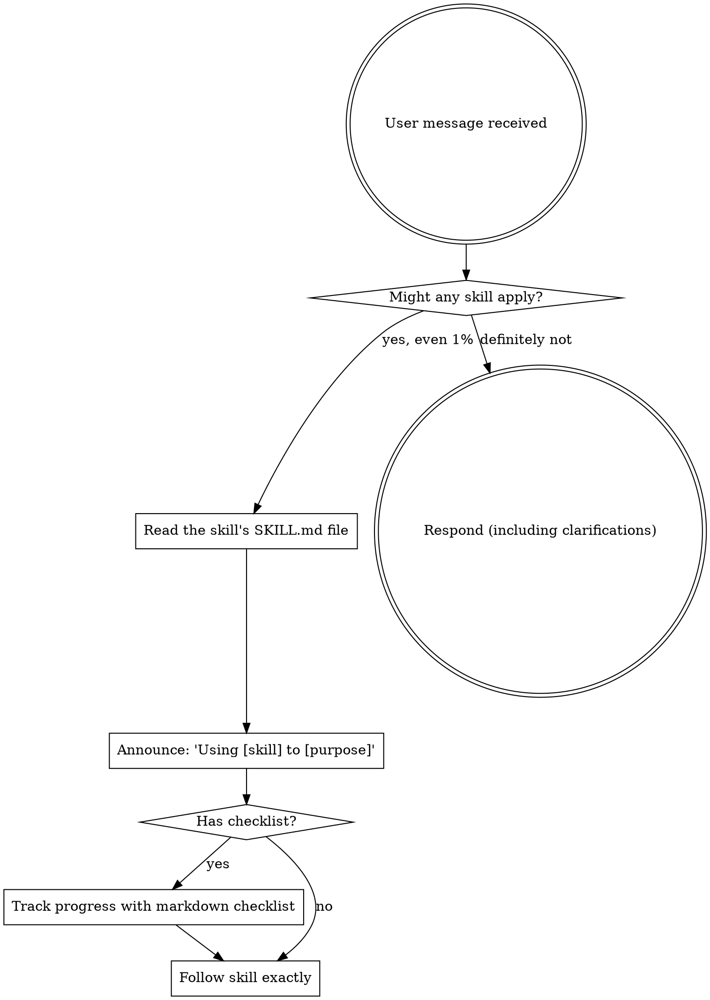

<!-- AUTO-GENERATED by scripts/generate-copilot-instructions.sh — do not edit manually -->
<!-- Prefix: ~/.copilot-superpowers -->
<EXTREMELY_IMPORTANT>
You have superpowers — a skills-based development workflow.

## How to Use Skills

When a user's task matches a skill (see catalog below), read the skill file
and follow its instructions exactly.

To load a skill, read it: `~/.copilot-superpowers/skills/<name>/SKILL.md`

### Invoking Skills

Users may say things like:
- "Use the brainstorming skill"
- "Use TDD for this feature"
- "Debug this systematically"
- "Read ~/.copilot-superpowers/skills/brainstorming/SKILL.md and follow it"

When you recognize a skill applies, tell the user which skill you're using,
then read the SKILL.md file and follow it.

## Instruction Priority

Superpowers skills override default system prompt behavior, but **user instructions always take precedence**:

1. **User's explicit instructions** (CLAUDE.md, GEMINI.md, AGENTS.md, .github/copilot-instructions.md, direct requests) — highest priority
2. **Superpowers skills** — override default system behavior where they conflict
3. **Default system prompt** — lowest priority

If the user says "don't use TDD" and a skill says "always use TDD," follow the user's instructions.

## The Rule

**Read and follow relevant skills BEFORE any response or action.** Even a 1% chance a skill might apply means you should check the skill. If a skill turns out to be wrong for the situation, you don't need to use it.

## Red Flags

These thoughts mean STOP — you're rationalizing:

| Thought | Reality |
|---------|---------|
| "This is just a simple question" | Questions are tasks. Check for skills. |
| "I need more context first" | Skill check comes BEFORE clarifying questions. |
| "Let me explore the codebase first" | Skills tell you HOW to explore. Check first. |
| "I can check git/files quickly" | Files lack conversation context. Check for skills. |
| "Let me gather information first" | Skills tell you HOW to gather information. |
| "This doesn't need a formal skill" | If a skill exists, use it. |
| "I remember this skill" | Skills evolve. Read current version. |
| "This doesn't count as a task" | Action = task. Check for skills. |
| "The skill is overkill" | Simple things become complex. Use it. |
| "I'll just do this one thing first" | Check BEFORE doing anything. |
| "This feels productive" | Undisciplined action wastes time. Skills prevent this. |
| "I know what that means" | Knowing the concept ≠ reading the skill. Read it. |

## Skill Priority

When multiple skills could apply, use this order:

1. **Process skills first** (brainstorming, debugging) — these determine HOW to approach the task
2. **Implementation skills second** (frontend-design, mcp-builder) — these guide execution

"Let's build X" → brainstorming first, then implementation skills.
"Fix this bug" → debugging first, then domain-specific skills.

## Skill Types

**Rigid** (TDD, debugging): Follow exactly. Don't adapt away discipline.

**Flexible** (patterns): Adapt principles to context.

The skill itself tells you which.

## Tool Mapping

# GitHub Copilot Tool Mapping

Skills use Claude Code tool names. When you encounter these in a skill, use your platform equivalent:

| Skill references | Copilot agent mode equivalent |
|-----------------|-------------------------------|
| `Read` (file reading) | Read file contents (built-in) |
| `Write` (file creation) | Create/write files (built-in) |
| `Edit` (file editing) | Edit files (built-in) |
| `Bash` (run commands) | Run in terminal (built-in) |
| `Grep` (search content) | Workspace search or terminal `grep`/`rg` |
| `Glob` (search by name) | Workspace file search or terminal `find` |
| `TodoWrite` (task tracking) | No equivalent — track progress with markdown checklists in chat |
| `Skill` tool (invoke a skill) | No equivalent — read the skill's SKILL.md file directly |
| `Task` tool (dispatch subagent) | No equivalent — Copilot does not support subagents |
| `WebSearch` | No equivalent in agent mode |
| `WebFetch` | No equivalent in agent mode |

## No subagent support

Copilot agent mode has no equivalent to Claude Code's `Task` tool. Skills that rely on subagent dispatch (`subagent-driven-development`, `dispatching-parallel-agents`) will fall back to single-session execution via `executing-plans`.

## Available Skills

Read the relevant SKILL.md file when any of these skills apply to your task.

**Design & Planning**
- **brainstorming** (`~/.copilot-superpowers/skills/brainstorming/SKILL.md`): You MUST use this before any creative work - creating features, building components, adding functionality, or modifying behavior. Explores user intent, requirements and design before implementation.
- **executing-plans** (`~/.copilot-superpowers/skills/executing-plans/SKILL.md`): Use when you have a written implementation plan to execute in a separate session with review checkpoints
- **writing-plans** (`~/.copilot-superpowers/skills/writing-plans/SKILL.md`): Use when you have a spec or requirements for a multi-step task, before touching code

**Testing & Quality**
- **receiving-code-review** (`~/.copilot-superpowers/skills/receiving-code-review/SKILL.md`): Use when receiving code review feedback, before implementing suggestions, especially if feedback seems unclear or technically questionable - requires technical rigor and verification, not performative agreement or blind implementation
- **requesting-code-review** (`~/.copilot-superpowers/skills/requesting-code-review/SKILL.md`): Use when completing tasks, implementing major features, or before merging to verify work meets requirements
- **test-driven-development** (`~/.copilot-superpowers/skills/test-driven-development/SKILL.md`): Use when implementing any feature or bugfix, before writing implementation code
- **verification-before-completion** (`~/.copilot-superpowers/skills/verification-before-completion/SKILL.md`): Use when about to claim work is complete, fixed, or passing, before committing or creating PRs - requires running verification commands and confirming output before making any success claims; evidence before assertions always

**Debugging**
- **systematic-debugging** (`~/.copilot-superpowers/skills/systematic-debugging/SKILL.md`): Use when encountering any bug, test failure, or unexpected behavior, before proposing fixes

**Workflow**
- **dispatching-parallel-agents** (`~/.copilot-superpowers/skills/dispatching-parallel-agents/SKILL.md`): Use when facing 2+ independent tasks that can be worked on without shared state or sequential dependencies
- **finishing-a-development-branch** (`~/.copilot-superpowers/skills/finishing-a-development-branch/SKILL.md`): Use when implementation is complete, all tests pass, and you need to decide how to integrate the work - guides completion of development work by presenting structured options for merge, PR, or cleanup
- **subagent-driven-development** (`~/.copilot-superpowers/skills/subagent-driven-development/SKILL.md`): Use when executing implementation plans with independent tasks in the current session
- **using-git-worktrees** (`~/.copilot-superpowers/skills/using-git-worktrees/SKILL.md`): Use when starting feature work that needs isolation from current workspace or before executing implementation plans - creates isolated git worktrees with smart directory selection and safety verification

**Meta**
- **using-superpowers** (`~/.copilot-superpowers/skills/using-superpowers/SKILL.md`): Use when starting any conversation - establishes how to find and use skills, requiring Skill tool invocation before ANY response including clarifying questions
- **writing-skills** (`~/.copilot-superpowers/skills/writing-skills/SKILL.md`): Use when creating new skills, editing existing skills, or verifying skills work before deployment
</EXTREMELY_IMPORTANT>
