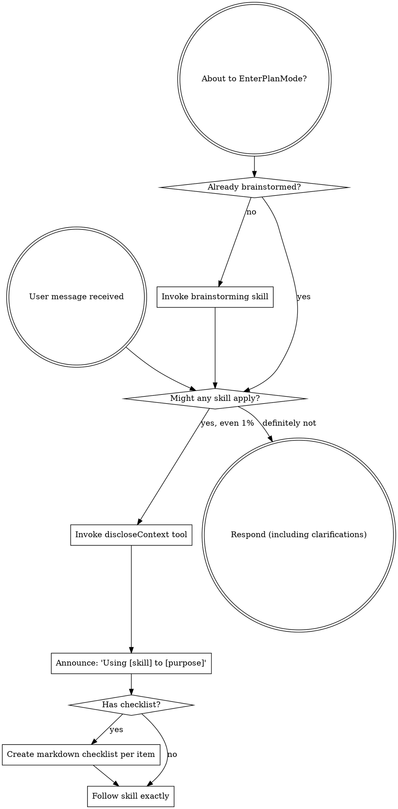

# Superpowers

Superpowers is a complete software development workflow built on composable skills. It starts before you write code — brainstorming designs, writing plans, then executing with TDD, systematic debugging, code review, and subagent-driven development. Skills trigger automatically based on what you're doing.

## Onboarding

When this power is first activated, set up skill access so the user can invoke skills via `/` slash commands.

### Step 1: Determine power installation path

This POWER.md is located inside the superpowers repository. The `skills/` directory is at the same level as the `.kiro-power/` directory that contains this file.

### Step 2: Check if skills are already installed

```bash
ls ~/.kiro/skills/brainstorming/SKILL.md 2>/dev/null
```

### Step 3: Copy skills if needed

If the skills are not yet installed, copy each skill directory into `~/.kiro/skills/`. Kiro requires skills to be directly under the skills directory (no nesting).

**macOS / Linux:**
```bash
mkdir -p ~/.kiro/skills
for skill in <path-to-superpowers-repo>/skills/*/; do
  cp -R "$skill" ~/.kiro/skills/"$(basename "$skill")"
done
```

Where `<path-to-superpowers-repo>` is the parent directory of `.kiro-power/` (the root of this repository).

**Windows (PowerShell):**
```powershell
New-Item -ItemType Directory -Force -Path "$env:USERPROFILE\.kiro\skills"
Get-ChildItem "<path-to-superpowers-repo>\skills" -Directory | ForEach-Object {
    $target = "$env:USERPROFILE\.kiro\skills\$($_.Name)"
    if (Test-Path $target) { Remove-Item $target -Recurse -Force }
    Copy-Item $_.FullName $target -Recurse
}
```

### Step 4: Verify

```bash
ls ~/.kiro/skills/
```

You should see skill directories like `brainstorming/`, `systematic-debugging/`, `test-driven-development/`, etc. directly under `~/.kiro/skills/`.

After setup, skills are available as `/` slash commands in all Kiro workspaces.

## Available Skills

| Skill | When to use |
|-------|-------------|
| `brainstorming` | Before any creative work — features, components, design |
| `writing-plans` | When you have a spec and need an implementation plan |
| `executing-plans` | When you have a plan to execute task-by-task |
| `subagent-driven-development` | Execute plans with independent tasks using subagents |
| `test-driven-development` | When implementing any feature or bugfix |
| `systematic-debugging` | When encountering bugs, test failures, unexpected behavior |
| `requesting-code-review` | Before merging, to verify work meets requirements |
| `receiving-code-review` | When handling code review feedback |
| `verification-before-completion` | Before claiming work is done |
| `using-git-worktrees` | When starting feature work that needs isolation |
| `finishing-a-development-branch` | When implementation is complete, deciding merge/PR/cleanup |
| `dispatching-parallel-agents` | When facing 2+ independent tasks |
| `writing-skills` | When creating or editing skills |


## Using Superpowers

<EXTREMELY-IMPORTANT>
If you think there is even a 1% chance a skill might apply to what you are doing, you ABSOLUTELY MUST invoke the skill.

IF A SKILL APPLIES TO YOUR TASK, YOU DO NOT HAVE A CHOICE. YOU MUST USE IT.

This is not negotiable. This is not optional. You cannot rationalize your way out of this.
</EXTREMELY-IMPORTANT>

### How to Access Skills

**In Kiro:** Use the `discloseContext` tool to load skills by name. Skills are also available as `/` slash commands — the user can type `/brainstorming`, `/systematic-debugging`, etc. to activate a skill directly.

### The Rule

**Invoke relevant or requested skills BEFORE any response or action.** Even a 1% chance a skill might apply means that you should invoke the skill to check. If an invoked skill turns out to be wrong for the situation, you don't need to use it.



### Red Flags

These thoughts mean STOP — you're rationalizing:

| Thought | Reality |
|---------|---------|
| "This is just a simple question" | Questions are tasks. Check for skills. |
| "I need more context first" | Skill check comes BEFORE clarifying questions. |
| "Let me explore the codebase first" | Skills tell you HOW to explore. Check first. |
| "I can check git/files quickly" | Files lack conversation context. Check for skills. |
| "Let me gather information first" | Skills tell you HOW to gather information. |
| "This doesn't need a formal skill" | If a skill exists, use it. |
| "I remember this skill" | Skills evolve. Read current version. |
| "This doesn't count as a task" | Action = task. Check for skills. |
| "The skill is overkill" | Simple things become complex. Use it. |
| "I'll just do this one thing first" | Check BEFORE doing anything. |
| "This feels productive" | Undisciplined action wastes time. Skills prevent this. |
| "I know what that means" | Knowing the concept ≠ using the skill. Invoke it. |

### Skill Priority

When multiple skills could apply, use this order:

1. **Process skills first** (brainstorming, debugging) — these determine HOW to approach the task
2. **Implementation skills second** — these guide execution

"Let's build X" → brainstorming first, then implementation skills.
"Fix this bug" → debugging first, then domain-specific skills.

### Skill Types

**Rigid** (TDD, debugging): Follow exactly. Don't adapt away discipline.

**Flexible** (patterns): Adapt principles to context.

The skill itself tells you which.

### User Instructions

Instructions say WHAT, not HOW. "Add X" or "Fix Y" doesn't mean skip workflows.

## Tool Mapping for Kiro

When skills reference Claude Code tools, substitute Kiro equivalents:

| Claude Code Tool | Kiro Equivalent | Notes |
|-----------------|-----------------|-------|
| `Skill` tool | `discloseContext` | Load a skill by name |
| `TodoWrite` | Markdown checklist | Use `- [ ] item` format in responses |
| `Task` (subagent) | `invokeSubAgent` | Dispatch work to sub-agents |
| `Read` | `readFile` / `readCode` | `readCode` preferred for code files |
| `Write` | `fsWrite` / `fsAppend` | Use `fsAppend` for large files |
| `Edit` | `editCode` / `strReplace` | `editCode` preferred for AST-based edits |
| `Bash` | `executeBash` | Same functionality |
| `WebFetch` | `webFetch` | Same functionality |
| `WebSearch` | `remote_web_search` | Same functionality |
