# Superpowers

Superpowers is a complete software development workflow for coding agents, built from composable skills plus a small runtime layer that makes the agent actually use them. In this repository, the active runtime package targets Codex and GitHub Copilot local installs.

## Provenance

The core project in this fork started from upstream Superpowers: https://github.com/obra/superpowers

This fork keeps that core workflow and extends it with additional skill structure, review flow, and runtime patterns adapted from gstack: https://github.com/garrytan/gstack

## How it works

Superpowers is not just a collection of prompts. It is a small runtime plus a skill library that turns the agent into a conservative workflow state machine.

Six layers matter:

- `superpowers-session-entry` owns first-turn session entry. Missing or malformed decision state fails closed to `needs_user_choice` before the normal stack starts.
- `using-superpowers` is the human-readable entry router after session entry resolves to `enabled`, and it bypasses the rest of the stack when session entry resolves to `bypassed` without explicit re-entry.
- `superpowers-workflow-status` owns product-work routing up to `implementation_ready`.
- `superpowers-repo-safety` owns protected-branch repo-write guarantees. Repo-writing stages fail closed on protected branches unless the current task scope is on a non-protected branch or has explicit task-scoped approval.
- `superpowers-plan-contract` owns semantic traceability between approved specs, approved plans, and derived task packets. It parses authoritative markdown, fails closed on malformed or ambiguous contracts, and builds exact task-packet context for execution and review.
- `superpowers-plan-execution` owns execution state after an approved plan is handed off.

The key design choice is that repo-visible artifacts remain authoritative, while local runtime state is only a rebuildable index:

- Spec approval truth lives in the spec headers in `docs/superpowers/specs/*.md`.
- Plan approval truth lives in the plan headers in `docs/superpowers/plans/*.md`.
- Execution truth lives in the approved plan's checklist and execution notes, plus the paired execution-evidence file.
- The branch-scoped manifest under `~/.superpowers/projects/<repo-slug>/<user>-<safe-branch>-workflow-state.json` stores expected paths and the last derived routing status, but it is not the approval authority.

The full control flow looks like this:

```mermaid
flowchart TD
    MSG["User message"] --> BYPASS_GATE["superpowers-session-entry runtime bootstrap<br/>resolve the session decision before normal using-superpowers stack entry"]
    BYPASS_GATE -->|bypassed without explicit re-entry| NORMAL["Respond normally"]
    BYPASS_GATE -->|enabled| PREAMBLE["Generated skill preamble<br/>detect install root, check upgrade state,<br/>mark session, enable contributor-mode hooks"]
    PREAMBLE --> SKILL_CHECK{"Does any skill apply?"}
    SKILL_CHECK -->|No| NORMAL
    SKILL_CHECK -->|Yes| ROUTER_KIND{"What kind of work is this?"}

    ROUTER_KIND -->|Bug / failing test / unexpected behavior| DEBUG_SKILL["superpowers:systematic-debugging"]
    ROUTER_KIND -->|Incoming code review feedback| RECEIVE_REVIEW["superpowers:receiving-code-review"]
    ROUTER_KIND -->|Claim that work is done or passing| VERIFY_DONE["superpowers:verification-before-completion"]
    ROUTER_KIND -->|Feature / product / workflow change| WS_REFRESH["superpowers-workflow-status status --refresh"]

    subgraph PRODUCT_ROUTER["Product-work router: helper-backed artifact state machine"]
        direction TD

        WS_REFRESH --> READ_STATE["Read branch-scoped manifest under ~/.superpowers/projects/...<br/>and inspect docs/superpowers/specs/*.md + docs/superpowers/plans/*.md"]
        READ_STATE -.-> AUTHORITY_NOTE["Repo docs are authoritative.<br/>Manifest is a rebuildable local index of expected paths and derived status."]
        READ_STATE --> HELPER_HEALTH{"Helper + manifest healthy?"}

        HELPER_HEALTH -->|Helper unavailable or runtime failure| MANUAL_FALLBACK["Manual fallback in using-superpowers:<br/>inspect newest relevant spec/plan and parse exact headers"]
        HELPER_HEALTH -->|Corrupt manifest| CORRUPT_RECOVERY["Backup corrupt manifest, warn,<br/>rebuild conservatively for this invocation"]
        HELPER_HEALTH -->|Repo root or branch mismatch| IDENTITY_RECOVERY["Warn and rebuild from current repo context<br/>reason=repo_root_mismatch or branch_mismatch"]
        HELPER_HEALTH -->|Yes| SPEC_GATE{"What does the current spec resolve to?"}

        MANUAL_FALLBACK --> SPEC_GATE
        CORRUPT_RECOVERY --> SPEC_GATE
        IDENTITY_RECOVERY --> SPEC_GATE

        SPEC_GATE -->|No spec artifact yet<br/>or missing expected spec| STATE_NEEDS_BRAIN["status=needs_brainstorming<br/>next_skill=superpowers:brainstorming"]
        SPEC_GATE -->|Spec ambiguous| STATE_SPEC_AMBIG["status=spec_draft<br/>reason=fallback_ambiguity_spec<br/>next_skill=superpowers:plan-ceo-review"]
        SPEC_GATE -->|Spec headers malformed| STATE_SPEC_BAD["status=spec_draft<br/>reason=malformed_spec_headers<br/>next_skill=superpowers:plan-ceo-review"]
        SPEC_GATE -->|Spec Workflow State = Draft| STATE_SPEC_DRAFT["status=spec_draft<br/>next_skill=superpowers:plan-ceo-review"]
        SPEC_GATE -->|Spec Workflow State = CEO Approved| PLAN_GATE{"What does the current plan resolve to?"}

        PLAN_GATE -->|No plan artifact yet<br/>or missing expected plan| STATE_NEEDS_PLAN["status=spec_approved_needs_plan<br/>next_skill=superpowers:writing-plans"]
        PLAN_GATE -->|Plan ambiguous| STATE_PLAN_AMBIG["status=spec_approved_needs_plan<br/>reason=fallback_ambiguity_plan<br/>next_skill=superpowers:writing-plans"]
        PLAN_GATE -->|Plan headers malformed| STATE_PLAN_BAD["status=plan_draft<br/>reason=malformed_plan_headers<br/>next_skill=superpowers:plan-eng-review"]
        PLAN_GATE -->|Plan Workflow State = Draft| STATE_PLAN_DRAFT["status=plan_draft<br/>next_skill=superpowers:plan-eng-review"]
        PLAN_GATE -->|Plan Engineering Approved but source spec path/revision is stale| STATE_STALE_PLAN["status=stale_plan<br/>next_skill=superpowers:writing-plans"]
        PLAN_GATE -->|Plan Engineering Approved and source spec path plus revision match latest approved spec| STATE_READY["status=implementation_ready<br/>next_skill is intentionally empty"]
    end

    subgraph ARTIFACT_LIFECYCLE["Artifact lifecycle: skills move the workflow by writing exact headers and syncing the helper"]
        direction TD

        BRAIN_SKILL["superpowers:brainstorming"] --> EXPECT_SPEC["expect --artifact spec --path <repo-relative-spec-path>"]
        EXPECT_SPEC --> WRITE_SPEC["Write spec with exact headers:<br/>Workflow State: Draft<br/>Spec Revision: 1<br/>Last Reviewed By: brainstorming"]
        WRITE_SPEC --> SYNC_SPEC["sync --artifact spec"]

        PLAN_CEO_SKILL["superpowers:plan-ceo-review"] --> CEO_ACCEL{"User explicitly requests<br/>accelerated / accelerator mode?"}
        CEO_ACCEL -->|No| SPEC_REVIEW["Keep spec in Draft while review is unresolved.<br/>If materially changing an approved spec, increment Spec Revision."]
        CEO_ACCEL -->|Yes| SPEC_ACCEL["Accelerated CEO review inside the skill:<br/>reviewer subagent drafts per-section packets<br/>human approves each section<br/>final approval remains human-owned"]
        SPEC_ACCEL --> SPEC_REVIEW
        SPEC_REVIEW --> SPEC_APPROVE["Approve by writing:<br/>Workflow State: CEO Approved<br/>Last Reviewed By: plan-ceo-review"]
        SPEC_APPROVE --> SYNC_APPROVED_SPEC["sync --artifact spec"]

        WRITE_PLAN_SKILL["superpowers:writing-plans"] --> EXPECT_PLAN["expect --artifact plan --path <repo-relative-plan-path>"]
        EXPECT_PLAN --> WRITE_PLAN["Write plan with exact headers:<br/>Workflow State: Draft<br/>Plan Revision: 1<br/>Execution Mode: none<br/>Source Spec: exact approved spec path<br/>Source Spec Revision: approved spec revision<br/>Last Reviewed By: writing-plans"]
        WRITE_PLAN --> SYNC_PLAN["sync --artifact plan"]

        PLAN_ENG_SKILL["superpowers:plan-eng-review"] --> ENG_ACCEL{"User explicitly requests<br/>accelerated / accelerator mode?"}
        ENG_ACCEL -->|No| PLAN_REVIEW["Keep plan in Draft until review resolves.<br/>Only the final successful review may approve execution."]
        ENG_ACCEL -->|Yes| PLAN_ACCEL["Accelerated ENG review inside the skill:<br/>reviewer subagent drafts per-section packets<br/>human approves each section<br/>QA handoff and final approval still apply"]
        PLAN_ACCEL --> PLAN_REVIEW
        PLAN_REVIEW --> PLAN_APPROVE["Approve by writing:<br/>Workflow State: Engineering Approved<br/>Last Reviewed By: plan-eng-review"]
        PLAN_APPROVE --> PLAN_REFRESH["superpowers-workflow-status status --refresh"]
    end

    STATE_NEEDS_BRAIN --> BRAIN_SKILL
    STATE_SPEC_AMBIG --> PLAN_CEO_SKILL
    STATE_SPEC_BAD --> PLAN_CEO_SKILL
    STATE_SPEC_DRAFT --> PLAN_CEO_SKILL
    SYNC_SPEC --> PLAN_CEO_SKILL
    SYNC_APPROVED_SPEC --> WRITE_PLAN_SKILL
    STATE_NEEDS_PLAN --> WRITE_PLAN_SKILL
    STATE_PLAN_AMBIG --> WRITE_PLAN_SKILL
    STATE_STALE_PLAN --> WRITE_PLAN_SKILL
    SYNC_PLAN --> PLAN_ENG_SKILL
    STATE_PLAN_BAD --> PLAN_ENG_SKILL
    STATE_PLAN_DRAFT --> PLAN_ENG_SKILL
    PLAN_REFRESH --> STATE_READY

    STATE_READY --> EXEC_HANDOFF["plan-eng-review presents the exact approved plan path"]

    subgraph EXECUTION_ROUTER["Execution handoff and helper-owned execution state"]
        direction TD

        EXEC_HANDOFF --> EXEC_RECOMMEND["superpowers-plan-execution recommend --plan <approved-plan-path>"]
        EXEC_HANDOFF -.-> WORKTREE_NOTE["Workspace preparation is the user's responsibility;<br/>invoke using-git-worktrees manually when you want isolated workspace management."]
        EXEC_RECOMMEND --> DECISION_FLAGS["Recommendation inputs:<br/>tasks_independent<br/>isolated_agents_available<br/>session_intent<br/>workspace_prepared<br/>same_session_viable"]
        DECISION_FLAGS -->|Independent tasks + isolated agents available + same-session execution is viable| SUBAGENT_EXEC["Recommended: superpowers:subagent-driven-development"]
        DECISION_FLAGS -->|Otherwise default conservatively| SINGLE_EXEC["Recommended: superpowers:executing-plans"]

        SUBAGENT_EXEC --> EXEC_STATUS["superpowers-plan-execution status --plan <approved-plan-path><br/>validate Engineering Approved plan, Plan Revision,<br/>Execution Mode, source spec linkage, evidence path,<br/>execution fingerprint, and current step state"]
        SINGLE_EXEC --> EXEC_STATUS
        EXEC_STATUS -.-> EXEC_AUTHORITY["Approved plan markdown is the authoritative execution record.<br/>Execution evidence proves checked-off steps semantically."]

        EXEC_STATUS --> STEP_UNCHECKED["Unchecked step<br/>- [ ] and no execution note"]
        STEP_UNCHECKED -->|begin<br/>first begin persists chosen Execution Mode if it was none| STEP_ACTIVE["Unchecked step + Active note"]
        STEP_ACTIVE -->|complete + evidence attempt| STEP_CHECKED["Checked step<br/>- [x]"]
        STEP_ACTIVE -->|note --state interrupted| STEP_INTERRUPTED["Unchecked step + Interrupted note"]
        STEP_ACTIVE -->|note --state blocked| STEP_BLOCKED["Unchecked step + Blocked note"]
        STEP_INTERRUPTED -->|begin same step| STEP_ACTIVE
        STEP_BLOCKED -->|begin same step after unblock| STEP_ACTIVE
        STEP_CHECKED -->|reopen on material change| STEP_REOPENED["Unchecked step + Interrupted note<br/>latest successful evidence invalidated"]
        STEP_REOPENED -->|begin same step| STEP_ACTIVE
        STEP_ACTIVE -->|transfer to a previously completed repair step| STEP_TRANSFER["Park current step as Interrupted<br/>reopen repair step as Active"]
        STEP_TRANSFER --> STEP_ACTIVE

        EXEC_STATUS -.-> EXEC_RULES["Hard limits:<br/>one current-work step at a time<br/>one parked Interrupted step at most<br/>checked steps may not keep execution notes<br/>Blocked halts forward execution<br/>new approved revisions must start execution-clean"]

        STEP_CHECKED --> MORE_STEPS{"More plan steps remain?"}
        MORE_STEPS -->|Yes| STEP_UNCHECKED
        MORE_STEPS -->|No| FINAL_REVIEW["superpowers:requesting-code-review<br/>must read status --plan and evidence_path"]
        FINAL_REVIEW -->|Dirty execution state, stale evidence,<br/>missed reopen, or missing semantic proof| FAIL_CLOSED["Fail closed and return to execution<br/>or back to plan-eng-review"]
        FINAL_REVIEW -->|Review resolved| FINISH_BRANCH["superpowers:finishing-a-development-branch<br/>must read status --plan and evidence_path"]
        FINISH_BRANCH -->|Execution dirty or malformed| FAIL_CLOSED
        FINISH_BRANCH --> QA_GATE["conditional qa-only for browser-facing work<br/>required when browser interaction or test-plan context warrants it"]
        QA_GATE --> DOC_RELEASE["workflow-routed work: required document-release<br/>ad-hoc work: optional release/doc cleanup"]
        DOC_RELEASE --> COMPLETE_FLOW["PR / merge / keep-branch completion flow"]
    end
```



Workspace preparation is the user's responsibility; invoke `using-git-worktrees` manually when you want isolated workspace management.

A few important consequences fall out of that state machine:

- `expect` is how a skill records the intended future artifact path before the file exists; `sync` is how it reparses the real file and updates the manifest from repo truth.
- `superpowers-workflow-status` always routes conservatively. If artifacts are ambiguous, malformed, missing, stale, or the local manifest is damaged, it falls back to the earlier safe stage instead of skipping ahead.
- `implementation_ready` is a terminal routing state, not another skill. That is why `next_skill` is empty there and `plan-eng-review` owns the handoff into execution.
- `superpowers-plan-execution recommend` is only valid before execution has started for that exact plan revision. After that, the plan's persisted `**Execution Mode:**` and the helper's `status --plan` output are the source of truth.
- Execution is deliberately serial at the plan-step level. The execution helper allows subagents, but not multiple simultaneously active plan steps.
- Final review and branch completion both fail closed if the approved plan and execution evidence disagree with reality.
- Workflow-routed implementation now expects a required `document-release` handoff before branch completion, while keeping release truth in repo docs and review rather than helper state.
- Browser-facing work keeps a conditional `qa-only` handoff instead of turning browser QA into a universal gate.

That is the reason Superpowers feels opinionated in practice: the agent is not merely told to follow a workflow; the runtime keeps re-deriving the safest next state from the repo, the local branch-scoped manifest, and the exact approval headers written by the prior skill.

## Search Before Building

Search Before Building is a lightweight operating rule for generated non-router skills. Before introducing a bespoke auth/session flow, cache or queue wrapper, concurrency primitive, browser workaround, external service, or unfamiliar framework pattern, the agent does a short capability or landscape check through three lenses:

- `Layer 1`: built-ins, official guidance, and existing repo-native solutions
- `Layer 2`: current external practice and known footguns
- `Layer 3`: first-principles reasoning for this repo, this user, and this problem

`Layer 2` is input, not authority. Repo truth, approved artifact headers, official docs, and explicit user instructions still outrank outside search results.

Internet access remains optional. If search is unavailable, unnecessary, disallowed, or unsafe, the agent says so plainly and proceeds with repo-local evidence plus in-distribution knowledge. The durable reference for this behavior is [references/search-before-building.md](references/search-before-building.md).

Privacy and sanitization are part of the v1 contract:

- never search secrets, customer data, unsanitized stack traces, private URLs, internal hostnames, internal codenames, raw SQL or log payloads, or private file paths or infrastructure identifiers
- product ideation uses generalized category terms only
- debugging must sanitize to the generic error type plus component, framework, or library context first
- if safe sanitization is not possible, skip external search
- only `brainstorming` asks one explicit permission question before external search when the work is sensitive or stealthy


## Installation

Superpowers uses a single shared checkout for its supported runtime surfaces. Codex and GitHub Copilot local installs both point at `~/.superpowers/install`; only the discovery links differ.

Shared runtime layout:

- `~/.superpowers/install` - canonical checkout
- `~/.agents/skills/superpowers -> ~/.superpowers/install/skills`
- `Unix-like: ~/.codex/agents/code-reviewer.toml -> ~/.superpowers/install/.codex/agents/code-reviewer.toml`
- `~/.copilot/skills/superpowers -> ~/.superpowers/install/skills`
- `Unix-like: ~/.copilot/agents/code-reviewer.agent.md -> ~/.superpowers/install/agents/code-reviewer.md`

On Unix-like installs, the Codex reviewer agent is symlinked to the shared checkout.

On Windows, the Codex reviewer agent is copied from the shared checkout and must be refreshed after updates.

On Unix-like installs, the Copilot agent is symlinked to the shared checkout.

On Windows, the Copilot agent is copied from the shared checkout and must be refreshed after updates.

### Codex

Tell Codex:

```
Fetch and follow instructions from https://raw.githubusercontent.com/dmulcahey/superpowers/refs/heads/main/.codex/INSTALL.md
```

**Detailed docs:** [docs/README.codex.md](docs/README.codex.md)

### GitHub Copilot Local Installs

Tell GitHub Copilot:

```
Fetch and follow instructions from https://raw.githubusercontent.com/dmulcahey/superpowers/refs/heads/main/.copilot/INSTALL.md
```

**Detailed docs:** [docs/README.copilot.md](docs/README.copilot.md)

### Migrating Existing Platform-Specific Installs

If you already have `~/.codex/superpowers` or `~/.copilot/superpowers`, migrate them into the single shared checkout with:

```bash
tmpdir=$(mktemp -d)
git clone --depth 1 https://github.com/dmulcahey/superpowers.git "$tmpdir/superpowers"
"$tmpdir/superpowers/bin/superpowers-migrate-install"
rm -rf "$tmpdir"
```

If `~/.superpowers/install` already exists, run `~/.superpowers/install/bin/superpowers-migrate-install` instead.

**Windows (PowerShell):**
```powershell
if (Test-Path "$env:USERPROFILE\.superpowers\install") {
  & "$env:USERPROFILE\.superpowers\install\bin\superpowers-migrate-install.ps1"
} else {
  $tmpRoot = Join-Path $env:TEMP "superpowers-migrate"
  $tmpDir = Join-Path $tmpRoot ([guid]::NewGuid().ToString())
  git clone --depth 1 https://github.com/dmulcahey/superpowers.git (Join-Path $tmpDir "superpowers")
  & (Join-Path $tmpDir "superpowers\bin\superpowers-migrate-install.ps1")
  Remove-Item -Recurse -Force $tmpDir
}
```

After migrating, finish the normal platform setup:

- Codex: create or refresh `~/.agents/skills/superpowers`
- Codex: create or refresh `~/.codex/agents/code-reviewer.toml`
- GitHub Copilot: create or refresh `~/.copilot/skills/superpowers`
- GitHub Copilot: create or refresh `~/.copilot/agents/code-reviewer.agent.md`

### Verify Installation

Start a new session in your chosen platform and ask for something that should trigger a skill (for example, "help me plan this feature" or "let's debug this issue"). The agent should automatically invoke the relevant superpowers skill.

### Runtime State and Automation

Runtime state lives in `~/.superpowers/`.

- Preferences live in `~/.superpowers/config.yaml`
- Session-awareness markers live in `~/.superpowers/sessions/`
- Contributor field reports live in `~/.superpowers/contributor-logs/`
- Project-scoped artifacts live in `~/.superpowers/projects/`
- Branch-scoped workflow manifests live at `~/.superpowers/projects/<repo-slug>/<user>-<safe-branch>-workflow-state.json`
- Update-check cache, snooze, and just-upgraded markers live under the same state root

Generated workflow skills call `$_SUPERPOWERS_ROOT/bin/superpowers-workflow-status` (and `bin/superpowers-workflow-status.ps1` on Windows) as an internal runtime helper to resolve the next workflow stage, including bootstrap states before docs exist. Default `status` output is JSON for machine consumers; `status --summary` is a human-oriented one-line view. `reason` is the canonical diagnostic field, and any `note` field is only a compatibility alias. The helper's local manifest is rebuildable; repo docs remain authoritative for spec/plan approval state.

Generated repo-writing workflow skills call `$_SUPERPOWERS_ROOT/bin/superpowers-repo-safety` (and `bin/superpowers-repo-safety.ps1` on Windows) before spec writes, plan writes, approval-header edits, release-doc updates, execution task slices, and branch-finishing commands. It blocks repo writes on protected branches unless the scope is already on a non-protected branch or the user has explicitly approved the exact task scope and the helper's re-check passes.

Generated planning, execution, and review workflow skills call `$_SUPERPOWERS_ROOT/bin/superpowers-plan-contract` (and `bin/superpowers-plan-contract.ps1` on Windows) to lint Requirement Index plus Requirement Coverage Matrix contracts and to build task-packet context. Specs and plans stay authoritative in repo markdown; the helper only enforces and compiles that markdown into exact execution and review inputs.

Superpowers also ships a supported public workflow inspection CLI:

- `bin/superpowers-workflow` (Bash)
- `bin/superpowers-workflow.ps1` (PowerShell wrapper)

Use `status`, `next`, `artifacts`, `explain`, or `help` to inspect workflow state without mutating repo docs or repairing local manifests. At `implementation_ready`, `next` stops at the execution handoff boundary and does not call `superpowers-plan-execution recommend`.

All 18 checked-in `skills/*/SKILL.md` files are generated from adjacent `SKILL.md.tmpl` sources. Regenerate them with `node scripts/gen-skill-docs.mjs` and validate freshness with `node scripts/gen-skill-docs.mjs --check`.

The shipped reviewer agent artifacts are generated from `agents/code-reviewer.instructions.md`. Regenerate them with `node scripts/gen-agent-docs.mjs` and validate freshness with `node scripts/gen-agent-docs.mjs --check`.

When changing the generated skill runtime, run `node scripts/gen-skill-docs.mjs --check` before `bash tests/codex-runtime/test-using-superpowers-bypass.sh`, `bash tests/codex-runtime/test-superpowers-session-entry.sh`, `bash tests/codex-runtime/test-superpowers-session-entry-gate.sh`, `bash tests/codex-runtime/test-superpowers-plan-contract.sh`, `bash tests/codex-runtime/test-superpowers-repo-safety.sh`, `bash tests/codex-runtime/test-runtime-instructions.sh`, `bash tests/codex-runtime/test-workflow-enhancements.sh`, and `bash tests/codex-runtime/test-workflow-sequencing.sh`.

To enable contributor mode for the installed runtime, run `~/.superpowers/install/bin/superpowers-config set superpowers_contributor true`.

Windows (PowerShell): `& "$env:USERPROFILE\.superpowers\install\bin\superpowers-config.ps1" set superpowers_contributor true`

If you disable update notices, re-enable them with `~/.superpowers/install/bin/superpowers-config set update_check true`.

Windows (PowerShell): `& "$env:USERPROFILE\.superpowers\install\bin\superpowers-config.ps1" set update_check true`

## What Actually Runs

- `skills/` contains the 18 public Superpowers skills. `using-superpowers` is the entry skill after the runtime-owned `superpowers-session-entry` gate resolves the turn; `brainstorming`, `plan-ceo-review`, `writing-plans`, and `plan-eng-review` form the default planning chain.
- `scripts/gen-skill-docs.mjs` renders every checked-in `SKILL.md` from its template and injects the shared runtime preamble contracts, including the runtime-owned `using-superpowers` session-entry wording plus its post-gate normal-stack handoff.
- `bin/superpowers-migrate-install` consolidates legacy platform-specific installs into the single shared checkout and recreates compatibility links when needed.
- `bin/superpowers-config` and `bin/superpowers-update-check` manage local runtime state, contributor mode, and per-session upgrade notices under `~/.superpowers/`.
- `bin/superpowers-workflow` and `bin/superpowers-workflow.ps1` are the supported public read-only workflow inspection surfaces for humans.
- `bin/superpowers-workflow-status` and `bin/superpowers-workflow-status.ps1` maintain branch-scoped local workflow state and route skills conservatively when docs are missing or stale.
- `bin/superpowers-repo-safety` and `bin/superpowers-repo-safety.ps1` enforce protected-branch repo-write guarantees for repo-writing workflow stages.
- `superpowers-upgrade/SKILL.md` is the inline upgrade workflow the generated preambles hand off to when a newer runtime version is available.
- `review/TODOS-format.md` and `review/checklist.md` are the shared review references used by the planning and code-review workflows.
- `qa/references/issue-taxonomy.md` and `qa/templates/qa-report-template.md` are the shared QA references used by `qa-only`.
- `agents/code-reviewer.instructions.md` is the shared reviewer source that generates `agents/code-reviewer.md` for GitHub Copilot and `.codex/agents/code-reviewer.toml` for Codex.

## The Basic Workflow

Default pipeline: `brainstorming -> plan-ceo-review -> writing-plans -> plan-eng-review -> implementation`

That is the default path for new feature and product work. Other task types take their own first-class routes: `systematic-debugging` handles bugs and failing tests, `receiving-code-review` handles incoming review feedback before you implement it, and `verification-before-completion` gates any claim that work is done or passing.

Accelerated review is an opt-in branch inside `plan-ceo-review` and `plan-eng-review`, not a separate workflow stage.

Only the user can initiate accelerated review, and section approval plus final approval remain human-owned even when the review uses reviewer subagents and persisted section packets.

1. **brainstorming** - Activates before writing code. Refines rough ideas through questions, explores alternatives, presents design in sections for validation. Saves the written spec.

2. **plan-ceo-review** - Activates after the spec is written. Runs a founder-mode review of the written spec before implementation planning.

3. **writing-plans** - Activates with an approved spec. Breaks work into bite-sized tasks (2-5 minutes each). Every task has exact file paths, complete code, verification steps.

4. **plan-eng-review** - Activates after the plan is written. Reviews the full written plan before implementation starts.

5. **implementation** - `subagent-driven-development` or `executing-plans` start from an engineering-approved current plan, run workspace-readiness checks, derive task packets from the approved markdown contract through `superpowers-plan-contract`, and execute the plan. The completion flow then runs `requesting-code-review`, requires `qa-only` when browser QA is warranted, requires `document-release` for workflow-routed work, and then proceeds to final branch cleanup or PR handoff. If the user wants an isolated workspace, invoke `using-git-worktrees` manually before execution.

Implementation starts from an engineering-approved current plan and the exact approved plan path. `plan-eng-review` presents that handoff, and `superpowers-plan-execution recommend --plan <approved-plan-path>` chooses between *subagent-driven-development* and *executing-plans*. In both cases, execution runs a workspace-readiness preflight, executes the plan task by task, reviews before completion, and hands off through the normal branch-finishing flow. Those execution and review stages now derive task packets from the approved markdown contract through `superpowers-plan-contract` instead of relying on controller-written semantic summaries.

**The agent checks for relevant skills before any task.** These are mandatory workflows, not suggestions.

## What's Inside

### Skills Library

The public runtime currently exposes 18 skills.

**Testing**
- **test-driven-development** - RED-GREEN-REFACTOR cycle (includes testing anti-patterns reference)

**Debugging**
- **systematic-debugging** - 4-phase root cause process (includes root-cause-tracing, defense-in-depth, condition-based-waiting techniques)
- **verification-before-completion** - Ensure it's actually fixed

**Collaboration** 
- **brainstorming** - Socratic design refinement
- **plan-ceo-review** - CEO/founder-mode spec review before implementation planning
- **writing-plans** - Detailed implementation plans
- **plan-eng-review** - Engineering review of the written plan before implementation
- **qa-only** - Report-only browser QA with shared health scoring and artifacts
- **executing-plans** - Separate-session plan execution
- **dispatching-parallel-agents** - Concurrent subagent workflows
- **requesting-code-review** - Code-review dispatch and triage
- **receiving-code-review** - Responding to feedback
- **document-release** - Post-implementation documentation and changelog cleanup
- **using-git-worktrees** - Optional isolated workspace setup
- **finishing-a-development-branch** - Merge/PR decision workflow
- **subagent-driven-development** - Fast iteration with two-stage review (spec compliance, then code quality)

**Meta**
- **writing-skills** - Create new skills following best practices (includes testing methodology)
- **using-superpowers** - Introduction to the skills system

## Philosophy

- **Test-Driven Development** - Write tests first, always
- **Systematic over ad-hoc** - Process over guessing
- **Complexity reduction** - Simplicity as primary goal
- **Evidence over claims** - Verify before declaring success

Read more: [Superpowers background](https://blog.fsck.com/2025/10/09/superpowers/)

## Contributing

Skills and runtime helpers live directly in this repository. The editable source for generated skills is `skills/*/SKILL.md.tmpl`; the checked-in `SKILL.md` files are generated artifacts. To contribute:

1. Fork the repository
2. Create a branch for your skill or runtime change
3. Edit the relevant `SKILL.md.tmpl` or runtime file
4. Regenerate generated skill docs with `node scripts/gen-skill-docs.mjs`
5. Follow the `writing-skills` skill for creating and testing new skills
6. Submit a PR

See `skills/writing-skills/SKILL.md` for the complete guide.

## Updating

Update the shared checkout used by both supported platforms:

```bash
git -C ~/.superpowers/install pull
```

If you are migrating from old per-platform clones, run `~/.superpowers/install/bin/superpowers-migrate-install` after updating so legacy paths keep resolving to the shared checkout. In PowerShell, use `& "$env:USERPROFILE\.superpowers\install\bin\superpowers-migrate-install.ps1"`.

Every generated skill preamble runs `bin/superpowers-update-check` from the active install root. New sessions will announce `UPGRADE_AVAILABLE` or `JUST_UPGRADED` when the local runtime state says you should act.

## License

MIT License - see LICENSE file for details

## Support

- **Issues**: https://github.com/dmulcahey/superpowers/issues
- **Repository**: https://github.com/dmulcahey/superpowers
