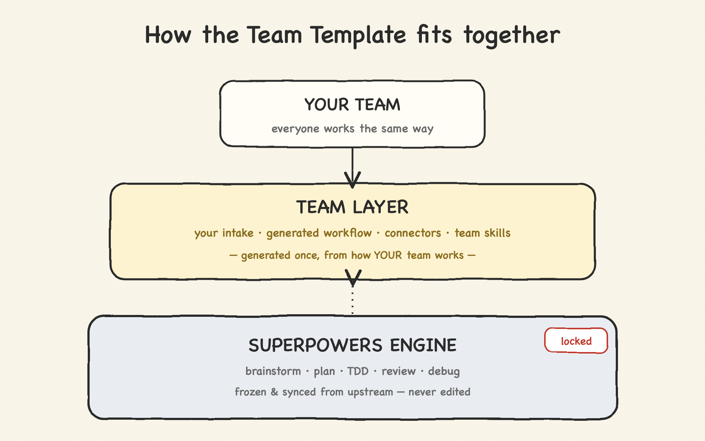
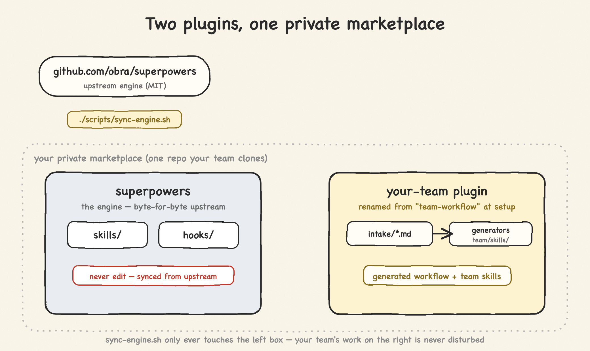
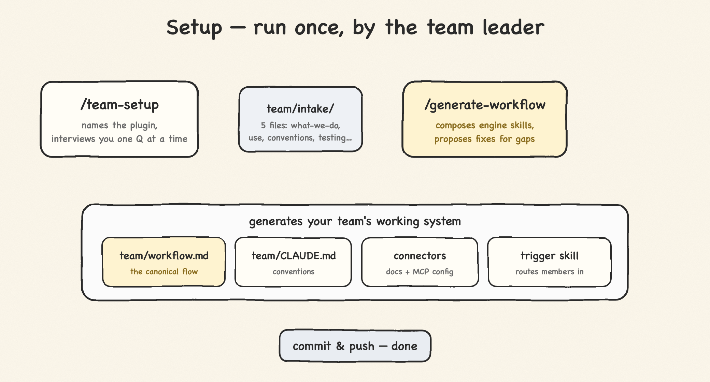
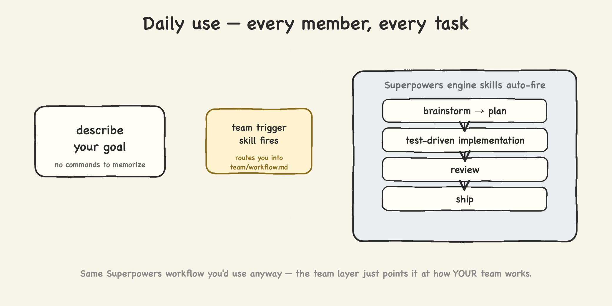

# Superpowers Team Template

**Onboard your whole team to Claude Code — working the same way — in an afternoon.**

<p align="center">
  
</p>

> **Built on [Superpowers](https://github.com/obra/superpowers) by Jesse Vincent (obra) — MIT.**
> This repo is a team-onboarding template layered on top. All of the workflow
> methodology — brainstorming, planning, TDD, subagent-driven development,
> review — is Superpowers' work. Go star the original.

---

## The one-sentence mental model

**You use Superpowers exactly as you always would.** The template adds a thin
**team layer** on top that customizes and documents that same workflow for how
*your* team actually works. It doesn't replace the Superpowers flow — it points
it at your team.

If you already know Superpowers, you already know how to use this. The rest is
just setup.

---

## Architecture — two plugins, one private marketplace

Your team clones **one repo**. Inside it are two plugins:

- **`superpowers`** — the engine, kept **byte-for-byte upstream**. You never
  edit it; you sync it.
- **`team-workflow`** (you rename it to your team) — your intake answers, the
  workflow generated from them, your connectors, and any team skills you build.

<p align="center">
  
</p>

The dividing line is the whole point: `./scripts/sync-engine.sh` pulls new
Superpowers releases into the engine and **never touches your team's work**.
Upstream improvements and your customizations never collide.

---

## Two lifecycles

There are exactly two ways anyone interacts with this template: a leader sets it
up **once**, and every member uses it **every day**.

### 1. Setup — run once, by the team leader

<p align="center">
  
</p>

`/team-setup` interviews you one question at a time and writes your answers into
`team/intake/*.md`. Then `/generate-workflow` turns that intake into your team's
actual working system — composing existing engine skills wherever they fit and
scaffolding thin stubs (never hallucinated skills) where something's genuinely
missing. Review it, commit, push. Done.

### 2. Daily use — every member, every task

<p align="center">
  
</p>

A member describes a goal in plain language. The team trigger skill points them
at `team/workflow.md`, and the Superpowers engine skills auto-fire from what they
said — brainstorm → plan → TDD → review → ship. **No commands to memorize.** It's
the workflow you'd use anyway, aimed at how your team works.

---

## A worked example — the "Company Z" dev team

Meet a realistic team, so the two lifecycles above stop being abstract.

**Company Z's platform team, 9 developers.** Their institutional knowledge lives
in **Confluence** — a deploy runbook, a "how we cut a release" page, coding
standards, an incident playbook. Their Claude Code adoption is uneven: **a couple
of senior engineers** have used it for months and have built up personal skills and
sharp habits; **the team lead** uses it some; **a new hire** got access last week
and is still finding their feet. Everyone works slightly differently, and none of
that hard-won practice is shared. That's the problem this template exists to fix.

### Act 1 — the team lead sets it up (once)

The **team lead** forks the template privately, clones it, opens it in Claude Code,
and runs:

```
/team-setup
```

It renames the plugin to `platform-z` and then **interviews them one question at a
time** — how work flows from idea to shipped, what stack they use, their review
rules, how they test before merge. They're not writing skills; they're answering
questions, and the answers land in `team/intake/*.md`.

When the interview reaches connectors, the lead wires their Confluence in so Claude
can actually *use* it:

```
/platform-z:new-connector
> Is this a doc, MCP tool, or convention?  →  MCP tool (Confluence)
```

Now Claude can **read the team's Confluence runbooks on demand** — the release
page, the deploy runbook — at the moment a task needs them, instead of anyone
pasting stale snapshots. The lead also records their "squash-merge only, PR needs
one approval" rule as an always-on convention.

Then:

```
/platform-z:generate-workflow
```

This reads the intake and **composes** their flow out of existing Superpowers
engine skills — mapping "shape the idea" → `brainstorming`, "turn it into a plan"
→ `writing-plans`, "build it" → `test-driven-development`, "before merge" →
`requesting-code-review`, and so on — and writes `team/workflow.md`. Where the
intake had a **gap** (the team described no explicit review step), it doesn't
silently patch it: it *proposes* wiring in `requesting-code-review` and waits for
the lead's yes. They approve, review the result, and:

```
git commit -am "platform-z workflow" && git push
```

Company Z now has one shared, documented workflow. Total time: an afternoon.

> **What's real vs. aspirational.** Today `/team-setup` is an *interview*, and
> Confluence is wired in as a *connector Claude reads on demand* — it captures the
> knowledge in people's heads and makes the wiki live. It does **not** yet crawl
> every Confluence page and git-history commit and auto-draft the workflow with no
> questions asked. That deeper "point it at our wiki and our repo history and let
> it synthesize everything" is the natural next connector to build on top of this
> — the interview + live-connector approach is what ships today.

### Act 2 — the new hire's first real cycle (day 6 on the job)

The **new hire** picks up ticket `PLZ-482: add rate-limiting to the auth endpoint`.
New to Claude Code, they do the only thing they need to:

```
/getting-started      # 3-minute orientation, points them at team/workflow.md
```

Then they just describe the task — no command incantation:

> "I need to add rate-limiting to our auth endpoint, ticket PLZ-482."

From here the workflow carries them, and they watch it happen:

1. **Brainstorm** (`superpowers:brainstorming` auto-fires) — Claude asks whether
   they want per-IP or per-account limits, pulls **Company Z's API conventions
   straight from Confluence** via the connector the lead wired, and lands on an
   approach.
2. **Plan** (`superpowers:writing-plans`) — writes a short plan; the new hire
   approves.
3. **Build, test-first** (`superpowers:test-driven-development`) — failing test
   for "6th request in a minute is rejected" → implementation → green.
4. **Review** (`superpowers:requesting-code-review`) — the step the lead wired in
   during setup; the new hire gets review feedback before ever opening a PR.
5. **Ship** — squash-merge, one approval, exactly the convention the lead recorded.

The new hire didn't need to *know* Company Z's standards — the workflow and the
connectors knew them for them. They shipped their first ticket the same way a
seasoned team member would.

### Act 3 — a senior engineer promotes a personal skill to the whole team

One of the **senior engineers** has a personal skill they wrote ages ago for
generating their DB-migration boilerplate the way Company Z likes it. It's been
helping only them. Now they share it:

```
/platform-z:new-skill
> team or personal?  →  team
```

The skill interviews them, teaches the anatomy as it goes, and writes the result to
`team/skills/` — committed, shared, auto-triggering for **everyone**. The seniors'
accumulated edge stops being private. Next time the new hire touches a migration,
that skill fires for them too.

That's the whole arc: **the lead captures the team once, connectors make the wiki
live, the shared workflow levels the new hire up to the team's standard on day 6,
and a senior engineer's private expertise becomes everyone's.**

---

## Use cases (quick reference)

<details open>
<summary><b>1. A leader sets up the team</b></summary>

```
# in the cloned repo, in Claude Code
/team-setup            # name the plugin, answer the interview
/<your-team>:generate-workflow   # review the proposed workflow, approve gap fixes
git commit && git push # your team now shares one workflow
```
</details>

<details>
<summary><b>2. A new member's first day</b></summary>

```
/plugin marketplace add <your-team-repo-url>
/plugin install superpowers@<your-marketplace>
/plugin install <your-team-name>@<your-marketplace>
/getting-started       # orientation: the mindset + a pointer to team/workflow.md
```
Then just describe what you want to build. Skills fire on their own.
</details>

<details>
<summary><b>3. A member extends the toolkit</b></summary>

| You want to add… | Run | It produces |
|---|---|---|
| A reusable technique | `/new-skill` | a `SKILL.md` (team-shared or personal) |
| An ordered multi-step flow | `/new-workflow` | a workflow composed of engine + team skills |
| A doc, MCP tool, or convention | `/new-connector` | wired-in context the agent will use |

Each of these **teaches while it builds** — you finish understanding the anatomy,
not just holding a generated file.
</details>

<details>
<summary><b>4. Keeping the engine current</b></summary>

```
./scripts/sync-engine.sh <upstream-ref>
```
Pulls a new Superpowers release into `skills/` + `hooks/` and bumps the pinned
version. Nothing under `team/` is touched — your customizations are safe.
</details>

---

## Quickstart

**Leader:** fork this repo privately → clone → open in Claude Code → `/team-setup`
→ generate the workflow → commit & push.

**Member:** add the marketplace, install both plugins, run `/getting-started`.

(Both are spelled out with commands in the Use cases above.)

---

## Repo layout

| Path | What it is | Edit it? |
|---|---|---|
| `skills/`, `hooks/` | The Superpowers engine | **No** — synced from upstream |
| `team/intake/` | Your team's answers (from `/team-setup`) | Via the skill, or by hand |
| `team/skills/` | Generators + your generated/authored team skills | Yes |
| `team/workflow.md` | Your canonical flow (generated) | Regenerate or hand-tune |
| `scripts/sync-engine.sh` | Pulls upstream engine + bumps version | Run it |
| `docs/team-template/` | This project's specs and plans | Yes |

---

## Regenerating the diagrams

The four diagrams above are rendered from editable HTML sources in
`assets/readme/src/` via headless Chrome (the hand-drawn look is baked into the
PNGs so it renders anywhere):

```
bash assets/readme/src/render.sh
```

---

## Credit

This template stands entirely on **[Superpowers](https://github.com/obra/superpowers)**
by Jesse Vincent (obra). See `LICENSE` (MIT). Every engine skill you'll use —
`brainstorming`, `writing-plans`, `test-driven-development`, and the rest — is
their work.
