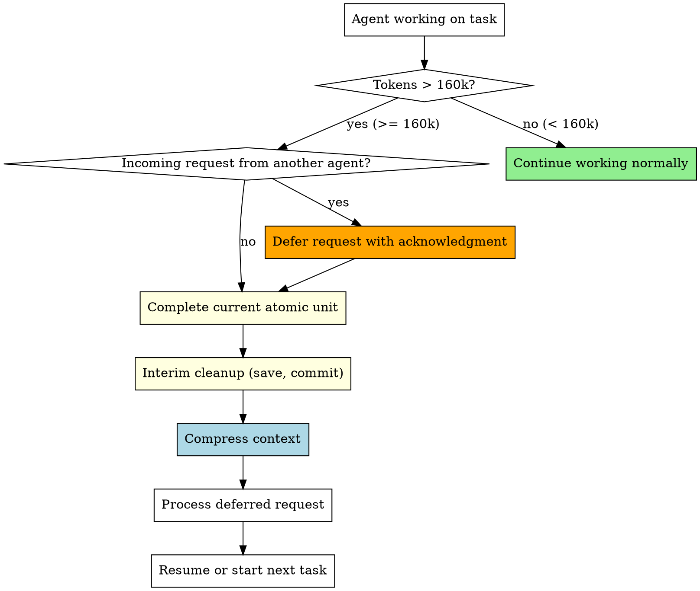

# Context Window Management

## Overview

When an agent's conversation exceeds 160k tokens, quality degrades — responses become less accurate, instructions get dropped, and critical context is lost. This skill enforces mandatory context compression at the 160k token threshold.

**Core principle:** Complete current work unit → interim cleanup → compress context → then continue. Never push past 160k tokens without compression.

**Announce at start:** "I'm using the context-window-management skill to compress context before continuing."

## When to Use

This skill applies to ALL agents in a team at ALL times:
- Team Lead monitoring agent health
- Workers during task implementation
- Audit Agent during verification cycles

**Detection heuristics:** See `detection-heuristics.md` for token estimation methods and system signals.

<HARD-GATE>
When token usage exceeds 160k (or system auto-compression triggers):
1. You MUST complete your current atomic work unit (test, function, commit)
2. You MUST do interim cleanup — save progress, commit work
3. You MUST compress context before starting any new work
4. You MUST defer incoming messages until compression is complete
5. You MUST NOT start new tasks while in compression
This is non-negotiable. "Just one more thing" is how agents lose critical context.
</HARD-GATE>

## Context Threshold Rules

## The 160k Gate

When your conversation exceeds 160k tokens:

1. **STOP** accepting new work
2. **COMPLETE** your current atomic unit:
   - If writing a test: finish the test
   - If implementing a function: finish the function
   - If in a commit cycle: complete the commit
   - If mid-review: finish the current review item
3. **INTERIM CLEANUP** — save all progress:
   - Commit any uncommitted work with a descriptive message
   - Save any pending notes to files
   - Update TaskUpdate with current progress
4. **COMPRESS** — follow the full procedure in `compression-procedure.md`
5. **RESUME** with the saved state

## Quick Reference

| Situation | Action |
|-----------|--------|
| Tokens < 160k | Continue normally |
| Tokens >= 160k, no incoming | Complete unit → interim cleanup → compress → resume |
| Tokens >= 160k, incoming request | Defer request → complete unit → cleanup → compress → process request |
| Tokens >= 160k, CRITICAL broadcast | Process broadcast immediately → then compress |
| After compression | Process deferred messages first, then resume task |
| System auto-compressed | Treat as 160k threshold hit — do interim cleanup |

## Red Flags - STOP and Compress

**Never:**
- Start a new task when tokens exceed 160k
- Ignore the compression threshold
- Lose deferred messages during compression
- Compress without interim cleanup (commit work first!)
- Skip compression because "almost done"
- Ignore system auto-compression signals

## Integration

**Called by:**
- **superpowers:team-driven-development** — All team agents follow this skill
- All agents in any team-based workflow

**Pairs with:**
- **superpowers:audit-verification** — Audit state preserved through compression
- **superpowers:api-edr-validation** — API contracts preserved through compression
