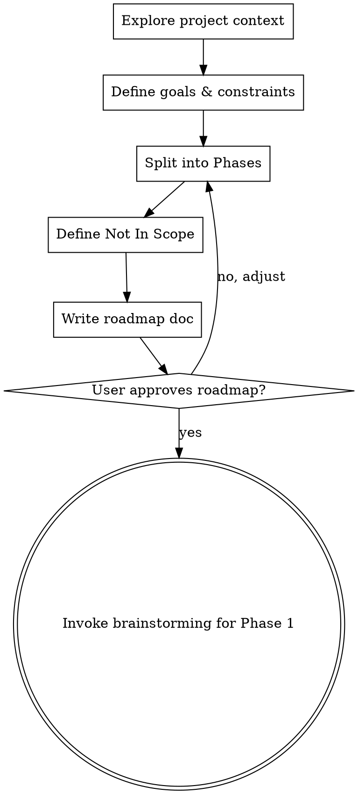

# Project Scoping — Roadmap Before Details

## Overview

Prevents brainstorming from jumping straight into detailed specs on large-scale projects.
Splits the entire project into Phases, defines each Phase's goal, scope, estimated size, and prerequisites,
then transitions to brainstorming.

**Announce at start:** "I'm using the project-scoping skill to define the project roadmap before diving into details."

<HARD-GATE>
The output of this skill is limited to the roadmap (Phases / goals / scope) only.
Detailed specs, API design, data models, and implementation details are handled in brainstorming.
"This Phase is simple, let's go straight to specs" → STOP. Every Phase goes through brainstorming.
"Only 1 Phase, so this skill is unnecessary" → STOP. Even with 1 Phase, clarify goals, scope, and Not In Scope.
</HARD-GATE>

## When to Use

Run this skill before brainstorming if any of the following apply:
- **New project** kickoff
- **Large-scale refactoring** (estimated 10+ tasks)
- **Large-scale code review fixes** (fixes derived from 10+ issues)
- **User explicitly invokes `/project-scoping`**

Do NOT use when:
- Single bug fix or single feature addition → go straight to brainstorming
- Continuing a subsequent Phase of a project that already has a roadmap

## Checklist

You MUST create a task for each of these items and complete them in order:

1. **Explore project context** — Review existing code, docs, CLAUDE.md, tech stack, and recent commits
2. **Define goals & constraints** — Clarify the project's ultimate goal, technical/business constraints, and priorities (ask one question at a time)
3. **Split into Phases** — Divide into 2-6 Phases, defining goal / scope / estimated task count / prerequisites for each
4. **Define Not In Scope** — Explicitly state what this project will NOT do
5. **Write roadmap doc** — Save to `docs/plans/YYYY-MM-DD-<project>-roadmap.md` and git commit
6. **Transition to brainstorming** — Invoke the brainstorming skill for the first Phase

## Process Flow



**The terminal state is invoking brainstorming for Phase 1.** Do NOT invoke writing-plans, team-driven-development, or any implementation skill. The ONLY skill you invoke after project-scoping is brainstorming.

## The Process

**Exploring context:**
- Check out the current project state (files, docs, CLAUDE.md, recent commits)
- Identify tech stack, existing architecture, key modules
- Check if docs/api/ exists and review existing contracts

**Defining goals & constraints:**
- Ask one question at a time to clarify the project's ultimate goal
- Identify technical constraints (existing schema, backward compatibility, etc.)
- Identify business constraints (timeline, priorities, resources)
- Prefer multiple choice questions when possible

**Splitting into Phases:**
- Each Phase should be independently deliverable (shippable increment)
- Phase boundaries should align with natural system boundaries (modules, layers)
- Each Phase should have a clear goal achievable in one brainstorming + implementation cycle
- Estimate task count roughly (brainstorming will refine)
- Define dependencies between Phases

**Defining Not In Scope:**
- Explicitly list what this project will NOT do
- This prevents scope creep during brainstorming and implementation
- Be specific: "Mobile app" not "Other features"

## Roadmap Document Format

```markdown
# <Project Name> Roadmap

> Created: YYYY-MM-DD
> Status: Active

## Goal
<The project's ultimate goal in 1-2 sentences>

## Constraints
- <Technical constraint>
- <Business constraint>

## Phase 1: <Phase Name>
- **Goal**: <One sentence — what is achieved when this Phase is complete>
- **Scope**: <Affected modules / directories>
- **Estimated tasks**: N
- **Prerequisites**: None

## Phase 2: <Phase Name>
- **Goal**: <One sentence>
- **Scope**: <Modules / directories>
- **Estimated tasks**: N
- **Prerequisites**: Phase 1 complete

## Not In Scope
- <Item 1>
- <Item 2>
```

## After the Roadmap

**Phase-by-phase progression:**
- After roadmap approval, proceed sequentially from Phase 1: brainstorming → writing-plans → team-driven-development
- Start brainstorming for the next Phase after completing each Phase
- Reference the roadmap document during brainstorming to stay within the current Phase's scope

## Key Principles

- **The roadmap is the big picture** — details come in brainstorming
- **Phases are independently deployable units** — each Phase produces a working deliverable
- **One question at a time** — ask questions one by one
- **Not In Scope is critical** — defining what's out of scope clarifies what's in scope
- **2-6 Phases** — too few is meaningless, too many makes the roadmap itself complex

## Red Flags — STOP and Follow Process

| Thought | Reality |
|---------|---------|
| "There's only 1 Phase" | Even with 1 Phase, clarify goals / scope / Not In Scope. |
| "Let's define detailed specs for this Phase here" | Detailed specs belong in brainstorming. The roadmap covers only goals and scope. |
| "We can jump straight to brainstorming" | For large projects, roadmap first. Designing without defined scope leads to scope creep. |
| "Dependencies between Phases are complex" | Re-split or merge Phases to simplify. |
| "We'll define Not In Scope later" | Not In Scope must be defined now. If deferred, items have already crept into scope. |
