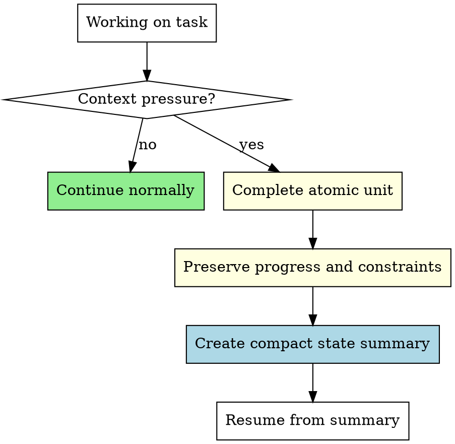

# Context Window Management In Codex

## Core Rule

When context pressure appears, finish the current atomic work unit, preserve task state, compact the working context, then continue. Do not start new work while essential state is at risk of being lost.

Announce when using this skill: "I'm using the context-window-management skill to preserve state before continuing."

## When To Use

Use this skill when any of these are true:

- The conversation is long enough that earlier instructions or decisions may be difficult to retain.
- The system has compacted or summarized earlier messages.
- You have performed many tool calls, read many files, or worked through several rounds of edits.
- You are about to hand off, pause, resume, or continue after a context transition.
- Verification obligations, blockers, owned paths, or uncommitted work could be forgotten.

Detection details are in `detection-heuristics.md`.

## Hard Gate

When context pressure is active:

1. Complete the current atomic unit: one test, one function, one review finding, one file edit, or one verification step.
2. Preserve visible progress with `update_plan` when tracking is useful.
3. Capture current task state before moving on: objective, constraints, owned files, changed files, commands run, verification still owed, blockers, and next action.
4. Avoid starting new tasks until the state summary is complete.
5. After any automatic compaction, rebuild the task state from the summary and verify obligations before claiming completion.

"One more change" is not a reason to skip state preservation.

## Context Threshold Rules

## Quick Reference

| Situation | Action |
| --- | --- |
| Context is stable | Continue normally. |
| Context pressure appears mid-edit | Finish the smallest coherent edit, then summarize state. |
| Context pressure appears before a new task | Summarize first, then decide whether to continue. |
| System compacts prior context | Reconstruct task state, re-read critical constraints if needed, and verify remaining obligations. |
| User sends a new request during preservation | Acknowledge briefly, finish the summary, then process the new request. |
| Critical blocker appears | Capture the blocker and current state immediately before acting further. |

## What To Preserve

Keep the compact summary focused on state needed to continue safely:

- User objective and current task status.
- Explicit constraints, forbidden paths, owned paths, and coordination notes.
- Files changed or intended to change.
- Important decisions and reasons.
- Commands already run, exact pass/fail state, and verification still required.
- Open blockers, risks, deferred user requests, and the immediate next step.

Drop verbose context that can be re-read or reproduced:

- Full file contents unless they are unavailable elsewhere.
- Long exploration trails that ended in dead ends.
- Repeated discussion once the conclusion is captured.
- Completed details beyond a one-line status.

Follow `compression-procedure.md` for the summary template.

## Codex-Specific Guidance

- Use `update_plan` for visible progress when the task has multiple steps or after compaction would otherwise hide state.
- Do not claim direct access to token counts or runtime context APIs. Estimate pressure from visible symptoms and conversation length.
- Do not mandate subagents. Use delegated agents only when the user explicitly authorized team-driven, subagent, reviewer, or parallel-agent mode.
- Do not commit, stage, or format as a context-management ritual. Only do those actions when the user requested them or the active workflow requires them.
- If work is uncommitted, record that fact and the relevant paths in the summary.
- Before any completion claim, preserve and satisfy verification obligations; pair with `verification-before-completion`.

## Common Mistakes

- Treating automatic compaction as success instead of a signal to re-check task state.
- Summarizing only what changed and omitting what remains to verify.
- Losing user constraints such as owned paths, forbidden files, or "do not commit."
- Starting a new task before recording blockers and next actions.
- Assuming a team runtime exists when the current Codex session is working inline.
