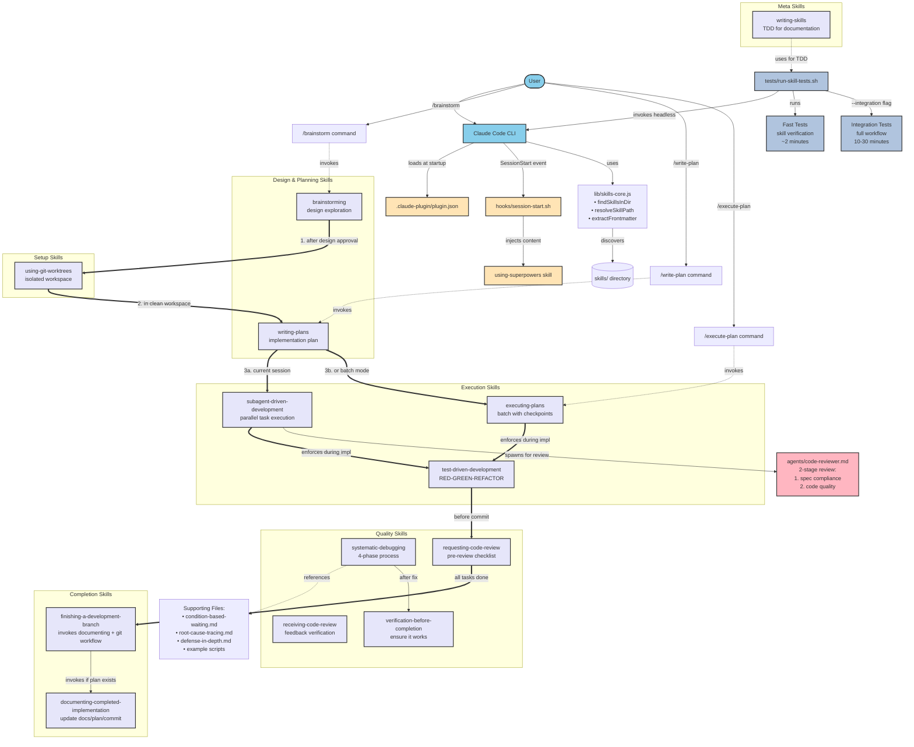
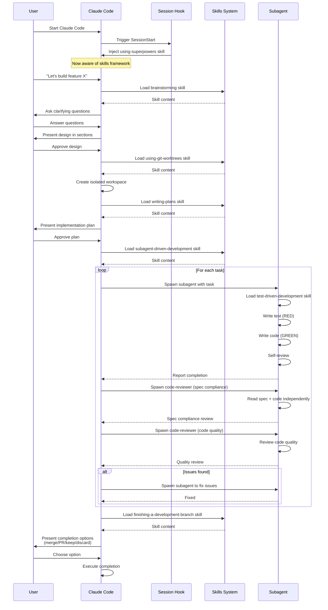
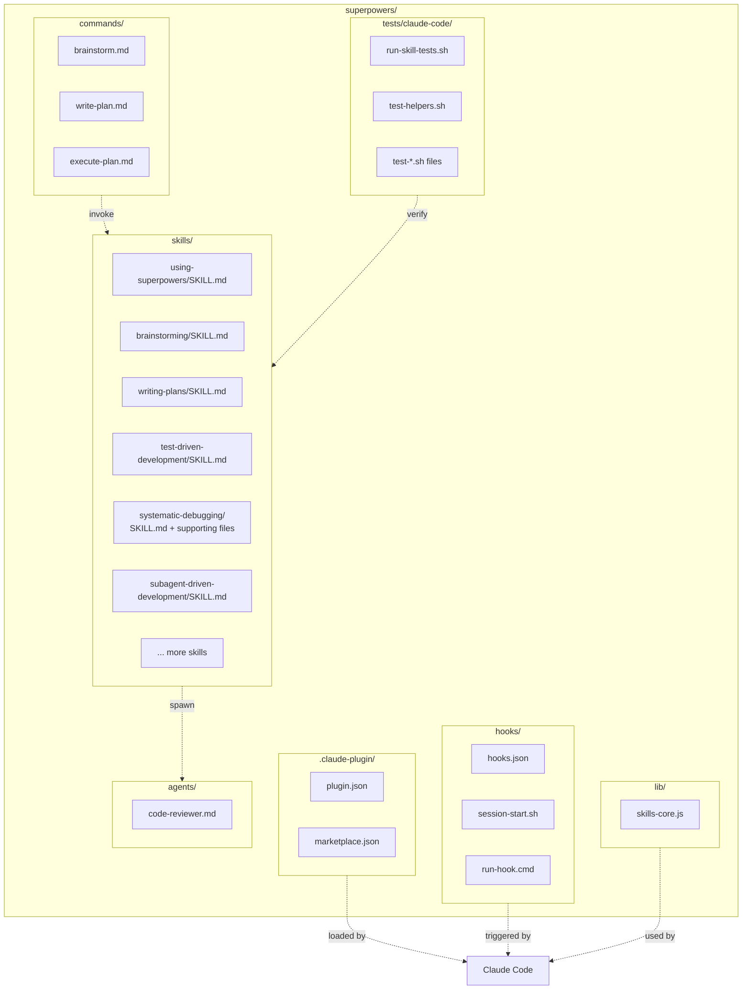
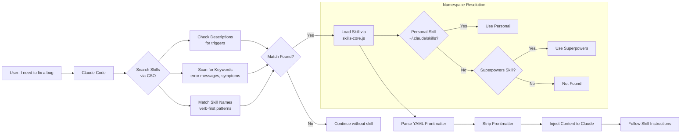
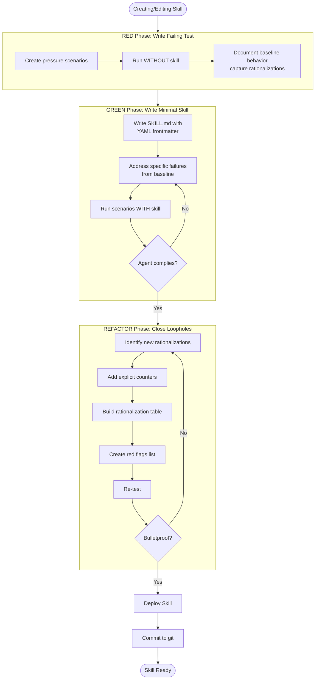

# Superpowers Architecture Visualization

## Complete System Flow

## Workflow Sequence (Typical Development Session)

## File Organization Structure

## Skill Discovery & Loading (CSO)

## Testing Workflow (TDD for Skills)

## Legend

- **Solid thick arrows (==>)**: Main workflow sequence
- **Solid arrows (-->)**: Direct usage/invocation
- **Dashed arrows (-.->)**: References/points to
- **User layer**: Light blue
- **Plugin/Hook system**: Light orange
- **Skills**: Lavender
- **Agents**: Pink
- **Testing**: Steel blue
