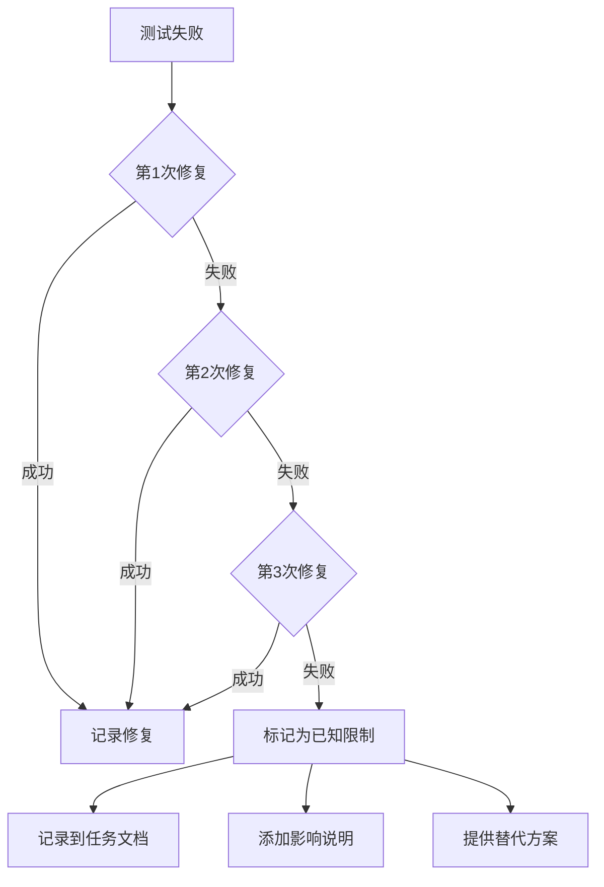

# Windows Hooks CI 自动化测试实施计划

> **For Claude:** REQUIRED SUB-SKILL: Use horspowers:executing-plans to implement this plan task-by-task.

**日期**: 2026-01-26

## 目标

通过 GitHub Actions 在真实 Windows 环境中测试 Horspowers session-start hook，发现并修复兼容性问题，或记录已知限制。

## 架构方案

使用 GitHub Actions 的 `windows-latest` runner（Windows Server 2022 + Git for Windows）执行自动化测试，覆盖以下场景：

1. **核心功能**: run-hook.cmd 和 session-start.sh 的基本执行
2. **路径处理**: Windows 反斜杠路径到 Git Bash MSYS2 路径的转换
3. **错误处理**: 缺少参数、文件不存在等异常情况
4. **跨目录**: 从不同工作目录执行 hook
5. **回归测试**: 确保 Windows 修复不破坏 macOS/Linux

**技术栈**:
- GitHub Actions (YAML workflow)
- Windows CMD / Git Bash
- Node.js (session-start.sh 依赖)
- jq (JSON 解析验证)

## 任务分解

### Task 1: 创建 CI 测试框架
**描述**: 创建 GitHub Actions workflow 文件，定义测试用例

**验收点**:
- [ ] `.github/workflows/test-windows-hooks.yml` 文件存在
- [ ] 包含 Windows 和 macOS 两个 job
- [ ] 至少定义 10 个核心测试用例
- [ ] workflow 语法正确（通过 GitHub 验证）
- [ ] 推送到远程仓库触发首次运行

**预计时间**: 已完成

---

### Task 2: 分析首次测试结果
**描述**: 查看 GitHub Actions 运行结果，识别失败用例

**验收点**:
- [ ] 记录每个测试用例的通过/失败状态到任务文档
- [ ] 收集所有失败用例的错误日志
- [ ] 分析失败原因（代码问题/环境问题/测试问题）
- [ ] 创建 `测试报告 - 首次运行.md`

**预计时间**: 10-15 分钟

---

### Task 3: 修复代码问题（迭代）
**描述**: 逐个修复测试发现的代码问题

**约束**:
- 每个失败用例最多尝试 **3 次** 修复
- 连续 3 次修复失败后，标记为「已知限制」
- **禁止删除测试用例或降低测试标准**

**验收点**:
- [ ] 每个修复都有独立的 git commit
- [ ] Commit message 格式: `fix: [问题描述]`
- [ ] 推送修复后等待 CI 验证
- [ ] 无法修复的问题记录到任务文档「已知限制」章节

**预计时间**: 30-60 分钟（取决于问题数量）

---

### Task 4: 生成最终测试报告
**描述**: 汇总测试结果，提供明确结论

**验收点**:
- [ ] 创建 `测试报告 - 最终.md`
- [ ] 包含所有测试用例的最终状态
- [ ] 列出所有修复的问题和对应 commits
- [ ] 列出所有已知限制和替代方案
- [ ] 如有用户影响，提供升级建议
- [ ] 更新相关文档（README, polyglot-hooks.md）

**预计时间**: 15-20 分钟

---

## 测试用例详细说明

### 核心功能测试（必须全部通过）

| ID | 测试内容 | 实现方式 | 预期结果 |
|----|---------|---------|---------|
| T1 | bash.exe 查找 | `where bash` 或检查常见路径 | 找到 bash.exe |
| T2 | Polyglot 语法 | 检查 run-hook.cmd 中的 CMDBLOCK 标记 | CMD 和 bash 都能解析 |
| T3 | session-start.sh 语法 | `bash -n hooks/session-start.sh` | 无语法错误 |
| T4 | Hook 基本执行 | `run-hook.cmd session-start.sh` | 退出码 0 |
| T5 | JSON 输出 | 解析输出 JSON，验证结构 | 有效 JSON |
| T6 | 技能内容注入 | 检查输出包含 "using-horspowers" | 字符串存在 |
| T7 | 技能标记 | 检查 EXTREMELY_IMPORTANT | 字符串存在 |
| T8 | 缺少参数错误 | `run-hook.cmd` 无参数 | 退出码非 0 |
| T9 | 不存在脚本错误 | `run-hook.cmd nonexistent.sh` | 退出码非 0 |
| T10 | 跨目录执行 | 从 /tmp 执行 hook | 退出码 0 |

### 回归测试

| ID | 测试内容 | 实现方式 | 预期结果 |
|----|---------|---------|---------|
| T11 | macOS 兼容性 | 在 macOS runner 执行相同测试 | 退出码 0 |

---

## 已知限制处理流程

当测试用例连续 3 次修复失败时：



**已知限制记录模板**:

```markdown
### 限制 #[序号]: [标题]

**问题描述**: [详细描述]

**影响范围**: [受影响的用户场景]

**失败原因**: [技术限制或环境限制]

**用户影响**: [对用户的具体影响]

**替代方案**: [用户如何绕过问题]

**测试证据**: [CI 日志链接或片段]
```

---

## 风险与缓解

| 风险 | 概率 | 影响 | 缓解措施 |
|------|------|------|---------|
| CI 环境与用户环境差异 | 中 | 中 | 记录已知限制，建议真实设备测试 |
| 测试用例本身有 bug | 低 | 高 | 先在本地验证测试脚本 |
| 修复引入新问题 | 中 | 中 | 保留完整测试套件，每次运行全部测试 |
| GitHub Actions 配额限制 | 低 | 低 | 只在 push 时触发，不频繁运行 |

---

## 完成标准

- [ ] 所有核心功能测试（T1-T10）通过或记录为已知限制
- [ ] macOS 回归测试（T11）通过
- [ ] 最终测试报告完成
- [ ] 相关文档更新（README, polyglot-hooks.md）
- [ ] 代码推送到远程仓库

---

## 相关文档

- [任务文档](../active/2026-01-26-task-windows-hooks-ci-testing.md)
- [测试 Workflow](.github/workflows/test-windows-hooks.yml)
- [Polyglot Hooks 文档](../windows/polyglot-hooks.md)
- [原始 Bug Report](../active/2026-01-23-bug-windows-session-hook-failure.md)
