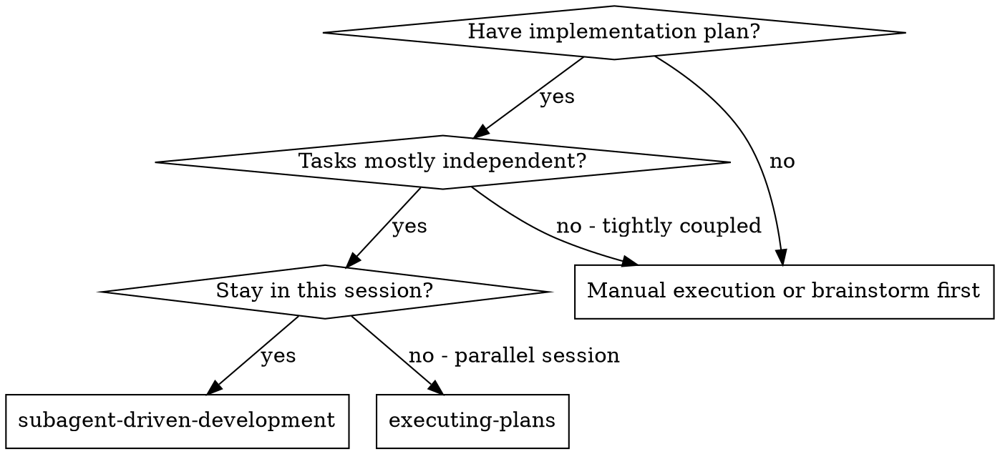
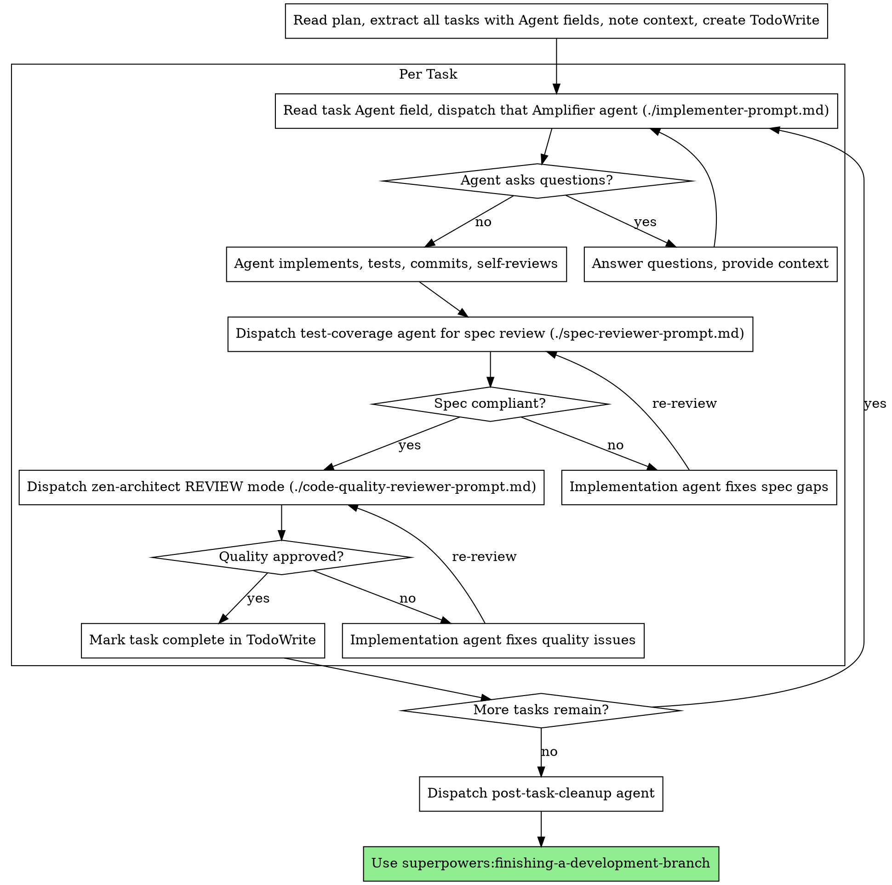
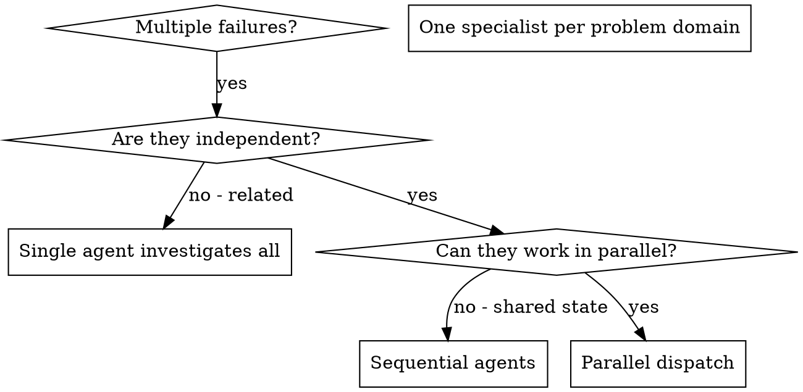

# Superpowers + Amplifier v2 Integration - Implementation Plan

> **For Claude:** REQUIRED SUB-SKILL: Use superpowers:subagent-driven-development to execute this plan task-by-task.

**Goal:** Integrate Amplifier v2's 30 specialized agents into superpowers skills so that plans reference agents, execution dispatches them, and reviews use the right specialists.

**Architecture:** Add a shared agent mapping reference file (AMPLIFIER-AGENTS.md), then modify 5 skill files to consult it. Core superpowers discipline (TDD, verification, red flags) stays untouched. We add agent awareness to the existing workflow, not rewrite it.

**Tech Stack:** Markdown skill files, Claude Code Task tool with subagent_type parameter

---

### Task 1: Create shared agent mapping reference

**Agent:** modular-builder

**Files:**
- Create: `AMPLIFIER-AGENTS.md`

**Step 1: Create the agent mapping file**

Create `AMPLIFIER-AGENTS.md` at the repo root with this exact content:

```markdown
# Amplifier Agent Mapping

Reference for superpowers skills. Consult this to select the right Amplifier agent for each task.

## Task Type to Agent

| Task Type | Agent | Trigger Keywords |
|-----------|-------|-----------------|
| Architecture/Design | `zen-architect` | plan, design, architect, structure, module spec, system design |
| Implementation | `modular-builder` | implement, build, create, add, write code |
| Testing | `test-coverage` | test, coverage, verify, validate, assertion |
| Debugging | `bug-hunter` | fix, debug, error, failure, broken, regression |
| Security Review | `security-guardian` | security, auth, secrets, OWASP, vulnerability, permission |
| Integration | `integration-specialist` | API, MCP, external, dependency, connection, integration |
| Performance | `performance-optimizer` | performance, slow, optimize, bottleneck, latency |
| Cleanup | `post-task-cleanup` | cleanup, hygiene, lint, format, unused, dead code |
| UI/Component | `component-designer` | component, UI, frontend, visual, layout, style |
| API Design | `api-contract-designer` | endpoint, contract, REST, GraphQL, schema, route |
| Database | `database-architect` | schema, migration, query, index, table, database |

## Review Agent Mapping

| Review Type | Agent | When |
|-------------|-------|------|
| Spec Compliance | `test-coverage` | After every implementation task |
| Code Quality | `zen-architect` (REVIEW mode) | After spec compliance passes |
| Security | `security-guardian` | Security-sensitive tasks or final review |
| Post-completion | `post-task-cleanup` | After all tasks pass, before finishing branch |

## Selection Rules

1. Match task description keywords against the Trigger Keywords column
2. If multiple agents match, pick the one whose Task Type best describes the primary goal
3. Implementation tasks default to `modular-builder` unless a more specific agent fits
4. Review tasks always use the Review Agent Mapping above
5. When unsure, `modular-builder` for building and `bug-hunter` for fixing
```

**Step 2: Verify the file**

Run: `cat AMPLIFIER-AGENTS.md | head -5`
Expected: Shows the title and first lines

**Step 3: Commit**

```bash
git add AMPLIFIER-AGENTS.md
git commit -m "feat: add Amplifier agent mapping reference for skills"
```

---

### Task 2: Update brainstorming skill to be session hub with agent awareness

**Agent:** modular-builder

**Files:**
- Modify: `skills/brainstorming/SKILL.md`

**Step 1: Replace the full content of `skills/brainstorming/SKILL.md`**

Write this exact content:

```markdown
---
name: brainstorming
description: "You MUST use this before any creative work - creating features, building components, adding functionality, or modifying behavior. Explores user intent, requirements and design before implementation. This is the recommended starting point for most productive sessions."
---

# Brainstorming Ideas Into Designs

## Overview

Help turn ideas into fully formed designs and specs through natural collaborative dialogue. This is the central starting point for most sessions — it gathers context, explores the problem, designs the solution, identifies which Amplifier agents will handle each phase, and routes to the right execution workflow.

Start by understanding the current project context, then ask questions one at a time to refine the idea. Once you understand what you're building, present the design in small sections (200-300 words), checking after each section whether it looks right so far.

## Session Start

Before diving into the idea:

1. **Context gathering** — Check project state (files, docs, recent commits, open branches, existing plans)
2. **Memory consultation** — Search episodic memory for related past conversations, decisions, and lessons learned (use episodic-memory:search-conversations if available)
3. **Agent awareness** — Identify which Amplifier agents are relevant for this task (consult `AMPLIFIER-AGENTS.md` at repo root for the full mapping)

Surface the relevant agents early: "For this task, we'll likely use zen-architect for design, modular-builder for implementation, and test-coverage for verification."

## The Process

**Understanding the idea:**
- Ask questions one at a time to refine the idea
- Prefer multiple choice questions when possible, but open-ended is fine too
- Only one question per message - if a topic needs more exploration, break it into multiple questions
- Focus on understanding: purpose, constraints, success criteria

**Exploring approaches:**
- Propose 2-3 different approaches with trade-offs
- Present options conversationally with your recommendation and reasoning
- Lead with your recommended option and explain why
- Note which Amplifier agents each approach would involve

**Presenting the design:**
- Once you believe you understand what you're building, present the design
- Break it into sections of 200-300 words
- Ask after each section whether it looks right so far
- Cover: architecture, components, data flow, error handling, testing
- Be ready to go back and clarify if something doesn't make sense

## Agent Allocation Section

Every design MUST include an Agent Allocation section before handoff. This tells writing-plans which agents to assign to each task.

```markdown
## Agent Allocation

| Phase | Agent | Responsibility |
|-------|-------|---------------|
| Architecture | zen-architect | System design, module boundaries |
| Implementation | modular-builder | Build from specs |
| Testing | test-coverage | Test strategy and coverage |
| Security | security-guardian | Pre-deploy review |
| Cleanup | post-task-cleanup | Final hygiene pass |
```

Adjust the table based on what the design actually needs. Not every project needs every agent. Only list agents that will be used.

## After the Design

**Documentation:**
- Write the validated design to `docs/plans/YYYY-MM-DD-<topic>-design.md`
- Include the Agent Allocation section in the design doc
- Use elements-of-style:writing-clearly-and-concisely skill if available
- Commit the design document to git

**Workflow routing — recommend the right execution path:**
- **Simple task** (1-2 files, clear requirements) → implement directly with the appropriate Amplifier agent
- **Medium task** (3-10 files, multiple steps) → write plan with superpowers:writing-plans → execute with superpowers:subagent-driven-development
- **Complex task** (10+ files, independent subsystems) → write plan → use superpowers:dispatching-parallel-agents for independent pieces
- **Investigation** (bugs, failures, unknowns) → dispatch bug-hunter or parallel specialists via superpowers:dispatching-parallel-agents

**Implementation (if continuing):**
- Ask: "Ready to set up for implementation?"
- Use superpowers:using-git-worktrees to create isolated workspace
- Use superpowers:writing-plans to create detailed implementation plan (it will use the Agent Allocation to assign agents per task)

## Key Principles

- **One question at a time** - Don't overwhelm with multiple questions
- **Multiple choice preferred** - Easier to answer than open-ended when possible
- **YAGNI ruthlessly** - Remove unnecessary features from all designs
- **Explore alternatives** - Always propose 2-3 approaches before settling
- **Incremental validation** - Present design in sections, validate each
- **Be flexible** - Go back and clarify when something doesn't make sense
- **Agent-aware design** - Know which specialists are available and plan for their use
```

**Step 2: Verify the file parses correctly**

Run: `head -4 skills/brainstorming/SKILL.md`
Expected: Shows YAML frontmatter with `name: brainstorming`

**Step 3: Commit**

```bash
git add skills/brainstorming/SKILL.md
git commit -m "feat: brainstorming as session hub with Amplifier agent awareness"
```

---

### Task 3: Update writing-plans skill with Agent field per task

**Agent:** modular-builder

**Files:**
- Modify: `skills/writing-plans/SKILL.md`

**Step 1: Replace the full content of `skills/writing-plans/SKILL.md`**

Write this exact content:

```markdown
---
name: writing-plans
description: Use when you have a spec or requirements for a multi-step task, before touching code
---

# Writing Plans

## Overview

Write comprehensive implementation plans assuming the engineer has zero context for our codebase and questionable taste. Document everything they need to know: which files to touch for each task, code, testing, docs they might need to check, how to test it. Give them the whole plan as bite-sized tasks. DRY. YAGNI. TDD. Frequent commits.

Assume they are a skilled developer, but know almost nothing about our toolset or problem domain. Assume they don't know good test design very well.

**Announce at start:** "I'm using the writing-plans skill to create the implementation plan."

**Context:** This should be run in a dedicated worktree (created by brainstorming skill).

**Save plans to:** `docs/plans/YYYY-MM-DD-<feature-name>.md`

## Amplifier Agent Assignment

Each task gets an `Agent:` field specifying which Amplifier agent will handle it during execution. Consult `AMPLIFIER-AGENTS.md` at the repo root for the full mapping.

**Auto-assign by scanning the task description:**
- Implementation tasks (build, create, add) → `modular-builder`
- Test tasks (test, coverage, verify) → `test-coverage`
- Fix/debug tasks (fix, debug, error) → `bug-hunter`
- Security tasks (auth, secrets, permissions) → `security-guardian`
- API tasks (endpoint, contract, route) → `api-contract-designer`
- Database tasks (schema, migration, query) → `database-architect`
- UI tasks (component, frontend, visual) → `component-designer`
- Integration tasks (API, MCP, external) → `integration-specialist`
- Performance tasks (optimize, bottleneck) → `performance-optimizer`

When in doubt, use `modular-builder` for building and `bug-hunter` for fixing.

**Review tasks use dedicated agents:**
- Spec compliance review → `test-coverage`
- Code quality review → `zen-architect` (REVIEW mode)
- Security review → `security-guardian`
- Final cleanup → `post-task-cleanup`

## Bite-Sized Task Granularity

**Each step is one action (2-5 minutes):**
- "Write the failing test" - step
- "Run it to make sure it fails" - step
- "Implement the minimal code to make the test pass" - step
- "Run the tests and make sure they pass" - step
- "Commit" - step

## Plan Document Header

**Every plan MUST start with this header:**

```markdown
# [Feature Name] Implementation Plan

> **For Claude:** REQUIRED SUB-SKILL: Use superpowers:subagent-driven-development to execute this plan task-by-task. Each task specifies its Agent — dispatch that Amplifier agent as the subagent for implementation.

**Goal:** [One sentence describing what this builds]

**Architecture:** [2-3 sentences about approach]

**Tech Stack:** [Key technologies/libraries]

---
```

## Task Structure

```markdown
### Task N: [Component Name]

**Agent:** [agent-name from AMPLIFIER-AGENTS.md]

**Files:**
- Create: `exact/path/to/file.py`
- Modify: `exact/path/to/existing.py:123-145`
- Test: `tests/exact/path/to/test.py`

**Step 1: Write the failing test**

` ` `python
def test_specific_behavior():
    result = function(input)
    assert result == expected
` ` `

**Step 2: Run test to verify it fails**

Run: `pytest tests/path/test.py::test_name -v`
Expected: FAIL with "function not defined"

**Step 3: Write minimal implementation**

` ` `python
def function(input):
    return expected
` ` `

**Step 4: Run test to verify it passes**

Run: `pytest tests/path/test.py::test_name -v`
Expected: PASS

**Step 5: Commit**

` ` `bash
git add tests/path/test.py src/path/file.py
git commit -m "feat: add specific feature"
` ` `
```

## Review Tasks

Include explicit review tasks in the plan for security-sensitive or complex implementations:

```markdown
### Task N+1: Security Review

**Agent:** security-guardian

**Scope:** Review Tasks 1-N for OWASP Top 10, secret detection, auth patterns
**Output:** Security findings with file:line references
**Action:** If issues found, create fix tasks and re-review
```

## Remember
- Exact file paths always
- Complete code in plan (not "add validation")
- Exact commands with expected output
- Reference relevant skills with @ syntax
- DRY, YAGNI, TDD, frequent commits
- Every task has an Agent: field

## Execution Handoff

After saving the plan, offer execution choice:

**"Plan complete and saved to `docs/plans/<filename>.md`. Two execution options:**

**1. Subagent-Driven (this session)** - I dispatch fresh Amplifier agents per task (using each task's Agent field), with two-stage review between tasks

**2. Parallel Session (separate)** - Open new session with executing-plans, batch execution with checkpoints

**Which approach?"**

**If Subagent-Driven chosen:**
- **REQUIRED SUB-SKILL:** Use superpowers:subagent-driven-development
- Stay in this session
- Fresh Amplifier agent per task + two-stage review

**If Parallel Session chosen:**
- Guide them to open new session in worktree
- **REQUIRED SUB-SKILL:** New session uses superpowers:executing-plans
```

**Step 2: Verify the file**

Run: `head -4 skills/writing-plans/SKILL.md`
Expected: Shows YAML frontmatter with `name: writing-plans`

**Step 3: Commit**

```bash
git add skills/writing-plans/SKILL.md
git commit -m "feat: writing-plans with Amplifier agent assignment per task"
```

---

### Task 4: Update subagent-driven-development with Amplifier agent dispatch

**Agent:** modular-builder

**Files:**
- Modify: `skills/subagent-driven-development/SKILL.md`
- Modify: `skills/subagent-driven-development/implementer-prompt.md`

**Step 1: Replace the full content of `skills/subagent-driven-development/SKILL.md`**

Write this exact content:

```markdown
---
name: subagent-driven-development
description: Use when executing implementation plans with independent tasks in the current session
---

# Subagent-Driven Development

Execute plan by dispatching the Amplifier agent specified in each task, with two-stage review after each: spec compliance review first, then code quality review.

**Core principle:** Dispatch the right Amplifier specialist per task + two-stage review (spec then quality) = high quality, fast iteration

## When to Use



**vs. Executing Plans (parallel session):**
- Same session (no context switch)
- Fresh Amplifier agent per task (specialist knowledge + no context pollution)
- Two-stage review after each task: spec compliance first, then code quality
- Faster iteration (no human-in-loop between tasks)

## Amplifier Agent Dispatch

Each task in the plan has an `Agent:` field. Use it to dispatch the right specialist:

1. Read the task's `Agent:` field (e.g., `modular-builder`, `bug-hunter`, `database-architect`)
2. Dispatch that agent via the Task tool
3. Pass the full task text + context (never make subagent read the plan file)
4. The agent brings domain expertise to the implementation

**Review agents (from AMPLIFIER-AGENTS.md):**
- Spec compliance review → dispatch `test-coverage` agent
- Code quality review → dispatch `zen-architect` agent (REVIEW mode)
- Security-sensitive tasks → add `security-guardian` as third reviewer
- Parallel review is OK: spec-compliance and security reviews are read-only, they can run concurrently

**After all tasks complete:**
- Dispatch `post-task-cleanup` agent for codebase hygiene
- Then use superpowers:finishing-a-development-branch

## The Process



## Prompt Templates

- `./implementer-prompt.md` - Dispatch implementation agent (includes agent-specific context)
- `./spec-reviewer-prompt.md` - Dispatch test-coverage agent for spec compliance
- `./code-quality-reviewer-prompt.md` - Dispatch zen-architect for code quality

## Example Workflow

```
You: I'm using Subagent-Driven Development to execute this plan.

[Read plan file once: docs/plans/feature-plan.md]
[Extract all 5 tasks with full text, Agent fields, and context]
[Create TodoWrite with all tasks]

Task 1: Design auth module schema (Agent: database-architect)

[Dispatch database-architect agent with full task text + context]

database-architect: "Should we use separate tables for roles and permissions, or a combined approach?"

You: "Separate tables — we need fine-grained permission assignment."

database-architect: "Got it. Implementing now..."
[Later] database-architect:
  - Created migration for users, roles, permissions tables
  - Added indexes for common query patterns
  - Tests: 4/4 passing
  - Committed

[Dispatch test-coverage agent for spec compliance]
test-coverage: ✅ Spec compliant - schema matches requirements

[Dispatch zen-architect REVIEW mode for code quality]
zen-architect: Strengths: Clean schema. Issues: None. Approved.

[Mark Task 1 complete]

Task 2: Implement auth middleware (Agent: modular-builder)

[Dispatch modular-builder agent with full task text + context]

modular-builder: [No questions, proceeds with bricks-and-studs approach]
...

[After all tasks]
[Dispatch post-task-cleanup agent]
post-task-cleanup: Removed 2 unused imports, no other issues.

[Use superpowers:finishing-a-development-branch]
Done!
```

## Advantages

**vs. Manual execution:**
- Specialist agents bring domain expertise per task
- Fresh context per task (no confusion)
- Parallel-safe (subagents don't interfere)
- Subagent can ask questions (before AND during work)

**vs. Executing Plans:**
- Same session (no handoff)
- Continuous progress (no waiting)
- Review checkpoints automatic

**Efficiency gains:**
- No file reading overhead (controller provides full text)
- Controller curates exactly what context is needed
- Agent brings domain expertise (database-architect knows schema patterns)
- Questions surfaced before work begins (not after)

**Quality gates:**
- Self-review catches issues before handoff
- Spec compliance via test-coverage agent (testing expert verifies completeness)
- Code quality via zen-architect REVIEW mode (architecture expert verifies quality)
- Security review via security-guardian (when applicable)
- Post-task-cleanup ensures hygiene
- Review loops ensure fixes actually work

**Cost:**
- More subagent invocations (implementer + 2-3 reviewers per task)
- Controller does more prep work (extracting all tasks upfront)
- Review loops add iterations
- But catches issues early (cheaper than debugging later)

## Red Flags

**Never:**
- Start implementation on main/master branch without explicit user consent
- Skip reviews (spec compliance OR code quality)
- Proceed with unfixed issues
- Dispatch multiple implementation subagents in parallel (conflicts)
- Make subagent read plan file (provide full text instead)
- Skip scene-setting context (subagent needs to understand where task fits)
- Ignore subagent questions (answer before letting them proceed)
- Accept "close enough" on spec compliance (spec reviewer found issues = not done)
- Skip review loops (reviewer found issues = implementer fixes = review again)
- Let implementer self-review replace actual review (both are needed)
- **Start code quality review before spec compliance is ✅** (wrong order)
- Move to next task while either review has open issues
- Override the plan's Agent field without good reason

**If subagent asks questions:**
- Answer clearly and completely
- Provide additional context if needed
- Don't rush them into implementation

**If reviewer finds issues:**
- Implementer (same subagent) fixes them
- Reviewer reviews again
- Repeat until approved
- Don't skip the re-review

**If subagent fails task:**
- Dispatch fix subagent with specific instructions
- Don't try to fix manually (context pollution)

## Integration

**Required workflow skills:**
- **superpowers:using-git-worktrees** - REQUIRED: Set up isolated workspace before starting
- **superpowers:writing-plans** - Creates the plan this skill executes (with Agent: fields)
- **superpowers:requesting-code-review** - Code review template for reviewer subagents
- **superpowers:finishing-a-development-branch** - Complete development after all tasks

**Amplifier agents used:**
- **Implementation agents** - Per task's Agent: field (modular-builder, database-architect, etc.)
- **test-coverage** - Spec compliance reviewer
- **zen-architect** - Code quality reviewer (REVIEW mode)
- **security-guardian** - Security reviewer (when applicable)
- **post-task-cleanup** - Final hygiene pass

**Subagents should use:**
- **superpowers:test-driven-development** - Subagents follow TDD for each task

**Alternative workflow:**
- **superpowers:executing-plans** - Use for parallel session instead of same-session execution
```

**Step 2: Update the implementer prompt template**

Replace the full content of `skills/subagent-driven-development/implementer-prompt.md` with:

```markdown
# Implementer Subagent Prompt Template

Use this template when dispatching an implementation agent. The agent type comes from the task's `Agent:` field in the plan.

```
Task tool ([agent-name from task]):
  description: "Implement Task N: [task name]"
  prompt: |
    You are the [agent-name] agent implementing Task N: [task name]

    ## Your Strengths

    [Brief description of what this agent specializes in, from AMPLIFIER-AGENTS.md.
     Examples:
     - modular-builder: "You build self-contained, regeneratable modules following the bricks-and-studs philosophy."
     - database-architect: "You design clean schemas, optimize queries, and handle migrations."
     - bug-hunter: "You use hypothesis-driven debugging to find root causes systematically."
     - integration-specialist: "You handle external system integration with reliability and simplicity."]

    ## Task Description

    [FULL TEXT of task from plan - paste it here, don't make subagent read file]

    ## Context

    [Scene-setting: where this fits, dependencies, architectural context]

    ## Before You Begin

    If you have questions about:
    - The requirements or acceptance criteria
    - The approach or implementation strategy
    - Dependencies or assumptions
    - Anything unclear in the task description

    **Ask them now.** Raise any concerns before starting work.

    ## Your Job

    Once you're clear on requirements:
    1. Implement exactly what the task specifies
    2. Write tests (following TDD if task says to)
    3. Verify implementation works
    4. Commit your work
    5. Self-review (see below)
    6. Report back

    Work from: [directory]

    **While you work:** If you encounter something unexpected or unclear, **ask questions**.
    It's always OK to pause and clarify. Don't guess or make assumptions.

    ## Before Reporting Back: Self-Review

    Review your work with fresh eyes. Ask yourself:

    **Completeness:**
    - Did I fully implement everything in the spec?
    - Did I miss any requirements?
    - Are there edge cases I didn't handle?

    **Quality:**
    - Is this my best work?
    - Are names clear and accurate (match what things do, not how they work)?
    - Is the code clean and maintainable?

    **Discipline:**
    - Did I avoid overbuilding (YAGNI)?
    - Did I only build what was requested?
    - Did I follow existing patterns in the codebase?

    **Testing:**
    - Do tests actually verify behavior (not just mock behavior)?
    - Did I follow TDD if required?
    - Are tests comprehensive?

    If you find issues during self-review, fix them now before reporting.

    ## Report Format

    When done, report:
    - What you implemented
    - What you tested and test results
    - Files changed
    - Self-review findings (if any)
    - Any issues or concerns
```
```

**Step 3: Verify both files**

Run: `head -3 skills/subagent-driven-development/SKILL.md && head -3 skills/subagent-driven-development/implementer-prompt.md`
Expected: Shows YAML frontmatter and markdown header respectively

**Step 4: Commit**

```bash
git add skills/subagent-driven-development/SKILL.md skills/subagent-driven-development/implementer-prompt.md
git commit -m "feat: subagent-driven-dev dispatches Amplifier agents with specialist reviewers"
```

---

### Task 5: Update dispatching-parallel-agents with specialist selection

**Agent:** modular-builder

**Files:**
- Modify: `skills/dispatching-parallel-agents/SKILL.md`

**Step 1: Replace the full content of `skills/dispatching-parallel-agents/SKILL.md`**

Write this exact content:

```markdown
---
name: dispatching-parallel-agents
description: Use when facing 2+ independent tasks that can be worked on without shared state or sequential dependencies
---

# Dispatching Parallel Agents

## Overview

When you have multiple unrelated failures (different test files, different subsystems, different bugs), investigating them sequentially wastes time. Each investigation is independent and can happen in parallel.

**Core principle:** Dispatch the right Amplifier specialist per independent problem domain. Let them work concurrently.

## Amplifier Agent Selection

Consult `AMPLIFIER-AGENTS.md` for the full mapping. Quick reference for parallel dispatch:

| Problem Domain | Amplifier Agent | Why This Specialist |
|---------------|-----------------|-------------------|
| Test failures | `bug-hunter` | Hypothesis-driven debugging, root cause analysis |
| Performance issues | `performance-optimizer` | Measure-first approach, 80/20 optimization |
| Security findings | `security-guardian` | OWASP patterns, vulnerability assessment |
| Integration breakage | `integration-specialist` | External system expertise, dependency management |
| UI regressions | `component-designer` | Component-level assessment, visual consistency |
| Schema problems | `database-architect` | Query optimization, migration expertise |
| API failures | `api-contract-designer` | Contract validation, endpoint analysis |

## When to Use



**Use when:**
- 3+ test files failing with different root causes
- Multiple subsystems broken independently
- Each problem can be understood without context from others
- No shared state between investigations

**Don't use when:**
- Failures are related (fix one might fix others)
- Need to understand full system state
- Agents would interfere with each other

## The Pattern

### 1. Identify Independent Domains

Group failures by what's broken:
- File A tests: Tool approval flow
- File B tests: Batch completion behavior
- File C tests: Abort functionality

Each domain is independent - fixing tool approval doesn't affect abort tests.

### 2. Select Amplifier Specialist per Domain

Match each domain to the right agent from the mapping table above. Each specialist brings domain expertise — a `bug-hunter` uses hypothesis-driven analysis, a `security-guardian` checks OWASP patterns, a `performance-optimizer` measures before fixing.

### 3. Dispatch in Parallel

```
Single message, three parallel Task calls:
- Task bug-hunter: "Fix 3 failing tests in auth.test.ts — timing issues"
- Task integration-specialist: "API connection failures to payment service"
- Task performance-optimizer: "Response time regression in /api/search"
```

All three run concurrently with specialist knowledge.

### 4. Review and Integrate

When agents return:
- Read each summary
- Verify fixes don't conflict
- Run full test suite
- Integrate all changes

## Agent Prompt Structure

Good agent prompts are:
1. **Focused** - One clear problem domain
2. **Self-contained** - All context needed to understand the problem
3. **Specific about output** - What should the agent return?

```markdown
Fix the 3 failing tests in src/agents/agent-tool-abort.test.ts:

1. "should abort tool with partial output capture" - expects 'interrupted at' in message
2. "should handle mixed completed and aborted tools" - fast tool aborted instead of completed
3. "should properly track pendingToolCount" - expects 3 results but gets 0

These are timing/race condition issues. Your task:

1. Read the test file and understand what each test verifies
2. Identify root cause - timing issues or actual bugs?
3. Fix by:
   - Replacing arbitrary timeouts with event-based waiting
   - Fixing bugs in abort implementation if found
   - Adjusting test expectations if testing changed behavior

Do NOT just increase timeouts - find the real issue.

Return: Summary of what you found and what you fixed.
```

## Common Mistakes

**❌ Too broad:** "Fix all the tests" - agent gets lost
**✅ Specific:** "Fix agent-tool-abort.test.ts" - focused scope

**❌ No context:** "Fix the race condition" - agent doesn't know where
**✅ Context:** Paste the error messages and test names

**❌ No constraints:** Agent might refactor everything
**✅ Constraints:** "Do NOT change production code" or "Fix tests only"

**❌ Vague output:** "Fix it" - you don't know what changed
**✅ Specific:** "Return summary of root cause and changes"

**❌ Wrong specialist:** Sending bug-hunter for a performance regression
**✅ Right specialist:** Sending performance-optimizer who will measure first

## When NOT to Use

**Related failures:** Fixing one might fix others - investigate together first
**Need full context:** Understanding requires seeing entire system
**Exploratory debugging:** You don't know what's broken yet
**Shared state:** Agents would interfere (editing same files, using same resources)

## Key Benefits

1. **Specialist knowledge** - Each agent brings domain expertise to its problem
2. **Parallelization** - Multiple investigations happen simultaneously
3. **Focus** - Each agent has narrow scope, less context to track
4. **Independence** - Agents don't interfere with each other
5. **Speed** - 3 problems solved in time of 1

## Verification

After agents return:
1. **Review each summary** - Understand what changed
2. **Check for conflicts** - Did agents edit same code?
3. **Run full suite** - Verify all fixes work together
4. **Spot check** - Agents can make systematic errors
```

**Step 2: Verify the file**

Run: `head -4 skills/dispatching-parallel-agents/SKILL.md`
Expected: Shows YAML frontmatter with `name: dispatching-parallel-agents`

**Step 3: Commit**

```bash
git add skills/dispatching-parallel-agents/SKILL.md
git commit -m "feat: dispatching-parallel-agents selects Amplifier specialists per domain"
```

---

### Task 6: Update using-superpowers to point to brainstorming as session start

**Agent:** modular-builder

**Files:**
- Modify: `skills/using-superpowers/SKILL.md`

**Step 1: Add brainstorming emphasis to the Skill Priority section**

In `skills/using-superpowers/SKILL.md`, find the `## Skill Priority` section (around line 69) and replace it with:

```markdown
## Skill Priority

When multiple skills could apply, use this order:

1. **Brainstorming first for new work** - Start most sessions here. It gathers context, identifies Amplifier agents, designs the solution, and routes to the right execution workflow.
2. **Process skills for specific situations** (debugging, code review) - these determine HOW to approach known problems
3. **Implementation skills last** (frontend-design, mcp-builder) - these guide execution after planning

"Let's build X" → brainstorming first, then writing-plans, then subagent-driven-development.
"Fix this bug" → systematic-debugging first, then dispatching-parallel-agents if multiple issues.
"Review this code" → requesting-code-review.
```

**Step 2: Verify the edit**

Run: `grep -A5 "Skill Priority" skills/using-superpowers/SKILL.md`
Expected: Shows updated priority section with brainstorming emphasis

**Step 3: Commit**

```bash
git add skills/using-superpowers/SKILL.md
git commit -m "feat: using-superpowers points to brainstorming as session starting point"
```

---

### Task 7: Final review and push

**Agent:** post-task-cleanup

**Files:**
- All modified files from Tasks 1-6

**Step 1: Verify all files are committed**

Run: `git status`
Expected: Clean working tree

**Step 2: Verify file count and structure**

Run: `ls AMPLIFIER-AGENTS.md skills/brainstorming/SKILL.md skills/writing-plans/SKILL.md skills/subagent-driven-development/SKILL.md skills/subagent-driven-development/implementer-prompt.md skills/dispatching-parallel-agents/SKILL.md skills/using-superpowers/SKILL.md`
Expected: All 7 files listed

**Step 3: Verify YAML frontmatter parses for all skills**

Run: `for f in skills/brainstorming/SKILL.md skills/writing-plans/SKILL.md skills/subagent-driven-development/SKILL.md skills/dispatching-parallel-agents/SKILL.md skills/using-superpowers/SKILL.md; do echo "=== $f ===" && head -4 "$f"; done`
Expected: Each shows `---`, `name:`, `description:`, `---`

**Step 4: Review git log**

Run: `git log --oneline -7`
Expected: 6 commits from Tasks 1-6

**Step 5: Push to fork**

```bash
git push origin main
```
