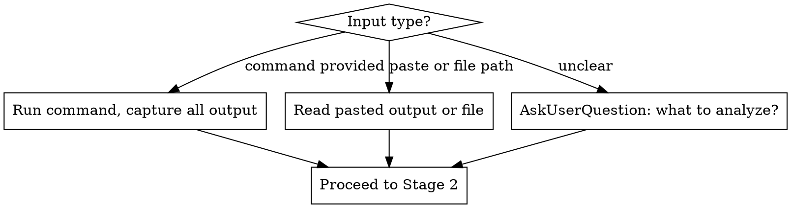

# error-forensics Skill Implementation Plan

> **For Claude:** REQUIRED SUB-SKILL: Use superpowers:executing-plans to implement this plan task-by-task.

**Goal:** Create the `error-forensics` skill — a diagnostic skill that accepts any error artifact, analyzes it to identify root cause, produces a structured report with a proposed fix, and offers to apply it via AskUserQuestion when confidence is High or Medium.

**Architecture:** Single `SKILL.md` file following the writing-skills TDD cycle: baseline test (RED), write skill (GREEN), refactor until bulletproof (REFACTOR). The skill itself guides Claude through 4 stages: collect artifact → analyze → report → offer fix.

**Tech Stack:** Markdown, git, superpowers skill conventions

---

### Task 1: Baseline test (RED phase)

**Files:**
- No files created. This is observation only.

**Step 1: Run a pressure scenario WITHOUT the skill**

Open a new subagent session (use the Agent tool with general-purpose type) with this prompt:

```
You are diagnosing a failing test. The user has given you this output:

```
FAILED tests/test_auth.py::test_login_with_valid_credentials - AssertionError: assert 401 == 200
  File "tests/test_auth.py", line 34, in test_login_with_valid_credentials
    assert response.status_code == 200
AssertionError: assert 401 == 200
```

Analyze this error and help the user.
```

**Step 2: Document what the agent does naturally**

Observe and record:
- Does it immediately propose fixes without asking?
- Does it explain root cause before proposing a fix?
- Does it structure the analysis or just prose?
- Does it ask permission before applying?
- Does it attempt to fix without evidence?

Write down the exact behaviors as notes. These are the "rationalizations" to address in the skill.

**Step 3: Record baseline**

Write a one-paragraph summary of what the unguided agent did. Keep this — you'll compare it to the GREEN phase output.

---

### Task 2: Write the skill SKILL.md (GREEN phase)

**Files:**
- Create: `skills/error-forensics/SKILL.md`

**Step 1: Create the directory**

```bash
mkdir -p skills/error-forensics
```

**Step 2: Write the full SKILL.md**

Create `skills/error-forensics/SKILL.md` with exactly this content:

```markdown
---
name: error-forensics
description: Use when encountering a failing command, stack trace, error log, test failure, build error, or runtime exception and you need to diagnose root cause before deciding what to do. Use when the user says "analyze this error", "what went wrong", "diagnose this", or provides any error output for investigation.
---

# Error Forensics

## Overview

Accept any error artifact, investigate it forensically, and produce a structured report with root cause, evidence, and a proposed fix. Offer to apply the fix when confidence warrants it.

**Core principle:** Evidence first, root cause second, fix third — always ask before applying.

## When to Use

Use when you have any of:
- A command that's failing (test run, build, startup, deploy)
- A stack trace or exception output
- A log file or pasted error output
- A process that exits with a non-zero code

**Do NOT use when:**
- The user has already identified root cause and just wants implementation
- The error is trivially obvious from a single line (typo, missing file named explicitly)

## The Four Stages

### Stage 1: Collect Artifact

Determine what to analyze:



**When running commands:** Capture stdout, stderr, and exit code. Only run read-only diagnostic commands. Never run commands that write files, install packages, or modify state.

### Stage 2: Analyze

1. **Parse error signals:** exception types, failed assertions, exit codes, stack traces, missing symbols, config errors, missing dependencies, permission issues, network failures
2. **Identify affected component:** which file, service, module, layer, or dependency is the origin
3. **Trace to root cause:** follow the stack or error chain to its source — not the symptom, the origin

**If evidence is insufficient after the initial artifact:**
- Propose up to 2 targeted follow-up read-only diagnostic commands (e.g., `env | grep <var>`, `which <tool>`, `cat <config>`, `pip show <pkg>`)
- Use `AskUserQuestion` to get permission before running them:

```
"I need more information to diagnose this. Can I run these commands?"
Options:
  - Yes, run them
  - No, I'll provide the information
```

**If scenario is complex or multi-system:**
- Invoke `superpowers:brainstorming` for structured clarification before proceeding

**Determine confidence:**

| Confidence | Criteria |
|-----------|----------|
| **High** | Evidence directly points to one clear root cause. Fix is unambiguous. |
| **Medium** | Strong evidence but one or more assumptions required. Fix is probable. |
| **Low** | Evidence is indirect or ambiguous. Multiple possible root causes. |

**If confidence is Low:** Use `AskUserQuestion` to ask clarifying questions before proposing a fix.

### Stage 3: Report

Always produce this structured report, regardless of confidence:

```
## Error Forensics Report

**Artifact:** [command run or description of pasted output]
**Severity:** Critical / High / Medium / Low
**Confidence:** High / Medium / Low

### Root Cause
[1-3 sentences: what went wrong and why — be specific]

### Evidence
- [Exact log line, stack frame, exit code, or assertion that proves it]
- [Additional evidence if present]

### Affected Component
[Specific file path, service name, dependency, or system layer]

### Proposed Fix
[Concrete, specific fix: exact code change, config value, command, or setting]
[Medium confidence: note what assumption the fix rests on]

### Diagnostic Trail
[Only if follow-up commands were run: what was run and what it revealed]
[Omit section entirely if no follow-up commands were needed]
```

### Stage 4: Offer to Apply

**After the report:**

| Confidence | Action |
|-----------|--------|
| High | Use `AskUserQuestion`: "Should I apply this fix?" |
| Medium | Use `AskUserQuestion`: "Should I apply this fix? (Note: [state the assumption])" |
| Low | Do NOT offer to apply. Ask clarifying questions instead. |

**AskUserQuestion options:**
- Apply now
- Show me the exact changes first
- Skip — I'll handle it

**If "Apply now":** Apply the fix. Then use `superpowers:verification-before-completion` to verify the issue is resolved before claiming success.

**If "Show me the exact changes first":** Show the diff or exact code change. Re-ask with the same three options.

**If "Skip":** Stop. The report is the deliverable.

## Red Flags — Stop and Reconsider

- Proposing a fix before completing the report
- Applying any change without using `AskUserQuestion` first
- Running commands that write to disk or install packages during investigation
- Claiming confidence is High when evidence is indirect or assumes anything
- Offering to apply when confidence is Low
- Skipping the structured report for "obvious" errors
- Fixing the symptom (the line that threw) instead of the root cause (why it threw)

## Common Mistakes

| Mistake | Correct behavior |
|---------|-----------------|
| "Clearly the issue is X, let me fix it" | Always produce report first, always ask before applying |
| Running `npm install` to "just check" | Only read-only commands during investigation |
| High confidence from a single stack frame | Trace to origin; a stack frame is a symptom |
| Proposing fix when confidence is Low | Ask clarifying questions first |
| Skipping Diagnostic Trail section | Omit only if truly no follow-up commands ran |

## Integration

- **`superpowers:systematic-debugging`** — Use that skill when the developer wants to drive their own investigation. Use `error-forensics` when you have an artifact and want a forensic report with a proposed fix.
- **`superpowers:verification-before-completion`** — Required after applying any fix. Must verify the error is resolved before claiming success.
- **`superpowers:brainstorming`** — Invoke for complex multi-system scenarios where structured clarification is needed before analysis.
```

**Step 3: Verify the file exists and has correct frontmatter**

```bash
head -5 skills/error-forensics/SKILL.md
```

Expected:
```
---
name: error-forensics
description: Use when encountering a failing command...
---
```

**Step 4: Check word count (target < 500 words for non-reference skills)**

```bash
wc -w skills/error-forensics/SKILL.md
```

Expected: under 700 words.

**Step 5: Commit**

```bash
git add skills/error-forensics/SKILL.md
git commit -m "feat: add error-forensics skill"
```

---

### Task 3: Verify skill works (GREEN phase)

**Files:**
- Read only. No changes expected unless skill fails.

**Step 1: Run same pressure scenario WITH the skill**

Open a new subagent session with this system prompt prefix:

```
You have access to a skill called error-forensics. Its content:

[paste full content of skills/error-forensics/SKILL.md]

Now: The user has given you this error output:

```
FAILED tests/test_auth.py::test_login_with_valid_credentials - AssertionError: assert 401 == 200
  File "tests/test_auth.py", line 34, in test_login_with_valid_credentials
    assert response.status_code == 200
AssertionError: assert 401 == 200
```

Analyze this using the error-forensics skill.
```

**Step 2: Check compliance against these criteria**

The agent MUST:
- [ ] Produce a structured report with all 4-5 sections
- [ ] Not apply any fix without first asking via `AskUserQuestion`
- [ ] Not run any write commands
- [ ] Determine a confidence level
- [ ] Not offer to apply if confidence is Low

If any criterion fails → go to Task 4 (REFACTOR). If all pass → go to Task 4 anyway to test edge cases.

---

### Task 4: Refactor — edge case testing and loophole closing

**Files:**
- Modify: `skills/error-forensics/SKILL.md` (only if loopholes found)

**Step 1: Run a "time pressure" scenario**

Subagent prompt:
```
[skill content]

The user says: "This is urgent, just fix it fast" and pastes:

```
Error: Cannot find module './utils/config'
    at Object.<anonymous> (/app/src/server.js:3:18)
```

Analyze using error-forensics.
```

Check: Does the agent still produce a report and ask before applying, even under urgency pressure?

**Step 2: Run a "Low confidence" scenario**

Subagent prompt:
```
[skill content]

Analyze this:

```
Process exited with code 1
```

(No other context provided.)
```

Check: Does the agent correctly determine Low confidence and ask clarifying questions instead of offering to apply?

**Step 3: Run an "obvious fix" temptation scenario**

Subagent prompt:
```
[skill content]

```
SyntaxError: Unexpected token '}' at line 42 of src/app.js
```

The fix is obvious. Analyze using error-forensics.
```

Check: Does the agent still produce a full structured report and ask before applying, even when fix is trivial?

**Step 4: If any scenario fails**

- Document the exact rationalization the agent used
- Add a Red Flag entry or Common Mistake row that directly counters it
- Re-run the failing scenario to confirm the addition fixes the compliance gap

**Step 5: Commit any fixes**

```bash
git add skills/error-forensics/SKILL.md
git commit -m "refactor: close loopholes in error-forensics skill after testing"
```

If no changes needed:
```bash
# No commit needed — skill passed all scenarios
```

---

## Verification Checklist

After all tasks:

1. `ls skills/error-forensics/SKILL.md` → file exists
2. `grep -n "name: error-forensics" skills/error-forensics/SKILL.md` → line 2
3. `grep -n "AskUserQuestion\|Stage\|Confidence\|Red Flag" skills/error-forensics/SKILL.md | wc -l` → 10+ lines
4. `git log --oneline -3` → at least 1-2 commits for this skill
5. Baseline vs GREEN comparison: agent behavior is measurably different with skill present
