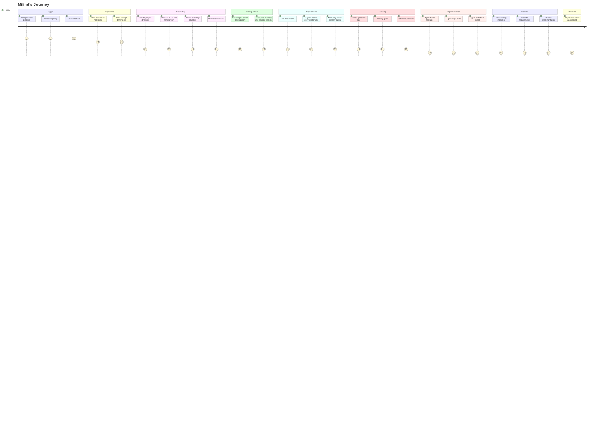

```mermaid
journey
    title Milind's Journey
    section Trigger
      Recognize the problem: 5: Milind
      Assess urgency: 5: Milind
      Decide to build: 5: Milind
    section Crystallize
      Write problem in notebook: 4: Milind
      Think through dimensions: 4: Milind
    section Scaffolding
      Create project directory: 2: Milind
      Write CLAUDE.md from scratch: 2: Milind
      Set up directory structure: 2: Milind
      Define conventions: 2: Milind
    section Configuration
      Set up spec-driven development: 2: Milind
      Configure memory and session tracking: 2: Milind
    section Requirements
      Run /brainstorm: 2: Milind
      Explain needs conversationally: 2: Milind
      Manually enrich shallow output: 2: Milind
    section Planning
      Review generated plan: 2: Milind
      Identify gaps: 2: Milind
      Patch requirements: 2: Milind
    section Implementation
      Agent builds features: 1: Milind
      Agent skips tests: 1: Milind
      Agent drifts from intent: 1: Milind
    section Rework
      Scrap wrong modules: 1: Milind
      Rewrite requirements: 1: Milind
      Restart implementation: 1: Milind
    section Outcome
      Project stalls or is abandoned: 1: Milind
```