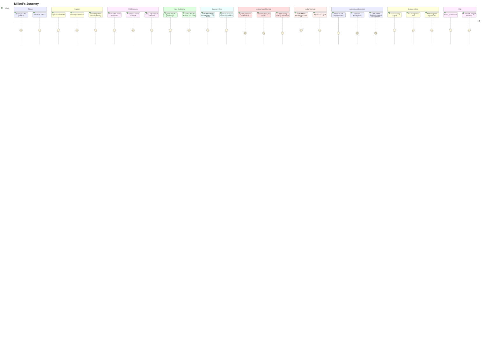

```mermaid
journey
    title Milind's Journey
    section Trigger
      Recognize the problem: 5: Milind
      Decide to solve it: 5: Milind
    section Capture
      Open Claude Code: 5: Milind
      Invoke /pm-discover: 5: Milind
      Describe problem conversationally: 5: Milind
    section PM Discovery
      Structured 6-phase discovery: 5: Milind
      Automated market research: 5: Milind
      Deep requirement extraction: 5: Milind
    section Auto-Scaffolding
      System detects project type: 5: Milind
      Generates directory structure and config: 5: Milind
    section Judgment Gate #1
      Review personas, journey maps, PRD, stories: 5: Milind
      Approve, revise, or reject each artifact: 5: Milind
    section Autonomous Planning
      System generates architecture: 4: Milind
      Implementation plan created: 4: Milind
      Model routing strategy determined: 4: Milind
    section Judgment Gate #2
      Review plan, architecture, trade-offs: 5: Milind
      Approve or adjust: 5: Milind
    section Autonomous Execution
      Model-routed implementation: 4: Milind
      Test-first development: 4: Milind
      Progressive disclosure context management: 4: Milind
    section Judgment Gate #3
      Review working output: 5: Milind
      Run acceptance tests: 5: Milind
      Validate against requirements: 5: Milind
    section Ship
      CI/CD pipeline runs: 5: Milind
      PR created, merged, deployed: 5: Milind
```