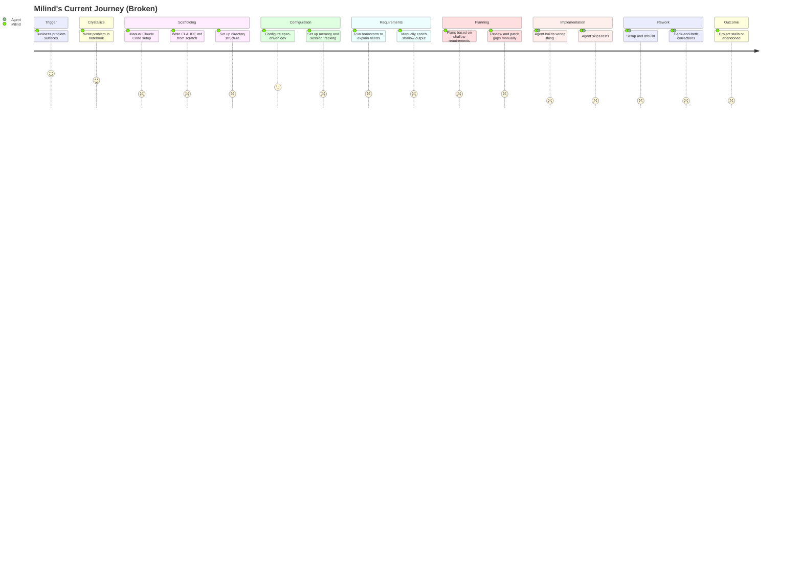
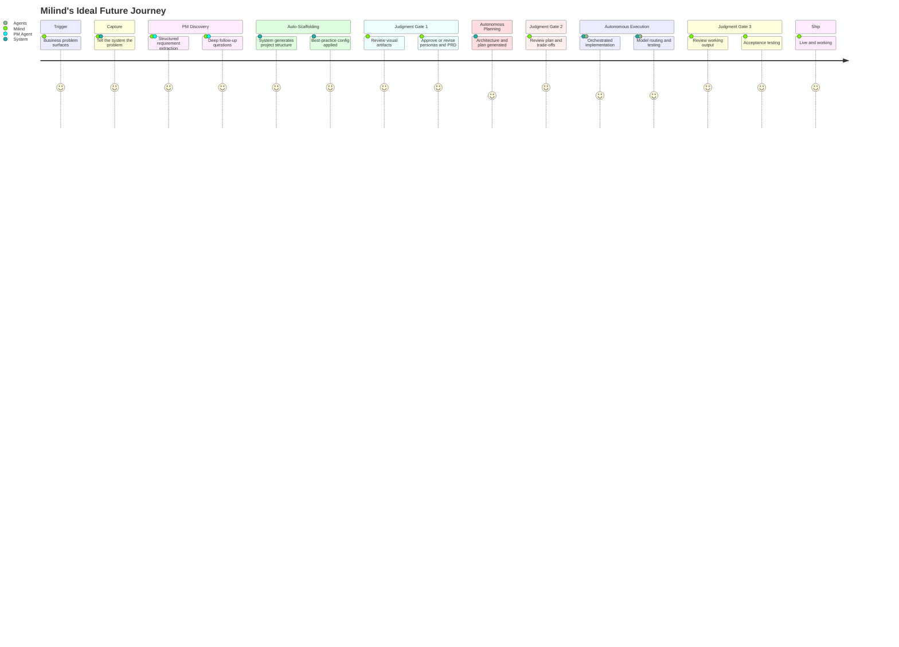

# Customer Journey Map: Claude Code Scaffolding Platform

## Persona: Milind — The Strategic Builder (persona-1)

---

## Journey 1: Current State (Broken)

### Journey Overview



### Phase Details

### Trigger

**Trigger:** A real business problem surfaces — a client need, a course requirement, a tool gap.

| Aspect | Details |
|---|---|
| **Actions** | Recognize the problem, assess urgency, decide to build a solution |
| **Touchpoints** | Client conversations, business review, personal notebook |
| **Thoughts** | "This is a real problem. I can build something to solve it." |
| **Emotions** | Motivated (5/5) — energy and clarity about the problem |
| **Pain Points** | None at this stage — motivation is high |
| **Opportunities** | Capture this energy and channel it directly into structured discovery |

### Crystallize

| Aspect | Details |
|---|---|
| **Actions** | Write the problem down in notebook, think through dimensions |
| **Touchpoints** | Physical notebook, personal reflection |
| **Thoughts** | "Let me get this clear in my head before I start." |
| **Emotions** | Focused (4/5) — productive clarification |
| **Pain Points** | Notebook capture is analog and disconnected from the digital workflow |
| **Opportunities** | Replace notebook with conversational AI PM that captures and structures simultaneously |

### Scaffolding

| Aspect | Details |
|---|---|
| **Actions** | Create project directory, write CLAUDE.md from scratch, set up directory structure, define conventions |
| **Touchpoints** | Terminal, Claude Code, file system, previous project templates (manually copied) |
| **Thoughts** | "I've done this a dozen times. Why am I doing it again from scratch?" |
| **Emotions** | Friction building (2/5) — resistance to repetitive work, momentum fading |
| **Pain Points** | No repeatable process; different every time; takes 20-40 minutes of pure setup; pulls from previous projects inconsistently; kills momentum before any product thinking happens |
| **Opportunities** | Project-type templates with auto-generated scaffolding; detect project type and apply best-practice structure automatically |

### Configuration

| Aspect | Details |
|---|---|
| **Actions** | Set up spec-driven development, configure memory/session tracking, establish best practices |
| **Touchpoints** | CLAUDE.md, project configuration files |
| **Thoughts** | "I need to make sure the agent has enough context to not go off the rails." |
| **Emotions** | Momentum fading (2/5) — tedious but necessary |
| **Pain Points** | Configuration is manual and error-prone; easy to miss critical settings; no standard for what a well-configured project looks like |
| **Opportunities** | Bundle configuration into scaffolding templates; sensible defaults with overrides |

### Requirements

| Aspect | Details |
|---|---|
| **Actions** | Run /brainstorm, explain needs conversationally, receive shallow output, manually enrich |
| **Touchpoints** | /brainstorm command, Claude Code |
| **Thoughts** | "This output is surface-level. It missed the nuances I mentioned." |
| **Emotions** | Frustrated (2/5) — tool doesn't extract deeply enough |
| **Pain Points** | /brainstorm doesn't ask probing follow-up questions; output lacks depth on edge cases, user workflows, and non-obvious requirements; manual enrichment is time-consuming and defeats the purpose |
| **Opportunities** | Structured PM discovery with 6 phases (Problem Understanding, Market Context, User Deep Dive, Requirements Synthesis, Review, Handoff); system that asks the right questions and produces rich artifacts |

### Planning

| Aspect | Details |
|---|---|
| **Actions** | Review generated plan, identify gaps, patch requirements, approve with reservations |
| **Touchpoints** | /write-plan command, plan output |
| **Thoughts** | "This plan has gaps because the requirements had gaps. Garbage in, garbage out." |
| **Emotions** | Concerned (2/5) — knows downstream problems are coming |
| **Pain Points** | Plans inherit the shallowness of requirements; no visual artifacts to support review; hard to catch what's missing in a wall of text |
| **Opportunities** | Visual decision-support artifacts (journey maps, architecture diagrams) at the planning stage; judgment gates with clear approve/revise/reject options |

### Implementation

| Aspect | Details |
|---|---|
| **Actions** | Agent begins building, builds wrong features, skips tests, drifts from intent |
| **Touchpoints** | Agent execution, code output, test results (or lack thereof) |
| **Thoughts** | "It built an auth system I didn't ask for and the core logic is wrong." |
| **Emotions** | Angry, disappointed (1/5) — wasted time and tokens on wrong output |
| **Pain Points** | Agent drift from shallow requirements; no testing discipline enforced; expensive Opus tokens burned on tasks Sonnet could handle; no progressive disclosure means agent gets overwhelmed |
| **Opportunities** | Model routing (Haiku/Sonnet/Opus by task complexity); scoped agents with progressive disclosure; mandatory test-first development; clear acceptance criteria from PM phase |

### Rework

| Aspect | Details |
|---|---|
| **Actions** | Scrap wrong modules, rewrite requirements more explicitly, restart implementation, multiple correction cycles |
| **Touchpoints** | Claude Code, git (revert/branch), manual requirements docs |
| **Thoughts** | "I'm spending more time managing the AI than I would have spent just building it myself." |
| **Emotions** | Exhausted (1/5) — diminishing returns, questioning the whole approach |
| **Pain Points** | Token waste from rebuilding; time waste from multiple cycles; context lost between iterations; each rework cycle is demoralizing |
| **Opportunities** | Prevent rework by getting requirements right upfront; checkpoint/rollback system; persistent context across iterations |

### Outcome

| Aspect | Details |
|---|---|
| **Actions** | Project stalls, gets deprioritized, or is abandoned; business problem remains unsolved |
| **Touchpoints** | Notebook (crossed-out item), mental backlog |
| **Thoughts** | "The AI is brilliant. The orchestration is broken." |
| **Emotions** | Defeated (1/5) — capability exists but can't be harnessed |
| **Pain Points** | Business problems remain unsolved; time and money spent with no return; erodes confidence in AI-assisted development |
| **Opportunities** | End-to-end orchestration that prevents this outcome entirely; the whole point of the Scaffolding Platform |

---

## Journey 2: Ideal Future State

### Journey Overview



### Phase Details

### Trigger

**Trigger:** A real business problem surfaces — same as current state.

| Aspect | Details |
|---|---|
| **Actions** | Recognize the problem, decide to solve it |
| **Touchpoints** | Client conversations, business review |
| **Thoughts** | "I know exactly what to do with this." |
| **Emotions** | Motivated (5/5) — same energy, but now with a clear path forward |
| **Pain Points** | None |
| **Opportunities** | System is ready to receive the problem immediately |

### Capture

| Aspect | Details |
|---|---|
| **Actions** | Open Claude Code, invoke /pm-discover, describe the problem conversationally |
| **Touchpoints** | Claude Code, /pm-discover command, conversational PM agent |
| **Thoughts** | "I just need to explain the problem. The system will handle the structure." |
| **Emotions** | Focused, heard (5/5) — the system asks smart questions and captures nuance |
| **Pain Points** | None — replaces the notebook + manual scaffolding gap |
| **Opportunities** | Replace notebook with conversational AI PM that extracts deeply; capture problem context in machine-consumable format from minute one |

### PM Discovery

| Aspect | Details |
|---|---|
| **Actions** | System runs structured 6-phase discovery: problem understanding, market context (with web research), user deep dive, requirements synthesis |
| **Touchpoints** | PM agent, market-researcher sub-agent, user-interviewer sub-agent |
| **Thoughts** | "It's asking me things I wouldn't have thought to write down. This is better than my notebook." |
| **Emotions** | Understood (5/5) — the system extracts what matters, not just what's obvious |
| **Pain Points** | None — depth replaces the shallow /brainstorm output |
| **Opportunities** | Structured 6-phase workflow with visual artifact output; market research happens automatically; JTBD and pain points are systematically captured |

### Auto-Scaffolding

| Aspect | Details |
|---|---|
| **Actions** | System detects project type, generates directory structure, CLAUDE.md, conventions, memory config, and spec-driven development setup |
| **Touchpoints** | Scaffolding engine, project-type templates |
| **Thoughts** | "It just did in 10 seconds what used to take me 30 minutes." |
| **Emotions** | Relieved (5/5) — the friction is gone, momentum preserved |
| **Pain Points** | None — automated and consistent |
| **Opportunities** | Project-type templates with best-practice structure; detect project type from PM discovery output; include testing framework, CI/CD config, documentation structure |

### Judgment Gate #1

| Aspect | Details |
|---|---|
| **Actions** | Review generated personas, journey maps (HTML visual + Mermaid), PRD, user stories; approve, revise, or reject each artifact |
| **Touchpoints** | Visual HTML artifacts, markdown documents, approve/revise/reject interface |
| **Thoughts** | "I can see the user's journey clearly. This PRD captures what I meant. Let me tweak this one persona." |
| **Emotions** | In control (5/5) — strategic decision-making, not implementation drudgery |
| **Pain Points** | None — visual artifacts make review fast and effective |
| **Opportunities** | Visual decision-support (HTML maps, dashboards, humanized text); clear approve/revise/reject workflow; artifacts are both human-readable and machine-consumable |

### Autonomous Planning

| Aspect | Details |
|---|---|
| **Actions** | System generates architecture decisions, implementation plan, task breakdown, model routing strategy |
| **Touchpoints** | Planning agent, architecture output |
| **Thoughts** | "The plan is grounded in real requirements because the discovery was thorough." |
| **Emotions** | Confident (4/5) — trusts the plan because the foundation is solid |
| **Pain Points** | Minor — may need to validate architectural trade-offs |
| **Opportunities** | Plans built on rich requirements instead of shallow specs; architecture decisions documented with rationale |

### Judgment Gate #2

| Aspect | Details |
|---|---|
| **Actions** | Review implementation plan, architecture decisions, trade-offs, model routing allocation; approve or adjust |
| **Touchpoints** | Plan artifacts, architecture diagrams, trade-off summaries |
| **Thoughts** | "The trade-offs are clear. I'd change one thing here, but otherwise this is solid." |
| **Emotions** | Strategic (5/5) — making high-leverage decisions, not micromanaging |
| **Pain Points** | None |
| **Opportunities** | Visual architecture diagrams; trade-off matrices; cost estimates for model routing |

### Autonomous Execution

| Aspect | Details |
|---|---|
| **Actions** | Orchestrator runs implementation: routes tasks to appropriate models (Haiku for boilerplate, Sonnet for logic, Opus for complex decisions), enforces test-first development, manages context with progressive disclosure |
| **Touchpoints** | Orchestrator, scoped agents, test runner, CI pipeline |
| **Thoughts** | "It's running. Tests are passing. I don't need to watch this." |
| **Emotions** | Free (4/5) — liberated to work on other strategic priorities |
| **Pain Points** | Minor — occasional edge cases may need human input |
| **Opportunities** | Model routing saves tokens; progressive disclosure prevents agent overwhelm; scoped agents stay focused; test-first prevents drift; persistent context across agent handoffs |

### Judgment Gate #3

| Aspect | Details |
|---|---|
| **Actions** | Review working output, run acceptance tests with visual artifacts, validate against original requirements, approve for shipping |
| **Touchpoints** | Working application, acceptance test results, PM review artifacts |
| **Thoughts** | "This is what I described. The tests pass. The user flow works." |
| **Emotions** | Proud (5/5) — the system built what was needed |
| **Pain Points** | None |
| **Opportunities** | Visual acceptance testing artifacts; side-by-side comparison with original requirements; automated regression testing |

### Ship

| Aspect | Details |
|---|---|
| **Actions** | CI/CD pipeline runs, PR created, merged, deployed |
| **Touchpoints** | GitHub Actions, deployment pipeline |
| **Thoughts** | "From problem to production. This is what 5-10x looks like." |
| **Emotions** | Amazing (5/5) — business problem solved, shipped with confidence |
| **Pain Points** | None |
| **Opportunities** | GitHub Actions for CI/CD automation; automated deployment; post-ship monitoring and feedback loops |

---

## Emotional Arc Comparison

| Phase | Current State | Future State | Delta |
|---|---|---|---|
| Trigger | Motivated (5) | Motivated (5) | -- |
| Capture/Crystallize | Focused (4) | Focused, heard (5) | +1 |
| Scaffolding | Friction (2) | Relieved (5) | +3 |
| Requirements | Frustrated (2) | Understood (5) | +3 |
| Planning | Concerned (2) | Confident (4) | +2 |
| Implementation | Angry (1) | Free (4) | +3 |
| Rework/Review | Exhausted (1) | Proud (5) | +4 |
| Outcome/Ship | Defeated (1) | Amazing (5) | +4 |

**Average emotional score: Current = 2.25 / Future = 4.75 (+2.5 improvement)**

---

## For AI Agents

```yaml
journey_map:
  project: "Claude Code Scaffolding Platform"
  persona: "persona-1"
  journeys:
    - name: "Current State (Broken)"
      type: current_state
      phases:
        - name: "Trigger"
          trigger: "Business problem surfaces"
          touchpoints:
            - "Client conversations"
            - "Business review"
            - "Personal notebook"
          actions:
            - "Recognize problem"
            - "Assess urgency"
          thoughts:
            - "This is a real problem. I can build something to solve it."
          emotions:
            - type: "motivated"
              intensity: 5
          pain_points: []
          opportunities:
            - "Capture energy and channel into structured discovery"

        - name: "Crystallize"
          trigger: "Decision to build"
          touchpoints:
            - "Physical notebook"
          actions:
            - "Write problem in notebook"
            - "Think through dimensions"
          thoughts:
            - "Let me get this clear before I start."
          emotions:
            - type: "focused"
              intensity: 4
          pain_points:
            - "Analog capture disconnected from digital workflow"
          opportunities:
            - "Replace notebook with conversational AI PM"

        - name: "Scaffolding"
          trigger: "Ready to start building"
          touchpoints:
            - "Terminal"
            - "Claude Code"
            - "File system"
            - "Previous project templates"
          actions:
            - "Create project directory"
            - "Write CLAUDE.md from scratch"
            - "Set up directory structure"
            - "Define conventions"
          thoughts:
            - "I've done this a dozen times. Why am I doing it again?"
          emotions:
            - type: "friction"
              intensity: 2
          pain_points:
            - "No repeatable process"
            - "Different every time"
            - "Takes 20-40 minutes"
            - "Kills momentum before product thinking"
          opportunities:
            - "Project-type templates with auto-generated scaffolding"

        - name: "Configuration"
          trigger: "Scaffolding complete"
          touchpoints:
            - "CLAUDE.md"
            - "Project config files"
          actions:
            - "Set up spec-driven development"
            - "Configure memory and session tracking"
          thoughts:
            - "I need to make sure the agent has enough context."
          emotions:
            - type: "momentum_fading"
              intensity: 2
          pain_points:
            - "Manual and error-prone"
            - "No standard for well-configured project"
          opportunities:
            - "Bundle configuration into scaffolding templates"

        - name: "Requirements"
          trigger: "Configuration complete"
          touchpoints:
            - "/brainstorm command"
            - "Claude Code"
          actions:
            - "Run /brainstorm"
            - "Explain needs conversationally"
            - "Manually enrich shallow output"
          thoughts:
            - "This output is surface-level. It missed the nuances."
          emotions:
            - type: "frustrated"
              intensity: 2
          pain_points:
            - "/brainstorm doesn't ask probing follow-ups"
            - "Output lacks depth on edge cases"
            - "Manual enrichment defeats the purpose"
          opportunities:
            - "Structured PM discovery with 6 phases"
            - "System that asks the right questions"

        - name: "Planning"
          trigger: "Requirements captured"
          touchpoints:
            - "/write-plan command"
          actions:
            - "Review generated plan"
            - "Identify gaps"
            - "Patch requirements"
          thoughts:
            - "Garbage in, garbage out."
          emotions:
            - type: "concerned"
              intensity: 2
          pain_points:
            - "Plans inherit shallow requirements"
            - "No visual artifacts for review"
          opportunities:
            - "Visual decision-support at planning stage"
            - "Judgment gates with approve/revise/reject"

        - name: "Implementation"
          trigger: "Plan approved"
          touchpoints:
            - "Agent execution"
            - "Code output"
          actions:
            - "Agent builds features"
            - "Agent skips tests"
            - "Agent drifts from intent"
          thoughts:
            - "It built an auth system I didn't ask for."
          emotions:
            - type: "angry"
              intensity: 1
          pain_points:
            - "Agent drift from shallow requirements"
            - "No testing discipline"
            - "Expensive Opus tokens wasted"
            - "No progressive disclosure"
          opportunities:
            - "Model routing by task complexity"
            - "Scoped agents with progressive disclosure"
            - "Mandatory test-first development"

        - name: "Rework"
          trigger: "Wrong output discovered"
          touchpoints:
            - "Claude Code"
            - "Git revert/branch"
          actions:
            - "Scrap wrong modules"
            - "Rewrite requirements"
            - "Restart implementation"
          thoughts:
            - "I'm spending more time managing the AI than building it myself."
          emotions:
            - type: "exhausted"
              intensity: 1
          pain_points:
            - "Token waste from rebuilding"
            - "Time waste from multiple cycles"
            - "Context lost between iterations"
          opportunities:
            - "Get requirements right upfront"
            - "Checkpoint/rollback system"

        - name: "Outcome"
          trigger: "Multiple rework cycles"
          touchpoints:
            - "Notebook"
            - "Mental backlog"
          actions:
            - "Project stalls or is abandoned"
          thoughts:
            - "The AI is brilliant. The orchestration is broken."
          emotions:
            - type: "defeated"
              intensity: 1
          pain_points:
            - "Business problems remain unsolved"
            - "Time and money spent with no return"
            - "Erodes confidence in AI-assisted development"
          opportunities:
            - "End-to-end orchestration that prevents this outcome"

    - name: "Ideal Future State"
      type: future_state
      phases:
        - name: "Trigger"
          trigger: "Business problem surfaces"
          touchpoints:
            - "Client conversations"
            - "Business review"
          actions:
            - "Recognize problem"
            - "Decide to solve it"
          emotions:
            - type: "motivated"
              intensity: 5
          pain_points: []
          opportunities:
            - "System ready to receive the problem immediately"

        - name: "Capture"
          trigger: "Decision to solve"
          touchpoints:
            - "Claude Code"
            - "/pm-discover command"
            - "Conversational PM agent"
          actions:
            - "Invoke /pm-discover"
            - "Describe problem conversationally"
          emotions:
            - type: "focused_heard"
              intensity: 5
          pain_points: []
          opportunities:
            - "Replace notebook with conversational AI PM"
            - "Capture in machine-consumable format from minute one"

        - name: "PM Discovery"
          trigger: "Problem captured"
          touchpoints:
            - "PM agent"
            - "Market-researcher sub-agent"
            - "User-interviewer sub-agent"
          actions:
            - "Structured 6-phase discovery"
            - "Automated market research"
            - "Deep requirement extraction"
          emotions:
            - type: "understood"
              intensity: 5
          pain_points: []
          opportunities:
            - "Structured 6-phase workflow with visual artifacts"
            - "Automatic market research"
            - "Systematic JTBD and pain point capture"

        - name: "Auto-Scaffolding"
          trigger: "Discovery complete"
          touchpoints:
            - "Scaffolding engine"
            - "Project-type templates"
          actions:
            - "System detects project type"
            - "Generates directory structure and config"
          emotions:
            - type: "relieved"
              intensity: 5
          pain_points: []
          opportunities:
            - "Project-type templates with best-practice structure"
            - "Include testing framework, CI/CD, documentation structure"

        - name: "Judgment Gate 1"
          trigger: "Artifacts generated"
          touchpoints:
            - "Visual HTML artifacts"
            - "Markdown documents"
            - "Approve/revise/reject interface"
          actions:
            - "Review personas, journey maps, PRD, stories"
            - "Approve, revise, or reject each"
          emotions:
            - type: "in_control"
              intensity: 5
          pain_points: []
          opportunities:
            - "Visual decision-support (HTML maps, dashboards)"
            - "Clear approve/revise/reject workflow"
            - "Dual-format artifacts (human + machine)"

        - name: "Autonomous Planning"
          trigger: "Artifacts approved"
          touchpoints:
            - "Planning agent"
            - "Architecture output"
          actions:
            - "Generate architecture and implementation plan"
            - "Determine model routing strategy"
          emotions:
            - type: "confident"
              intensity: 4
          pain_points: []
          opportunities:
            - "Plans built on rich requirements"
            - "Architecture decisions documented with rationale"

        - name: "Judgment Gate 2"
          trigger: "Plan generated"
          touchpoints:
            - "Plan artifacts"
            - "Architecture diagrams"
          actions:
            - "Review plan, architecture, trade-offs"
            - "Approve or adjust"
          emotions:
            - type: "strategic"
              intensity: 5
          pain_points: []
          opportunities:
            - "Visual architecture diagrams"
            - "Trade-off matrices"
            - "Cost estimates for model routing"

        - name: "Autonomous Execution"
          trigger: "Plan approved"
          touchpoints:
            - "Orchestrator"
            - "Scoped agents"
            - "Test runner"
            - "CI pipeline"
          actions:
            - "Model-routed implementation"
            - "Test-first development"
            - "Progressive disclosure context management"
          emotions:
            - type: "free"
              intensity: 4
          pain_points: []
          opportunities:
            - "Model routing saves tokens"
            - "Progressive disclosure prevents overwhelm"
            - "Test-first prevents drift"
            - "Persistent context across handoffs"

        - name: "Judgment Gate 3"
          trigger: "Implementation complete"
          touchpoints:
            - "Working application"
            - "Acceptance test results"
            - "PM review artifacts"
          actions:
            - "Review working output"
            - "Run acceptance tests"
            - "Validate against requirements"
          emotions:
            - type: "proud"
              intensity: 5
          pain_points: []
          opportunities:
            - "Visual acceptance testing artifacts"
            - "Side-by-side comparison with requirements"

        - name: "Ship"
          trigger: "Acceptance approved"
          touchpoints:
            - "GitHub Actions"
            - "Deployment pipeline"
          actions:
            - "CI/CD pipeline runs"
            - "PR created, merged, deployed"
          emotions:
            - type: "amazing"
              intensity: 5
          pain_points: []
          opportunities:
            - "GitHub Actions for CI/CD automation"
            - "Post-ship monitoring and feedback loops"

  emotional_arc:
    current_state_average: 2.25
    future_state_average: 4.75
    improvement: 2.5
```
