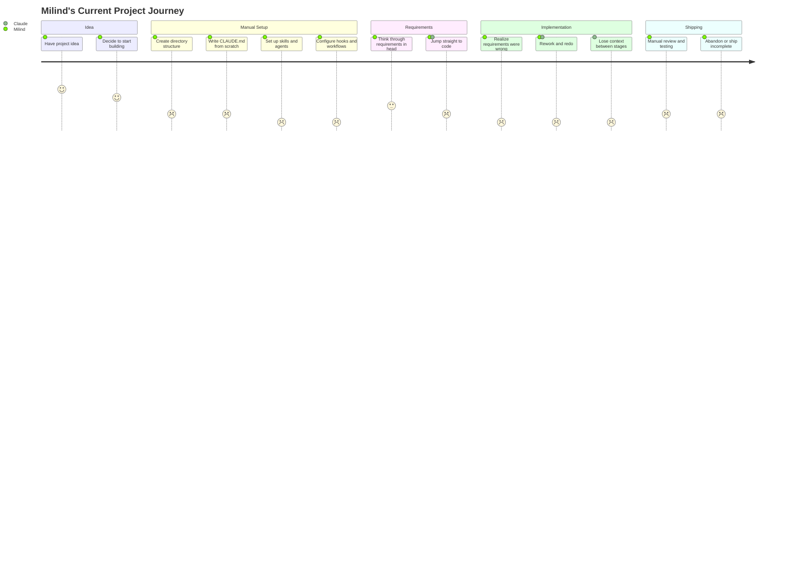

# PM Spec: Claude Code Scaffolding Platform

> **For Claude:** REQUIRED SUB-SKILL: Use superpowers:brainstorming to design the implementation, OR use superpowers:writing-plans if the design is already clear from this PM spec.

## Executive Summary

A deeply customized fork of Superpowers (obra/superpowers) that transforms Claude Code from a capable but unstructured AI coding assistant into a judgment-gated SDLC automation platform. The system adds three layers missing from the current ecosystem: (1) a PM discovery module that deeply extracts requirements before any code is written, (2) an orchestration agent that manages the full pipeline autonomously while surfacing visual decision-support artifacts at judgment gates, and (3) a context management system with progressive disclosure and model routing. Built for a single power user (Milind) who runs diverse projects across software, courses, content, and business operations, targeting 80/20 autonomy — 80% automated, 20% human judgment at the moments that matter.

---

## Competitive Context

The Claude Code plugin ecosystem is maturing rapidly. Superpowers (55.4k stars) leads in developer execution skills but has no PM layer, no orchestration, and no judgment gates. BMAD Method (36.5k stars) offers a full SDLC methodology but is monolithic and hard to compose. Compound Engineering provides the closest pipeline model with plan-approval gates and knowledge compounding but is not a Claude Code plugin. Archon (13.7k stars) brings MCP knowledge base patterns. No existing tool combines all three missing layers.

**Key differentiators for this product:**
- Only solution with a dedicated PM discovery phase producing structured, visual artifacts before code is written
- Judgment gates with visual decision-support artifacts, not just approval prompts
- Context management with model routing — Haiku for verification, Sonnet for standard tasks, Opus for complex reasoning
- Knowledge compounding across projects — each project makes the next one easier
- Multi-project-type support beyond software development (courses, content, business ops, personal)

---

## Personas

| ID | Name | Archetype | Primary Job |
|---|---|---|---|
| persona-milind | Milind | The Strategic Builder | Leverage AI at 5-10x across diverse projects while maintaining quality through structured judgment |

**Milind — The Strategic Builder:**
Technical PM/developer, business owner, AI course creator. Runs 5+ concurrent projects across software development, course creation, content writing, and business operations. Has deep domain knowledge but faces high activation energy starting new projects. Values judgment over speed, verification over trust, and amplification over replacement. Core frustration: the gap between having an idea and having a properly structured project.

Full personas: [`2026-02-19-scaffolding-platform-personas.md`](2026-02-19-scaffolding-platform-personas.md)

---

## Journey Map

### Current Journey Overview



**Critical pain points:**
1. **Manual scaffolding (score 1-2):** Every project requires recreating directory structure, CLAUDE.md, skills, agents, and hooks from memory. Takes 30+ minutes and is error-prone.
2. **No PM phase (score 2-3):** Requirements live in the user's head. No structured extraction, no artifacts, no verification. Projects build the wrong thing.
3. **Context loss between stages (score 1):** What is discovered in early phases does not flow to implementation. Agents start with no context.
4. **Token waste on wrong models (score 1):** Opus handles every task regardless of complexity. No routing intelligence.
5. **No knowledge compounding (score 2):** Each project starts from zero. Past learnings are not captured or reused.

Full journey map: [`2026-02-19-scaffolding-platform-journey-map.md`](2026-02-19-scaffolding-platform-journey-map.md)

---

## Requirements Overview

### Must Have (P0)

| ID | Feature | User Stories |
|---|---|---|
| FS-001 | Auto-Scaffolding Engine | US-001, US-002, US-003 |
| FS-002 | PM Discovery Module | US-004, US-005, US-006 |
| FS-003 | Judgment Gate System | US-007, US-008 |
| FS-004 | SDLC Orchestration Agent | US-009, US-010, US-011 |
| FS-005 | Context Management System | US-012, US-013 |
| FS-006 | Humanized Output | US-014 |
| FS-007 | Multi-Project-Type Support | US-001, US-015 |
| FS-008 | Structured Artifact Handoffs | US-010, US-016 |

### Should Have (P1)

| ID | Feature | User Stories |
|---|---|---|
| FS-009 | Knowledge Compounding Engine | US-017, US-018 |
| FS-010 | Plugin Composition Framework | US-019 |
| FS-011 | Automatic Model Routing | US-012, US-013 |
| FS-012 | Decision Persistence | US-020 |
| FS-013 | Anti-Rationalization Verification | US-021 |

### Could Have (P2)

| ID | Feature | User Stories |
|---|---|---|
| FS-014 | CI/CD Integration | US-022 |
| FS-015 | MCP Knowledge Base | US-023 |
| FS-016 | Cross-Agent Portability | US-024 |

Full PRD: [`2026-02-19-scaffolding-platform-prd.md`](2026-02-19-scaffolding-platform-prd.md)
User stories: [`2026-02-19-scaffolding-platform-user-stories.md`](2026-02-19-scaffolding-platform-user-stories.md)
Feature stories: [`2026-02-19-scaffolding-platform-feature-stories.md`](2026-02-19-scaffolding-platform-feature-stories.md)

---

## Product Requirements Prompt (PRP)

> This section is self-contained. An AI coding agent reading ONLY this section should have everything needed to begin implementation planning.

### Context

Build a Claude Code plugin platform by forking Superpowers (obra/superpowers) and adding three missing layers: PM discovery, SDLC orchestration with judgment gates, and context management with model routing. The platform serves a single power user running diverse projects (software, courses, content, business operations) and targets 80/20 autonomy — 80% automated execution, 20% human judgment at structured decision points. The platform follows Claude Code's plugin architecture conventions (CLAUDE.md, skills/, commands/, hooks/, agents/) and must maintain compatibility with upstream Superpowers updates.

### Problem

Starting new projects with Claude Code requires manually recreating scaffolding every time. Without structured requirements gathering, coding agents build the wrong thing. Without orchestration, context is lost between SDLC stages. Without model routing, tokens are wasted on wrong models. Without verification, agent output drifts from requirements undetected. The result: high startup friction, poor output quality, wasted cost, and abandoned projects.

### Target Users

Single user: technical PM/developer running 5+ concurrent projects across software, courses, content, and business. Needs structured workflows with judgment gates to maintain quality at scale. Values judgment before tools, verification before trust, and amplification over replacement.

### Requirements

**R-001: Auto-Scaffolding Engine** (Must Have)
Generate complete project scaffolding based on detected or specified project type. Output includes CLAUDE.md, directory structure, skills/, agents/, hooks/, templates/, and type-specific configurations.
- *Acceptance:*
  - Given a user runs `/scaffold software my-project`, When the engine executes, Then a complete software project directory is created with CLAUDE.md, skills/, agents/, hooks/, and starter configurations appropriate for a software project.
  - Given a user runs `/scaffold course ai-fundamentals`, When the engine executes, Then a course-specific directory is created with curriculum/, modules/, exercises/, CLAUDE.md, and course-specific skills.
  - Given a user runs `/scaffold` without a type, When the engine analyzes available context, Then it suggests the most likely project type based on the directory contents or prompts the user.
- *Related:* FS-001, US-001, US-002, US-003

**R-002: PM Discovery Module** (Must Have)
Implement 6-phase structured discovery workflow: (A) Problem Understanding, (B) Market Context with web research, (C) User Deep Dive with persona and journey mapping, (D) Requirements Synthesis generating all artifacts, (E) Artifact Review with user, (F) Handoff with PRP and SUB-SKILL directive.
- *Acceptance:*
  - Given a user runs `/pm-discover`, When they complete all 6 phases, Then a complete artifact suite is generated: personas, journey maps (markdown + HTML), user stories, feature stories, PRD, and PM spec — all in docs/pm/ with YAML frontmatter.
  - Given the PM module runs Phase B, When the market-researcher agent executes, Then real competitive data is gathered via WebSearch/WebFetch from sources including Reddit, HN, GitHub, and competitor sites.
  - Given the PM module completes Phase F, When the PM spec is generated, Then it contains a self-contained PRP section and the REQUIRED SUB-SKILL directive pointing to superpowers:brainstorming or superpowers:writing-plans.
- *Related:* FS-002, US-004, US-005, US-006

**R-003: Judgment Gate System** (Must Have)
Implement structured decision points that pause autonomous execution and present the user with visual summary artifacts, clear options, and decision prompts. Gates trigger at: requirements approval, architecture decisions, implementation review, and acceptance review.
- *Acceptance:*
  - Given the orchestrator reaches a judgment gate, When the gate activates, Then the user sees a visual summary of the current state, the decision to be made, available options with trade-offs, and a clear action prompt.
  - Given the user makes a decision at a gate, When the decision is recorded, Then execution resumes with the decision applied to all downstream context.
  - Given a judgment gate presents output, When the humanizer processes it, Then all AI crutch phrases and formulaic patterns have been removed.
- *Related:* FS-003, US-007, US-008

**R-004: SDLC Orchestration Agent** (Must Have)
Build a conductor agent that manages the full pipeline: PM discovery -> brainstorm -> plan -> implement -> review -> ship. The orchestrator handles stage transitions with structured artifact handoffs, enforces verification at each stage, routes to judgment gates, and implements 80/20 autonomy.
- *Acceptance:*
  - Given a user initiates the full pipeline with `/orchestrate`, When the orchestrator runs, Then each stage executes in sequence with structured artifact handoffs, pausing at judgment gates for human input.
  - Given a pipeline stage produces output, When the orchestrator processes the handoff, Then the output is validated against the expected artifact schema before passing to the next stage.
  - Given the orchestrator encounters a stage failure, When validation fails, Then the user is informed with a clear description of what failed and options for recovery (retry, skip with acknowledgment, or abort).
- *Related:* FS-004, US-009, US-010, US-011

**R-005: Context Management System** (Must Have)
Implement progressive disclosure that delivers only relevant context to each agent. Include model routing that selects Haiku, Sonnet, or Opus based on task complexity. Maintain a context dictionary that carries structured state between stages.
- *Acceptance:*
  - Given a specialized agent is invoked by the orchestrator, When the context system prepares its input, Then only the context relevant to that agent's task is included (not the full project history).
  - Given a task is classified as "verification" or "simple query", When model routing runs, Then Haiku is selected. Given a task is "standard generation", Then Sonnet is selected. Given a task is "complex reasoning or synthesis", Then Opus is selected.
  - Given a stage completes and produces artifacts, When the context dictionary is updated, Then the next stage can access those artifacts by reference without re-reading source files.
- *Related:* FS-005, US-012, US-013

**R-006: Humanized Output** (Must Have)
All human-facing output (judgment gate presentations, artifact summaries, status updates) must pass through a humanization layer that strips AI crutch phrases, filler, and formulaic patterns.
- *Acceptance:*
  - Given an agent produces output containing phrases like "I'd be happy to", "Certainly!", "Great question!", or "Let me think about this step by step", When the humanizer processes it, Then those phrases are removed or replaced with natural alternatives.
  - Given the humanizer plugin (Trail of Bits) is installed, When output is processed, Then the plugin's rules are applied. Given the plugin is not installed, Then a built-in fallback humanizer runs.
- *Related:* FS-006, US-014

**R-007: Multi-Project-Type Support** (Must Have)
Support at minimum 5 project types: software development, course development, content writing, business operations, personal planning. Each type has distinct scaffolding templates, workflows, and artifact sets.
- *Acceptance:*
  - Given the scaffolding engine is called with each supported type, When scaffolding completes, Then each type produces a distinct directory structure and CLAUDE.md tailored to that project type.
  - Given a user's project does not fit predefined types, When they specify "custom", Then a minimal scaffolding is generated with prompts to customize.
- *Related:* FS-007, US-001, US-015

**R-008: Structured Artifact Handoffs** (Must Have)
Every SDLC stage produces output in a structured format (YAML frontmatter + markdown body + machine-consumable YAML footer) that downstream stages and agents can parse programmatically.
- *Acceptance:*
  - Given the PM phase produces a PRD, When the brainstorming agent reads it, Then the agent can extract all requirements, personas, and constraints from the YAML sections without parsing prose.
  - Given any artifact is generated, When it is written to disk, Then it includes YAML frontmatter with artifact type, project name, date, status, and phase.
- *Related:* FS-008, US-010, US-016

**R-009: Knowledge Compounding Engine** (Should Have)
Capture learnings, solutions, and reusable patterns from completed projects in docs/solutions/. Make these available to future project scaffolding and planning phases.
- *Acceptance:*
  - Given a project completes successfully, When the knowledge capture runs, Then key learnings and reusable patterns are extracted and stored in docs/solutions/ with searchable metadata.
  - Given a new project is being scaffolded, When knowledge from similar past projects exists, Then relevant learnings are surfaced to the user during PM discovery.
- *Related:* FS-009, US-017, US-018

**R-010: Plugin Composition Framework** (Should Have)
Install, configure, and manage third-party Claude Code plugins. Handle dependency resolution and conflict detection between plugins.
- *Acceptance:*
  - Given a user wants to add the humanizer plugin, When they run the plugin install command, Then the plugin is installed and its hooks/commands are available in the next session.
  - Given two plugins define conflicting hooks, When the composition framework detects the conflict, Then the user is warned and asked to set priority order.
- *Related:* FS-010, US-019

**R-011: Automatic Model Routing** (Should Have)
Assign tasks to Haiku, Sonnet, or Opus based on task type and complexity. Configurable rules with overrides.
- *Acceptance:*
  - Given model routing is enabled, When the system processes tasks over a project lifecycle, Then Opus usage for tasks Sonnet/Haiku can handle drops below 20% of total token usage.
- *Related:* FS-011, US-012, US-013

**R-012: Decision Persistence** (Should Have)
Store every judgment gate decision as a dated artifact in docs/decisions/ with context, options, decision, and rationale.
- *Acceptance:*
  - Given a user makes a decision at a judgment gate, When the decision is persisted, Then a markdown file is created in docs/decisions/ with date, gate type, context, options, decision, and rationale.
- *Related:* FS-012, US-020

**R-013: Anti-Rationalization Verification** (Should Have)
Run a Haiku-based verification check on agent output before presenting to the user at judgment gates.
- *Acceptance:*
  - Given an agent produces output for a judgment gate, When the verification hook runs, Then it flags any detected rationalization, hallucination, or requirements drift, and includes the flags in the gate presentation.
- *Related:* FS-013, US-021

**R-014: CI/CD Integration** (Could Have)
GitHub Actions workflows triggered by pipeline stages for automated testing and deployment.
- *Acceptance:*
  - Given the implementation stage completes, When CI/CD is configured, Then a GitHub Actions workflow runs tests automatically.
- *Related:* FS-014, US-022

**R-015: MCP Knowledge Base** (Could Have)
Persistent cross-project knowledge via MCP server using the Archon pattern.
- *Acceptance:*
  - Given the MCP knowledge base is running, When a user queries past project decisions, Then relevant decisions and learnings are returned from the MCP server.
- *Related:* FS-015, US-023

**R-016: Cross-Agent Portability** (Could Have)
SkillKit integration for skills that work across Claude Code, Cursor, and GitHub Copilot.
- *Acceptance:*
  - Given a skill is written in SkillKit format, When it is loaded in Cursor, Then it functions equivalently to its Claude Code version.
- *Related:* FS-016, US-024

### Technical Constraints

1. **Architecture:** Fork of Superpowers (obra/superpowers). Must follow Claude Code plugin conventions: CLAUDE.md at root, skills/ with SKILL.md files, commands/ with slash command definitions, hooks/ for lifecycle hooks, agents/ for subagent definitions.
2. **Runtime:** Node.js (matches Superpowers). Scripts for HTML/PDF generation use Puppeteer and mermaid-cli.
3. **Model routing:** Must support Haiku, Sonnet, and Opus model tiers. Routing decisions must be transparent and overridable.
4. **Token efficiency:** Total token usage per project lifecycle must be measurably lower than unstructured usage. Target: 40% reduction in Opus tokens.
5. **Upstream compatibility:** Fork must be structured so upstream Superpowers updates can be merged with minimal conflict. Additions should be in new directories/files where possible.
6. **Artifact format:** All artifacts use YAML frontmatter + markdown body + optional YAML footer for machine consumption. No proprietary formats.
7. **Output location:** All generated artifacts go to the user's project directory (docs/pm/, docs/decisions/, docs/solutions/), not the plugin directory.
8. **No external services:** Everything runs locally via Claude Code CLI. No cloud dependencies, no databases, no APIs beyond what Claude Code provides.

### Acceptance Tests

1. **End-to-end scaffolding:** Given a new empty directory, when `/scaffold software my-app` runs, then a complete project is created and `claude` can be launched in it with all skills and commands available.
2. **End-to-end PM discovery:** Given a scaffolded project, when `/pm-discover` runs through all 6 phases, then a complete artifact suite exists in docs/pm/ and the PM spec contains a valid PRP section.
3. **End-to-end pipeline:** Given a project with completed PM discovery, when `/orchestrate` runs the full pipeline, then each stage executes with structured handoffs and the orchestrator pauses at every judgment gate.
4. **Model routing efficiency:** Given a full pipeline run, when token usage is analyzed, then Opus usage for routine tasks is below 20% of total.
5. **Knowledge compounding:** Given two completed projects, when a third project is scaffolded, then relevant learnings from the first two are surfaced during PM discovery.
6. **Upstream merge:** Given a new Superpowers release, when `git merge upstream/main` runs on the fork, then conflicts are limited to intentionally modified files (not new additions).

### Out of Scope

- Multi-user authentication, permissions, or team collaboration features
- Web-based UI or dashboard (terminal + HTML artifacts are the interface)
- SaaS deployment or cloud hosting
- Support for non-Claude AI coding agents (Cursor native, Copilot native, etc.)
- Mobile or tablet interfaces
- Real-time collaboration or sync
- Marketplace publishing automation (architecture should not preclude it, but it is not a deliverable)

---

## Design Philosophy

The system is guided by seven principles that act as architectural constraints:

1. **Judgment before tools:** The system teaches WHEN and WHY, not just HOW. Every judgment gate is an opportunity to build user capability.
2. **Know where you end and the tool begins:** Explicit human/AI boundaries at judgment gates. The user always knows what was automated and what requires their input.
3. **Competence breeds confidence:** The system builds user capability, not dependency. Over time, the user needs fewer gates, not more automation.
4. **Learn by doing your own work:** Applied to real projects, not demos. Every feature is validated against actual use.
5. **Verify before you trust:** Anti-rationalization hooks, quality gates, and verification at every stage. Trust is earned, not assumed.
6. **The frontier is always moving:** Modular, updatable architecture. New models, new plugins, new patterns can be integrated without rewriting.
7. **Amplification, not replacement:** The user's domain knowledge gets amplified by the system. The system does not replace judgment — it makes judgment more informed.

---

## Artifact Index

| Artifact | File | Status |
|---|---|---|
| Personas | `2026-02-19-scaffolding-platform-personas.md` | approved |
| Journey Map | `2026-02-19-scaffolding-platform-journey-map.md` | approved |
| Journey Map (Current - HTML) | `2026-02-19-scaffolding-platform-journey-current.html` | approved |
| Journey Map (Future - HTML) | `2026-02-19-scaffolding-platform-journey-future.html` | approved |
| User Stories | `2026-02-19-scaffolding-platform-user-stories.md` | approved |
| Feature Stories | `2026-02-19-scaffolding-platform-feature-stories.md` | approved |
| PRD | `2026-02-19-scaffolding-platform-prd.md` | approved |
| PM Spec | `2026-02-19-scaffolding-platform-pm-spec.md` | approved |

---

## For AI Agents

```yaml
pm_spec:
  project: "Claude Code Scaffolding Platform"
  date: "2026-02-19"
  status: draft
  artifacts:
    personas: "2026-02-19-scaffolding-platform-personas.md"
    journey_map: "2026-02-19-scaffolding-platform-journey-map.md"
    journey_map_html: "2026-02-19-scaffolding-platform-journey-map.html"
    user_stories: "2026-02-19-scaffolding-platform-user-stories.md"
    feature_stories: "2026-02-19-scaffolding-platform-feature-stories.md"
    prd: "2026-02-19-scaffolding-platform-prd.md"
  personas:
    - id: persona-milind
      name: "Milind — The Strategic Builder"
      primary_job: "Leverage AI at 5-10x across diverse projects while maintaining quality through structured judgment"
  must_have_features:
    - id: FS-001
      name: "Auto-Scaffolding Engine"
      user_stories: [US-001, US-002, US-003]
    - id: FS-002
      name: "PM Discovery Module"
      user_stories: [US-004, US-005, US-006]
    - id: FS-003
      name: "Judgment Gate System"
      user_stories: [US-007, US-008]
    - id: FS-004
      name: "SDLC Orchestration Agent"
      user_stories: [US-009, US-010, US-011]
    - id: FS-005
      name: "Context Management System"
      user_stories: [US-012, US-013]
    - id: FS-006
      name: "Humanized Output"
      user_stories: [US-014]
    - id: FS-007
      name: "Multi-Project-Type Support"
      user_stories: [US-001, US-015]
    - id: FS-008
      name: "Structured Artifact Handoffs"
      user_stories: [US-010, US-016]
  should_have_features:
    - id: FS-009
      name: "Knowledge Compounding Engine"
      user_stories: [US-017, US-018]
    - id: FS-010
      name: "Plugin Composition Framework"
      user_stories: [US-019]
    - id: FS-011
      name: "Automatic Model Routing"
      user_stories: [US-012, US-013]
    - id: FS-012
      name: "Decision Persistence"
      user_stories: [US-020]
    - id: FS-013
      name: "Anti-Rationalization Verification"
      user_stories: [US-021]
  could_have_features:
    - id: FS-014
      name: "CI/CD Integration"
      user_stories: [US-022]
    - id: FS-015
      name: "MCP Knowledge Base"
      user_stories: [US-023]
    - id: FS-016
      name: "Cross-Agent Portability"
      user_stories: [US-024]
  requirements_count:
    must_have: 8
    should_have: 5
    could_have: 3
    wont_have: 4
  next_step: "superpowers:brainstorming OR superpowers:writing-plans"
```
