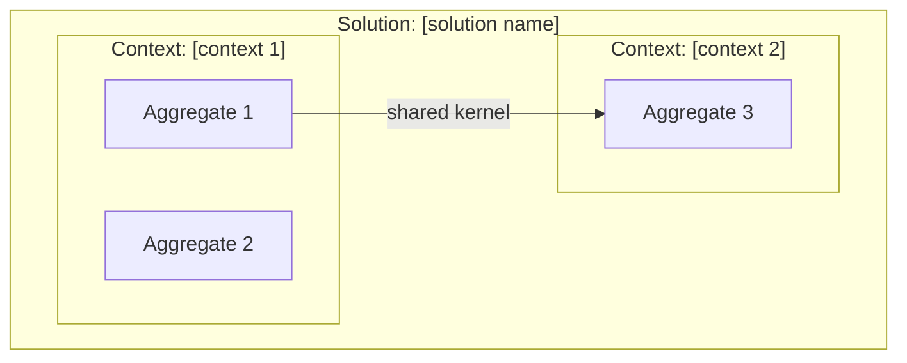
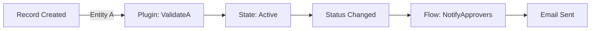

# pp-superpowers — application-design Skill Specification

**Version:** 1.0
**Date:** March 31, 2026
**Author:** SDFX Studios
**Status:** Approved for build
**Parent document:** pp-superpowers Design Roadmap v1.0

---

## 1. Skill Overview

| Attribute | Value |
|---|---|
| **Name** | application-design |
| **Domain** | Domain Driven Design (DDD-informed), conceptual modeling, domain boundaries |
| **Lifecycle group** | Design |
| **Has sub-skills** | No — single workflow with two entry modes |
| **Foundation sections consumed** | `00-project-identity`, `01-requirements`, `02-architecture-decisions`, `03-entity-map` |
| **Upstream dependency** | solution-discovery (foundation must exist) |
| **Downstream handoff** | schema-design (via `docs/ddd-model.md`) |
| **Agents** | domain-modeler (Mode A), solution-analyzer (Mode B) |

### 1.1 DDD Methodology

application-design uses **DDD-informed modeling adapted for Power Platform**. It takes the DDD concepts that add value in the Dataverse ecosystem and leaves behind what doesn't translate.

**Always produce (every project):**

| DDD Concept | Power Platform mapping | Why it earns its place |
|---|---|---|
| Bounded contexts | Solution boundaries, component ownership | Directly informs multi-solution packaging and schema separation |
| Aggregates | Table groups with cascade scope, transactional boundaries | Informs relationship behavior design (cascade, restrict, referential) |
| Aggregate roots | Primary entity in a group, lookup direction | Determines parent-child hierarchy and key ownership |
| Ubiquitous language | Table/column naming conventions, UI label consistency | Single source of naming truth for schema-design and ui-design |

**Produce when relevant (complexity warrants it):**

| DDD Concept | Power Platform mapping | When to include |
|---|---|---|
| Domain events | Plugin triggers, flow triggers, webhook events | When the project has significant server-side logic or integration patterns |
| Value objects | Embedded columns vs. separate lookup tables | When the entity map contains attributes that might be entities or might be column groups |

**Skip entirely (no Power Platform equivalent):**

Repositories, factories, domain services, application services, anti-corruption layers as code patterns. These are code-level patterns for object-oriented domain models. Dataverse is a platform with its own data access layer — these concepts add complexity without value.

### 1.2 Relationship to Other Skills

**Upstream:** solution-discovery produces the `.foundation/` directory. application-design reads foundation sections as input context and may enrich them through the developer-confirmed enrichment protocol (§7).

**Downstream:** application-design produces `docs/ddd-model.md`. schema-design reads this document as its primary input for understanding aggregate boundaries, bounded contexts, and naming conventions. If schema-design runs without application-design, it proceeds with caveats using the entity map alone.

**Cross-skill signals:** If DDD analysis reveals 3+ bounded contexts and the foundation specifies a single-solution packaging strategy, application-design flags the tension and suggests the developer consider running solution-strategy to evaluate multi-solution packaging. It does not make this decision — it surfaces the signal.

---

## 2. Mode Architecture

application-design supports two entry modes, selected at the start of the DOMAIN_ANALYSIS stage.

### 2.1 Mode A — Forward Design (Greenfield)

**When:** The developer has no existing solution. The foundation document describes what will be built.

**Input:** Foundation sections only (project identity, requirements, architecture decisions, entity map).

**Process:** Analyze requirements → domain-modeler agent proposes DDD model → developer confirms → produce documentation and diagrams.

### 2.2 Mode B — Reverse Inference (Brownfield / MVP+)

**When:** The developer has an existing Power Platform solution and wants to extract, verify, or improve its domain model.

**Input:** Foundation sections (always required — solution-discovery runs first) PLUS existing solution artifacts.

**Artifacts analyzed:**
- Entity Catalog / Dataverse entity definitions (table structure, relationships, column inventory)
- C# plugin code and registrations (event triggers, entity references, business logic patterns)
- Web resources (JS form scripts, HTML/CSS, PCF manifests — reveals UI-bound entity relationships)

**Not analyzed:** Power Automate flow definitions (excluded by design — flow logic is business-logic's domain).

**Process:** solution-analyzer agent reads solution artifacts → infers domain model → compares against foundation → presents "here's what I found vs. what you described" → developer flags what works and what doesn't → developer-confirmed enrichment updates foundation → produce documentation and diagrams.

### 2.3 Mode Selection

The fork point is at the beginning of the DOMAIN_ANALYSIS stage, after prerequisites are verified:

> "Your foundation is loaded. I can see [N] entities in your entity map and [app type] as your architecture decision.
>
> How would you like to approach domain modeling?
> - **Design from scratch** — I'll analyze your requirements and propose a domain model (Mode A)
> - **Analyze existing solution** — Point me at your solution artifacts and I'll infer the domain model for review (Mode B)"

If the developer selects Mode B, the skill prompts for the solution artifact locations (Entity Catalog path, plugin project path, web resource folder path).

---

## 3. State Machine

application-design uses a 7-stage state machine. The first five stages differ by mode; the last two (MIND_MAP and REVIEW) are shared.

```
INIT → DOMAIN_ANALYSIS → CONCEPTUAL_MODEL → DOCUMENTATION → MIND_MAP → REVIEW → COMPLETE
```

### 3.1 Stage Definitions

| Stage | Mode A action | Mode B action | Can skip? |
|---|---|---|---|
| INIT | Read foundation, verify prerequisites | Read foundation, verify prerequisites | No |
| DOMAIN_ANALYSIS | domain-modeler agent analyzes requirements | solution-analyzer agent analyzes artifacts + compares to foundation | No |
| CONCEPTUAL_MODEL | Developer confirms proposed model | Developer reviews inferred model, flags issues, confirms corrections | No |
| DOCUMENTATION | Write DDD document from confirmed model | Write DDD document from confirmed model + run foundation enrichment | No |
| MIND_MAP | Generate three Whimsical diagrams | Generate three Whimsical diagrams | No |
| REVIEW | Validate DDD model against requirements | Validate DDD model against requirements + verify enrichment accuracy | No |
| COMPLETE | Write completion state, suggest schema-design | Write completion state, suggest schema-design | No |

### 3.2 Progress Tracking

Each stage transition writes to `.pp-context/skill-state.json`:

```json
{
  "activeSkill": "application-design",
  "activeStage": "CONCEPTUAL_MODEL",
  "activeMode": "B",
  "stageHistory": [
    { "stage": "INIT", "completedAt": "2026-03-31T10:00:00Z" },
    { "stage": "DOMAIN_ANALYSIS", "completedAt": "2026-03-31T10:45:00Z" },
    { "stage": "CONCEPTUAL_MODEL", "startedAt": "2026-03-31T10:46:00Z" }
  ],
  "lastCompleted": "solution-discovery",
  "suggestedNext": null,
  "completedSkills": ["solution-discovery"]
}
```

On session resume:

> "You're in application-design (Mode B: reverse inference), stage: conceptual model. Your solution analysis is complete and you were reviewing the inferred aggregates. Want to continue from where you left off?"

---

## 4. Conversation Flow and Gating Logic

### 4.1 Stage: INIT

**Gate:** Foundation directory exists with at minimum `00-project-identity.md`, `01-requirements.md`, `02-architecture-decisions.md`, and `03-entity-map.md`. If any are missing, block and direct the developer to run solution-discovery.

**Action:** Read all four foundation sections. Load environment context from `.pp-context/environment.json` (if available). Load session context from `.pp-context/session.json` (if available).

**Output:** Internal context loaded. Proceed to mode selection in DOMAIN_ANALYSIS.

### 4.2 Stage: DOMAIN_ANALYSIS

#### Mode A — Forward Design

**Action:** Dispatch the **domain-modeler** agent with:
- Foundation sections (requirements, entity map, architecture decisions)
- Project identity (for naming context)

The agent returns a proposed domain model containing:
- Bounded context assignments (which entities belong to which context)
- Aggregate definitions (entity groupings with identified roots)
- Value object candidates (attributes that might be separate tables or embedded columns)
- Domain events (if the requirements suggest significant logic — otherwise omitted)

**Presentation — Round 1 (Bounded Contexts):**

> "Based on your requirements and entity map, I've identified [N] bounded contexts:
>
> **[Context Name 1]** — [one-line description]
> - Entities: [list]
> - Rationale: [why these entities belong together]
>
> **[Context Name 2]** — [one-line description]
> - Entities: [list]
> - Rationale: [why these entities belong together]
>
> Does this context breakdown make sense? Would you move any entities between contexts, add a context, or merge contexts?"

**Gate:** Developer confirms bounded context assignments.

**Presentation — Round 2 (Aggregates):**

> "Within each bounded context, here are the aggregates I've identified:
>
> **[Context Name 1]:**
> - Aggregate: [Aggregate Name] (root: [Entity])
>   - Members: [entities in this aggregate]
>   - Cascade scope: [what happens when the root is deleted]
>
> Does this aggregate structure match how you think about data ownership in your domain?"

**Gate:** Developer confirms aggregate definitions.

**Presentation — Round 3 (Ubiquitous Language + Conditionals):**

> "Here's the ubiquitous language I've extracted — the naming standard for your domain:
>
> | Term | Definition | Maps to |
> |---|---|---|
> | [domain term] | [what it means in this context] | [Dataverse table/column name] |
>
> [If domain events are relevant:]
> I've also identified these domain events:
> | Event | Trigger | What changes |
> |---|---|---|
> | [event name] | [what causes it] | [state transition or side effect] |"

**Gate:** Developer confirms ubiquitous language. Domain events confirmed if present.

#### Mode B — Reverse Inference

**Action:** Prompt for solution artifact locations:

> "Point me at your solution artifacts:
> 1. **Entity Catalog or Dataverse schema:** [path to entity catalog folder, or solution XML]
> 2. **C# plugin project:** [path to plugin .csproj or folder]
> 3. **Web resources:** [path to web resource folder]
>
> Any of these can be skipped if they don't exist yet."

Dispatch the **solution-analyzer** agent with:
- Foundation sections (for comparison baseline)
- Artifact paths provided by the developer

The agent returns:
- Inferred bounded contexts (from entity relationships and plugin scope)
- Inferred aggregates (from cascade behaviors, parent-child relationships, plugin trigger patterns)
- Gap analysis: "Foundation says X, solution shows Y"
- Observations: patterns found in the code that suggest design intent

**Presentation — Gap Analysis:**

> "I've analyzed your solution artifacts. Here's what I found compared to your foundation:
>
> **Entities:**
> - Foundation lists [N] entities. Solution contains [M] entities.
> - Found in solution but not in foundation: [list]
> - In foundation but not found in solution: [list]
>
> **Inferred bounded contexts:**
> [same presentation format as Mode A Round 1, but noting which contexts were inferred vs. documented]
>
> **Inferred aggregates:**
> [same presentation format as Mode A Round 2, with cascade behaviors from actual relationship configuration]
>
> **Observations from code analysis:**
> - [patterns found in plugins, e.g., "Plugin X references entities A, B, and C together — suggests they form an aggregate"]
> - [patterns found in web resources, e.g., "Form script registers events on Entity D and reads from Entity E — suggests a consumer relationship"]
>
> What matches your intent? What needs to change?"

**Gate:** Developer confirms or corrects the inferred model. Corrections are captured for the enrichment flow in DOCUMENTATION.

### 4.3 Stage: CONCEPTUAL_MODEL

**Input:** Confirmed bounded contexts, aggregates, aggregate roots, ubiquitous language (and optionally domain events and value objects) from DOMAIN_ANALYSIS.

**Action:** Synthesize the confirmed model into a structured conceptual model. This is a formalization step — converting the conversational confirmations into a coherent model document.

**Presentation:**

> "Here's your conceptual domain model:
>
> **Bounded Contexts ([N]):**
> [For each context: name, entities, aggregate structure, key relationships to other contexts]
>
> **Aggregate Map:**
> [For each aggregate: root entity, member entities, invariants the aggregate protects, cascade scope]
>
> **Cross-Context Relationships:**
> [How contexts communicate: shared kernel, customer-supplier, or conformist patterns]
>
> Does this conceptual model accurately represent your domain?"

**Gate:** Developer confirms conceptual model is accurate and complete. This is the last gate before documentation is written.

### 4.4 Stage: DOCUMENTATION

**Action:** Write `docs/ddd-model.md` using the confirmed conceptual model (see §5 for template). Write the ubiquitous language glossary as a section within the DDD document.

**Mode B additional action:** Execute the foundation enrichment protocol (§7):
- Compare inferred entities against `03-entity-map.md`
- Compare inferred architecture patterns against `02-architecture-decisions.md`
- Present each proposed update to the developer for confirmation
- Write confirmed updates to foundation sections with metadata markers

**Bounded context / single-solution tension check:** If the model contains 3+ bounded contexts and `04-solution-packaging.md` specifies a single solution, present the signal:

> "Your domain model has [N] bounded contexts, but your foundation specifies a single-solution packaging strategy. Bounded contexts often map to solution boundaries. You may want to run **solution-strategy** after this to evaluate whether multi-solution packaging would better serve your architecture.
>
> This is a signal, not a blocker — single-solution projects with multiple bounded contexts are valid. Noting it for your consideration."

**Output:** `docs/ddd-model.md` written to project root. Foundation sections updated if Mode B enrichment was performed.

### 4.5 Stage: MIND_MAP

**Action:** Generate three Whimsical diagrams from the confirmed conceptual model.

**Diagram 1 — Bounded Context Map (Whimsical flowchart):**
- Each bounded context as a box
- Relationships between contexts labeled with pattern type (shared kernel, customer-supplier, conformist)
- Solution boundary annotations (if multi-solution)
- Color-coded by solution assignment

**Diagram 2 — Aggregate Relationship Map (Whimsical mindmap):**
- Each aggregate as a top-level node
- Member entities as child nodes under each aggregate
- Aggregate root marked distinctly
- Cross-aggregate relationships shown as connections

**Diagram 3 — Domain Event Flow (Whimsical flowchart):**
- Events as trigger nodes
- Handlers (plugin, flow, business rule) as processing nodes
- State transitions and side effects as output nodes
- Only produced if domain events were identified; skipped with a note if no events exist

**Fallback:** If Whimsical MCP is not available, generate all three diagrams as Mermaid code blocks within `docs/ddd-model.md`. The Mermaid versions are simpler (no color-coding, no spatial layout control) but preserve the same information.

**Presentation:**

> "I've generated three diagrams for your domain model:
> 1. **Bounded Context Map** — [Whimsical link or Mermaid block]
> 2. **Aggregate Relationship Map** — [Whimsical link or Mermaid block]
> 3. **Domain Event Flow** — [Whimsical link or Mermaid block, or "Skipped — no domain events identified"]
>
> Review each diagram. Do any relationships or structures look wrong?"

**Gate:** Developer confirms diagrams are accurate.

### 4.6 Stage: REVIEW

**Action:** Validate the complete DDD model against the foundation:

**Checklist:**
- Every entity in `03-entity-map.md` is assigned to a bounded context
- Every entity is a member of exactly one aggregate
- Every aggregate has exactly one root
- Ubiquitous language covers all entity names and key domain terms
- Bounded context relationships are documented (no orphaned contexts)
- If domain events exist, every event has at least one handler identified
- DDD document is complete per template (§5)
- All three diagrams are generated (or domain event flow is explicitly skipped)
- If Mode B: foundation enrichment protocol completed, all updates confirmed

**Presentation:**

> "Review checklist:
> - [✓/✗] All entities assigned to bounded contexts
> - [✓/✗] All entities in aggregates with identified roots
> - [✓/✗] Ubiquitous language complete
> - [✓/✗] Cross-context relationships documented
> - [✓/✗] Diagrams generated
> - [✓/✗] DDD document written to docs/ddd-model.md
> [If Mode B:]
> - [✓/✗] Foundation enrichment completed
>
> [If any items are ✗:] The following items need attention: [list]
> [If all items are ✓:] Your domain model is complete. Ready to close?"

**Gate:** All checklist items pass. Developer confirms.

### 4.7 Stage: COMPLETE

**Action:**
1. Write completion state to `.pp-context/skill-state.json`:
   ```json
   {
     "activeSkill": null,
     "lastCompleted": "application-design",
     "suggestedNext": "schema-design",
     "completedSkills": ["solution-discovery", "application-design"],
     "artifacts": [
       { "skill": "application-design", "file": "docs/ddd-model.md", "createdAt": "..." }
     ]
   }
   ```

2. Present the handoff suggestion:
   > "Application design is complete. Your DDD model is at `docs/ddd-model.md` with [N] bounded contexts, [M] aggregates, and a [X]-term ubiquitous language glossary.
   >
   > I'd suggest moving to **schema-design** next — your aggregate definitions will directly inform table groupings, relationship behaviors, and naming conventions.
   >
   > Other options:
   > - **solution-strategy** — if bounded context analysis suggests reconsidering your solution packaging
   > - **ui-design** — if you want to start form/screen design before data modeling
   > - **Any other skill**
   >
   > What would you like to work on next?"

3. Wait for explicit confirmation. Do not auto-start the next skill.

---

## 5. Output Specifications

### 5.1 DDD Model Document — `docs/ddd-model.md`

This is the primary output artifact and the handoff document to schema-design.

```markdown
# Domain Model — [Project Name]

**Generated by:** application-design (pp-superpowers)
**Mode:** [A: Forward Design | B: Reverse Inference]
**Date:** [timestamp]
**Foundation version:** [.discovery-state.json timestamp]

---

## Bounded Contexts

### [Context Name 1]

**Description:** [one-paragraph description of this context's responsibility]
**Solution assignment:** [solution name, or "primary" if single-solution]

**Entities in this context:**
| Entity | Role | Aggregate |
|---|---|---|
| [entity name] | [aggregate root | member | value object] | [aggregate name] |

**Relationships to other contexts:**
| Related context | Pattern | Description |
|---|---|---|
| [context name] | [shared kernel | customer-supplier | conformist] | [what is shared or consumed] |

### [Context Name 2]
[same structure]

---

## Aggregates

### [Aggregate Name 1]

**Bounded context:** [context name]
**Root entity:** [entity name]
**Members:**
| Entity | Role in aggregate | Cascade behavior |
|---|---|---|
| [entity name] | [root | child | reference] | [cascade delete | restrict | referential] |

**Invariants this aggregate protects:**
- [business rule or constraint that must be enforced within this aggregate boundary]

**Notes:**
- [any design rationale or observations]

### [Aggregate Name 2]
[same structure]

---

## Ubiquitous Language

| Term | Definition | Dataverse mapping | Notes |
|---|---|---|---|
| [domain term] | [what it means in this context] | [table or column name] | [naming convention applied] |

---

## Domain Events

> *This section is included when domain events were identified during analysis. If no events were identified, this section contains a note: "No domain events identified during discovery. This section will be populated when business-logic skill identifies trigger patterns."*

| Event | Trigger condition | Source entity | Handler type | Side effects |
|---|---|---|---|---|
| [event name] | [what causes this event] | [entity] | [plugin | flow | business rule] | [state changes, notifications, cascading actions] |

---

## Value Objects

> *This section is included when value object candidates were identified. Value objects are attribute groups that might be embedded columns or separate lookup tables.*

| Candidate | Current form | Recommendation | Rationale |
|---|---|---|---|
| [name] | [embedded columns | separate table | undecided] | [embed | extract to table] | [why] |

---

## Diagrams

### Bounded Context Map
[Whimsical link or Mermaid code block]

### Aggregate Relationship Map
[Whimsical link or Mermaid code block]

### Domain Event Flow
[Whimsical link or Mermaid code block, or "Not applicable — no domain events identified"]

---

## Mode B: Inference Notes

> *This section is included only for Mode B (reverse inference). It documents what was inferred from solution artifacts vs. what was designed from requirements.*

### Artifacts analyzed
| Artifact type | Path | Entity count | Observations |
|---|---|---|---|
| Entity Catalog | [path] | [N] | [summary of what was found] |
| C# Plugins | [path] | [N classes] | [trigger patterns, entity references] |
| Web Resources | [path] | [N files] | [form script patterns, entity bindings] |

### Gap analysis summary
| Category | Foundation | Solution | Resolution |
|---|---|---|---|
| Entity count | [N] | [M] | [entities added/removed/confirmed] |
| Relationships | [from entity map] | [from actual schema] | [corrections applied] |
| Architecture | [from decisions] | [inferred from code] | [aligned/flagged] |

### Foundation enrichment applied
| Section | Change | Confirmed by developer |
|---|---|---|
| [section file] | [what was updated] | [yes — timestamp] |
```

---

## 6. Whimsical Integration

### 6.1 Tool Mapping

| Diagram | Whimsical tool | Fallback |
|---|---|---|
| Bounded Context Map | `flowchart_create` (Mermaid syntax) | Mermaid code block in DDD document |
| Aggregate Relationship Map | `mindmap_create` (indented text) | Mermaid code block in DDD document |
| Domain Event Flow | `flowchart_create` (Mermaid syntax) | Mermaid code block in DDD document |

### 6.2 Bounded Context Map — Whimsical Specification

Generated via `flowchart_create` using Mermaid syntax:



Contexts are grouped by solution assignment. Relationships between contexts are labeled with their integration pattern.

### 6.3 Aggregate Relationship Map — Whimsical Specification

Generated via `mindmap_create` using indented text format:

```
[Project Name] Domain Model
  [Aggregate 1] (root: [Entity A])
    [Entity B] — child, cascade delete
    [Entity C] — child, cascade delete
  [Aggregate 2] (root: [Entity D])
    [Entity E] — child, restrict delete
    [Entity F] — reference, referential
  Cross-aggregate references
    [Entity B] → [Entity D] — lookup reference
```

### 6.4 Domain Event Flow — Whimsical Specification

Generated via `flowchart_create` using Mermaid syntax:



Only generated when domain events were identified. If no events exist, the skill notes: "Domain Event Flow skipped — no domain events identified during analysis."

### 6.5 Fallback Behavior

If Whimsical MCP tools are not available (checked at MIND_MAP stage entry), the skill:

1. Notifies the developer: "Whimsical is not connected. I'll generate Mermaid diagrams instead — they'll be embedded in your DDD document."
2. Generates all three diagrams as Mermaid code blocks
3. Appends them to the Diagrams section of `docs/ddd-model.md`
4. Notes in the review checklist: "Diagrams generated as Mermaid (Whimsical not available)"

---

## 7. Foundation Enrichment Protocol

This protocol applies to **Mode B only** and to **entity map corrections in either mode**.

### 7.1 When Enrichment Triggers

- **Mode B:** After the solution-analyzer completes and the developer has confirmed the inferred model, the DOCUMENTATION stage runs the enrichment protocol before writing the DDD document
- **Either mode:** If DDD analysis reveals entities that are missing from or incorrectly described in `03-entity-map.md`

### 7.2 Enrichment Flow

1. **Identify deltas:** Compare the confirmed DDD model against foundation sections. Produce a list of proposed changes grouped by foundation section.

2. **Present each change for confirmation:**
   > "I've found [N] updates to propose for your foundation:
   >
   > **03-entity-map.md:**
   > - ADD: [Entity X] — found in solution but not in foundation [reason]
   > - UPDATE: [Entity Y] relationship — foundation says 1:N, solution shows N:N [evidence]
   >
   > **02-architecture-decisions.md:**
   > - ADD: Integration point — [System Z] connector found in plugin code
   >
   > Confirm each update individually, or approve all?"

3. **Apply confirmed updates:** Write changes to the foundation section files. Add metadata comment to each modified section:
   ```markdown
   <!-- Enriched by application-design [Mode B], [date]. Changes: [summary] -->
   ```

4. **Log enrichment:** Record all applied changes in the DDD document's "Foundation enrichment applied" section (§5.1).

### 7.3 What Enrichment May NOT Do

- **Create new foundation sections.** Enrichment updates existing sections only. If a foundation section doesn't exist (e.g., `05-ui-plan.md` was skipped), enrichment cannot create it — that requires re-running solution-discovery.
- **Modify `00-project-identity.md`.** Project identity is never changed by enrichment — it's the developer's declaration of intent.
- **Override developer decisions.** If the foundation says "Canvas app" and the solution shows Model-Driven, enrichment flags the discrepancy but does not change the foundation. The developer resolves the conflict.

---

## 8. Agent Definitions

### 8.1 domain-modeler

```markdown
# domain-modeler

## Role
Analyzes project requirements and entity relationships to propose DDD-informed
bounded contexts, aggregates, and domain vocabulary for Power Platform solutions.

## Invoked by
application-design skill — Mode A (forward design), DOMAIN_ANALYSIS stage.

## Input context
- Foundation sections: 00-project-identity, 01-requirements, 02-architecture-decisions, 03-entity-map
- Environment context from .pp-context/environment.json (if available)
- Session context from .pp-context/session.json (if available)

## Analysis process
1. Read the entity map and extract all entities with their documented relationships
2. Read requirements to understand business processes and user workflows
3. Read architecture decisions for app type and integration constraints
4. Group entities by business cohesion — entities that change together, are queried
   together, or enforce invariants together belong in the same aggregate
5. Identify aggregate roots — the entity that owns the lifecycle of the group
6. Group aggregates into bounded contexts — contexts represent distinct subdomains
   with their own vocabulary and rules
7. Extract ubiquitous language from requirements and entity names
8. Identify domain events if requirements describe state transitions, notifications,
   or triggered processes
9. Identify value object candidates — attribute groups that have no independent
   identity and could be embedded or extracted

## Output format
Return a structured proposal with:
- Bounded contexts: name, description, entity list, rationale
- Aggregates: name, root entity, member entities, cascade scope, invariants
- Ubiquitous language: term, definition, Dataverse mapping
- Domain events (if applicable): event name, trigger, source entity, handler type
- Value objects (if applicable): candidate name, current form, recommendation

## Evaluation criteria (ordered by priority)
1. **HIGH** — Every entity from the entity map is assigned to exactly one aggregate
2. **HIGH** — Every aggregate has exactly one root entity
3. **HIGH** — Aggregate boundaries align with transactional consistency requirements
4. **MEDIUM** — Bounded contexts reflect genuine domain boundaries, not arbitrary groupings
5. **MEDIUM** — Ubiquitous language is complete for all entity names and key domain terms
6. **LOW** — Domain events cover major state transitions (if applicable)
7. **LOW** — Value object candidates are identified where attribute groups lack independent identity

## Does not
- Make schema-level decisions (column types, naming prefixes — that's schema-design)
- Design UI or forms (that's ui-design)
- Write plugin code or define trigger registrations (that's business-logic)
- Make solution packaging decisions (that's solution-strategy)
- Modify foundation sections directly (enrichment is developer-confirmed)
```

### 8.2 solution-analyzer

```markdown
# solution-analyzer

## Role
Analyzes existing Power Platform solution artifacts to infer the domain model,
then compares findings against the foundation document to produce a gap analysis.

## Invoked by
application-design skill — Mode B (reverse inference), DOMAIN_ANALYSIS stage.

## Input context
- Foundation sections: 00-project-identity, 01-requirements, 02-architecture-decisions, 03-entity-map
- Entity Catalog or Dataverse entity definitions (path provided by developer)
- C# plugin project (path provided by developer, optional)
- Web resource folder (path provided by developer, optional)

## Analysis process

### Entity Catalog analysis
1. Read all entity definitions — tables, columns, relationships, data types
2. Map relationships to potential aggregate boundaries (1:N with cascade = parent-child,
   N:N = cross-aggregate reference, lookup = reference)
3. Identify entity clusters — groups of entities connected by cascading relationships
4. Compare entity list against foundation entity map — identify additions and gaps

### C# plugin analysis
1. Read plugin registration metadata — which entities, which messages (Create, Update, Delete),
   which stages (Pre-operation, Post-operation)
2. Analyze plugin code for entity references — which other entities does each plugin touch?
3. Identify patterns: plugins that reference multiple entities suggest aggregate boundaries
4. Extract domain event candidates from plugin trigger patterns

### Web resource analysis
1. Read JavaScript form scripts — identify entity bindings (form.getAttribute, Xrm.WebApi calls)
2. Read PCF manifests — identify bound entities and properties
3. Map form scripts to entity relationships — scripts that read from multiple entities
   suggest UI-level aggregate awareness
4. Note patterns that suggest design intent (e.g., cascading lookups, conditional visibility)

### Gap analysis
1. Compare inferred entity list against foundation 03-entity-map.md
2. Compare inferred architecture patterns against 02-architecture-decisions.md
3. Categorize each finding: MATCH (foundation aligns with solution), GAP (in one but not other),
   CONFLICT (foundation says X, solution shows Y)

## Output format
Return a structured analysis with:
- Inferred bounded contexts (with evidence from artifact analysis)
- Inferred aggregates (with relationship evidence)
- Gap analysis table: category, foundation value, solution value, resolution needed
- Code observations: patterns found that suggest design intent
- Proposed foundation enrichments: section, change, evidence

## Evaluation criteria (ordered by priority)
1. **HIGH** — Every entity in the solution is accounted for in the inferred model
2. **HIGH** — Gap analysis is complete — no entities or relationships are silently ignored
3. **HIGH** — Inferences are evidenced — every claim cites the specific artifact it was derived from
4. **MEDIUM** — Aggregate boundaries are inferred from actual cascade/relationship configuration
5. **MEDIUM** — Plugin trigger patterns are mapped to domain events
6. **LOW** — Web resource patterns are mapped to UI-level entity relationships

## Does not
- Analyze Power Automate flows (excluded by design — that's business-logic domain)
- Make judgments about code quality (that's the plugin-auditor or ui-reviewer agents)
- Execute code or call Dataverse APIs (reads file system artifacts only)
- Modify foundation sections directly (all enrichment is developer-confirmed)
- Make recommendations about what to change — it reports what IS, the developer decides what SHOULD BE
```

---

## 9. Handoff Contract — application-design → schema-design

### 9.1 What schema-design receives

schema-design reads `docs/ddd-model.md` as its primary input alongside the foundation sections. The specific DDD concepts it consumes:

| DDD concept | schema-design uses it for |
|---|---|
| Bounded contexts | Schema separation boundaries, multi-solution table ownership |
| Aggregates | Table grouping, relationship behavior design (cascade scope) |
| Aggregate roots | Parent-child hierarchy, lookup direction, primary key ownership |
| Value objects | Decision on separate table vs. embedded columns |
| Ubiquitous language | Table and column naming standard |
| Domain events | Not consumed by schema-design — feeds business-logic |

### 9.2 Minimum completeness for handoff

schema-design's CONCEPTUAL_MODEL stage requires at minimum:
- Confirmed entity list with aggregate groupings
- Aggregate roots identified for every aggregate
- Bounded context assignments for every entity
- Ubiquitous language covering all entity names

Domain events and value objects are useful but not blocking.

### 9.3 Running schema-design without application-design

schema-design can run if application-design was not completed. In this case:
- schema-design checks for `docs/ddd-model.md`. If absent, it warns:
  > "No DDD model found. Running without application-design means aggregate boundaries, bounded context assignments, and naming standards are undefined. I'll proceed using the entity map alone, but schema decisions about relationship behaviors and table groupings will require more developer input.
  >
  > Consider running application-design first for a stronger foundation."
- schema-design proceeds using `03-entity-map.md` only
- All aggregate-related decisions (cascade behavior, table grouping) are deferred to developer input during the PHYSICAL_MODEL stage
- The review stage notes: "DDD model not available — aggregate boundaries were defined ad-hoc during schema design"

---

## 10. Decision Log

| # | Decision | Rationale |
|---|---|---|
| 1 | DDD-informed modeling adapted for Power Platform | Bounded contexts, aggregates, ubiquitous language add value; repositories, factories have no PP equivalent |
| 2 | Three-tier DDD concept coverage (always / when relevant / skip) | Matches complexity to value; avoids overengineering for simpler projects |
| 3 | Two entry modes: Mode A (forward) and Mode B (reverse inference) | Supports both greenfield and brownfield/MVP projects |
| 4 | Mode B requires foundation (solution-discovery always first) | Foundation provides the comparison baseline and intent documentation; without it, inference lacks context |
| 5 | Mode B analyzes Entity Catalog, C# plugins, web resources (not flows) | Flows are business-logic domain; entity definitions, plugins, and web resources reveal domain structure |
| 6 | Mode B backfills foundation via developer-confirmed enrichment | Keeps foundation current for downstream skills; developer confirmation preserves ownership convention |
| 7 | Single DDD document at `docs/ddd-model.md` for handoff | Natural output of the skill; schema-design needs most of it; directory would overengineer |
| 8 | schema-design can run without application-design (warn but allow) | Some projects don't need DDD; forcing it would block simple schema work |
| 9 | Three Whimsical diagrams: context map, aggregate map, event flow | Each diagram serves a different audience and design purpose; all three earn their keep |
| 10 | Whimsical preferred, Mermaid fallback | Whimsical persists across sessions and has purpose-built mindmap/flowchart tools; Mermaid works everywhere |
| 11 | Entity map corrections use the same enrichment flow as Mode B | Consistent mechanism; DDD analysis naturally surfaces entity map issues in both modes |
| 12 | Bounded context / single-solution tension flagged to developer | Surfaces a real architectural signal without making the decision for the developer |
| 13 | solution-analyzer as new agent (separate from domain-modeler) | Fundamentally different input and analysis process; domain-modeler works from requirements, solution-analyzer works from artifacts |

---

## 11. Open Items for Build

Items deferred to the build phase:

- **Whimsical MCP tool detection:** Exact mechanism for checking if Whimsical tools are available at MIND_MAP stage entry (likely: attempt a tool call and catch failure)
- **Entity Catalog format compatibility:** Confirm that the existing entity-catalog-operations skill output format is readable by solution-analyzer
- **Large solution handling:** How solution-analyzer handles solutions with 50+ entities (batching, summarization, or all-at-once)
- **DDD document versioning:** How to handle multiple runs of application-design on the same project (overwrite vs. version vs. diff)
- **Whimsical board persistence:** Strategy for linking Whimsical artifacts back to the DDD document across sessions (board IDs in the document)