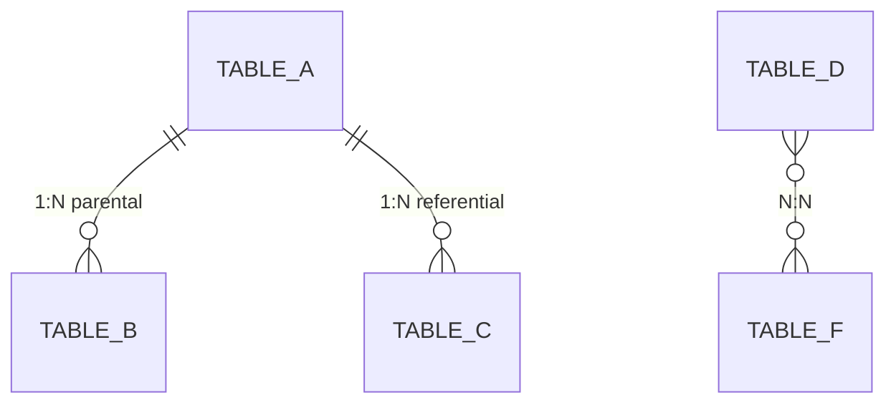
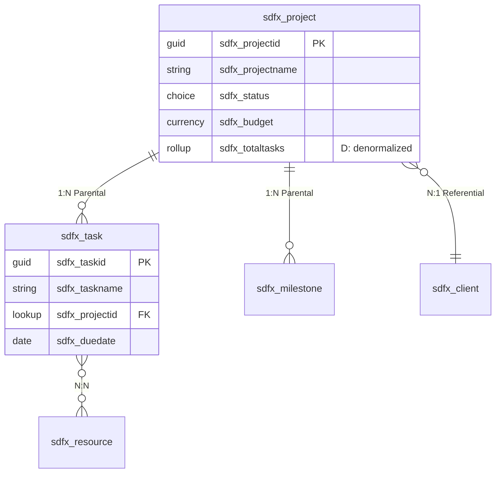

# pp-superpowers — schema-design Skill Specification

**Version:** 1.0
**Date:** March 31, 2026
**Author:** SDFX Studios
**Status:** Approved for build
**Parent document:** pp-superpowers Design Roadmap v1.0

---

## 1. Skill Overview

| Attribute | Value |
|---|---|
| **Name** | schema-design |
| **Domain** | Dataverse table and column design: conceptual → logical → physical data model |
| **Lifecycle group** | Design |
| **Has sub-skills** | No — staged sequential workflow (conceptual → logical → physical are gates, not divergent paths) |
| **Foundation sections consumed** | `00-project-identity`, `01-requirements`, `02-architecture-decisions`, `03-entity-map`, `05-ui-plan` |
| **DDD model consumed** | `docs/ddd-model.md` (recommended, not required) |
| **Upstream dependency** | solution-discovery (foundation must exist); application-design (recommended, not required) |
| **Downstream handoff** | ui-design (forms need schema) or security (FLS needs columns defined) |
| **Agents** | schema-reviewer |

### 1.1 Entry Conditions

schema-design has two entry conditions with different levels of input context:

**With DDD model (recommended path):**
- `docs/ddd-model.md` exists and is complete
- schema-design reads aggregate boundaries, bounded contexts, ubiquitous language, and value object decisions
- Relationship behaviors are pre-informed by aggregate cascade scope
- Naming conventions are pre-informed by ubiquitous language

**Without DDD model (warn-but-allow path):**
- `docs/ddd-model.md` does not exist or is incomplete
- schema-design warns the developer and proceeds using `03-entity-map.md` only
- Aggregate-related decisions (cascade behavior, table grouping) require more developer input during PHYSICAL_MODEL
- Review stage notes that DDD model was not available

### 1.2 Re-entry: Schema Evolution

schema-design supports re-invocation on projects where it has already run. On re-entry, the skill detects existing schema artifacts and offers the developer a choice:

> "I found existing schema design artifacts from a previous run:
> - Physical model: `docs/schema-physical-model.md` (last updated [date])
> - ERD: [Whimsical link or Mermaid in document]
>
> How would you like to proceed?
> - **Full re-run** — walk through all stages again, diffing against the previous model
> - **Delta mode** — start from the existing physical model, identify what changed, and propose only the updates"

**Full re-run** walks all six stages, but each stage's conversation is pre-populated with the previous model's decisions. The developer confirms or changes each decision. The review stage produces a diff against the previous physical model.

**Delta mode** skips directly to a change analysis:
1. Compare current foundation/DDD model against the previous physical model
2. Identify new entities, removed entities, changed relationships, new columns
3. Present proposed changes for confirmation
4. Update the physical model specification and ERD

### 1.3 Relationship to Other Skills

**Upstream:** application-design produces `docs/ddd-model.md` with aggregate definitions and ubiquitous language. schema-design translates these into Dataverse-specific table and column design.

**Downstream:** schema-design produces a physical data model specification that multiple skills consume:
- **ui-design** reads the physical model to understand available columns for form design, view configuration, and chart data sources
- **security** reads the physical model to identify columns requiring field-level security
- **business-logic** reads the physical model to understand entity relationships for plugin and flow design
- **alm-workflow** reads entity names for solution export verification

---

## 2. State Machine

schema-design uses a 6-stage sequential state machine. Each stage gates on the previous stage's completion — you cannot skip from conceptual to physical.

```
INIT → CONCEPTUAL_MODEL → LOGICAL_MODEL → PHYSICAL_MODEL → UX_DENORMALIZATION → PARITY_CHECK → REVIEW → COMPLETE
```

### 2.1 Stage Definitions

| Stage | Purpose | Gate to enter | Can skip? |
|---|---|---|---|
| INIT | Read inputs, detect re-entry, check prerequisites | Foundation exists | No |
| CONCEPTUAL_MODEL | Entities, relationships, cardinality — no types yet | INIT complete | No |
| LOGICAL_MODEL | Attributes, data types, normalization, candidate keys | Conceptual model confirmed | No |
| PHYSICAL_MODEL | Dataverse-specific: column types, table types, properties, behaviors | Logical model confirmed | No |
| UX_DENORMALIZATION | Review physical model against UI plan for performance optimizations | Physical model confirmed | Yes — if no `05-ui-plan.md` exists |
| PARITY_CHECK | Compare against known patterns, invoke pp-research | Denormalization complete (or skipped) | No |
| REVIEW | Two-stage review: spec compliance + quality | Parity check complete | No |
| COMPLETE | Write state, suggest next skill | Review passed | No |

### 2.2 Progress Tracking

```json
{
  "activeSkill": "schema-design",
  "activeStage": "LOGICAL_MODEL",
  "stageHistory": [
    { "stage": "CONCEPTUAL_MODEL", "completedAt": "2026-03-31T14:00:00Z" },
    { "stage": "LOGICAL_MODEL", "startedAt": "2026-03-31T14:15:00Z" }
  ],
  "lastCompleted": "application-design",
  "suggestedNext": null,
  "completedSkills": ["solution-discovery", "application-design"]
}
```

On session resume:

> "You're in schema-design, stage: logical model. Your conceptual model ([N] entities, [M] relationships) is confirmed. Want to continue adding attributes and data types?"

---

## 3. Conversation Flow and Gating Logic

### 3.1 Stage: INIT

**Gate:** Foundation directory exists with at minimum `00-project-identity.md`, `01-requirements.md`, `02-architecture-decisions.md`, and `03-entity-map.md`.

**Action:**
1. Read foundation sections
2. Check for `docs/ddd-model.md` — if present, load DDD model. If absent, warn (see §1.1)
3. Check for `05-ui-plan.md` — if present, note for UX_DENORMALIZATION stage. If absent, note that denormalization will be limited
4. Check for existing schema artifacts — if found, offer re-entry options (see §1.2)
5. Read project identity for publisher prefix (needed for naming conventions)

**Presentation (first run, with DDD):**

> "I've loaded your foundation and DDD model. Starting schema design for [Project Name]:
> - [N] entities across [M] bounded contexts
> - [X] aggregates with defined roots and cascade scope
> - Publisher prefix: [prefix]
> - UI plan: [available | not available — denormalization will be limited]
>
> We'll work through four modeling stages: conceptual → logical → physical → denormalization, then validate against known patterns. Ready to start with the conceptual model?"

**Presentation (first run, without DDD):**

> "I've loaded your foundation. Note: No DDD model found at `docs/ddd-model.md`. I'll proceed using the entity map, but aggregate boundaries and naming conventions will need to be defined as we go.
>
> Consider running **application-design** first if you want DDD-informed schema decisions.
>
> Starting schema design for [Project Name]:
> - [N] entities in entity map
> - Publisher prefix: [prefix]
>
> Ready to proceed?"

### 3.2 Stage: CONCEPTUAL_MODEL

**Input:** Entity map from foundation (and DDD model if available).

**Action:** Translate entities and relationships into a conceptual data model. At this stage, only entities, relationships, and cardinality are defined — no column types, no Dataverse-specific decisions.

**If DDD model is available:**

The conceptual model is largely pre-informed by the DDD model. The skill presents the aggregate-derived entity groupings and asks the developer to confirm:

> "Based on your DDD model, here's the conceptual data model:
>
> **[Aggregate 1]** (root: [Entity A])
> - [Entity A] → [Entity B]: 1:N (parent-child, cascade delete)
> - [Entity A] → [Entity C]: 1:N (parent-child, cascade delete)
>
> **[Aggregate 2]** (root: [Entity D])
> - [Entity D] → [Entity E]: 1:N (parent-child, restrict delete)
> - [Entity D] ↔ [Entity F]: N:N (cross-aggregate reference)
>
> **Cross-aggregate relationships:**
> - [Entity B] → [Entity D]: lookup (referential)
>
> Does this conceptual model look right? Any relationships to add or change?"

**If DDD model is NOT available:**

The skill must derive the conceptual model from the entity map alone:

> "Based on your entity map, here are the entities and relationships I can identify:
>
> | Entity | Relationships |
> |---|---|
> | [Entity A] | → [Entity B] (1:N), → [Entity C] (1:N) |
> | [Entity D] | → [Entity E] (1:N), ↔ [Entity F] (N:N) |
>
> A few questions to clarify the model:
> 1. Which entities are 'parent' entities that own the lifecycle of their children? (This determines cascade delete scope.)
> 2. Are there any N:N relationships I haven't captured?
> 3. Are any of these entities already existing Dataverse system tables or D365 tables?"

**Gate:** Developer confirms entity list, all relationships documented with cardinality, parent-child ownership identified.

**Output:** Conceptual model stored internally for the next stage.

### 3.3 Stage: LOGICAL_MODEL

**Input:** Confirmed conceptual model.

**Action:** Add attributes, data types, normalization rules, and candidate keys. Apply naming conventions from the ubiquitous language (if DDD available) or from project publisher prefix conventions.

**Round 1 — Entity-by-entity attribute definition:**

For each entity, present a proposed attribute list:

> "**[Entity A]** — [description from entity map or DDD model]
>
> | Attribute | Data type | Required? | Notes |
> |---|---|---|---|
> | [Name] | Text (100) | Yes | Primary name field |
> | [Status] | Choice | Yes | Active/Inactive |
> | [Start Date] | Date only | Yes | |
> | [Amount] | Currency | No | |
>
> Naming convention applied: `[prefix]_[entityname]_[attributename]` (lowercase, underscore-separated)
>
> What would you add, remove, or change?"

The skill processes entities in aggregate order (root first, then children) when DDD is available.

**Round 2 — Candidate keys and uniqueness:**

> "Which attributes (or combinations) uniquely identify a record for each entity? These become alternate keys in Dataverse.
>
> | Entity | Candidate key | Attributes |
> |---|---|---|
> | [Entity A] | Natural key | [attribute combination] |
>
> Note: Dataverse always creates a GUID primary key. Alternate keys are for integration scenarios and duplicate detection."

**Round 3 — Normalization review:**

> "Checking normalization:
> - [observation about repeated data groups → suggest extraction to related table]
> - [observation about multi-valued attributes → suggest N:N or child table]
> - [observation about transitive dependencies → suggest normalization]
>
> Any of these should be addressed before moving to the physical model?"

**Gate:** Developer confirms attributes per entity, naming conventions accepted, candidate keys identified, normalization issues resolved.

**Output:** Logical model stored internally.

### 3.4 Stage: PHYSICAL_MODEL

**Input:** Confirmed logical model.

**Action:** Translate the logical model into Dataverse-specific implementation. This is where abstract data types become concrete Dataverse column types, and table properties are configured.

**Round 1 — Column type mapping:**

For each entity, map logical attributes to Dataverse column types:

> "**[Entity A]** — Dataverse column mapping:
>
> | Attribute | Logical type | Dataverse type | Properties |
> |---|---|---|---|
> | [Name] | Text (100) | Single line of text | Max: 100, Format: Text |
> | [Status] | Choice | Choice | Values: Active (1), Inactive (2) |
> | [Start Date] | Date only | Date only | Behavior: User local |
> | [Amount] | Currency | Currency | Precision: 2, Min: 0 |
> | [Parent] | FK to [Entity B] | Lookup | Relationship behavior: Referential |
>
> Any type mappings to adjust?"

**Round 2 — Table type and properties:**

> "Table configuration for [Entity A]:
>
> | Property | Value | Rationale |
> |---|---|---|
> | Table type | Standard | [or Activity, Virtual, Elastic — with rationale] |
> | Ownership | User/Team | [or Organization — based on security profile] |
> | Audit changes | Yes | [recommended for entities with business logic] |
> | Change tracking | Yes | [recommended for integration scenarios] |
> | Duplicate detection | [Yes/No] | [based on alternate key candidates] |
>
> Confirm or adjust?"

**Round 3 — Relationship behaviors:**

> "Relationship behavior configuration:
>
> | Relationship | Type | Behavior | Cascade actions |
> |---|---|---|---|
> | [Entity A] → [Entity B] | 1:N | Parental | Assign: Cascade, Delete: Cascade, Share: Cascade, Reparent: Cascade |
> | [Entity A] → [Entity C] | 1:N | Referential | Assign: None, Delete: Restrict, Share: None, Reparent: None |
> | [Entity D] ↔ [Entity F] | N:N | — | N/A (intersection table managed by Dataverse) |
>
> [If DDD available:] These behaviors align with your aggregate cascade scope definitions.
> [If DDD not available:] I've inferred these behaviors from the parent-child ownership you confirmed. Review carefully — cascade delete is permanent.
>
> Confirm or adjust?"

**Gate:** Developer confirms all column types, table properties, and relationship behaviors.

**Output:** Physical model written to `docs/schema-physical-model.md` (see §4.2 for template). ERD generated in Whimsical (see §5).

### 3.5 Stage: UX_DENORMALIZATION

**Gate:** Physical model confirmed. `05-ui-plan.md` exists. If UI plan is absent, this stage is skipped with a note.

**Input:** Physical model + UI plan.

**Action:** Review the physical model against the UI plan. Identify where denormalization improves form performance or user experience.

**Denormalization candidates to evaluate:**

| Pattern | When to apply | Dataverse mechanism |
|---|---|---|
| Rollup column | Parent needs a count or sum from children | Rollup column (real-time or scheduled) |
| Calculated column | Derived value from same-record attributes | Calculated or formula column |
| Denormalized lookup | Form needs to display a field from a related record without navigating | Copy the value via plugin or flow on change |
| Status rollup | Parent status depends on children's statuses | Rollup or plugin-maintained status field |

**Presentation:**

> "Reviewing your physical model against the UI plan:
>
> **Candidate 1: [Rollup on Entity A]**
> - UI plan shows [Persona X] needs to see total [Amount] on the [Entity A] form
> - Currently requires navigation to child records to calculate
> - **Recommendation:** Add rollup column `[prefix]_total[amount]` on [Entity A]
> - **Tradeoff:** Rollup columns update on a schedule (or real-time with config) — not instant
>
> **Candidate 2: [Denormalized lookup on Entity B]**
> - UI plan shows [Entity B] form needs to display [Entity A]'s [Name] without navigation
> - **Recommendation:** This is handled natively by Dataverse lookup rendering — no denormalization needed
>
> Accept, reject, or modify each recommendation?"

**Gate:** Developer confirms or rejects each denormalization candidate.

**Output:** Accepted denormalizations added to physical model specification. Full analysis written to de-normalization decision log (see §4.3).

### 3.6 Stage: PARITY_CHECK

**Input:** Completed physical model (with denormalizations applied).

**Action:** Compare the proposed schema against known patterns for similar systems. Invoke pp-research (if available) for Microsoft Learn documentation.

**Check categories:**

1. **System table awareness:** Are any proposed custom tables duplicating functionality already available in Dataverse system tables (Contact, Account, Activity, etc.) or Dynamics 365 tables (Lead, Opportunity, Case, etc.)?

2. **Platform pattern alignment:** Does the schema follow established Dataverse patterns?
   - Activity entities for interactions with timeline support
   - Connection entities for flexible many-to-many relationships
   - Queue entities for work distribution
   - Knowledge articles for content management

3. **Known anti-patterns:**
   - Excessively wide tables (100+ columns) — suggest splitting
   - Deep relationship chains (5+ levels) — performance concern
   - N:N relationships without intersection entity attributes — suggest evaluating if a custom intersection table is needed
   - Overuse of global option sets where local choices suffice
   - Missing alternate keys on entities used in integrations

4. **Documentation verification (via pp-research):**
   - Verify column type limitations are respected (text max length, choice value count, currency precision)
   - Check for deprecated features or upcoming changes
   - Validate relationship behavior combinations are supported

**Presentation:**

> "Parity check results:
>
> **System table overlap:**
> - [Finding or "No overlap detected"]
>
> **Pattern alignment:**
> - [Finding or "Schema follows standard Dataverse patterns"]
>
> **Anti-pattern scan:**
> - [HIGH/MEDIUM/LOW] [finding description]
>
> **Documentation verification:**
> - [Results from pp-research, or "pp-research not available — manual verification recommended"]
>
> Address findings before proceeding to review?"

**Gate:** All HIGH findings resolved. MEDIUM findings addressed or explicitly accepted with rationale. LOW findings noted.

### 3.7 Stage: REVIEW

**Action:** Two-stage review following the pp-superpowers review pattern.

**Stage 1 — Spec compliance (schema-reviewer agent):**

Dispatch the schema-reviewer agent (§6) with the physical model, foundation sections, and DDD model (if available). The agent checks:
- Every entity in the entity map is represented in the physical model
- Every aggregate's cascade scope matches relationship behaviors (if DDD available)
- Naming conventions are consistently applied
- Alternate keys are defined for entities involved in integrations
- Audit and change tracking are configured per foundation requirements
- Relationship behaviors are correctly configured (no orphan cascade, no accidental restrict)

**Stage 2 — Quality validation:**

After spec compliance passes, quality checks:
- No anti-patterns from parity check remain unresolved (HIGH)
- Denormalization decisions are documented with rationale
- Column types are appropriate for the data they store
- Table ownership aligns with security profile personas
- Physical model document is complete per template

**Presentation:**

> "Schema review results:
>
> **Spec compliance:**
> - [✓/✗] All entities represented
> - [✓/✗] Relationship behaviors match aggregate scope
> - [✓/✗] Naming conventions consistent
> - [✓/✗] Alternate keys defined
> - [✓/✗] Audit configuration complete
>
> **Quality:**
> - [✓/✗] No unresolved anti-patterns
> - [✓/✗] Denormalization documented
> - [✓/✗] Column types appropriate
> - [✓/✗] Ownership aligned with security
> - [✓/✗] Physical model document complete
>
> [If any ✗:] Issues to resolve: [list]
> [If all ✓:] Schema design is complete. Ready to close?"

**Gate:** All checks pass. Developer confirms.

### 3.8 Stage: COMPLETE

**Action:**
1. Write completion state:
   ```json
   {
     "activeSkill": null,
     "lastCompleted": "schema-design",
     "suggestedNext": "ui-design",
     "completedSkills": ["solution-discovery", "application-design", "schema-design"],
     "artifacts": [
       { "skill": "application-design", "file": "docs/ddd-model.md", "createdAt": "..." },
       { "skill": "schema-design", "file": "docs/schema-physical-model.md", "createdAt": "..." },
       { "skill": "schema-design", "file": "docs/schema-denormalization-log.md", "createdAt": "..." }
     ]
   }
   ```

2. Handoff suggestion:
   > "Schema design is complete. Your physical model has [N] tables, [M] relationships, and [X] denormalization decisions.
   >
   > Artifacts produced:
   > - Physical model: `docs/schema-physical-model.md`
   > - ERD: [Whimsical link]
   > - De-normalization log: `docs/schema-denormalization-log.md`
   >
   > I'd suggest moving to **ui-design** next — your forms and views need the column definitions from the physical model.
   >
   > Other options:
   > - **security** — if field-level security design should happen before UI
   > - **business-logic** — if you want to start building plugins or flows
   > - **Any other skill**
   >
   > What would you like to work on next?"

3. Wait for confirmation.

---

## 4. Output Specifications

### 4.1 Conceptual Data Model

The conceptual model is stored internally during the skill workflow and does not produce a standalone file. It is captured within the physical model document's overview section.

If Whimsical is available, a conceptual-level diagram is generated during the PHYSICAL_MODEL stage as part of the ERD (showing entities and relationships without column detail).

### 4.2 Physical Model Specification — `docs/schema-physical-model.md`

This is the primary output artifact. Written at the end of the PHYSICAL_MODEL stage and updated during UX_DENORMALIZATION.

```markdown
# Physical Data Model — [Project Name]

**Generated by:** schema-design (pp-superpowers)
**Date:** [timestamp]
**DDD model:** [available at docs/ddd-model.md | not used]
**Publisher prefix:** [prefix]

---

## Overview

- Total tables: [N]
- Custom tables: [N]
- System/D365 tables extended: [N]
- Relationships: [N] (1:N: [x], N:N: [y])
- Bounded contexts: [N] (from DDD model, or "not defined")

## Naming Conventions

| Element | Convention | Example |
|---|---|---|
| Table logical name | `[prefix]_[entityname]` | `sdfx_project` |
| Table display name | Title Case, singular | Project |
| Column logical name | `[prefix]_[attributename]` | `sdfx_projectname` |
| Column display name | Title Case, spaces | Project Name |
| Lookup column | `[prefix]_[relatedentity]id` | `sdfx_clientid` |
| Choice (local) | `[prefix]_[entityname]_[choicename]` | `sdfx_project_status` |
| Choice (global) | `[prefix]_[choicename]` | `sdfx_priority` |
| Alternate key | `[prefix]_[keyname]_key` | `sdfx_projectcode_key` |

---

## Tables

### [Table Name 1] — `[prefix]_[tablename]`

**Bounded context:** [context name, if DDD available]
**Aggregate:** [aggregate name] (role: [root | member])
**Table type:** [Standard | Activity | Virtual | Elastic]
**Ownership:** [User/Team | Organization]

| Configuration | Value |
|---|---|
| Audit changes | [Yes | No] |
| Change tracking | [Yes | No] |
| Duplicate detection | [Yes | No] |
| Business process flows | [Yes | No] |

**Columns:**

| # | Display name | Logical name | Type | Required | Properties | Notes |
|---|---|---|---|---|---|---|
| 1 | [Name] | [prefix]_[name] | Single line of text | Yes | Max: 100, Format: Text | Primary name column |
| 2 | [Status] | [prefix]_[status] | Choice | Yes | Values: Active (1), Inactive (2) | |
| 3 | [Amount] | [prefix]_[amount] | Currency | No | Precision: 2, Min: 0 | |
| 4 | [Start Date] | [prefix]_[startdate] | Date only | Yes | Behavior: User local | |
| 5 | [Parent] | [prefix]_[parent]id | Lookup | Yes | Target: [parent table] | Relationship: Parental |
| D1 | [Total Amount] | [prefix]_[totalamount] | Rollup | — | Source: [child table].[amount], Function: SUM | *Denormalized — see log* |

> Columns prefixed with "D" are denormalized columns added during UX_DENORMALIZATION. See `docs/schema-denormalization-log.md` for full rationale.

**Alternate keys:**

| Key name | Columns | Purpose |
|---|---|---|
| [prefix]_[keyname]_key | [column list] | [integration | duplicate detection | upsert] |

**Relationships (as parent):**

| Child table | Type | Behavior | Cascade: Assign | Cascade: Delete | Cascade: Share | Cascade: Reparent |
|---|---|---|---|---|---|---|
| [child table] | 1:N | Parental | Cascade | Cascade | Cascade | Cascade |
| [related table] | 1:N | Referential | None | Restrict | None | None |

**Relationships (as child):**

| Parent table | Lookup column | Behavior |
|---|---|---|
| [parent table] | [prefix]_[parent]id | [Parental | Referential] |

**N:N relationships:**

| Related table | Intersection table | Notes |
|---|---|---|
| [table] | [auto-generated or custom] | [attributes on intersection, if any] |

### [Table Name 2] — `[prefix]_[tablename]`
[same structure]

---

## ERD

### Full ERD
[Whimsical link or "See Mermaid diagram below"]

### Mermaid (fallback or supplementary)


---

## Schema Version History

| Version | Date | Changes | Mode |
|---|---|---|---|
| 1.0 | [date] | Initial schema design | [First run] |
```

### 4.3 De-normalization Decision Log — `docs/schema-denormalization-log.md`

Separate document for the full tradeoff analysis. Each denormalization also has a brief inline rationale in the physical model's Notes column.

```markdown
# De-normalization Decision Log — [Project Name]

**Generated by:** schema-design (pp-superpowers)
**Date:** [timestamp]

---

## Summary

| # | Table | Column | Type | Decision | Impact |
|---|---|---|---|---|---|
| 1 | [table] | [column] | Rollup | Accepted | [brief impact] |
| 2 | [table] | [column] | Calculated | Rejected | [brief reason] |

---

## Decision Details

### D1: [Column Name] on [Table Name]

**Type:** [Rollup | Calculated | Formula | Denormalized lookup | Plugin-maintained]

**UI requirement:** [What the UI plan says — which persona needs this, on which form]

**Current state:** [How this information is accessed today — navigation, sub-grid, manual lookup]

**Proposed change:** [What denormalization adds — new column, type, configuration]

**Benefits:**
- [performance improvement, UX improvement, reduced clicks]

**Costs:**
- [staleness risk, storage overhead, maintenance complexity, sync mechanism needed]

**Decision:** [Accepted | Rejected | Deferred]

**Rationale:** [Why this tradeoff is worth it — or why it isn't]

**Implementation notes:** [Dataverse mechanism: rollup column config, calculated field formula, plugin trigger for sync]

### D2: [Column Name] on [Table Name]
[same structure]
```

---

## 5. Whimsical Integration — ERD

### 5.1 ERD Generation

The ERD is generated during the PHYSICAL_MODEL stage after the developer confirms all table definitions. It uses Whimsical's `flowchart_create` tool with Mermaid ER diagram syntax.

**What the ERD shows:**
- All tables as entities with their key columns (primary key, alternate keys, lookup columns)
- Relationship lines with cardinality labels (1:N, N:N)
- Relationship behavior annotations (Parental, Referential, Restrict)
- Bounded context groupings (as subgraphs) if DDD model is available
- Denormalized columns marked distinctly (after UX_DENORMALIZATION)

**Mermaid ER syntax for Whimsical:**



### 5.2 Fallback Behavior

If Whimsical MCP is not available, the ERD is generated as a Mermaid code block within `docs/schema-physical-model.md` in the ERD section. The Mermaid version omits some visual features (bounded context groupings, color-coding) but preserves all structural information.

---

## 6. Agent Definition — schema-reviewer

```markdown
# schema-reviewer

## Role
Reviews a Dataverse physical data model for naming convention compliance,
relationship anti-patterns, missing configuration, and alignment with the
DDD model (if available) and foundation requirements.

## Invoked by
schema-design skill — REVIEW stage (spec compliance check).

## Input context
- Physical model specification: docs/schema-physical-model.md
- Foundation sections: 00-project-identity, 01-requirements, 02-architecture-decisions,
  03-entity-map, 05-ui-plan (if available)
- DDD model: docs/ddd-model.md (if available)
- De-normalization decision log: docs/schema-denormalization-log.md
- Environment context from .pp-context/environment.json (if available)

## Evaluation criteria (ordered by priority)

### HIGH — Must fix before approval
1. **Entity coverage:** Every entity in 03-entity-map.md has a corresponding table
   in the physical model. No entities are silently dropped.
2. **Aggregate alignment (if DDD available):** Relationship behaviors match aggregate
   cascade scope. Parental relationships exist where DDD defines cascade delete.
   Referential/Restrict exist where DDD defines reference-only.
3. **Naming convention violations:** All table and column logical names follow the
   documented naming convention. Publisher prefix is consistently applied.
4. **Relationship behavior errors:** No cascade delete on referential relationships.
   No restrict delete on parental relationships (would create orphans).
5. **Missing primary name column:** Every table has a designated primary name column.

### MEDIUM — Should fix, document if accepted
6. **Missing alternate keys:** Entities involved in integrations (per 07-integration-map.md
   or 02-architecture-decisions.md) should have alternate keys defined.
7. **Audit configuration gaps:** Entities with business logic triggers or sensitive
   data should have audit enabled.
8. **Change tracking gaps:** Entities involved in data sync or integration should
   have change tracking enabled.
9. **Denormalization without rationale:** Denormalized columns exist in the physical
   model but are not documented in the de-normalization decision log.
10. **Over-wide tables:** Tables with 50+ columns — suggest splitting or review.

### LOW — Note for consideration
11. **Global vs. local choice:** Global option sets used where local choices would
    be more appropriate (or vice versa).
12. **Missing description:** Columns without description metadata.
13. **Date behavior inconsistency:** Mix of User Local and Date Only behaviors
    without documented rationale.
14. **Activity table candidates:** Entities that represent interactions (emails,
    calls, meetings) that could be Activity type tables instead of Standard.

## Output format
Return a structured findings report:

### Findings Report

| # | Severity | Category | Table | Finding | Recommendation |
|---|---|---|---|---|---|
| 1 | HIGH | Naming | [table] | [description] | [fix] |
| 2 | MEDIUM | Config | [table] | [description] | [fix or accept with rationale] |

**Summary:**
- HIGH findings: [N] (must resolve)
- MEDIUM findings: [N] (should resolve)
- LOW findings: [N] (for consideration)
- Overall assessment: [PASS | PASS WITH NOTES | FAIL]

## Does not
- Make column type recommendations (that was done in PHYSICAL_MODEL stage)
- Evaluate denormalization tradeoffs (that was done in UX_DENORMALIZATION stage)
- Check code quality of any plugins or scripts (that's plugin-auditor)
- Modify the physical model directly (reports findings for the developer to act on)
- Validate against live Dataverse environment (reads specification documents only)
```

---

## 7. Knowledge Domains

These knowledge domains are built into the schema-design SKILL.md as reference material. They inform the skill's recommendations during the LOGICAL_MODEL and PHYSICAL_MODEL stages.

### 7.1 Dataverse Column Types

| Category | Types | When to use |
|---|---|---|
| **Text** | Single line of text, Multiple lines of text, Rich text, Email, URL, Ticker symbol, Phone | Single line for most text. Rich text only when formatting is needed. Use format-specific types (Email, URL, Phone) for validation. |
| **Number** | Whole number, Decimal, Float, Currency | Whole number for integers and picklist-backing values. Currency for money (respects org currency settings). Avoid Float unless scientific data. |
| **Date/Time** | Date only, Date and time | Date only for birthdays, deadlines. Date and time for events, timestamps. Choose behavior carefully: User Local, Date Only, Time Zone Independent. |
| **Choice** | Choice (local), Choices (multi-select), Yes/No | Choice for single-select enumerations. Choices for multi-select (limited query support). Yes/No for boolean flags. |
| **Lookup** | Lookup, Customer, Regarding | Lookup for standard FK relationships. Customer for polymorphic Account/Contact. Regarding for Activity-type tables. |
| **Calculated** | Calculated, Rollup, Formula | Calculated for same-record derivations. Rollup for child-aggregate values. Formula for real-time cross-record calculations (newer, limited type support). |
| **File/Image** | File, Image | File for attachments (up to 128MB). Image for entity record images. |
| **Other** | Autonumber, Unique identifier | Autonumber for human-readable sequences. GUID is auto-created as primary key. |

### 7.2 Dataverse Table Types

| Type | When to use | Key characteristics |
|---|---|---|
| **Standard** | Default for most business entities | Full CRUD, security, audit, workflows |
| **Activity** | Entities representing interactions (emails, calls, tasks, appointments) | Inherits from Activity entity. Appears in timeline. Has activity parties (From, To, CC). |
| **Virtual** | External data surfaced without import | No local storage. OData provider connects to external source. Read-only or read-write depending on provider. Limited query support. |
| **Elastic** | High-volume, high-throughput scenarios | Cosmos DB backing. Partitioning support. No relational joins. |

### 7.3 Relationship Behavior Reference

| Behavior | Assign | Delete | Share | Reparent | Use when |
|---|---|---|---|---|---|
| **Parental** | Cascade | Cascade | Cascade | Cascade | Parent owns child lifecycle. Deleting parent deletes all children. |
| **Referential** | None | Restrict | None | None | Related but independent. Cannot delete parent while children reference it. |
| **Referential, Restrict Delete** | None | Restrict | None | None | Same as Referential — explicit about delete restriction. |
| **Custom** | [configurable] | [configurable] | [configurable] | [configurable] | When standard behaviors don't fit. Document rationale. |
| **None (Remove Link)** | None | Remove Link | None | None | Deleting parent nullifies lookup on children. Children become orphans. Use sparingly. |

### 7.4 Naming Convention Rules

These rules apply unless the developer overrides with project-specific conventions during LOGICAL_MODEL:

1. **Publisher prefix is mandatory** on all custom tables and columns
2. **Logical names are lowercase** with no spaces — underscores separate words
3. **Display names are Title Case** with spaces
4. **Singular nouns for table names** (Project, not Projects)
5. **No abbreviations** unless universally understood (ID, URL, etc.)
6. **Lookup columns end with `id`** in logical name (`sdfx_projectid`)
7. **Boolean columns start with `is` or `has`** (`sdfx_isactive`, `sdfx_haschildren`)
8. **Choice columns named for the concept**, not "status" generically (`sdfx_approvalstatus`, not `sdfx_status2`)
9. **Avoid reserved words:** Name, Type, Status, State, Owner are used by system columns — prefix custom columns to avoid collision

### 7.5 Known Anti-Patterns

| Anti-pattern | Why it's a problem | Mitigation |
|---|---|---|
| Wide tables (100+ columns) | Performance degradation, difficult form design, maintenance burden | Split into related tables or use JSON columns for rarely-used attributes |
| Deep cascade chains (5+ levels) | Cascade operations can timeout; difficult to reason about side effects | Flatten hierarchy or use referential relationships for distant relations |
| Overuse of N:N without attributes | If the relationship needs attributes (e.g., role, date), native N:N won't support it | Use a custom intersection table with 1:N from both sides |
| Global option sets for local concepts | Changes affect all entities using the option set; version control complexity | Use local choices unless the values genuinely must be shared |
| Missing alternate keys on integration entities | Upsert operations require alternate keys; without them, integrations must maintain GUID mappings | Define alternate keys on natural business identifiers |
| Calculated columns for cross-entity logic | Calculated columns only reference same-record fields; cross-entity requires rollup or plugin | Use rollup columns or plugin-maintained fields for cross-entity calculations |

---

## 8. Parity Check Methodology

### 8.1 Generic Parity Check Process

The parity check compares the proposed schema against known patterns without requiring project-specific reference data. It uses three sources:

**Source 1 — System table awareness (built into SKILL.md):**
- Dataverse system tables: Contact, Account, Team, Business Unit, Currency, Transaction Currency
- Common Dynamics 365 tables: Lead, Opportunity, Case, Quote, Order, Invoice, Product, Price List
- Project Operations tables: Project, Task, Resource, Booking, Time Entry, Expense
- Identify overlap between proposed custom tables and existing platform tables

**Source 2 — Platform pattern library (built into SKILL.md):**
- Activity pattern for interactions
- Connection pattern for flexible relationships
- Queue pattern for work distribution
- Note/Annotation pattern for comments and attachments
- Business process flow pattern for guided workflows

**Source 3 — Microsoft Learn documentation (via pp-research, when available):**
- Current column type specifications and limitations
- Relationship behavior documentation
- Table type capabilities and constraints
- Deprecated features or upcoming changes

### 8.2 Parity Check Output

Findings are categorized as:
- **OVERLAP:** Custom table duplicates system table functionality — evaluate whether to use the system table instead
- **PATTERN_CANDIDATE:** Custom table matches a known platform pattern — evaluate whether the pattern applies
- **ANTI_PATTERN:** Schema contains a known anti-pattern (§7.5)
- **DOCUMENTATION_FLAG:** pp-research found relevant documentation that should be reviewed

### 8.3 Future Enhancement: Project-Specific Parity

When the developer provides existing schema artifacts from past projects, the parity check will be enhanced to compare against those patterns. This is deferred to a future iteration — the current parity check methodology works generically.

---

## 9. Handoff Contract — schema-design → downstream

### 9.1 What ui-design receives

ui-design reads `docs/schema-physical-model.md` to understand:
- Available columns per entity (for form field placement)
- Column types (determines form control type)
- Required vs. optional columns (form validation)
- Lookup relationships (determines related-record controls)
- Denormalized columns (may affect form layout decisions)

### 9.2 What security receives

security reads `docs/schema-physical-model.md` to understand:
- Entity inventory (for role-entity privilege matrix)
- Column inventory (for field-level security profile design)
- Table ownership type (User/Team vs. Organization — affects privilege model)

### 9.3 What business-logic receives

business-logic reads `docs/schema-physical-model.md` to understand:
- Entity relationships (for plugin trigger design)
- Column types and constraints (for validation logic)
- Alternate keys (for integration plugin design)
- Cascade behaviors (for understanding side effects of operations)

### 9.4 Minimum completeness for handoff

schema-design's physical model is considered complete for handoff when:
- All entities have column definitions with Dataverse types
- All relationships have configured behaviors
- Naming conventions are consistently applied
- The review stage has passed (spec compliance + quality)

Denormalization is valuable but not blocking — ui-design can proceed without it and denormalization can be revisited.

---

## 10. Decision Log

| # | Decision | Rationale |
|---|---|---|
| 1 | ERD (Whimsical) + specification tables as physical model format | Visual for relationships, markdown for column-level detail; both are needed |
| 2 | Both inline rationale + separate de-normalization decision log | Inline for quick reference during build; separate log for full tradeoff analysis |
| 3 | Developer chooses re-entry mode (full re-run vs. delta) | Both modes have valid use cases; developer knows their project's state best |
| 4 | Warn-but-allow when running without DDD model | Some projects don't need DDD; forcing it blocks simple schema work |
| 5 | Sequential gates (conceptual → logical → physical) not sub-skills | These are sequential stages of increasing specificity, not divergent workflows |
| 6 | UX_DENORMALIZATION skippable if no UI plan | Can't denormalize for UX without knowing the UX requirements |
| 7 | Parity check designed generically, project-specific enhancement deferred | Generic checks (system tables, anti-patterns, documentation) provide value without requiring reference data |
| 8 | schema-reviewer invokes pp-research during parity check | Combines review with live documentation verification in a single stage |
| 9 | Physical model as markdown with Whimsical ERD | Markdown is diffable in Git; Whimsical ERD persists visually across sessions |

---

## 11. Open Items for Build

Items deferred to the build phase:

- **Entity Catalog integration:** How schema-design reads from / writes to the Entity Catalog (if it exists) vs. the physical model specification
- **Schema diff tooling:** How delta mode produces a meaningful diff between previous and current physical model versions
- **PAC CLI scaffold integration:** Whether schema-design should produce draft PAC CLI commands for table/column creation (deferred from output format decision — kept as future enhancement)
- **Multi-solution schema partitioning:** Detailed rules for when bounded contexts split across solutions and how the physical model handles table ownership across solution boundaries
- **Whimsical ERD board management:** Strategy for updating vs. creating new ERD boards on schema re-runs
- **Choice value management:** How the skill handles choice column value lists — inline in the physical model vs. separate reference document