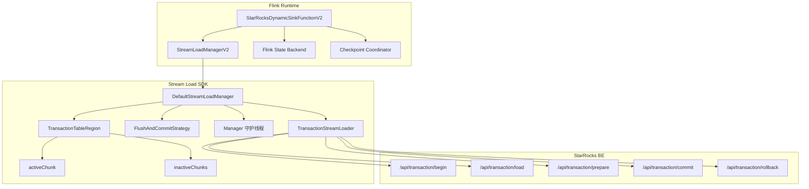
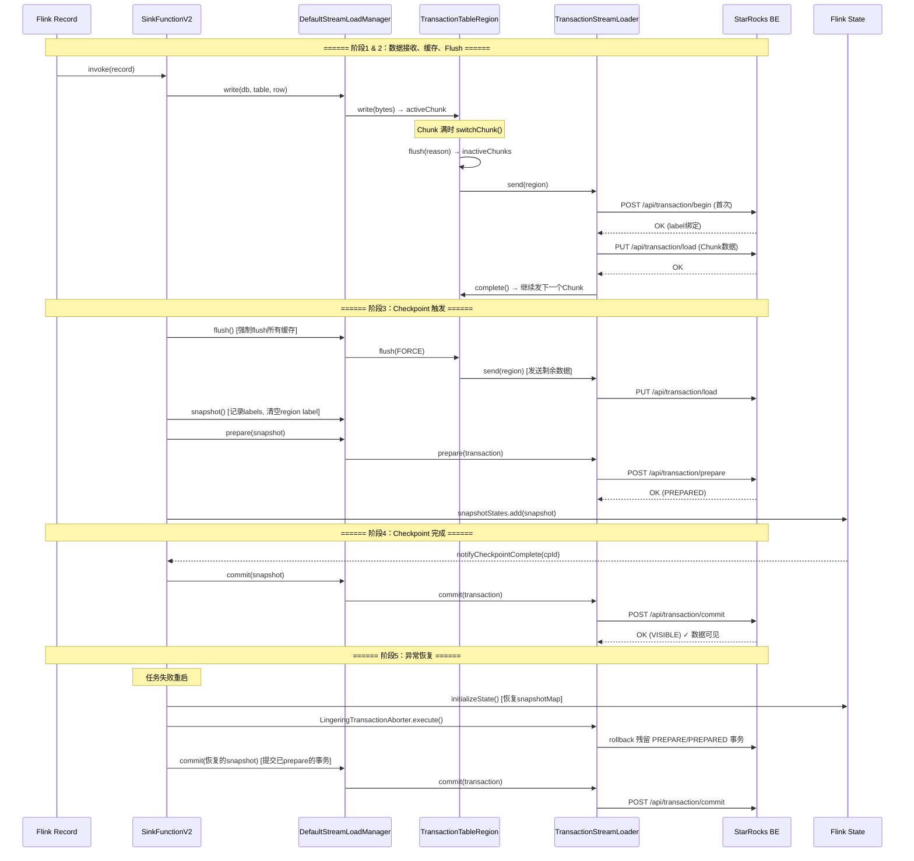

# Flink 写 StarRocks 完整数据流转分析

> 基于 [starrocks-connector-for-apache-flink](https://github.com/StarRocks/starrocks-connector-for-apache-flink) 源码分析，聚焦 **Exactly-Once** 语义下的 Transaction Stream Load 机制。

---

## 目录

- [1. 架构总览](#1-架构总览)
- [2. 事务 HTTP API](#2-事务-http-api)
- [3. 完整数据流转流程](#3-完整数据流转流程)
  - [阶段 1：数据接收与本地缓存](#阶段-1数据接收与本地缓存)
  - [阶段 2：Flush 触发与数据发送](#阶段-2flush-触发与数据发送)
  - [阶段 3：Checkpoint 触发（snapshotState）](#阶段-3checkpoint-触发snapshotstate)
  - [阶段 4：Checkpoint 完成 → Commit](#阶段-4checkpoint-完成--commit)
  - [阶段 5：异常处理与恢复](#阶段-5异常处理与恢复)
- [4. 时序图（Exactly-Once 完整流程）](#4-时序图exactly-once-完整流程)
- [5. V2 Sink API 对比](#5-v2-sink-api-对比)
- [6. 事务生命周期总结](#6-事务生命周期总结)
- [7. 常见误区](#7-常见误区)
- [8. 关键代码文件索引](#8-关键代码文件索引)

---

## 1. 架构总览


Flink Connector 写入 StarRocks 的核心组件层次如下：

```
StarRocksDynamicSinkFunctionV2        ← Flink SinkFunction + CheckpointedFunction
    │
    ├── invoke()                       ← 数据接收入口
    ├── snapshotState()                ← Checkpoint 时 flush + prepare
    ├── notifyCheckpointComplete()     ← Checkpoint 成功后 commit
    └── close()                        ← 任务关闭时 abort
            │
            ▼
      StreamLoadManagerV2              ← 代理/委托层
            │
            ▼
      DefaultStreamLoadManager         ← 真正实现
            │
            ├── TransactionTableRegion ← 每个表一个，管理三级缓存
            │       ├── activeChunk    ← 正在接收数据的内存块
            │       └── inactiveChunks ← 待发送的 Chunk 队列
            │
            ├── FlushAndCommitStrategy ← flush/commit 决策策略
            │
            ├── Manager 守护线程       ← 周期性扫描，触发 flush/commit
            │
            └── TransactionStreamLoader ← HTTP 事务操作
                    ├── begin()        → /api/transaction/begin
                    ├── send()         → /api/transaction/load
                    ├── prepare()      → /api/transaction/prepare
                    ├── commit()       → /api/transaction/commit
                    └── rollback()     → /api/transaction/rollback
```



---

## 2. 事务 HTTP API

StarRocks 的 Transaction Stream Load 提供以下 HTTP 接口（定义于 `StreamLoadConstants`）：

| 操作 | HTTP 方法 | URL | 说明 |
|------|-----------|-----|------|
| **begin** | POST | `/api/transaction/begin` | 开启一个新事务，绑定 label |
| **send** | PUT | `/api/transaction/load` | 在已开启的事务内发送数据 |
| **prepare** | POST | `/api/transaction/prepare` | 预提交事务（两阶段提交第一阶段） |
| **commit** | POST | `/api/transaction/commit` | 正式提交事务，数据可见 |
| **rollback** | POST | `/api/transaction/rollback` | 回滚事务，丢弃数据 |

每个事务通过唯一的 **label** 标识。在 Exactly-Once 模式下，label 由 `ExactlyOnceLabelGeneratorFactory` 生成，格式可预测（包含 labelPrefix、table、subtaskIndex、checkpointId），便于故障恢复时定位残留事务。

---

## 3. 完整数据流转流程


### 阶段 1：数据接收与本地缓存

**入口**：`StarRocksDynamicSinkFunctionV2.invoke()`

```java
// StarRocksDynamicSinkFunctionV2.java:124-177
public void invoke(T value, Context context) throws Exception {
    // 1. 数据序列化
    String serializedValue = serializer.serialize(
        rowTransformer.transform(value, sinkOptions.supportUpsertDelete()));
    // 2. 写入 Manager
    sinkManager.write(null, database, table, serializedValue);
}
```

**缓存写入**：`DefaultStreamLoadManager.write()` → `TransactionTableRegion.write()`

```java
// DefaultStreamLoadManager.java:260-299
public void write(String uniqueKey, String database, String table, String... rows) {
    TableRegion region = getCacheRegion(uniqueKey, database, table);
    for (String row : rows) {
        int bytes = region.write(row.getBytes(StandardCharsets.UTF_8));
        long cachedBytes = currentCacheBytes.addAndGet(bytes);
        // 背压：总缓存 >= 2*maxCacheBytes 时阻塞写入线程
        if (cachedBytes >= maxWriteBlockCacheBytes) {
            // ... 等待 flush 释放内存
        }
        // 总缓存 >= maxCacheBytes 时唤醒 manager 线程触发 flush
        else if (cachedBytes >= maxCacheBytes) {
            flushable.signal();
        }
    }
}
```

**三级缓存结构**：

```
activeChunk (当前接收数据)
    │  Chunk 大小超过 chunkLimit 或行数超过 maxBufferRows
    ▼
inactiveChunks (待发送队列)
    │  flush 时通过 HTTP 发送
    ▼
StarRocks (通过 Transaction Stream Load)
```

- **activeChunk**：当前正在接收数据的 `Chunk`，超过阈值后 `switchChunk()` 移入 `inactiveChunks`
- **inactiveChunks**：`ConcurrentLinkedQueue<Chunk>`，flush 时逐个通过 HTTP 发送到 StarRocks
- **背压机制**：`currentCacheBytes >= 2 * maxCacheBytes` 时阻塞 `write()` 线程

---

### 阶段 2：Flush 触发与数据发送

Flush 有 **5 种触发条件**：

| # | 触发方式 | 来源 | FlushReason |
|---|----------|------|-------------|
| 1 | 定时扫描 - region age 超限 | Manager 守护线程 `shouldCommit()` | `COMMIT` |
| 2 | 定时扫描 - 行数达限 | Manager 守护线程 `region.shouldFlush()` | `BUFFER_ROWS_REACH_LIMIT` |
| 3 | 定时扫描 - 总缓存满 | Manager 守护线程 `selectFlushRegions()` | `CACHE_FULL` |
| 4 | 写入触发 | `write()` 中缓存超阈值 | 间接唤醒 Manager |
| 5 | **Checkpoint 强制 flush** | `snapshotState()` → `sinkManager.flush()` | `FORCE` |

**Flush 执行链路**：

```
TransactionTableRegion.flush(reason)
    → switchChunk()           // 将 activeChunk 移入 inactiveChunks
    → streamLoad(0)           // 取出 Chunk 发送
        → streamLoader.send(region, delayMs)
            → begin(region)   // 首次 flush 时开启事务
            → sendToSR(region) // HTTP PUT 发送数据
```

**事务开启时机**（`TransactionStreamLoader.begin()`）：

```java
// TransactionStreamLoader.java:117-128
public boolean begin(TableRegion region) {
    if (region.getLabel() == null) {
        // 第一次 flush（或 snapshot 后 label 被清空）→ 生成新 label，开启新事务
        region.setLabel(region.getLabelGenerator().next());
        if (doBegin(region)) {  // HTTP POST /api/transaction/begin
            return true;
        }
    }
    return true;  // 已有 label → 复用同一事务
}
```

> **关键点**：事务在**第一次 flush 发送数据时**通过 `begin()` 开启，**不是** Checkpoint 时才开启。同一个事务（同一个 label）内可以多次 `send` 不同的 Chunk。

**数据发送**（`DefaultStreamLoader.sendToSR()`）：

```java
// DefaultStreamLoader.java:283-361
protected StreamLoadResponse sendToSR(TableRegion region) {
    String sendUrl = getSendUrl(host, region.getDatabase(), region.getTable());
    // 事务模式下：/api/transaction/load
    // 非事务模式：/api/{db}/{table}/_stream_load
    HttpPut httpPut = new HttpPut(sendUrl);
    httpPut.setEntity(region.getHttpEntity());  // Chunk 数据
    // ... 执行 HTTP 请求
    region.complete(streamLoadResponse);  // 成功回调
}
```

**发送完成回调**（`TransactionTableRegion.complete()`）：

```java
// TransactionTableRegion.java:378-398
public void complete(StreamLoadResponse response) {
    Chunk chunk = inactiveChunks.remove();       // 移除已发送的 Chunk
    cacheBytes.addAndGet(-chunk.rowBytes());      // 更新缓存统计
    if (!inactiveChunks.isEmpty()) {
        streamLoad(0);                            // 还有数据，继续发送
        return;
    }
    state.compareAndSet(State.FLUSHING, State.ACTIVE);  // 全部发完，回到 ACTIVE
}
```

---

### 阶段 3：Checkpoint 触发（snapshotState）

当 Flink Checkpoint Barrier 到达时，触发 `snapshotState()`：

```java
// StarRocksDynamicSinkFunctionV2.java:265-288
public void snapshotState(FunctionSnapshotContext ctx) throws Exception {
    // Step 1: 强制 flush 所有缓存数据到 StarRocks
    sinkManager.flush();

    if (sinkOptions.getSemantic() != StarRocksSinkSemantic.EXACTLY_ONCE) {
        return;
    }

    // Step 2: 快照 - 记录所有 Region 的 label，然后清空 label
    StreamLoadSnapshot snapshot = sinkManager.snapshot();

    // Step 3: Prepare - 两阶段提交第一阶段
    if (sinkManager.prepare(snapshot)) {
        // Step 4: 保存到 Flink State Backend
        snapshotMap.put(ctx.getCheckpointId(), Collections.singletonList(snapshot));
        snapshotStates.clear();
        snapshotStates.add(StarrocksSnapshotState.of(snapshotMap, labelSnapshots));
    } else {
        // Prepare 失败 → rollback
        sinkManager.abort(snapshot);
        throw new RuntimeException("Snapshot state failed by prepare");
    }
}
```

**`snapshot()`** 做了什么：

```java
// DefaultStreamLoadManager.java:446-452
public StreamLoadSnapshot snapshot() {
    // 收集所有 region 的 (database, table, label)
    StreamLoadSnapshot snapshot = StreamLoadSnapshot.snapshot(regions.values());
    // 清空所有 region 的 label → 下次 flush 会开启新事务
    for (TableRegion region : regions.values()) {
        region.setLabel(null);
    }
    return snapshot;
}
```

**`prepare()`** 向 StarRocks 发送 HTTP 请求：

```java
// TransactionStreamLoader.java:187-255
public boolean prepare(StreamLoadSnapshot.Transaction transaction) {
    String prepareUrl = getPrepareUrl(host);
    HttpPost httpPost = new HttpPost(prepareUrl);  // /api/transaction/prepare
    httpPost.addHeader("label", transaction.getLabel());
    httpPost.addHeader("db", transaction.getDatabase());
    // ... 发送请求，检查返回状态
}
```

> Prepare 成功后，事务进入 **PREPARED** 状态，数据已持久化但对查询**不可见**。

---

### 阶段 4：Checkpoint 完成 → Commit

当 Flink Checkpoint 完成时，`notifyCheckpointComplete()` 被调用：

```java
// StarRocksDynamicSinkFunctionV2.java:343-377
public void notifyCheckpointComplete(long checkpointId) throws Exception {
    if (sinkOptions.getSemantic() != StarRocksSinkSemantic.EXACTLY_ONCE) {
        return;
    }

    // 找出所有 <= checkpointId 的快照
    List<Long> commitCheckpointIds = snapshotMap.keySet().stream()
            .filter(cpId -> cpId <= checkpointId)
            .sorted(Long::compare)
            .collect(Collectors.toList());

    for (Long cpId : commitCheckpointIds) {
        for (StreamLoadSnapshot snapshot : snapshotMap.get(cpId)) {
            // 对每个事务执行 commit
            if (!sinkManager.commit(snapshot)) {
                throw new RuntimeException("Failed to commit for snapshot " + cpId);
            }
        }
        snapshotMap.remove(cpId);  // 提交成功，移除快照
    }
}
```

**`commit()`** 向 StarRocks 发送 HTTP 请求：

```java
// TransactionStreamLoader.java:258-333
public boolean commit(StreamLoadSnapshot.Transaction transaction) {
    String commitUrl = getCommitUrl(host);
    HttpPost httpPost = new HttpPost(commitUrl);  // /api/transaction/commit
    httpPost.addHeader("label", transaction.getLabel());
    // ... 发送请求
    // 如果返回非 OK，还会通过 getLabelState() 二次确认
    // 处理 FE leader 切换等边界情况
}
```

> Commit 成功后，**数据正式对 StarRocks 查询可见**。

---

### 阶段 5：异常处理与恢复

#### 5.1 任务关闭 / 失败时（`close()`）

```java
// StarRocksDynamicSinkFunctionV2.java:250-262
public void close() {
    try {
        sinkManager.flush();                      // 尝试 flush 剩余数据
    } catch (Exception e) {
        log.error("Failed to flush when closing", e);
    } finally {
        StreamLoadSnapshot snapshot = sinkManager.snapshot();
        sinkManager.abort(snapshot);              // rollback 所有未提交事务
        sinkManager.close();
    }
}
```

#### 5.2 任务恢复启动时

```java
// StarRocksDynamicSinkFunctionV2.java:220-234
private void openForExactlyOnce() throws Exception {
    // 1. 清理残留事务
    if (sinkOptions.isAbortLingeringTxns()) {
        LingeringTransactionAborter aborter = new LingeringTransactionAborter(
                sinkOptions.getLabelPrefix(),
                restoredCheckpointId,
                subtaskIndex,
                checkNumTxns,
                dbTables,
                restoredGeneratorSnapshots,
                sinkManager.getStreamLoader());
        aborter.execute();  // abort PREPARE/PREPARED 状态的残留事务
    }

    // 2. 提交上次已 prepare 但未 commit 的事务
    notifyCheckpointComplete(Long.MAX_VALUE);
}
```

**`LingeringTransactionAborter`** 的工作原理：

1. 根据恢复的 label snapshot，从 `nextId` 开始逐个检查可能残留的事务
2. 对处于 `PREPARE` / `PREPARED` 状态的事务执行 `rollback()`
3. 如果 `currentLabelPrefix` 与快照中的不同（说明 job 可能在首次 Checkpoint 前就失败了），还会尝试 abort 当前 prefix 下的残留事务
4. 对于已 `COMMITTED` / `VISIBLE` 的事务，抛出异常（说明在从更早的 Checkpoint 恢复，需要更换 label-prefix）

---

## 4. 时序图（Exactly-Once 完整流程）



---

## 5. V2 Sink API 对比

Flink 新版 Sink API（`Sink2`）中，职责分离更清晰：

| 阶段 | V1（SinkFunction） | V2（TwoPhaseCommittingSink） |
|------|-------------------|---------------------------|
| 数据写入 | `invoke()` → `sinkManager.write()` | `StarRocksWriter.write()` → `sinkManager.write()` |
| Flush | `snapshotState()` → `sinkManager.flush()` | `StarRocksWriter.flush()` → `sinkManager.flush()` |
| Prepare | `snapshotState()` → `sinkManager.prepare()` | `StarRocksWriter.prepareCommit()` → `sinkManager.prepare()` |
| Commit | `notifyCheckpointComplete()` → `sinkManager.commit()` | **`StarRocksCommitter.commit()`** → `sinkManager.commit()` |
| State | `snapshotState()` 保存到 ListState | `StarRocksWriter.snapshotState()` 返回 WriterState |
| Abort | `close()` → `sinkManager.abort()` | `StarRocksWriter.close()` → `sinkManager.abort()` |

V2 的核心区别：**Commit 由独立的 `StarRocksCommitter` 执行**，与 Writer 解耦，可以在不同的线程/进程中运行。

```java
// StarRocksWriter.java:157-169 - prepareCommit
public Collection<StarRocksCommittable> prepareCommit() {
    StreamLoadSnapshot snapshot = sinkManager.snapshot();
    if (sinkManager.prepare(snapshot)) {
        return Collections.singleton(new StarRocksCommittable(snapshot));
    } else {
        sinkManager.abort(snapshot);
        throw new RuntimeException("Snapshot state failed by prepare");
    }
}

// StarRocksCommitter.java:64-87 - commit（独立组件）
public void commit(Collection<CommitRequest<StarRocksCommittable>> committables) {
    for (CommitRequest<StarRocksCommittable> commitRequest : committables) {
        StarRocksCommittable committable = commitRequest.getCommittable();
        // 带重试的 commit
        for (int i = 0; i <= maxRetries; i++) {
            boolean success = sinkManager.commit(committable.getLabelSnapshot());
            if (success) break;
        }
    }
}
```

---

## 6. 事务生命周期总结

### 6.1 各场景 Commit / Rollback 决策

| 场景 | 谁决定 Commit | 谁决定 Rollback |
|------|-------------|---------------|
| **Exactly-Once** | `notifyCheckpointComplete()` — Checkpoint 成功后 commit | `snapshotState()` prepare 失败时 abort；`close()` 时 abort 未完成事务 |
| **At-Least-Once** | `TransactionTableRegion.doCommit()` — flush 完直接 prepare+commit | `fail()` 回调触发重试，超出重试次数后上报异常 |
| **恢复时残留事务** | `notifyCheckpointComplete(MAX)` 提交已 prepare 的事务 | `LingeringTransactionAborter` 启动时 abort PREPARE/PREPARED 状态事务 |

### 6.2 事务状态流转

```
                    ┌─────────────────────────────────────────────┐
                    │                                             │
  begin()           │   send() (可多次)        prepare()          │  commit()
    │               │       │                    │                │    │
    ▼               │       ▼                    ▼                │    ▼
 ┌──────┐  ──────►  │  ┌──────────┐  ──────►  ┌──────────┐  ────┘  ┌─────────┐
 │ NEW  │           │  │ PREPARE  │            │ PREPARED │  ─────► │COMMITTED│ → VISIBLE
 └──────┘           │  └──────────┘            └──────────┘         └─────────┘
                    │       │                       │
                    │       │ rollback()             │ rollback()
                    │       ▼                       ▼
                    │  ┌──────────┐            ┌──────────┐
                    │  │ ABORTED  │            │ ABORTED  │
                    │  └──────────┘            └──────────┘
                    └─────────────────────────────────────────────┘
```

### 6.3 Flush 触发条件总结

| # | 触发条件 | 来源 | FlushReason |
|---|----------|------|-------------|
| 1 | Region age 超过 `expectDelayTime/scanningFrequency` | Manager 守护线程定时扫描 | `COMMIT` |
| 2 | Region 行数 >= `maxBufferRows` | Manager 守护线程定时扫描 | `BUFFER_ROWS_REACH_LIMIT` |
| 3 | 总缓存 >= `maxCacheBytes` | Manager 守护线程定时扫描 | `CACHE_FULL`（选最大 region） |
| 4 | 总缓存 >= `maxCacheBytes` | `write()` 中唤醒 Manager | 间接触发 |
| 5 | Checkpoint Barrier 到达 | `snapshotState()` → `flush()` | `FORCE` |

---

## 7. 常见误区

### ❌ 误区："Checkpoint 时间到了，才开启 StarRocks 的事务"

**正确理解**：

事务在 **flush 发送数据时就已经开启了**（通过 `TransactionStreamLoader.begin()`），而不是等到 Checkpoint 触发时才开启。

在两次 Checkpoint 之间，数据可能已经通过多次 flush 发送到 StarRocks，且这些 flush 共享同一个事务（同一个 label）。Checkpoint 到来时执行的是 **prepare**（两阶段提交的第一阶段），而非 begin。

**完整时间线**：

```
  数据到达 ─► 写入缓存 ─► 缓存满触发 flush ─► begin 事务 ─► send 数据
                                    │
  更多数据到达 ─► 继续写缓存 ─► 又触发 flush ─► send 数据（复用同一事务）
                                    │
  Checkpoint Barrier ─► 强制 flush ─► send 剩余数据 ─► prepare 事务
                                    │
  Checkpoint 成功 ─────────────────► commit 事务（数据可见）
```

### ❌ 误区："每次 flush 都会开启一个新事务"

**正确理解**：

同一个 Checkpoint 周期内，同一个表的所有 flush 共享同一个事务。只有在 `snapshot()` 之后（label 被清空），下一次 flush 才会通过 `begin()` 开启新事务。

### ❌ 误区："Checkpoint 失败会触发 rollback"

**正确理解**：

该 Connector **没有实现 `notifyCheckpointAborted()`**。Checkpoint 失败通常导致 Flink 任务 failover，在 `close()` 中执行 abort。恢复时由 `LingeringTransactionAborter` 清理残留事务。

---

## 8. 关键代码文件索引

| 文件 | 职责 |
|------|------|
| `src/.../table/sink/StarRocksDynamicSinkFunctionV2.java` | Flink SinkFunction 入口，Checkpoint 协调 |
| `starrocks-stream-load-sdk/.../v2/DefaultStreamLoadManager.java` | 核心 Manager，管理缓存、flush、事务 |
| `starrocks-stream-load-sdk/.../v2/StreamLoadManagerV2.java` | Manager 代理层 |
| `starrocks-stream-load-sdk/.../v2/TransactionTableRegion.java` | 表级缓存区，三级缓存管理 |
| `starrocks-stream-load-sdk/.../TransactionStreamLoader.java` | 事务 HTTP 操作：begin/send/prepare/commit/rollback |
| `starrocks-stream-load-sdk/.../DefaultStreamLoader.java` | 基础 StreamLoader，HTTP 发送实现 |
| `starrocks-stream-load-sdk/.../v2/FlushAndCommitStrategy.java` | Flush/Commit 策略决策 |
| `starrocks-stream-load-sdk/.../v2/FlushReason.java` | Flush 原因枚举 |
| `starrocks-stream-load-sdk/.../StreamLoadSnapshot.java` | 快照数据结构（label 列表） |
| `src/.../table/sink/LingeringTransactionAborter.java` | 恢复时清理残留事务 |
| `src/.../table/sink/v2/StarRocksWriter.java` | V2 Sink API Writer |
| `src/.../table/sink/v2/StarRocksCommitter.java` | V2 Sink API 独立 Committer |

---

> **总结**：Flink 写 StarRocks 的核心是 **Transaction Stream Load + Flink Checkpoint 两阶段提交**。数据先缓存在本地 Chunk 中，flush 时开启事务并发送数据，Checkpoint 时 prepare 锁定事务并持久化 label 到 State，Checkpoint 成功后 commit 使数据可见。整个机制通过 Flink Checkpoint 保证了端到端的 Exactly-Once 语义。
