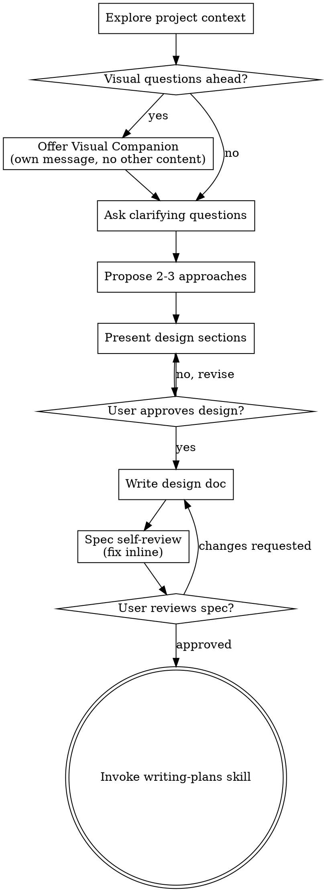
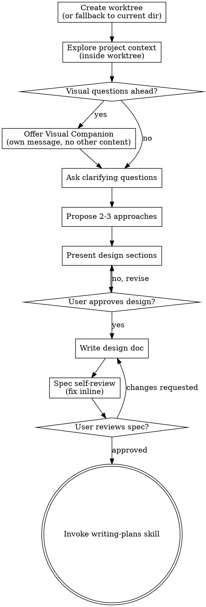

# Worktree-First Isolation Implementation Plan

> **For agentic workers:** REQUIRED SUB-SKILL: Use superpowers:subagent-driven-development (recommended) or superpowers:executing-plans to implement this plan task-by-task. Steps use checkbox (`- [ ]`) syntax for tracking.

**Goal:** Move worktree creation to the start of brainstorming, add session metadata tracking to all skills in the chain, and add rebase + delta analysis with 3-level escalation to the finishing skill.

**Architecture:** Six skill markdown files are modified. The brainstorming skill creates the worktree as step 1. All downstream skills (writing-plans, executing-plans, subagent-driven-development) gain uniform entry logic that checks for session metadata before deciding whether to create a worktree. The finishing skill gains a rebase + delta analysis phase with 3-level escalation (implementation drift, spec drift, fundamental drift) between test verification and merge options. A `.superpowers-session.json` metadata file tracks base branch, base commit, and current stage throughout the lifecycle.

**Tech Stack:** Markdown (skill files), JSON (session metadata), git, bash

**Spec:** `docs/superpowers/specs/2026-03-29-worktree-first-isolation-design.md`

---

### Task 1: Add session metadata and worktree creation to brainstorming skill

**Files:**
- Modify: `skills/brainstorming/SKILL.md`

This task adds a new step 1 ("Create worktree") to the brainstorming checklist and process flow, before "Explore project context". It also adds instructions for writing `.superpowers-session.json`.

- [ ] **Step 1: Add the "Create worktree" step to the Checklist section**

In `skills/brainstorming/SKILL.md`, find the Checklist section (currently starts at line 22). Insert the new step 1 before the existing items and renumber all subsequent steps:

Replace the current checklist:

```markdown
## Checklist

You MUST create a task for each of these items and complete them in order:

1. **Explore project context** — check files, docs, recent commits
2. **Offer visual companion** (if topic will involve visual questions) — this is its own message, not combined with a clarifying question. See the Visual Companion section below.
3. **Ask clarifying questions** — one at a time, understand purpose/constraints/success criteria
4. **Propose 2-3 approaches** — with trade-offs and your recommendation
5. **Present design** — in sections scaled to their complexity, get user approval after each section
6. **Write design doc** — save to `docs/superpowers/specs/YYYY-MM-DD-<topic>-design.md` and commit
7. **Spec self-review** — quick inline check for placeholders, contradictions, ambiguity, scope (see below)
8. **User reviews written spec** — ask user to review the spec file before proceeding
9. **Transition to implementation** — invoke writing-plans skill to create implementation plan
```

With:

```markdown
## Checklist

You MUST create a task for each of these items and complete them in order:

1. **Create worktree** — isolate the codebase before any analysis. See the Worktree Isolation section below.
2. **Explore project context** — check files, docs, recent commits (inside worktree)
3. **Offer visual companion** (if topic will involve visual questions) — this is its own message, not combined with a clarifying question. See the Visual Companion section below.
4. **Ask clarifying questions** — one at a time, understand purpose/constraints/success criteria
5. **Propose 2-3 approaches** — with trade-offs and your recommendation
6. **Present design** — in sections scaled to their complexity, get user approval after each section
7. **Write design doc** — save to `docs/superpowers/specs/YYYY-MM-DD-<topic>-design.md` and commit
8. **Spec self-review** — quick inline check for placeholders, contradictions, ambiguity, scope (see below)
9. **User reviews written spec** — ask user to review the spec file before proceeding
10. **Transition to implementation** — invoke writing-plans skill to create implementation plan
```

- [ ] **Step 2: Update the Process Flow diagram**

Replace the current `digraph brainstorming` block with an updated version that includes the worktree creation step at the start:

Replace:



With:



- [ ] **Step 3: Add the Worktree Isolation section**

Insert the following new section immediately before the "Key Principles" section (before line 138 in the current file). This section provides the detailed instructions for step 1 of the checklist:

```markdown
## Worktree Isolation

Step 1 of the checklist. Creates an isolated workspace so all analysis, spec writing, and subsequent planning/implementation happen against a consistent code snapshot.

**What to do:**

1. Record the current branch name and HEAD commit hash:
   ```bash
   BRANCH=$(git branch --show-current || git rev-parse --abbrev-ref HEAD)
   COMMIT=$(git rev-parse HEAD)
   ```
2. Derive a branch name from the user's initial request: `superpowers/<topic>-<short-hash>` where `<topic>` is a slugified summary of the request (e.g., "add auth middleware" → `add-auth-middleware`) and `<short-hash>` is the first 6 characters of the commit hash. If the request is too vague to derive a topic, use `session-<short-hash>`.
3. Invoke `using-git-worktrees` to create the worktree with the derived branch name.
4. Write `.superpowers-session.json` in the worktree root:
   ```json
   {
     "base_branch": "<recorded branch name>",
     "base_commit": "<recorded commit hash>",
     "created_at": "<ISO 8601 timestamp>",
     "stage": "brainstorming"
   }
   ```
5. All subsequent exploration and work happens inside the worktree.

**Platform fallback:** If worktree creation fails (no git, permission denied, platform limitation), log a warning and continue in the current directory. Write `.superpowers-session.json` to the project root anyway — this enables delta analysis at finish time even without isolation. The brainstorming process itself is unchanged.
```

- [ ] **Step 4: Update the "Called by" section in using-git-worktrees**

In `skills/brainstorming/SKILL.md`, the Integration section at the end of using-git-worktrees already lists brainstorming as "Phase 4". This reference is in the using-git-worktrees skill, not brainstorming itself. No changes needed in brainstorming's own file for this — it's handled in Task 5.

- [ ] **Step 5: Verify the changes are self-consistent**

Read `skills/brainstorming/SKILL.md` and verify:
- The checklist has 10 items, numbered 1-10
- Step 1 references the "Worktree Isolation" section
- The process flow diagram starts with worktree creation
- The Worktree Isolation section describes writing `.superpowers-session.json`
- The rest of the skill is unchanged

- [ ] **Step 6: Commit**

```bash
git add skills/brainstorming/SKILL.md
git commit -m "feat: add worktree creation as step 1 of brainstorming skill

Creates isolated workspace before any code analysis. Writes
.superpowers-session.json to track base branch, base commit,
and session stage. Falls back to current directory on platforms
without worktree support. Addresses #989."
```

---

### Task 2: Add session metadata entry logic to writing-plans skill

**Files:**
- Modify: `skills/writing-plans/SKILL.md`

This task replaces the "Context: should be run in a dedicated worktree" comment with uniform entry logic that checks for session metadata, and adds stage tracking.

- [ ] **Step 1: Replace the worktree context comment with entry logic**

In `skills/writing-plans/SKILL.md`, replace lines 14-15:

```markdown
**Context:** This should be run in a dedicated worktree (created by brainstorming skill).
```

With:

```markdown
## Session Entry

Before starting, check for an existing superpowers session:

1. **Check for `.superpowers-session.json` in the current directory:**
   - **Found + in a git worktree** (i.e., `git rev-parse --git-dir` differs from `git rev-parse --git-common-dir`): Session already active in a worktree. Update `stage` to `"planning"` and proceed.
   - **Found + not in a worktree**: Session is running in fallback mode (no isolation). Update `stage` to `"planning"` and proceed.
   - **Not found**: This is a standalone invocation (no brainstorming session preceded this). Create a worktree via `using-git-worktrees`, then write `.superpowers-session.json`:
     ```json
     {
       "base_branch": "<current branch>",
       "base_commit": "<current HEAD>",
       "created_at": "<ISO 8601 timestamp>",
       "stage": "planning"
     }
     ```
     If worktree creation fails, write the metadata file to the current directory and proceed in fallback mode.
```

- [ ] **Step 2: Verify the changes**

Read `skills/writing-plans/SKILL.md` and verify:
- The old "Context: This should be run in a dedicated worktree" line is gone
- The new "Session Entry" section describes the 3-way check (metadata + worktree, metadata + no worktree, no metadata)
- The rest of the skill is unchanged

- [ ] **Step 3: Commit**

```bash
git add skills/writing-plans/SKILL.md
git commit -m "feat: replace worktree comment with session entry logic in writing-plans

Adds 3-way metadata check: reuse existing worktree, continue in
fallback mode, or create worktree for standalone invocations.
Updates session stage to 'planning'. Addresses #989."
```

---

### Task 3: Add session metadata entry logic to executing-plans skill

**Files:**
- Modify: `skills/executing-plans/SKILL.md`

Same entry logic as writing-plans. The worktree requirement is kept but now satisfied by the metadata check.

- [ ] **Step 1: Add Session Entry section after the Overview**

In `skills/executing-plans/SKILL.md`, insert a new section after the "Note" paragraph (after line 14) and before "## The Process" (line 16):

```markdown
## Session Entry

Before starting, check for an existing superpowers session:

1. **Check for `.superpowers-session.json` in the current directory:**
   - **Found + in a git worktree** (i.e., `git rev-parse --git-dir` differs from `git rev-parse --git-common-dir`): Session already active in a worktree. Update `stage` to `"executing"` and proceed.
   - **Found + not in a worktree**: Session is running in fallback mode (no isolation). Update `stage` to `"executing"` and proceed.
   - **Not found**: This is a standalone invocation. Create a worktree via `using-git-worktrees`, then write `.superpowers-session.json`:
     ```json
     {
       "base_branch": "<current branch>",
       "base_commit": "<current HEAD>",
       "created_at": "<ISO 8601 timestamp>",
       "stage": "executing"
     }
     ```
     If worktree creation fails, write the metadata file to the current directory and proceed in fallback mode.
```

- [ ] **Step 2: Update the Integration section**

In the Integration section at the end of the file (line 67-70), replace:

```markdown
**Required workflow skills:**
- **superpowers:using-git-worktrees** - REQUIRED: Set up isolated workspace before starting
- **superpowers:writing-plans** - Creates the plan this skill executes
- **superpowers:finishing-a-development-branch** - Complete development after all tasks
```

With:

```markdown
**Required workflow skills:**
- **superpowers:using-git-worktrees** - Ensures isolated workspace (creates one or verifies existing via session entry logic)
- **superpowers:writing-plans** - Creates the plan this skill executes
- **superpowers:finishing-a-development-branch** - Complete development after all tasks
```

- [ ] **Step 3: Verify the changes**

Read `skills/executing-plans/SKILL.md` and verify:
- The Session Entry section is present between Overview and The Process
- The Integration section says "Ensures isolated workspace" not "REQUIRED: Set up"
- Stage is set to `"executing"`

- [ ] **Step 4: Commit**

```bash
git add skills/executing-plans/SKILL.md
git commit -m "feat: add session entry logic to executing-plans skill

Adds 3-way metadata check before execution. Creates worktree only
for standalone invocations; reuses existing worktree when coming
through the brainstorming chain. Addresses #989."
```

---

### Task 4: Add session metadata entry logic to subagent-driven-development skill

**Files:**
- Modify: `skills/subagent-driven-development/SKILL.md`

Same entry logic as executing-plans.

- [ ] **Step 1: Add Session Entry section after the "Core principle" line**

In `skills/subagent-driven-development/SKILL.md`, insert a new section after the "Core principle" paragraph (after line 8) and before "## When to Use" (line 14):

```markdown
## Session Entry

Before starting, check for an existing superpowers session:

1. **Check for `.superpowers-session.json` in the current directory:**
   - **Found + in a git worktree** (i.e., `git rev-parse --git-dir` differs from `git rev-parse --git-common-dir`): Session already active in a worktree. Update `stage` to `"executing"` and proceed.
   - **Found + not in a worktree**: Session is running in fallback mode (no isolation). Update `stage` to `"executing"` and proceed.
   - **Not found**: This is a standalone invocation. Create a worktree via `using-git-worktrees`, then write `.superpowers-session.json`:
     ```json
     {
       "base_branch": "<current branch>",
       "base_commit": "<current HEAD>",
       "created_at": "<ISO 8601 timestamp>",
       "stage": "executing"
     }
     ```
     If worktree creation fails, write the metadata file to the current directory and proceed in fallback mode.
```

- [ ] **Step 2: Update the Integration section**

In the Integration section (line 266-278), replace:

```markdown
**Required workflow skills:**
- **superpowers:using-git-worktrees** - REQUIRED: Set up isolated workspace before starting
- **superpowers:writing-plans** - Creates the plan this skill executes
- **superpowers:requesting-code-review** - Code review template for reviewer subagents
- **superpowers:finishing-a-development-branch** - Complete development after all tasks
```

With:

```markdown
**Required workflow skills:**
- **superpowers:using-git-worktrees** - Ensures isolated workspace (creates one or verifies existing via session entry logic)
- **superpowers:writing-plans** - Creates the plan this skill executes
- **superpowers:requesting-code-review** - Code review template for reviewer subagents
- **superpowers:finishing-a-development-branch** - Complete development after all tasks
```

- [ ] **Step 3: Verify the changes**

Read `skills/subagent-driven-development/SKILL.md` and verify:
- The Session Entry section is present after "Core principle" and before "When to Use"
- The Integration section says "Ensures isolated workspace" not "REQUIRED: Set up"
- Stage is set to `"executing"`

- [ ] **Step 4: Commit**

```bash
git add skills/subagent-driven-development/SKILL.md
git commit -m "feat: add session entry logic to subagent-driven-development skill

Adds 3-way metadata check before execution. Creates worktree only
for standalone invocations; reuses existing worktree when coming
through the brainstorming chain. Addresses #989."
```

---

### Task 5: Update using-git-worktrees integration references

**Files:**
- Modify: `skills/using-git-worktrees/SKILL.md`

Update the "Called by" section to reflect that brainstorming now calls this skill at step 1, not "Phase 4".

- [ ] **Step 1: Update the Integration section**

In `skills/using-git-worktrees/SKILL.md`, replace the Integration section (lines 209-219):

```markdown
## Integration

**Called by:**
- **brainstorming** (Phase 4) - REQUIRED when design is approved and implementation follows
- **subagent-driven-development** - REQUIRED before executing any tasks
- **executing-plans** - REQUIRED before executing any tasks
- Any skill needing isolated workspace

**Pairs with:**
- **finishing-a-development-branch** - REQUIRED for cleanup after work complete
```

With:

```markdown
## Integration

**Called by:**
- **brainstorming** (Step 1) - Creates isolated workspace before any code analysis
- **writing-plans** - Creates workspace for standalone invocations (when no brainstorming session preceded)
- **subagent-driven-development** - Creates workspace for standalone invocations (when no brainstorming session preceded)
- **executing-plans** - Creates workspace for standalone invocations (when no brainstorming session preceded)
- Any skill needing isolated workspace

**Pairs with:**
- **finishing-a-development-branch** - REQUIRED for cleanup after work complete
```

- [ ] **Step 2: Verify the changes**

Read the Integration section and confirm:
- Brainstorming is listed as "Step 1" not "Phase 4"
- The three downstream skills are listed as standalone-only callers
- The "Pairs with" section is unchanged

- [ ] **Step 3: Commit**

```bash
git add skills/using-git-worktrees/SKILL.md
git commit -m "feat: update using-git-worktrees integration references

Brainstorming now calls this at Step 1 (not Phase 4). Downstream
skills only create worktrees for standalone invocations. Addresses #989."
```

---

### Task 6: Add rebase + delta analysis to finishing-a-development-branch skill

**Files:**
- Modify: `skills/finishing-a-development-branch/SKILL.md`

This is the largest task. It adds a new phase between "Verify Tests" and "Present Options": read session metadata, rebase onto the original branch, run delta analysis, and route to the appropriate escalation level.

- [ ] **Step 1: Add Step 1.5 — Read Session Metadata**

In `skills/finishing-a-development-branch/SKILL.md`, insert a new step after "Step 1: Verify Tests" (after line 38) and before "Step 2: Determine Base Branch" (line 40):

```markdown
### Step 1.5: Read Session Metadata

Check for `.superpowers-session.json` in the current directory:

```bash
cat .superpowers-session.json 2>/dev/null
```

**If found:** Extract `base_branch` and `base_commit`. Update `stage` to `"finishing"`. Use `base_branch` as the base branch for all subsequent steps (skip Step 2's detection logic).

**If not found:** Fall through to Step 2's existing detection logic. Delta analysis (Step 2.5) will be skipped since there's no baseline to compare against.
```

- [ ] **Step 2: Replace Step 2 with metadata-aware base branch detection**

Replace the current Step 2 (lines 40-46):

```markdown
### Step 2: Determine Base Branch

```bash
# Try common base branches
git merge-base HEAD main 2>/dev/null || git merge-base HEAD master 2>/dev/null
```

Or ask: "This branch split from main - is that correct?"
```

With:

```markdown
### Step 2: Determine Base Branch

**If `.superpowers-session.json` was found in Step 1.5:** Use `base_branch` from the metadata. Skip this step.

**Otherwise:** Detect the base branch:

```bash
# Try common base branches
git merge-base HEAD main 2>/dev/null || git merge-base HEAD master 2>/dev/null
```

Or ask: "This branch split from main - is that correct?"
```

- [ ] **Step 3: Add Step 2.5 — Rebase and Delta Analysis**

Insert a new step after Step 2 and before Step 3 (Present Options):

```markdown
### Step 2.5: Rebase and Delta Analysis

**Skip this step if no `.superpowers-session.json` was found** (no baseline to compare against).

#### A. Rebase onto base branch

```bash
# Fetch latest
git fetch origin <base_branch>

# Attempt rebase
git rebase origin/<base_branch>
```

**If merge conflicts occur:** Escalate to at least Level 2 (spec drift). Present the conflicts to the user and let them resolve. After resolution, continue to the delta analysis below.

**If the base branch is local-only** (no remote tracking): rebase onto the local branch instead:

```bash
git rebase <base_branch>
```

#### B. Delta analysis

Compare what changed on the base branch since we branched:

```bash
git diff <base_commit>..<base_branch>
```

Where `<base_commit>` is from `.superpowers-session.json`.

**If the diff is empty:** No changes on the base branch since we started. Proceed to Step 3 (Present Options).

**If the diff is non-empty:** Analyze the changes against:
- The spec document (find it via git log for files in `docs/superpowers/specs/`)
- The implementation plan (find it via git log for files in `docs/superpowers/plans/`)
- The implementation itself (all other commits on this branch)

Classify the drift into one of three levels. **When in doubt, escalate to the higher level.**

**Recommend using the highest-capacity model available for this analysis** (e.g., Opus). The escalation decision is safety-critical.

#### C. Escalation levels

**Level 0 — No meaningful drift:** The base branch changes don't affect our work at all (e.g., changes to unrelated files, documentation updates). Proceed to Step 3.

**Level 1 — Implementation drift:** The spec is still correct, but the base branch changes affect how our work should be implemented. Examples: a file we extend was refactored, an interface we use changed its signature, a utility we depend on was moved.

→ Present to user: "The base branch has changed since this session started. The changes affect implementation details but not the spec. I recommend creating a delta implementation plan to address the gaps."
→ If user confirms: Route to `superpowers:writing-plans` to create a delta plan, then re-execute, then return to this step.

**Level 2 — Spec drift:** The spec's assumptions are partially invalidated, but the original problem statement still holds. Examples: new instances of something the spec enumerates, a module boundary the spec assumes was reorganized, a dependency the spec relies on was replaced.

→ Present to user: "The base branch has changed since this session started. The changes partially invalidate the spec. I recommend updating the spec to account for the new state, then re-planning and re-executing."
→ If user confirms: Route to the brainstorming skill's "present design" phase to update the spec, then re-plan via `superpowers:writing-plans`, then re-execute, then return to this step.

**Level 3 — Fundamental drift:** The changes undermine the original problem statement or approach. Examples: another session already implemented what we were building, the architecture was fundamentally restructured, the feature we're extending was removed.

→ Present to user: "The base branch has changed significantly since this session started. The changes fundamentally affect what we were building. I recommend restarting the brainstorming process from scratch with full re-analysis of the codebase."
→ If user confirms: Route to `superpowers:brainstorming` for a full restart (including re-analysis of the codebase, clarifying questions, approach selection, and design review). The existing worktree and branch are preserved as context.

**User confirmation is required before routing.** The model proposes the level with reasoning; the user confirms or overrides.
```

- [ ] **Step 4: Update Step 5 (Cleanup Worktree) to handle session metadata**

In the existing Step 5 (Cleanup Worktree), add cleanup of the session metadata file. Find the current Step 5 and append after the `git worktree remove` command:

After the existing cleanup logic, add:

```markdown
**Also clean up session metadata:**

```bash
# Remove session metadata (if in worktree, it's removed with the worktree)
# If in fallback mode (no worktree), remove explicitly:
rm -f .superpowers-session.json
```
```

- [ ] **Step 5: Update the Quick Reference table**

Replace the current Quick Reference table:

```markdown
## Quick Reference

| Option | Merge | Push | Keep Worktree | Cleanup Branch |
|--------|-------|------|---------------|----------------|
| 1. Merge locally | ✓ | - | - | ✓ |
| 2. Create PR | - | ✓ | ✓ | - |
| 3. Keep as-is | - | - | ✓ | - |
| 4. Discard | - | - | - | ✓ (force) |
```

With:

```markdown
## Quick Reference

| Option | Merge | Push | Keep Worktree | Cleanup Branch | Remove .superpowers-session.json |
|--------|-------|------|---------------|----------------|----------------------------------|
| 1. Merge locally | ✓ | - | - | ✓ | ✓ |
| 2. Create PR | - | ✓ | ✓ | - | - |
| 3. Keep as-is | - | - | ✓ | - | - |
| 4. Discard | - | - | - | ✓ (force) | ✓ |
```

- [ ] **Step 6: Verify the changes are self-consistent**

Read `skills/finishing-a-development-branch/SKILL.md` and verify:
- Step 1 (Verify Tests) is unchanged
- Step 1.5 (Read Session Metadata) reads `.superpowers-session.json`
- Step 2 (Determine Base Branch) defers to metadata when available
- Step 2.5 (Rebase and Delta Analysis) runs rebase, delta analysis, and 3-level escalation
- Step 3 (Present Options) is unchanged
- Step 4 (Execute Choice) is unchanged
- Step 5 (Cleanup Worktree) also cleans up `.superpowers-session.json`
- Quick Reference table includes the metadata column
- Merge conflicts escalate to at least Level 2
- Escalation principle: when in doubt, go higher
- User confirmation required before routing

- [ ] **Step 7: Commit**

```bash
git add skills/finishing-a-development-branch/SKILL.md
git commit -m "feat: add rebase + delta analysis with 3-level escalation to finishing skill

After tests pass, reads session metadata, rebases onto the original
base branch, and runs delta analysis. Classifies drift as implementation
(re-plan), spec (update spec + re-plan), or fundamental (restart
brainstorming). Merge conflicts escalate to at least level 2.
User confirms escalation before routing. Addresses #989."
```

---

### Task 7: Add `.superpowers-session.json` to .gitignore patterns

**Files:**
- Modify: `skills/using-git-worktrees/SKILL.md`

The session metadata file should not be committed to the repository. It's a session-local artifact. The using-git-worktrees skill's safety verification section should mention this.

- [ ] **Step 1: Add session metadata to the safety notes**

In `skills/using-git-worktrees/SKILL.md`, find the "Safety Verification" section. After the existing `.gitignore` logic for worktree directories, add a note:

Insert after the "Why critical" line (after "Prevents accidentally committing worktree contents to repository."):

```markdown
**Session metadata:** When writing `.superpowers-session.json`, verify it is gitignored. If not, add it to `.gitignore` alongside the worktree directory entry. This file is session-local and should never be committed.
```

- [ ] **Step 2: Verify the change**

Read the Safety Verification section and confirm the session metadata note is present.

- [ ] **Step 3: Commit**

```bash
git add skills/using-git-worktrees/SKILL.md
git commit -m "feat: add .superpowers-session.json to gitignore guidance

Session metadata file is session-local and should not be committed.
Addresses #989."
```

---

### Task 8: Add no-worktree fallback handling to finishing skill

**Files:**
- Modify: `skills/finishing-a-development-branch/SKILL.md`

The finishing skill's delta analysis section (added in Task 6) needs to handle the no-worktree fallback mode, where there's no separate branch to rebase.

- [ ] **Step 1: Add fallback mode handling to Step 2.5**

In `skills/finishing-a-development-branch/SKILL.md`, find the Step 2.5 section (added in Task 6). After the "Skip this step if no `.superpowers-session.json` was found" line, add:

```markdown
**Fallback mode (no worktree):** If `.superpowers-session.json` exists but we are NOT in a git worktree (i.e., `git rev-parse --git-dir` equals `git rev-parse --git-common-dir`), we're in fallback mode:
- Skip the rebase (we're on the same branch, our changes are already interleaved with others')
- Delta analysis still runs: compare `git diff <base_commit>..HEAD` to understand all changes since session start, then evaluate whether changes NOT made by this session conflict with our spec and implementation
- This provides weaker guarantees but still catches major drift
- Proceed to the escalation levels as normal
```

- [ ] **Step 2: Verify the change**

Read Step 2.5 and confirm:
- The fallback mode handling is present after the skip condition
- It describes skipping rebase, running delta analysis differently, and proceeding to escalation

- [ ] **Step 3: Commit**

```bash
git add skills/finishing-a-development-branch/SKILL.md
git commit -m "feat: add no-worktree fallback handling to delta analysis

In fallback mode (no isolation), skips rebase and runs delta analysis
by comparing all changes since session start. Addresses #989."
```

---

### Task 9: Verify all skill cross-references are consistent

**Files:**
- Read: all 6 modified skill files

Final verification pass to ensure all cross-references between skills are correct and consistent.

- [ ] **Step 1: Verify brainstorming references**

Read `skills/brainstorming/SKILL.md` and confirm:
- Step 1 references `using-git-worktrees`
- Step 10 references `writing-plans`
- The Worktree Isolation section references `.superpowers-session.json`

- [ ] **Step 2: Verify writing-plans references**

Read `skills/writing-plans/SKILL.md` and confirm:
- Session Entry references `using-git-worktrees` for standalone invocations
- No mention of "should be run in a dedicated worktree"

- [ ] **Step 3: Verify executing-plans references**

Read `skills/executing-plans/SKILL.md` and confirm:
- Session Entry references `using-git-worktrees` for standalone invocations
- Integration says "Ensures isolated workspace" not "REQUIRED: Set up"

- [ ] **Step 4: Verify subagent-driven-development references**

Read `skills/subagent-driven-development/SKILL.md` and confirm:
- Session Entry references `using-git-worktrees` for standalone invocations
- Integration says "Ensures isolated workspace" not "REQUIRED: Set up"

- [ ] **Step 5: Verify finishing-a-development-branch references**

Read `skills/finishing-a-development-branch/SKILL.md` and confirm:
- Step 1.5 references `.superpowers-session.json`
- Step 2 defers to metadata for base branch
- Step 2.5 references `writing-plans` (level 1), `brainstorming` (levels 2 and 3)
- Step 5 cleans up `.superpowers-session.json`

- [ ] **Step 6: Verify using-git-worktrees references**

Read `skills/using-git-worktrees/SKILL.md` and confirm:
- Integration lists brainstorming as "Step 1"
- Integration lists downstream skills as standalone-only callers
- Safety section mentions `.superpowers-session.json`

- [ ] **Step 7: Report**

List any inconsistencies found. If none, report "All cross-references verified."
