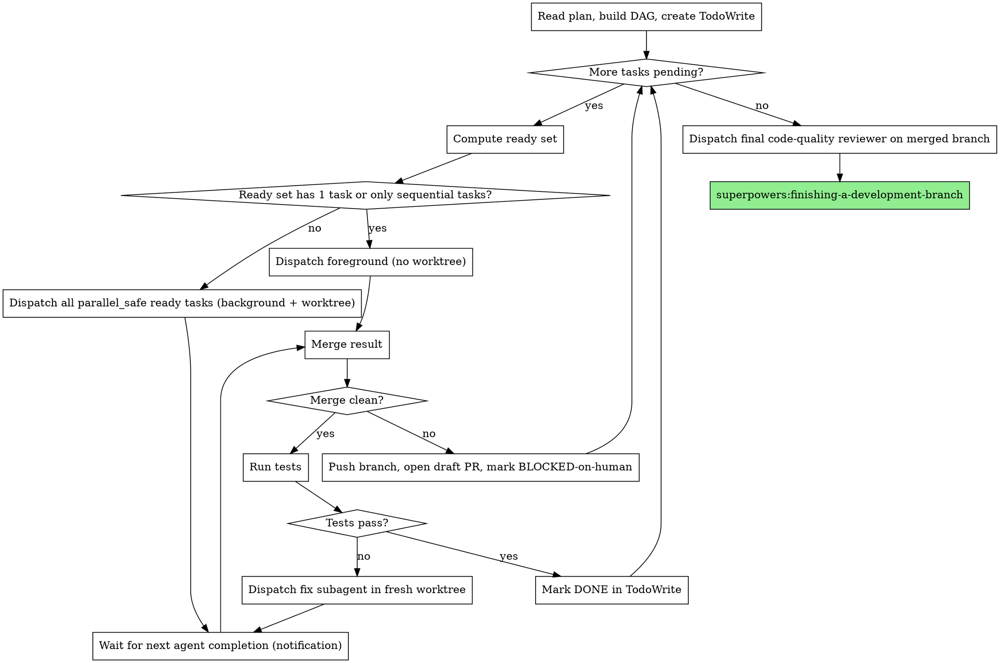

# Parallel-First Subagent Workflows Implementation Plan

> **For agentic workers:** REQUIRED SUB-SKILL: Use superpowers:subagent-driven-development (recommended) or superpowers:executing-plans to implement this plan task-by-task. Steps use checkbox (`- [ ]`) syntax for tracking.

**Goal:** Modify four skills so parallel subagent execution becomes the default path when plan DAGs allow it, using git worktrees and backgrounded agents.

**Architecture:** Pure skill (markdown) edits. No code. Plan format gains `id` / `depends_on` / `parallel_safe` task metadata. `subagent-driven-development` replaces its sequential flow with a DAG-driven controller loop. `dispatching-parallel-agents` becomes the canonical reference for the worktree + background pattern. `executing-plans` mirrors the DAG loop but in parallel-session form. Per-task review pipeline (implementer → spec → code-quality) runs autonomously inside each worktree.

**Tech Stack:** Markdown skill files, git, GitHub PRs (no compile / no test runner).

**Spec:** `docs/superpowers/specs/2026-05-11-parallel-subagent-workflows-design.md`

---

## File Structure

| File | Responsibility | Action |
|---|---|---|
| `skills/writing-plans/SKILL.md` | Plan format + design heuristic for parallelism | Modify |
| `skills/dispatching-parallel-agents/SKILL.md` | Canonical worktree + background dispatch reference | Rewrite |
| `skills/subagent-driven-development/SKILL.md` | DAG controller loop (default), sequential subsection (fallback) | Major modify |
| `skills/subagent-driven-development/implementer-prompt.md` | Per-task pipeline: implement → spec review → quality review, all inside one worktree subagent | Modify |
| `skills/subagent-driven-development/spec-reviewer-prompt.md` | Reviewer must not escalate to human; approve-with-concerns when uncertain | Modify |
| `skills/subagent-driven-development/code-quality-reviewer-prompt.md` | Same no-escalate rule | Modify |
| `skills/executing-plans/SKILL.md` | DAG loop in parallel-session form (worktree + handoff per task) | Major modify |

---

### Task 1: Update `writing-plans` with task metadata format and parallelism heuristic

**id**: writing-plans-update
**depends_on**: []
**parallel_safe**: true

**Files:**
- Modify: `skills/writing-plans/SKILL.md`

- [ ] **Step 1: Read the current skill end-to-end**

Read `skills/writing-plans/SKILL.md` in full so you know the surrounding sections you're inserting between.

- [ ] **Step 2: Add task metadata format under "Task Structure"**

Insert this paragraph immediately above the existing fenced code block under `## Task Structure`:

```markdown
**Task metadata block.** Each task starts with three metadata fields, used by the controller to compute parallel execution order:

- `id`: short kebab-case identifier, unique within the plan. Required when any task in the plan declares `depends_on`.
- `depends_on`: list of task ids this task waits on. Empty (`[]`) means it can start immediately. Omit if no other task uses `depends_on`.
- `parallel_safe`: `true` (default) or `false`. Set `false` only for genuinely global state (env files, DB migrations, config singletons). Most apparent conflicts should be resolved by adding a dependency instead.

When omitted entirely across every task, the plan runs in sequential back-compat mode.
```

Then update the existing example task in the fenced code block so the heading line is followed by:

```markdown
**id**: example-task
**depends_on**: []
**parallel_safe**: true
```

- [ ] **Step 3: Add the "Plan Design Heuristic" section**

Insert this entire section immediately before the `## No Placeholders` section:

```markdown
## Plan Design Heuristic

When drafting a plan, organize tasks for maximum parallel execution with clean merges.

1. **Decompose by file/module boundary first.** Tasks touching disjoint files are parallel-safe by construction.
2. **Identify shared edits early.** If multiple tasks need the same file, restructure: extract the shared edit as an upstream task; the others depend on it.
3. **Push integration to leaves.** Wiring and glue tasks live late in the DAG and depend on the units they integrate. Unit work stays parallel; only integration serializes.
4. **Maximize ready-set width.** The goal is the fattest possible parallel layer at each round. If the DAG looks like a chain, reconsider whether tasks can split.
5. **Predict merge cleanliness per task.** For each task, list the files it will touch. If any file appears in a sibling task, those tasks are not actually parallel — add a dependency or merge them.
6. **`parallel_safe: false` is a last resort.** Only for genuinely global state (env, DB migrations, config singletons).

Every plan ends with a **Parallelism analysis** section listing:

- Ready-set width per layer of the DAG
- Sequential bottlenecks and why they exist
- Justification for any `parallel_safe: false` task
```

- [ ] **Step 4: Verify the skill still reads cleanly**

Re-read `skills/writing-plans/SKILL.md` end-to-end. Confirm:
- The new metadata format example matches the description
- "Plan Design Heuristic" sits between "Task Structure" and "No Placeholders"
- All cross-references in the file still make sense
- The "Self-Review" section's "Type consistency" check still applies (it does — task ids count as types)

- [ ] **Step 5: Commit**

```bash
git add skills/writing-plans/SKILL.md
git commit -m "writing-plans: add task DAG metadata and parallelism heuristic"
```

---

### Task 2: Rewrite `dispatching-parallel-agents` as canonical worktree + background reference

**id**: dpa-canonical
**depends_on**: []
**parallel_safe**: true

**Files:**
- Modify: `skills/dispatching-parallel-agents/SKILL.md`

- [ ] **Step 1: Read the current file end-to-end**

Note the sections currently present so you can preserve any non-stale content (e.g., the "Common Mistakes" patterns are still useful).

- [ ] **Step 2: Replace the file body with the canonical reference**

Overwrite the file with the content below. Keep frontmatter format exactly as shown.

```markdown
---
name: dispatching-parallel-agents
description: Canonical reference for worktree-isolated, backgrounded parallel subagent dispatch. Linked from subagent-driven-development and executing-plans.
---

# Dispatching Parallel Agents

## Overview

This is the reference implementation for dispatching multiple subagents concurrently with full isolation. Other skills (`subagent-driven-development`, `executing-plans`) link here for the mechanics.

**Core mechanism:** each task runs in its own git worktree, dispatched as a backgrounded `Agent` call. Worktree isolation removes file conflicts during execution; the controller merges results sequentially after each agent reports DONE.

## When to Use

Use this pattern whenever the controller has 2+ ready tasks that:
- Touch disjoint state (or are isolated by worktree), AND
- Have no sequential dependency between them

Single ready task → just dispatch foreground (no worktree overhead).
Tasks marked `parallel_safe: false` → foreground sequential.

## Dispatch Call

```typescript
Agent({
  description: "<task id>",
  prompt: <full task prompt including context>,
  isolation: "worktree",
  run_in_background: true,
})
```

The `isolation: "worktree"` flag creates a fresh worktree on a new branch derived from the current work branch. The agent commits there. When it returns, the controller is notified — do not poll.

## Controller Responsibilities

1. **Dispatch:** fire one background `Agent` call per ready task in a single message.
2. **Wait by notification:** the runtime tells you when each agent completes. Do not sleep, do not poll.
3. **Merge:** for each completed agent's worktree branch:
   - `git fetch <branch>`
   - `git merge --no-ff <branch>` into the work branch
   - Clean → run tests; pass → mark DONE
   - Conflict → `git merge --abort`, push the branch, open a draft PR with `gh pr create --draft`, surface the URL, mark task BLOCKED-on-human, continue with other ready tasks
4. **Recompute ready set** and dispatch the next layer.

## Per-Task Prompt Requirements

Each backgrounded subagent must receive:

- The full task text from the plan (do not make it read the plan file)
- Scene-setting context: where this task fits in the larger work
- Explicit constraints: which files it owns, which it must not touch
- The instruction to commit its own work in the worktree before returning
- Expected return format: `DONE` / `DONE_WITH_CONCERNS` / `NEEDS_CONTEXT` / `BLOCKED`

## Common Mistakes

- **Dispatching foreground when background was needed** — wall-clock cost balloons; use `run_in_background: true`
- **Polling for completion** — the runtime sends notifications; polling burns context
- **Skipping worktree isolation** — two agents on the same branch will stomp each other's commits
- **Asking the controller to resolve conflicts** — push the branch, open the PR, let the human resolve on GitHub
- **Forgetting `parallel_safe: false`** — env files, migrations, and config singletons must not run in parallel even with worktree isolation, because the merge will inevitably conflict
- **Halting the pipeline on the first BLOCKED task** — other ready tasks should keep running

## When NOT to Use

- All remaining tasks are tightly coupled (chain DAG of length N) — sequential is faster than worktree overhead
- Plan declares no `depends_on` anywhere — falls back to sequential mode by design
- Task explicitly marked `parallel_safe: false`
```

- [ ] **Step 3: Verify the file**

Re-read the file. Confirm frontmatter is intact, all section headers render, and there are no dangling references to removed content.

- [ ] **Step 4: Commit**

```bash
git add skills/dispatching-parallel-agents/SKILL.md
git commit -m "dispatching-parallel-agents: rewrite as canonical worktree+background reference"
```

---

### Task 3: Update reviewer prompts to never escalate to human

**id**: reviewer-prompts
**depends_on**: []
**parallel_safe**: true

**Files:**
- Modify: `skills/subagent-driven-development/spec-reviewer-prompt.md`
- Modify: `skills/subagent-driven-development/code-quality-reviewer-prompt.md`

- [ ] **Step 1: Read both prompt files end-to-end**

Note where in each file the reviewer is told what to do when uncertain.

- [ ] **Step 2: Add the no-escalate rule to spec-reviewer-prompt.md**

Append this section to the end of `skills/subagent-driven-development/spec-reviewer-prompt.md`:

```markdown
## Autonomy Rule

You run inside an automated per-task pipeline. Do not escalate to the human under any circumstances. Do not ask clarifying questions back to the controller — you have everything you need in this prompt.

If you are uncertain whether a deviation from the spec is acceptable:

- If the deviation is a clear violation, return ❌ with the specific issue.
- If the deviation is ambiguous (could plausibly be either intent), approve with ✅ and add a **Concerns** section listing what you were uncertain about. The final reviewer on the merged branch will catch genuine problems.

Never return a status that requires the human to make a decision before the pipeline can proceed.
```

- [ ] **Step 3: Add the same rule to code-quality-reviewer-prompt.md**

Append the identical "Autonomy Rule" section to the end of `skills/subagent-driven-development/code-quality-reviewer-prompt.md`.

- [ ] **Step 4: Verify both files**

Re-read each file. Confirm the new section is present, the rest of the file is unchanged, and the frontmatter (if any) is intact.

- [ ] **Step 5: Commit**

```bash
git add skills/subagent-driven-development/spec-reviewer-prompt.md skills/subagent-driven-development/code-quality-reviewer-prompt.md
git commit -m "subagent-driven-development: reviewers run autonomously, no human escalation"
```

---

### Task 4: Replace `subagent-driven-development` top-level flow with DAG controller loop

**id**: sdd-dag
**depends_on**: [dpa-canonical]
**parallel_safe**: true

**Files:**
- Modify: `skills/subagent-driven-development/SKILL.md`

- [ ] **Step 1: Read the current skill end-to-end**

Note the existing structure: When to Use, Process, Model Selection, Handling Implementer Status, Prompt Templates, Example Workflow, Advantages, Red Flags, Integration. You will keep most of these, just retarget them to the parallel default.

- [ ] **Step 2: Replace the "Overview" and "When to Use" sections**

Replace the existing "Execute plan by dispatching..." paragraph and the "When to Use" section with:

```markdown
Execute a plan by dispatching one backgrounded subagent per ready task into its own git worktree, with full per-task review pipeline (implementer → spec review → code-quality review) running autonomously inside each worktree. Controller merges results as they arrive.

**Why parallel-by-default:** plans expose their structure as a DAG via `depends_on`. The controller computes the ready set each round and dispatches every parallel-safe ready task concurrently. Sequential is the fallback for chain DAGs and `parallel_safe: false` tasks, not the default.

**Why subagents:** you delegate tasks to specialized agents with isolated context. By precisely crafting their instructions and context, you ensure they stay focused and succeed at their task. They never inherit your session's context — you construct exactly what they need. This preserves your own context for coordination.

**Continuous execution:** do not pause to check in with your human partner between tasks. Execute all tasks from the plan without stopping. The only reasons to stop are: BLOCKED status you cannot resolve, ambiguity that genuinely prevents progress, or all tasks complete.

## When to Use

Default execution path for any plan with task `depends_on` metadata. For plans without `depends_on` declared on any task, see the **Sequential Mode** subsection below.
```

- [ ] **Step 3: Replace the "Process" graphviz block with the DAG controller loop**

Replace the entire `## The Process` section (graphviz + surrounding prose) with:

````markdown
## The Process



### Controller pseudocode

```
build DAG from plan
done = {}
blocked = {}
in_flight = {}

while (done | blocked | in_flight) != all_tasks:
    ready = {t for t in tasks
             if t not in done and t not in blocked and t not in in_flight
             and all(d in done for d in t.depends_on)}

    parallel_batch = [t for t in ready if t.parallel_safe]
    sequential     = [t for t in ready if not t.parallel_safe]

    for t in parallel_batch:
        Agent(isolation="worktree", run_in_background=true,
              prompt=per_task_pipeline_prompt(t))
        in_flight.add(t)

    for t in sequential:
        Agent(prompt=per_task_pipeline_prompt(t))   # foreground
        merge_result(t)                              # see merge step

    on each background completion:
        merge_result(t)                              # may mark DONE or BLOCKED
        in_flight.remove(t)

dispatch final code-quality reviewer on merged branch
hand off to superpowers:finishing-a-development-branch
```

The dispatch + merge mechanics live in `superpowers:dispatching-parallel-agents`. Read that skill for the worktree, background, and conflict-PR details. Do not duplicate them here.

### Per-task pipeline (inside each worktree)

The implementer prompt instructs the worktree subagent to run the full review pipeline itself before returning:

1. Implement + test + commit (TDD)
2. Self-review
3. Dispatch spec reviewer subagent (also background) — fix loop until ✅
4. Dispatch code-quality reviewer subagent (also background) — fix loop until ✅
5. Return DONE to controller

The controller never sees per-task review status — only the final pipeline status. Reviewer subagents are explicitly forbidden from escalating to the human (see reviewer prompts).

### Sequential Mode (fallback)

When the plan declares no `depends_on` on any task, run the original sequential flow: one task at a time, foreground, with per-task spec review and code-quality review surfaced to the controller. Use this for plans written before the DAG format existed and for any plan whose author chose pure sequential.
````

- [ ] **Step 4: Update "Red Flags" section**

In the existing "Red Flags" section, find and remove the line:

```
- Dispatch multiple implementation subagents in parallel (conflicts)
```

Replace it with:

```
- Dispatch multiple parallel implementation subagents WITHOUT worktree isolation (conflicts)
- Mark a task `parallel_safe: false` without justifying why in the plan's Parallelism analysis
- Halt the entire pipeline because one task hit a merge conflict (other ready tasks should continue)
```

- [ ] **Step 5: Update "Integration" section**

Add to the existing list of required workflow skills:

```
- **superpowers:dispatching-parallel-agents** - Worktree + background dispatch mechanics (canonical reference)
```

- [ ] **Step 6: Verify the skill**

Re-read `skills/subagent-driven-development/SKILL.md` end-to-end. Confirm:
- Overview frames parallel as default
- DAG loop is the primary process
- Sequential mode is a clearly-labeled fallback subsection
- Red Flags no longer forbids parallel implementation dispatch
- Integration links to dispatching-parallel-agents
- No section contradicts another

- [ ] **Step 7: Commit**

```bash
git add skills/subagent-driven-development/SKILL.md
git commit -m "subagent-driven-development: parallel DAG loop is default; sequential is fallback"
```

---

### Task 5: Wrap per-task pipeline inside `implementer-prompt.md`

**id**: impl-prompt
**depends_on**: [sdd-dag, reviewer-prompts]
**parallel_safe**: true

**Files:**
- Modify: `skills/subagent-driven-development/implementer-prompt.md`

- [ ] **Step 1: Read the current prompt end-to-end**

Note the existing implement → test → commit → self-review → return structure.

- [ ] **Step 2: Add the "Worktree pipeline" section**

Append this section to the end of the file:

```markdown
## Worktree Pipeline

You are running inside a git worktree dispatched by the parallel controller. Your full responsibility is the entire per-task pipeline, not just implementation.

After you have implemented, tested, committed, and self-reviewed:

1. **Dispatch the spec reviewer subagent** with the prompt from `skills/subagent-driven-development/spec-reviewer-prompt.md`, providing it the task spec and the diff you produced. Run it as `run_in_background: true`. Wait for completion.
   - If reviewer returns ❌ with issues, fix them in this worktree, commit the fix, and re-dispatch the spec reviewer. Repeat until ✅.
   - Hard stop after 3 fix iterations: return BLOCKED with the full reviewer transcript.

2. **Dispatch the code-quality reviewer subagent** with the prompt from `skills/subagent-driven-development/code-quality-reviewer-prompt.md`, on the now spec-compliant diff. Run it as `run_in_background: true`. Wait for completion.
   - Same fix-and-re-review loop. Same 3-iteration hard stop.

3. **Return to controller** with one of:
   - `DONE` — both reviews ✅, commits in place
   - `DONE_WITH_CONCERNS` — both reviews ✅ but you noted observations the controller should know
   - `BLOCKED` — fix loop exhausted, or you cannot proceed; include full transcript

Do not ask the controller for input mid-pipeline. Do not surface review failures to the human directly. The controller decides what to escalate.
```

- [ ] **Step 3: Verify the file**

Re-read the file end-to-end. Confirm the new pipeline section is the last thing in the file and does not contradict earlier instructions.

- [ ] **Step 4: Commit**

```bash
git add skills/subagent-driven-development/implementer-prompt.md
git commit -m "implementer-prompt: wrap full per-task review pipeline inside worktree"
```

---

### Task 6: Update `executing-plans` with parallel-session DAG variant

**id**: ep-parallel
**depends_on**: [dpa-canonical]
**parallel_safe**: true

**Files:**
- Modify: `skills/executing-plans/SKILL.md`

- [ ] **Step 1: Read the current skill end-to-end**

Note the existing handoff format used to spawn parallel sessions for plan execution.

- [ ] **Step 2: Add the "Parallel Sessions via DAG" section**

Insert this section directly after the existing overview / "When to Use" content and before any execution-detail sections:

```markdown
## Parallel Sessions via DAG

When a plan declares `depends_on` on its tasks, execute the DAG using parallel sessions instead of single sequential handoff:

1. Build the DAG from the plan.
2. Compute the ready set: tasks whose dependencies have all completed.
3. For each parallel-safe ready task, spawn a separate session in its own git worktree (`git worktree add ../wt-<task-id> -b task/<task-id>`). Hand each session the full task spec plus the constraint that it commit its work to its own branch.
4. When a session completes, attempt `git merge --no-ff task/<task-id>` into the work branch. Clean → mark DONE. Conflict → push the branch, open a draft PR with `gh pr create --draft`, mark BLOCKED-on-human, continue with other ready tasks.
5. Recompute the ready set and dispatch the next layer.

For tasks marked `parallel_safe: false`, run a single foreground session on the work branch (no worktree).

For plans with no `depends_on` declarations, fall back to the original single-session sequential execution flow described below.

Worktree, dispatch, and conflict-PR mechanics: see `superpowers:dispatching-parallel-agents` (canonical reference).
```

- [ ] **Step 3: Add a sentence at the top of the existing sequential flow section**

Find the section that currently describes the sequential handoff format. Add at the top:

```markdown
> **Sequential mode** — used only when the plan has no `depends_on` declarations. For DAG plans, see "Parallel Sessions via DAG" above.
```

- [ ] **Step 4: Verify the skill**

Re-read `skills/executing-plans/SKILL.md` end-to-end. Confirm:
- Parallel-session DAG flow is the primary path
- Sequential is clearly a fallback
- Reference to dispatching-parallel-agents is present and correct

- [ ] **Step 5: Commit**

```bash
git add skills/executing-plans/SKILL.md
git commit -m "executing-plans: add parallel-session DAG flow as default for plans with depends_on"
```

---

### Task 7: Cross-skill consistency pass

**id**: consistency
**depends_on**: [writing-plans-update, dpa-canonical, sdd-dag, impl-prompt, reviewer-prompts, ep-parallel]
**parallel_safe**: false

**Files:**
- Modify (any of): `skills/writing-plans/SKILL.md`, `skills/subagent-driven-development/SKILL.md`, `skills/executing-plans/SKILL.md`, `skills/dispatching-parallel-agents/SKILL.md`, `skills/subagent-driven-development/implementer-prompt.md`, `skills/subagent-driven-development/spec-reviewer-prompt.md`, `skills/subagent-driven-development/code-quality-reviewer-prompt.md`

This task runs `parallel_safe: false` because it touches every modified file from earlier tasks; only safe to run after all merges have landed.

- [ ] **Step 1: Re-read all seven modified files end-to-end**

Read each file fully:
1. `skills/writing-plans/SKILL.md`
2. `skills/dispatching-parallel-agents/SKILL.md`
3. `skills/subagent-driven-development/SKILL.md`
4. `skills/subagent-driven-development/implementer-prompt.md`
5. `skills/subagent-driven-development/spec-reviewer-prompt.md`
6. `skills/subagent-driven-development/code-quality-reviewer-prompt.md`
7. `skills/executing-plans/SKILL.md`

- [ ] **Step 2: Check terminology consistency**

Confirm the same terms are used everywhere. Fix any drift inline:
- `depends_on` (not `dependsOn`, `deps`, `requires`)
- `parallel_safe` (not `parallelSafe`, `parallel-safe`)
- `id` (not `task_id`, `taskId`)
- "ready set" (not "ready queue", "available tasks")
- "DAG" / "DAG mode" / "DAG-driven" (not "graph mode", "dependency mode")
- "back-compat sequential mode" (not "legacy mode", "old mode")

- [ ] **Step 3: Check cross-references**

Confirm every reference to another skill is correct:
- `subagent-driven-development` → links to `dispatching-parallel-agents`
- `executing-plans` → links to `dispatching-parallel-agents`
- Both link to `writing-plans` for plan format
- No skill references a removed concept (e.g., the old "Never dispatch multiple implementation subagents in parallel" rule)

- [ ] **Step 4: Check for orphaned content**

Look for any sentence or section that refers to a concept that no longer exists or that contradicts the new flow. Remove or update inline.

- [ ] **Step 5: Verify the four skills' descriptions still match their behavior**

Each `SKILL.md` has a `description:` frontmatter line. Confirm it accurately describes the new behavior. Update if not:
- `writing-plans`: should mention DAG / parallelism heuristic
- `subagent-driven-development`: should mention parallel-by-default
- `executing-plans`: should mention parallel sessions for DAG plans
- `dispatching-parallel-agents`: should describe itself as the canonical reference

- [ ] **Step 6: Commit any consistency fixes**

```bash
git add skills/
git commit -m "skills: cross-skill consistency pass for parallel-first workflows"
```

If there were no fixes needed, skip the commit.

---

## Parallelism Analysis

| Layer | Ready set | Width |
|---|---|---|
| 0 | `writing-plans-update`, `dpa-canonical`, `reviewer-prompts` | 3 |
| 1 | `sdd-dag`, `ep-parallel` | 2 |
| 2 | `impl-prompt` | 1 |
| 3 | `consistency` | 1 |

**Bottlenecks:**
- Layer 1 waits on `dpa-canonical` because both `sdd-dag` and `ep-parallel` link to the canonical reference.
- Layer 2 (`impl-prompt`) waits on both `sdd-dag` (defines the controller flow) and `reviewer-prompts` (so the implementer can confidently invoke them with the no-escalate rule already in place).
- Layer 3 (`consistency`) is intentionally `parallel_safe: false` because it inspects and may edit every file modified above. Running it concurrently with anything would race.

**`parallel_safe: false` justifications:**
- `consistency` — global pass over all seven files; cannot meaningfully be split, and its output depends on every prior task being merged first.

**Maximum theoretical concurrency:** 3 (layer 0). All other layers are narrower because of true content dependencies, not arbitrary serialization.
