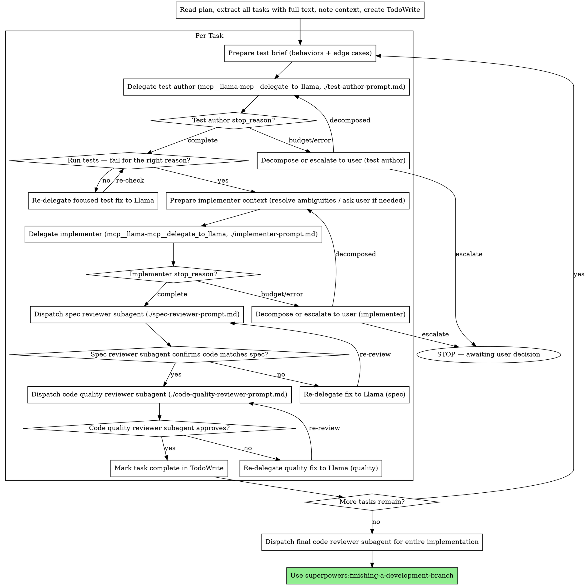

# Llama Persona Delegation Implementation Plan

> **For agentic workers:** REQUIRED SUB-SKILL: Use superpowers:subagent-driven-development (recommended) or superpowers:executing-plans to implement this plan task-by-task. Steps use checkbox (`- [ ]`) syntax for tracking.

**Goal:** Add four task-specialized Llama personas (feature designer, planner, test author, documenter) to their natural home skills, and rename the existing Qwen implementer references to Llama.

**Architecture:** Each persona is one Markdown prompt file alongside its home skill's `SKILL.md`, mirroring the existing `implementer-prompt.md` pattern. Each home skill's `SKILL.md` gets a surgical edit adding a delegation step plus a pointer to the new prompt file. The existing `subagent-driven-development` files are renamed Qwen→Llama so the whole workflow calls the renamed `mcp__llama-mcp__delegate_to_llama` MCP tool. No new skill; no new code; behavior-shaping prose (Red Flags, anti-patterns) is not reworded except where a step is genuinely added.

**Tech Stack:** Markdown skill files only. There is no test framework — per the spec, validation is manual: each task verifies its change with a `grep`/`rg` check and commits.

**Source spec:** `docs/superpowers/specs/2026-05-16-llama-persona-delegation-design.md`

**Note on the test cycle:** The writing-plans Task Structure template is TDD-oriented (pytest). These tasks edit Markdown skill files, which have no automated tests. Each task therefore uses: apply the change → verify with a search command → commit. This is the correct adaptation for this codebase, not a shortcut.

---

### Task 1: Rename Qwen→Llama in `implementer-prompt.md`

**Files:**
- Modify: `skills/subagent-driven-development/implementer-prompt.md`

This file currently uses "Qwen" as the agent name and `mcp__qwen-mcp__delegate_to_qwen` as the tool. The MCP server was renamed to `llama-mcp` with tool `delegate_to_llama`. Every `Qwen`→`Llama` and `qwen`→`llama` (case-sensitive) covers the agent name, `qwen-mcp`, and `delegate_to_qwen` in one pass. There is no all-caps `QWEN` in the file.

- [ ] **Step 1: Apply the rename**

Run from the repo root:

```bash
sed -i 's/Qwen/Llama/g; s/qwen/llama/g' skills/subagent-driven-development/implementer-prompt.md
```

- [ ] **Step 2: Verify no Qwen references remain**

Run: `rg -i qwen skills/subagent-driven-development/implementer-prompt.md`
Expected: no output (exit code 1 — no matches).

Run: `rg -c 'mcp__llama-mcp__delegate_to_llama' skills/subagent-driven-development/implementer-prompt.md`
Expected: `2`

- [ ] **Step 3: Commit**

```bash
git add skills/subagent-driven-development/implementer-prompt.md
git commit -m "refactor: rename Qwen to Llama in implementer-prompt"
```

---

### Task 2: Rename Qwen→Llama in `subagent-driven-development/SKILL.md`

**Files:**
- Modify: `skills/subagent-driven-development/SKILL.md`

Same rename as Task 1, applied to the skill file. This file has 45 occurrences across the process diagram, prose, Red Flags, and the example workflow. A case-sensitive global replace is correct for all of them: `Qwen`→`Llama` covers the agent name; `qwen`→`llama` covers `qwen-mcp` and `delegate_to_qwen`. No all-caps `QWEN` exists.

- [ ] **Step 1: Apply the rename**

Run from the repo root:

```bash
sed -i 's/Qwen/Llama/g; s/qwen/llama/g' skills/subagent-driven-development/SKILL.md
```

- [ ] **Step 2: Verify no Qwen references remain**

Run: `rg -i qwen skills/subagent-driven-development/SKILL.md`
Expected: no output (exit code 1 — no matches).

Run: `rg -c 'Llama' skills/subagent-driven-development/SKILL.md`
Expected: a non-zero count (the agent name now reads "Llama" throughout).

- [ ] **Step 3: Commit**

```bash
git add skills/subagent-driven-development/SKILL.md
git commit -m "refactor: rename Qwen to Llama in subagent-driven-development skill"
```

---

### Task 3: Create the feature designer prompt file

**Files:**
- Create: `skills/brainstorming/feature-designer-prompt.md`

This is the `brainstorming` persona. Claude has already made every design decision and gotten user approval; the feature designer turns the approved design into a written spec document. It mirrors `implementer-prompt.md`'s structure and cross-references it for the shared `stop_reason` mechanics rather than restating them.

- [ ] **Step 1: Create the file**

Create `skills/brainstorming/feature-designer-prompt.md` with exactly this content:

````markdown
# Llama Feature Designer Delegation Template

Use this template at step 6 of the `brainstorming` skill ("Write design doc"), after
the design has been approved with the user (step 5). Every design decision is already
made; the feature designer's job is to turn the approved design into a well-structured
spec document. Delegate via the `mcp__llama-mcp__delegate_to_llama` MCP tool.

## Persona Preamble (prepend verbatim into the `task` string)

> You are a feature designer. You are writing a design specification document from a
> complete set of decisions that have already been made and approved. Every design
> question is settled — do not invent requirements, change scope, or add features.
> You have latitude on how to structure the document and how to word it: organize the
> sections clearly, write in plain technical prose, and make the spec easy to read.
> If something is genuinely missing or contradictory, note it explicitly at the end
> under "Open questions for Claude" rather than guessing.

## Brief Preparation (do this before delegating)

1. **Collect every approved design section** — architecture, components, data flow,
   error handling, testing, non-goals. Paste the full substance of each into the
   `task` string. The feature designer must not have to reconstruct decisions.
2. **List the resolved decisions and tradeoffs** — for each significant choice, state
   what was chosen and what was rejected, so the spec records the reasoning.
3. **State the exact spec file path** — `docs/superpowers/specs/YYYY-MM-DD-<topic>-design.md`.
4. **Provide the metadata** — date, author, status line.

## Delegation Call

```
mcp__llama-mcp__delegate_to_llama:
  task: |
    [PERSONA PREAMBLE — paste verbatim from above]

    ## Write this spec document

    Write the design specification to `<exact spec path>`.

    ## Approved design (full substance)

    [Every approved section, with all decisions inline]

    ## Resolved decisions and tradeoffs

    [Each choice: what was chosen, what was rejected, why]

    ## Document metadata

    Date / Author / Status: [values]

    ## Done when

    The spec file exists at the path above, covers every section listed, contains no
    "TBD"/"TODO"/placeholder text, and records the resolved decisions. No code is written.

    ## On completion

    Reply with a concise summary: the file you wrote, the sections it contains, and
    anything you flagged under "Open questions for Claude".

  working_dir: [absolute path — project root]
  context_hints:
    - [an existing spec under docs/superpowers/specs/ as a format reference, if one exists]
```

## After Delegation

Inspect the response fields (`result`, `files_changed`, `commands_run`, `stop_reason`,
`transcript_path`) exactly as described in
`subagent-driven-development/implementer-prompt.md` → "After Delegation". Handle
`stop_reason` per the shared mapping in `subagent-driven-development/SKILL.md` →
"Handling Llama stop_reason". For this prose persona, a budget-hit
(`max_steps`/`timeout`/`token_limit`) means re-delegating the spec section-by-section
rather than escalating immediately.

Then run brainstorming step 7 (spec self-review) yourself on Llama's draft — the
placeholder, consistency, scope, and ambiguity checks. If you find issues, re-delegate
a focused fix or fix them inline.
````

- [ ] **Step 2: Verify the file**

Run: `rg -c 'mcp__llama-mcp__delegate_to_llama' skills/brainstorming/feature-designer-prompt.md`
Expected: `1`

Run: `rg -c 'Handling Llama stop_reason' skills/brainstorming/feature-designer-prompt.md`
Expected: `1`

- [ ] **Step 3: Commit**

```bash
git add skills/brainstorming/feature-designer-prompt.md
git commit -m "feat: add Llama feature designer persona prompt"
```

---

### Task 4: Wire the feature designer into `brainstorming/SKILL.md`

**Files:**
- Modify: `skills/brainstorming/SKILL.md` (checklist item 6 at line 29; the "Documentation" subsection at lines 109-115)

The brainstorming process diagram, Red Flags, and anti-pattern prose are NOT touched. Only the checklist line and the "Documentation" subsection change.

- [ ] **Step 1: Update checklist item 6**

Replace this line:

```markdown
6. **Write design doc** — save to `docs/superpowers/specs/YYYY-MM-DD-<topic>-design.md` and commit
```

with:

```markdown
6. **Write design doc** — delegate the writing of the spec to the Llama feature designer (see `feature-designer-prompt.md`); save to `docs/superpowers/specs/YYYY-MM-DD-<topic>-design.md` and commit
```

- [ ] **Step 2: Update the "Documentation" subsection**

Replace this block:

```markdown
**Documentation:**

- Write the validated design (spec) to `docs/superpowers/specs/YYYY-MM-DD-<topic>-design.md`
  - (User preferences for spec location override this default)
- Use elements-of-style:writing-clearly-and-concisely skill if available
- Commit the design document to git
```

with:

```markdown
**Documentation:**

- Compose the brief — every approved design section, every resolved decision and tradeoff, and the exact spec file path — and delegate the *writing* of the spec to the Llama feature designer. See `feature-designer-prompt.md` for the brief-preparation checklist and the delegation template.
- Spec file path: `docs/superpowers/specs/YYYY-MM-DD-<topic>-design.md`
  - (User preferences for spec location override this default)
- Review Llama's draft, then commit the design document to git
```

- [ ] **Step 3: Verify the edits**

Run: `rg -c 'feature-designer-prompt.md' skills/brainstorming/SKILL.md`
Expected: `2`

- [ ] **Step 4: Commit**

```bash
git add skills/brainstorming/SKILL.md
git commit -m "feat: delegate spec writing to Llama feature designer"
```

---

### Task 5: Create the planner prompt file

**Files:**
- Create: `skills/writing-plans/planner-prompt.md`

This is the `writing-plans` persona. Claude has already produced the Scope Check, the File Structure map, and the task-list outline; the planner expands that outline into the full plan body with real code blocks.

- [ ] **Step 1: Create the file**

Create `skills/writing-plans/planner-prompt.md` with exactly this content:

````markdown
# Llama Planner Delegation Template

Use this template in the `writing-plans` skill, after Claude has produced the Scope
Check, the File Structure map, and the task-list outline (which tasks exist, in what
order). Those decomposition decisions are locked in by Claude. The planner expands
that outline into the full plan body. Delegate via `mcp__llama-mcp__delegate_to_llama`.

## Persona Preamble (prepend verbatim into the `task` string)

> You are an implementation planner. The task decomposition is already decided — the
> list of tasks, their order, and which files each touches are fixed. Do not add,
> remove, reorder, or merge tasks. Your job is to expand each task in the outline into
> the bite-sized step structure: the failing-test step, the run-it step, the
> minimal-implementation step with real code, the verify step, and the commit step.
> Every code step must contain actual, complete code — never "TBD", never "add error
> handling", never "similar to Task N". Use exact file paths and exact commands with
> expected output.

## Brief Preparation (do this before delegating)

1. **Paste the spec** — the planner needs the full spec text to write accurate code blocks.
2. **Paste the File Structure map** — every file to create or modify and its responsibility.
3. **Paste the task-list outline** — each task title, its order, the files it touches,
   and any per-task notes you have already decided.
4. **State the plan file path and the required plan header** —
   `docs/superpowers/plans/YYYY-MM-DD-<feature>.md` plus the plan header block from
   the writing-plans skill.
5. **Name the conventions** — test framework, run commands, and commit-message style,
   so generated steps match the codebase.

## Delegation Call

```
mcp__llama-mcp__delegate_to_llama:
  task: |
    [PERSONA PREAMBLE — paste verbatim from above]

    ## Write this implementation plan

    Write the plan to `<exact plan path>`, starting with the required header block below.

    ## Required plan header

    [The exact header block from the writing-plans skill, filled in]

    ## Spec (full text)

    [Paste the full spec]

    ## File Structure map

    [Every file to create/modify and its responsibility]

    ## Task-list outline

    [Each task: title, order, files touched, per-task notes]

    ## Conventions

    [Test framework, run commands, commit-message style]

    ## Done when

    The plan file exists at the path above, every task from the outline is expanded
    into bite-sized steps with complete code blocks, and there are no placeholders.

    ## On completion

    Reply with a concise summary: the file you wrote and the list of tasks it contains.

  working_dir: [absolute path — project root]
  context_hints:
    - [an existing plan under docs/superpowers/plans/ as a format reference, if one exists]
```

## After Delegation

Inspect the response fields (`result`, `files_changed`, `commands_run`, `stop_reason`,
`transcript_path`) exactly as described in
`subagent-driven-development/implementer-prompt.md` → "After Delegation". Handle
`stop_reason` per the shared mapping in `subagent-driven-development/SKILL.md` →
"Handling Llama stop_reason". For this prose persona, a budget-hit means re-delegating
the plan task-by-task rather than escalating immediately.

Then run the writing-plans Self-Review yourself on Llama's plan — spec coverage,
placeholder scan, type consistency, implementer fit. If you find issues, re-delegate a
focused fix or fix them inline.
````

- [ ] **Step 2: Verify the file**

Run: `rg -c 'mcp__llama-mcp__delegate_to_llama' skills/writing-plans/planner-prompt.md`
Expected: `1`

Run: `rg -c 'Handling Llama stop_reason' skills/writing-plans/planner-prompt.md`
Expected: `1`

- [ ] **Step 3: Commit**

```bash
git add skills/writing-plans/planner-prompt.md
git commit -m "feat: add Llama planner persona prompt"
```

---

### Task 6: Wire the planner into `writing-plans/SKILL.md`

**Files:**
- Modify: `skills/writing-plans/SKILL.md` (insert a new section after the "## Remember" section at lines 129-133, before "## Self-Review" at line 135)

- [ ] **Step 1: Insert the delegation section**

In `skills/writing-plans/SKILL.md`, find this block:

```markdown
## Remember
- Exact file paths always
- Complete code in every step — if a step changes code, show the code
- Exact commands with expected output
- DRY, YAGNI, TDD, frequent commits

## Self-Review
```

Replace it with:

```markdown
## Remember
- Exact file paths always
- Complete code in every step — if a step changes code, show the code
- Exact commands with expected output
- DRY, YAGNI, TDD, frequent commits

## Delegate Plan-Body Expansion

You have just done the judgment-heavy work yourself: the Scope Check, the File Structure map, and the task-list outline — which tasks exist and in what order. That decomposition is now locked in.

Delegate the *expansion* of that outline into the full plan body — each task rendered in the bite-sized step structure above, with real code blocks — to the Llama planner. See `planner-prompt.md` for the brief-preparation checklist and the delegation template.

You still own the Self-Review below: run it yourself on the plan Llama produces.

## Self-Review
```

- [ ] **Step 2: Verify the edit**

Run: `rg -c 'planner-prompt.md' skills/writing-plans/SKILL.md`
Expected: `1`

Run: `rg -c 'Delegate Plan-Body Expansion' skills/writing-plans/SKILL.md`
Expected: `1`

- [ ] **Step 3: Commit**

```bash
git add skills/writing-plans/SKILL.md
git commit -m "feat: delegate plan-body expansion to Llama planner"
```

---

### Task 7: Create the test author prompt file

**Files:**
- Create: `skills/subagent-driven-development/test-author-prompt.md`

This is the `subagent-driven-development` persona. It runs once per task, immediately before the implementer delegation: the test author writes the failing test(s); the implementer makes them pass.

- [ ] **Step 1: Create the file**

Create `skills/subagent-driven-development/test-author-prompt.md` with exactly this content:

````markdown
# Llama Test Author Delegation Template

Use this template in the per-task loop of `subagent-driven-development`, immediately
before the implementer delegation. The test author writes the failing test(s) for a
task; the implementer (the next delegation) makes them pass. Delegate via
`mcp__llama-mcp__delegate_to_llama`.

## Persona Preamble (prepend verbatim into the `task` string)

> You are a test author. Write failing tests only — do not write any implementation
> code. Claude has named the exact behaviors and edge cases to cover; write one clear,
> idiomatic test per behavior. The tests must fail because the implementation does not
> exist yet, not because of syntax or import errors. Do not stub or implement the code
> under test.

## Brief Preparation (do this before delegating)

1. **List the behaviors and edge cases** the task's tests must cover — name each one
   concretely.
2. **Name the test file path and the framework** — exact path, test runner, and
   assertion style.
3. **Provide the interface under test** — the function/class signature the tests will
   call, as decided in the plan, so the tests call it correctly.
4. **Apply the right-size check** from `subagent-driven-development/SKILL.md` →
   "Right-Sizing Before Delegating" before delegating.

## Delegation Call

```
mcp__llama-mcp__delegate_to_llama:
  task: |
    [PERSONA PREAMBLE — paste verbatim from above]

    ## Write failing tests

    Write tests to `<exact test file path>`. Write failing tests only — no implementation.

    ## Behaviors and edge cases to cover

    [Each behavior named concretely]

    ## Interface under test

    [The signature(s) the tests will call]

    ## Conventions

    [Test runner, assertion style]

    ## Done when

    The test file exists, contains one test per named behavior, and the tests fail
    because the implementation does not exist yet. No implementation code is written.

    ## On completion

    Reply with a concise summary: the test file you wrote, the tests it contains, and
    the command to run them.

  working_dir: [absolute path — project root]
  context_hints:
    - [the file the implementation will live in, if it exists]
    - [an existing test file as a format reference]
```

## After Delegation

Inspect the response fields (`result`, `files_changed`, `commands_run`, `stop_reason`,
`transcript_path`) exactly as described in `./implementer-prompt.md` → "After
Delegation". Handle `stop_reason` per the shared mapping in `./SKILL.md` → "Handling
Llama stop_reason".

Then run the tests yourself and confirm they fail for the right reason — the
implementation is missing, not a syntax or import error. If they pass, compile-error,
or fail wrongly, re-delegate a focused fix (see "Fix-loop context discipline" in
`./SKILL.md`). Only once the tests fail correctly, proceed to the implementer
delegation (`./implementer-prompt.md`).
````

- [ ] **Step 2: Verify the file**

Run: `rg -c 'mcp__llama-mcp__delegate_to_llama' skills/subagent-driven-development/test-author-prompt.md`
Expected: `1`

Run: `rg -c 'Handling Llama stop_reason' skills/subagent-driven-development/test-author-prompt.md`
Expected: `1`

- [ ] **Step 3: Commit**

```bash
git add skills/subagent-driven-development/test-author-prompt.md
git commit -m "feat: add Llama test author persona prompt"
```

---

### Task 8: Add the test-author step to the `subagent-driven-development` process diagram

**Files:**
- Modify: `skills/subagent-driven-development/SKILL.md` (the `digraph process` block inside "## The Process")

By this task, Task 2 has already renamed Qwen→Llama in this file, so the diagram currently reads with "Llama". This task replaces the entire `digraph process { ... }` block with a version that adds the test-author delegation before the implementer delegation.

- [ ] **Step 1: Replace the process diagram**

Find the entire fenced `dot` block under "## The Process" (it begins with `digraph process {` and ends with the matching `}`). Replace the whole block contents with:



- [ ] **Step 2: Verify the edit**

Run: `rg -c 'Delegate test author' skills/subagent-driven-development/SKILL.md`
Expected: `4` (one node declaration plus three edge references).

Run: `rg -c 'Run tests — fail for the right reason' skills/subagent-driven-development/SKILL.md`
Expected: `4`

- [ ] **Step 3: Commit**

```bash
git add skills/subagent-driven-development/SKILL.md
git commit -m "feat: add test-author step to subagent-driven-development process"
```

---

### Task 9: Add test-author pointers and prose to `subagent-driven-development/SKILL.md`

**Files:**
- Modify: `skills/subagent-driven-development/SKILL.md` ("## Model Selection", the "One concern per delegation" bullet in "## Right-Sizing Before Delegating", and "## Prompt Templates")

This task updates the prose that surrounds the diagram from Task 8. The Red Flags section is not reworded.

- [ ] **Step 1: Update the Model Selection section**

Find this block (post-rename text from Task 2):

```markdown
## Model Selection

**Implementation:** Always use Llama via `mcp__llama-mcp__delegate_to_llama`. Llama runs locally and handles mechanical coding tasks — writing functions, adding tests, threading parameters.
```

Replace it with:

```markdown
## Model Selection

**Test authoring and implementation:** Always use Llama via `mcp__llama-mcp__delegate_to_llama`. Llama runs locally and handles mechanical coding tasks — writing failing tests, writing functions, threading parameters. Each task is two back-to-back Llama delegations: the test author writes the failing tests, then the implementer makes them pass.
```

- [ ] **Step 2: Update the "One concern per delegation" bullet**

Find this bullet in "## Right-Sizing Before Delegating":

```markdown
- **One concern per delegation.** If the task touches more than one file non-trivially, or mixes "write the failing test" with "implement and refactor," split it into back-to-back delegations. Land the first one (review + commit), then delegate the next.
```

Replace it with:

```markdown
- **One concern per delegation.** The per-task process already separates test authoring from implementation into two delegations. Beyond that: if a single delegation still touches more than one file non-trivially, or bundles unrelated changes, split it further into back-to-back delegations. Land the first one (review + commit), then delegate the next.
```

- [ ] **Step 3: Update the Prompt Templates list**

Find this block:

```markdown
## Prompt Templates

- `./implementer-prompt.md` - Delegate implementation task to Llama
- `./spec-reviewer-prompt.md` - Dispatch spec compliance reviewer subagent
- `./code-quality-reviewer-prompt.md` - Dispatch code quality reviewer subagent
```

Replace it with:

```markdown
## Prompt Templates

- `./test-author-prompt.md` - Delegate failing-test authoring to Llama
- `./implementer-prompt.md` - Delegate implementation task to Llama
- `./spec-reviewer-prompt.md` - Dispatch spec compliance reviewer subagent
- `./code-quality-reviewer-prompt.md` - Dispatch code quality reviewer subagent
```

- [ ] **Step 4: Verify the edits**

Run: `rg -c 'test-author-prompt.md' skills/subagent-driven-development/SKILL.md`
Expected: `1` (the Prompt Templates list; the diagram from Task 8 already references it separately).

Run: `rg -c 'Test authoring and implementation' skills/subagent-driven-development/SKILL.md`
Expected: `1`

- [ ] **Step 5: Commit**

```bash
git add skills/subagent-driven-development/SKILL.md
git commit -m "feat: document test-author persona in subagent-driven-development"
```

---

### Task 10: Create the documenter prompt file

**Files:**
- Create: `skills/finishing-a-development-branch/documenter-prompt.md`

This is the `finishing-a-development-branch` persona — a pure scribe. Claude names every doc to touch and the substance of each change; the documenter only phrases it.

- [ ] **Step 1: Create the file**

Create `skills/finishing-a-development-branch/documenter-prompt.md` with exactly this content:

````markdown
# Llama Documenter Delegation Template

Use this template at the Documentation Sweep step of `finishing-a-development-branch`,
after tests pass and before environment detection. The documenter is a pure scribe:
Claude names every doc to touch and the substance of every change; the documenter only
phrases it. Delegate via `mcp__llama-mcp__delegate_to_llama`.

## Persona Preamble (prepend verbatim into the `task` string)

> You are a documentation scribe. Claude has identified every documentation file to
> update and the exact substance of each change. Make only those changes — do not
> document anything not listed, do not restructure files, and do not change code.
> Match the existing tone and formatting of each file you edit.

## Brief Preparation (do this before delegating)

1. **Read the branch diff** — `git diff <base>..HEAD` — and identify what user-facing
   documentation and changelog entries the feature touched.
2. **List each doc file and the substance of its change** — for every file, state
   exactly what to add or revise. If nothing needs updating, skip the delegation; the
   Documentation Sweep step is a no-op.
3. **Quote any anchor text** the documenter must find and update — e.g. the changelog
   heading, a feature list, a section title.

## Delegation Call

```
mcp__llama-mcp__delegate_to_llama:
  task: |
    [PERSONA PREAMBLE — paste verbatim from above]

    ## Update documentation

    Make exactly the changes listed below — nothing more.

    ## Files and changes

    [For each doc file: the file path, the anchor text to find, and the exact
     substance of what to add or revise]

    ## Done when

    Every listed change is made and no other file is touched.

    ## On completion

    Reply with a concise summary: the files you changed and the change made to each.

  working_dir: [absolute path — project root]
  context_hints:
    - [each doc file to be updated]
```

## After Delegation

Inspect the response fields (`result`, `files_changed`, `commands_run`, `stop_reason`,
`transcript_path`) exactly as described in
`subagent-driven-development/implementer-prompt.md` → "After Delegation". Handle
`stop_reason` per the shared mapping in `subagent-driven-development/SKILL.md` →
"Handling Llama stop_reason". For this prose persona, a budget-hit means re-delegating
the remaining doc files rather than escalating immediately.

Then review the documentation diff yourself and commit it on the feature branch before
proceeding to environment detection.
````

- [ ] **Step 2: Verify the file**

Run: `rg -c 'mcp__llama-mcp__delegate_to_llama' skills/finishing-a-development-branch/documenter-prompt.md`
Expected: `1`

Run: `rg -c 'Handling Llama stop_reason' skills/finishing-a-development-branch/documenter-prompt.md`
Expected: `1`

- [ ] **Step 3: Commit**

```bash
git add skills/finishing-a-development-branch/documenter-prompt.md
git commit -m "feat: add Llama documenter persona prompt"
```

---

### Task 11: Wire the documenter into `finishing-a-development-branch/SKILL.md`

**Files:**
- Modify: `skills/finishing-a-development-branch/SKILL.md` (the "Core principle" line at line 11; insert a new "Step 2: Documentation Sweep" after Step 1; renumber Steps 2-6 to 3-7; update Step references at the environment table and in Step 5/Option 1 and Option 4)

A new step is inserted after Step 1 (Verify Tests). All later steps shift by one, and the cross-references to "Step 6" (cleanup) become "Step 7". Apply every edit below.

- [ ] **Step 1: Update the Core principle line**

Replace:

```markdown
**Core principle:** Verify tests → Detect environment → Present options → Execute choice → Clean up.
```

with:

```markdown
**Core principle:** Verify tests → Sweep docs → Detect environment → Present options → Execute choice → Clean up.
```

- [ ] **Step 2: Insert the Documentation Sweep step**

Find the end of Step 1 — this block:

```markdown
**If tests pass:** Continue to Step 2.

### Step 2: Detect Environment
```

Replace it with:

```markdown
**If tests pass:** Continue to Step 2.

### Step 2: Documentation Sweep

**After tests pass and before detecting the environment, update documentation for the completed feature.**

1. Read the branch diff to see what changed:

```bash
git diff $(git merge-base HEAD main)..HEAD
```

2. Identify the user-facing documentation and changelog entries the feature touched. If nothing needs updating, this step is a no-op — continue to Step 3.

3. Compose the brief — each doc file to update and the substance of each change — and delegate the writing to the Llama documenter. See `documenter-prompt.md` for the brief-preparation checklist and the delegation template.

4. Review the documentation diff, then commit it on the feature branch so the docs land before merge/PR:

```bash
git add <doc files>
git commit -m "docs: update documentation for <feature>"
```

Continue to Step 3.

### Step 3: Detect Environment
```

- [ ] **Step 3: Renumber the remaining step headings**

Apply these four heading replacements (each is unique in the file):

- `### Step 3: Determine Base Branch` → `### Step 4: Determine Base Branch`
- `### Step 4: Present Options` → `### Step 5: Present Options`
- `### Step 5: Execute Choice` → `### Step 6: Execute Choice`
- `### Step 6: Cleanup Workspace` → `### Step 7: Cleanup Workspace`

- [ ] **Step 4: Update the cleanup cross-references**

The cleanup step is now Step 7. Update every reference. Apply these replacements:

- In the environment table: `Provenance-based (see Step 6)` → `Provenance-based (see Step 7)`
- In Option 1's comment: `# Only after merge succeeds: cleanup worktree (Step 6), then delete branch` → `# Only after merge succeeds: cleanup worktree (Step 7), then delete branch`
- In Option 1's prose: `Then: Cleanup worktree (Step 6), then delete branch:` → `Then: Cleanup worktree (Step 7), then delete branch:`
- In Option 4's prose: `Then: Cleanup worktree (Step 6), then force-delete branch:` → `Then: Cleanup worktree (Step 7), then force-delete branch:`

- [ ] **Step 5: Verify the edits**

Run: `rg -c 'documenter-prompt.md' skills/finishing-a-development-branch/SKILL.md`
Expected: `1`

Run: `rg 'Step 6' skills/finishing-a-development-branch/SKILL.md`
Expected: no output — every former "Step 6" reference is now "Step 7" (the cleanup step heading is "Step 7", and no stale references remain).

Run: `rg -c '### Step 7: Cleanup Workspace' skills/finishing-a-development-branch/SKILL.md`
Expected: `1`

- [ ] **Step 6: Commit**

```bash
git add skills/finishing-a-development-branch/SKILL.md
git commit -m "feat: add documentation sweep step with Llama documenter"
```

---

## Self-Review

**1. Spec coverage** — every spec section maps to a task:

- Four personas (feature designer, planner, test author, documenter) → Tasks 3, 5, 7, 10.
- Per-skill integration (brainstorming, writing-plans, subagent-driven-development, finishing-a-development-branch) → Tasks 4, 6, 8+9, 11.
- Architecture: one prompt file per persona, three-part structure (preamble, brief prep, delegation template), cross-reference to shared `stop_reason` mechanics → satisfied by Tasks 3, 5, 7, 10; each file ends with an "After Delegation" section that cross-references `implementer-prompt.md` and `SKILL.md` rather than restating the mapping.
- MCP rename to `mcp__llama-mcp__delegate_to_llama` (prerequisite for the spec, confirmed in scope) → Tasks 1, 2.
- Review of produced artifacts — code artifacts via the existing two-stage reviewers, prose via Claude self-review: no new task needed; the existing reviewer flow (Task 8 diagram) and existing self-review checklists are unchanged for prose.
- stop_reason handling — cross-referenced, not restated, in every persona file. Verified by the `rg -c 'Handling Llama stop_reason'` checks in Tasks 3, 5, 7, 10.

**2. Placeholder scan** — the `[...]` brackets inside the delegation-call code blocks are intentional template slots that ship verbatim in the prompt files (they mirror `implementer-prompt.md`'s existing template style), not plan placeholders. Every plan step contains the actual file content or the exact old/new edit text. No "TBD"/"TODO" in the plan.

**3. Type consistency** — the tool name `mcp__llama-mcp__delegate_to_llama` is used identically in every persona file and SKILL.md edit. The cross-reference target headings — "Handling Llama stop_reason" and "Right-Sizing Before Delegating" in `subagent-driven-development/SKILL.md`, and "After Delegation" in `implementer-prompt.md` — match the actual headings after Task 2's rename. Prompt file names (`feature-designer-prompt.md`, `planner-prompt.md`, `test-author-prompt.md`, `documenter-prompt.md`) are spelled consistently between the create task and the wire-in task.

**4. Implementer fit** — each task touches one file (Tasks 8 and 9 share a file but in disjoint, sequential regions) and is a single coherent concern. The create-file tasks embed the full file content, so the implementer needs no other file. The edit tasks give exact old/new text, so no large file needs to be read end-to-end. Task ordering respects dependencies: the rename (1, 2) precedes every task that cross-references the renamed headings; Task 8 precedes Task 9 (both edit the same file); Task 8 assumes Task 2's rename is already applied.

## Execution Handoff

Plan complete and saved to `docs/superpowers/plans/2026-05-16-llama-persona-delegation.md`. Two execution options:

**1. Subagent-Driven (recommended)** — I dispatch a fresh subagent per task, review between tasks, fast iteration.

**2. Inline Execution** — Execute tasks in this session using executing-plans, batch execution with checkpoints.

Which approach?
