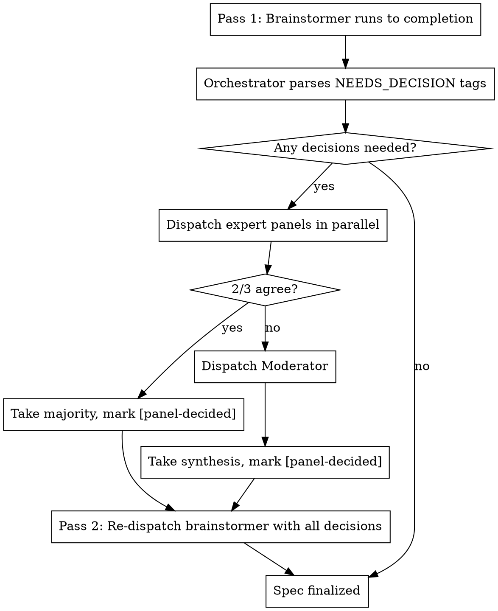

# Autonomous Implementation Skill (`/superpowers:implement`)

**Status:** Draft
**Date:** 2026-03-20

## Purpose

A fully autonomous end-to-end implementation skill that takes a task description and runs to completion without user intervention. Chains brainstorm → spec → refine-spec → plan → refine-plan → execute → verify → e2e tests as a single orchestrated pipeline.

## Core Principles

1. **Fully autonomous** — runs to completion without asking the user
2. **Subagent-everything** — all real work happens in subagents with independent context windows; main thread is a lightweight orchestrator
3. **Expert panel replaces user** — when a decision point would normally require user input, dispatch parallel expert subagents to debate and recommend
4. **Research-driven** — every subagent actively uses context7, web search, and available expert skills to confirm assumptions
5. **No infrastructure concerns** — no worktree management, no git operations. The caller controls where and when this runs
6. **Skill-aware** — discovers and engages available expert skills (e.g., `expert:engage`, `expert:research`, domain-specific skills)

## Non-Goals

- Git operations (commit, branch, merge, PR) — caller's responsibility
- Worktree management — caller decides execution context
- External state machine or persistence layer — native Claude Code only
- Interactive user confirmation at any phase — everything autonomous

## Entry Point

The skill accepts:
- **Required:** A task description (natural language, issue URL, story definition, or file path)
- **Optional:** PRD reference, existing spec, design-principles.md, specific constraints

If the input is ambiguous or too vague to brainstorm, the skill dispatches an expert panel to clarify intent rather than asking the user.

## Architecture

```
Main Thread (Orchestrator)
├── Phase 0: Context Scout (subagent)
├── Phase 1: Autonomous Brainstormer (subagent)
│   └── Expert Panel (3 parallel subagents) — answers each decision point
├── Phase 2: Spec Refinement Loop (subagent pair: simulator + fixer)
├── Phase 3: Plan Writer (subagent)
├── Phase 4: Plan Refinement Loop (subagent pair: simulator + fixer)
├── Phase 5: Execution (fresh subagent per task)
│   └── Per task: implementer → spec-reviewer → code-quality-reviewer
├── Phase 6: Spec Verification (subagent)
└── Phase 7: E2E Test Writer (subagent)
```

The orchestrator's only jobs:
1. Read artifacts (files) between phases
2. Dispatch the next subagent with the right context via the **Agent tool**, specifying `model` and `subagent_type` parameters per role (see Model selection table in Phase 5). Use `subagent_type: general-purpose` for subagents that need MCP tool access [inferred]
3. Check phase exit criteria
4. Move to the next phase or re-dispatch on failure

## Expert Panel Design

When any subagent would normally ask the user a question, the orchestrator intercepts and dispatches an expert panel instead.

### Panel Composition (3 parallel subagents)

| Role | Mandate | Model |
|------|---------|-------|
| **Domain Expert** | Deep knowledge of the technology/domain at hand. Uses context7 and web search to ground answers in current best practices and documentation. | sonnet |
| **Devil's Advocate** | Challenges assumptions, identifies risks, edge cases, and failure modes. Argues against the easy path. | sonnet |
| **Pragmatist** | Simplest path that works. YAGNI focus. Argues against over-engineering. Grounds in what the codebase already does. | sonnet |

### Decision Protocol

1. All three panelists draft independently (no seeing each other's answers)
2. Orchestrator collects all three responses
3. Dispatch a **Synthesizer** subagent (haiku) that reads all three recommendations and outputs: `AGREEMENT: yes|no`, `MAJORITY_POSITION: [summary]`, `DISSENT: [summary]`. This avoids unreliable string matching for agreement detection [inferred]
4. **If Synthesizer reports AGREEMENT: yes** → take the majority position, mark as `[panel-decided]`
5. **If Synthesizer reports AGREEMENT: no** → dispatch a **Moderator** subagent (opus) that sees all three positions and synthesizes a decision
6. Decision is recorded with rationale in the spec/plan artifact

### Panel Dispatch Template

All panel subagents MUST be dispatched with `subagent_type: general-purpose` to ensure MCP tool access (context7, web search) [inferred].

```
You are the {ROLE} on an expert panel deciding: "{QUESTION}"

## Context
{TASK_CONTEXT}
{CODEBASE_CONTEXT}

## Your Mandate
{ROLE_SPECIFIC_MANDATE}

## Available Expert Skills
{AVAILABLE_SKILLS}

## Research Requirements
Before answering:
1. Use context7 to look up relevant library/framework documentation
2. Use web search to confirm assumptions about best practices
3. Check if any of the available expert skills listed above apply to this domain [inferred]

## Output Format
RECOMMENDATION: [your recommendation]
CONFIDENCE: high | medium | low
RATIONALE: [why, with evidence from research]
RISKS: [what could go wrong with this choice]
ALTERNATIVES_CONSIDERED: [what you ruled out and why]
```

## File Structure

Files to create [inferred]:

| File | Purpose |
|------|---------|
| `SKILL.md` | Orchestrator entry point for `/superpowers:implement` |
| `prompts/expert-panel-prompt.md` | Panel Dispatch Template for domain expert, devil's advocate, and pragmatist roles |
| `prompts/expert-moderator-prompt.md` | Moderator prompt for synthesizing 3-way split decisions |
| `prompts/context-scout-prompt.md` | Phase 0 context gathering instructions |
| `prompts/autonomous-brainstormer-prompt.md` | Phase 1 brainstorming with two-pass decision collection |
| `prompts/expert-synthesizer-prompt.md` | Lightweight subagent for determining panel agreement (see Decision Protocol) |

Existing templates to reuse (not created by this skill) [inferred]:

| File | Used In |
|------|---------|
| `spec-simulator-prompt.md` | Phase 2: Spec Refinement |
| `spec-fixer-prompt.md` | Phase 2: Spec Refinement |
| `plan-simulator-prompt.md` | Phase 4: Plan Refinement |
| `plan-fixer-prompt.md` | Phase 4: Plan Refinement |
| `spec-reviewer-prompt.md` | Phase 5: Per-task spec review |
| `code-quality-reviewer-prompt.md` | Phase 5: Per-task code quality review |
| `plan-document-reviewer-prompt.md` | Phase 3: Plan document review [inferred] |

## Phase Details

### Phase 0: Context Scout

**Purpose:** Gather all available context before brainstorming begins.

**Subagent instructions:**
- Scan codebase structure, README, CLAUDE.md, package.json/similar
- Load PRD if it exists (auto-detect from `docs/`)
- Load `docs/superpowers/design-principles.md` if it exists
- Load existing specs from `docs/superpowers/specs/`
- Identify testing frameworks, patterns, and conventions in use
- Detect type-checking and linting tools available in the project (e.g., tsc, mypy, go vet, eslint) [inferred]
- Identify available expert skills that might apply. Discover skills from the Skill tool's system-reminder skills list exposed by Claude Code [inferred]
- Use context7 to fetch docs for detected frameworks/libraries
- Return: structured context summary with file paths and key findings

**Output schema** [inferred]:
```
{
  project_type: "web-app" | "api" | "cli" | "library" | "plugin" | "monorepo",
  frameworks: string[],
  test_framework: string,
  test_command: string,
  test_patterns: string,
  type_check_tool: string | null,
  linter: string | null,
  existing_specs: string[],
  design_principles_path: string | null,
  prd_path: string | null,
  available_expert_skills: string[],
  codebase_structure_summary: string,
  key_conventions: string[]
}
```

**Exit criteria:** Context summary returned.

### Phase 1: Autonomous Brainstorming

**Purpose:** Explore the design space and produce a spec.

**Two-pass subagent model:** Subagents run to completion — they cannot pause mid-execution and resume. Phase 1 uses a two-pass approach to handle decision points [inferred]:

**Pass 1 — Decision Collection:**
- Work through brainstorming stages: Purpose, Success Criteria, Scope, Architecture, Components, Data Flow, Error Handling, Testing Strategy
- Consult design-principles.md for established decisions (use silently)
- Actively use context7 and web search for technology decisions
- Engage expert skills when domain expertise is needed
- At each decision point where the answer is not obvious from context or research:
  - Record the question with a structured tag: `NEEDS_DECISION: {question}` on its own line
  - Make a provisional decision and continue (do not stop) [inferred]
- Output: draft spec file written to `docs/superpowers/specs/YYYY-MM-DD-<slug>-design.md` (where `<slug>` is the canonical slug derived by the orchestrator at startup — see Resume Detection) containing all provisional decisions and all `NEEDS_DECISION` tags [inferred]

**Orchestrator — Decision Resolution:**
- `NEEDS_DECISION` tags are written inline in the spec file by the brainstormer (not just in subagent response text). The spec file is the single source of truth [inferred]. The orchestrator reads the spec file and greps for `NEEDS_DECISION` lines to collect all decision points [inferred].
- If no `NEEDS_DECISION` tags found → skip to exit criteria [inferred]
- Dispatch expert panels for all collected questions in parallel [inferred]
- Collect all panel decisions [inferred]

**Pass 2 — Decision Integration:**
- Re-dispatch brainstormer with: original task context + all panel decisions formatted as `DECISION: {question} → {answer}` + instruction to revise the draft spec file, replacing `NEEDS_DECISION` tagged lines with resolved decisions [inferred]
- Brainstormer revises the spec and writes the final version [inferred]
- If Pass 2 introduces no new `NEEDS_DECISION` tags → done [inferred]
- If Pass 2 introduces new `NEEDS_DECISION` tags → orchestrator resolves via expert panel and re-dispatches one more time (max 3 total passes) [inferred]

**Decision handling flow:**



**Exit criteria:** Spec file written. Proceed directly to Phase 2 for refinement [inferred].

### Phase 2: Spec Refinement

**Purpose:** Pressure-test the spec before planning.

**Uses same pattern as `refining-specs` skill:**
1. Dispatch spec-simulator subagent (uses `spec-simulator-prompt.md` template)
2. If critical/important findings: dispatch spec-fixer subagent (uses `spec-fixer-prompt.md` template)
3. Check convergence:
   - **CONVERGED** (no critical/important) → proceed to Phase 3
   - **CONTINUE** (fixable gaps) → iterate
   - **ESCALATE** (same concern persists round 2+) → dispatch expert panel to resolve, then re-simulate
4. Max 5 iterations. If not converged after 5: dispatch expert panel for final resolution, apply their recommendations, proceed.

**Key difference from interactive refining-specs:** Instead of escalating to user, escalate to expert panel.

**Exit criteria:** Spec converged or max iterations reached with expert panel resolution.

### Phase 3: Plan Writing

**Purpose:** Generate implementation plan from refined spec.

**Subagent instructions:**
- Follow `writing-plans` patterns: bite-sized tasks, clear file structure, TDD steps
- Each task: write failing test → run failing → implement → run passing
- Actively use context7 to confirm framework APIs and patterns
- Engage expert skills for domain-specific planning
- Output: plan file written to `docs/superpowers/plans/YYYY-MM-DD-<slug>.md` where `<slug>` is the canonical slug derived by the orchestrator at startup (see Resume Detection) [inferred]

**Exit criteria:** Plan written and passes plan-document-reviewer (max 5 review rounds).

### Phase 4: Plan Refinement

**Purpose:** Pressure-test the plan before execution.

**Uses same pattern as `refining-plans` skill:**
1. Dispatch plan-simulator (uses `plan-simulator-prompt.md` template)
2. If critical/important findings: dispatch plan-fixer (uses `plan-fixer-prompt.md` template)
3. Same convergence logic as Phase 2
4. Max 5 iterations with expert panel as escalation path

**Exit criteria:** Plan converged or max iterations reached with expert panel resolution.

### Phase 5: Execution

**Purpose:** Implement the plan task by task.

**Uses same pattern as `subagent-driven-development` skill:**

**Git override:** Implementer subagents do NOT commit. The existing `implementer-prompt.md` template includes a "Commit your work" step — this MUST be overridden in the dispatch instructions with: "Do not make any git operations (commit, branch, push). The caller controls git." [inferred] Reviewers (spec-reviewer, code-quality-reviewer) review files changed on disk, not git SHAs [inferred].

**Model selection per role:**
| Role | Model | Rationale |
|------|-------|-----------|
| Implementer (isolated, clear spec) | sonnet | Mechanical implementation |
| Implementer (multi-file, integration) | sonnet | Standard coordination |
| Spec reviewer | sonnet | Verification against known spec |
| Code quality reviewer | sonnet | Pattern matching, quality checks |
| Expert panel (when implementer blocked) | sonnet (panelists), opus (moderator) | Architecture/design judgment |

- Fresh subagent per task
- Each implementer subagent receives:
  - Full task text (inline, not file path)
  - Spec excerpt relevant to the task
  - Codebase context from Phase 0
  - Instruction to actively use context7, web search, and expert skills
- After each task:
  1. Dispatch spec-reviewer subagent (uses `spec-reviewer-prompt.md` template)
  2. If issues → re-dispatch implementer with findings → re-review (max 3 rounds)
  3. Dispatch code-quality-reviewer subagent (uses `code-quality-reviewer-prompt.md` template)
  4. If issues → re-dispatch implementer with findings → re-review (max 3 rounds)
- If implementer reports BLOCKED or NEEDS_CONTEXT → dispatch expert panel to unblock

**Implementer output contract:** All implementer subagents MUST include a `FILES_TOUCHED: [list]` section in their response, regardless of terminal status (success, BLOCKED, or NEEDS_CONTEXT). This allows the orchestrator to track which files were created or modified [inferred].

**Implementer question handling:** If implementer returns with status `NEEDS_CONTEXT` or asks clarifying questions, the subagent has run to completion [inferred]. The orchestrator:
1. Dispatches expert panel to resolve the questions [inferred]
2. Re-dispatches a fresh implementer subagent with: the original task + expert panel answers + the `FILES_TOUCHED` list from the previous implementer so it knows exactly which files to inspect for partial work [inferred]
3. The re-dispatched implementer must first check the files from `FILES_TOUCHED`, then continue from that state rather than starting from scratch [inferred]

**Exit criteria:** All tasks completed and reviewed.

### Phase 6: Spec Verification

**Purpose:** Validate the implementation against the spec using the running application.

**Applicability check:** Not all projects have observable runtime behavior. The orchestrator checks the project type detected in Phase 0:
- **Web app / API / CLI with runnable server:** Full verify-spec pipeline
- **Library / plugin / no runnable app:** Skip browser/API navigation. Instead, dispatch a verification subagent that runs the test suite, checks exports, validates the public API against the spec, and confirms integration points work.

**For runnable projects, uses same pattern as `verify-spec` skill:**
1. Dispatch scenario-generator (extract verifiable scenarios from spec)
2. Start the application (auto-detect how)
3. Dispatch navigator to execute scenarios against running app
4. Scenarios fail → dispatch planner + coder to fix → re-navigate
5. Max 10 iterations
6. All tools available: browser automation, API calls (curl), CLI commands

**For non-runnable projects:**
1. Dispatch scenario-generator adapted for library/plugin verification. The scenario-generator produces three scenario types [inferred]:
   - **API contract scenarios:** exports exist, types match spec, public API surface is correct [inferred]
   - **Integration scenarios:** works with expected consumers, compatible with documented usage patterns [inferred]
   - **Test execution scenarios:** existing tests pass, new tests cover spec requirements [inferred]
2. Dispatch verification subagent that runs tests and checks programmatically (not via browser/API navigation) [inferred]. Validates spec compliance by executing test suites, checking module exports, and confirming type signatures [inferred]. Uses the type-checking and linting tools detected in Phase 0 (e.g., `tsc --noEmit`, `mypy`, `go vet`) to verify types and API surface [inferred]
3. Failures → dispatch planner + coder to fix → re-verify

**Key difference from interactive verify-spec:** No user escalation — expert panel resolves blockers.

**Exit criteria:** All scenarios pass or max iterations reached with report of remaining failures.

### Phase 7: E2E Test Writer

**Purpose:** Codify verification scenarios as permanent e2e tests.

**Subagent instructions:**
- Use existing test framework and patterns detected in Phase 0
- Follow conventions from existing test files in the repo
- Write tests for all confirmed scenarios from Phase 6
- Use context7 to look up test framework APIs
- Run tests to confirm they pass
- Output: test files written, all passing

**Exit criteria:** E2e tests written and passing.

## Orchestrator State Machine

The orchestrator tracks progress via a simple in-memory state:

```
current_phase: 0-7
phase_artifacts: {
  context_summary: string (Phase 0 output)
  spec_path: string (Phase 1 output)
  plan_path: string (Phase 3 output)
  task_status: Map<task_id, status> (Phase 5 progress)
  verification_report: string (Phase 6 output)
  test_files: string[] (Phase 7 output)
}
decisions_log: Array<{phase, question, panel_votes, decision, rationale}>
```

No external persistence. If the conversation dies, artifacts on disk (spec, plan, code, tests) represent durable progress.

**Resume Detection** [inferred]: On startup, before beginning Phase 0, the orchestrator derives a canonical slug from the task description (e.g., `autonomous-implement` from "Create an autonomous implementation skill"). This slug is used for all file naming across phases [inferred]. The orchestrator then checks for existing artifacts:
- Spec file in `docs/superpowers/specs/` via exact prefix match on `YYYY-MM-DD-<slug>` pattern. If multiple matches, take the most recent by date [inferred]
- Plan file in `docs/superpowers/plans/` via exact prefix match on `YYYY-MM-DD-<slug>` pattern. If multiple matches, take the most recent by date [inferred]
- Implemented code (files referenced in the plan that already exist) [inferred]

If artifacts are found, the orchestrator determines the last completed phase and resumes from the next phase [inferred]. This preserves the "no external persistence" principle — the artifacts themselves encode progress state [inferred].

**Refinement completion markers:** When spec-fixer or plan-fixer converges, it appends a `Refinement: CONVERGED round {N}` line to a `## Refinement Status` section at the end of the spec or plan file [inferred]. Resume detection checks for this marker to determine whether Phases 2 and 4 completed [inferred]. The `decisions_log` is ephemeral — on crash, panel decisions are recoverable from `[panel-decided]` tags embedded in the artifacts [inferred].

## Subagent Instructions Boilerplate

Every subagent dispatched by this skill receives this preamble:

```
## Research Requirements (MANDATORY)

You MUST actively use these capabilities — do not skip them:

1. **Context7**: Before making technology decisions, look up current documentation
   for relevant libraries and frameworks using the context7 MCP tools.
2. **Web Search**: Confirm assumptions about best practices, check for known issues,
   and validate architectural choices using Perplexity or web search.
3. **Expert Skills**: Check if specialized skills are available for your domain.
   Use the Skill tool to invoke them when applicable. Look for skills matching
   your task domain (e.g., expert:engage for library expertise, frontend-design
   for UI work, architect:* for architecture decisions).
4. **Codebase Conventions**: Follow existing patterns in the codebase. When in doubt,
   grep for similar patterns before inventing new ones.

Do not proceed on assumptions when you can verify.
```

## Decision Tags

Decisions made autonomously are tagged in spec/plan artifacts:

| Tag | Meaning |
|-----|---------|
| `[design-principle]` | Covered by existing design-principles.md |
| `[researched]` | Obvious from codebase context + research, taken without panel |
| `[panel-decided]` | Expert panel voted/synthesized this decision |
| `[panel-decided: 2/3]` | Majority decision (2 of 3 agreed) |
| `[panel-decided: moderated]` | 3-way split, moderator synthesized |

## Failure Handling

| Failure | Response |
|---------|----------|
| Subagent reports BLOCKED | Dispatch expert panel to unblock |
| Subagent reports NEEDS_CONTEXT | Dispatch research subagent to gather context, re-dispatch |
| Phase fails to converge (max iterations) | Expert panel makes final call, proceed with their recommendation |
| Spec verification finds unfixable issues | Log in verification report, proceed with passing scenarios |
| Application won't start | Dispatch planner + coder to fix startup (max 3 attempts), then skip Phase 6 and note in report |
| E2E tests fail after writing | Re-dispatch test-writer with failure output (max 3 attempts) |

## Completion Report

When all phases complete, the orchestrator outputs a summary:

```
## Implementation Complete

**Task:** {original task description}
**Spec:** {spec file path}
**Plan:** {plan file path}

### Decisions Made
- {N} decisions from design-principles
- {M} decisions from research
- {P} decisions from expert panel

### Implementation
- {X} tasks completed
- {Y} files created/modified

### Verification
- {A}/{B} scenarios passed
- {C} e2e tests written and passing

### Panel Decisions Log
[list of expert panel decisions with rationale — for user review]

### Known Issues
[any unresolved items from verification]
```

## Red Flags

**Never:**
- Ask the user for input during execution (dispatch expert panel instead)
- Skip research (context7/web search) when making technology decisions
- Proceed without gathering codebase context first (Phase 0)
- Skip spec refinement or plan refinement phases
- Execute without verification (Phase 6)
- Ship without e2e tests (Phase 7)
- Make git operations (commit, push, branch, merge)
- Manage worktrees

**Always:**
- Tag autonomous decisions with appropriate markers
- Log all expert panel decisions with rationale
- Run to completion — every phase
- Use the strongest model for architecture/design decisions (opus for moderator)
- Use efficient models for mechanical work (haiku/sonnet for implementation)
