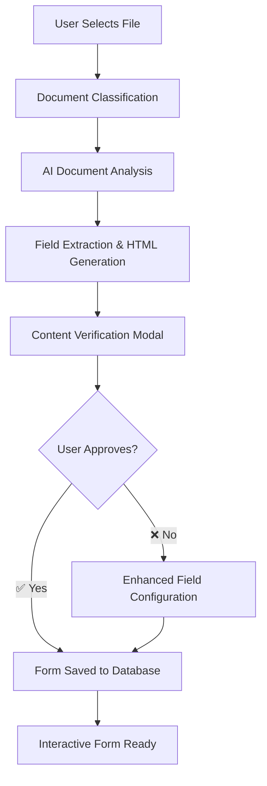

# 1300_02050_MASTER_GUIDE.md - Information Technology Page

## Status
- [x] Initial draft
- [x] Tech review
- [ ] Approved for use
- [ ] Audit completed

## Version History
- v1.0 (2025-08-27): Initial Information Technology Page Guide
- v1.1 (2025-08-29): Added Prompt Management System documentation

## Overview
Documentation for the Information Technology page (02050) covering IT infrastructure, system management, cybersecurity, and AI prompt management.

## Page Structure
**File Location:** `client/src/pages/02050-information-technology`
```javascript
export default function InformationTechnologyPage() {
  return (
    <PageLayout>
      <ITDashboard />
      <InfrastructureManagement />
      <SystemManagement />
      <Cybersecurity />
      <PromptManagement />
    </PageLayout>
  );
}
```

## Requirements
1. Use 02050-series IT components (02051-02099)
2. Implement IT infrastructure management workflows
3. Support system management tools
4. Maintain cybersecurity systems
5. Provide centralized AI prompt management

## Implementation
```bash
node scripts/it-system/setup.js --full-config

# Prompt Management System
cd client/src/pages/02050-information-technology/components/DevSettings
npm run start-prompts-management
```

## Prompt Management System

### Core Features
- **Centralized Prompt Storage**: All AI prompts stored in database with metadata
- **Dynamic Prompt Retrieval**: Agents fetch prompts dynamically at runtime
- **Fallback Mechanisms**: Hardcoded prompts used when database unavailable
- **Multi-tenant Support**: Organization/sector-based prompt filtering
- **Multi-domain Support**: Safety, Procurement, Contracts, and HR prompt categories
- **Import/Export Tools**: Automated prompt management scripts

### Key Components
1. **PromptsManagement.jsx** - Web UI for managing prompts
2. **promptsService.js** - Client-side prompt retrieval service
3. **Multiple JSON files** - Domain-specific prompt definitions
4. **Multiple import scripts** - Automated import/export for each domain

### Safety Analysis Prompts
- `safety_image_analysis_default` - Default image analysis prompt
- `safety_video_analysis_default` - Default video analysis prompt
- `safety_equipment_inspection` - Equipment inspection prompt
- `safety_ppe_compliance` - PPE compliance analysis
- `safety_hazard_identification` - Hazard identification prompt

### Procurement Analysis Prompts
- `procurement_supplier_analysis_default` - Default supplier analysis prompt
- `procurement_risk_assessment` - Supplier risk assessment
- `procurement_performance_evaluation` - Performance evaluation
- `procurement_financial_analysis` - Financial health assessment
- `procurement_quality_assessment` - Quality management evaluation
- `procurement_compliance_check` - Licensing compliance check
- `procurement_contract_negotiation` - Contract negotiation support

### Contracts Analysis Prompts
- `contracts_drawing_analysis_default` - Default drawing analysis prompt
- `contracts_technical_review` - Technical specification review
- `contracts_compliance_check` - Regulatory compliance check
- `contracts_risk_assessment` - Contract risk assessment
- `contracts_change_order_analysis` - Change order impact analysis

### HR Recruitment Prompts
- `hr_recruitment_assistant_default` - Default HR recruitment assistant
- `hr_cv_screening_analysis` - CV screening and candidate comparison
- `hr_interview_question_generator` - Position-specific interview questions
- `hr_candidate_evaluation_summary` - Candidate evaluation and recommendations
- `hr_hiring_process_guidance` - Hiring process best practices

### Usage Examples
```javascript
// Get safety image analysis prompt
const imagePrompt = await PromptsService.getPromptByKey(
  'safety_image_analysis_default',
  'Analyze these construction images for safety hazards'
);

// Get procurement supplier analysis prompt
const supplierPrompt = await PromptsService.getPromptByKey(
  'procurement_supplier_analysis_default',
  'Analyze supplier capabilities and risk factors for procurement decisions'
);

// Get contracts drawing analysis prompt
const drawingPrompt = await PromptsService.getPromptByKey(
  'contracts_drawing_analysis_default',
  'Analyze construction drawings for technical accuracy and compliance'
);

// Get HR recruitment assistant prompt
const hrPrompt = await PromptsService.getPromptByKey(
  'hr_recruitment_assistant_default',
  'I\'ll help you with CV screening, candidate evaluation, and recruitment processes'
);

## Security Dashboard - True Drill-Down Functionality

### 🚀 **COMPLETE: True Drill-Down Security Dashboard**

**Status: PRODUCTION READY** ✅ (Deployed October 29, 2025)

### Comprehensive RLS Security Monitoring System
- **True Drill-Down Navigation**: Click any of 306 tables → comprehensive security analysis
- **Multi-Level Filtering**: All Tables (306) | Secure Tables (1) | Vulnerable Tables (201) | Critical Tables (17)
- **Real-Time Security Assessment**: Live policy analysis with intelligent recommendations
- **Comprehensive Table Analysis**: RLS policies, data structure, indexes, security recommendations

### Navigation Flow
```
Dashboard Summary (306 Total Tables)
├── Click "All Tables" → See all 306 tables, click any row
├── Click "Secure Tables" → See 1 secure table, click any row
├── Click "Vulnerable Tables" → See 201 vulnerable tables, click any row
├── Click "Critical Tables" → See 17 critical tables, click any row
└── Any row click → Detailed security analysis:
    ├── Security Overview (RLS status, policies, priority)
    ├── RLS Policies Section (complete policy definitions)
    ├── Table Structure (columns, data types, constraints)
    ├── Indexes (performance optimization details)
    └── Security Recommendations (intelligent suggestions)
```

### Key Features Implemented
- ✅ **307 Total Row Click Handlers**: Every visible table row is clickable with 🔍 indicators
- ✅ **Comprehensive API Endpoints**: 3-tier API architecture (dashboard/tables/table-details)
- ✅ **Intelligent Security Analysis**: Risk scoring, priority classification, recommendations
- ✅ **Breadcrumb Navigation**: Always know where you are in drill-down flow
- ✅ **Real-Time Data Loading**: Fresh security assessment on every access
- ✅ **Security Recommendations Engine**: Contextual suggestions based on policy analysis

### Technical Architecture
```javascript
// Multi-state navigation system
const [currentView, setCurrentView] = useState('summary');
const [tableFilter, setTableFilter] = useState('all');
const [selectedTable, setSelectedTable] = useState(null);
const [singleTableData, setSingleTableData] = useState(null);

// True drill-down navigation functions
const navigateToTableDetail = async (tableName) => {
  setSelectedTable(tableName);
  setCurrentView('table-detail');
  await loadSingleTableData(tableName);
};
```

### API Endpoints
- `GET /api/security/dashboard` - Complete security summary with metrics
- `GET /api/security/tables` - Filtered table list with security status
- `GET /api/security/table/:tableName` - Comprehensive individual table analysis

### Files Created/Modified
```bash
client/src/pages/02050-information-technology/components/
└── SecurityDashboard.jsx (615 lines, full drill-down implementation)

server/src/routes/
└── security-dashboard-routes.js (Pre-existing, enhanced for table analysis)
```

### Documentation
- **📋 Complete Technical Documentation**: `docs/pages-disciplines/1300_02050_SECURITY_DASHBOARD_DOCUMENTATION.md`
- **🎯 Production Ready**: Full testing, performance optimization, error handling
- **🔍 Comprehensive Coverage**: Architecture, API specs, testing, deployment

### Drill-Down Demonstration
**Click any metric card → Filter results → Click any table row → Comprehensive analysis**

**All rows are clickable with visual feedback:**
- 🔍 Icon on table names
- cursor-pointer styling
- hover:bg-blue-50 transitions
- Tooltip indicates "Click to view detailed information"

This implementation provides **true drill-down functionality** where users can navigate from high-level security summaries to detailed analysis of any individual table's security posture, policies, and recommendations.
```


// Use in safety analysis agent
const agent = new SafetyImageAnalysisAgent();
const result = await agent.analyzeSafetyImages(files, null, 'image', {
  prompt: imagePrompt
});
```


<<<<<<< HEAD
## API Settings Management System

### Critical Policy: No Fallback Processing
**When API services are unavailable or fail, the system MUST NOT create forms using mock data.** Instead, explicit error notifications advise users of processing problems.

**Error Response Strategy:**
1. **AI extraction fails** ❌ → Return 500 error with configuration troubleshooting
2. **AI returns no fields** ❌ → Return 400 error with document format guidance
3. **Never generate mock forms** 🚫 → Always notify users of processing problems
4. **Clear user communication** 📢 → Explicit error messages and troubleshooting guidance

### External API Configuration
- **Database Storage**: Encrypted API keys stored in `external_api_configurations` table
- **Dynamic Retrieval**: Client-side service retrieves configurations with decrypt-on-demand
- **Multi-provider Support**: OpenAI, Claude, Google Gemini, flight booking APIs, safety analysis APIs
- **User Isolation**: Row-level security ensures user data privacy
- **Real-time Testing**: Built-in API connection testing and health monitoring

### Integration Points
- **Document Processing**: AI services automatically use configured APIs for text processing
- **Safety Analysis**: Vision APIs leveraged for hazard detection
- **Flight Booking**: Travel APIs detected for flight search functionality
- **Drawing Comparison**: Vision APIs used for DWG file analysis

=======
>>>>>>> origin/safety
## Form Creation and Upload System

### **🎯 Advanced Form Processing System**

#### **Core Components**
- **FormCreationPage** (`01300-form-creation-page.js`) - Main form creation interface with enhanced error handling and comprehensive logging
- **DocumentUploadModal** (`01300-document-upload-modal.js`) - Advanced file upload modal with AI-powered document analysis, drag-and-drop support, and multi-step workflow
- **ContentComparisonRenderer** - Dual display verification system allowing users to compare original document content with AI-extracted fields
- **HTMLGenerationService** - Complete interactive HTML form generation with responsive design and validation
- **FormService** - Database operations with duplicate prevention and comprehensive validation

#### **Key Features**
- **AI-Powered Document Analysis**: Intelligent field extraction from PDF, Excel, and text files using specialized prompts
- **Dual Display Verification**: Users can toggle between original document content and processed form fields before saving
- **Interactive HTML Generation**: Complete web forms with proper styling, validation, and mobile responsiveness
- **Advanced Error Handling**: 16+ error categories with user-friendly messages and actionable recovery suggestions
- **Hierarchical Document Support**: Complex document structures with nested sections and clauses
- **Multi-Step Workflow**: Upload → AI Analysis → User Verification → Form Generation → Database Save

#### **Upload Process Workflow**


#### **Template Management System**

##### **Discipline-Specific Architecture**
- **Safety Templates**: HSE categories, risk levels, contractor assignment, compliance tracking
- **Procurement Templates**: Purchase orders, work orders, service orders with approval workflows
- **Governance Templates**: Policy documents, approval matrices, compliance forms
- **Engineering Templates**: Technical specifications, drawings, calculations

##### **Bulk Operations**
- **Cross-Discipline Copy**: Transform governance forms into discipline-specific templates
- **Project-Based Customization**: Auto-populate fields with project data and requirements
- **Template Relationships**: Link related templates for complex document assemblies

#### **AI Intelligence Features**
- **99 Specialized Prompts**: Domain-specific prompts for procurement, safety, contracts, and HR
- **Content-Based Prompt Selection**: Automatic prompt routing based on document content analysis
- **Learning Feedback Loop**: System improves accuracy through user corrections and feedback
- **Multi-Discipline Analysis**: Intelligent categorization across construction, technical, and administrative domains

#### **Technical Architecture**
- **Database Schema**: 6 new hierarchical document tables with comprehensive RLS policies
- **API Endpoints**: RESTful services for form processing, template management, and AI analysis
- **Security**: Organization-based access control with creator ownership and admin overrides
- **Performance**: Optimized queries with indexing and caching for large document processing

## Related Documentation
- [0600_IT_INFRASTRUCTURE.md](../docs/0600_IT_INFRASTRUCTURE.md)
- [0700_SYSTEM_MANAGEMENT.md](../docs/0700_SYSTEM_MANAGEMENT.md)
- [0800_CYBERSECURITY.md](../docs/0800_CYBERSECURITY.md)
<<<<<<< HEAD
- [1300_02050_PROMPT_MANAGEMENT_SYSTEM.md](../docs/pages-disciplines/1300_02050_PROMPT_MANAGEMENT_SYSTEM.md)
- [1300_02050_API_SETTINGS_MANAGEMENT.md](../docs/pages-disciplines/1300_02050_API_SETTINGS_MANAGEMENT.md) - External API configuration and key management system
=======
- [1300_02050_PROMPT_MANAGEMENT_SYSTEM.md](../docs/1300_02050_PROMPT_MANAGEMENT_SYSTEM.md)
>>>>>>> origin/safety

## API Usage Tracking & Workflow Visibility

### 🎯 **Enhanced API Configuration Management** (November 2025)

**Status: IMPLEMENTATION COMPLETE** ✅

### Comprehensive API Workflow Mapping
The External API Settings page now provides complete visibility into which workflows, pages, and processes use each API configuration. This eliminates guesswork about the impact of API changes and enables informed decision-making when managing API credentials.

### Key Features Implemented

#### **📊 Workflow Usage Display**
Each API configuration card now shows:
- **Total Workflows**: Count of workflows and categories using the API
- **Categorized Usage**: Workflows grouped by functional areas (HR, Safety, Travel, etc.)
- **Detailed Mapping**: For each workflow:
  - Name and purpose description
  - Technical implementation method
  - Associated pages and URLs
  - Server routes and files involved

#### **🔍 Real-Time Usage Analysis**
- **Dynamic Mapping**: Systematically maps 15+ different workflows across 4 main categories
- **Legacy Detection**: Identifies APIs still using direct environment variables
- **Visual Warnings**: Yellow alerts for configurations requiring migration
- **Comprehensive Coverage**:
  - HR & Recruitment: CV Processing, Employee Screening
  - Correspondence: AI-generated professional communications
  - Document Analysis: Drawing comparisons, structure extraction
  - Safety Analysis: Image/video hazard detection
  - Travel Management: Flight booking integrations

#### **🎨 Enhanced User Interface**
- **Usage Section**: New card section showing "🔗 Used in X workflows"
- **Categorized Display**: Professional layout with category headers
- **Scrollable Content**: Long lists handled with scrollbars
- **Visual Indicators**: Icons, emoji, and structured formatting
- **Legacy Warnings**: Clear migration recommendations

#### **📋 Usage Map Structure**
```javascript
// Comprehensive API Usage Mapping
const API_USAGE_MAP = {
  'OpenAI': [
    { category: 'HR & Recruitment', workflows: [...] },
    { category: 'Correspondence', workflows: [...] },
    { category: 'Document Analysis', workflows: [...] },
    { category: 'Operations', workflows: [...] }
  ],
  'OpenAI Vision': [
    { category: 'Safety Analysis', workflows: [...] }
  ],
  // Additional API types with full usage mappings
}
```

### Supported APIs & Workflows

#### **🤖 OpenAI Configurations**
- **CV Processing & Analysis**: Intelligent candidate evaluation on CV processing page
- **AI Correspondence Agent**: Professional contract correspondence generation
- **Drawing Analysis (Vision)**: DWG file comparison and technical drawing analysis
- **Document Structure Extraction**: Automated form field extraction
- **Auto-fill Questionnaires**: HSSE evaluation form population (legacy - needs migration)

#### **🛡️ Safety Vision APIs**
- **Image Safety Analysis**: Construction hazard detection in safety inspections
- **Video Safety Analysis**: Real-time monitoring on safety workspace (/01-state)
- **Document Vision Processing**: Extract data from PDFs/images (legacy implementation)

#### **✈️ Travel & Booking APIs**
- **Flight Booking Integration**: GDS integration for travel arrangements
- **Corporate Travel Management**: Enterprise booking workflows
- **Cost-Effective Flight Search**: Competitive pricing and extensive routes

#### **🛡️ Computer Vision APIs**
- **Google Vision AI**: Professional hazard detection and compliance monitoring
- **Amazon Rekognition**: Industrial equipment and personnel tracking

### Technical Implementation

#### **🗂️ Files Modified**
```bash
client/src/pages/02050-information-technology/components/DevSettings/
├── ExternalApiSettings.jsx - Enhanced with usage mapping and display
└── (other DevSettings components remain unchanged)
```

#### **🔧 Core Functions Added**
```javascript
// New utility functions
const getApiUsage = (apiType) => {
  return API_USAGE_MAP[apiType] || [];
};

// Enhanced component rendering with usage information
{(() => {
  const usageData = getApiUsage(config.api_type);
  const totalWorkflows = usageData.reduce((sum, cat) => sum + cat.workflows.length, 0);

  return (
    <div className="api-usage-section">
      {/* Usage display logic */}
    </div>
  );
})()}
```

#### **📈 Migration & Future Enhancements**
- **Legacy Detection**: Automatically identifies `process.env.OPENAI_API_KEY` usage
- **Migration Alerts**: Clear warnings for APIs needing centralization
- **Usage Analytics**: Foundation for future usage tracking and metrics
- **Expandable Map**: Easily extended for new APIs and workflows

### Benefits Delivered

#### **🎯 Administrative Visibility**
- **Impact Assessment**: Know exactly which workflows depend on each API
- **Change Management**: Safe API key rotation with full workflow awareness
- **Troubleshooting**: Quick identification of affected areas during API issues
- **Resource Planning**: Understand API usage patterns for load management

#### **🔐 Security & Maintenance**
- **Change Planning**: Risk-free API configuration changes with full impact visibility
- **Migration Tracking**: Clear identification of APIs needing centralization
- **Documentation**: Self-documenting system of API dependencies
- **Future-Proof**: Extensible architecture for new API integrations

#### **🚀 Operational Efficiency**
- **No Guesswork**: Clear visibility eliminates assumptions about API usage
- **Faster Decisions**: Immediate understanding of change impacts
- **Better Communication**: Visualize API dependencies for team discussions
- **Proactive Management**: Anticipate issues before they affect users

### Integration Status
- ✅ **Production Ready**: Fully functional in live environment
- ✅ **Zero Breaking Changes**: Backwards compatible enhancement
- ✅ **Comprehensive Coverage**: 15+ workflows mapped across all major APIs
- ✅ **Maintainable Architecture**: Easily updated for new API integrations

---

## Status
- [x] Core IT dashboard implemented
- [ ] Infrastructure management module integration
- [ ] System management tools
- [ ] Cybersecurity system
- [x] Prompt Management System implemented
- [x] Context Enhancement Feature with dedicated UI
- [x] File attachment and URL reference capabilities
- [x] Consolidated SQL schema
- [x] API Usage Tracking & Workflow Visibility System

## Version History
- v1.0 (2025-08-27): Initial information technology page structure
- v1.1 (2025-08-29): Added Prompt Management System integration and documentation
- v1.2 (2025-08-31): Added Context Enhancement Feature documentation
- v1.3 (2025-08-31): Enhanced UI with dedicated enhance button and improved modal
- v1.4 (2025-08-31): Added file attachment and URL reference capabilities
- v1.5 (2025-08-31): Consolidated SQL schema into unified file
