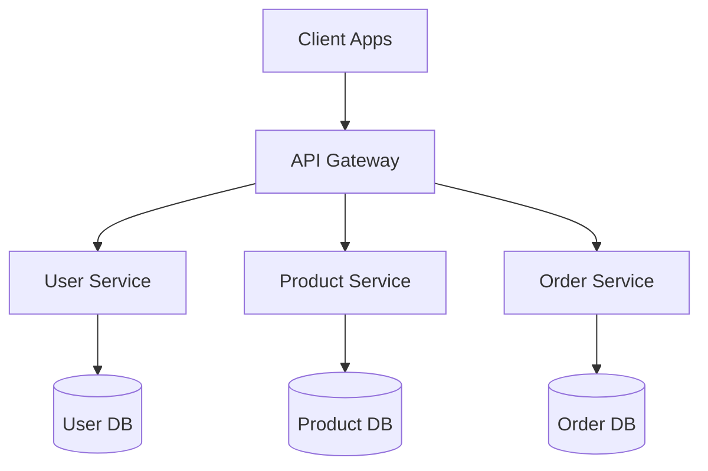

# 1300_02050_MERMAID_TEMPLATES_PAGE.md - Mermaid Templates Page - Information Technology Documentation

## Status
- [x] Initial draft
- [x] Tech review completed
- [x] Approved for use
- [ ] Audit completed

## Version History
- v1.0 (2025-11-30): Comprehensive Mermaid Templates page documentation for diagram creation and workflow visualization

## Overview

The Mermaid Templates Page (`#/coding-templates`) is a specialized diagram creation and visualization tool within the Information Technology (02050) discipline. It provides developers, architects, and technical teams with pre-built Mermaid diagram templates and a live code editor for creating interactive technical documentation, system architecture diagrams, API flows, and workflow visualizations.

## Route Information
**Route:** `/coding-templates`
**Access:** Information Technology Page → Accordion Navigation → "Diagrams - Mermaid"
**Parent Page:** 02050 Information Technology
**Navigation:** Main application route (not hash-based)

## Core Features

### 1. Pre-Built Diagram Templates
**Purpose:** Quick-start templates for common technical diagram types

**Available Templates:**
- **🚀 Primary Hub**: Quick access navigation template for diagram selection
- **🏗️ Architecture**: System design templates for components and microservices
- **🔄 API Flow**: Backend integration templates for API documentation
- **🧠 Algorithm Design**: Complex logic templates for algorithm visualization
- **📊 Class Diagram**: Object-oriented class structures for software design
- **⚙️ Workflow Designer**: Business processes and project timelines (Gantt charts)

**Template Features:**
- Color-coded categories (blue, orange, green, red, purple, teal)
- Pre-written Mermaid syntax examples
- Contextual descriptions and use cases
- One-click template selection and editing

### 2. Live Code Editor
**Purpose:** Interactive Mermaid syntax editing with real-time preview

**Editor Capabilities:**
- **Syntax Highlighting**: Mermaid-specific code highlighting
- **Auto-Completion**: Context-aware suggestions for diagram elements
- **Error Detection**: Real-time syntax validation and error feedback
- **Code Formatting**: Automatic indentation and structure formatting
- **Template Switching**: Easy transition between different diagram types

**Supported Mermaid Types:**
- Flowcharts (`graph`, `flowchart`)
- Sequence Diagrams (`sequenceDiagram`)
- Gantt Charts (`gantt`)
- Class Diagrams (`classDiagram`)
- State Diagrams (`stateDiagram`)
- Entity Relationship Diagrams (`erDiagram`)

### 3. Real-Time Preview System
**Purpose:** Instant visual feedback for diagram creation and editing

**Preview Features:**
- **Live Rendering**: Automatic diagram updates as code changes
- **Responsive Design**: Diagrams adapt to container size
- **Error Handling**: Graceful error display with helpful suggestions
- **Loading States**: Visual indicators during rendering process
- **Theme Support**: Consistent with application theming

**Rendering Engine:**
- Mermaid.js library integration
- SVG-based output for crisp graphics
- Cross-browser compatibility
- Performance optimization for complex diagrams

### 4. Export Functionality
**Purpose:** Professional diagram export for documentation and presentations

**Export Options:**
- **PNG Export**: High-resolution raster images for presentations
- **SVG Export**: Vector graphics for technical documentation
- **Code Export**: Raw Mermaid syntax for version control
- **Template Sharing**: Export templates for team collaboration

**Export Quality:**
- Automatic sizing optimization
- White background for professional appearance
- High DPI support (retina displays)
- Compression optimization for web delivery

## Component Architecture

### Frontend Components
```javascript
// Main Page Component
MermaidTemplatesPage
├── TemplateSelectionView    // Grid of pre-built templates
├── CodeEditorView          // Live editing interface
├── PreviewPanel            // Real-time diagram rendering
└── ExportControls          // PNG/SVG export functionality
```

### State Management
```javascript
const [workflowState, setWorkflowState] = useState({
  currentView: 'templates',     // 'templates' | 'editor'
  selectedTemplate: null,       // Current template object
  mermaidCode: '',             // Current diagram code
  isRendering: false,          // Loading state
  renderError: null           // Error handling
});
```

### Integration Points
- **Settings Manager**: Theme application and UI customization
- **Mermaid Library**: Core diagram rendering engine
- **File System**: Export functionality and template storage
- **Navigation**: Seamless integration with accordion system

## Technical Implementation

### Mermaid Configuration
```javascript
// Mermaid initialization with production settings
mermaid.initialize({
  startOnLoad: false,
  theme: 'default',
  securityLevel: 'loose',
  fontFamily: '"Courier New", monospace',
  flowchart: { useMaxWidth: true, htmlLabels: true },
  sequence: { useMaxWidth: true },
  gantt: { useMaxWidth: true }
});
```

### Template Data Structure
```javascript
const MERMAID_TEMPLATES = {
  'architecture': {
    id: 'architecture',
    title: '🏗️ Architecture',
    description: 'System design templates...',
    icon: '⚡',
    color: 'orange',
    code: `graph TB\n    A[Component] --> B[Service]...`
  }
};
```

### Export Implementation
```javascript
// PNG export with canvas rendering
const handleExportPNG = async () => {
  const svgElement = previewRef.current.querySelector('svg');
  const canvas = document.createElement('canvas');
  const ctx = canvas.getContext('2d');
  // SVG to canvas conversion with proper sizing
};
```

## User Interface

### Template Selection Interface
```
┌─────────────────────────────────────────────────┐
│ 🚀 Mermaid Coding Templates                     │
│ Select a template to start creating diagrams    │
├─────────────────────────────────────────────────┤
│ ┌─────────────┐ ┌─────────────┐ ┌─────────────┐ │
│ │ 🏗️ Arch     │ │ 🔄 API      │ │ 🧠 Algo     │ │
│ │ tecture     │ │ Flow        │ │ rithm      │ │
│ │ System      │ │ Backend     │ │ Complex    │ │
│ │ Design      │ │ Integration │ │ Logic      │ │
│ └─────────────┘ └─────────────┘ └─────────────┘ │
│                                                 │
│ ┌─────────────┐ ┌─────────────┐ ┌─────────────┐ │
│ │ 📊 Class    │ │ ⚙️ Workflow │ │ 🚀 Primary  │ │
│ │ Diagram     │ │ Designer    │ │ Hub        │ │
│ │ OO Design   │ │ Business    │ │ Navigation │ │
│ │ Structure   │ │ Process     │ │ Template   │ │
│ └─────────────┘ └─────────────┘ └─────────────┘ │
└─────────────────────────────────────────────────┘
```

### Code Editor Layout
```
┌─────────────────────────────────────────────────┐
│ 🏗️ Architecture Template          [Export PNG] │
│ Edit your Mermaid diagram code below           │
├─────────────────┬───────────────────────────────┤
│ 📝 Mermaid Code │ 👁️ Live Preview               │
│ graph TB        │                               │
│ A[Start] -->    │        ┌─────────────┐        │
│ B{Decision}     │        │  Start      │        │
│ ...             │        └─────┬───────┘        │
│                 │        ┌─────▼───────┐        │
│                 │        │ Decision    │        │
│                 │        └─────────────┘        │
└─────────────────┴───────────────────────────────┘
```

## Usage Scenarios

### 1. System Architecture Documentation
**Scenario:** Documenting microservices architecture for new development

**Workflow:**
1. Select "Architecture" template
2. Modify component names and relationships
3. Add specific services and databases
4. Export PNG for stakeholder presentations
5. Save Mermaid code in project documentation

### 2. API Design and Documentation
**Scenario:** Creating sequence diagrams for API endpoint documentation

**Workflow:**
1. Choose "API Flow" template
2. Customize participant names (Client, API Gateway, Services)
3. Add specific API calls and responses
4. Include error handling flows
5. Export for API documentation repository

### 3. Algorithm Design and Review
**Scenario:** Visualizing complex business logic for code review

**Workflow:**
1. Use "Algorithm Design" template
2. Map out decision trees and data flows
3. Include edge cases and error conditions
4. Add performance considerations
5. Share with development team for review

### 4. Project Planning and Timelines
**Scenario:** Creating Gantt charts for sprint planning

**Workflow:**
1. Select "Workflow Designer" template
2. Define project phases and tasks
3. Set realistic timelines and dependencies
4. Include milestones and deliverables
5. Export for project management tools

### 5. Class Design and Code Generation
**Scenario:** Designing class hierarchies for new features

**Workflow:**
1. Choose "Class Diagram" template
2. Define classes, properties, and methods
3. Establish inheritance and composition relationships
4. Add interface definitions
5. Use as blueprint for code implementation

## Integration with Development Workflow

### When to Use Mermaid Templates

#### **Architecture Design Phase**
- Creating system overview diagrams
- Documenting component interactions
- Planning microservices architecture
- Database schema visualization

#### **API Development Phase**
- Designing RESTful API flows
- Documenting authentication sequences
- Planning error handling workflows
- Creating integration test scenarios

#### **Code Review and Documentation**
- Visualizing complex algorithms
- Documenting business logic flows
- Creating onboarding materials
- Maintaining technical documentation

#### **Project Management**
- Sprint planning with Gantt charts
- Task dependency mapping
- Timeline visualization
- Progress tracking diagrams

### Best Practices for Diagram Creation

#### **Diagram Naming Conventions**
```
[Project]_[Component]_[Type]_[Version]
Example: Ecommerce_API_Flow_v2.1
```

#### **Code Organization**


#### **Version Control Integration**
- Store Mermaid files in `/docs/diagrams/` directory
- Include in project documentation repository
- Version diagrams with feature releases
- Review diagram changes in pull requests

## Performance Considerations

### Rendering Optimization
- **Lazy Loading**: Diagrams render only when visible
- **Caching**: Compiled SVG caching for repeated views
- **Memory Management**: Cleanup of large diagram objects
- **Progressive Loading**: Template previews load before full diagrams

### Export Performance
- **Canvas Optimization**: Efficient SVG to canvas conversion
- **Image Compression**: Automatic PNG optimization
- **Background Processing**: Non-blocking export operations
- **Memory Limits**: Protection against memory exhaustion

## Security and Access Control

### Template Security
- **Code Sanitization**: Mermaid code validation and sanitization
- **Export Restrictions**: Controlled export functionality
- **Template Auditing**: Review of custom template additions
- **Access Logging**: User activity tracking for compliance

### Data Protection
- **No External Data**: Diagrams generated from local templates only
- **Export Encryption**: Secure handling of exported files
- **Session Management**: Proper cleanup of diagram data
- **Cross-Site Scripting**: Protection against XSS in diagram content

## Troubleshooting

### Common Issues

#### **Diagram Not Rendering**
**Symptoms:** Blank preview panel, error messages
**Solutions:**
- Check Mermaid syntax validity
- Ensure proper diagram type declaration
- Verify font and character encoding
- Clear browser cache and reload

#### **Export Failures**
**Symptoms:** PNG/SVG export not working
**Solutions:**
- Check diagram complexity (simplify if needed)
- Verify browser canvas support
- Ensure adequate memory for large diagrams
- Try different export format

#### **Template Loading Issues**
**Symptoms:** Templates not displaying correctly
**Solutions:**
- Refresh page to reload template data
- Check network connectivity for asset loading
- Verify theme settings compatibility
- Clear application cache

### Error Messages and Solutions

| Error Message | Cause | Solution |
|---------------|-------|----------|
| `Parse error` | Invalid Mermaid syntax | Check syntax against Mermaid documentation |
| `Render timeout` | Complex diagram | Simplify diagram or increase timeout |
| `Export failed` | Canvas rendering issue | Try simpler diagram or different browser |
| `Font loading error` | Web font issues | Use fallback fonts in diagram configuration |

## Future Enhancements

### Phase 1: Enhanced Templates
- **Custom Template Builder**: User-created template library
- **Template Categories**: Industry-specific template collections
- **Collaborative Editing**: Real-time diagram collaboration
- **Template Marketplace**: Shared community templates

### Phase 2: Advanced Features
- **Interactive Diagrams**: Clickable diagram elements
- **Animation Support**: Step-by-step diagram animations
- **Data Integration**: Dynamic data binding in diagrams
- **Version History**: Diagram change tracking and rollback

### Phase 3: Enterprise Integration
- **Jira Integration**: Automatic diagram updates from tickets
- **Confluence Sync**: Direct publishing to Confluence pages
- **GitHub Integration**: Repository diagram management
- **API Endpoints**: Programmatic diagram generation

## Related Documentation

- [1300_02050_MASTER_GUIDE_INFORMATION_TECHNOLOGY.md](1300_02050_MASTER_GUIDE_INFORMATION_TECHNOLOGY.md) - Main IT page documentation
- [1300_02050_MASTER_GUIDE_ERROR_DISCOVERY.md](1300_02050_MASTER_GUIDE_ERROR_DISCOVERY.md) - Error discovery system
- [docs/mermaid/1500_MERMAID_MASTER_GUIDE.md](docs/mermaid/1500_MERMAID_MASTER_GUIDE.md) - Mermaid implementation guide
- [docs/mermaid/1500_MERMAID_TEMPLATES_IMPLEMENTATION_COMPLETE.md](docs/mermaid/1500_MERMAID_TEMPLATES_IMPLEMENTATION_COMPLETE.md) - Technical implementation details

## Status
- [x] Pre-built templates implemented
- [x] Live code editor operational
- [x] Real-time preview system active
- [x] PNG/SVG export functionality working
- [x] Performance optimization completed
- [x] Security measures implemented
- [x] User documentation created
- [x] Future enhancements roadmap defined

## Version History
- v1.0 (2025-11-30): Complete Mermaid Templates page documentation with usage guidelines, technical implementation details, and integration patterns
