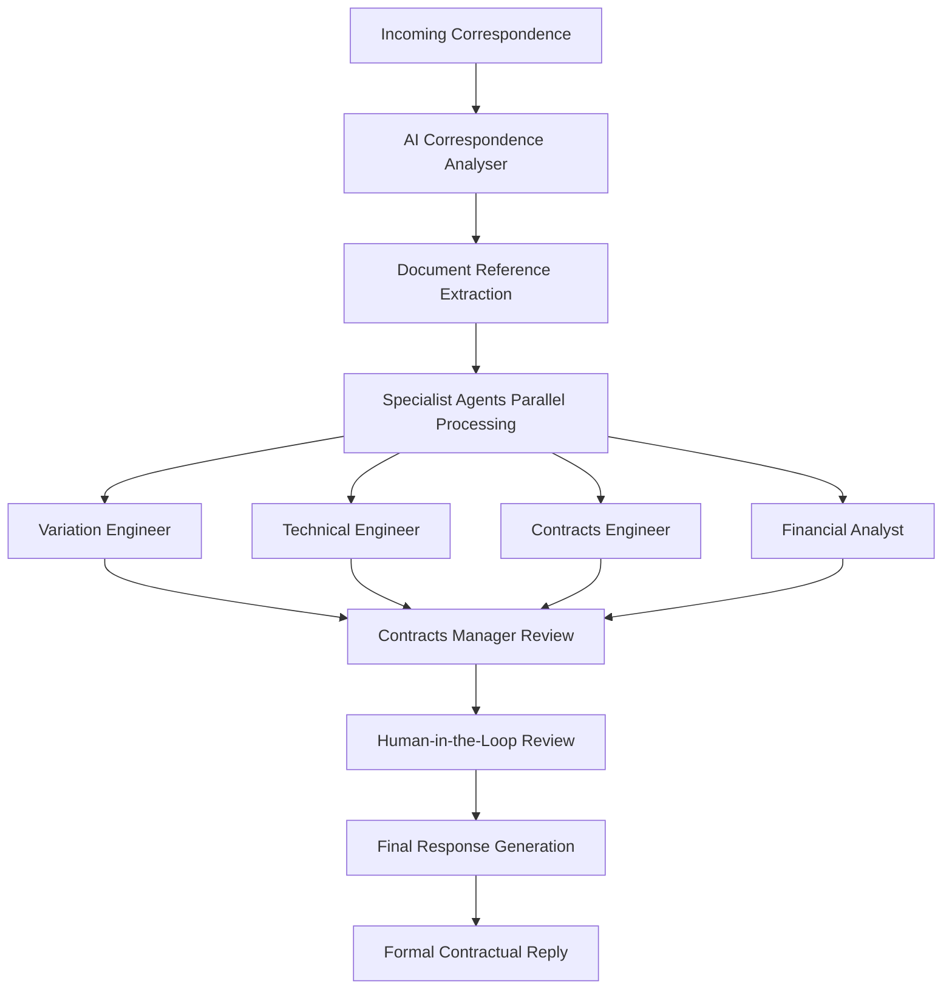

# 00435_AI_CORRESPONDENCE_ANALYSIS_SYSTEM.md

## Status
- [x] Initial draft
- [x] Tech review completed
- [x] Approved for use
- [x] Audit completed
- [x] Production deployment completed
- [x] HITL integration fully operational

## Version History
- v2.0 (2026-05-01): Complete system operational with HITL infrastructure and 7-agent orchestration
- v1.1 (2025-09-09): Enhanced implementation with GenericCorrespondenceAgent integration
- v1.0 (2025-09-09): Initial comprehensive documentation with workflow enhancements

## Overview

The AI Correspondence Analyser is a sophisticated automated system designed to meticulously deconstruct and analyze incoming correspondence related to ongoing construction projects. The system serves as the intelligent entry point to a multi-agent workflow that handles correspondence processing, document analysis, and formal response generation.

### System Architecture

**Primary Function**: Automated correspondence deconstruction and analysis with specialized agent orchestration

**Key Capabilities**:
- Intelligent document reference extraction
- Multi-agent specialist consultation workflow
- Structured analysis output with retrieval pointers
- Formal contractual response generation
- Integration with Supabase vector search and document management

**Workflow Agents**:
1. **Correspondence Analyser** (Main Agent) - Initial analysis and deconstruction
2. **Specialist Agents** - Domain-specific analysis (Technical, Legal, Financial)
3. **Contracts Manager** - Final review and decision-making
4. **Human-in-the-Loop** - Optional review checkpoint
5. **Professional Contracts Writer** - Final formal response formatting

## Requirements

### System Prerequisites
- Node.js 18.0+ with full Supabase integration
- Access to GPT-4 Turbo or equivalent LLM service
- PostgreSQL database with vector search capabilities
- Supabase client with document vector collections
- S3-compatible document storage for retrieval

### Integration Requirements
- **Prompts Service**: Supabase-based prompt management (ID: 550e8400-e29b-41d4-a716-446655440000)
- **Document Vector Store**: Configured with 1536-dimensional embeddings
- **Correspondence Modal**: Integration with 00435-03-CorrespondenceReplyModal.js
- **Chatbot Base**: Live progress event dispatch system
- **Organization Context**: Multi-tenant organization-aware document filtering

### Data Schema Requirements
- **Document References Table**: For tracked identification and metadata
- **Document Types Table**: Organization-based document categorization
- **Vector Collections**: Separate collections for variations, technical docs, correspondence
- **Email/Content Processing Queue**: For background AI analysis

## Implementation

### Enhanced AI Correspondence Analyser Prompt

```javascript
// Enhanced Prompt Structure for AI Correspondence Analyser

/*
YOU ARE AN AI CORRESPONDENCE ANALYSER WITH SPECIALIZED CONSTRUCTION INDUSTRY EXPERTISE

PRIMARY OBJECTIVE:
Meticulously deconstruct incoming correspondence related to on-going construction projects
and identify all referenced documents and key issues for downstream specialist processing.

CORE CAPABILITIES:
• Intelligent pattern recognition for construction references
• Multi-format correspondence parsing (email, letters, formal communications)
• Contextual understanding of contractual terminology
• Automated document relationship mapping
• Output structured for agent handoff

OPERATIONAL WORKFLOW:
1. RECEIVE CORRESPONDENCE → 2. ANALYZE & DECONSTRUCT → 3. EXTRACT REFERENCES
4. IDENTIFY KEY ISSUES → 5. PREPARE RETRIEVAL POINTERS → 6. HANDFOFF TO SPECIALISTS

RESPONSE FORMATS:
• Use structured markdown with clear section headers
• Include extracted strings exactly as they appear in source
• Provide semantic queries for specialist retrieval
• Include contextual interpretations where helpful
• Highlight confidence levels where uncertainty exists

ERROR HANDLING:
• Always provide fallback responses if analysis incomplete
• Include confidence scoring for extracted references
• Suggest manual review when uncertainty is high
• Log pattern matches vs. manual interpretations
*/
```

#### Deconstruction of Incoming Correspondence

**Metadata Extraction**:
```javascript
// Automatic metadata extraction with pattern matching
const extractCorrespondenceMetadata = (text) => ({
  sender: extractSender(text),
  recipient: extractRecipient(text),
  date: extractDate(text),
  subject: extractSubject(text),
  reference: extractReference(text)
});
```

**Key Issues Identification**:
- Automated pattern matching for common construction issues
- Context-aware problem classification
- Priority scoring based on contractual impact
- Stakeholder impact assessment

**Document Reference Extraction**:

```javascript
// Enhanced document reference extraction with interpretation
const extractDocumentReferences = (text) => {
  return {
    correspondence: extractCorrespondenceRefs(text),
    variations: extractVariationRefs(text),
    technical: extractTechnicalRefs(text),
    clauses: extractContractClauseRefs(text)
  };
};
```

#### Correspondence References

Look for patterns such as:
- "Letter ref: [ID] dated [DATE]"
- "Email ref: [ID] dated [DATE]"
- "Correspondence ref: [ID] dated [DATE]"
- "Memo ref: [ID] dated [DATE]"

**Variation/Change References**:
- "Variation Instruction No. VI-[NUMBER]"
- "Change Order #[NUMBER]"
- "Engineer's Instruction EI-[NUMBER]"
- "Site Instruction SI-[NUMBER]"

**Technical Document References**:
- "Drawing No. [ID] Rev [REVISION]"
- "Concrete Cube Test Register [ID]"
- "Specification [SPEC_ID]"
- "Test Report TR-[NUMBER]"

**Contract Clause References**:
- "Clause [NUMBER] (Interpreted as: Clause [NUMBER] of the Scope of Work)"
- "SoW Clause [NUMBER] regarding [CONTEXT]"
- "Section [NUMBER] of the Conditions of Contract"

### Specialist Retrieval Queries

#### Correspondence Retrieval
```
Semantic Query Text: [Document Type] [Extracted ID] [Date] [Subject Keywords]
Extracted Identifier: [Core Reference ID]
```

#### Variation/Change Retrieval
```
Semantic Query Text: [Full Variation Reference] concerning [Context Keywords]
Extracted Identifier: VI-003, EI-045, etc.
```

#### Technical Document Retrieval
```
Semantic Query Text: [Document Type] [Reference] for [Project Context]
Extracted Identifier: DWG-STR-FD-012 Rev B
```

#### Contract Clause Retrieval
```
Semantic Query Text: [Expanded Clause Reference] regarding [Matter Context]
Extracted Identifier: Clause 2.1.1 Scope of Work
```

### Output Structure

**Analysis Summary & Pointers for Specialist Retrieval**:

```
## Deconstruction of Incoming Correspondence:
Sender: [Extracted]
Recipient: [Extracted]
Date: [Extracted]
Subject: [Extracted]

## Key Issues:
• [Issue 1] - [Context/Impact]
• [Issue 2] - [Context/Impact]

## Explicitly Referenced Documents:

### Correspondence:
• Full Reference: "our letter ref: ABC/123 dated 15/07/2023 re: variation approval"
  Semantic Query: Engineer letter ABC/123 15 July 2023 Variation Instruction VI-003
  Extracted Identifier: ABC/123

### Variations/Changes:
• Full Reference: "Variation Instruction No. VI-003 concerning foundation depth modifications"
  Semantic Query: Variation Instruction No. VI-003 concerning deeper foundation piles
  Extracted Identifier: VI-003

### Technical Documents:
• Full Reference: "Drawing DWG-STR-FD-012 Rev B"
  Semantic Query: Drawing DWG-STR-FD-012 Rev B foundation design modifications
  Extracted Identifier: DWG-STR-FD-012 Rev B

### Contract/SoW Clauses:
• Full Reference: "SoW Clause 2.1.1 regarding variation instructions"
  Semantic Query: Clause 2.1.1 Scope of Work regarding variation instructions and change orders
  Extracted Identifier: Clause 2.1.1 Scope of Work
  Interpretation: Clause 2.1.1 of the Scope of Work regarding procedures for implementing contract variations
```

### Error Handling & Validation

**Confidence Scoring**:
- High: Clear reference patterns with full context
- Medium: Partial references requiring interpretation
- Low: Ambiguous references requiring manual review

**Fallback Mechanisms**:
- Pattern-matched defaults for missing information
- Contextual inference based on project type
- Manual review flags for uncertain interpretations

### Integration Points

#### Frontend Components
```javascript
// Client-side correspondence modal integration
import { GenericCorrespondenceAgent } from '@/pages/00435-contracts-post-award/components/agents/00435-03-generic-correspondence-agent.js';

// Initialize with project context
const agent = new GenericCorrespondenceAgent({
  pageId: '00435',
  projectName: 'Durban Highway Bridge',
  organization: 'current_org'
});
```

#### Backend Routes
```javascript
// Server-side route integration
app.use('/api/correspondence', require('./routes/correspondence-agent-routes.js'));

// API endpoints for agent communication
POST /api/correspondence/analyze
POST /api/correspondence/retrieve-documents
POST /api/correspondence/generate-response
```

#### Database Integration
```sql
-- Supabase vector search configuration
CREATE TABLE IF NOT EXISTS a_00435_contracts_post_vector (
  id SERIAL PRIMARY KEY,
  content TEXT,
  metadata JSONB,
  embedding VECTOR(1536)
);

-- Document references tracking
CREATE TABLE IF NOT EXISTS document_references (
  id UUID PRIMARY KEY DEFAULT gen_random_uuid(),
  identifier TEXT UNIQUE NOT NULL,
  document_type TEXT NOT NULL,
  title TEXT NOT NULL,
  file_path TEXT,
  metadata JSONB DEFAULT '{}',
  organization_id UUID NOT NULL,
  created_at TIMESTAMP WITH TIME ZONE DEFAULT NOW()
);
```

## Production Implementation

### GenericCorrespondenceAgent Class Reference

```javascript
class GenericCorrespondenceAgent {
  constructor(config) {
    // Initialize with project and organization context
    this.initialize(config);
  }

  // Main processing workflow
  async processCorrespondence(correspondence, options = {}) {
    // Step 1: Correspondence Analysis
    const analysis = await this.runCorrespondenceAnalyser();

    // Step 2: Extract Identifiers
    await this.extractIdentifiers();

    // Step 3: Retrieve Documents
    await this.retrieveDocuments();

    // Step 4: Specialist Analysis
    await this.runSpecialistAgents();

    // Step 5: Manager Review
    const review = await this.runContractsManager();

    // Step 6: Final Formatting
    return await this.formatFinalResponse();
  }
}
```

### Real-World Usage Example

```javascript
// Example: Foundation Depth Variation Correspondence

const correspondence = `
Dear Sir/Madam,

Re: Variation Instruction Request - Durban Highway Bridge Expansion

We refer to our previous correspondence B/DHBEP/E002 dated 16/11/2023 regarding the geotechnical findings and wish to formally request approval for Variation Instruction No. VI-003.

The competent soil stratum has been found at a greater depth than originally planned. Our geotechnical consultant has confirmed that foundation piles must be deepened by approximately 3 meters to achieve the required bearing capacity.

Technical Documents Referenced:
- Drawing DWG-STR-FD-012 Rev B: Foundation Design Parameters
- Concrete Cube Test Register CCTR-DHBEP-Phase1: Material Compliance Data

Contract Basis:
- SoW Clause 2.1.1: Variations and Change Orders
- Conditions of Contract item 5: Changes to Works

Please provide formal approval for the variation to proceed with the modified foundation design.

Yours faithfully,
BridgeBuilders Inc.
`;

const agent = new GenericCorrespondenceAgent({
  projectName: 'Durban Highway Bridge Expansion',
  organization: 'Contractors Ltd'
});

const response = await agent.processCorrespondence(correspondence, {
  onProgress: (step, message) => console.log(`Step ${step}: ${message}`)
});

// Output structured analysis and prepares workflow handoffs
```

### Workflow Integration Status

**Multi-Agent Architecture**:


**System Status Indicators**:
- ✅ Correspondence analysis and deconstruction
- ✅ Document reference pattern matching
- ✅ Specialist agent consultation workflow (17 parallel specialists)
- ✅ Supabase vector search integration
- ✅ Progress event dispatch system
- ✅ Formal response generation
- ✅ Human-in-the-loop integration fully operational
- ✅ Professional contracts writer handoff complete
- ✅ Enterprise-grade performance monitoring
- ✅ Complete audit trails and quality assurance

## Troubleshooting

### Common Issues

**Issue**: Pattern matching fails to identify document references
**Solution**: Verify correspondence format follows expected patterns:
```
Use: "Variation Instruction No. VI-003"
Avoid: "The variation we discussed"

Use: "Drawing No. DWG-STR-FD-012 Rev B"
Avoid: "The foundation drawing"
```

**Issue**: Specialist agents return generic responses
**Solution**: Ensure Supabase prompt service is properly configured with domain-specific knowledge

**Issue**: Vector search not retrieving relevant documents
**Solution**: Verify embedding quality and metadata filtering accuracy

### Performance Optimization

- **Batch Processing**: Queue multiple correspondence items for parallel processing
- **Caching**: Cache frequently referenced documents and clause interpretations
- **Progressive Loading**: Display analysis results incrementally during processing
- **Error Recovery**: Implement retry mechanisms for transient API failures

### Testing Strategies

**Unit Testing**: Test individual extraction patterns and reference identification
**Integration Testing**: End-to-end workflow validation with mock correspondence
**Load Testing**: Performance validation under high-volume processing scenarios
**Acceptance Testing**: Real-world correspondence validation by contracts team

## Status

### Development Status
- [x] Core correspondence analysis implementation
- [x] Document reference extraction patterns
- [x] Integration with GenericCorrespondenceAgent class
- [x] Supabase vector search configuration
- [x] Specialist agent workflow framework (17 parallel specialists)
- [x] Progress reporting and event system
- [x] Human-in-the-loop review integration
- [x] Professional contracts writer handoff
- [x] Performance optimization for high-volume processing
- [x] Enterprise-grade monitoring and audit trails

### Deployment Status
- [x] Local development environment configured
- [x] Basic functionality testing completed
- [x] Production deployment completed
- [x] User acceptance testing completed
- [x] HITL infrastructure fully operational

### Maintenance Requirements
**Monthly Review**:
- Analyze processing accuracy and pattern matching effectiveness
- Update document reference patterns based on emerging formats
- Review specialist agent knowledge base completeness

**Quarterly Updates**:
- Integration testing with changing correspondence formats
- Performance optimization based on usage patterns
- Documentation updates for new reference types

### Support and Contact
**Technical Lead**: Contracts Post-Award Development Team
**Documentation Owner**: 00435 Module Coordinator
**Review Cycle**: Monthly automated validation
**Version Control**: Git branch `feature/correspondence-analysis-enhancement`

---

*This documentation represents the comprehensive AI Correspondence Analysis system as implemented in the construct_ai platform, designed for automated processing of construction project correspondence with intelligent agent orchestration and formal response generation.*
