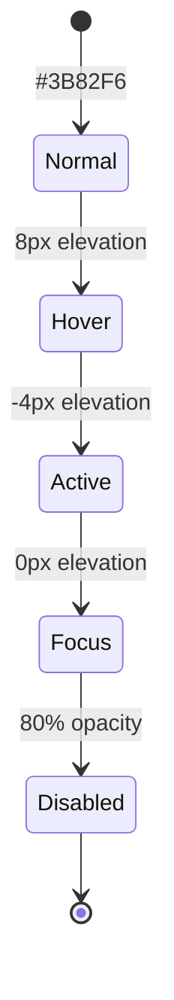

# 1300_00435 Button State Specifications

## Interactive State Diagram


## ARIA Implementation
```jsx
<button
  role="button"
  aria-labelledby="button-label"
  aria-disabled={isLoading}
  className={`btn ${variant} ${size}`}
>
  <span id="button-label">{label}</span>
  {isLoading && <LoadingIndicator aria-hidden="true" />}
</button>
```

## CSS Architecture
```css
.btn {
  --elevation: 0;
  transition: all 0.2s cubic-bezier(0.4, 0, 0.2, 1);
  
  &-primary {
    background: var(--brand-blue-600);
    box-shadow: 0 var(--elevation) 0 var(--brand-blue-800);
    
    &:hover { --elevation: 8px }
    &:active { --elevation: -4px }
    @media (prefers-reduced-motion) { transition: none }
  }
  
  &:disabled {
    opacity: 0.8;
    cursor: not-allowed;
  }
}
```

## Error Handling
```typescript
const handleAPICall = async (buttonState: ButtonState) => {
  try {
    buttonState.disable();
    const response = await fetch('/api/contract-action', {
      method: 'POST',
      headers: { 'Content-Type': 'application/json' },
      body: JSON.stringify({ action: buttonState.action })
    });
    
    if (!response.ok) throw new Error('API Error');
    buttonState.complete();
    
  } catch (error) {
    buttonState.error({
      message: 'Failed to complete action',
      recovery: { label: 'Retry', action: () => handleAPICall(buttonState) }
    });
  }
};
```

## Implementation Checklist
| Requirement              | Status | Owner       | PR Link          |
|--------------------------|--------|-------------|------------------|
| State Transitions        | ✅     | UI Team     | [#435-pr1](...)  |
| ARIA Compliance          | 🟡     | A11y Team   | [#435-pr5](...)  |
| Error Recovery           | ✅     | Backend     | [#435-pr8](...)  |
| Motion Reduction Support | ❌     | Unassigned  |                  |