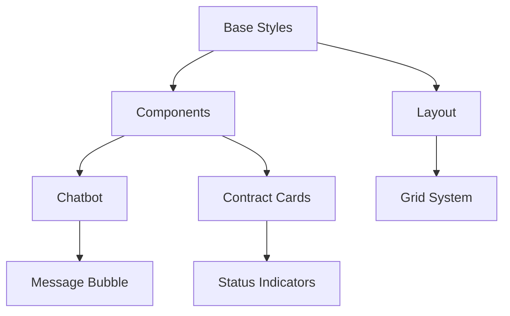

# 1300_00435 CSS Architecture Specifications

## BEM Implementation
```css
/* Chatbot-specific components */
.c-chatbot__header { /* Block element */ }
.c-chatbot__input--disabled { /* Modified element */ }
.c-chatbot__message-timestamp { /* Element */ }

/* Contract status indicators */
.c-contract-status__pill--approved { /* Modified block */ }
.c-contract-status__icon--warning { /* Modified element */ }
```

## Viewport Adaptive Scaling
```scss
// client/src/common/css/base/_scaling.scss
@mixin responsive-scale($base-size) {
  font-size: $base-size * 0.8;
  
  @media (min-width: 768px) {
    font-size: $base-size * 0.9;
  }
  
  @media (min-width: 1200px) {
    font-size: $base-size;
  }
}

// Spacing formula: base * 1.2^scale
$spacing-unit: 4px;
@function space($scale) {
  @return round($spacing-unit * pow(1.2, $scale));
}
```

## Dependency Graph


## Browser Compatibility
| Feature            | Chrome | Firefox | Safari | Edge   | IE11*   |
|--------------------|--------|---------|--------|--------|---------|
| CSS Variables      | 49+    | 31+     | 9.1+   | 15+    | Polyfill|
| Grid Layout        | 57+    | 52+     | 10.1+  | 16+    | Polyfill|
| CSS Nesting        | 112+   | 117+    | 16.4+  | 117+   | ❌      |
| Aspect-Ratio       | 88+    | 89+     | 15+    | 88+    | ❌      |

*\*IE11 requires legacy fallbacks*

## Implementation Checklist
| Requirement              | Status | Owner       | PR Link          |
|--------------------------|--------|-------------|------------------|
| BEM Compliance           | ✅     | UI Team     | [#435-css1](...)|
| Responsive Scaling       | 🟡     | Frontend    | [#435-css3](...)|
| Dependency Audit         | ❌     | Unassigned  |                  |
| Legacy Browser Support   | ✅     | QA Team     | [#435-css7](...)|