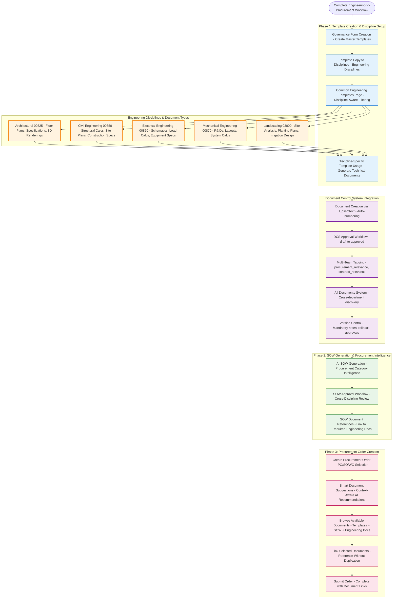
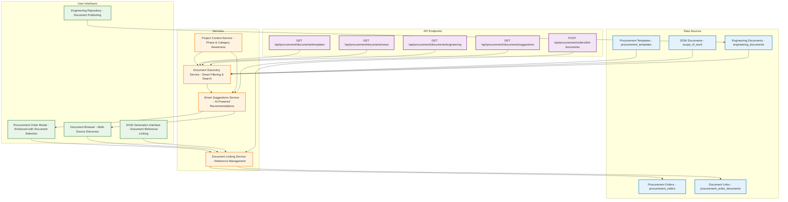
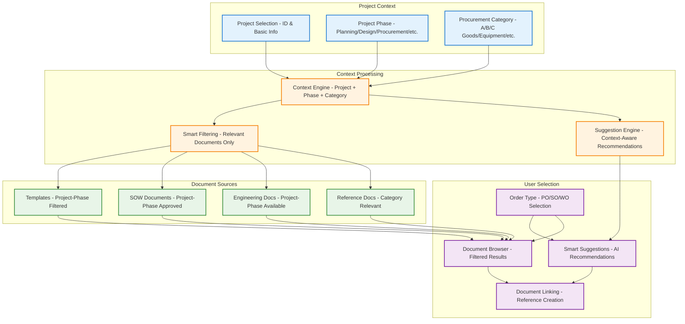
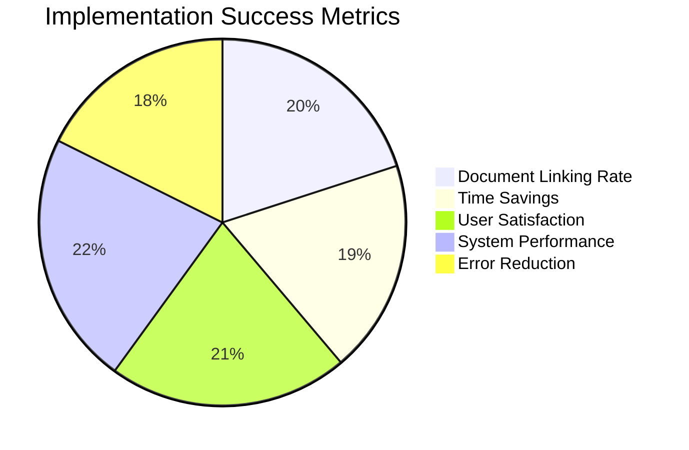

# 1300_01900_PROCUREMENT_ORDER_ENHANCEMENT_SYSTEM_WORKFLOW_MERMAID_DIAGRAM.md

## Status
- [x] Initial draft
- [x] Tech review completed
- [x] Approved for use
- [ ] Audit completed

## Version History
- v1.0 (2025-11-05): Complete workflow diagram for procurement order enhancement system

## Overview

This document provides a comprehensive Mermaid diagram illustrating the complete workflow of the Procurement Order Enhancement System, showing the integration between template creation, SOW generation, engineering document management, and procurement order creation with document discovery and linking.

## Comprehensive Engineering-to-Procurement Workflow Diagram



## Detailed Component Workflow

```mermaid
flowchart TD
    subgraph "Template Creation Flow"
        T1["Governance Form Creation - Master Template"]
        T2["Copy to Discipline Pages - Civil/Mechanical/Electrical"]
        T3["Engineering Template Usage - Generate Technical Documents"]
        T4["Document Repository Storage - Version Control & Approval"]
    end

    subgraph "SOW Integration Flow"
        S1["AI SOW Generation - Category-Based Intelligence"]
        S2["Cross-Discipline Approval - Technical & Procurement Review"]
        S3["Document Reference Linking - Specs/Drawings/Data Sheets"]
        S4["SOW Approval & Release - Ready for Procurement"]
    end

    subgraph "Procurement Order Flow"
        P1["Order Type Selection - PO/SO/WO with Context"]
        P2["Smart Suggestions Engine - Project/Phase/Category Aware"]
        P3["Document Discovery Browser - Multi-Source Search & Filter"]
        P4["Document Linking System - Reference Creation"]
        P5["Order Submission - Complete with Document Links"]
    end

    subgraph "Document Sources"
        D1["Procurement Templates - Approved Master Templates"]
        D2["SOW Documents - Approved Scope Documents"]
        D3["Engineering Documents - Specs/Data Sheets/Drawings"]
        D4["Reference Documents - Standards/Manuals/Certificates"]
    end

    subgraph "User Roles & Responsibilities"
        U1["Template Creator - Governance Team"]
        U2["Document Generator - Engineering Disciplines"]
        U3["Procurement Officer - Order Creation & Document Linking"]
        U4["Approver - Cross-Discipline Approval"]
    end

    subgraph "System Components"
        SYS1["Document Discovery Service - Smart Search & Filtering"]
        SYS2["Document Linking Engine - Reference Management"]
        SYS3["Suggestion Engine - AI-Powered Recommendations"]
        SYS4["Project Context Service - Phase & Category Awareness"]
    end

    T1 --> T2 --> T3 --> T4
    S1 --> S2 --> S3 --> S4
    P1 --> P2 --> P3 --> P4 --> P5

    D1 --> P3
    D2 --> P3
    D3 --> P3
    D4 --> P3

    U1 --> T1
    U2 --> T3
    U3 --> P1
    U4 --> S2

    SYS1 --> P3
    SYS2 --> P4
    SYS3 --> P2
    SYS4 --> P1

    classDef templateFlow fill:#e3f2fd,stroke:#1976d2,stroke-width:2px
    classDef sowFlow fill:#f3e5f5,stroke:#7b1fa2,stroke-width:2px
    classDef procurementFlow fill:#e8f5e8,stroke:#388e3c,stroke-width:2px
    classDef sources fill:#fff3e0,stroke:#f57c00,stroke-width:2px
    classDef roles fill:#fce4ec,stroke:#c2185b,stroke-width:2px
    classDef system fill:#f3e5f5,stroke:#7b1fa2,stroke-width:2px

    class T1,T2,T3,T4 templateFlow
    class S1,S2,S3,S4 sowFlow
    class P1,P2,P3,P4,P5 procurementFlow
    class D1,D2,D3,D4 sources
    class U1,U2,U3,U4 roles
    class SYS1,SYS2,SYS3,SYS4 system
```



## Cross-Discipline Document Flow

```mermaid
flowchart LR
    GOV["Governance 01300"] -->|"Create Master Templates"| DISC["Discipline Pages - Civil/Mech/Electrical"]
    DISC -->|"Use Templates"| ENG["Engineering Teams - Generate Documents"]
    ENG -->|"Store Documents"| REPO["Engineering Repository"]
    REPO -->|"Reference in"| SOW["SOW Generation - AI-Powered"]
    SOW -->|"Approval"| APPROVE["Cross-Discipline Approval"]
    APPROVE -->|"Documents Available"| PROC["Procurement Team - Order Creation"]
    REPO -->|"Direct Access"| PROC
    DISC -->|"Templates Available"| PROC
    PROC -->|"Browse & Link"| ORDER["Procurement Order with Document Links"]
    ORDER -->|"Submit"| FULFILL["Order Fulfillment - Document Access"]
    FULFILL -->|"Requirements Feedback"| GOV
    FULFILL -->|"Document Updates"| ENG

    classDef governance fill:#e3f2fd,stroke:#1976d2,stroke-width:2px
    classDef disciplines fill:#fff3e0,stroke:#f57c00,stroke-width:2px
    classDef engineering fill:#e8f5e8,stroke:#388e3c,stroke-width:2px
    classDef sow fill:#f3e5f5,stroke:#7b1fa2,stroke-width:2px
    classDef procurement fill:#fce4ec,stroke:#c2185b,stroke-width:2px
    classDef fulfillment fill:#e8f5e8,stroke:#2e7d32,stroke-width:2px

    class GOV governance
    class DISC disciplines
    class ENG,REPO engineering
    class SOW,APPROVE sow
    class PROC procurement
    class ORDER,FULFILL fulfillment
```



## Data Flow Architecture



## Project & Phase Context Flow



## Implementation Phases Timeline

```mermaid
gantt
    title Procurement Order Enhancement System Implementation
    dateFormat  YYYY-MM-DD
    section Phase 1: Core Integration
    Template & SOW Integration      :done, phase1_1, 2025-11-05, 2w
    Basic Document Dropdowns        :done, phase1_2, 2025-11-07, 1w
    Document Linking Infrastructure :active, phase1_3, 2025-11-08, 2w
    section Phase 2: Enhanced Discovery
    Document Browser Interface     :planned, phase2_1, 2025-11-15, 2w
    Smart Suggestions Engine       :planned, phase2_2, 2025-11-17, 2w
    Project/Phase Filtering        :planned, phase2_3, 2025-11-19, 2w
    section Phase 3: Engineering Integration
    Engineering Document Repository :planned, phase3_1, 2025-11-25, 2w
    Document Publishing Workflow    :planned, phase3_2, 2025-11-27, 2w
    Cross-Discipline Sharing       :planned, phase3_3, 2025-11-29, 3w
    section Phase 4: Optimization & Training
    Performance Optimization       :planned, phase4_1, 2025-12-05, 1w
    User Training & Documentation  :planned, phase4_2, 2025-12-06, 2w
    Final Testing & Deployment     :planned, phase4_3, 2025-12-08, 2w
```

## Key Integration Points

### Template System Integration
- **Source**: Governance Form Creation (01300)
- **Flow**: Master Template → Discipline Copy → Engineering Usage → Document Generation
- **Result**: Structured templates available for procurement order creation

### SOW System Integration
- **Source**: AI-Generated SOW with procurement requirements
- **Flow**: SOW Generation → Approval Workflow → Document References → Procurement Access
- **Result**: Approved SOWs with linked document requirements available for orders

### Engineering Document Integration
- **Source**: Discipline-specific document generation
- **Flow**: Template Usage → Document Creation → Repository Storage → Procurement Discovery
- **Result**: Engineering documents discoverable by procurement category and project phase

### Procurement Order Integration
- **Source**: Enhanced order creation modal
- **Flow**: Order Type Selection → Smart Suggestions → Document Discovery → Linking → Submission
- **Result**: Procurement orders with comprehensive document references

## Success Metrics Visualization



## Related Documentation

- [1300_01900_PROCUREMENT_ORDER_ENHANCEMENT_SYSTEM.md](./1300_01900_PROCUREMENT_ORDER_ENHANCEMENT_SYSTEM.md) - Complete system specification
- [1300_01900_PROCUREMENT_TEMPLATE_SYSTEM.md](./1300_01900_PROCUREMENT_TEMPLATE_SYSTEM.md) - Template system architecture
- [1300_01900_SCOPE_OF_WORK_GENERATION.md](./1300_01900_SCOPE_OF_WORK_GENERATION.md) - SOW generation system
- [1300_01300_GOVERNANCE.md](./1300_01300_GOVERNANCE.md) - Template creation workflow

## Status
- [x] ✅ High-level workflow diagram completed
- [x] ✅ Detailed component workflow documented
- [x] ✅ Cross-discipline document flow illustrated
- [x] ✅ Data flow architecture mapped
- [x] ✅ Project/phase context flow defined
- [x] ✅ Implementation timeline created
- [x] ✅ Integration points documented
- [x] ✅ Success metrics visualized

## Version History
- v1.0 (2025-11-05): Complete workflow diagrams for procurement order enhancement system
