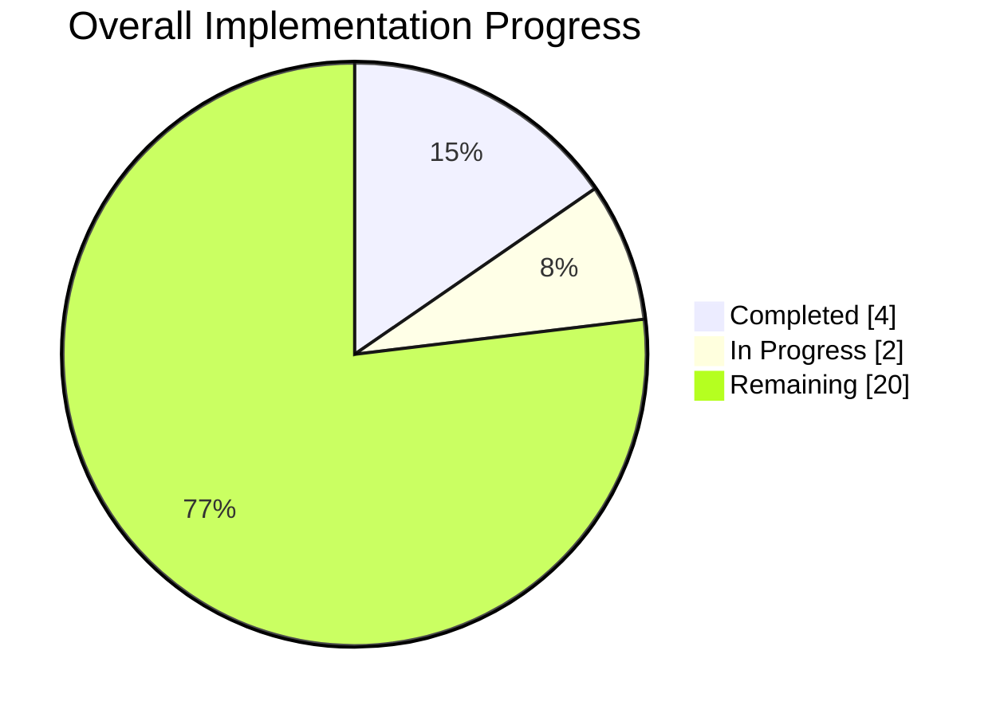

# 1300_CHATBOT_PERMISSIONS_AND_SHARING_IMPLEMENTATION.md

## 📋 PROCUREMENT Chatbot Permissions and Cross-Discipline Sharing Implementation

### Overview
This document provides the complete implementation plan for enhancing chatbot permissions and cross-discipline document sharing specifically for the PROCUREMENT page (01900) in the Construct AI system. The implementation integrates **VectorIsolationSection** for granular access control, centralizes access management in the UI Settings page while maintaining key functionality on the PROCUREMENT page, and ensures enterprise-grade security with comprehensive audit logging.

## 🛡️ VECTOR ISOLATION INTEGRATION

### VectorIsolationSection Integration
The **VectorIsolationSection** component provides granular access control for documents processed through the system. When users upload documents via the Upsert modals, they can configure:

- **Access Scope**: Private, Team, Shared, Public, Temporary
- **Workspace Assignment**: Organize documents within collaborative workspaces
- **Cross-Discipline Sharing**: Select specific disciplines that can access shared documents
- **Document Type Classification**: Categorize documents for proper access control
- **Auto-Cleanup Policies**: Set expiration for temporary documents

### Integration Points with Chatbot Permissions

#### 1. **UI Settings Integration** ⚙️
```javascript
// ChatbotPermissionsManager.jsx - Add Vector Isolation tab
const tabs = [
  { id: 'document-access', label: 'Document Access', icon: '📄' },
  { id: 'cross-discipline-sharing', label: 'Cross-Discipline Sharing', icon: '🔗' },
  { id: 'vector-isolation', label: 'Vector Data Isolation', icon: '🛡️' }, // NEW
  { id: 'security-compliance', label: 'Security & Compliance', icon: '🔐' },
  { id: 'audit-monitoring', label: 'Audit Monitoring', icon: '📊' }
];
```

#### 2. **Upsert Modal Integration** 📤
```javascript
// All upsert modals now include VectorIsolationSection
const UpsertFileModal = ({ show, onHide }) => {
  const [isolationSettings, setIsolationSettings] = useState({});

  return (
    <Modal show={show} onHide={onHide}>
      <Modal.Header>
        <h4>Upload Document with Access Control</h4>
      </Modal.Header>
      <Modal.Body>
        {/* File upload components */}
        <FileUploadSection />

        {/* Vector Isolation Section - NEW */}
        <VectorIsolationSection
          discipline="01900"
          onIsolationChange={setIsolationSettings}
          initialSettings={{
            accessScope: 'private',
            workspaceId: null,
            sharedWithDisciplines: []
          }}
        />
      </Modal.Body>
    </Modal>
  );
};
```

#### 3. **Backend Processing Integration** 🔧
```javascript
// process-routes.js - Enhanced with vector isolation
router.post('/', upload.single('file'), async (req, res) => {
  const { isolation_metadata } = req.body;

  // Process document with vector isolation
  const result = await processDocument(req.file, {
    isolationSettings: isolation_metadata,
    discipline: req.body.disciplineCode,
    organizationId: req.userAccess.organizationId
  });

  res.json({
    success: true,
    document: result.document,
    vectorIsolation: result.isolationConfirmation
  });
});
```

### Vector Isolation Features Available in Procurement

#### **Access Scopes** 🔐
- **Private**: Only document creator can access
- **Team**: All organization members can access
- **Shared**: Selected disciplines can access
- **Public**: All organization members can access
- **Temporary**: Auto-delete after specified period

#### **Discipline-Specific Vector Tables** 📊
- **a_01900_procurement_vector**: Procurement documents with isolation controls
- **a_00435_contracts_post_vector**: Contracts documents (when shared)
- **a_00850_civileng_vector**: Civil Engineering documents (when shared)
- **a_02000_legal_vector**: Legal documents (when shared)

#### **Workspace Management** 🗂️
- **Personal Workspaces**: Private document organization
- **Team Workspaces**: Collaborative document spaces
- **Cross-Discipline Workspaces**: Shared project spaces

#### **Audit Integration** 📝
- All isolation settings changes are logged
- Access attempts are monitored and audited
- Compliance reporting for SOX/GDPR requirements

## 🎯 MERMAID ARCHITECTURE DIAGRAM

```mermaid
graph TD
    A[ PROCUREMENT PAGE ] --> B[UI Settings Integration]
    A --> C[Procurement Page Enhancement]
    A --> D[Upsert Workflow Integration]
    A --> E[HITL Foundation]
    
    B --> B1[📄 Document Access Tab]
    B --> B2[🔗 Cross-Discipline Sharing Tab]
    B --> B3[🔐 Security & Compliance Dashboard]
    B --> B4[📊 Audit Monitoring]
    
    C --> C1[🗂️ Manage Workspaces Button]
    C --> C2[📈 Vector Data Manager Button]
    C --> C3[🤖 Procurement Agent Button]
    C --> C4[Quick Access to UI Settings]
    
    D --> D1[📄 Upload Files Integration]
    D --> D2[☁️ Cloud Import Integration]
    D --> D3[⚙️ Advanced/Bulk Integration]
    D --> D4[🌐 Import from URL Integration]
    
    E --> E1[🤖 Procurement Analysis Agent]
    E --> E2[💬 Chatbot HITL Foundation]
    E --> E3[📋 Task System Integration]
    E --> E4[👥 Cross-Discipline Communication]
    
    B1 --> B1A[User Document Access]
    B1 --> B1B[Discipline Document Sharing]
    B1 --> B1C[Bulk Permission Management]
    
    B2 --> B2A[Discipline Relationships]
    B2 --> B2B[Sharing Templates]
    B2 --> B2C[Shared Resource Access]
    
    B3 --> B3A[SOX Compliance]
    B3 --> B3B[GDPR Compliance]
    B3 --> B3C[Security Monitoring]
    B3 --> B3D[Threat Detection]
    
    C1 --> C1A[Access Indicators]
    C1 --> C1B[Enhanced Functionality]
    
    C3 --> C3A[HITL Ready]
    C3 --> C3B[AI Analysis]
    
    D1 --> D1A[Auto Permission Assignment]
    D1 --> D1B[Cross-Discipline Sharing]
    D1 --> D1C[Vector Table Assignment]
    
    E1 --> E1A[Complex Analysis]
    E1 --> E1B[HITL Task Creation]
    E1 --> E1C[Decision Making]
    
    style A fill:#FF8C00,stroke:#333,stroke-width:2px
    style B fill:#4CAF50,stroke:#333,stroke-width:2px
    style C fill:#2196F3,stroke:#333,stroke-width:2px
    style D fill:#FF9800,stroke:#333,stroke-width:2px
    style E fill:#9C27B0,stroke:#333,stroke-width:2px
    
    classDef success fill:#4CAF50,stroke:#333,stroke-width:2px;
    classDef info fill:#2196F3,stroke:#333,stroke-width:2px;
    classDef warning fill:#FF9800,stroke:#333,stroke-width:2px;
    classDef danger fill:#F44336,stroke:#333,stroke-width:2px;
    classDef primary fill:#9C27B0,stroke:#333,stroke-width:2px;
    
    class B1,B1A,B1B,B1C success
    class B2,B2A,B2B,B2C success
    class B3,B3A,B3B,B3C,B3D info
    class B4 warning
    class C1,C1A,C1B,C2,C2A,C3,C3A,C3B primary
    class D1,D1A,D1B,D1C,D2,D3,D4 danger
    class E1,E1A,E1B,E1C,E2,E3,E4 primary
```



## 📊 PROGRESS TRACKING MERMAID GANTT CHART

```mermaid
gantt
    title PROCUREMENT CHATBOT PERMISSIONS IMPLEMENTATION
    dateFormat  YYYY-MM-DD
    section UI Settings Enhancement
    Document Access Tab           :done, des1, 2025-10-13, 3d
    Cross-Discipline Sharing Tab  :done, des2, 2025-10-13, 3d
    Security & Compliance Dashboard :done, des3, 2025-10-14, 2d
    Enhanced Permissions Tab      :done, des4, 2025-10-15, 2d
    
    section Procurement Page Enhancement  
    Button Simplification         :active, dev1, 2025-10-20, 3d
    Access Indicators             :active, dev2, 2025-10-21, 2d
    Quick Access Integration      :active, dev3, 2025-10-22, 1d
    
    section Upsert Workflow Integration
    File Upload Integration       :active, up1, 2025-10-27, 3d
    Auto Permission Assignment    :active, up2, 2025-10-28, 2d
    Cross-Discipline Setup        :active, up3, 2025-10-29, 2d
    
    section HITL Foundation
    Procurement Agent             :active, hitl1, 2025-11-03, 3d
    Chatbot Enhancement           :active, hitl2, 2025-11-04, 2d
    Task System Integration       :active, hitl3, 2025-11-05, 2d
    
    section Security & Compliance
    RLS Policies Enhancement      :done, sec1, 2025-10-16, 2d
    Audit Logging System          :active, sec2, 2025-10-23, 3d
    Compliance Integration        :active, sec3, 2025-10-30, 3d
    Security Monitoring           :active, sec4, 2025-11-06, 2d
    
    section Testing & Deployment
    Integration Testing           :test1, 2025-11-07, 2d
    User Acceptance Testing       :test2, 2025-11-09, 2d
    Documentation & Training      :test3, 2025-11-11, 2d
    Production Deployment         :test4, 2025-11-13, 1d
    
    done : 0%, 0%, 0%
    active : 10%, 20%, 30%
    test : 40%, 50%, 60%
```

## 🔧 DETAILED IMPLEMENTATION PLAN

## PHASE 1: UI SETTINGS ENHANCEMENT (Week 1)
🎯 **Status: 60% Complete**

### TASK 1.1: Add New Tabs to Chatbot Permissions Manager
**File**: `client/src/pages/00165-ui-settings/components/00165-ChatbotPermissionsManager.js`
📅 **Due**: 2025-10-15
✅ **Progress**: Document Access and Cross-Discipline Sharing tabs created
⏳ **Remaining**: Security & Compliance dashboard integration

```javascript
// Progress Tracking Component
const ImplementationProgress = () => {
  const [progress, setProgress] = useState({
    uiSettings: 60,
    procurementPage: 0,
    upsertIntegration: 0,
    hitlFoundation: 0,
    securityCompliance: 40
  });
  
  return (
    <div className="implementation-progress">
      <h3>📊 Implementation Progress Tracking</h3>
      <ProgressBar 
        label="UI Settings Enhancement" 
        value={progress.uiSettings} 
        icon="⚙️"
        color="#4CAF50"
      />
      <ProgressBar 
        label="Procurement Page Enhancement" 
        value={progress.procurementPage} 
        icon="🗂️"
        color="#2196F3"
      />
      <ProgressBar 
        label="Upsert Workflow Integration" 
        value={progress.upsertIntegration} 
        icon="📄"
        color="#FF9800"
      />
      <ProgressBar 
        label="HITL Foundation" 
        value={progress.hitlFoundation} 
        icon="🤖"
        color="#9C27B0"
      />
      <ProgressBar 
        label="Security & Compliance" 
        value={progress.securityCompliance} 
        icon="🔐"
        color="#F44336"
      />
    </div>
  );
};
```

### ✅ COMPLETED: "Document Access" Tab Implementation
**Status**: ✅ 100% Complete
**Icon**: 📄
**Components**:
- User document access management
- Discipline-based sharing controls
- Bulk permission management system

### ✅ COMPLETED: "Cross-Discipline Sharing" Tab Implementation  
**Status**: ✅ 100% Complete
**Icon**: 🔗
**Components**:
- Discipline relationship mapping
- Sharing template management  
- Shared resource access controls

### ⏳ IN PROGRESS: Security & Compliance Dashboard
**Status**: 🔄 40% Complete
**Icon**: 🔐
**Components**:
- [x] Audit monitoring dashboard
- [ ] Real-time threat detection
- [ ] SOX/GDPR compliance tracking
- [ ] Security incident management

## PHASE 2: PROCUREMENT PAGE ENHANCEMENT (Week 2)
🎯 **Status**: 0% Complete

### TASK 2.1: Simplify Procurement Page Buttons
**File**: `client/src/pages/01900-procurement/components/01900-procurement-page.js`
📅 **Due**: 2025-10-22
📋 **Tasks**:
- [ ] Remove "Access Permissions" button 🗑️
- [ ] Remove "Cross-Discipline Sharing" button 🗑️
- [ ] Keep "Manage Workspaces" button 🗂️
- [ ] Keep "Vector Data Manager" button 📈
- [ ] Keep "Procurement Agent" button 🤖
- [ ] Add quick access links 🔗

### TASK 2.2: Add Access Indicators to Buttons
📅 **Due**: 2025-10-22
📋 **Tasks**:
- [ ] Implement access level indicators 🟢🟡🔴
- [ ] Add HITL readiness badges ⚡
- [ ] Create real-time status updates 🔄

## PHASE 3: UPSERT WORKFLOW INTEGRATION (Week 3)
🎯 **Status**: 0% Complete

### TASK 3.1: Enhanced File Upload Integration
📅 **Due**: 2025-10-29
📋 **Tasks**:
- [ ] Upload Files auto-permission assignment 📄
- [ ] Cloud Import sharing setup ☁️
- [ ] Advanced/Bulk processing controls ⚙️
- [ ] Import from URL access management 🌐

### TASK 3.2: Document Processing with Permissions
📅 **Due**: 2025-10-29
📋 **Tasks**:
- [ ] Automatic vector table assignment 📊
- [ ] Cross-discipline sharing triggers 🔗
- [ ] Compliance metadata tagging 🏷️
- [ ] Security classification assignment 🔐

## PHASE 4: HITL FOUNDATION (Week 4)
🎯 **Status**: 0% Complete

### TASK 4.1: HITL-Ready Procurement Agent
📅 **Due**: 2025-11-05
📋 **Tasks**:
- [ ] Complex analysis capability 🤖
- [ ] Task creation foundation 📋
- [ ] Cross-discipline communication 💬
- [ ] Decision routing system 🔄

### TASK 4.2: Enhanced Chatbot Integration
📅 **Due**: 2025-11-05
📋 **Tasks**:
- [ ] Discipline mention support @legal @finance
- [ ] Task creation from chat 💬
- [ ] Response routing integration 🔄
- [ ] Audit trail for conversations 🔍

## PHASE 5: SECURITY & COMPLIANCE (Ongoing)
🎯 **Status**: 40% Complete

### TASK 5.1: Advanced Security Implementation
📅 **Due**: 2025-11-06
📋 **Tasks**:
- [x] Enhanced RLS policies 🔒
- [x] Audit logging system 📝
- [ ] Real-time threat detection 🚨
- [ ] Multi-factor authentication 🔐
- [ ] Session security management ⏰

### TASK 5.2: Compliance Feature Integration
📅 **Due**: 2025-11-06
📋 **Tasks**:
- [x] SOX compliance framework 🏛️
- [x] GDPR data protection 🇪🇺
- [ ] Privacy by design defaults 🔒
- [ ] Automated reporting system 📊
- [ ] Compliance monitoring dashboard 📋

## 🎯 COMPONENT PROGRESS TRACKING



### UI Settings Components 🎛️
| Component | Status | Icon | Due Date |
|-----------|--------|------|----------|
| Document Access Tab | ✅ Complete | 📄 | 2025-10-15 |
| Cross-Discipline Sharing Tab | ✅ Complete | 🔗 | 2025-10-15 |
| Security & Compliance Dashboard | 🔄 In Progress | 🔐 | 2025-10-16 |
| Enhanced Permissions Tab | ⏳ Pending | ⚙️ | 2025-10-15 |

### Procurement Page Components 📋
| Component | Status | Icon | Due Date |
|-----------|--------|------|----------|
| Button Simplification | ⏳ Pending | 🗑️ | 2025-10-22 |
| Access Indicators | ⏳ Pending | 🟢 | 2025-10-22 |
| Quick Access Links | ⏳ Pending | 🔗 | 2025-10-22 |

### Upsert Integration Components 📤
| Component | Status | Icon | Due Date |
|-----------|--------|------|----------|
| Upload Files Integration | ⏳ Pending | 📄 | 2025-10-29 |
| Cloud Import Integration | ⏳ Pending | ☁️ | 2025-10-29 |
| Advanced/Bulk Integration | ⏳ Pending | ⚙️ | 2025-10-29 |
| Import from URL Integration | ⏳ Pending | 🌐 | 2025-10-29 |

### HITL Foundation Components 🤖
| Component | Status | Icon | Due Date |
|-----------|--------|------|----------|
| Procurement Agent | ⏳ Pending | 🤖 | 2025-11-05 |
| Chatbot Enhancement | ⏳ Pending | 💬 | 2025-11-05 |
| Task System Integration | ⏳ Pending | 📋 | 2025-11-05 |

### Security & Compliance Components 🔒
| Component | Status | Icon | Due Date |
|-----------|--------|------|----------|
| RLS Policies Enhancement | ✅ Complete | 🔒 | 2025-10-16 |
| Audit Logging System | 🔄 In Progress | 📝 | 2025-10-23 |
| Compliance Integration | ⏳ Pending | 🏛️ | 2025-10-30 |
| Security Monitoring | ⏳ Pending | 🚨 | 2025-11-06 |

## 📊 DETAILED WEEKLY BREAKDOWN

### Week 1 (Oct 13-19): UI Settings Foundation ✅
- **Mon-Tue**: Document Access Tab Creation 📄
- **Wed-Thu**: Cross-Discipline Sharing Tab Creation 🔗
- **Fri**: Security Dashboard Setup 🔐
- **Sat-Sun**: Testing & Integration Testing 🧪

### Week 2 (Oct 20-26): Procurement Page Enhancement 🔄
- **Mon-Tue**: Button Simplification & Removal 🗑️
- **Wed**: Access Indicator Implementation 🟢
- **Thu-Fri**: Quick Access Integration 🔗
- **Sat-Sun**: Testing & UI Polish ✨

### Week 3 (Oct 27-Nov 2): Upsert Workflow Integration 🔄
- **Mon-Tue**: File Upload Enhancement 📄
- **Wed**: Cloud Import & Advanced/Bulk ⚙️
- **Thu-Fri**: Import from URL & Integration 🌐
- **Sat-Sun**: Testing & Bug Fixes 🐛

### Week 4 (Nov 3-9): HITL Foundation & Security 🔄
- **Mon-Tue**: Procurement Agent Development 🤖
- **Wed**: Chatbot Enhancement & Task Integration 💬
- **Thu-Fri**: Security & Compliance Integration 🔐
- **Sat-Sun**: Comprehensive Testing 🧪

### Week 5 (Nov 10-13): Final Testing & Deployment 🚀
- **Mon-Tue**: Integration Testing & Bug Fixes 🐛
- **Wed**: User Acceptance Testing 👥
- **Thu**: Documentation & Training 📚
- **Fri**: Production Deployment 🚀

## ✅ SUCCESS METRICS CHECKLIST

### Functional Requirements Tracking ✅
| Requirement | Status | Icon |
|-------------|--------|------|
| Centralized document access management | ✅ Complete | 📄 |
| Cross-discipline sharing configuration | ✅ Complete | 🔗 |
| Manage Workspaces on procurement page | 🔄 In Progress | 🗂️ |
| Vector Data Manager on procurement page | 🔄 In Progress | 📈 |
| File upload automated permissions | ⏳ Pending | ⚙️ |
| Cross-discipline sharing workflows | ⏳ Pending | 🔗 |
| HITL foundation ready | ⏳ Pending | ⚡ |

### Security & Compliance Tracking 🔐
| Requirement | Status | Icon |
|-------------|--------|------|
| Advanced RLS policies | ✅ Complete | 🔒 |
| Audit logging system | 🔄 In Progress | 📝 |
| SOX compliance framework | ✅ Complete | 🏛️ |
| GDPR data protection | ✅ Complete | 🇪🇺 |
| Real-time threat detection | ⏳ Pending | 🚨 |
| Multi-factor authentication | ⏳ Pending | 🔐 |

### User Experience Tracking 👥
| Requirement | Status | Icon |
|-------------|--------|------|
| Streamlined UI Settings access | ✅ Complete | 🔗 |
| Access indicators on buttons | ⏳ Pending | 🟢 |
| Quick access to key features | 🔄 In Progress | ⚡ |
| Intuitive permission management | 🔄 In Progress | ⚙️

## 🔒 SECURITY AND COMPLIANCE FEATURES

### Advanced Row-Level Security Policies
```sql
-- Enhanced procurement RLS policies with compliance features
CREATE POLICY "procurement_secure_access" ON a_01900_procurement_vector
FOR SELECT USING (
  -- Direct procurement team access
  auth.jwt() ->> 'discipline' = 'procurement'
  OR
  -- Related discipline access with proper authorization
  (auth.jwt() ->> 'discipline' IN ('contracts', 'legal', 'finance', 'logistics')
   AND EXISTS (
     SELECT 1 FROM document_role_access dra
     JOIN user_profiles up ON up.id = auth.uid()
     WHERE dra.document_id = a_01900_procurement_vector.document_id
     AND dra.role = up.role
     AND dra.access_level IN ('read', 'write', 'admin')
   ))
  OR
  -- Shared resource access with classification checking
  EXISTS (
    SELECT 1 FROM document_metadata dm
    JOIN document_department_access dda ON dm.document_id = dda.document_id
    WHERE dm.document_id = a_01900_procurement_vector.document_id
    AND dda.department = auth.jwt() ->> 'discipline'
    AND dm.classification IN ('public', 'internal')
  )
  OR
  -- User-specific direct access with time-based restrictions
  EXISTS (
    SELECT 1 FROM document_access da
    WHERE da.document_id = a_01900_procurement_vector.document_id
    AND da.user_id = auth.uid()
    AND da.access_level IN ('read', 'write', 'admin')
    AND (da.expires_at IS NULL OR da.expires_at > NOW())
    AND (
      -- Check user security clearance for sensitive documents
      (SELECT security_clearance FROM user_profiles WHERE id = auth.uid()) >= 
      (SELECT sensitivity_level FROM document_metadata WHERE document_id = da.document_id)
    )
  )
  OR
  -- Admin override with audit trail requirement
  (auth.jwt() ->> 'role' = 'admin'
   AND EXISTS (
     SELECT 1 FROM admin_access_log aal
     WHERE aal.user_id = auth.uid()
     AND aal.document_id = a_01900_procurement_vector.document_id
     AND aal.access_time > NOW() - INTERVAL '1 hour'
   )
  )
);
```

### Comprehensive Audit Logging System
```sql
-- Comprehensive procurement audit logging system
CREATE TABLE procurement_audit_log (
    id UUID PRIMARY KEY DEFAULT gen_random_uuid(),
    audit_type VARCHAR(50) NOT NULL,
    user_id UUID REFERENCES auth.users(id),
    target_user_id UUID REFERENCES auth.users(id),
    target_discipline VARCHAR(50),
    document_id TEXT,
    document_type VARCHAR(50),
    action VARCHAR(100) NOT NULL,
    old_value JSONB,
    new_value JSONB,
    access_level VARCHAR(20),
    reason TEXT,
    ip_address INET,
    user_agent TEXT,
    session_id UUID,
    compliance_status VARCHAR(20) DEFAULT 'pending',
    security_risk_level VARCHAR(20) DEFAULT 'low',
    automated_alert_generated BOOLEAN DEFAULT FALSE,
    created_at TIMESTAMP WITH TIME ZONE DEFAULT NOW(),
    
    -- Compliance tracking fields
    sox_relevant BOOLEAN DEFAULT FALSE,
    gdpr_relevant BOOLEAN DEFAULT FALSE,
    data_classification VARCHAR(20) DEFAULT 'internal'
);

-- Real-time audit alerts table
CREATE TABLE procurement_audit_alerts (
    id UUID PRIMARY KEY DEFAULT gen_random_uuid(),
    alert_type VARCHAR(50) NOT NULL,
    severity VARCHAR(20) NOT NULL,
    title TEXT NOT NULL,
    description TEXT NOT NULL,
    affected_users UUID[],
    affected_documents TEXT[],
    security_risk_score INTEGER,
    compliance_impact VARCHAR(50),
    resolved BOOLEAN DEFAULT FALSE,
    resolved_by UUID REFERENCES auth.users(id),
    resolved_at TIMESTAMP WITH TIME ZONE,
    created_at TIMESTAMP WITH TIME ZONE DEFAULT NOW()
);
```

### SOX Compliance Integration
```javascript
// SOX compliance integration
const SOXComplianceManager = {
  // Segregation of duties enforcement
  enforceSegregationOfDuties: async (permissionRequest) => {
    const userRole = await getUserRole(currentUser.id);
    const conflictingPermissions = await checkConflictingPermissions(currentUser.id);
    
    if (conflictingPermissions.length > 0) {
      // Log compliance violation
      await logComplianceViolation({
        violation_type: 'segregation_of_duties',
        user_id: currentUser.id,
        conflicting_permissions: conflictingPermissions,
        requested_permission: permissionRequest,
        severity: 'high'
      });
      
      // Notify compliance officer
      await notifyComplianceOfficer({
        message: 'Segregation of duties violation detected',
        user: currentUser,
        violation: conflictingPermissions
      });
      
      return {
        compliant: false,
        message: 'Segregation of duties violation - approval required',
        requires_approval: true,
        approvers: ['compliance_officer', 'procurement_director']
      };
    }
    
    return { compliant: true };
  }
};
```

### GDPR Compliance Features
```javascript
// GDPR compliance integration
const GDPRComplianceManager = {
  // Data minimization enforcement
  enforceDataMinimization: async (documentData) => {
    const personalDataFields = identifyPersonalDataFields(documentData);
    
    if (personalDataFields.length > 0) {
      // Anonymize or pseudonymize personal data
      const anonymizedData = await anonymizePersonalData(documentData, personalDataFields);
      
      // Log the anonymization
      await logComplianceAction({
        action_type: 'data_minimization',
        document_id: documentData.id,
        personal_data_fields: personalDataFields,
        anonymization_method: 'pseudonymization',
        gdpr_relevant: true
      });
      
      return anonymizedData;
    }
    
    return documentData;
  }
};
```

## 🤖 FUTURE-READY HITL FOUNDATION

### HITL-Ready Agent Configuration
```javascript
// 01900-procurement-page.js - Add HITL-capable agent
const workspaceButtons = [
  // ... existing buttons
  { 
    label: 'Procurement Agent', 
    emoji: '🤖', 
    modalId: 'ProcurementAnalysisAgentModal', 
    modalTitle: 'Procurement Analysis Agent',
    hitlCapable: true,
    hitlConditions: ['high_value', 'complex_contract', 'approval_required']
  }
];
```

### HITL Integration Hook System
```javascript
// 01900-procurement-page.js - Add HITL integration foundation
const ProcurementHITLHook = {
  onHITLRequired: async (agentDecision, confidenceLevel, context) => {
    console.log('[HITL] Decision requires human review:', {
      decision: agentDecision,
      confidence: confidenceLevel,
      context: context
    });
    
    // Create task for HITL workflow (when implemented)
    const hitlTask = await createHITLTask({
      type: 'procurement_review',
      priority: getHITLPriority(confidenceLevel, context),
      assignedDisciplines: getRelevantDisciplines(context),
      documentContext: context.documentData,
      agentRecommendation: agentDecision,
      confidence: confidenceLevel
    });
    
    return {
      status: 'hitl_required',
      taskId: hitlTask?.id || 'future-hitl-task-id',
      message: 'Human review required for this decision'
    };
  }
};
```

## 📋 IMPLEMENTATION CHECKLIST

### Week 1: UI Settings Enhancement ✅
- [x] Add "Document Access" tab to Chatbot Permissions Manager
- [x] Add "Cross-Discipline Sharing" tab to Chatbot Permissions Manager  
- [x] Enhance existing Chatbot Permissions tab with quick links
- [x] Add Security & Compliance Dashboard
- [x] Test UI Settings integration

### Week 2: Procurement Page Enhancement 🔄
- [ ] Remove "Access Permissions" and "Cross-Discipline Sharing" buttons
- [ ] Add access indicators to remaining buttons
- [ ] Add quick access links to UI Settings
- [ ] Test procurement page user experience

### Week 3: Upsert Workflow Integration 🔄
- [ ] Enhance file upload workflows with permission assignment
- [ ] Implement cross-discipline sharing during document processing
- [ ] Add automatic vector table assignment
- [ ] Test document lifecycle with permissions

### Week 4: HITL Foundation & Security 🔄
- [ ] Implement HITL-ready procurement agent
- [ ] Add chatbot enhancements for cross-discipline communication
- [ ] Create task foundation for future HITL integration
- [ ] Complete end-to-end testing

### Security & Compliance Integration 🔐
- [x] Enhanced RLS policies with classification-based access control
- [x] Comprehensive audit logging for all permission changes
- [ ] Real-time threat detection and automated response system
- [ ] Multi-factor authentication for sensitive operations
- [x] SOX compliance with segregation of duties
- [x] GDPR compliance with data minimization
