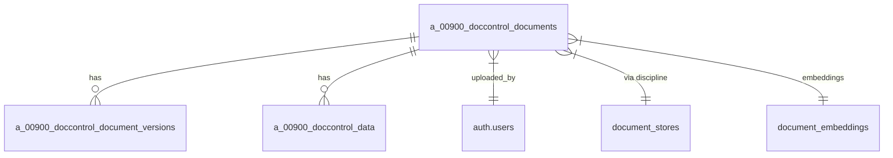

# Document Tables Reference (0900)

## Table of Contents
- [Core Document Tables](#core-document-tables)
  - [a_00900_doccontrol_documents](#a_00900_doccontrol_documents)
  - [a_00900_doccontrol_document_versions](#a_00900_doccontrol_document_versions)
  - [a_00900_doccontrol_data](#a_00900_doccontrol_data)
- [Supporting Tables](#supporting-tables)
  - [document_stores](#document_stores)
  - [document_embeddings](#document_embeddings)
  - [a_00900_doccontrol_vector](#a_00900_doccontrol_vector)
  - [document_number_audit_log](#document_number_audit_log)
  - [document_numbering_methodologies](#document_numbering_methodologies)
  - [document_numbering_sequencesV](#document_numbering_sequencesv)
  - [document_types_by_discipline](#document_types_by_discipline)
  - [flowise_documents](#flowise_documents)
  - [flowise_documents_with_stores](#flowise_documents_with_stores)
  - [flowise_record_manager](#flowise_record_manager)
  - [record_manager](#record_manager)
  - [consolidated_documents](#consolidated_documents)
- [Relationships Diagram](#relationships-diagram)
- [Common Operations](#common-operations)
  - [Document Upload Flow](#document-upload-flow)
  - [Version Control](#version-control)
  - [Document Retrieval](#document-retrieval)
- [Security Model](#security-model)
- [Maintenance](#maintenance)

## Overview
This document details the Supabase tables specifically handling document management and their relationships.

## Core Document Tables

### a_00900_doccontrol_documents
```sql
CREATE TABLE a_00900_doccontrol_documents (
    id UUID PRIMARY KEY DEFAULT gen_random_uuid(),
    file_path TEXT NOT NULL,
    file_name TEXT NOT NULL,
    file_extension TEXT,
    uploaded_by UUID REFERENCES auth.users (id),
    uploaded_at TIMESTAMP WITH TIME ZONE DEFAULT CURRENT_TIMESTAMP,
    discipline TEXT NOT NULL,
    page_number TEXT NOT NULL,
    created_at TIMESTAMP WITH TIME ZONE DEFAULT CURRENT_TIMESTAMP,
    updated_at TIMESTAMP WITH TIME ZONE DEFAULT CURRENT_TIMESTAMP,
    status TEXT DEFAULT 'draft',
    metadata_table_id UUID
);
```
**Purpose**: Main table storing all document metadata  
**Key Fields**:
- `discipline`: Links to discipline (e.g. "Construction")
- `page_number`: Associated module/page
- `status`: Document lifecycle state

### a_00900_doccontrol_document_versions
```sql
CREATE TABLE a_00900_doccontrol_document_versions (
    id UUID PRIMARY KEY DEFAULT gen_random_uuid(),
    document_id UUID NOT NULL REFERENCES a_00900_doccontrol_documents (id),
    version_number INTEGER NOT NULL,
    file_path TEXT NOT NULL,
    uploaded_at TIMESTAMP WITH TIME ZONE DEFAULT CURRENT_TIMESTAMP,
    uploaded_by UUID REFERENCES auth.users (id),
    changes_summary TEXT
);
```
**Purpose**: Tracks document version history  
**Relationships**:
- `document_id` → a_00900_doccontrol_documents.id

### a_00900_doccontrol_data
```sql
CREATE TABLE a_00900_doccontrol_data (
    id UUID PRIMARY KEY DEFAULT gen_random_uuid(),
    document_id UUID NOT NULL REFERENCES a_00900_doccontrol_documents (id),
    transmittal_number TEXT,
    revision_code TEXT
);
```
**Purpose**: Stores discipline-specific metadata for Document Control  
**Note**: Other disciplines have similar a_[page]_[discipline]_data tables

## Supporting Tables

### document_stores
```sql
CREATE TABLE document_stores (
    id UUID PRIMARY KEY,
    name TEXT NOT NULL,
    flowise_store_id TEXT,
    is_active BOOLEAN DEFAULT true
);
```
**Purpose**: Maps Flowise document stores to disciplines

### document_embeddings
```sql
CREATE TABLE document_embeddings (
    id UUID PRIMARY KEY,
    document_id UUID REFERENCES a_00900_doccontrol_documents(id),
    embedding_vector vector(1536),
    chunk_text TEXT,
    metadata JSONB
);
```
**Purpose**: Stores AI embeddings for document search

### a_00900_doccontrol_vector
```sql
CREATE TABLE a_00900_doccontrol_vector (
    id UUID PRIMARY KEY,
    document_id UUID REFERENCES a_00900_doccontrol_documents(id),
    vector_data vector(1536),
    created_at TIMESTAMP WITH TIME ZONE DEFAULT NOW()
);
```
**Purpose**: Legacy vector storage (being migrated to document_embeddings)

### document_number_audit_log
```sql
CREATE TABLE document_number_audit_log (
    id UUID PRIMARY KEY,
    document_id UUID REFERENCES a_00900_doccontrol_documents(id),
    old_number TEXT,
    new_number TEXT,
    changed_by UUID REFERENCES auth.users(id),
    changed_at TIMESTAMP WITH TIME ZONE DEFAULT NOW()
);
```
**Purpose**: Tracks document numbering changes

### document_numbering_methodologies
```sql
CREATE TABLE document_numbering_methodologies (
    id UUID PRIMARY KEY,
    methodology_name TEXT NOT NULL,
    pattern TEXT NOT NULL,
    discipline TEXT,
    is_active BOOLEAN DEFAULT true
);
```
**Purpose**: Defines document numbering patterns by discipline

### document_numbering_sequencesV
```sql
CREATE TABLE document_numbering_sequencesV (
    id UUID PRIMARY KEY,
    prefix TEXT NOT NULL,
    current_sequence INTEGER DEFAULT 1,
    last_used TIMESTAMP WITH TIME ZONE
);
```
**Purpose**: Maintains sequential numbering counters

### document_types_by_discipline
```sql
CREATE TABLE document_types_by_discipline (
    id UUID PRIMARY KEY,
    discipline TEXT NOT NULL,
    document_type TEXT NOT NULL,
    is_active BOOLEAN DEFAULT true
);
```
**Purpose**: Maps allowed document types to disciplines

### flowise_documents
```sql
CREATE TABLE flowise_documents (
    id UUID PRIMARY KEY,
    flowise_id TEXT NOT NULL,
    document_id UUID REFERENCES a_00900_doccontrol_documents(id),
    store_id UUID REFERENCES document_stores(id),
    created_at TIMESTAMP WITH TIME ZONE DEFAULT NOW()
);
```
**Purpose**: Tracks documents in Flowise stores

### flowise_documents_with_stores
```sql
CREATE VIEW flowise_documents_with_stores AS
SELECT fd.*, ds.name as store_name
FROM flowise_documents fd
JOIN document_stores ds ON fd.store_id = ds.id;
```
**Purpose**: Combined view of Flowise documents with store info

### flowise_record_manager
```sql
CREATE TABLE flowise_record_manager (
    id UUID PRIMARY KEY,
    document_id UUID REFERENCES a_00900_doccontrol_documents(id),
    flowise_record_id TEXT NOT NULL,
    status TEXT DEFAULT 'active',
    last_sync TIMESTAMP WITH TIME ZONE
);
```
**Purpose**: Manages Flowise document sync status

### record_manager
```sql
CREATE TABLE record_manager (
    id UUID PRIMARY KEY,
    document_id UUID REFERENCES a_00900_doccontrol_documents(id),
    external_system TEXT,
    external_id TEXT,
    sync_status TEXT
);
```
**Purpose**: General record synchronization tracking

### consolidated_documents
```sql
CREATE VIEW consolidated_documents AS
SELECT d.*, v.file_path as current_version_path
FROM a_00900_doccontrol_documents d
JOIN a_00900_doccontrol_document_versions v ON d.id = v.document_id
WHERE v.version_number = (
    SELECT MAX(version_number) 
    FROM a_00900_doccontrol_document_versions 
    WHERE document_id = d.id
);
```
**Purpose**: Unified view of documents with latest versions

## Relationships Diagram



## Common Operations

### Document Upload Flow
1. File stored in Supabase Storage
2. Metadata written to a_00900_doccontrol_documents
3. Version record created in a_00900_doccontrol_document_versions
4. Discipline-specific metadata added to corresponding _data table

### Version Control
```sql
-- Get all versions for a document
SELECT * FROM a_00900_doccontrol_document_versions
WHERE document_id = '[DOCUMENT_ID]'
ORDER BY version_number DESC;
```

### Document Retrieval
```sql
-- Get document with latest version
SELECT d.*, v.file_path as current_version_path
FROM a_00900_doccontrol_documents d
JOIN a_00900_doccontrol_document_versions v ON d.id = v.document_id
WHERE v.version_number = (
    SELECT MAX(version_number) 
    FROM a_00900_doccontrol_document_versions 
    WHERE document_id = d.id
);
```

## Security Model
- RLS policies enforce:
  - Discipline-based access control
  - Role-based permissions
  - Company isolation

## Maintenance
- Regular vacuuming recommended for version tables
- Consider partitioning for large document sets
