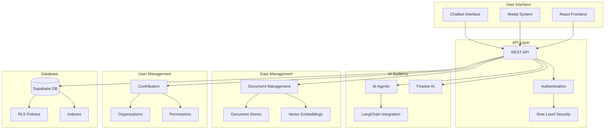

# System Integration Overview

This document provides a comprehensive overview of how all system components integrate together, including data flow, API interactions, and cross-system relationships.

## Overview

The EPCM platform integrates multiple sophisticated systems including AI agents, document management, chatbots, user management, and multi-organization support. This document explains how these systems work together to provide a cohesive platform experience.

## System Architecture Diagram



## Data Flow Architecture

### 1. User Authentication Flow
```
User → React Frontend → REST API → Authentication → JWT Token → Row Level Security → Database
```

### 2. Document Processing Flow
```
Upload → Document Management → Document Stores → Vector Embeddings → Flowise AI → Chatbot Interface
```

### 3. Agent Execution Flow
```
User Request → Modal System → AI Agents → LangChain/Flowise → Response → User Interface
```

## Integration Points

### 1. Frontend-Backend Integration

#### API Endpoints Structure
```
/api/
├── auth/
│   ├── login
│   ├── logout
│   ├── refresh
│   └── permissions
├── agents/
│   ├── execute
│   ├── status
│   └── results
├── documents/
│   ├── upload
│   ├── search
│   ├── analyze
│   └── download
├── chatbot/
│   ├── init
│   ├── message
│   └── history
├── pages/
│   ├── config
│   ├── agents
│   └── documents
└── organizations/
    ├── users
    ├── settings
    └── analytics
```

#### Frontend Integration Patterns
```javascript
// React Hook for agent execution
const useAgentExecution = (pagePrefix, agentId) => {
  const executeAgent = async (input) => {
    const response = await fetch(`/api/agents/execute`, {
      method: 'POST',
      headers: {
        'Authorization': `Bearer ${token}`,
        'Content-Type': 'application/json'
      },
      body: JSON.stringify({ pagePrefix, agentId, input })
    });
    return response.json();
  };
  return { executeAgent };
};

// Document upload integration
const useDocumentUpload = (storeId) => {
  const uploadDocument = async (file) => {
    const formData = new FormData();
    formData.append('file', file);
    formData.append('store_id', storeId);
    
    const response = await fetch('/api/documents/upload', {
      method: 'POST',
      headers: { 'Authorization': `Bearer ${token}` },
      body: formData
    });
    return response.json();
  };
  return { uploadDocument };
};
```

### 2. AI System Integration

#### LangChain Integration
```javascript
// LangChain agent configuration
const langchainConfig = {
  model: 'gpt-4',
  temperature: 0.7,
  maxTokens: 2000,
  tools: [
    'document-search',
    'contract-analysis',
    'financial-calculation'
  ]
};

// Agent execution pipeline
const executeLangChainAgent = async (agentConfig, input) => {
  const chain = new LLMChain({
    llm: new OpenAI(langchainConfig),
    prompt: PromptTemplate.fromTemplate(agentConfig.prompt)
  });
  
  return await chain.call({ input });
};
```

#### Flowise Integration
```javascript
// Flowise API integration
const flowiseAPI = {
  baseURL: process.env.FLOWISE_API_URL,
  
  async uploadDocument(storeId, file) {
    const response = await fetch(`${this.baseURL}/api/v1/document/upload`, {
      method: 'POST',
      headers: { 'Authorization': `Bearer ${flowiseToken}` },
      body: formData
    });
    return response.json();
  },
  
  async chatWithDocuments(storeId, message, documentIds) {
    const response = await fetch(`${this.baseURL}/api/v1/chat`, {
      method: 'POST',
      headers: { 'Content-Type': 'application/json' },
      body: JSON.stringify({
        storeId,
        message,
        documentIds
      })
    });
    return response.json();
  }
};
```

### 3. Document Management Integration

#### Storage Integration
```javascript
// Supabase Storage integration
const storageIntegration = {
  async uploadToSupabase(file, path) {
    const { data, error } = await supabase.storage
      .from('documents')
      .upload(path, file);
    
    if (error) throw error;
    return data;
  },
  
  async getPublicUrl(filePath) {
    const { data } = supabase.storage
      .from('documents')
      .getPublicUrl(filePath);
    return data.publicUrl;
  }
};

// Document processing pipeline
const processDocument = async (file, storeId) => {
  // 1. Upload to storage
  const storagePath = await storageIntegration.uploadToSupabase(file, storeId);
  
  // 2. Register in database
  const documentRecord = await createDocumentRecord({
    store_id: storeId,
    document_name: file.name,
    file_name: storagePath,
    mime_type: file.type
  });
  
  // 3. Process with Flowise
  const flowiseDoc = await flowiseAPI.uploadDocument(storeId, file);
  
  // 4. Update embedding status
  await updateDocumentEmbedding(documentRecord.id, flowiseDoc.id);
  
  return documentRecord;
};
```

### 4. User Management Integration

#### Authentication Flow
```javascript
// JWT token management
const authManager = {
  async login(email, password) {
    const { data, error } = await supabase.auth.signInWithPassword({
      email,
      password
    });
    
    if (error) throw error;
    return data.session;
  },
  
  async refreshToken(refreshToken) {
    const { data, error } = await supabase.auth.refreshSession({
      refresh_token: refreshToken
    });
    
    if (error) throw error;
    return data.session;
  },
  
  async getUserPermissions(userId) {
    const { data } = await supabase
      .from('contributors')
      .select('role, organization_id')
      .eq('id', userId)
      .single();
    
    return data;
  }
};
```

#### Permission Integration
```javascript
// Role-based access control
const permissionChecker = {
  canAccessPage(user, pagePrefix) {
    return user.role === 'admin' || 
           user.assignedPages.includes(pagePrefix);
  },
  
  canExecuteAgent(user, agentId) {
    return user.role === 'admin' || 
           user.role === 'editor';
  },
  
  canUploadDocuments(user, storeId) {
    return user.role !== 'viewer';
  }
};
```

## Cross-System Data Flow

### 1. Page Initialization Flow
```
User Access → Authentication Check → Page Configuration → Load Agents → Load Modals → Initialize Document Store
```

### 2. Agent Execution Flow
```
User Input → Modal Trigger → Agent Selection → Input Validation → AI Processing → Response Formatting → UI Update
```

### 3. Document Processing Flow
```
File Upload → Storage Upload → Database Record → Flowise Processing → Embedding Generation → Search Index Update
```

### 4. Chatbot Interaction Flow
```
User Query → Document Retrieval → Context Assembly → AI Processing → Response Generation → Source Attribution
```

## API Integration Patterns

### 1. RESTful API Design
```javascript
// Standard API response format
const apiResponse = {
  success: true,
  data: { ... },
  message: 'Operation completed successfully',
  timestamp: new Date().toISOString()
};

// Error response format
const errorResponse = {
  success: false,
  error: 'VALIDATION_ERROR',
  message: 'Invalid input parameters',
  details: { ... }
};
```

### 2. WebSocket Integration (Future)
```javascript
// Real-time updates
const websocketIntegration = {
  connect() {
    this.ws = new WebSocket('wss://api.example.com/ws');
    
    this.ws.onmessage = (event) => {
      const data = JSON.parse(event.data);
      this.handleRealtimeUpdate(data);
    };
  },
  
  handleRealtimeUpdate(data) {
    switch (data.type) {
      case 'agent_status':
        updateAgentStatus(data.payload);
        break;
      case 'document_processed':
        refreshDocumentList(data.payload);
        break;
    }
  }
};
```

## Error Handling and Recovery

### 1. System-Wide Error Handling
```javascript
// Global error handler
const errorHandler = {
  async handleAPIError(error) {
    if (error.response?.status === 401) {
      await authManager.refreshToken();
      return 'retry';
    }
    
    if (error.response?.status === 429) {
      await this.delay(1000);
      return 'retry';
    }
    
    return 'display_error';
  },
  
  async handleAIError(error) {
    if (error.type === 'RATE_LIMIT') {
      return this.queueRequest(error.request);
    }
    
    if (error.type === 'TIMEOUT') {
      return this.retryWithBackoff(error.request);
    }
    
    return this.fallbackToOffline(error.request);
  }
};
```

### 2. Data Consistency
```javascript
// Transaction management
const transactionManager = {
  async executeInTransaction(operations) {
    const client = await supabase.rpc('begin_transaction');
    
    try {
      for (const operation of operations) {
        await operation.execute(client);
      }
      
      await supabase.rpc('commit_transaction');
    } catch (error) {
      await supabase.rpc('rollback_transaction');
      throw error;
    }
  }
};
```

## Monitoring and Observability

### 1. System Health Checks
```javascript
// Health check endpoints
const healthChecks = {
  async checkDatabase() {
    const { error } = await supabase.rpc('health_check');
    return { service: 'database', healthy: !error };
  },
  
  async checkAIAgents() {
    const response = await fetch('/api/agents/health');
    return { service: 'ai_agents', healthy: response.ok };
  },
  
  async checkDocumentProcessing() {
    const response = await fetch('/api/documents/health');
    return { service: 'documents', healthy: response.ok };
  }
};
```

### 2. Performance Monitoring
```javascript
// Performance tracking
const performanceMonitor = {
  trackAPICall(endpoint, duration, success) {
    analytics.track('api_call', {
      endpoint,
      duration,
      success,
      timestamp: new Date().toISOString()
    });
  },
  
  trackAgentExecution(agentId, duration, success) {
    analytics.track('agent_execution', {
      agentId,
      duration,
      success,
      timestamp: new Date().toISOString()
    });
  }
};
```

## Security Integration

### 1. End-to-End Security
```javascript
// Security headers
const securityHeaders = {
  'Content-Security-Policy': "default-src 'self'",
  'X-Content-Type-Options': 'nosniff',
  'X-Frame-Options': 'DENY',
  'X-XSS-Protection': '1; mode=block',
  'Strict-Transport-Security': 'max-age=31536000; includeSubDomains'
};

// Input validation
const inputValidator = {
  validateDocumentUpload(file) {
    const allowedTypes = ['application/pdf', 'text/plain', 'application/msword'];
    const maxSize = 10 * 1024 * 1024; // 10MB
    
    if (!allowedTypes.includes(file.type)) {
      throw new Error('Invalid file type');
    }
    
    if (file.size > maxSize) {
      throw new Error('File too large');
    }
    
    return true;
  }
};
```

## Scalability Considerations

### 1. Horizontal Scaling
```javascript
// Load balancing
const loadBalancer = {
  async distributeAgentRequest(agentType, input) {
    const availableInstances = await this.getAvailableInstances(agentType);
    const selectedInstance = this.selectInstance(availableInstances);
    
    return await this.executeOnInstance(selectedInstance, input);
  }
};
```

### 2. Caching Strategy
```javascript
// Multi-level caching
const cacheManager = {
  async getWithCache(key, fetcher, ttl = 300) {
    // Check browser cache
    const browserCache = localStorage.getItem(key);
    if (browserCache) return JSON.parse(browserCache);
    
    // Check Redis cache
    const redisCache = await redis.get(key);
    if (redisCache) return JSON.parse(redisCache);
    
    // Fetch from source
    const data = await fetcher();
    
    // Cache at multiple levels
    localStorage.setItem(key, JSON.stringify(data));
    await redis.setex(key, ttl, JSON.stringify(data));
    
    return data;
  }
};
```

## Future Integration Roadmap

### 1. Microservices Architecture
- **Agent Service**: Dedicated AI agent microservice
- **Document Service**: Scalable document processing
- **User Service**: Centralized user management
- **Notification Service**: Real-time notifications

### 2. Event-Driven Architecture
- **Event Bus**: Centralized event handling
- **CQRS**: Command Query Responsibility Segregation
- **Saga Pattern**: Distributed transaction management
- **Event Sourcing**: Complete audit trail

### 3. External Integrations
- **CRM Systems**: Salesforce, HubSpot integration
- **ERP Systems**: SAP, Oracle integration
- **Cloud Services**: AWS, Azure, GCP services
- **Third-party APIs**: Payment, communication, analytics

## Best Practices

### 1. Integration Guidelines
- **Loose Coupling**: Minimize dependencies between systems
- **API Versioning**: Maintain backward compatibility
- **Error Isolation**: Prevent cascading failures
- **Monitoring**: Comprehensive observability

### 2. Development Practices
- **Contract Testing**: Ensure API contracts are maintained
- **Integration Testing**: Test system interactions
- **Performance Testing**: Load and stress testing
- **Security Testing**: Penetration testing and audits
