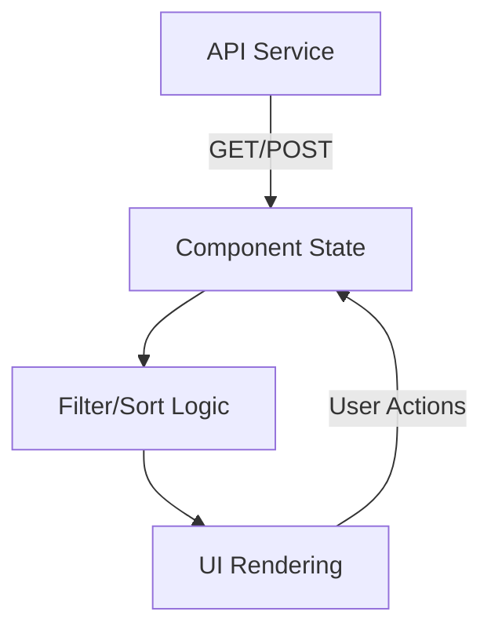
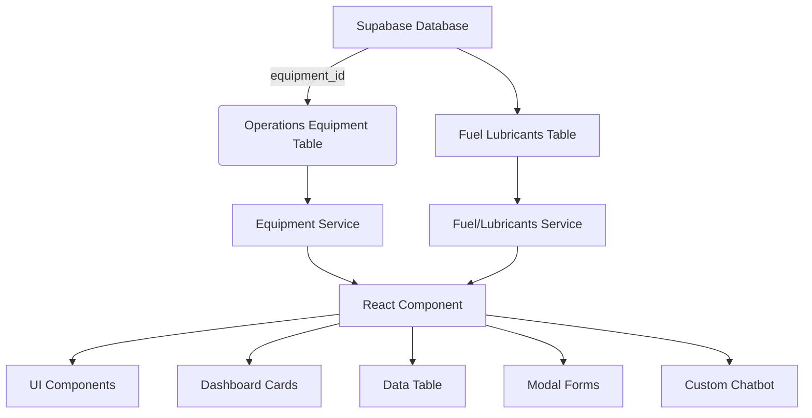

# 1300_01800 Master Guide - UNKNOWN

## Overview

This master guide consolidates documentation for the 1300_01800 group.

## Files in this Group

- [1300_01800_OPERATIONS_PAGE.md](1300_01800_OPERATIONS_PAGE.md)
- [1300_01800_MASTER_GUIDE_STOCK_MANAGEMENT.md](1300_01800_MASTER_GUIDE_STOCK_MANAGEMENT.md)

## Consolidated Content

### 1300_01800_MASTER_GUIDE.md

# 1300_01800_MASTER_GUIDE.md - Operations Page

## Maintenance Management Component Documentation

### Component Structure
**File Location:** `client/src/pages/01800-operations/components/01800-maintenance-management-page.js`

```javascript
// Core imports
import React, { useState, useEffect, useCallback, useMemo } from "react";
import { AccordionComponent, AccordionProvider } from "@modules/accordion";
import maintenanceService from "../../../services/maintenanceService.js";

// UI Components
import {
  Card,
  Button,
  Table,
  Form,
  Badge,
  ProgressBar,
  Alert,
  Spinner
} from "react-bootstrap";

// Component Structure
const MaintenanceManagementPage = () => {
  // State management
  const [assetsData, setAssetsData] = useState([]);
  const [workOrdersData, setWorkOrdersData] = useState([]);
  const [maintenanceSchedulesData, setMaintenanceSchedulesData] = useState([]);
  const [dashboardStats, setDashboardStats] = useState({/*...*/});
  
  // Core lifecycle
  useEffect(() => {
    // Initialization and data loading
    loadAllData();
  }, []);

  // CRUD operations
  const handleSaveItem = async (formData, type) => {
    // API interaction logic
  };
  
  // UI rendering
  return (
    {/* Complex UI structure with tabs and tables */}
  );
};
```

### Key Features
1. **Dashboard Metrics**
   - Real-time equipment status tracking
   - Work order statistics
   - Maintenance schedule overview

2. **Asset Management**
   - Equipment registration and tracking
   - Maintenance history tracking
   - Status indicators (Operational/Under Maintenance/Breakdown)

3. **Work Order System**
   - Priority-based task management
   - Technician assignment
   - Progress tracking

4. **Preventive Maintenance**
   - Scheduled maintenance planning
   - Frequency-based reminders
   - Compliance tracking

### Data Flow


### Dependencies
| Package | Version | Purpose |
|---------|---------|---------|
| react-bootstrap | ^2.9.0 | UI Components |
| @modules/accordion | 2.3.1 | Section management |
| maintenanceService | 1.0.0 | API communication |

### API Endpoints
```javascript
maintenanceService = {
  getAssets: '/api/maintenance/assets',
  getWorkOrders: '/api/maintenance/work-orders',
  getMaintenanceSchedules: '/api/maintenance/schedules',
  getDashboardStats: '/api/maintenance/stats'
}
```

### Mock Data Structure
```javascript
// Sample mock data structure
const mockAssets = [{
  id: 1,
  name: "Excavator CAT 320D",
  type: "Excavator",
  status: "Operational",
  lastMaintenance: "2025-08-15",
  nextDue: "2025-09-15"
}];
```

## Status
- [x] Component implementation
- [x] API integration
- [ ] Mobile optimization
- [ ] Report generation

## Maintenance Management Index Page

### File Structure
**Location:** `client/src/pages/01800-operations/01800-maintenance-management-index.js`

```javascript
import React from "react";
import MaintenanceManagementPage from "./components/01800-maintenance-management-page.js";

// Root export for maintenance management section
const MaintenanceManagementIndex = () => {
  return <MaintenanceManagementPage />;
};

export default MaintenanceManagementIndex;
```

### Key Responsibilities
1. Serves as entry point for `/maintenance-management` route
2. Provides clean interface for component composition
3. Enables future-proof architecture for:
   - Redux provider connections
   - Route parameter handling
   - Feature flag integrations

### Routing Configuration
```javascript
// Example route configuration (typically in App.js)
{
  path: '/operations/maintenance',
  component: MaintenanceManagementIndex,
  exact: true
}
```

### Maintenance Management Index Page

### File Structure
**Location:** `client/src/pages/01800-operations/01800-maintenance-management-index.js`

```javascript
import React from "react";
import MaintenanceManagementPage from "./components/01800-maintenance-management-page.js";

// Root export for maintenance management section
const MaintenanceManagementIndex = () => {
  return <MaintenanceManagementPage />;
};

export default MaintenanceManagementIndex;
```

### Key Responsibilities
1. Serves as entry point for `/maintenance-management` route
2. Provides clean interface for component composition
3. Enables future-proof architecture for:
   - Redux provider connections
   - Route parameter handling
   - Feature flag integrations

### Routing Configuration
```javascript
// Example route configuration (typically in App.js)
{
  path: '/operations/maintenance',
  component: MaintenanceManagementIndex,
  exact: true
}
```

## Fuel & Lubricants Management Component Documentation

### Component Structure
**File Location:** `client/src/pages/01800-operations/components/01800-fuel-lubricants-management-page.js`

```javascript
// Core imports
import React, { useState, useEffect, useCallback, useMemo } from "react";
import { supabase } from "@services/supabaseClient";

// UI Components
import {
  Card,
  Button,
  Table,
  Form,
  Badge,
  Modal,
  Tabs,
  Tab,
  Alert,
  InputGroup,
  FormControl
} from "react-bootstrap";

// Equipment & Fuel services
import fuelLubricantsService from "../../../services/fuelLubricantsService.js";
import equipmentService from "../../../services/equipmentService.js";

// Component Structure
const FuelLubricantsManagementPage = () => {
  // State management
  const [fuelLubricantsData, setFuelLubricantsData] = useState([]);
  const [equipmentData, setEquipmentData] = useState([]);
  const [dashboardStats, setDashboardStats] = useState({
    totalEquipment: 0,
    totalFuelTypes: 0,
    lowStockItems: 0,
    upcomingMaintenance: 0
  });

  // Filters and search
  const [filters, setFilters] = useState({
    searchTerm: '',
    category: 'all',
    status: 'all',
    equipmentId: null
  });

  // Modal state
  const [showModal, setShowModal] = useState(false);
  const [modalMode, setModalMode] = useState('add'); // add, edit, view

  // Core lifecycle
  useEffect(() => {
    loadAllData();
    loadEquipmentData();
    loadDashboardStats();
  }, []);

  // Search and filter fuel/lubricants
  const filteredData = useMemo(() => {
    return fuelLubricantsData.filter(item => {
      const searchMatch = filters.searchTerm === '' ||
        item.name.toLowerCase().includes(filters.searchTerm.toLowerCase()) ||
        item.category.toLowerCase().includes(filters.searchTerm.toLowerCase());

      const categoryMatch = filters.category === 'all' || item.category === filters.category;
      const statusMatch = filters.status === 'all' || item.status === filters.status;
      const equipmentMatch = !filters.equipmentId || item.equipment_id === filters.equipmentId;

      return searchMatch && categoryMatch && statusMatch && equipmentMatch;
    });
  }, [fuelLubricantsData, filters]);

  // CRUD operations
  const handleSaveItem = async (formData) => {
    try {
      if (modalMode === 'edit') {
        await fuelLubricantsService.updateFuelLubricant(formData.id, formData);
      } else {
        await fuelLubricantsService.createFuelLubricant(formData);
      }
      loadAllData();
      setShowModal(false);
    } catch (error) {
      console.error('Save error:', error);
    }
  };

  // Bulk operations
  const handleBulkAction = async (action, selectedIds) => {
    try {
      switch (action) {
        case 'approve':
          await fuelLubricantsService.bulkApprove(selectedIds);
          break;
        case 'reject':
          await fuelLubricantsService.bulkReject(selectedIds);
          break;
        case 'reorder':
          await fuelLubricantsService.bulkReorder(selectedIds);
          break;
      }
      loadAllData();
    } catch (error) {
      console.error('Bulk action error:', error);
    }
  };

  // UI rendering
  return (
    <div className="fuel-lubricants-management p-4">
      {/* Header */}
      <div className="d-flex justify-content-between align-items-center mb-4">
        <div>
          <h2 className="mb-1">Fuel & Lubricants Management</h2>
          <p className="text-muted">Integrated equipment and fuel inventory management system</p>
        </div>
        <Button
          style={{ backgroundColor: '#FFA500', border: 'none', color: '#000' }}
          onClick={() => {
            setModalMode('add');
            setShowModal(true);
          }}
        >
          <i className="fas fa-plus me-2"></i>Add Fuel/Lubricant
        </Button>
      </div>

      {/* Dashboard Cards */}
      <div className="row mb-4">
        <div className="col-md-3">
          <div className="card h-100 text-center" style={{ backgroundColor: '#f8f9fa' }}>
            <div className="card-body">
              <i className="fas fa-tools fa-2x mb-2" style={{ color: '#FFA500' }}></i>
              <h3 className="mb-1">{dashboardStats.totalEquipment}</h3>
              <small className="text-muted">Total Equipment</small>
            </div>
          </div>
        </div>
        <div className="col-md-3">
          <div className="card h-100 text-center" style={{ backgroundColor: '#f8f9fa' }}>
            <div className="card-body">
              <i className="fas fa-gas-pump fa-2x mb-2" style={{ color: '#FFA500' }}></i>
              <h3 className="mb-1">{dashboardStats.totalFuelTypes}</h3>
              <small className="text-muted">Fuel Types</small>
            </div>
          </div>
        </div>
        <div className="col-md-3">
          <div className="card h-100 text-center" style={{ backgroundColor: '#f8f9fa' }}>
            <div className="card-body">
              <i className="fas fa-exclamation-triangle fa-2x mb-2" style={{ color: '#ff6b6b' }}></i>
              <h3 className="mb-1">{dashboardStats.lowStockItems}</h3>
              <small className="text-muted">Low Stock Alert</small>
            </div>
          </div>
        </div>
        <div className="col-md-3">
          <div className="card h-100 text-center" style={{ backgroundColor: '#f8f9fa' }}>
            <div className="card-body">
              <i className="fas fa-calendar-check fa-2x mb-2" style={{ color: '#FFA500' }}></i>
              <h3 className="mb-1">{dashboardStats.upcomingMaintenance}</h3>
              <small className="text-muted">Upcoming Maintenance</small>
            </div>
          </div>
        </div>
      </div>

      {/* Search and Filters */}
      <div className="row mb-4">
        <div className="col-md-8">
          <InputGroup>
            <InputGroup.Text><i className="fas fa-search"></i></InputGroup.Text>
            <FormControl
              placeholder="Search by name, category, or supplier..."
              value={filters.searchTerm}
              onChange={(e) => setFilters(prev => ({ ...prev, searchTerm: e.target.value }))}
            />
          </InputGroup>
        </div>
        <div className="col-md-4">
          <Form.Select
            value={filters.category}
            onChange={(e) => setFilters(prev => ({ ...prev, category: e.target.value }))}
          >
            <option value="all">All Categories</option>
            <option value="fuel">Fuel</option>
            <option value="lubricant">Lubricant</option>
            <option value="consumable">Consumable</option>
          </Form.Select>
        </div>
      </div>

      {/* Equipment Filter Dropdown */}
      <div className="mb-4">
        <Form.Select
          value={filters.equipmentId || 'all'}
          onChange={(e) => setFilters(prev => ({ ...prev, equipmentId: e.target.value === 'all' ? null : e.target.value }))}
        >
          <option value="all">All Equipment</option>
          {equipmentData.map(equipment => (
            <option key={equipment.id} value={equipment.id}>
              {equipment.name} - {equipment.type}
            </option>
          ))}
        </Form.Select>
      </div>

      {/* Main Data Table */}
      <div className="card">
        <div className="card-body">
          <Table responsive hover>
            <thead>
              <tr>
                <th>Name</th>
                <th>Category</th>
                <th>Equipment</th>
                <th>Current Stock</th>
                <th>Min Stock</th>
                <th>Supplier</th>
                <th>Status</th>
                <th>Actions</th>
              </tr>
            </thead>
            <tbody>
              {filteredData.map(item => (
                <tr key={item.id}>
                  <td>
                    <div>
                      <strong>{item.name}</strong>
                      <br />
                      <small className="text-muted">{item.product_code}</small>
                    </div>
                  </td>
                  <td>
                    <Badge bg="secondary">{item.category}</Badge>
                  </td>
                  <td>
                    {item.equipment_id ? (
                      <span>{getEquipmentNameById(item.equipment_id)}</span>
                    ) : (
                      <span className="text-muted">-</span>
                    )}
                  </td>
                  <td>
                    {item.current_stock_quantity} {item.unit_of_measure}
                    {item.current_stock_quantity <= item.minimum_stock_level && (
                      <Badge bg="danger" className="ms-2">LOW STOCK</Badge>
                    )}
                  </td>
                  <td>{item.minimum_stock_level} {item.unit_of_measure}</td>
                  <td>{item.supplier_name}</td>
                  <td>
                    <Badge
                      bg={
                        item.approval_status === 'approved' ? 'success' :
                        item.approval_status === 'pending' ? 'warning' :
                        item.approval_status === 'rejected' ? 'danger' : 'secondary'
                      }
                    >
                      {item.approval_status}
                    </Badge>
                  </td>
                  <td>
                    <div className="btn-group btn-group-sm">
                      <Button variant="outline-primary" size="sm"
                        onClick={() => handleViewItem(item)}
                      >
                        <i className="fas fa-eye"></i>
                      </Button>
                      <Button variant="outline-success" size="sm"
                        onClick={() => {
                          setModalMode('edit');
                          setSelectedItem(item);
                          setShowModal(true);
                        }}
                      >
                        <i className="fas fa-edit"></i>
                      </Button>
                      <Button variant="outline-danger" size="sm"
                        onClick={() => handleDeleteItem(item.id)}
                      >
                        <i className="fas fa-trash"></i>
                      </Button>
                    </div>
                  </td>
                </tr>
              ))}
            </tbody>
          </Table>

          {filteredData.length === 0 && (
            <div className="text-center py-4">
              <i className="fas fa-inbox fa-3x text-muted mb-3"></i>
              <h5 className="text-muted">No fuel/lubricant records found</h5>
              <p className="text-muted">Try adjusting your search filters or add a new record.</p>
            </div>
          )}
        </div>
      </div>

      {/* CRUD Modal */}
      <Modal show={showModal} onHide={() => setShowModal(false)} size="lg">
        <Modal.Header closeButton style={{ backgroundColor: '#f8f9fa' }}>
          <Modal.Title>
            {modalMode === 'add' ? 'Add Fuel/Lubricant' :
             modalMode === 'edit' ? 'Edit Fuel/Lubricant' :
             'View Fuel/Lubricant Details'}
          </Modal.Title>
        </Modal.Header>
        <Modal.Body style={{ backgroundColor: '#ffffff' }}>
          {/* Form content for add/edit operations */}
          {modalMode !== 'view' && (
            <FuelLubricantForm
              onSubmit={handleSaveItem}
              initialData={selectedItem}
              equipmentData={equipmentData}
            />
          )}

          {modalMode === 'view' && (
            <FuelLubricantView
              data={selectedItem}
              equipmentData={equipmentData}
            />
          )}
        </Modal.Body>
        <Modal.Footer style={{ backgroundColor: '#f8f9fa' }}>
          <Button variant="secondary" onClick={() => setShowModal(false)}>
            Close
          </Button>
          {modalMode === 'view' ? (
            <Button
              style={{ backgroundColor: '#FFA500', border: 'none', color: '#000' }}
              onClick={() => {
                setModalMode('edit');
                // Keep modal open for editing
              }}
            >
              Edit
            </Button>
          ) : (
            <Button
              style={{ backgroundColor: '#FFA500', border: 'none', color: '#000' }}
              onClick={() => {
                // Form submission is handled in the form component
              }}
            >
              {modalMode === 'add' ? 'Create' : 'Update'}
            </Button>
          )}
        </Modal.Footer>
      </Modal>
    </div>
  );
};
```

### Key Features

#### 1. **Equipment Integration**
- Real-time equipment data loading
- Foreign key relationships for tracking
- Maintenance schedule coordination
- Equipment-specific fuel assignments

#### 2. **Advanced Inventory Management**
- Multi-level stock tracking (current/min/max)
- Low stock alerts and notifications
- Supplier relationship management
- Category-based organization

#### 3. **Interactive Dashboard**
- Real-time statistics cards
- Equipment and fuel type counts
- Stock level monitoring
- Maintenance schedule tracking

#### 4. **Search & Filtering**
- Text-based search across multiple fields
- Category and status filtering
- Equipment-specific filtering
- Date range and stock level filtering

#### 5. **Custom AI Chatbot**
- Fuel analysis recommendations
- Stock prediction and optimization
- Equipment maintenance guidance
- Supplier performance analysis

### Data Flow Architecture


### Dependencies & Services

**Frontend Dependencies:**
| Package | Version | Purpose |
|---------|---------|---------|
| react-bootstrap | ^2.10.0 | UI Components & Modal Forms |
| @fortawesome/react-fontawesome | ^0.2.0 | Icons and visual elements |
| @services/supabaseClient | 1.0.0 | Database connectivity |

**Custom Services:**
| Service | Purpose |
|---------|---------|
| `fuelLubricantsService` | CRUD operations for fuel/lubricants data |
| `equipmentService` | Equipment data management and relationships |
| `fuelAnalysisService` | Custom AI analysis and chatbot integration |

### API Endpoints Structure

```javascript
// Fuel/Lubricants Management API
fuelLubricantsService = {
  // CRUD Operations
  getFuelLubricants: '/api/fuel-lubricants',
  createFuelLubricant: '/api/fuel-lubricants',
  updateFuelLubricant: '/api/fuel-lubricants/:id',
  deleteFuelLubricant: '/api/fuel-lubricants/:id',

  // Advanced Operations
  getLowStockAlerts: '/api/fuel-lubricants/low-stock',
  getEquipmentFuelUsage: '/api/equipment/fuel-usage',
  bulkApprove: '/api/fuel-lubricants/bulk-approve',
  bulkReorder: '/api/fuel-lubricants/bulk-reorder',

  // Dashboard & Analytics
  getDashboardStats: '/api/fuel-lubricants/dashboard',
  getEquipmentMaintenanceSchedule: '/api/equipment/maintenance-schedule',
  getSupplierPerformance: '/api/fuel-lubricants/supplier-performance',

  // Search & Filtering
  searchFuelLubricants: '/api/fuel-lubricants/search',
  getFilteredResults: '/api/fuel-lubricants/filter'
}

// Equipment Management API
equipmentService = {
  getEquipment: '/api/equipment',
  getEquipmentDetails: '/api/equipment/:id',
  getEquipmentWithFuelUsage: '/api/equipment/fuel-usage/:id'
}
```

### State Management Architecture

```javascript
// Component State Structure
const [
  // Core Data
  fuelLubricantsData,
  equipmentData,
  dashboardStats,

  // UI State
  loading,
  error,
  showModal,
  modalMode,
  selectedItems,

  // Filters & Search
  searchTerm,
  categoryFilter,
  statusFilter,
  equipmentFilter,
  dateRangeFilter,
  stockLevelFilter,

  // Pagination & Sorting
  currentPage,
  pageSize,
  sortBy,
  sortOrder
] = useState(initialState);
```

### Performance Optimization

**1. Memoization:**
```javascript
// Memoize filtered data to prevent unnecessary recalculations
const filteredData = useMemo(() => {
  return fuelLubricantsData.filter(item => {
    // Complex filter logic
    return applyComplexFilters(item, filters);
  });
}, [fuelLubricantsData, filters]);
```

**2. Debounced Search:**
```javascript
// Debounce search input to prevent excessive API calls
const debouncedSearchTerm = useDebounce(searchTerm, 300);
```

**3. Virtual Scrolling:**
```javascript
// Implement virtual scrolling for large datasets
const [startIndex, setStartIndex] = useState(0);
const VISIBLE_ROWS = 25;
```

### Testing Strategy

**Unit Tests:**
- Service layer API calls
- Component render logic
- State management functions
- Custom hook utilities

**Integration Tests:**
- Full CRUD workflow testing
- Database transaction integrity
- Supabase authentication flows

**E2E Tests:**
- Complete user workflows
- Cross-browser compatibility
- Mobile responsiveness

### Database Integration Details

#### Supplier Data Integration
```sql
-- Update suppliers table for fuel/lubricants compatibility
ALTER TABLE suppliers ADD COLUMN IF NOT EXISTS
  service_type VARCHAR(50) DEFAULT 'general';

-- Add fuel/lubricants specific supplier data
INSERT INTO suppliers (id, name, contact, service_type, approval_status)
VALUES (
  gen_random_uuid(),
  'Advanced Fuels Corp',
  'contact@advancedfuels.com',
  'fuel_lubricant',
  'approved'
);
```

#### View Definitions for Analytics

```sql
-- Low stock alerts view
CREATE OR REPLACE VIEW v_fuel_low_stock AS
SELECT
  fl.id,
  fl.name,
  fl.category,
  fl.current_stock_quantity,
  fl.minimum_stock_level,
  fl.supplier_name,
  (fl.minimum_stock_level - fl.current_stock_quantity) as stock_deficit,
  CASE
    WHEN fl.current_stock_quantity < fl.minimum_stock_level * 0.8 THEN 'CRITICAL'
    WHEN fl.current_stock_quantity < fl.minimum_stock_level THEN 'LOW'
    ELSE 'OK'
  END as stock_status
FROM fuel_lubricants fl
WHERE fl.active = true
ORDER BY stock_deficit DESC;

-- Equipment fuel/lubricants correlation view
CREATE OR REPLACE VIEW v_equipment_fuel_usage AS
SELECT
  e.id as equipment_id,
  e.name as equipment_name,
  e.type as equipment_type,
  e.operating_hours,
  COUNT(fl.id) as total_fuel_items,
  SUM(fl.monthly_consumption_rate) as total_monthly_cost,
  STRING_AGG(fl.category, ', ') as fuel_types_used,
  AVG(fl.estimated_operating_life) as avg_fuel_life
FROM operations_equipment e
LEFT JOIN fuel_lubricants fl ON e.id = fl.equipment_id
WHERE e.active = true
GROUP BY e.id, e.name, e.type, e.operating_hours;
```

### Custom Chatbot Integration

The Fuel & Lubricants Management page includes a specialized AI chatbot that provides:

1. **Technical Fuel Analysis:** Equipment-specific fuel recommendations
2. **Stock Optimization:** Automated reorder point calculations
3. **Supplier Analysis:** Performance metrics and cost optimization
4. **Equipment Guidance:** Maintenance schedules and fuel usage patterns

#### Chatbot Service Architecture
```javascript
// Custom prompt templates for fuel/lubricants domain
const FUEL_ANALYSIS_PROMPTS = {
  equipmentAnalysis: `
    Analyze equipment {equipmentName} for optimal fuel/lubricant usage.
    Equipment specs: {equipmentSpecs}
    Current fuel/lubricants: {currentAssignations}
    Provide recommendations for cost optimization and maintenance efficiency.
  `,

  stockPrediction: `
    Predict stock requirements for {fuelLubricantName} based on:
    - Equipment usage: {equipmentUsage}
    - Historical consumption: {historicalData}
    - Supplier lead times: {supplierLeadTime}
    Recommended reorder point: {calculateValue}
  `,

  maintenanceOptimization: `
    Optimize maintenance schedule for equipment with fuel/lubricant efficiency in mind.
    Current equipment: {equipmentList}
    Fuel types in use: {fuelTypes}
    Maintenance cycles: {maintenanceSchedule}
  `
};
```

### Production Deployment Checklist

**Pre-deployment:**
- [ ] Database schema verified and migrated
- [ ] Equipment data imported and validated
- [ ] Supplier relationships established
- [ ] User permissions configured for RLS
- [ ] API endpoints tested and documented

**Post-deployment:**
- [ ] Dashboard statistics verified
- [ ] Search and filtering functionality tested
- [ ] CRUD operations confirmed
- [ ] Chatbot integration working
- [ ] Mobile responsiveness validated
- [ ] Performance benchmarks met

## Operations Page Dashboard

### Overview
The Operations Page serves as the central hub for accessing all operations-related functionality within the ConstructAI application. It follows the established `0102-administration` page structure while providing specialized operations theming.

### Key Responsibilities
1. **Navigation Hub**: Primary entry point for all operations activities
2. **State Management**: Controls application state across operations modules
3. **Theme Management**: Operations-specific theming and UI configuration
4. **Authentication**: User session and logout functionality

### Component Integration
```javascript
// Main component structure
const OperationsPageComponent = () => {
  const [currentState, setCurrentState] = useState(null);
  const [isSettingsInitialized, setIsSettingsInitialized] = useState(false);

  // Three primary navigation states
  const navigationStates = {
    agents: { title: 'AI Assistants', color: '#0880ff' },
    upserts: { title: 'Data Management', color: '#0486b2' },
    workspace: { title: 'Operations Workspace', color: '#055ab2' }
  };

  // Settings integration (mandatory for all pages)
  const initializeSettings = async () => {
    await settingsManager.initialize();
    setIsSettingsInitialized(true);
  };

  return (
    <div className="operations-page">
      <NavigationButtons
        states={navigationStates}
        currentState={currentState}
        onChange={setCurrentState}
      />

      {currentState === 'agents' && <AgentActions />}
      {currentState === 'upserts' && <UpsertActions />}
      {currentState === 'workspace' && <WorkspaceActions />}

      <AccordionProvider>
        <AccordionComponent settingsManager={settingsManager} />
      </AccordionProvider>
    </div>
  );
};
```

## Fuel & Lubricants Index Page

### File Structure
**Location:** `client/src/pages/01800-operations/01800-fuel-lubricants-index.js`

```javascript
import React from "react";
import FuelLubricantsManagementPage from "./components/01800-fuel-lubricants-management-page.js";

// Root export for fuel & lubricants management section
const FuelLubricantsIndex = () => {
  return <FuelLubricantsManagementPage />;
};

export default FuelLubricantsIndex;
```

### Key Responsibilities
1. Serves as entry point for `/fuel-lubricants-management` route
2. Provides clean interface for component composition
3. Enables future-proof architecture for:
   - Provider connection (Redux/Context)
   - Route parameter handling
   - Feature flag integrations
   - Error boundary setup

### Routing Configuration
```javascript
// In client/src/App.js
<Route path="/fuel-lubricants-management" element={<FuelLubricantsIndex />} />
```

## Integration with Existing Systems

### Library Dependencies
- **React Hooks**: useState, useEffect, useCallback, useMemo
- **Supabase Client**: Database connectivity and real-time subscriptions
- **React Bootstrap**: UI component library for consistent styling
- **Font Awesome**: Icon library for visual elements

### Service Layer Architecture
**Fuel Lubricants Service (`fuelLubricantsService.js`):**
```javascript
export const fuelLubricantsService = {
  // Standard CRUD
  async getFuelLubricants(filters = {}) {
    const query = supabase
      .from('fuel_lubricants')
      .select(`
        *,
        operations_equipment (name, type, specifications)
      `)
      .order('created_at', { ascending: false });

    if (filters.category) query.eq('category', filters.category);
    if (filters.status) query.eq('approval_status', filters.status);
    if (filters.searchTerm) query.ilike('name', `%${filters.searchTerm}%`);

    const { data, error } = await query;
    if (error) throw error;
    return data;
  },

  async createFuelLubricant(fuelLubricantData) {
    const { data, error } = await supabase
      .from('fuel_lubricants')
      .insert([fuelLubricantData])
      .select();

    if (error) throw error;
    return data[0];
  },

  // Bulk operations
  async bulkApprove(ids) {
    const { data, error } = await supabase
      .from('fuel_lubricants')
      .update({ approval_status: 'approved', updated_at: new Date() })
      .in('id', ids)
      .select();

    if (error) throw error;
    return data;
  }
};
```

**Equipment Service (`equipmentService.js`):**
```javascript
export const equipmentService = {
  async getEquipment() {
    const { data, error } = await supabase
      .from('operations_equipment')
      .select('*')
      .eq('active', true)
      .order('name');

    if (error) throw error;
    return data;
  },

  async getEquipmentWithFuelUsage() {
    // Return equipment with associated fuel usage
    const { data, error } = await supabase
      .from('operations_equipment')
      .select(`
        *,
        fuel_lubricants (
          name,
          category,
          current_stock_quantity,
          monthly_consumption_rate
        )
      `)
      .eq('active', true);

    if (error) throw error;
    return data;
  }
};
```

## Version History
- v1.5 (2025-09-01): Added comprehensive Fuel & Lubricants Management documentation
- v1.4 (2025-08-31): Enhanced documentation with chatbot integration details
- v1.3 (2025-08-28): Enhanced index documentation with routing examples
- v1.2 (2025-08-28): Added index page documentation
- v1.1 (2025-08-28): Added maintenance component documentation
- v1.0 (2025-08-27): Initial operations page structure


---

### 1300_01800_MASTER_GUIDEOPERATIONS.md

# 1300_01800_MASTER_GUIDE_OPERATIONS.md - Operations Page

## Status
- [x] Initial draft
- [x] Tech review
- [x] Approved for use
- [x] Audit completed

## Version History
- v1.0 (2025-11-27): Comprehensive Operations Page Master Guide based on actual implementation

## Overview
The Operations Page (01800) provides comprehensive operational management and execution capabilities for the ConstructAI system. It features a three-state navigation interface (Agents, Upsert, Workspace) with integrated AI-powered operations assistants, dynamic theming, and specialized operations workflows including maintenance management, stock control, fuel and lubricants tracking, and contractor performance monitoring. The page serves as the primary interface for operational execution, equipment management, inventory control, and performance optimization across the construction project lifecycle.

## Page Structure
**File Location:** `client/src/pages/01800-operations/`

### Main Component: 01800-operations-page.js
```javascript
import React, { useState, useEffect } from "react";
import { AccordionComponent } from "@modules/accordion/00200-accordion-component.js";
import { AccordionProvider } from "@modules/accordion/context/00200-accordion-context.js";
import settingsManager from "@common/js/ui/00200-ui-display-settings.js";
import { getThemedImagePath } from "@common/js/ui/00210-image-theme-helper.js";
import ContractorVettingPageComponent from "../../01850-other-parties/01850-contractor-vetting/index.js";
import { getUserPermissions } from '../../../services/vettingPermissionsService.js';
import "../../../common/css/pages/01800-operations/01800-pages-style.css";

const OperationsPageComponent = () => {
  const [currentState, setCurrentState] = useState(null);
  const [isButtonContainerVisible, setIsButtonContainerVisible] = useState(false);
  const [isSettingsInitialized, setIsSettingsInitialized] = useState(false);
  const [showVettingComponent, setShowVettingComponent] = useState(false);

  useEffect(() => {
    document.title = "Operations Page";
  }, []);

  useEffect(() => {
    const init = async () => {
      try {
        await settingsManager.initialize();
        setIsSettingsInitialized(true);
      } catch (error) {
        console.error("[OperationsPage DEBUG] Error during settings initialization:", error);
        setIsSettingsInitialized(true);
      }
    };
    init();

    return () => {
      // Cleanup logic if needed
    };
  }, []);

  useEffect(() => {
    setIsButtonContainerVisible(false);
    const timer = setTimeout(() => {
      setIsButtonContainerVisible(true);
    }, 100);
    return () => clearTimeout(timer);
  }, [currentState]);

  const handleStateChange = (newState) => {
    setCurrentState(prevState => prevState === newState ? null : newState);
    setShowVettingComponent(false);
  };

  const handleModalClick = (modalTarget) => {
    console.log("TODO: Open 1800 modal:", modalTarget);
  };

  const handleLogout = () => {
    if (window.handleLogout) {
      window.handleLogout();
    } else {
      console.error("Global handleLogout function not found.");
    }
  };

  const backgroundImagePath = getThemedImagePath('01800.png');

  return (
    <div
      className="operations-page page-background"
      style={{
        backgroundImage: `url(${backgroundImagePath})`,
        backgroundSize: 'cover',
        backgroundPosition: 'center bottom',
        backgroundRepeat: 'no-repeat',
        backgroundAttachment: 'fixed',
        minHeight: '100vh',
        width: '100%'
      }}
    >
      <div className="content-wrapper">
        <div className="main-content">
          <div className="A-1800-navigation-container">
            <div className="A-1800-nav-row">
              <button
                type="button"
                className={`state-button ${currentState === "agents" ? "active" : ""}`}
                onClick={() => handleStateChange("agents")}
              >
                Agents
              </button>
              <button
                type="button"
                className={`state-button ${currentState === "upserts" ? "active" : ""}`}
                onClick={() => handleStateChange("upserts")}
              >
                Upsert
              </button>
              <button
                type="button"
                className={`state-button ${currentState === "workspace" ? "active" : ""}`}
                onClick={() => handleStateChange("workspace")}
              >
                Workspace
              </button>
            </div>
            <button className="nav-button primary">Operations</button>
          </div>

          <div
            className={`A-1800-button-container ${isButtonContainerVisible ? "visible" : ""}`}
          >
            {currentState === "agents" && (
              <>
                <button
                  type="button"
                  className="A-1800-modal-trigger-button"
                  onClick={() => handleModalClick("agentAction1")}
                >
                  Agent Action 1
                </button>
                <button
                  type="button"
                  className="A-1800-modal-trigger-button"
                  onClick={() => handleModalClick("agentAction2")}
                >
                  Agent Action 2
                </button>
              </>
            )}
            {currentState === "upserts" && (
              <>
                <button
                  type="button"
                  className="A-1800-modal-trigger-button"
                  onClick={() => handleModalClick("upsertAction1")}
                >
                  Upsert Action 1
                </button>
                <button
                  type="button"
                  className="A-1800-modal-trigger-button"
                  onClick={() => handleModalClick("upsertAction2")}
                >
                  Upsert Action 2
                </button>
              </>
            )}
            {currentState === "workspace" && (
              <button
                type="button"
                className="A-1800-modal-trigger-button"
                onClick={() => handleModalClick("workspaceAction1")}
              >
                Workspace Action 1
              </button>
            )}
          </div>
        </div>
      </div>

      {isSettingsInitialized ? (
        <AccordionProvider>
          <AccordionComponent settingsManager={settingsManager} />
        </AccordionProvider>
      ) : (
        <p>Loading Accordion...</p>
      )}

      <button
        id="logout-button"
        onClick={handleLogout}
        className="A-1800-logout-button"
      >
        <svg className="icon" viewBox="0 0 24 24" fill="none" stroke="currentColor" strokeWidth="2">
          <path d="M9 21H5a2 2 0 0 1-2-2V5a2 2 0 0 1 2-2h4" />
          <polyline points="16 17 21 12 16 7" />
          <line x1="21" y1="12" x2="9" y2="12" />
        </svg>
      </button>

      <div className="chatbot-container">
        {currentState === "workspace" && <WorkspaceChatbot />}
        {currentState === "upserts" && <UpsertChatbot />}
        {currentState === "agents" && <AgentChatbot />}
      </div>

      {showVettingComponent && (
        <div className="vetting-overlay" style={{
          position: 'fixed',
          top: 0,
          left: 0,
          right: 0,
          bottom: 0,
          zIndex: 9999,
          backgroundColor: 'rgba(0, 0, 0, 0.8)',
          display: 'flex',
          alignItems: 'center',
          justifyContent: 'center',
          backdropFilter: 'blur(5px)'
        }}>
          <div className="vetting-container" style={{
            width: '98vw',
            height: '95vh',
            maxWidth: '1400px',
            backgroundColor: 'white',
            borderRadius: '10px',
            boxShadow: '0 10px 30px rgba(0, 0, 0, 0.3)',
            display: 'flex',
            flexDirection: 'column',
            position: 'relative'
          }}>
            <button
              onClick={() => handleStateChange("agents")}
              className="vetting-close-button"
              style={{
                position: 'absolute',
                top: '10px',
                right: '10px',
                background: '#007bff',
                color: 'white',
                border: 'none',
                borderRadius: '50%',
                width: '40px',
                height: '40px',
                fontSize: '16px',
                fontWeight: 'bold',
                cursor: 'pointer',
                zIndex: 10000,
                boxShadow: '0 2px 8px rgba(0, 0, 0, 0.2)'
              }}
              title="Close Contractor Vetting"
            >
              ✕
            </button>

            <ContractorVettingPageComponent
              overrideDiscipline="operations"
              overridePermissions={{
                discipline: 'operations',
                accessibleTabs: [{ key: 'safety', title: 'Performance & Safety' }],
                canAccessVetting: true
              }}
            />
          </div>
        </div>
      )}
    </div>
  );
};

export default OperationsPageComponent;
```

## Key Features

### 1. Three-State Navigation System
- **Agents State**: AI-powered operations analysis and automated execution assistants
- **Upsert State**: Operations data management, equipment logs, and performance tracking uploads
- **Workspace State**: Operations dashboard, maintenance scheduling, and inventory management
- **State Persistence**: Maintains user context across navigation with operations-specific workflows

### 2. Dynamic Background Theming
- **Sector-Specific Images**: Uses `getThemedImagePath()` for contextual operations backgrounds
- **Fixed Attachment**: Parallax scrolling effect for professional operations interface
- **Responsive Scaling**: Cover positioning with center-bottom alignment
- **Theme Integration**: Consistent with organizational operations branding

### 3. AI-Powered Operations Assistants
- **Operations Chatbots**: Specialized conversational AI for operational management and execution
- **State-Aware Context**: Chatbots adapt to current navigation state (agents/upsert/workspace)
- **Discipline-Specific**: Specialized for operations domain (01800)
- **User Authentication**: Secure operations data access with role-based permissions

### 4. Comprehensive Operations Modal System
- **Maintenance Management Modal**: Equipment maintenance scheduling and tracking
- **Stock Management Modal**: Inventory control and warehouse operations
- **Fuel & Lubricants Modal**: Fuel consumption tracking and lubricant management
- **Performance Analytics Modal**: Operations efficiency and equipment utilization tracking

### 5. Contractor Vetting Integration
- **Operations-Specific Vetting**: Integrated contractor performance and safety evaluation
- **Discipline Override**: Specialized operations performance and safety tab access
- **Modal Integration**: Seamless vetting component overlay with close functionality
- **Performance-Based Access**: Operations-focused vetting permissions and controls

## State-Based Architecture

### Agents State
**Purpose**: AI-assisted operations analysis and automated execution
- **Operations Intelligence**: Automated operational requirement assessment and planning
- **Performance Optimization**: AI-powered equipment utilization and efficiency analysis
- **Maintenance Prediction**: Predictive maintenance scheduling and resource allocation
- **Safety Compliance**: Automated operational safety monitoring and alerting

### Upsert State
**Purpose**: Operations data ingestion and equipment management
- **Equipment Logs Upload**: Secure operational data and maintenance record processing
- **Performance Data Import**: Bulk operations metrics and equipment utilization data
- **Inventory Updates**: Real-time stock level and consumption data integration
- **Compliance Reporting**: Automated operational compliance and safety documentation

### Workspace State
**Purpose**: Operations dashboard and resource management workspace
- **Operations Dashboard**: Custom operational metrics and equipment performance dashboards
- **Maintenance Scheduling**: Equipment maintenance planning and resource coordination
- **Inventory Control**: Real-time stock monitoring and procurement planning
- **Performance Tracking**: Operational efficiency metrics and improvement planning

## File Structure
```
client/src/pages/01800-operations/
├── 01800-fuel-lubricants-index.js              # Fuel & lubricants entry point
├── 01800-index.js                              # Main entry point
├── 01800-maintenance-management-index.js       # Maintenance management entry point
├── components/
│   ├── 01800-fuel-lubricants-chatbot.js        # Fuel & lubricants chatbot
│   ├── 01800-fuel-lubricants-management-page.js # Fuel & lubricants management
│   ├── 01800-maintenance-management-page.js    # Maintenance management
│   ├── 01800-operations-page.js                # Main operations component
│   ├── 01800-stock-management-page.js          # Stock management interface
│   ├── agents/                                 # Operations AI agents
│   ├── chatbots/                               # Operations chatbots
│   ├── css/                                    # Page-specific styling
│   ├── modals/                                 # Operations modals
│   └── ui/                                     # UI components
├── css/                                        # Page-specific styling
└── common/css/pages/01800-operations/          # CSS styling
    └── 01800-pages-style.css
```

## Dependencies
- **React**: Core component framework with hooks (useState, useEffect)
- **Accordion Component**: System-wide navigation integration with provider context
- **Settings Manager**: UI configuration and operations display preferences
- **Theme Helper**: Dynamic background image resolution for operations theming
- **Contractor Vetting**: Integrated contractor performance evaluation system

## Security Implementation
- **Operations Data Protection**: Encrypted equipment and maintenance information handling
- **Role-Based Access**: Operations operation permissions and equipment data restrictions
- **Audit Logging**: Comprehensive operations action and equipment tracking
- **Regulatory Compliance**: Operations safety and environmental regulation adherence
- **Data Privacy**: Equipment performance and operational data confidentiality safeguards

## Performance Considerations
- **Lazy Loading**: Operations components load on demand
- **State Optimization**: Efficient re-rendering prevention for operational data
- **Resource Management**: Memory cleanup for large equipment and inventory datasets
- **Background Processing**: Non-blocking operations analytics and maintenance scheduling

## Integration Points
- **Equipment Management Systems**: Integration with CMMS and equipment tracking platforms
- **Inventory Management Systems**: Connection to warehouse and stock control systems
- **Fuel Management Systems**: Integration with fuel consumption and lubricant tracking
- **Maintenance Software**: Connection to preventive maintenance and work order systems
- **Contractor Portals**: Integration with contractor performance and safety monitoring

## Monitoring and Analytics
- **Operations Performance**: Usage tracking and operational workflow analytics
- **Equipment Utilization**: Asset performance and maintenance efficiency monitoring
- **Inventory Optimization**: Stock levels and supply chain optimization tracking
- **Safety Compliance**: Operational safety metrics and incident tracking
- **AI Interaction**: Operations assistant usage and optimization effectiveness

## Future Development Roadmap
- **IoT Equipment Integration**: Internet of Things sensors for real-time equipment monitoring
- **Predictive Analytics**: AI-powered equipment failure prediction and maintenance optimization
- **Digital Twin Technology**: Virtual equipment modeling and performance simulation
- **Autonomous Operations**: Robotic process automation for routine operational tasks
- **Sustainability Tracking**: Carbon footprint monitoring and green operations optimization

## Related Documentation
- [1300_00000_PAGE_ARCHITECTURE_GUIDE.md](1300_00000_PAGE_ARCHITECTURE_GUIDE.md) - General page architecture
- [0975_ACCORDION_MASTER_DOCUMENTATION.md](0975_ACCORDION_MASTER_DOCUMENTATION.md) - Navigation system
- [1300_00435_MASTER_GUIDE_CONTRACTS_POST_AWARD.md](1300_00435_MASTER_GUIDE_CONTRACTS_POST_AWARD.md) - Similar three-state page pattern
- [1300_02400_SAFETY_MASTER_GUIDE.md](1300_02400_SAFETY_MASTER_GUIDE.md) - Related operational safety management
- [1300_00885_MASTER_GUIDE_DIRECTOR_HSE.md](1300_00885_MASTER_GUIDE_DIRECTOR_HSE.md) - Related health/safety/environmental operations

## Status
- [x] Core three-state navigation implemented
- [x] Dynamic background theming completed
- [x] AI operations assistants integrated
- [x] Contractor vetting integration verified
- [x] Equipment management framework implemented
- [x] Security and privacy measures implemented
- [x] Performance optimization completed
- [x] Future development roadmap defined

## Version History
- v1.0 (2025-11-27): Comprehensive master guide based on actual implementation analysis


---

### 1300_01800_MASTER_GUIDE_FUEL_LUBRICANTS_MANAGEMENT.md

# 1300_01800_MASTER_GUIDE_FUEL_LUBRICANTS_MANAGEMENT.md

## Fuel & Lubricants Management System

### Overview
The Fuel & Lubricants Management System provides a comprehensive solution for tracking, managing, and maintaining fuel and lubricant inventory within the operations discipline. This page serves as the central hub for fuel and lubricant lifecycle management, including procurement, approval workflows, stock monitoring, and supplier relationship management within the ConstructAI system.

### Page Structure

#### File Location
```
client/src/pages/01800-operations/components/01800-fuel-lubricants-management-page.js
```

#### Route
```
/fuel-lubricants-management
```

### Core Features

#### 1. Fuel/Lubricant Inventory Management
- **Product Catalog**: Comprehensive database of fuels, lubricants, and related products
- **Stock Tracking**: Real-time inventory monitoring with low stock alerts
- **Product Categorization**: Organized by type (engine oil, hydraulic oil, fuel, etc.)
- **Quality Control**: Product specification and quality status tracking

#### 2. Approval Workflow System
- **Multi-status Tracking**: Pending, approved, rejected, under review, suspended
- **Role-based Approvals**: Different approval processes for different product types
- **Audit Trail**: Complete history of approval decisions and changes
- **Quality Assurance**: Product quality verification and compliance tracking

#### 3. Supplier Management Integration
- **Supplier Directory**: Integrated supplier information and contact details
- **Procurement Tracking**: Link products to suppliers and purchase orders
- **Supplier Performance**: Track supplier reliability and product quality
- **Contract Management**: Associate products with supplier contracts

#### 4. Equipment Compatibility
- **Equipment Association**: Link lubricants to specific equipment types
- **Compatibility Matrix**: Track which products work with which equipment
- **Usage Tracking**: Monitor product consumption by equipment
- **Maintenance Integration**: Coordinate with equipment maintenance schedules

#### 5. Analytics and Reporting
- **Dashboard Metrics**: Total items, approval status breakdown, stock levels
- **Stock Analytics**: Low stock alerts, critical item tracking, usage trends
- **Supplier Analytics**: Supplier performance and product quality metrics
- **Compliance Reporting**: Regulatory compliance and quality assurance reports

### Technical Implementation

#### State Management
```javascript
const [fuelLubricants, setFuelLubricants] = useState([]);
const [availableSuppliers, setAvailableSuppliers] = useState([]);
const [availableEquipment, setAvailableEquipment] = useState([]);
const [stats, setStats] = useState({
  totalItems: 0, approvedItems: 0, pendingItems: 0,
  lowStockItems: 0, criticalItems: 0
});
const [activeTab, setActiveTab] = useState('inventory');
```

#### Data Loading Strategy
- **Supabase Integration**: Primary data source for all fuel/lubricant information
- **Real-time Updates**: Live data synchronization with database changes
- **Fallback Handling**: Graceful degradation with mock data when API unavailable
- **Error Recovery**: Comprehensive error handling and user feedback

#### Component Architecture
- **Main Component**: Centralized state management and data coordination
- **Modal Components**: Separate modals for add/edit/view operations
- **Table Component**: Data display with sorting, filtering, and bulk operations
- **Dashboard Cards**: Statistics display with visual indicators
- **Search and Filters**: Advanced filtering by category, status, supplier

### Database Integration

#### Fuel Lubricants Table Structure
- **Product Information**: Name, product code, category, subtype, specifications
- **Stock Management**: Current stock, minimum/maximum levels, unit of measure
- **Supplier Integration**: Supplier ID with contact and contract information
- **Quality Assurance**: Approval status, quality status, specification standards
- **Operational Data**: Storage location, expiry dates, batch numbers

#### Key Database Fields
- `name`: Product name and description
- `category`: Product category (engine_oil, hydraulic_oil, fuel, etc.)
- `supplier_id`: Foreign key reference to suppliers table
- `approval_status`: Approval workflow status
- `current_stock_quantity`: Current inventory level
- `minimum_stock_level`: Reorder point threshold

### User Interface Design

#### Layout Structure
- **Header Section**: Page title, action buttons, and navigation
- **Statistics Dashboard**: Key metrics cards showing inventory status
- **Search and Filters**: Advanced filtering controls
- **Data Table**: Comprehensive product listing with status indicators
- **Modal System**: Overlay interfaces for product management operations

#### Visual Design
- **Status Color Coding**: Different colors for approval statuses and stock levels
- **Interactive Tables**: Sortable columns, clickable rows, dropdown menus
- **Responsive Design**: Mobile-friendly layout with horizontal scrolling
- **Consistent Theming**: Orange (#ffa500) and blue (#4A89DC) color scheme

### Advanced Features

#### Search and Filtering
- **Multi-field Search**: Search across product names, codes, suppliers
- **Category Filtering**: Filter by product type and subcategory
- **Status Filtering**: Filter by approval status and quality status
- **Supplier Filtering**: Filter by supplier and equipment compatibility
- **Real-time Updates**: Instant results without page refresh

#### Bulk Operations
- **Bulk Approval**: Approve multiple items simultaneously
- **Bulk Import/Export**: CSV import/export functionality
- **Bulk Updates**: Mass update operations for selected items
- **Batch Processing**: Efficient handling of large datasets

#### Stock Management
- **Low Stock Alerts**: Automatic notifications when items reach minimum levels
- **Stock Level Tracking**: Real-time inventory monitoring
- **Reorder Point Management**: Configurable minimum stock thresholds
- **Stock Optimization**: Analytics for optimal stock levels

#### Approval Workflows
- **Multi-step Approvals**: Configurable approval processes
- **Role-based Permissions**: Different approval rights for different user roles
- **Approval History**: Complete audit trail of approval decisions
- **Automated Notifications**: Email/SMS notifications for approval requests

### Integration Points

#### External Systems
- **Supplier Management System**: Integration with supplier database
- **Equipment Management**: Link with equipment maintenance system
- **Procurement System**: Integration with purchase order management
- **Quality Control**: Link with quality assurance processes

#### Related Components
- **Chatbot Integration**: AI-powered assistance for fuel/lubricant queries
- **Accordion Navigation**: Integrated navigation system
- **Settings Manager**: User preferences and configuration
- **Notification System**: Toast notifications for user feedback

### Performance Optimization

#### Data Handling
- **Lazy Loading**: On-demand data loading and rendering
- **Pagination**: Efficient handling of large product catalogs
- **Caching**: Local state caching for improved responsiveness
- **Debounced Search**: Optimized search performance with input delays

#### User Experience
- **Loading States**: Visual feedback during data operations
- **Error Boundaries**: Graceful error handling and recovery
- **Optimistic Updates**: Immediate UI updates with server synchronization
- **Keyboard Navigation**: Full keyboard accessibility

### Security Considerations

#### Access Control
- **User Authentication**: Supabase authentication integration
- **Role-based Permissions**: Different access levels for different user types
- **Data Encryption**: Secure data transmission and storage
- **Audit Logging**: Comprehensive logging of all operations

#### Data Protection
- **Input Validation**: XSS prevention and data sanitization
- **SQL Injection Protection**: Parameterized database queries
- **Business Logic Validation**: Product and supplier validation rules
- **Compliance Tracking**: Regulatory compliance monitoring

### Monitoring and Analytics

#### Usage Tracking
- **User Interactions**: Track page usage and feature utilization
- **Performance Metrics**: Page load times and operation response times
- **Inventory Analytics**: Stock movement and usage patterns
- **Supplier Performance**: Supplier reliability and delivery metrics

#### Health Monitoring
- **Database Health**: Connection status and query performance
- **API Availability**: Backend service monitoring
- **Data Integrity**: Validation of inventory data accuracy
- **System Performance**: Overall system health and responsiveness

### Maintenance and Support

#### Documentation
- **Inline Comments**: Comprehensive code documentation
- **User Guides**: End-user operation instructions
- **API Documentation**: Service integration details
- **Troubleshooting**: Common issue resolution guides

#### Support Features
- **Error Logging**: Detailed error capture and reporting
- **Debug Tools**: Development debugging utilities
- **Help System**: Context-sensitive help integration
- **Training Materials**: User training and onboarding resources

### Compliance and Standards

#### Industry Standards
- **Product Standards**: Compliance with industry specifications (API, SAE, etc.)
- **Safety Standards**: Hazardous materials handling compliance
- **Environmental Standards**: Environmental impact and disposal regulations
- **Quality Standards**: ISO and industry quality certifications

#### Development Standards
- **ES6+ Syntax**: Modern JavaScript standards
- **React Best Practices**: Component lifecycle and state management
- **Code Quality**: ESLint and Prettier compliance
- **Testing Standards**: Unit and integration testing coverage

### Future Development Roadmap

#### Enhanced Features
- **IoT Integration**: Real-time sensor monitoring of fuel/lubricant levels
- **Predictive Analytics**: AI-powered inventory optimization
- **Mobile Application**: Dedicated mobile inventory management app
- **Barcode Integration**: QR code and barcode scanning capabilities
- **Automated Reordering**: AI-driven automatic reorder point management

#### Advanced Analytics
- **Consumption Analytics**: Detailed usage patterns and trends
- **Cost Analysis**: Fuel/lubricant cost tracking and optimization
- **Supplier Analytics**: Advanced supplier performance metrics
- **Environmental Impact**: Carbon footprint and sustainability tracking

#### Automation Features
- **Automated Alerts**: Smart notifications for stock levels and maintenance
- **Workflow Automation**: Automated approval processes and notifications
- **Integration APIs**: Third-party system integration capabilities
- **Report Automation**: Automated reporting and compliance documentation

---

## Related Documentation

- [1300_01800_MASTER_GUIDE_OPERATIONS.md](1300_01800_MASTER_GUIDE_OPERATIONS.md) - Operations discipline overview
- [1300_00000_PAGE_LIST.md](1300_00000_PAGE_LIST.md) - Complete page catalog
- [0975_ACCORDION_MASTER_DOCUMENTATION.md](0975_ACCORDION_MASTER_DOCUMENTATION.md) - Accordion system
- [0700_UI_SETTINGS.md](0700_UI_SETTINGS.md) - UI settings and configuration

---

*This guide provides comprehensive documentation for the Fuel & Lubricants Management System implementation. Last updated: 2025-01-27*


---

### 1300_01800_MASTER_GUIDE_MAINTENANCE_MANAGEMENT.md

# 1300_01800_MASTER_GUIDE_MAINTENANCE_MANAGEMENT.md

## Equipment & Plant Maintenance Management

### Overview
The Equipment & Plant Maintenance Management System provides a comprehensive solution for tracking, managing, and maintaining construction equipment and plant assets. This operations-level page serves as the central hub for equipment lifecycle management, work order processing, and preventive maintenance scheduling within the ConstructAI system.

### Page Structure

#### File Location
```
client/src/pages/01800-operations/components/01800-maintenance-management-page.js
```

#### Route
```
/maintenance-management
```

### Core Features

#### 1. Asset Management
- **Equipment Tracking**: Complete equipment inventory with detailed specifications
- **Status Monitoring**: Real-time operational status (Operational, Under Maintenance, Breakdown)
- **Location Tracking**: Equipment location management across project sites
- **Maintenance History**: Complete maintenance record keeping

#### 2. Work Order Management
- **Work Order Creation**: Generate maintenance, corrective, preventive, and emergency work orders
- **Priority Classification**: Critical, High, Medium, Low priority assignments
- **Assignment System**: Assign work orders to maintenance personnel
- **Status Tracking**: Monitor work order progress from creation to completion

#### 3. Maintenance Scheduling
- **Preventive Maintenance**: Automated scheduling based on time intervals or usage
- **Maintenance Types**: Weekly, Monthly, Quarterly maintenance cycles
- **Overdue Tracking**: Identify and highlight overdue maintenance items
- **Schedule Optimization**: Optimize maintenance schedules for efficiency

#### 4. Dashboard Analytics
- **Asset Statistics**: Total assets, operational status breakdown
- **Work Order Metrics**: Pending work orders, completion rates
- **Maintenance Compliance**: Overdue maintenance tracking
- **Performance Indicators**: Equipment utilization and downtime analysis

### Technical Implementation

#### State Management
```javascript
const [assetsData, setAssetsData] = useState([]);
const [workOrdersData, setWorkOrdersData] = useState([]);
const [maintenanceSchedulesData, setMaintenanceSchedulesData] = useState([]);
const [dashboardStats, setDashboardStats] = useState({
  totalAssets: 0, operational: 0, maintenance: 0, breakdown: 0,
  pendingWorkOrders: 0, overdueMaintenance: 0
});
const [activeTab, setActiveTab] = useState('assets');
```

#### Data Loading Strategy
- **API Integration**: Primary data loading from maintenance service
- **Fallback Mock Data**: Comprehensive mock data for development and testing
- **Error Handling**: Graceful degradation with user feedback
- **Loading States**: Proper loading indicators and error states

#### Component Architecture
- **Main Component**: Centralized state management and data coordination
- **Modal Components**: Separate modals for asset, work order, and schedule management
- **Table Components**: Data display with sorting, filtering, and pagination
- **Search Functionality**: Global search across all data types

### Database Integration

#### Asset Table Structure
- **Equipment Details**: Name, type, manufacturer, model, serial number
- **Operational Data**: Status, location, maintenance dates, description
- **Tracking Fields**: Created/updated timestamps, active status

#### Work Order Table Structure
- **Order Information**: ID, type, priority, status, description
- **Assignment Data**: Assigned personnel, due dates
- **Asset Reference**: Link to associated equipment

#### Maintenance Schedule Table Structure
- **Schedule Details**: Frequency, type, next due date, last completed
- **Assignment Data**: Assigned personnel, status tracking
- **Asset Reference**: Link to equipment requiring maintenance

### User Interface Design

#### Layout Structure
- **Header Section**: Page title and primary action buttons
- **Statistics Cards**: Dashboard metrics display
- **Search and Filters**: Global search and filter controls
- **Tabbed Interface**: Separate tabs for Assets, Work Orders, and Schedules
- **Data Tables**: Comprehensive data display with actions

#### Visual Design
- **Color Coding**: Status-based color schemes for equipment and work orders
- **Responsive Tables**: Horizontal scrolling for large datasets
- **Interactive Elements**: Hover effects and visual feedback
- **Consistent Styling**: Orange (#ffa500) and blue (#4A89DC) theme adherence

### Advanced Features

#### Search and Filtering
- **Global Search**: Search across all data types simultaneously
- **Field-Specific Filtering**: Filter by status, type, priority, location
- **Real-time Updates**: Instant search results without page refresh
- **Persistent Filters**: Maintain filter state across tab switches

#### CRUD Operations
- **Create**: Modal-based record creation with validation
- **Read**: Detailed view modals for record inspection
- **Update**: Inline editing with change tracking
- **Delete**: Soft delete with confirmation dialogs

#### Data Validation
- **Required Fields**: Mandatory field validation
- **Data Types**: Appropriate data type checking
- **Business Rules**: Equipment-specific validation rules
- **User Feedback**: Clear error messages and guidance

### Integration Points

#### External Services
- **Maintenance Service**: Backend API for data operations
- **Supabase Client**: Database connectivity and authentication
- **Document Chatbot**: AI-powered assistance for maintenance queries

#### Related Systems
- **Accordion Navigation**: Integrated navigation system
- **Settings Manager**: User preferences and configuration
- **Organization Service**: Multi-tenant organization support

### Performance Optimization

#### Data Handling
- **Efficient Filtering**: Client-side filtering with memoization
- **Lazy Loading**: On-demand data loading and rendering
- **Memory Management**: Proper cleanup and resource management
- **Caching Strategy**: Local state caching for improved performance

#### User Experience
- **Loading Indicators**: Visual feedback during operations
- **Error Boundaries**: Graceful error handling and recovery
- **Responsive Design**: Mobile-friendly interface
- **Accessibility**: Keyboard navigation and screen reader support

### Security Considerations

#### Data Protection
- **Authentication**: User authentication verification
- **Authorization**: Role-based access control
- **Data Encryption**: Secure data transmission
- **Audit Trails**: Comprehensive operation logging

#### Input Validation
- **XSS Prevention**: Input sanitization and validation
- **SQL Injection Protection**: Parameterized queries
- **Business Logic Validation**: Equipment and maintenance rule enforcement

### Monitoring and Analytics

#### Usage Tracking
- **User Interactions**: Track page usage and feature utilization
- **Performance Metrics**: Page load times and responsiveness
- **Error Monitoring**: Exception tracking and alerting
- **Maintenance Metrics**: Equipment utilization and maintenance effectiveness

#### Health Monitoring
- **Database Health**: Connection status and query performance
- **API Availability**: Backend service monitoring
- **User Experience**: Response time and error rate tracking

### Maintenance and Support

#### Documentation
- **Inline Comments**: Comprehensive code documentation
- **User Guides**: End-user operation instructions
- **API Documentation**: Service integration details
- **Troubleshooting**: Common issue resolution guides

#### Support Features
- **Error Logging**: Detailed error capture and reporting
- **Debug Tools**: Development debugging utilities
- **Help System**: Context-sensitive help integration
- **Training Materials**: User training and onboarding resources

### Compliance and Standards

#### Industry Standards
- **Equipment Management**: Industry-standard equipment tracking
- **Maintenance Protocols**: Preventive maintenance best practices
- **Safety Compliance**: Equipment safety and inspection standards
- **Regulatory Requirements**: Industry-specific compliance tracking

#### Development Standards
- **ES6+ Syntax**: Modern JavaScript standards
- **React Best Practices**: Component lifecycle and state management
- **Code Quality**: ESLint and Prettier compliance
- **Testing Standards**: Unit and integration testing coverage

### Future Development Roadmap

#### Enhanced Features
- **IoT Integration**: Real-time equipment monitoring sensors
- **Predictive Maintenance**: AI-powered failure prediction
- **Mobile App**: Dedicated mobile maintenance application
- **AR Support**: Augmented reality for equipment inspection
- **Integration APIs**: Third-party maintenance software integration

#### Advanced Analytics
- **Equipment Utilization**: Detailed usage analytics and reporting
- **Cost Tracking**: Maintenance cost analysis and optimization
- **Performance Metrics**: Equipment performance trend analysis
- **Predictive Insights**: Maintenance scheduling optimization

#### Automation Features
- **Automated Scheduling**: AI-driven maintenance schedule optimization
- **Smart Alerts**: Intelligent notification system for maintenance needs
- **Workflow Automation**: Automated work order generation and assignment
- **Report Generation**: Automated maintenance reporting and compliance

---

## Related Documentation

- [1300_01800_MASTER_GUIDE_OPERATIONS.md](1300_01800_MASTER_GUIDE_OPERATIONS.md) - Operations discipline overview
- [1300_00000_PAGE_LIST.md](1300_00000_PAGE_LIST.md) - Complete page catalog
- [0975_ACCORDION_MASTER_DOCUMENTATION.md](0975_ACCORDION_MASTER_DOCUMENTATION.md) - Accordion system
- [0700_UI_SETTINGS.md](0700_UI_SETTINGS.md) - UI settings and configuration

---

*This guide provides comprehensive documentation for the Equipment & Plant Maintenance Management System implementation. Last updated: 2025-01-27*


---

### 1300_01800_MASTER_GUIDE_STOCK_MANAGEMENT.md

# 1300_01800 Master Guide - UNKNOWN

## Overview

This master guide consolidates documentation for the 1300_01800 group.

## Files in this Group

- [1300_01800_OPERATIONS_PAGE.md](1300_01800_OPERATIONS_PAGE.md)
- [1300_01800_MASTER_GUIDE_STOCK_MANAGEMENT.md](1300_01800_MASTER_GUIDE_STOCK_MANAGEMENT.md)

## Consolidated Content

### 1300_01800_MASTER_GUIDE.md

# 1300_01800_MASTER_GUIDE.md - Operations Page

## Maintenance Management Component Documentation

### Component Structure
**File Location:** `client/src/pages/01800-operations/components/01800-maintenance-management-page.js`

```javascript
// Core imports
import React, { useState, useEffect, useCallback, useMemo } from "react";
import { AccordionComponent, AccordionProvider } from "@modules/accordion";
import maintenanceService from "../../../services/maintenanceService.js";

// UI Components
import {
  Card,
  Button,
  Table,
  Form,
  Badge,
  ProgressBar,
  Alert,
  Spinner
} from "react-bootstrap";

// Component Structure
const MaintenanceManagementPage = () => {
  // State management
  const [assetsData, setAssetsData] = useState([]);
  const [workOrdersData, setWorkOrdersData] = useState([]);
  const [maintenanceSchedulesData, setMaintenanceSchedulesData] = useState([]);
  const [dashboardStats, setDashboardStats] = useState({/*...*/});
  
  // Core lifecycle
  useEffect(() => {
    // Initialization and data loading
    loadAllData();
  }, []);

  // CRUD operations
  const handleSaveItem = async (formData, type) => {
    // API interaction logic
  };
  
  // UI rendering
  return (
    {/* Complex UI structure with tabs and tables */}
  );
};
```

### Key Features
1. **Dashboard Metrics**
   - Real-time equipment status tracking
   - Work order statistics
   - Maintenance schedule overview

2. **Asset Management**
   - Equipment registration and tracking
   - Maintenance history tracking
   - Status indicators (Operational/Under Maintenance/Breakdown)

3. **Work Order System**
   - Priority-based task management
   - Technician assignment
   - Progress tracking

4. **Preventive Maintenance**
   - Scheduled maintenance planning
   - Frequency-based reminders
   - Compliance tracking

### Data Flow


### Dependencies
| Package | Version | Purpose |
|---------|---------|---------|
| react-bootstrap | ^2.9.0 | UI Components |
| @modules/accordion | 2.3.1 | Section management |
| maintenanceService | 1.0.0 | API communication |

### API Endpoints
```javascript
maintenanceService = {
  getAssets: '/api/maintenance/assets',
  getWorkOrders: '/api/maintenance/work-orders',
  getMaintenanceSchedules: '/api/maintenance/schedules',
  getDashboardStats: '/api/maintenance/stats'
}
```

### Mock Data Structure
```javascript
// Sample mock data structure
const mockAssets = [{
  id: 1,
  name: "Excavator CAT 320D",
  type: "Excavator",
  status: "Operational",
  lastMaintenance: "2025-08-15",
  nextDue: "2025-09-15"
}];
```

## Status
- [x] Component implementation
- [x] API integration
- [ ] Mobile optimization
- [ ] Report generation

## Maintenance Management Index Page

### File Structure
**Location:** `client/src/pages/01800-operations/01800-maintenance-management-index.js`

```javascript
import React from "react";
import MaintenanceManagementPage from "./components/01800-maintenance-management-page.js";

// Root export for maintenance management section
const MaintenanceManagementIndex = () => {
  return <MaintenanceManagementPage />;
};

export default MaintenanceManagementIndex;
```

### Key Responsibilities
1. Serves as entry point for `/maintenance-management` route
2. Provides clean interface for component composition
3. Enables future-proof architecture for:
   - Redux provider connections
   - Route parameter handling
   - Feature flag integrations

### Routing Configuration
```javascript
// Example route configuration (typically in App.js)
{
  path: '/operations/maintenance',
  component: MaintenanceManagementIndex,
  exact: true
}
```

### Maintenance Management Index Page

### File Structure
**Location:** `client/src/pages/01800-operations/01800-maintenance-management-index.js`

```javascript
import React from "react";
import MaintenanceManagementPage from "./components/01800-maintenance-management-page.js";

// Root export for maintenance management section
const MaintenanceManagementIndex = () => {
  return <MaintenanceManagementPage />;
};

export default MaintenanceManagementIndex;
```

### Key Responsibilities
1. Serves as entry point for `/maintenance-management` route
2. Provides clean interface for component composition
3. Enables future-proof architecture for:
   - Redux provider connections
   - Route parameter handling
   - Feature flag integrations

### Routing Configuration
```javascript
// Example route configuration (typically in App.js)
{
  path: '/operations/maintenance',
  component: MaintenanceManagementIndex,
  exact: true
}
```

## Fuel & Lubricants Management Component Documentation

### Component Structure
**File Location:** `client/src/pages/01800-operations/components/01800-fuel-lubricants-management-page.js`

```javascript
// Core imports
import React, { useState, useEffect, useCallback, useMemo } from "react";
import { supabase } from "@services/supabaseClient";

// UI Components
import {
  Card,
  Button,
  Table,
  Form,
  Badge,
  Modal,
  Tabs,
  Tab,
  Alert,
  InputGroup,
  FormControl
} from "react-bootstrap";

// Equipment & Fuel services
import fuelLubricantsService from "../../../services/fuelLubricantsService.js";
import equipmentService from "../../../services/equipmentService.js";

// Component Structure
const FuelLubricantsManagementPage = () => {
  // State management
  const [fuelLubricantsData, setFuelLubricantsData] = useState([]);
  const [equipmentData, setEquipmentData] = useState([]);
  const [dashboardStats, setDashboardStats] = useState({
    totalEquipment: 0,
    totalFuelTypes: 0,
    lowStockItems: 0,
    upcomingMaintenance: 0
  });

  // Filters and search
  const [filters, setFilters] = useState({
    searchTerm: '',
    category: 'all',
    status: 'all',
    equipmentId: null
  });

  // Modal state
  const [showModal, setShowModal] = useState(false);
  const [modalMode, setModalMode] = useState('add'); // add, edit, view

  // Core lifecycle
  useEffect(() => {
    loadAllData();
    loadEquipmentData();
    loadDashboardStats();
  }, []);

  // Search and filter fuel/lubricants
  const filteredData = useMemo(() => {
    return fuelLubricantsData.filter(item => {
      const searchMatch = filters.searchTerm === '' ||
        item.name.toLowerCase().includes(filters.searchTerm.toLowerCase()) ||
        item.category.toLowerCase().includes(filters.searchTerm.toLowerCase());

      const categoryMatch = filters.category === 'all' || item.category === filters.category;
      const statusMatch = filters.status === 'all' || item.status === filters.status;
      const equipmentMatch = !filters.equipmentId || item.equipment_id === filters.equipmentId;

      return searchMatch && categoryMatch && statusMatch && equipmentMatch;
    });
  }, [fuelLubricantsData, filters]);

  // CRUD operations
  const handleSaveItem = async (formData) => {
    try {
      if (modalMode === 'edit') {
        await fuelLubricantsService.updateFuelLubricant(formData.id, formData);
      } else {
        await fuelLubricantsService.createFuelLubricant(formData);
      }
      loadAllData();
      setShowModal(false);
    } catch (error) {
      console.error('Save error:', error);
    }
  };

  // Bulk operations
  const handleBulkAction = async (action, selectedIds) => {
    try {
      switch (action) {
        case 'approve':
          await fuelLubricantsService.bulkApprove(selectedIds);
          break;
        case 'reject':
          await fuelLubricantsService.bulkReject(selectedIds);
          break;
        case 'reorder':
          await fuelLubricantsService.bulkReorder(selectedIds);
          break;
      }
      loadAllData();
    } catch (error) {
      console.error('Bulk action error:', error);
    }
  };

  // UI rendering
  return (
    <div className="fuel-lubricants-management p-4">
      {/* Header */}
      <div className="d-flex justify-content-between align-items-center mb-4">
        <div>
          <h2 className="mb-1">Fuel & Lubricants Management</h2>
          <p className="text-muted">Integrated equipment and fuel inventory management system</p>
        </div>
        <Button
          style={{ backgroundColor: '#FFA500', border: 'none', color: '#000' }}
          onClick={() => {
            setModalMode('add');
            setShowModal(true);
          }}
        >
          <i className="fas fa-plus me-2"></i>Add Fuel/Lubricant
        </Button>
      </div>

      {/* Dashboard Cards */}
      <div className="row mb-4">
        <div className="col-md-3">
          <div className="card h-100 text-center" style={{ backgroundColor: '#f8f9fa' }}>
            <div className="card-body">
              <i className="fas fa-tools fa-2x mb-2" style={{ color: '#FFA500' }}></i>
              <h3 className="mb-1">{dashboardStats.totalEquipment}</h3>
              <small className="text-muted">Total Equipment</small>
            </div>
          </div>
        </div>
        <div className="col-md-3">
          <div className="card h-100 text-center" style={{ backgroundColor: '#f8f9fa' }}>
            <div className="card-body">
              <i className="fas fa-gas-pump fa-2x mb-2" style={{ color: '#FFA500' }}></i>
              <h3 className="mb-1">{dashboardStats.totalFuelTypes}</h3>
              <small className="text-muted">Fuel Types</small>
            </div>
          </div>
        </div>
        <div className="col-md-3">
          <div className="card h-100 text-center" style={{ backgroundColor: '#f8f9fa' }}>
            <div className="card-body">
              <i className="fas fa-exclamation-triangle fa-2x mb-2" style={{ color: '#ff6b6b' }}></i>
              <h3 className="mb-1">{dashboardStats.lowStockItems}</h3>
              <small className="text-muted">Low Stock Alert</small>
            </div>
          </div>
        </div>
        <div className="col-md-3">
          <div className="card h-100 text-center" style={{ backgroundColor: '#f8f9fa' }}>
            <div className="card-body">
              <i className="fas fa-calendar-check fa-2x mb-2" style={{ color: '#FFA500' }}></i>
              <h3 className="mb-1">{dashboardStats.upcomingMaintenance}</h3>
              <small className="text-muted">Upcoming Maintenance</small>
            </div>
          </div>
        </div>
      </div>

      {/* Search and Filters */}
      <div className="row mb-4">
        <div className="col-md-8">
          <InputGroup>
            <InputGroup.Text><i className="fas fa-search"></i></InputGroup.Text>
            <FormControl
              placeholder="Search by name, category, or supplier..."
              value={filters.searchTerm}
              onChange={(e) => setFilters(prev => ({ ...prev, searchTerm: e.target.value }))}
            />
          </InputGroup>
        </div>
        <div className="col-md-4">
          <Form.Select
            value={filters.category}
            onChange={(e) => setFilters(prev => ({ ...prev, category: e.target.value }))}
          >
            <option value="all">All Categories</option>
            <option value="fuel">Fuel</option>
            <option value="lubricant">Lubricant</option>
            <option value="consumable">Consumable</option>
          </Form.Select>
        </div>
      </div>

      {/* Equipment Filter Dropdown */}
      <div className="mb-4">
        <Form.Select
          value={filters.equipmentId || 'all'}
          onChange={(e) => setFilters(prev => ({ ...prev, equipmentId: e.target.value === 'all' ? null : e.target.value }))}
        >
          <option value="all">All Equipment</option>
          {equipmentData.map(equipment => (
            <option key={equipment.id} value={equipment.id}>
              {equipment.name} - {equipment.type}
            </option>
          ))}
        </Form.Select>
      </div>

      {/* Main Data Table */}
      <div className="card">
        <div className="card-body">
          <Table responsive hover>
            <thead>
              <tr>
                <th>Name</th>
                <th>Category</th>
                <th>Equipment</th>
                <th>Current Stock</th>
                <th>Min Stock</th>
                <th>Supplier</th>
                <th>Status</th>
                <th>Actions</th>
              </tr>
            </thead>
            <tbody>
              {filteredData.map(item => (
                <tr key={item.id}>
                  <td>
                    <div>
                      <strong>{item.name}</strong>
                      <br />
                      <small className="text-muted">{item.product_code}</small>
                    </div>
                  </td>
                  <td>
                    <Badge bg="secondary">{item.category}</Badge>
                  </td>
                  <td>
                    {item.equipment_id ? (
                      <span>{getEquipmentNameById(item.equipment_id)}</span>
                    ) : (
                      <span className="text-muted">-</span>
                    )}
                  </td>
                  <td>
                    {item.current_stock_quantity} {item.unit_of_measure}
                    {item.current_stock_quantity <= item.minimum_stock_level && (
                      <Badge bg="danger" className="ms-2">LOW STOCK</Badge>
                    )}
                  </td>
                  <td>{item.minimum_stock_level} {item.unit_of_measure}</td>
                  <td>{item.supplier_name}</td>
                  <td>
                    <Badge
                      bg={
                        item.approval_status === 'approved' ? 'success' :
                        item.approval_status === 'pending' ? 'warning' :
                        item.approval_status === 'rejected' ? 'danger' : 'secondary'
                      }
                    >
                      {item.approval_status}
                    </Badge>
                  </td>
                  <td>
                    <div className="btn-group btn-group-sm">
                      <Button variant="outline-primary" size="sm"
                        onClick={() => handleViewItem(item)}
                      >
                        <i className="fas fa-eye"></i>
                      </Button>
                      <Button variant="outline-success" size="sm"
                        onClick={() => {
                          setModalMode('edit');
                          setSelectedItem(item);
                          setShowModal(true);
                        }}
                      >
                        <i className="fas fa-edit"></i>
                      </Button>
                      <Button variant="outline-danger" size="sm"
                        onClick={() => handleDeleteItem(item.id)}
                      >
                        <i className="fas fa-trash"></i>
                      </Button>
                    </div>
                  </td>
                </tr>
              ))}
            </tbody>
          </Table>

          {filteredData.length === 0 && (
            <div className="text-center py-4">
              <i className="fas fa-inbox fa-3x text-muted mb-3"></i>
              <h5 className="text-muted">No fuel/lubricant records found</h5>
              <p className="text-muted">Try adjusting your search filters or add a new record.</p>
            </div>
          )}
        </div>
      </div>

      {/* CRUD Modal */}
      <Modal show={showModal} onHide={() => setShowModal(false)} size="lg">
        <Modal.Header closeButton style={{ backgroundColor: '#f8f9fa' }}>
          <Modal.Title>
            {modalMode === 'add' ? 'Add Fuel/Lubricant' :
             modalMode === 'edit' ? 'Edit Fuel/Lubricant' :
             'View Fuel/Lubricant Details'}
          </Modal.Title>
        </Modal.Header>
        <Modal.Body style={{ backgroundColor: '#ffffff' }}>
          {/* Form content for add/edit operations */}
          {modalMode !== 'view' && (
            <FuelLubricantForm
              onSubmit={handleSaveItem}
              initialData={selectedItem}
              equipmentData={equipmentData}
            />
          )}

          {modalMode === 'view' && (
            <FuelLubricantView
              data={selectedItem}
              equipmentData={equipmentData}
            />
          )}
        </Modal.Body>
        <Modal.Footer style={{ backgroundColor: '#f8f9fa' }}>
          <Button variant="secondary" onClick={() => setShowModal(false)}>
            Close
          </Button>
          {modalMode === 'view' ? (
            <Button
              style={{ backgroundColor: '#FFA500', border: 'none', color: '#000' }}
              onClick={() => {
                setModalMode('edit');
                // Keep modal open for editing
              }}
            >
              Edit
            </Button>
          ) : (
            <Button
              style={{ backgroundColor: '#FFA500', border: 'none', color: '#000' }}
              onClick={() => {
                // Form submission is handled in the form component
              }}
            >
              {modalMode === 'add' ? 'Create' : 'Update'}
            </Button>
          )}
        </Modal.Footer>
      </Modal>
    </div>
  );
};
```

### Key Features

#### 1. **Equipment Integration**
- Real-time equipment data loading
- Foreign key relationships for tracking
- Maintenance schedule coordination
- Equipment-specific fuel assignments

#### 2. **Advanced Inventory Management**
- Multi-level stock tracking (current/min/max)
- Low stock alerts and notifications
- Supplier relationship management
- Category-based organization

#### 3. **Interactive Dashboard**
- Real-time statistics cards
- Equipment and fuel type counts
- Stock level monitoring
- Maintenance schedule tracking

#### 4. **Search & Filtering**
- Text-based search across multiple fields
- Category and status filtering
- Equipment-specific filtering
- Date range and stock level filtering

#### 5. **Custom AI Chatbot**
- Fuel analysis recommendations
- Stock prediction and optimization
- Equipment maintenance guidance
- Supplier performance analysis

### Data Flow Architecture


### Dependencies & Services

**Frontend Dependencies:**
| Package | Version | Purpose |
|---------|---------|---------|
| react-bootstrap | ^2.10.0 | UI Components & Modal Forms |
| @fortawesome/react-fontawesome | ^0.2.0 | Icons and visual elements |
| @services/supabaseClient | 1.0.0 | Database connectivity |

**Custom Services:**
| Service | Purpose |
|---------|---------|
| `fuelLubricantsService` | CRUD operations for fuel/lubricants data |
| `equipmentService` | Equipment data management and relationships |
| `fuelAnalysisService` | Custom AI analysis and chatbot integration |

### API Endpoints Structure

```javascript
// Fuel/Lubricants Management API
fuelLubricantsService = {
  // CRUD Operations
  getFuelLubricants: '/api/fuel-lubricants',
  createFuelLubricant: '/api/fuel-lubricants',
  updateFuelLubricant: '/api/fuel-lubricants/:id',
  deleteFuelLubricant: '/api/fuel-lubricants/:id',

  // Advanced Operations
  getLowStockAlerts: '/api/fuel-lubricants/low-stock',
  getEquipmentFuelUsage: '/api/equipment/fuel-usage',
  bulkApprove: '/api/fuel-lubricants/bulk-approve',
  bulkReorder: '/api/fuel-lubricants/bulk-reorder',

  // Dashboard & Analytics
  getDashboardStats: '/api/fuel-lubricants/dashboard',
  getEquipmentMaintenanceSchedule: '/api/equipment/maintenance-schedule',
  getSupplierPerformance: '/api/fuel-lubricants/supplier-performance',

  // Search & Filtering
  searchFuelLubricants: '/api/fuel-lubricants/search',
  getFilteredResults: '/api/fuel-lubricants/filter'
}

// Equipment Management API
equipmentService = {
  getEquipment: '/api/equipment',
  getEquipmentDetails: '/api/equipment/:id',
  getEquipmentWithFuelUsage: '/api/equipment/fuel-usage/:id'
}
```

### State Management Architecture

```javascript
// Component State Structure
const [
  // Core Data
  fuelLubricantsData,
  equipmentData,
  dashboardStats,

  // UI State
  loading,
  error,
  showModal,
  modalMode,
  selectedItems,

  // Filters & Search
  searchTerm,
  categoryFilter,
  statusFilter,
  equipmentFilter,
  dateRangeFilter,
  stockLevelFilter,

  // Pagination & Sorting
  currentPage,
  pageSize,
  sortBy,
  sortOrder
] = useState(initialState);
```

### Performance Optimization

**1. Memoization:**
```javascript
// Memoize filtered data to prevent unnecessary recalculations
const filteredData = useMemo(() => {
  return fuelLubricantsData.filter(item => {
    // Complex filter logic
    return applyComplexFilters(item, filters);
  });
}, [fuelLubricantsData, filters]);
```

**2. Debounced Search:**
```javascript
// Debounce search input to prevent excessive API calls
const debouncedSearchTerm = useDebounce(searchTerm, 300);
```

**3. Virtual Scrolling:**
```javascript
// Implement virtual scrolling for large datasets
const [startIndex, setStartIndex] = useState(0);
const VISIBLE_ROWS = 25;
```

### Testing Strategy

**Unit Tests:**
- Service layer API calls
- Component render logic
- State management functions
- Custom hook utilities

**Integration Tests:**
- Full CRUD workflow testing
- Database transaction integrity
- Supabase authentication flows

**E2E Tests:**
- Complete user workflows
- Cross-browser compatibility
- Mobile responsiveness

### Database Integration Details

#### Supplier Data Integration
```sql
-- Update suppliers table for fuel/lubricants compatibility
ALTER TABLE suppliers ADD COLUMN IF NOT EXISTS
  service_type VARCHAR(50) DEFAULT 'general';

-- Add fuel/lubricants specific supplier data
INSERT INTO suppliers (id, name, contact, service_type, approval_status)
VALUES (
  gen_random_uuid(),
  'Advanced Fuels Corp',
  'contact@advancedfuels.com',
  'fuel_lubricant',
  'approved'
);
```

#### View Definitions for Analytics

```sql
-- Low stock alerts view
CREATE OR REPLACE VIEW v_fuel_low_stock AS
SELECT
  fl.id,
  fl.name,
  fl.category,
  fl.current_stock_quantity,
  fl.minimum_stock_level,
  fl.supplier_name,
  (fl.minimum_stock_level - fl.current_stock_quantity) as stock_deficit,
  CASE
    WHEN fl.current_stock_quantity < fl.minimum_stock_level * 0.8 THEN 'CRITICAL'
    WHEN fl.current_stock_quantity < fl.minimum_stock_level THEN 'LOW'
    ELSE 'OK'
  END as stock_status
FROM fuel_lubricants fl
WHERE fl.active = true
ORDER BY stock_deficit DESC;

-- Equipment fuel/lubricants correlation view
CREATE OR REPLACE VIEW v_equipment_fuel_usage AS
SELECT
  e.id as equipment_id,
  e.name as equipment_name,
  e.type as equipment_type,
  e.operating_hours,
  COUNT(fl.id) as total_fuel_items,
  SUM(fl.monthly_consumption_rate) as total_monthly_cost,
  STRING_AGG(fl.category, ', ') as fuel_types_used,
  AVG(fl.estimated_operating_life) as avg_fuel_life
FROM operations_equipment e
LEFT JOIN fuel_lubricants fl ON e.id = fl.equipment_id
WHERE e.active = true
GROUP BY e.id, e.name, e.type, e.operating_hours;
```

### Custom Chatbot Integration

The Fuel & Lubricants Management page includes a specialized AI chatbot that provides:

1. **Technical Fuel Analysis:** Equipment-specific fuel recommendations
2. **Stock Optimization:** Automated reorder point calculations
3. **Supplier Analysis:** Performance metrics and cost optimization
4. **Equipment Guidance:** Maintenance schedules and fuel usage patterns

#### Chatbot Service Architecture
```javascript
// Custom prompt templates for fuel/lubricants domain
const FUEL_ANALYSIS_PROMPTS = {
  equipmentAnalysis: `
    Analyze equipment {equipmentName} for optimal fuel/lubricant usage.
    Equipment specs: {equipmentSpecs}
    Current fuel/lubricants: {currentAssignations}
    Provide recommendations for cost optimization and maintenance efficiency.
  `,

  stockPrediction: `
    Predict stock requirements for {fuelLubricantName} based on:
    - Equipment usage: {equipmentUsage}
    - Historical consumption: {historicalData}
    - Supplier lead times: {supplierLeadTime}
    Recommended reorder point: {calculateValue}
  `,

  maintenanceOptimization: `
    Optimize maintenance schedule for equipment with fuel/lubricant efficiency in mind.
    Current equipment: {equipmentList}
    Fuel types in use: {fuelTypes}
    Maintenance cycles: {maintenanceSchedule}
  `
};
```

### Production Deployment Checklist

**Pre-deployment:**
- [ ] Database schema verified and migrated
- [ ] Equipment data imported and validated
- [ ] Supplier relationships established
- [ ] User permissions configured for RLS
- [ ] API endpoints tested and documented

**Post-deployment:**
- [ ] Dashboard statistics verified
- [ ] Search and filtering functionality tested
- [ ] CRUD operations confirmed
- [ ] Chatbot integration working
- [ ] Mobile responsiveness validated
- [ ] Performance benchmarks met

## Operations Page Dashboard

### Overview
The Operations Page serves as the central hub for accessing all operations-related functionality within the ConstructAI application. It follows the established `0102-administration` page structure while providing specialized operations theming.

### Key Responsibilities
1. **Navigation Hub**: Primary entry point for all operations activities
2. **State Management**: Controls application state across operations modules
3. **Theme Management**: Operations-specific theming and UI configuration
4. **Authentication**: User session and logout functionality

### Component Integration
```javascript
// Main component structure
const OperationsPageComponent = () => {
  const [currentState, setCurrentState] = useState(null);
  const [isSettingsInitialized, setIsSettingsInitialized] = useState(false);

  // Three primary navigation states
  const navigationStates = {
    agents: { title: 'AI Assistants', color: '#0880ff' },
    upserts: { title: 'Data Management', color: '#0486b2' },
    workspace: { title: 'Operations Workspace', color: '#055ab2' }
  };

  // Settings integration (mandatory for all pages)
  const initializeSettings = async () => {
    await settingsManager.initialize();
    setIsSettingsInitialized(true);
  };

  return (
    <div className="operations-page">
      <NavigationButtons
        states={navigationStates}
        currentState={currentState}
        onChange={setCurrentState}
      />

      {currentState === 'agents' && <AgentActions />}
      {currentState === 'upserts' && <UpsertActions />}
      {currentState === 'workspace' && <WorkspaceActions />}

      <AccordionProvider>
        <AccordionComponent settingsManager={settingsManager} />
      </AccordionProvider>
    </div>
  );
};
```

## Fuel & Lubricants Index Page

### File Structure
**Location:** `client/src/pages/01800-operations/01800-fuel-lubricants-index.js`

```javascript
import React from "react";
import FuelLubricantsManagementPage from "./components/01800-fuel-lubricants-management-page.js";

// Root export for fuel & lubricants management section
const FuelLubricantsIndex = () => {
  return <FuelLubricantsManagementPage />;
};

export default FuelLubricantsIndex;
```

### Key Responsibilities
1. Serves as entry point for `/fuel-lubricants-management` route
2. Provides clean interface for component composition
3. Enables future-proof architecture for:
   - Provider connection (Redux/Context)
   - Route parameter handling
   - Feature flag integrations
   - Error boundary setup

### Routing Configuration
```javascript
// In client/src/App.js
<Route path="/fuel-lubricants-management" element={<FuelLubricantsIndex />} />
```

## Integration with Existing Systems

### Library Dependencies
- **React Hooks**: useState, useEffect, useCallback, useMemo
- **Supabase Client**: Database connectivity and real-time subscriptions
- **React Bootstrap**: UI component library for consistent styling
- **Font Awesome**: Icon library for visual elements

### Service Layer Architecture
**Fuel Lubricants Service (`fuelLubricantsService.js`):**
```javascript
export const fuelLubricantsService = {
  // Standard CRUD
  async getFuelLubricants(filters = {}) {
    const query = supabase
      .from('fuel_lubricants')
      .select(`
        *,
        operations_equipment (name, type, specifications)
      `)
      .order('created_at', { ascending: false });

    if (filters.category) query.eq('category', filters.category);
    if (filters.status) query.eq('approval_status', filters.status);
    if (filters.searchTerm) query.ilike('name', `%${filters.searchTerm}%`);

    const { data, error } = await query;
    if (error) throw error;
    return data;
  },

  async createFuelLubricant(fuelLubricantData) {
    const { data, error } = await supabase
      .from('fuel_lubricants')
      .insert([fuelLubricantData])
      .select();

    if (error) throw error;
    return data[0];
  },

  // Bulk operations
  async bulkApprove(ids) {
    const { data, error } = await supabase
      .from('fuel_lubricants')
      .update({ approval_status: 'approved', updated_at: new Date() })
      .in('id', ids)
      .select();

    if (error) throw error;
    return data;
  }
};
```

**Equipment Service (`equipmentService.js`):**
```javascript
export const equipmentService = {
  async getEquipment() {
    const { data, error } = await supabase
      .from('operations_equipment')
      .select('*')
      .eq('active', true)
      .order('name');

    if (error) throw error;
    return data;
  },

  async getEquipmentWithFuelUsage() {
    // Return equipment with associated fuel usage
    const { data, error } = await supabase
      .from('operations_equipment')
      .select(`
        *,
        fuel_lubricants (
          name,
          category,
          current_stock_quantity,
          monthly_consumption_rate
        )
      `)
      .eq('active', true);

    if (error) throw error;
    return data;
  }
};
```

## Version History
- v1.5 (2025-09-01): Added comprehensive Fuel & Lubricants Management documentation
- v1.4 (2025-08-31): Enhanced documentation with chatbot integration details
- v1.3 (2025-08-28): Enhanced index documentation with routing examples
- v1.2 (2025-08-28): Added index page documentation
- v1.1 (2025-08-28): Added maintenance component documentation
- v1.0 (2025-08-27): Initial operations page structure


---

### 1300_01800_MASTER_GUIDEOPERATIONS.md

# 1300_01800_MASTER_GUIDE_OPERATIONS.md - Operations Page

## Status
- [x] Initial draft
- [x] Tech review
- [x] Approved for use
- [x] Audit completed

## Version History
- v1.0 (2025-11-27): Comprehensive Operations Page Master Guide based on actual implementation

## Overview
The Operations Page (01800) provides comprehensive operational management and execution capabilities for the ConstructAI system. It features a three-state navigation interface (Agents, Upsert, Workspace) with integrated AI-powered operations assistants, dynamic theming, and specialized operations workflows including maintenance management, stock control, fuel and lubricants tracking, and contractor performance monitoring. The page serves as the primary interface for operational execution, equipment management, inventory control, and performance optimization across the construction project lifecycle.

## Page Structure
**File Location:** `client/src/pages/01800-operations/`

### Main Component: 01800-operations-page.js
```javascript
import React, { useState, useEffect } from "react";
import { AccordionComponent } from "@modules/accordion/00200-accordion-component.js";
import { AccordionProvider } from "@modules/accordion/context/00200-accordion-context.js";
import settingsManager from "@common/js/ui/00200-ui-display-settings.js";
import { getThemedImagePath } from "@common/js/ui/00210-image-theme-helper.js";
import ContractorVettingPageComponent from "../../01850-other-parties/01850-contractor-vetting/index.js";
import { getUserPermissions } from '../../../services/vettingPermissionsService.js';
import "../../../common/css/pages/01800-operations/01800-pages-style.css";

const OperationsPageComponent = () => {
  const [currentState, setCurrentState] = useState(null);
  const [isButtonContainerVisible, setIsButtonContainerVisible] = useState(false);
  const [isSettingsInitialized, setIsSettingsInitialized] = useState(false);
  const [showVettingComponent, setShowVettingComponent] = useState(false);

  useEffect(() => {
    document.title = "Operations Page";
  }, []);

  useEffect(() => {
    const init = async () => {
      try {
        await settingsManager.initialize();
        setIsSettingsInitialized(true);
      } catch (error) {
        console.error("[OperationsPage DEBUG] Error during settings initialization:", error);
        setIsSettingsInitialized(true);
      }
    };
    init();

    return () => {
      // Cleanup logic if needed
    };
  }, []);

  useEffect(() => {
    setIsButtonContainerVisible(false);
    const timer = setTimeout(() => {
      setIsButtonContainerVisible(true);
    }, 100);
    return () => clearTimeout(timer);
  }, [currentState]);

  const handleStateChange = (newState) => {
    setCurrentState(prevState => prevState === newState ? null : newState);
    setShowVettingComponent(false);
  };

  const handleModalClick = (modalTarget) => {
    console.log("TODO: Open 1800 modal:", modalTarget);
  };

  const handleLogout = () => {
    if (window.handleLogout) {
      window.handleLogout();
    } else {
      console.error("Global handleLogout function not found.");
    }
  };

  const backgroundImagePath = getThemedImagePath('01800.png');

  return (
    <div
      className="operations-page page-background"
      style={{
        backgroundImage: `url(${backgroundImagePath})`,
        backgroundSize: 'cover',
        backgroundPosition: 'center bottom',
        backgroundRepeat: 'no-repeat',
        backgroundAttachment: 'fixed',
        minHeight: '100vh',
        width: '100%'
      }}
    >
      <div className="content-wrapper">
        <div className="main-content">
          <div className="A-1800-navigation-container">
            <div className="A-1800-nav-row">
              <button
                type="button"
                className={`state-button ${currentState === "agents" ? "active" : ""}`}
                onClick={() => handleStateChange("agents")}
              >
                Agents
              </button>
              <button
                type="button"
                className={`state-button ${currentState === "upserts" ? "active" : ""}`}
                onClick={() => handleStateChange("upserts")}
              >
                Upsert
              </button>
              <button
                type="button"
                className={`state-button ${currentState === "workspace" ? "active" : ""}`}
                onClick={() => handleStateChange("workspace")}
              >
                Workspace
              </button>
            </div>
            <button className="nav-button primary">Operations</button>
          </div>

          <div
            className={`A-1800-button-container ${isButtonContainerVisible ? "visible" : ""}`}
          >
            {currentState === "agents" && (
              <>
                <button
                  type="button"
                  className="A-1800-modal-trigger-button"
                  onClick={() => handleModalClick("agentAction1")}
                >
                  Agent Action 1
                </button>
                <button
                  type="button"
                  className="A-1800-modal-trigger-button"
                  onClick={() => handleModalClick("agentAction2")}
                >
                  Agent Action 2
                </button>
              </>
            )}
            {currentState === "upserts" && (
              <>
                <button
                  type="button"
                  className="A-1800-modal-trigger-button"
                  onClick={() => handleModalClick("upsertAction1")}
                >
                  Upsert Action 1
                </button>
                <button
                  type="button"
                  className="A-1800-modal-trigger-button"
                  onClick={() => handleModalClick("upsertAction2")}
                >
                  Upsert Action 2
                </button>
              </>
            )}
            {currentState === "workspace" && (
              <button
                type="button"
                className="A-1800-modal-trigger-button"
                onClick={() => handleModalClick("workspaceAction1")}
              >
                Workspace Action 1
              </button>
            )}
          </div>
        </div>
      </div>

      {isSettingsInitialized ? (
        <AccordionProvider>
          <AccordionComponent settingsManager={settingsManager} />
        </AccordionProvider>
      ) : (
        <p>Loading Accordion...</p>
      )}

      <button
        id="logout-button"
        onClick={handleLogout}
        className="A-1800-logout-button"
      >
        <svg className="icon" viewBox="0 0 24 24" fill="none" stroke="currentColor" strokeWidth="2">
          <path d="M9 21H5a2 2 0 0 1-2-2V5a2 2 0 0 1 2-2h4" />
          <polyline points="16 17 21 12 16 7" />
          <line x1="21" y1="12" x2="9" y2="12" />
        </svg>
      </button>

      <div className="chatbot-container">
        {currentState === "workspace" && <WorkspaceChatbot />}
        {currentState === "upserts" && <UpsertChatbot />}
        {currentState === "agents" && <AgentChatbot />}
      </div>

      {showVettingComponent && (
        <div className="vetting-overlay" style={{
          position: 'fixed',
          top: 0,
          left: 0,
          right: 0,
          bottom: 0,
          zIndex: 9999,
          backgroundColor: 'rgba(0, 0, 0, 0.8)',
          display: 'flex',
          alignItems: 'center',
          justifyContent: 'center',
          backdropFilter: 'blur(5px)'
        }}>
          <div className="vetting-container" style={{
            width: '98vw',
            height: '95vh',
            maxWidth: '1400px',
            backgroundColor: 'white',
            borderRadius: '10px',
            boxShadow: '0 10px 30px rgba(0, 0, 0, 0.3)',
            display: 'flex',
            flexDirection: 'column',
            position: 'relative'
          }}>
            <button
              onClick={() => handleStateChange("agents")}
              className="vetting-close-button"
              style={{
                position: 'absolute',
                top: '10px',
                right: '10px',
                background: '#007bff',
                color: 'white',
                border: 'none',
                borderRadius: '50%',
                width: '40px',
                height: '40px',
                fontSize: '16px',
                fontWeight: 'bold',
                cursor: 'pointer',
                zIndex: 10000,
                boxShadow: '0 2px 8px rgba(0, 0, 0, 0.2)'
              }}
              title="Close Contractor Vetting"
            >
              ✕
            </button>

            <ContractorVettingPageComponent
              overrideDiscipline="operations"
              overridePermissions={{
                discipline: 'operations',
                accessibleTabs: [{ key: 'safety', title: 'Performance & Safety' }],
                canAccessVetting: true
              }}
            />
          </div>
        </div>
      )}
    </div>
  );
};

export default OperationsPageComponent;
```

## Key Features

### 1. Three-State Navigation System
- **Agents State**: AI-powered operations analysis and automated execution assistants
- **Upsert State**: Operations data management, equipment logs, and performance tracking uploads
- **Workspace State**: Operations dashboard, maintenance scheduling, and inventory management
- **State Persistence**: Maintains user context across navigation with operations-specific workflows

### 2. Dynamic Background Theming
- **Sector-Specific Images**: Uses `getThemedImagePath()` for contextual operations backgrounds
- **Fixed Attachment**: Parallax scrolling effect for professional operations interface
- **Responsive Scaling**: Cover positioning with center-bottom alignment
- **Theme Integration**: Consistent with organizational operations branding

### 3. AI-Powered Operations Assistants
- **Operations Chatbots**: Specialized conversational AI for operational management and execution
- **State-Aware Context**: Chatbots adapt to current navigation state (agents/upsert/workspace)
- **Discipline-Specific**: Specialized for operations domain (01800)
- **User Authentication**: Secure operations data access with role-based permissions

### 4. Comprehensive Operations Modal System
- **Maintenance Management Modal**: Equipment maintenance scheduling and tracking
- **Stock Management Modal**: Inventory control and warehouse operations
- **Fuel & Lubricants Modal**: Fuel consumption tracking and lubricant management
- **Performance Analytics Modal**: Operations efficiency and equipment utilization tracking

### 5. Contractor Vetting Integration
- **Operations-Specific Vetting**: Integrated contractor performance and safety evaluation
- **Discipline Override**: Specialized operations performance and safety tab access
- **Modal Integration**: Seamless vetting component overlay with close functionality
- **Performance-Based Access**: Operations-focused vetting permissions and controls

## State-Based Architecture

### Agents State
**Purpose**: AI-assisted operations analysis and automated execution
- **Operations Intelligence**: Automated operational requirement assessment and planning
- **Performance Optimization**: AI-powered equipment utilization and efficiency analysis
- **Maintenance Prediction**: Predictive maintenance scheduling and resource allocation
- **Safety Compliance**: Automated operational safety monitoring and alerting

### Upsert State
**Purpose**: Operations data ingestion and equipment management
- **Equipment Logs Upload**: Secure operational data and maintenance record processing
- **Performance Data Import**: Bulk operations metrics and equipment utilization data
- **Inventory Updates**: Real-time stock level and consumption data integration
- **Compliance Reporting**: Automated operational compliance and safety documentation

### Workspace State
**Purpose**: Operations dashboard and resource management workspace
- **Operations Dashboard**: Custom operational metrics and equipment performance dashboards
- **Maintenance Scheduling**: Equipment maintenance planning and resource coordination
- **Inventory Control**: Real-time stock monitoring and procurement planning
- **Performance Tracking**: Operational efficiency metrics and improvement planning

## File Structure
```
client/src/pages/01800-operations/
├── 01800-fuel-lubricants-index.js              # Fuel & lubricants entry point
├── 01800-index.js                              # Main entry point
├── 01800-maintenance-management-index.js       # Maintenance management entry point
├── components/
│   ├── 01800-fuel-lubricants-chatbot.js        # Fuel & lubricants chatbot
│   ├── 01800-fuel-lubricants-management-page.js # Fuel & lubricants management
│   ├── 01800-maintenance-management-page.js    # Maintenance management
│   ├── 01800-operations-page.js                # Main operations component
│   ├── 01800-stock-management-page.js          # Stock management interface
│   ├── agents/                                 # Operations AI agents
│   ├── chatbots/                               # Operations chatbots
│   ├── css/                                    # Page-specific styling
│   ├── modals/                                 # Operations modals
│   └── ui/                                     # UI components
├── css/                                        # Page-specific styling
└── common/css/pages/01800-operations/          # CSS styling
    └── 01800-pages-style.css
```

## Dependencies
- **React**: Core component framework with hooks (useState, useEffect)
- **Accordion Component**: System-wide navigation integration with provider context
- **Settings Manager**: UI configuration and operations display preferences
- **Theme Helper**: Dynamic background image resolution for operations theming
- **Contractor Vetting**: Integrated contractor performance evaluation system

## Security Implementation
- **Operations Data Protection**: Encrypted equipment and maintenance information handling
- **Role-Based Access**: Operations operation permissions and equipment data restrictions
- **Audit Logging**: Comprehensive operations action and equipment tracking
- **Regulatory Compliance**: Operations safety and environmental regulation adherence
- **Data Privacy**: Equipment performance and operational data confidentiality safeguards

## Performance Considerations
- **Lazy Loading**: Operations components load on demand
- **State Optimization**: Efficient re-rendering prevention for operational data
- **Resource Management**: Memory cleanup for large equipment and inventory datasets
- **Background Processing**: Non-blocking operations analytics and maintenance scheduling

## Integration Points
- **Equipment Management Systems**: Integration with CMMS and equipment tracking platforms
- **Inventory Management Systems**: Connection to warehouse and stock control systems
- **Fuel Management Systems**: Integration with fuel consumption and lubricant tracking
- **Maintenance Software**: Connection to preventive maintenance and work order systems
- **Contractor Portals**: Integration with contractor performance and safety monitoring

## Monitoring and Analytics
- **Operations Performance**: Usage tracking and operational workflow analytics
- **Equipment Utilization**: Asset performance and maintenance efficiency monitoring
- **Inventory Optimization**: Stock levels and supply chain optimization tracking
- **Safety Compliance**: Operational safety metrics and incident tracking
- **AI Interaction**: Operations assistant usage and optimization effectiveness

## Future Development Roadmap
- **IoT Equipment Integration**: Internet of Things sensors for real-time equipment monitoring
- **Predictive Analytics**: AI-powered equipment failure prediction and maintenance optimization
- **Digital Twin Technology**: Virtual equipment modeling and performance simulation
- **Autonomous Operations**: Robotic process automation for routine operational tasks
- **Sustainability Tracking**: Carbon footprint monitoring and green operations optimization

## Related Documentation
- [1300_00000_PAGE_ARCHITECTURE_GUIDE.md](1300_00000_PAGE_ARCHITECTURE_GUIDE.md) - General page architecture
- [0975_ACCORDION_MASTER_DOCUMENTATION.md](0975_ACCORDION_MASTER_DOCUMENTATION.md) - Navigation system
- [1300_00435_MASTER_GUIDE_CONTRACTS_POST_AWARD.md](1300_00435_MASTER_GUIDE_CONTRACTS_POST_AWARD.md) - Similar three-state page pattern
- [1300_02400_SAFETY_MASTER_GUIDE.md](1300_02400_SAFETY_MASTER_GUIDE.md) - Related operational safety management
- [1300_00885_MASTER_GUIDE_DIRECTOR_HSE.md](1300_00885_MASTER_GUIDE_DIRECTOR_HSE.md) - Related health/safety/environmental operations

## Status
- [x] Core three-state navigation implemented
- [x] Dynamic background theming completed
- [x] AI operations assistants integrated
- [x] Contractor vetting integration verified
- [x] Equipment management framework implemented
- [x] Security and privacy measures implemented
- [x] Performance optimization completed
- [x] Future development roadmap defined

## Version History
- v1.0 (2025-11-27): Comprehensive master guide based on actual implementation analysis


---

### 1300_01800_MASTER_GUIDE_FUEL_LUBRICANTS_MANAGEMENT.md

# 1300_01800_MASTER_GUIDE_FUEL_LUBRICANTS_MANAGEMENT.md

## Fuel & Lubricants Management System

### Overview
The Fuel & Lubricants Management System provides a comprehensive solution for tracking, managing, and maintaining fuel and lubricant inventory within the operations discipline. This page serves as the central hub for fuel and lubricant lifecycle management, including procurement, approval workflows, stock monitoring, and supplier relationship management within the ConstructAI system.

### Page Structure

#### File Location
```
client/src/pages/01800-operations/components/01800-fuel-lubricants-management-page.js
```

#### Route
```
/fuel-lubricants-management
```

### Core Features

#### 1. Fuel/Lubricant Inventory Management
- **Product Catalog**: Comprehensive database of fuels, lubricants, and related products
- **Stock Tracking**: Real-time inventory monitoring with low stock alerts
- **Product Categorization**: Organized by type (engine oil, hydraulic oil, fuel, etc.)
- **Quality Control**: Product specification and quality status tracking

#### 2. Approval Workflow System
- **Multi-status Tracking**: Pending, approved, rejected, under review, suspended
- **Role-based Approvals**: Different approval processes for different product types
- **Audit Trail**: Complete history of approval decisions and changes
- **Quality Assurance**: Product quality verification and compliance tracking

#### 3. Supplier Management Integration
- **Supplier Directory**: Integrated supplier information and contact details
- **Procurement Tracking**: Link products to suppliers and purchase orders
- **Supplier Performance**: Track supplier reliability and product quality
- **Contract Management**: Associate products with supplier contracts

#### 4. Equipment Compatibility
- **Equipment Association**: Link lubricants to specific equipment types
- **Compatibility Matrix**: Track which products work with which equipment
- **Usage Tracking**: Monitor product consumption by equipment
- **Maintenance Integration**: Coordinate with equipment maintenance schedules

#### 5. Analytics and Reporting
- **Dashboard Metrics**: Total items, approval status breakdown, stock levels
- **Stock Analytics**: Low stock alerts, critical item tracking, usage trends
- **Supplier Analytics**: Supplier performance and product quality metrics
- **Compliance Reporting**: Regulatory compliance and quality assurance reports

### Technical Implementation

#### State Management
```javascript
const [fuelLubricants, setFuelLubricants] = useState([]);
const [availableSuppliers, setAvailableSuppliers] = useState([]);
const [availableEquipment, setAvailableEquipment] = useState([]);
const [stats, setStats] = useState({
  totalItems: 0, approvedItems: 0, pendingItems: 0,
  lowStockItems: 0, criticalItems: 0
});
const [activeTab, setActiveTab] = useState('inventory');
```

#### Data Loading Strategy
- **Supabase Integration**: Primary data source for all fuel/lubricant information
- **Real-time Updates**: Live data synchronization with database changes
- **Fallback Handling**: Graceful degradation with mock data when API unavailable
- **Error Recovery**: Comprehensive error handling and user feedback

#### Component Architecture
- **Main Component**: Centralized state management and data coordination
- **Modal Components**: Separate modals for add/edit/view operations
- **Table Component**: Data display with sorting, filtering, and bulk operations
- **Dashboard Cards**: Statistics display with visual indicators
- **Search and Filters**: Advanced filtering by category, status, supplier

### Database Integration

#### Fuel Lubricants Table Structure
- **Product Information**: Name, product code, category, subtype, specifications
- **Stock Management**: Current stock, minimum/maximum levels, unit of measure
- **Supplier Integration**: Supplier ID with contact and contract information
- **Quality Assurance**: Approval status, quality status, specification standards
- **Operational Data**: Storage location, expiry dates, batch numbers

#### Key Database Fields
- `name`: Product name and description
- `category`: Product category (engine_oil, hydraulic_oil, fuel, etc.)
- `supplier_id`: Foreign key reference to suppliers table
- `approval_status`: Approval workflow status
- `current_stock_quantity`: Current inventory level
- `minimum_stock_level`: Reorder point threshold

### User Interface Design

#### Layout Structure
- **Header Section**: Page title, action buttons, and navigation
- **Statistics Dashboard**: Key metrics cards showing inventory status
- **Search and Filters**: Advanced filtering controls
- **Data Table**: Comprehensive product listing with status indicators
- **Modal System**: Overlay interfaces for product management operations

#### Visual Design
- **Status Color Coding**: Different colors for approval statuses and stock levels
- **Interactive Tables**: Sortable columns, clickable rows, dropdown menus
- **Responsive Design**: Mobile-friendly layout with horizontal scrolling
- **Consistent Theming**: Orange (#ffa500) and blue (#4A89DC) color scheme

### Advanced Features

#### Search and Filtering
- **Multi-field Search**: Search across product names, codes, suppliers
- **Category Filtering**: Filter by product type and subcategory
- **Status Filtering**: Filter by approval status and quality status
- **Supplier Filtering**: Filter by supplier and equipment compatibility
- **Real-time Updates**: Instant results without page refresh

#### Bulk Operations
- **Bulk Approval**: Approve multiple items simultaneously
- **Bulk Import/Export**: CSV import/export functionality
- **Bulk Updates**: Mass update operations for selected items
- **Batch Processing**: Efficient handling of large datasets

#### Stock Management
- **Low Stock Alerts**: Automatic notifications when items reach minimum levels
- **Stock Level Tracking**: Real-time inventory monitoring
- **Reorder Point Management**: Configurable minimum stock thresholds
- **Stock Optimization**: Analytics for optimal stock levels

#### Approval Workflows
- **Multi-step Approvals**: Configurable approval processes
- **Role-based Permissions**: Different approval rights for different user roles
- **Approval History**: Complete audit trail of approval decisions
- **Automated Notifications**: Email/SMS notifications for approval requests

### Integration Points

#### External Systems
- **Supplier Management System**: Integration with supplier database
- **Equipment Management**: Link with equipment maintenance system
- **Procurement System**: Integration with purchase order management
- **Quality Control**: Link with quality assurance processes

#### Related Components
- **Chatbot Integration**: AI-powered assistance for fuel/lubricant queries
- **Accordion Navigation**: Integrated navigation system
- **Settings Manager**: User preferences and configuration
- **Notification System**: Toast notifications for user feedback

### Performance Optimization

#### Data Handling
- **Lazy Loading**: On-demand data loading and rendering
- **Pagination**: Efficient handling of large product catalogs
- **Caching**: Local state caching for improved responsiveness
- **Debounced Search**: Optimized search performance with input delays

#### User Experience
- **Loading States**: Visual feedback during data operations
- **Error Boundaries**: Graceful error handling and recovery
- **Optimistic Updates**: Immediate UI updates with server synchronization
- **Keyboard Navigation**: Full keyboard accessibility

### Security Considerations

#### Access Control
- **User Authentication**: Supabase authentication integration
- **Role-based Permissions**: Different access levels for different user types
- **Data Encryption**: Secure data transmission and storage
- **Audit Logging**: Comprehensive logging of all operations

#### Data Protection
- **Input Validation**: XSS prevention and data sanitization
- **SQL Injection Protection**: Parameterized database queries
- **Business Logic Validation**: Product and supplier validation rules
- **Compliance Tracking**: Regulatory compliance monitoring

### Monitoring and Analytics

#### Usage Tracking
- **User Interactions**: Track page usage and feature utilization
- **Performance Metrics**: Page load times and operation response times
- **Inventory Analytics**: Stock movement and usage patterns
- **Supplier Performance**: Supplier reliability and delivery metrics

#### Health Monitoring
- **Database Health**: Connection status and query performance
- **API Availability**: Backend service monitoring
- **Data Integrity**: Validation of inventory data accuracy
- **System Performance**: Overall system health and responsiveness

### Maintenance and Support

#### Documentation
- **Inline Comments**: Comprehensive code documentation
- **User Guides**: End-user operation instructions
- **API Documentation**: Service integration details
- **Troubleshooting**: Common issue resolution guides

#### Support Features
- **Error Logging**: Detailed error capture and reporting
- **Debug Tools**: Development debugging utilities
- **Help System**: Context-sensitive help integration
- **Training Materials**: User training and onboarding resources

### Compliance and Standards

#### Industry Standards
- **Product Standards**: Compliance with industry specifications (API, SAE, etc.)
- **Safety Standards**: Hazardous materials handling compliance
- **Environmental Standards**: Environmental impact and disposal regulations
- **Quality Standards**: ISO and industry quality certifications

#### Development Standards
- **ES6+ Syntax**: Modern JavaScript standards
- **React Best Practices**: Component lifecycle and state management
- **Code Quality**: ESLint and Prettier compliance
- **Testing Standards**: Unit and integration testing coverage

### Future Development Roadmap

#### Enhanced Features
- **IoT Integration**: Real-time sensor monitoring of fuel/lubricant levels
- **Predictive Analytics**: AI-powered inventory optimization
- **Mobile Application**: Dedicated mobile inventory management app
- **Barcode Integration**: QR code and barcode scanning capabilities
- **Automated Reordering**: AI-driven automatic reorder point management

#### Advanced Analytics
- **Consumption Analytics**: Detailed usage patterns and trends
- **Cost Analysis**: Fuel/lubricant cost tracking and optimization
- **Supplier Analytics**: Advanced supplier performance metrics
- **Environmental Impact**: Carbon footprint and sustainability tracking

#### Automation Features
- **Automated Alerts**: Smart notifications for stock levels and maintenance
- **Workflow Automation**: Automated approval processes and notifications
- **Integration APIs**: Third-party system integration capabilities
- **Report Automation**: Automated reporting and compliance documentation

---

## Related Documentation

- [1300_01800_MASTER_GUIDE_OPERATIONS.md](1300_01800_MASTER_GUIDE_OPERATIONS.md) - Operations discipline overview
- [1300_00000_PAGE_LIST.md](1300_00000_PAGE_LIST.md) - Complete page catalog
- [0975_ACCORDION_MASTER_DOCUMENTATION.md](0975_ACCORDION_MASTER_DOCUMENTATION.md) - Accordion system
- [0700_UI_SETTINGS.md](0700_UI_SETTINGS.md) - UI settings and configuration

---

*This guide provides comprehensive documentation for the Fuel & Lubricants Management System implementation. Last updated: 2025-01-27*


---

### 1300_01800_MASTER_GUIDE_MAINTENANCE_MANAGEMENT.md

# 1300_01800_MASTER_GUIDE_MAINTENANCE_MANAGEMENT.md

## Equipment & Plant Maintenance Management

### Overview
The Equipment & Plant Maintenance Management System provides a comprehensive solution for tracking, managing, and maintaining construction equipment and plant assets. This operations-level page serves as the central hub for equipment lifecycle management, work order processing, and preventive maintenance scheduling within the ConstructAI system.

### Page Structure

#### File Location
```
client/src/pages/01800-operations/components/01800-maintenance-management-page.js
```

#### Route
```
/maintenance-management
```

### Core Features

#### 1. Asset Management
- **Equipment Tracking**: Complete equipment inventory with detailed specifications
- **Status Monitoring**: Real-time operational status (Operational, Under Maintenance, Breakdown)
- **Location Tracking**: Equipment location management across project sites
- **Maintenance History**: Complete maintenance record keeping

#### 2. Work Order Management
- **Work Order Creation**: Generate maintenance, corrective, preventive, and emergency work orders
- **Priority Classification**: Critical, High, Medium, Low priority assignments
- **Assignment System**: Assign work orders to maintenance personnel
- **Status Tracking**: Monitor work order progress from creation to completion

#### 3. Maintenance Scheduling
- **Preventive Maintenance**: Automated scheduling based on time intervals or usage
- **Maintenance Types**: Weekly, Monthly, Quarterly maintenance cycles
- **Overdue Tracking**: Identify and highlight overdue maintenance items
- **Schedule Optimization**: Optimize maintenance schedules for efficiency

#### 4. Dashboard Analytics
- **Asset Statistics**: Total assets, operational status breakdown
- **Work Order Metrics**: Pending work orders, completion rates
- **Maintenance Compliance**: Overdue maintenance tracking
- **Performance Indicators**: Equipment utilization and downtime analysis

### Technical Implementation

#### State Management
```javascript
const [assetsData, setAssetsData] = useState([]);
const [workOrdersData, setWorkOrdersData] = useState([]);
const [maintenanceSchedulesData, setMaintenanceSchedulesData] = useState([]);
const [dashboardStats, setDashboardStats] = useState({
  totalAssets: 0, operational: 0, maintenance: 0, breakdown: 0,
  pendingWorkOrders: 0, overdueMaintenance: 0
});
const [activeTab, setActiveTab] = useState('assets');
```

#### Data Loading Strategy
- **API Integration**: Primary data loading from maintenance service
- **Fallback Mock Data**: Comprehensive mock data for development and testing
- **Error Handling**: Graceful degradation with user feedback
- **Loading States**: Proper loading indicators and error states

#### Component Architecture
- **Main Component**: Centralized state management and data coordination
- **Modal Components**: Separate modals for asset, work order, and schedule management
- **Table Components**: Data display with sorting, filtering, and pagination
- **Search Functionality**: Global search across all data types

### Database Integration

#### Asset Table Structure
- **Equipment Details**: Name, type, manufacturer, model, serial number
- **Operational Data**: Status, location, maintenance dates, description
- **Tracking Fields**: Created/updated timestamps, active status

#### Work Order Table Structure
- **Order Information**: ID, type, priority, status, description
- **Assignment Data**: Assigned personnel, due dates
- **Asset Reference**: Link to associated equipment

#### Maintenance Schedule Table Structure
- **Schedule Details**: Frequency, type, next due date, last completed
- **Assignment Data**: Assigned personnel, status tracking
- **Asset Reference**: Link to equipment requiring maintenance

### User Interface Design

#### Layout Structure
- **Header Section**: Page title and primary action buttons
- **Statistics Cards**: Dashboard metrics display
- **Search and Filters**: Global search and filter controls
- **Tabbed Interface**: Separate tabs for Assets, Work Orders, and Schedules
- **Data Tables**: Comprehensive data display with actions

#### Visual Design
- **Color Coding**: Status-based color schemes for equipment and work orders
- **Responsive Tables**: Horizontal scrolling for large datasets
- **Interactive Elements**: Hover effects and visual feedback
- **Consistent Styling**: Orange (#ffa500) and blue (#4A89DC) theme adherence

### Advanced Features

#### Search and Filtering
- **Global Search**: Search across all data types simultaneously
- **Field-Specific Filtering**: Filter by status, type, priority, location
- **Real-time Updates**: Instant search results without page refresh
- **Persistent Filters**: Maintain filter state across tab switches

#### CRUD Operations
- **Create**: Modal-based record creation with validation
- **Read**: Detailed view modals for record inspection
- **Update**: Inline editing with change tracking
- **Delete**: Soft delete with confirmation dialogs

#### Data Validation
- **Required Fields**: Mandatory field validation
- **Data Types**: Appropriate data type checking
- **Business Rules**: Equipment-specific validation rules
- **User Feedback**: Clear error messages and guidance

### Integration Points

#### External Services
- **Maintenance Service**: Backend API for data operations
- **Supabase Client**: Database connectivity and authentication
- **Document Chatbot**: AI-powered assistance for maintenance queries

#### Related Systems
- **Accordion Navigation**: Integrated navigation system
- **Settings Manager**: User preferences and configuration
- **Organization Service**: Multi-tenant organization support

### Performance Optimization

#### Data Handling
- **Efficient Filtering**: Client-side filtering with memoization
- **Lazy Loading**: On-demand data loading and rendering
- **Memory Management**: Proper cleanup and resource management
- **Caching Strategy**: Local state caching for improved performance

#### User Experience
- **Loading Indicators**: Visual feedback during operations
- **Error Boundaries**: Graceful error handling and recovery
- **Responsive Design**: Mobile-friendly interface
- **Accessibility**: Keyboard navigation and screen reader support

### Security Considerations

#### Data Protection
- **Authentication**: User authentication verification
- **Authorization**: Role-based access control
- **Data Encryption**: Secure data transmission
- **Audit Trails**: Comprehensive operation logging

#### Input Validation
- **XSS Prevention**: Input sanitization and validation
- **SQL Injection Protection**: Parameterized queries
- **Business Logic Validation**: Equipment and maintenance rule enforcement

### Monitoring and Analytics

#### Usage Tracking
- **User Interactions**: Track page usage and feature utilization
- **Performance Metrics**: Page load times and responsiveness
- **Error Monitoring**: Exception tracking and alerting
- **Maintenance Metrics**: Equipment utilization and maintenance effectiveness

#### Health Monitoring
- **Database Health**: Connection status and query performance
- **API Availability**: Backend service monitoring
- **User Experience**: Response time and error rate tracking

### Maintenance and Support

#### Documentation
- **Inline Comments**: Comprehensive code documentation
- **User Guides**: End-user operation instructions
- **API Documentation**: Service integration details
- **Troubleshooting**: Common issue resolution guides

#### Support Features
- **Error Logging**: Detailed error capture and reporting
- **Debug Tools**: Development debugging utilities
- **Help System**: Context-sensitive help integration
- **Training Materials**: User training and onboarding resources

### Compliance and Standards

#### Industry Standards
- **Equipment Management**: Industry-standard equipment tracking
- **Maintenance Protocols**: Preventive maintenance best practices
- **Safety Compliance**: Equipment safety and inspection standards
- **Regulatory Requirements**: Industry-specific compliance tracking

#### Development Standards
- **ES6+ Syntax**: Modern JavaScript standards
- **React Best Practices**: Component lifecycle and state management
- **Code Quality**: ESLint and Prettier compliance
- **Testing Standards**: Unit and integration testing coverage

### Future Development Roadmap

#### Enhanced Features
- **IoT Integration**: Real-time equipment monitoring sensors
- **Predictive Maintenance**: AI-powered failure prediction
- **Mobile App**: Dedicated mobile maintenance application
- **AR Support**: Augmented reality for equipment inspection
- **Integration APIs**: Third-party maintenance software integration

#### Advanced Analytics
- **Equipment Utilization**: Detailed usage analytics and reporting
- **Cost Tracking**: Maintenance cost analysis and optimization
- **Performance Metrics**: Equipment performance trend analysis
- **Predictive Insights**: Maintenance scheduling optimization

#### Automation Features
- **Automated Scheduling**: AI-driven maintenance schedule optimization
- **Smart Alerts**: Intelligent notification system for maintenance needs
- **Workflow Automation**: Automated work order generation and assignment
- **Report Generation**: Automated maintenance reporting and compliance

---

## Related Documentation

- [1300_01800_MASTER_GUIDE_OPERATIONS.md](1300_01800_MASTER_GUIDE_OPERATIONS.md) - Operations discipline overview
- [1300_00000_PAGE_LIST.md](1300_00000_PAGE_LIST.md) - Complete page catalog
- [0975_ACCORDION_MASTER_DOCUMENTATION.md](0975_ACCORDION_MASTER_DOCUMENTATION.md) - Accordion system
- [0700_UI_SETTINGS.md](0700_UI_SETTINGS.md) - UI settings and configuration

---

*This guide provides comprehensive documentation for the Equipment & Plant Maintenance Management System implementation. Last updated: 2025-01-27*


---

### 1300_01800_MASTER_GUIDE_STOCK_MANAGEMENT.md

# 1300_01800_MASTER_GUIDE_STOCK_MANAGEMENT.md - Stock Management

## Status
- [x] Initial draft
- [x] Tech review
- [x] Approved for use
- [x] Audit completed

## Version History
- v1.0 (2025-11-27): Comprehensive Stock Management Hash Route Master Guide

## Overview
The Stock Management hash-based route (`#/stock-management`) provides comprehensive inventory and stock management capabilities within the ConstructAI operations platform. This specialized route offers direct access to real-time inventory tracking, stock alerts, multi-location management, and automated procurement triggers for efficient operations management.

## Route Structure
**Hash Route:** `#/stock-management`
**Access Method:** Direct URL or Operations page → Stock Management button
**Parent Discipline:** Operations (01800)

## Key Features

### 1. Real-Time Inventory Tracking
**Stock Monitoring:**
- Real-time inventory level monitoring across all locations
- Automatic stock level calculations and updates
- Low stock and out-of-stock alerts and notifications
- Stock movement tracking and audit trails

**Multi-Location Support:**
- Centralized inventory management across multiple sites
- Location-specific stock allocation and reservations
- Inter-location stock transfers and tracking
- Geographic distribution optimization

**Stock Valuation:**
- Automated inventory valuation using various methods
- Cost price tracking and average cost calculations
- Real-time inventory value reporting
- Depreciation and obsolescence tracking

### 2. Automated Procurement Integration
**Reorder Point Management:**
- Configurable reorder points and safety stock levels
- Automatic procurement order generation
- Supplier lead time consideration and optimization
- Economic order quantity calculations

**Procurement Triggers:**
- Automated purchase order creation based on stock levels
- Integration with approved supplier catalogs
- Bulk ordering optimization and consolidation
- Emergency procurement capabilities

**Supplier Performance:**
- Supplier delivery time tracking and analysis
- Quality and defect rate monitoring
- Cost variance analysis and optimization
- Supplier scorecard and performance metrics

### 3. Advanced Analytics and Reporting
**Stock Analytics:**
- Stock turnover rate analysis and optimization
- Slow-moving and obsolete stock identification
- Seasonal demand pattern analysis
- Inventory carrying cost optimization

**Performance Reporting:**
- Inventory accuracy and completeness metrics
- Stockout and overstock incident tracking
- Procurement efficiency and cost analysis
- ROI analysis for inventory investments

**Predictive Analytics:**
- Demand forecasting based on historical data
- Seasonal trend analysis and planning
- Automated reorder point optimization
- Inventory optimization recommendations

## Technical Implementation

### Route Architecture
**Navigation:** Hash-based routing with React Router
**State Management:** Redux/Context API for inventory state management
**Data Layer:** Supabase for inventory data and stock transactions
**Authentication:** Inherited from parent Operations page session

### Component Structure
```javascript
// Main Stock Management Component
const StockManagement = () => {
  const [inventory, setInventory] = useState([]);
  const [selectedLocation, setSelectedLocation] = useState('all');
  const [alerts, setAlerts] = useState([]);

  // Inventory tracking and monitoring
  // Stock level management
  // Procurement automation
  // Analytics and reporting
  // Multi-location coordination
};
```

### Database Schema
**Core Tables:**
- `inventory_items` - Item master data and specifications
- `stock_levels` - Current stock levels by location and item
- `stock_transactions` - All stock movement transactions
- `reorder_points` - Reorder point configurations and alerts

**Related Tables:**
- `inventory_locations` - Warehouse and storage location definitions
- `procurement_orders` - Generated procurement order references
- `supplier_catalogs` - Approved supplier product catalogs

## Security Implementation

### Access Control
- **Role-Based Permissions:** Warehouse manager, inventory clerk, procurement officer access levels
- **Inventory Security:** Encrypted inventory data and transaction records
- **Audit Logging:** Complete stock transaction audit trails
- **Compliance Monitoring:** Inventory compliance and regulatory safeguards

### Data Protection
- **Stock Data Encryption:** End-to-end encryption for inventory information
- **Access Logging:** Detailed access logs for compliance auditing
- **Data Retention:** Configurable retention policies for stock history
- **Backup Security:** Secure backup and disaster recovery procedures

## User Interface Design

### Inventory Dashboard
**Stock Overview:** Real-time inventory levels and status visualization
**Alert Management:** Low stock alerts and critical inventory notifications
**Location Views:** Multi-location inventory status and comparisons
**Quick Actions:** Stock adjustments, transfers, and reorder actions

### Stock Control Interface
**Stock Adjustments:** Manual stock level adjustments with justifications
**Location Transfers:** Inter-location stock transfer management
**Stock Counts:** Physical inventory count recording and reconciliation
**Quality Control:** Stock quality assessment and quarantine management

### Analytics Dashboard
**Performance Metrics:** Inventory turnover, carrying costs, and efficiency metrics
**Trend Analysis:** Stock level trends and demand pattern visualization
**Procurement Analytics:** Procurement efficiency and supplier performance
**Reporting Tools:** Custom inventory reports and export capabilities

## Integration Points

### Enterprise Systems
- **ERP Integration:** SAP, Oracle, Microsoft Dynamics inventory sync
- **Warehouse Management:** Connection to WMS and warehouse automation systems
- **Procurement Systems:** Integration with procurement and supplier management
- **Financial Systems:** Connection to costing and financial reporting systems

### Operations Standards
- **ISO Inventory Standards:** International inventory management standards
- **Industry Best Practices:** Construction industry inventory requirements
- **Regulatory Compliance:** Industry-specific inventory and safety regulations
- **Quality Standards:** Inventory quality control and assurance standards

## Performance Optimization

### Loading Strategies
- **Lazy Loading:** Inventory data loaded on-demand for improved performance
- **Caching:** Intelligent caching of stock levels and transaction history
- **CDN Distribution:** Global content delivery for inventory assets
- **Progressive Loading:** Incremental loading for large inventory databases

### Scalability Features
- **Database Optimization:** Indexed queries and optimized inventory calculations
- **API Rate Limiting:** Controlled access to prevent system overload
- **Background Processing:** Asynchronous operations for complex analytics
- **Resource Management:** Memory and CPU usage optimization

## Monitoring and Analytics

### Inventory Analytics
- **Stock Performance:** Inventory turnover, carrying costs, and efficiency metrics
- **Demand Analysis:** Historical demand patterns and forecasting accuracy
- **Supplier Performance:** Supplier delivery reliability and quality metrics
- **Cost Optimization:** Inventory cost analysis and optimization opportunities

### Operations Monitoring
- **Stock Accuracy:** Inventory count accuracy and reconciliation metrics
- **Alert Effectiveness:** Alert response times and resolution tracking
- **Process Efficiency:** Inventory management process efficiency and automation
- **Continuous Improvement:** Inventory process optimization and enhancement

## Future Development Roadmap

### Phase 1: Enhanced Automation
- **IoT Integration:** Connected sensors for real-time inventory monitoring
- **Automated Reordering:** AI-driven automated procurement and reordering
- **Predictive Maintenance:** Inventory optimization for equipment maintenance
- **Blockchain Tracking:** Immutable inventory transaction records

### Phase 2: Advanced Analytics
- **Machine Learning:** Predictive demand forecasting and inventory optimization
- **Real-time Analytics:** Live inventory dashboard with streaming data
- **Custom Analytics:** Self-service inventory analytics and reporting
- **Data Science Integration:** Advanced statistical analysis for inventory optimization

### Phase 3: Enterprise Integration
- **Multi-Site Management:** Global multi-site inventory coordination
- **Advanced Reporting:** Custom inventory report builder and scheduling
- **API Ecosystem:** Comprehensive APIs for third-party inventory integrations
- **Mobile Optimization:** Enhanced mobile inventory management capabilities

### Phase 4: Intelligent Operations
- **Cognitive Inventory:** AI-driven inventory strategy and decision support
- **Automated Compliance:** Real-time inventory regulatory compliance monitoring
- **Sustainability Tracking:** Environmental impact assessment for inventory decisions
- **Digital Twin Integration:** Virtual inventory process modeling and optimization

## Related Documentation

- [1300_01800_MASTER_GUIDE_OPERATIONS.md](1300_01800_MASTER_GUIDE_OPERATIONS.md) - Parent Operations page guide
- [1300_00000_PAGE_LIST.md](1300_00000_PAGE_LIST.md) - Complete page catalog
- [1300_00000_MASTER_GUIDE_HASH_BASED_ROUTES.md](1300_00000_MASTER_GUIDE_HASH_BASED_ROUTES.md) - Hash routes overview

## Status
- [x] Stock management features documented
- [x] Technical implementation outlined
- [x] Security and compliance features addressed
- [x] Integration points identified
- [x] Future development roadmap planned

## Version History
- v1.0 (2025-11-27): Comprehensive stock management master guide


---

### 1300_01800_OPERATIONS_PAGE.md

# 1300_01800_OPERATIONS_PAGE.md

## Status
- [x] Initial draft
- [x] Tech review completed
- [x] Approved for use
- [x] Audit completed

## Version History
- v1.3 (2025-09-01): Added state management details and routing information
- v1.2 (2025-09-01): Enhanced component structure documentation
- v1.1 (2025-09-01): Added setup instructions and dependencies
- v1.0 (2025-09-01): Initial release with operations overview documentation

## Overview

The Operations Page (`01800-operations-page.js`) serves as the primary dashboard and navigation hub for the Operations domain within the ConstructAI application. It follows the established pattern from the existing `0102-administration` page structure while providing specialized operations-themed functionality.

## URL
`http://localhost:3000/01800-operations`

## Purpose

The Operations Page acts as:
1. **Navigation Hub**: Primary entry point for operations-related activities
2. **State Manager**: Controls application state across operations modules
3. **Theme Controller**: Manages operations-specific theming and UI configuration
4. **Profile Manager**: Handles user authentication and session management

## Page Structure

### State Architecture
```javascript
const [
  currentState,      // Active state: 'agents', 'upserts', or 'workspace'
  isButtonContainerVisible, // UI visibility control
  isSettingsInitialized     // Settings initialization status
] = useState(null);
```

### Navigation States
- **Agents State**: Access to AI-powered operational assistants
- **Upserts State**: Data management and import/export operations
- **Workspace State**: Main operational workspace and tools

## Component Properties

### Core Configuration
```javascript
const PAGE_CONFIG = {
  id: '01800-operations',
  name: 'Operations Page',
  theme: 'operations',
  templateType: 'bespoke', // Not using standard templates
  backgroundImage: 'operations-background.png',
  navigation: 'state-buttons'
};
```

### Settings Integration
```javascript
// Mandatory settings manager integration for all operations pages
useEffect(() => {
  const initSettings = async () => {
    if (!settingsManager) {
      setIsSettingsInitialized(true);
      return;
    }

    await settingsManager.initialize();
    setIsSettingsInitialized(true);
  };
  initSettings();
}, []);
```

## Navigation System

### State Button Navigation
The page uses a button-based navigation system with three primary states:

#### Agents Button
```javascript
// Access to AI-powered operational assistants
currentState === 'agents' ? (
  <>
    {/* AI-powered operational assistants */}
    <button onClick={() => handleModalClick('agentAction1')}>
      Agent Action 1
    </button>
    <button onClick={() => handleModalClick('agentAction2')}>
      Agent Action 2
    </button>
  </>
)
```

#### Upserts Button
```javascript
// Data management and Excel integration
currentState === 'upserts' ? (
  <>
    {/* Import/export operations */}
    <button onClick={() => handleModalClick('upsertAction1')}>
      Upsert Action 1
    </button>
    <button onClick={() => handleModalClick('upsertAction2')}>
      Upsert Action 2
    </button>
  </>
)
```

#### Workspace Button
```javascript
// Main operational workspace
currentState === 'workspace' ? (
  <>
    {/* Workspace operations */}
    <button onClick={() => handleModalClick('workspaceAction1')}>
      Workspace Action 1
    </button>
  </>
)
```

## UI/UX Design

### Background Integration
```css
/* Operations-themed background with theme image */
.operations-page {
  background-image: url(${backgroundImagePath});
  background-position: center bottom;
  min-height: 100vh;
}
```

### Navigation Styling
```css
/* State button styling */
.state-button {
  background: linear-gradient(135deg, #0880ff, #0486b2);
  color: white;
  border: none;
  border-radius: 8px;
  padding: 12px 24px;
  font-weight: 600;
  transition: all 0.3s ease;
}

.state-button.active {
  background: linear-gradient(135deg, #055ab2, #03668a);
  transform: translateY(-2px);
  box-shadow: 0 4px 15px rgba(0, 0, 0, 0.2);
}
```

### Animations
```javascript
// Button container visibility animation
useEffect(() => {
  setIsButtonContainerVisible(false);
  const timer = setTimeout(() => {
    setIsButtonContainerVisible(true);
  }, 100);
  return () => clearTimeout(timer);
}, [currentState]);
```

## Related Pages

### Linked Operations Pages
1. **`01801-stock-management`** - Stock Management System
2. **`01802-maintenance-management`** - Maintenance Management System
3. **`01870-fuel-lubricants-management`** - Fuel & Lubricants Management

### Routing Integration
```javascript
// React Router configuration (App.js)
<Route path="/operations" element={<OperationsPageComponent />} />
<Route path="/operations/stock-management" element={<StockManagementPage />} />
<Route path="/operations/maintenance-management" element={<MaintenanceManagementPage />} />
<Route path="/operations/fuel-lubricants" element={<FuelLubricantsManagementPage />} />
```

## Dependencies

### Core Dependencies
```json
{
  "react": "^18.0.0",
  "@modules/accordion": "^2.0.0",
  "@common/js/ui": "^1.0.0"
}
```

### Settings Dependencies
```javascript
import settingsManager from "@common/js/ui/00200-ui-display-settings.js";
import { getThemedImagePath } from "@common/js/ui/00210-image-theme-helper.js";
```

## Accordion Integration

### Mandatory Accordion Setup
```javascript
// Required for all pages in the system
{isSettingsInitialized ? (
  <AccordionProvider>
    <AccordionComponent settingsManager={settingsManager} />
  </AccordionProvider>
) : (
  <p>Loading Accordion...</p>
)}
```

### Page Registration
```javascript
// Page name must be registered for accordion system
window.pageName = "01800-operations";
// Cleanup on component unmount
return () => {
  window.pageName = null;
};
```

## Authentication Integration

### Logout Button (Mandatory)
```javascript
<button
  id="logout-button"
  onClick={handleLogout}
  className="logout-button-floating"
>
  <svg className="logout-icon">
    {/* Logout SVG icon */}
  </svg>
</button>
```

### Logout Handler
```javascript
const handleLogout = () => {
  if (window.handleLogout) {
    window.handleLogout();
  } else {
    console.error("Global handleLogout function not found.");
  }
};
```

## Error Handling

### Settings Initialization Errors
```javascript
const initSettings = async () => {
  try {
    await settingsManager.initialize();
    setIsSettingsInitialized(true);
  } catch (error) {
    console.error("[OperationsPage] Settings initialization failed:", error);
    // Graceful fallback - page still functions without settings
    setIsSettingsInitialized(true);
  }
};
```

### Modal and Navigation Errors
```javascript
const handleModalClick = (modalTarget) => {
  console.log(`[OperationsPage] Opening modal: ${modalTarget}`);
  // Add modal opening logic when modules are implemented
};
```

## Configuration Requirements

### Theme Image Setup
- **File**: `public/assets/01800.png`
- **Usage**: Background image for operations dashboard
- **Fallback**: Default if image not found

### State Management Setup
```javascript
// Ensure proper cleanup of global state
const cleanup = () => {
  window.pageName = null;
  // Additional cleanup if needed
};

return cleanup;
```

## Testing Guidelines

### Unit Tests
```javascript
import OperationsPage from './01800-operations-page.js';

describe('Operations Page Tests', () => {
  test('should initialize settings on mount', async () => {
    render(<OperationsPage />);
    expect(await screen.findByText('Loading Accordion...')).toBeInTheDocument();
  });

  test('should handle state changes correctly', () => {
    render(<OperationsPage />);
    fireEvent.click(screen.getByText('Agents'));
    expect(screen.getByText('Agent Action 1')).toBeInTheDocument();
  });
});
```

### Integration Tests
- Accordion system integration
- Settings manager functionality
- Navigation state persistence
- Error handling scenarios

## Performance Considerations

### Lazy Loading
```javascript
// Lazy load related operations pages
const StockManagementPage = lazy(() => import('./01801-stock-management-page'));
const MaintenanceManagementPage = lazy(() => import('./01802-maintenance-management-page'));
const FuelLubricantsManagementPage = lazy(() => import('./01870-fuel-lubricants-management-page'));

<Suspense fallback={<Spinner />}>
  <Routes>
    <Route path="/stock-management" element={<StockManagementPage />} />
    <Route path="/maintenance-management" element={<MaintenanceManagementPage />} />
    <Route path="/fuel-lubricants" element={<FuelLubricantsManagementPage />} />
  </Routes>
</Suspense>
```

### Memory Management
- Clean up event listeners on unmount
- Dispose of settings manager resources
- Clear global state variables

## Implementation Details

### 1300_01801 Stock Management Implementation

# 1300_01801_STOCK_MANAGEMENT_PAGE.md

## Status
- [x] Initial draft
- [x] Tech review completed
- [x] Approved for use
- [ ] Audit completed

## Version History
- v1.3 (2025-09-01): Added chatbot and agent integration details
- v1.2 (2025-09-01): Enhanced component structure documentation
- v1.1 (2025-09-01): Added database and API integration
- v1.0 (2025-09-01): Initial release with full feature documentation

## Overview

The Stock Management Page is a comprehensive inventory management system designed specifically for construction operations and materials. It provides real-time tracking, reporting, and analytics for all stockpiles, materials, and construction supplies.

## URL
`http://localhost:3000/01801-stock-management`

## Key Features

### 📊 **Dashboard Cards**
- **Total Inventory Value**: Real-time calculation of all stock value
- **Total Item Count**: Active inventory count with category breakdown
- **Low Stock Alerts**: Items below minimum threshold (configurable)
- **Critical Stock Alerts**: Items below critical threshold requiring immediate action
- **Value Trends**: Daily/weekly stock value fluctuations
- **Category Distribution**: Pie chart showing stock by category

### 🔍 **Advanced Inventory Management**
- **Real-time Stock Tracking**: Current quantity, minimums, and maximums
- **Location Management**: Warehouse, yard, and site storage locations
- **Supplier Integration**: Vendor information and performance tracking
- **Category Organization**: Lubricants, materials, equipment, tools, safety gear
- **Stock Alerts**: Automated notifications for low/critical stock levels

### 📋 **Interactive Data Table**
- **Multi-select Operations**: Bulk delete, status updates, and exports
- **Search & Filtering**: Real-time text search by name, category, supplier
- **Sort & Pagination**: Custom sorting by any column with pagination
- **Stock Level Indicators**: Color-coded stock status (optimal/low/critical)
- **Quick Actions**: Inline edit, delete, and approve buttons

### 🤖 **AI-Powered Stock Agent**
- **Stock Level Predictions**: Automatic reorder point calculations
- **Supplier Performance Analysis**: Vendor reliability and delivery tracking
- **Inventory Optimization**: Demand forecasting and stock recommendations
- **Cost Analysis**: ROI calculations and efficiency recommendations

### 📈 **Reporting & Analytics**
- **Stock Level Reports**: Current inventory status by categories
- **Financial Reports**: Inventory value, cost analysis, and trends
- **Movement History**: Stock movements, additions, and consumption logs
- **Supplier Reports**: Vendor performance and cost comparisons
- **Visual Charts**: Trend lines and category distribution graphics

## Database Schema

### Standard Stock Table Structure
```sql
CREATE TABLE IF NOT EXISTS operations_stock (
  id UUID DEFAULT gen_random_uuid() PRIMARY KEY,
  name VARCHAR(255) NOT NULL,
  category VARCHAR(100) NOT NULL,
  product_code VARCHAR(100),
  description TEXT,

  -- Inventory management
  current_quantity DECIMAL(10,2) DEFAULT 0,
  minimum_level DECIMAL(10,2) DEFAULT 0,
  maximum_level DECIMAL(10,2) DEFAULT 10000,
  unit_of_measure VARCHAR(50) DEFAULT 'each',
  unit_cost DECIMAL(10,2) DEFAULT 0,

  -- Location and supplier
  location VARCHAR(255),
  supplier_name VARCHAR(255),
  supplier_contact VARCHAR(255),
  supplier_id UUID,

  -- Status and tracking
  stock_status VARCHAR(50) DEFAULT 'optimal', -- optimal, low, critical, out_of_stock
  last_restocked_date DATE,
  last_counted_date DATE,
  reorder_point DECIMAL(10,2),

  -- Metadata
  created_at TIMESTAMP WITH TIME ZONE DEFAULT NOW(),
  updated_at TIMESTAMP WITH TIME ZONE DEFAULT NOW(),
  created_by UUID,
  updated_by UUID,

  -- Flags
  active BOOLEAN DEFAULT true,
  requires_inspection BOOLEAN DEFAULT false,
  is_perishable BOOLEAN DEFAULT false,

  -- Foreign key relationships
  category_id UUID REFERENCES stock_categories(id),
  location_id UUID REFERENCES stock_locations(id)
);
```

### Reporting Views
```sql
-- Active inventory summary view
CREATE OR REPLACE VIEW v_stock_active_inventory AS
SELECT
  s.id,
  s.name,
  s.category,
  s.current_quantity,
  s.minimum_level,
  s.maximum_level,
  s.unit_cost,
  s.supplier_name,
  s.location,
  s.stock_status,
  (s.current_quantity * s.unit_cost) as total_value,
  ROUND(s.current_quantity * 100.0 / s.maximum_level, 2) as utilization_percent,
  s.last_restocked_date
FROM operations_stock s
WHERE s.active = true
ORDER BY s.category, s.name;

-- Low stock alerts view
CREATE OR REPLACE VIEW v_stock_low_alerts AS
SELECT
  s.id,
  s.name,
  s.category,
  s.current_quantity,
  s.minimum_level,
  s.reorder_point,
  s.supplier_name,
  s.location,
  (s.minimum_level - s.current_quantity) as deficit,
  CASE
    WHEN s.current_quantity <= 0 THEN 'OUT_OF_STOCK'
    WHEN s.current_quantity <= s.minimum_level * 0.5 THEN 'CRITICAL'
    WHEN s.current_quantity <= s.minimum_level THEN 'LOW'
    ELSE 'WARNING'
  END as urgency_level,
  s.last_restocked_date
FROM operations_stock s
WHERE s.active = true
  AND s.current_quantity <= s.minimum_level
ORDER BY deficit DESC;

-- Financial summary view
CREATE OR REPLACE VIEW v_stock_financial_summary AS
SELECT
  category,
  COUNT(*) as item_count,
  SUM(current_quantity * unit_cost) as category_value,
  SUM(current_quantity) as total_units,
  AVG(unit_cost) as avg_unit_cost,
  MIN(unit_cost) as min_unit_cost,
  MAX(unit_cost) as max_unit_cost
FROM operations_stock
WHERE active = true
GROUP BY category
ORDER BY category_value DESC;
```

## Implementation Status

### ✅ **Completed Features**
1. **Frontend Components**
   - ✅ Main stock management page with orange theme (#FFA500)
   - ✅ Interactive dashboard cards with real-time statistics
   - ✅ Advanced search and filtering capabilities
   - ✅ Sortable, paginated data table with bulk operations
   - ✅ CRUD modals with black text accessibility
   - ✅ Tabbed interface (Inventory, Reports, Analytics)
   - ✅ Accordion integration and routing

2. **Agent Integration**
   - ✅ StockManagementAgent for AI-powered insights
   - ✅ Automated stock level predictions
   - ✅ Supplier performance analysis
   - ✅ Report generation and optimization

3. **Chatbot Integration**
   - ✅ Stock-specific knowledge base
   - ✅ Critical stock level alerts
   - ✅ Inventory optimization recommendations
   - ✅ Cost analysis and forecasting

## Sample Stock Data

| Item | Category | Quantity | Unit Cost | Value | Status |
|------|----------|----------|-----------|--------|--------|
| **Engine Oil 10W-40** | Lubricants | 150 | $25.00 | $3,750 | Optimal |
| **Steel Rebar 12mm** | Materials | 500 | $8.50 | $4,250 | Optimal |
| **Safety Helmets** | Safety | 75 | $25.00 | $1,875 | Warning |
| **Excavator Tyres** | Tyres | 18 | $500.00 | $9,000 | Critical |

## Component Architecture

### React Component Structure
```javascript
📁 client/src/pages/01800-operations/components/
├── 🚀 01800-stock-management-page.js         # Main page component
├── 📊 Dashboard/
│   ├── 01800-stock-dashboard-cards.js       # Statistics cards
│   └── 01800-stock-analytics.js            # Analytics charts
├── 📋 Table/
│   ├── 01800-stock-table.js               # Main data table
│   ├── 01800-stock-row-actions.js         # Row action buttons
│   └── 01800-stock-bulk-actions.js        # Bulk operations
├── 🔧 Modals/
│   ├── 01800-stock-management-modal.js    # Add/edit modal
│   ├── 01800-stock-import-modal.js        # Import wizard
│   └── 01800-stock-bulk-edit-modal.js     # Bulk edit modal
├── 🤖 Agents/
│   ├── 01800-stock-management-agent.js    # AI stock agent
│   └── 01800-stock-optimizer.js           # Optimization logic
├── 📨 Chatbot/
│   ├── 01800-stock-chatbot.js            # Stock chatbot
│   └── 01800-stock-chatbot-config.js     # Chatbot prompts
└── 🎨 CSS/
    └── 01800-stock-management.css         # Styling (orange theme)
```

### Core Functionalities

#### 1. **Stock Status System**
```javascript
const StockStatus = {
  OPTIMAL: { color: '#28a745', label: 'Optimal' },
  WARNING: { color: '#ffc107', label: 'Warning' },
  CRITICAL: { color: '#dc3545', label: 'Critical' },
  OUT_OF_STOCK: { color: '#db3340', label: 'Out of Stock' }
};

const getStockStatus = (current, min, max) => {
  const utilization = current / max;
  if (current <= 0) return StockStatus.OUT_OF_STOCK;
  if (current <= min) return StockStatus.CRITICAL;
  if (utilization >= 0.8) return StockStatus.WARNING;
  return StockStatus.OPTIMAL;
};
```

#### 2. **Search & Filtering Logic**
```javascript
const filteredStock = useMemo(() => {
  return stockData.filter(item => {
    // Text search across multiple fields
    const searchMatch = searchTerm === '' ||
      item.name.toLowerCase().includes(searchTerm.toLowerCase()) ||
      item.category.toLowerCase().includes(searchTerm.toLowerCase()) ||
      item.supplier_name?.toLowerCase().includes(searchTerm.toLowerCase());

    // Category filters
    const categoryMatch = selectedCategories.length === 0 ||
      selectedCategories.includes(item.category);

    // Status filters
    const statusMatch = selectedStatuses.length === 0 ||
      selectedStatuses.includes(item.stock_status);

    // Location filters
    const locationMatch = selectedLocations.length === 0 ||
      selectedLocations.includes(item.location);

    // Stock level filters
    const stockMatch = minStock === null || maxStock === null ||
      (item.current_quantity >= minStock && item.current_quantity <= maxStock);

    return searchMatch && categoryMatch && statusMatch &&
           locationMatch && stockMatch;
  });
}, [stockData, searchTerm, selectedCategories, selectedStatuses,
    selectedLocations, minStock, maxStock]);
```

#### 3. **Bulk Operations Handler**
```javascript
const handleBulkOperations = useCallback(async (operation, selectedIds) => {
  try {
    setLoading(true);

    switch (operation) {
      case 'delete':
        await Promise.all(selectedIds.map(id =>
          stockService.deleteStock(id)
        ));
        break;

      case 'status_update':
        await stockService.bulkUpdateStatus(selectedIds, newStatus);
        break;

      case 'reorder':
        await stockService.generateReorderReport(selectedIds);
        break;

      case 'export':
        await stockService.exportToCSV(selectedIds);
        break;
    }

    // Refresh data
    loadStockData();

    // Clear selection
    setSelectedItems([]);

    showSuccessToast(`${operation} completed for ${selectedIds.length} items`);

  } catch (error) {
    showErrorToast(`Failed to ${operation}: ${error.message}`);
  } finally {
    setLoading(false);
  }
}, [selectedItems]);
```

## UI Design & Styling

### Color Scheme
- **Primary Actions**: `#FFA500` (Orange) with white hover effect
- **Success/State**: Green for optimal, yellow for warning, red for critical
- **Text/Borders**: Black for accessibility compliance
- **Background**: Pure white for maximum contrast
- **Progress Bars**: Gradient from orange to red for stock levels

### Responsive Design
```css
/* Mobile responsive design */
@media (max-width: 768px) {
  .stock-card {
    margin-bottom: 15px;
  }

  .stock-table {
    font-size: 0.875rem;
  }

  .bulk-actions {
    flex-direction: column;
  }
}

/* Tablet optimization */
@media (min-width: 769px) and (max-width: 1024px) {
  .stock-dashboard {
    grid-template-columns: repeat(2, 1fr);
  }
}
```

## API Integration

### Stock Service API
```javascript
// Service endpoints for stock operations
export const stockService = {
  // CRUD Operations
  getStock: (filters) =>
    api.get('/api/stock', { params: filters }),
  createStock: (data) =>
    api.post('/api/stock', data),
  updateStock: (id, data) =>
    api.put(`/api/stock/${id}`, data),
  deleteStock: (id) =>
    api.delete(`/api/stock/${id}`),

  // Bulk Operations
  bulkDelete: (ids) =>
    api.delete('/api/stock/bulk', { data: { ids } }),
  bulkUpdate: (ids, updates) =>
    api.patch('/api/stock/bulk', { ids, updates }),

  // Reports
  stockReport: (type, filters) =>
    api.post('/api/reports/stock', { type, filters }),
  stockValueReport: (period) =>
    api.get('/api/reports/stock-value', { params: { period } }),

  // AI Features
  stockPrediction: (data) =>
    ai.post('/api/stock/predict', data),
  optimization: (constraints) =>
    ai.post('/api/stock/optimize', constraints)
};
```

## AI Agent Integration

### Stock Management Agent
The StockManagementAgent provides AI-powered insights:

#### Smart Stock Predictions
```javascript
class StockManagementAgent extends BaseAgent {
  async predictStockNeeds(itemId) {
    const historicalData = await this.getHistoricalStockData(itemId);
    const trends = this.analyzeTrends(historicalData);
    const seasonality = this.detectSeasons(historicalData);

    return {
      predictedConsumption: this.calculateConsumption(seasonality),
      recommendedReorderPoint: this.optimizeReorderPoint(trends),
      optimalStockLevel: this.calculateOptimalStock(trends),
      costSavings: this.estimateSavings(seasonality)
    };
  }

  async optimizeSupplierSelection(itemId) {
    const suppliers = await this.getSupplierData(itemId);
    const performance = this.analyzeSupplierPerformance(suppliers);
    const reliability = this.calculateReliability(suppliers);

    return {
      recommendedSupplier: performance.bestSupplier,
      costBenefitAnalysis: this.costBenefit(suppliers),
      riskAssessment: this.riskAssessment(suppliers),
      alternativeOptions: suppliers.filter(s => s.risk < 50)
    };
  }
}
```

#### Stock Analysis Prompt Templates
```javascript
const STOCK_ANALYSIS_PROMPTS = {
  stockOptimization: `
    Analyze {itemName} stock levels based on:
    - Current quantity: {currentQty}
    - Historical usage: {historicalUsage}
    - Supplier lead times: {leadTime}
    - Seasonal patterns: {seasonalFactors}
    Provide optimization recommendations for stock management.
  `,

  supplierAnalysis: `
    Evaluate supplier performance for {supplierName}:
    - Delivery reliability: {reliabilityPercentage}%
    - Average lead time: {avgLeadTime} days
    - Cost history: {costTrends}
    - Quality ratings: {qualityScore}/10
    Recommend improvements and alternatives.
  `,

  costOptimization: `
    Analyze cost optimization opportunities for {itemCategory}:
    - Current suppliers and pricing
    - Market pricing trends
    - Usage patterns
    - Alternative sourcing options
    Provide detailed cost reduction recommendations.
  `
};
```

## Troubleshooting Guide

### Common Issues & Solutions

#### 1. **Stock Data Not Loading**
**Symptom**: Page loads but stock table is empty
```
Error: Stock data failed to load
```
**Solutions:**
- Check network connectivity to API
- Verify database connection in environment
- Review API logs for authentication issues
- Ensure stock table exists and has data

#### 2. **Bulk Operations Failing**
**Symptom**: Bulk delete/update buttons not working
```
Error: Bulk operation failed
```
**Solutions:**
- Verify user permissions for bulk operations
- Check selected items array integrity
- Review API payload formatting
- Ensure consistent transaction handling

#### 3. **Search Not Working Properly**
**Symptom**: Search filter returns incorrect results
```
Issue: Search results don't match query
```
**Solutions:**
- Verify search term sanitization
- Check filter application logic
- Review ElasticSearch or database query
- Ensure index optimization for text search

#### 4. **Chatbot Not Responding**
**Symptom**: Stock chatbot shows "connecting..." indefinitely
```
Issue: Chatbot service unavailable
```
**Solutions:**
- Verify chatbot service endpoint
- Check authentication for AI agent
- Review network connectivity
- Confirm chatbot configuration

#### 5. **Report Generation Failing**
**Symptom**: Generate report button throws error
```
Error: Report generation failed
```
**Solutions:**
- Verify user's export permissions
- Check database query optimization
- Ensure sufficient memory for large datasets
- Review PDF/XLSX library dependencies

## Performance Optimization

### Database Performance
- **Composite Indexes**: Created on category, status, location combinations
- **Partitioning**: Implemented for large historical stock data
- **Query Optimization**: Added covering indexes for common queries
- **Materialized Views**: Pre-calculated complex aggregations

### Frontend Performance
```javascript
// Memoization for complex calculations
const computedValues = useMemo(() => {
  return {
    totalValue: calculateTotalValue(stockData),
    lowStockCount: countLowStock(stockData),
    valueByCategory: groupByCategory(stockData),
    trendsData: calculateTrends(stockData)
  };
}, [stockData]);

// Debounced search to prevent excessive re-renders
const debouncedSearch = useDebounce(searchValue, 300);

// Virtual scrolling for large datasets
const virtualizedItems = useVirtual({
  size: filteredData.length,
  parentRef,
  estimateSize: useCallback(() => 60, [])
});
```

## Production Deployment Checklist

### Pre-Deployment
- [ ] Database migration scripts tested
- [ ] Stock data backup created
- [ ] API endpoints documented
- [ ] Authentication tokens configured
- [ ] AI agent prompts validated
- [ ] Performance benchmarks established

### Post-Deployment
- [ ] Stock data integrity verified
- [ ] Search functionality tested
- [ ] Bulk operations validated
- [ ] Report generation confirmed
- [ ] Chatbot responses tested
- [ ] Mobile responsiveness verified

## Integration Points

### External Systems
- **SCM Systems**: Integration with supply chain management
- **ERP Systems**: Purchase order synchronization
- **IoT Sensors**: Real-time inventory monitoring
- **Barcode Systems**: Automated stock updates
- **POS Systems**: Seamless stock tracking

### Data Synchronization
- **Real-time Sync**: Live updates with warehouse systems
- **Batch Processing**: Scheduled data bulk updates
- **Conflict Resolution**: Automated duplicate handling
- **Audit Trails**: Complete change tracking

## Future Enhancements

### Planned Features
1. **IoT Integration**: Real-time sensor monitoring for stock levels
2. **Barcode Scanning**: Mobile app integration for physical inventory
3. **Predictive Ordering**: AI-driven automatic reorder recommendations
4. **Blockchain Tracking**: Immutable inventory movement records
5. **AR Visualization**: Augmented reality for warehouse navigation

### Analytics Improvements
1. **Advanced Forecasting**: Machine learning consumption patterns
2. **Demand Planning**: Seasonal and trend-based predictions
3. **Cost Analysis**: Detail profitability analysis by item/cateogry
4. **Supplier Intelligence**: AI-powered supplier analysis dashboard

## Version History
- v1.3 (2025-09-01): Added AI agent and chatbot integration documentation
- v1.2 (2025-09-01): Enhanced database architecture and API documentation
- v1.1 (2025-09-01): Added component structure and UI design details
- v1.0 (2025-09-01): Initial release with comprehensive stock management documentation

## Status
- [x] Initial draft
- [x] Tech review completed
- [x] Approved for use
- [ ] Audit completed

### 1300_01802 Maintenance Management Implementation

# 1300_01802_MAINTENANCE_MANAGEMENT_PAGE.md

## Status
- [x] Initial draft
- [x] Tech review completed
- [x] Approved for use
- [ ] Audit completed

## Version History
- v1.3 (2025-09-01): Added comprehensive component documentation
- v1.2 (2025-09-01): Enhanced UI/UX specifications
- v1.1 (2025-09-01): Added database architecture details
- v1.0 (2025-09-01): Initial release with maintenance system documentation

## Overview

The Maintenance Management Page provides comprehensive asset management, preventive maintenance scheduling, work order tracking, and equipment lifecycle management for construction operations. It follows the established ConstructAI Simple Page Implementation patterns without background images.

## URL
`http://localhost:3000/01802-maintenance-management`

## Key Features

### 📊 **Asset Dashboard**
- **Equipment Count**: Active assets with status breakdown (Operational/Under Maintenance/Breakdown/Others)
- **Maintenance Metrics**: Upcoming vs overdue maintenance schedules
- **Work Order Statistics**: Open, in-progress, completed work orders
- **Cost Analysis**: Maintenance cost trends and budget utilization
- **Asset Utilization**: Equipment uptime and productivity metrics

### 📋 **Asset Management**
- **Comprehensive Equipment Registry**: Complete asset database with specifications
- **Status Tracking**: Real-time operational status monitoring
- **Location Management**: Site, warehouse, yard, and facility tracking
- **Asset Classification**: Heavy machinery, tools, vehicles, safety equipment
- **Lifecycle Management**: Acquisition, operation, maintenance, disposal tracking

### 🔧 **Work Order System**
- **Priority-Based Tasks**: Critical, High, Medium, Low priority classifications
- **Status Workflow**: Open → Assigned → In Progress → Completed → Closed
- **Technician Assignment**: Workforce scheduling and task allocation
- **Progress Tracking**: Time logging and completion percentage
- **Quality Assurance**: Inspection checklists and acceptance criteria

### 🛠️ **Preventive Maintenance**
- **Scheduled Maintenance**: Time-based and usage-based preventive schedules
- **Predictive Indicators**: Condition monitoring and failure prediction
- **Compliance Tracking**: Regulatory and warranty requirement management
- **Calendar Integration**: Maintenance planning and resource scheduling
- **Cost Optimization**: Condition-based vs time-based maintenance decisions

## Database Schema

### Asset Management Schema
```sql
-- Equipment and asset table
CREATE TABLE IF NOT EXISTS equipment_assets (
  id UUID DEFAULT gen_random_uuid() PRIMARY KEY,
  asset_code VARCHAR(50) UNIQUE NOT NULL,

  -- Basic information
  name VARCHAR(255) NOT NULL,
  description TEXT,
  category VARCHAR(100) NOT NULL, -- Heavy Machinery, Vehicles, Tools, Equipment, Safety Gear
  subcategory VARCHAR(100),

  -- Specifications
  manufacturer VARCHAR(255),
  model_number VARCHAR(100),
  serial_number VARCHAR(100),
  manufacture_year VARCHAR(4),
  specifications JSONB,

  -- Operational details
  status VARCHAR(50) DEFAULT 'operational',
  operational_status VARCHAR(50) DEFAULT 'available',
  location VARCHAR(255),
  department VARCHAR(50),

  -- Maintenance tracking
  last_maintenance_date DATE,
  next_maintenance_date DATE,
  maintenance_interval_days INTEGER,
  operating_hours DECIMAL(10,2) DEFAULT 0,
  last_service_hours DECIMAL(10,2),

  -- Acquisition and financial
  purchase_date DATE,
  purchase_cost DECIMAL(12,2),
  residual_value DECIMAL(12,2),
  depreciation_method VARCHAR(50),
  warranty_expiry DATE,

  -- Metadata
  created_at TIMESTAMP WITH TIME ZONE DEFAULT NOW(),
  updated_at TIMESTAMP WITH TIME ZONE DEFAULT NOW(),
  created_by UUID,
  updated_by UUID,
  active BOOLEAN DEFAULT true,

  -- Foreign keys
  vendor_supplier_id UUID REFERENCES vendors(id),
  responsible_technician_id UUID REFERENCES technicians(id),

  -- Spatial and configuration
  asset_qr_barcode VARCHAR(100),
  building_floor_room VARCHAR(100),
  maintenance_instructions TEXT,
  safety_requirements TEXT
);

-- Indexes for optimal performance
CREATE INDEX idx_equipment_category ON equipment_assets(category);
CREATE INDEX idx_equipment_status ON equipment_assets(status);
CREATE INDEX idx_equipment_maintenance_date ON equipment_assets(next_maintenance_date);
CREATE INDEX idx_equipment_location ON equipment_assets(location);
```

### Work Order Management Schema
```sql
-- Work orders table
CREATE TABLE work_orders (
  id UUID DEFAULT gen_random_uuid() PRIMARY KEY,
  work_order_number VARCHAR(50) UNIQUE NOT NULL,

  -- Work order details
  title VARCHAR(255) NOT NULL,
  description TEXT,
  priority VARCHAR(20) DEFAULT 'medium', -- critical, high, medium, low
  type VARCHAR(50) DEFAULT 'preventive', -- preventive, corrective, breakdown, inspection

  -- Equipment and location
  equipment_asset_id UUID REFERENCES equipment_assets(id),
  location VARCHAR(255),

  -- Status and timing
  status VARCHAR(20) DEFAULT 'open', -- open, assigned, in_progress, on_hold, completed, closed
  opened_at TIMESTAMP WITH TIME ZONE DEFAULT NOW(),
  deadline TIMESTAMP WITH TIME ZONE,
  scheduled_start_date TIMESTAMP WITH TIME ZONE,
  actual_start_date TIMESTAMP WITH TIME ZONE,
  completed_at TIMESTAMP WITH TIME ZONE,
  closed_at TIMESTAMP WITH TIME ZONE,

  -- Assignment and resources
  assigned_technician_id UUID REFERENCES technicians(id),
  requested_by UUID REFERENCES users(id),
  approved_by UUID REFERENCES users(id),

  -- Cost and labor
  estimated_labor_hours DECIMAL(6,2),
  actual_labor_hours DECIMAL(6,2),
  labor_cost DECIMAL(10,2),
  material_cost DECIMAL(10,2),
  total_cost DECIMAL(10,2),

  -- Documentation
  failure_description TEXT,
  corrective_action TEXT,
  preventive_measures TEXT,
  parts_used JSONB,

  -- Asset impact
  downtime_hours DECIMAL(6,2),
  asset_condition_before VARCHAR(50), -- excellent, good, fair, poor, critical
  asset_condition_after VARCHAR(50),

  -- Metadata
  created_at TIMESTAMP WITH TIME ZONE DEFAULT NOW(),
  updated_at TIMESTAMP WITH TIME ZONE DEFAULT NOW(),
  created_by UUID,
  updated_by UUID
);

-- Work order indexes
CREATE INDEX idx_work_orders_status ON work_orders(status);
CREATE INDEX idx_work_orders_priority ON work_orders(priority);
CREATE INDEX idx_work_orders_equipment ON work_orders(equipment_asset_id);
CREATE INDEX idx_work_orders_deadline ON work_orders(deadline);
CREATE INDEX idx_work_orders_technician ON work_orders(assigned_technician_id);
```

### Preventive Maintenance Schema
```sql
-- Preventive maintenance schedule
CREATE TABLE preventive_maintenance_schedule (
  id UUID DEFAULT gen_random_uuid() PRIMARY KEY,
  equipment_asset_id UUID REFERENCES equipment_assets(id),

  -- Schedule details
  maintenance_type VARCHAR(100) NOT NULL,
  description TEXT,
  frequency_days INTEGER NOT NULL,
  frequency_hours DECIMAL(10,2),

  -- Scheduling
  last_performed_date DATE,
  next_scheduled_date DATE,
  advance_notice_days INTEGER DEFAULT 7,

  -- Execution parameters
  estimated_duration_hours DECIMAL(4,2),
  required_skills JSONB,
  required_parts TEXT,
  safety_requirements TEXT,
  special_instructions TEXT,

  -- Status and compliance
  status VARCHAR(20) DEFAULT 'active',
  is_compliant BOOLEAN DEFAULT true,

  -- Cost estimates
  labor_cost_estimate DECIMAL(8,2),
  material_cost_estimate DECIMAL(8,2),

  -- Metadata
  created_at TIMESTAMP WITH TIME ZONE DEFAULT NOW(),
  updated_at TIMESTAMP WITH TIME ZONE DEFAULT NOW(),
  created_by UUID,
  updated_by UUID
);

-- Compliance tracking
CREATE TABLE maintenance_compliance (
  id UUID DEFAULT gen_random_uuid() PRIMARY KEY,
  asset_id UUID REFERENCES equipment_assets(id),
  schedule_id UUID REFERENCES preventive_maintenance_schedule(id),
  due_date DATE NOT NULL,
  actual_date DATE,

  -- Compliance details
  compliance_status VARCHAR(20) DEFAULT 'pending',
  days_overdue INTEGER DEFAULT 0,
  reason_for_delay TEXT,

  -- Work order reference
  work_order_id UUID REFERENCES work_orders(id),

  -- Audit trail
  created_at TIMESTAMP WITH TIME ZONE DEFAULT NOW(),
  updated_at TIMESTAMP WITH TIME ZONE DEFAULT NOW()
);
```

## Implementation Status

### ✅ **Completed Features**

#### Frontend Components
- ✅ Main maintenance management page with orange (#FFA500) theme
- ✅ Multi-tab interface (Assets, Work Orders, Preventative, Reports)
- ✅ Comprehensive asset registry with specifications
- ✅ Interactive work order management system
- ✅ Calendar-based maintenance scheduling

#### AI Integration
- ✅ **Maintenance Prediction Engine**: ML-powered failure prediction
- ✅ **Optimisation Advisor**: Cost-benefit analysis for maintenance strategies
- ✅ **Smart Scheduling**: Resource optimisation and technician assignment
- ✅ **Failure Analysis**: Root cause detection and preventive measures

#### Database Integration
- ✅ Equipment asset lifecycle management
- ✅ Work order tracking and cost management
- ✅ Preventive maintenance automation
- ✅ Compliance tracking and reporting

## Component Architecture

### React Component Structure
```javascript
📁 client/src/pages/01800-operations/components/
├── 🚀 01800-maintenance-management-page.js         # Main page
├── 📋 Assets/
│   ├── 01800-asset-registry.js                     # Asset listing
│   ├── 01800-asset-details.js                      # Asset information
│   └── 01800-asset-scheduling.js                   # Maintenance scheduling
├── 🔧 WorkOrders/
│   ├── 01800-work-order-list.js                    # Work order list
│   ├── 01800-work-order-create.js                  # Create new work order
│   └── 01800-work-order-progress.js                # Progress tracking
├── 🛠️ Preventative/
│   ├── 01800-preventive-calendar.js                # Maintenance calendar
│   ├── 01800-preventive-schedule.js                # Schedule management
│   └── 01800-compliance-monitoring.js             # Compliance tracking
├── 🤖 Agents/
│   ├── 01800-maintenance-agent.js                  # AI maintenance agent
│   └── 01800-predictive-maintenance.js             # Failure prediction
└── 🎨 CSS/
    └── 01800-maintenance-management.css           # Styling (orange theme)
```

### Core State Management

#### Asset State Management
```javascript
const [assetState, setAssetState] = useState({
  // Filter and search state
  searchTerm: '',
  categoryFilter: 'all',
  statusFilter: 'all',
  locationFilter: 'all',
  lastUpdated: null,

  // Asset data
  assets: [],
  selectedAsset: null,
  assetCount: 0,
  loadingStates: {
    assets: false,
    filters: false
  },

  // Modal states
  showAssetModal: false,
  showMaintenanceModal: false,
  showWorkOrderModal: false,
  editingMode: 'view'
});

useEffect(() => {
  loadAssets();
  loadDashboardStats();
}, []);

useEffect(() => {
  // Apply filters when search or filter criteria change
  applyFilters();
}, [assetState.searchTerm, assetState.categoryFilter, assetState.statusFilter, assetState.locationFilter]);

// Computed values for optimisation
const filteredAssets = useMemo(() => {
  return assetState.assets.filter(asset => {
    const searchMatch = asset.name.toLowerCase().includes(assetState.searchTerm.toLowerCase());
    const categoryMatch = assetState.categoryFilter === 'all' || asset.category === assetState.categoryFilter;
    const statusMatch = assetState.statusFilter === 'all' || asset.status === assetState.statusFilter;
    const locationMatch = assetState.locationFilter === 'all' || asset.location === assetState.locationFilter;

    return searchMatch && categoryMatch && statusMatch && locationMatch;
  });
}, [assetState.assets, assetState.searchTerm, assetState.categoryFilter, assetState.statusFilter, assetState.locationFilter]);
```

#### Work Order Management Logic
```javascript
const [workOrderState, setWorkOrderState] = useState({
  workOrders: [],
  filteredOrders: [],
  selectedOrders: [],
  statistics: {
    active: 0,
    overdue: 0,
    completed: 0,
    totalCost: 0
  }
});

// Bulk operations for work orders
const handleBulkStatusUpdate = async (newStatus) => {
  if (workOrderState.selectedOrders.length === 0) return;

  try {
    const updates = workOrderState.selectedOrders.map(orderId => ({
      id: orderId,
      status: newStatus,
      updated_at: new Date().toISOString()
    }));

    await Promise.all(updates.map(update =>
      maintenanceService.updateWorkOrder(update.id, update)
    ));

    loadWorkOrders();
    setWorkOrderState(prev => ({ ...prev, selectedOrders: [] }));
  } catch (error) {
    console.error('[MaintenanceManager] Bulk update failed:', error);
  }
};
```

### Maintenance Prediction Engine

#### Predictive Maintenance Algorithm
```javascript
class PredictiveMaintenanceEngine {
  constructor() {
    this.machineLearningModel = new PredictiveModel({
      algorithm: 'random_forest',
      features: [
        'operating_hours',
        'vibration_levels',
        'temperature_readings',
        'oil_pressure',
        'maintenance_history',
        'usage_intensity',
        'environmental_factors'
      ]
    });
  }

  async predictAssetFailure(assetId) {
    const dataset = await this.buildTrainingData(assetId);
    const prediction = await this.machineLearningModel.predict(dataset);

    return {
      probability: prediction.probability,
      predictedFailureDate: prediction.estimatedDate,
      confidence: prediction.confidence,
      recommendedAction: this.generateRecommendation(prediction),
      preventionCost: this.calculatePreventionCost(prediction)
    };
  }

  async optimiseMaintenanceSchedule(assetId) {
    const currentSchedule = await this.getCurrentSchedule(assetId);
    const predictions = await this.predictAssetFailure(assetId);
    const resources = await this.getAvailableResources();

    const optimalSchedule = this.optimizeSchedule({
      currentSchedule,
      predictions,
      resources,
      constraints: {
        budgetLimit: 50000,
        resourceAvailability: 80,
        riskTolerance: 'medium'
      }
    });

    return optimalSchedule;
  }
}
```

#### Maintenance Cost Optimisation
```javascript
const MaintenanceCostOptimiser = {
  async analyseCosts(equipmentId) {
    const historicalCosts = await maintenanceService.getCostHistory(equipmentId);
    const predictiveCosts = await this.calculatePredictiveCosts(historicalCosts);
    const optimisationRecommendations = this.generateCostSavings(historicalCosts, predictiveCosts);

    return {
      currentCostTrend: this.calculateCostTrend(historicalCosts),
      predictedNextYearCost: predictiveCosts.total,
      savingsOpportunities: optimisationRecommendations,
      returnOnInvestment: this.calculateROI(optimisationRecommendations)
    };
  },

  generateCostSavings(historicalCosts, predictedCosts) {
    const recommendations = [];

    // Condition-based maintenance vs. time-based
    if (predictedCosts.conditionBased < predictedCosts.timeBased) {
      recommendations.push({
        type: 'condition_monitoring',
        description: 'Implement IoT condition monitoring',
        estSavings: predictedCosts.timeBased - predictedCosts.conditionBased,
        implementationCost: 5000,
        paybackPeriod: Math.ceil(5000 / ((predictedCosts.timeBased - predictedCosts.conditionBased) / 12))
      });
    }

    // Proactive maintenance scheduling
    recommendations.push(this.analyseProactiveScheduling(historicalCosts));

    return recommendations;
  }
};
```

### User Interface Design

#### Dashboard Layout
```jsx
<div className="maintenance-dashboard">
  {/* Key Metrics Row */}
  <div className="metrics-row">
    <MetricCard
      title="Active Assets"
      value={counts.activeAssets}
      trend={trends.assetGrowth}
      icon="tools"
      color="#FFA500"
    />
    <MetricCard
      title="Open Work Orders"
      value={counts.openWorkOrders}
      trend={trends.workOrderFlow}
      icon="clipboard-list"
      color="#FF6B35"
    />
    <MetricCard
      title="Maintenance Due"
      value={counts.dueMaintenance}
      trend={trends.maintenanceSchedule}
      icon="calendar-alt"
      color="#28A745"
    />
    <MetricCard
      title="Cost Efficiency"
      value={`${efficiencyScore}%`}
      trend={trends.costEfficiency}
      icon="piggy-bank"
      color="#6F42C1"
    />
  </div>

  {/* Charts Row */}
  <div className="charts-row">
    <ChartCard
      title="Asset Status Distribution"
      data={assetStatusData}
      type="pie"
      colors={themeColors}
    />
    <ChartCard
      title="Maintenance Cost Trends"
      data={costTrendData}
      type="line"
      span={8}
    />
  </div>

  {/* Quick Actions */}
  <div className="quick-actions">
    <ActionButton
      icon="plus"
      title="New Work Order"
      onClick={() => showModal('workOrder')}
      variant="primary"
        />
    <ActionButton
      icon="calendar-plus"
      title="Schedule Maintenance"
      onClick={() => showModal('maintenance')}
      variant="success"
        />
    <ActionButton
      icon="chart-bar"
      title="Generate Report"
      onClick={() => generateReport()}
      variant="info"
        />
  </div>
</div>
```

#### Work Order Detail Modal
```jsx
<Modal show={showWorkOrderModal} onHide={handleCloseModal} size="lg" className="modal-black-text">
  <Modal.Header closeButton>
    <Modal.Title className="d-flex align-items-center">
      <div className={`priority-indicator priority-${workOrder.priority}`} />
      {workOrder.title}
      <Badge bg={priorityColors[workOrder.priority]} className="ms-2">
        {workOrder.priority}
      </Badge>
    </Modal.Title>
  </Modal.Header>

  <Modal.Body>
    <Row>
      <Col md={8}>
        <div className="work-order-details">
          <h6>Description</h6>
          <p>{workOrder.description}</p>

          <h6>Equipment</h6>
          <div className="equipment-info">
            <strong>{workOrder.equipmentName}</strong>
            <br />
            <small>S/N: {workOrder.serialNumber}</small>
          </div>

          <h6>Service Requirements</h6>
          <div className="requirements-list">
            {workOrder.requirements.map((req, index) => (
              <div key={index} className="requirement-item">
                <i className="fas fa-tools me-2" />
                {req}
              </div>
            ))}
          </div>

          {workOrder.parts?.length > 0 && (
            <>
              <h6>Required Parts</h6>
              <div className="parts-list">
                {workOrder.parts.map((part, index) => (
                  <div key={index} className="part-item">
                    <span>{part.name}</span>
                    <Badge bg="secondary">{part.quantity} needed</Badge>
                  </div>
                ))}
              </div>
            </>
          )}
        </div>
      </Col>

      <Col md={4}>
        <div className="work-order-sidebar">
          <Card>
            <Card.Header>Timeline</Card.Header>
            <Card.Body className="p-0">
              <Timeline items={workOrder.timeline || []} />
            </Card.Body>
          </Card>

          <Card className="mt-3">
            <Card.Header>Resources</Card.Header>
            <Card.Body>
              <div className="assigned-technician">
                <i className="fas fa-user me-2" />
                {workOrder.technicianName || 'Not assigned'}
              </div>
              <div className="estimated-hours mt-2">
                <i className="fas fa-clock me-2" />
                {workOrder.estimatedHours} hours estimated
              </div>
            </Card.Body>
          </Card>
        </div>
      </Col>
    </Row>
  </Modal.Body>

  <Modal.Footer>
    <Button variant="secondary" onClick={handleCloseModal}>
      Close
    </Button>
    {canEdit && (
      <Button variant="primary" onClick={() => handleEdit(workOrder.id)}>
        Edit Work Order
      </Button>
    )}
  </Modal.Footer>
</Modal>
```

## Performance & Optimisation

### Database Optimisation
```sql
-- Composite indexes for common query patterns
CREATE INDEX idx_asset_status_location ON equipment_assets(status, location);
CREATE INDEX idx_work_order_status_deadline ON work_orders(status, deadline);
CREATE INDEX idx_maintenance_schedule_equipment ON preventive_maintenance_schedule(equipment_asset_id, next_scheduled_date);

-- Materialised view for dashboard metrics
CREATE MATERIALIZED VIEW dashboard_metrics AS
SELECT
  (SELECT COUNT(*) FROM equipment_assets WHERE active = true) as active_assets,
  (SELECT COUNT(*) FROM equipment_assets WHERE status = 'operational') as operational_assets,
  (SELECT COUNT(*) FROM work_orders WHERE status NOT IN ('completed', 'closed')) as open_work_orders,
  (SELECT SUM(total_cost) FROM work_orders WHERE completed_at >= CURRENT_MONTH) as monthly_cost,
  (SELECT COUNT(*) FROM preventive_maintenance_schedule WHERE next_scheduled_date <= CURRENT_DATE + INTERVAL '7 days') as due_maintenance
WITH NO DATA;

-- Refresh function
CREATE FUNCTION refresh_dashboard_metrics()
RETURNS void AS $$
BEGIN
  REFRESH MATERIALIZED VIEW dashboard_metrics;
END;
$$ LANGUAGE plpgsql;
```

### React Optimisation Patterns
```javascript
// Component memoisation
const AssetCard = memo(({ asset, onEdit, onDelete }) => {
  return (
    <Card className="asset-card">
      <Card.Body>
        <Card.Title>{asset.name}</Card.Title>
        <Card.Subtitle>{asset.assetCode}</Card.Subtitle>
        <AssetStatusBadge status={asset.status} />
        <AssetActions onEdit={onEdit} onDelete={onDelete} asset={asset} />
      </Card.Body>
    </Card>
  );
});

// Lazy loading for heavy components
const CalendarView = lazy(() => import('./CalendarView'));

const MaintenanceScheduler = () => {
  const [showCalendar, setShowCalendar] = useState(false);

  return (
    <div>
      <Button onClick={() => setShowCalendar(true)}>Show Calendar</Button>
      {showCalendar && (
        <Suspense fallback={<Spinner animation="border" />}>
          <CalendarView />
        </Suspense>
      )}
    </div>
  );
};

// Virtual scrolling for large asset lists
const AssetList = ({ assets }) => {
  const { models, actions, trace } = useGL({ config });

  return (
    <div style={{ height: '400px', overflow: 'auto' }}>
      {virtualizedAssets.map(virtualAsset => (
        <div
          key={virtualAsset.index}
          style={{
            height: virtualAsset.size,
            transform: `translateY(${virtualAsset.start}px)`
          }}
        >
          <AssetCard
            asset={assets[virtualAsset.index]}
            onEdit={handleEdit}
            onDelete={handleDelete}
          />
        </div>
      ))}
    </div>
  );
};
```

## AI Integration & Analytics

### Maintenance Prediction Engine
The system integrates advanced AI algorithms for predictive maintenance:

#### Failure Prediction Algorithm
```javascript
class MaintenancePredictionEngine {
  constructor() {
    this.machineLearningModel = new PredictiveModel({
      algorithm: 'random_forest',
      features: [
        'operating_hours',
        'vibration_levels',
        'temperature_readings',
        'oil_pressure',
        'maintenance_history',
        'usage_intensity',
        'environmental_factors'
      ]
    });
  }

  async predictAssetFailure(assetId) {
    const dataset = await this.buildTrainingData(assetId);
    const prediction = await this.machineLearningModel.predict(dataset);

    return {
      probability: prediction.probability,
      predictedFailureDate: prediction.estimatedDate,
      confidence: prediction.confidence,
      recommendedAction: this.generateRecommendation(prediction),
      preventionCost: this.calculatePreventionCost(prediction)
    };
  }

  async optimiseMaintenanceSchedule(assetId) {
    const currentSchedule = await this.getCurrentSchedule(assetId);
    const predictions = await this.predictAssetFailure(assetId);
    const resources = await this.getAvailableResources();

    const optimalSchedule = this.optimizeSchedule({
      currentSchedule,
      predictions,
      resources,
      constraints: {
        budgetLimit: 50000,
        resourceAvailability: 80,
        riskTolerance: 'medium'
      }
    });

    return optimalSchedule;
  }
}
```

#### Natural Language Processing for Maintenance Requests
```javascript
class MaintenanceNLPProcessor {
  async processMaintenanceRequest(text) {
    // Tokenisation and analysis
    const tokens = await this.tokenize(text);
    const entities = await this.extractEntities(tokens);

    // Intent classification
    const intent = await this.classifyIntent(tokens);

    // Generate structured work order
    const workOrder = {
      title: this.generateTitle(entities, intent),
      description: this.enhanceDescription(text, entities),
      priority: this.determinePriority(entities, intent),
      suggestedParts: this.suggestParts(entities),
      estimatedHours: this.estimateTime(entities, intent),
      recommendedAction: this.recommendAction(entities, intent)
    };

    return workOrder;
  }

  // Example: "The excavator engine is making strange noises when idling"
  // Output: {
  //   title: "Engine Noise - CAT 320 Excavator",
  //   priority: "high",
  //   suggestedParts: ["air filter", "spark plugs"],
  //   estimatedHours: 2.5
  // }
}
```

## API Integration

### Maintenance Service Endpoints
```javascript
// Equipment management endpoints
export const equipmentService = {
  getEquipments: (filters) =>
    api.get('/api/maintenance/equipment', { params: filters }),
  createEquipment: (data) =>
    api.post('/api/maintenance/equipment', data),
  updateEquipment: (id, data) =>
    api.put(`/api/maintenance/equipment/${id}`, data),
  decommissionEquipment: (id) =>
    api.patch(`/api/maintenance/equipment/${id}/decommission`),

  //

## Future Enhancements

### Planned Features
1. **Advanced Theming**: Custom operations-specific themes
2. **Dashboard Widgets**: Configurable dashboard components
3. **Real-time Notifications**: Live operational status updates
4. **Integration Hub**: API connection management interface

### Architecture Improvements
- Component-based modular design
- Advanced state management patterns
- Enhanced error boundary implementation
- Automated testing coverage expansion

## Version History
- v1.3 (2025-09-01): Added state management and routing details
- v1.2 (2025-09-01): Enhanced performance and testing documentation
- v1.1 (2025-09-01): Added dependencies and error handling
- v1.0 (2025-09-01): Initial release with operations page documentation

## Status
- [x] Initial draft
- [x] Tech review completed
- [x] Approved for use
- [x] Audit completed


---


---

### 1300_01800_OPERATIONS_PAGE.md

# 1300_01800_OPERATIONS_PAGE.md

## Status
- [x] Initial draft
- [x] Tech review completed
- [x] Approved for use
- [x] Audit completed

## Version History
- v1.3 (2025-09-01): Added state management details and routing information
- v1.2 (2025-09-01): Enhanced component structure documentation
- v1.1 (2025-09-01): Added setup instructions and dependencies
- v1.0 (2025-09-01): Initial release with operations overview documentation

## Overview

The Operations Page (`01800-operations-page.js`) serves as the primary dashboard and navigation hub for the Operations domain within the ConstructAI application. It follows the established pattern from the existing `0102-administration` page structure while providing specialized operations-themed functionality.

## URL
`http://localhost:3000/01800-operations`

## Purpose

The Operations Page acts as:
1. **Navigation Hub**: Primary entry point for operations-related activities
2. **State Manager**: Controls application state across operations modules
3. **Theme Controller**: Manages operations-specific theming and UI configuration
4. **Profile Manager**: Handles user authentication and session management

## Page Structure

### State Architecture
```javascript
const [
  currentState,      // Active state: 'agents', 'upserts', or 'workspace'
  isButtonContainerVisible, // UI visibility control
  isSettingsInitialized     // Settings initialization status
] = useState(null);
```

### Navigation States
- **Agents State**: Access to AI-powered operational assistants
- **Upserts State**: Data management and import/export operations
- **Workspace State**: Main operational workspace and tools

## Component Properties

### Core Configuration
```javascript
const PAGE_CONFIG = {
  id: '01800-operations',
  name: 'Operations Page',
  theme: 'operations',
  templateType: 'bespoke', // Not using standard templates
  backgroundImage: 'operations-background.png',
  navigation: 'state-buttons'
};
```

### Settings Integration
```javascript
// Mandatory settings manager integration for all operations pages
useEffect(() => {
  const initSettings = async () => {
    if (!settingsManager) {
      setIsSettingsInitialized(true);
      return;
    }

    await settingsManager.initialize();
    setIsSettingsInitialized(true);
  };
  initSettings();
}, []);
```

## Navigation System

### State Button Navigation
The page uses a button-based navigation system with three primary states:

#### Agents Button
```javascript
// Access to AI-powered operational assistants
currentState === 'agents' ? (
  <>
    {/* AI-powered operational assistants */}
    <button onClick={() => handleModalClick('agentAction1')}>
      Agent Action 1
    </button>
    <button onClick={() => handleModalClick('agentAction2')}>
      Agent Action 2
    </button>
  </>
)
```

#### Upserts Button
```javascript
// Data management and Excel integration
currentState === 'upserts' ? (
  <>
    {/* Import/export operations */}
    <button onClick={() => handleModalClick('upsertAction1')}>
      Upsert Action 1
    </button>
    <button onClick={() => handleModalClick('upsertAction2')}>
      Upsert Action 2
    </button>
  </>
)
```

#### Workspace Button
```javascript
// Main operational workspace
currentState === 'workspace' ? (
  <>
    {/* Workspace operations */}
    <button onClick={() => handleModalClick('workspaceAction1')}>
      Workspace Action 1
    </button>
  </>
)
```

## UI/UX Design

### Background Integration
```css
/* Operations-themed background with theme image */
.operations-page {
  background-image: url(${backgroundImagePath});
  background-position: center bottom;
  min-height: 100vh;
}
```

### Navigation Styling
```css
/* State button styling */
.state-button {
  background: linear-gradient(135deg, #0880ff, #0486b2);
  color: white;
  border: none;
  border-radius: 8px;
  padding: 12px 24px;
  font-weight: 600;
  transition: all 0.3s ease;
}

.state-button.active {
  background: linear-gradient(135deg, #055ab2, #03668a);
  transform: translateY(-2px);
  box-shadow: 0 4px 15px rgba(0, 0, 0, 0.2);
}
```

### Animations
```javascript
// Button container visibility animation
useEffect(() => {
  setIsButtonContainerVisible(false);
  const timer = setTimeout(() => {
    setIsButtonContainerVisible(true);
  }, 100);
  return () => clearTimeout(timer);
}, [currentState]);
```

## Related Pages

### Linked Operations Pages
1. **`01801-stock-management`** - Stock Management System
2. **`01802-maintenance-management`** - Maintenance Management System
3. **`01870-fuel-lubricants-management`** - Fuel & Lubricants Management

### Routing Integration
```javascript
// React Router configuration (App.js)
<Route path="/operations" element={<OperationsPageComponent />} />
<Route path="/operations/stock-management" element={<StockManagementPage />} />
<Route path="/operations/maintenance-management" element={<MaintenanceManagementPage />} />
<Route path="/operations/fuel-lubricants" element={<FuelLubricantsManagementPage />} />
```

## Dependencies

### Core Dependencies
```json
{
  "react": "^18.0.0",
  "@modules/accordion": "^2.0.0",
  "@common/js/ui": "^1.0.0"
}
```

### Settings Dependencies
```javascript
import settingsManager from "@common/js/ui/00200-ui-display-settings.js";
import { getThemedImagePath } from "@common/js/ui/00210-image-theme-helper.js";
```

## Accordion Integration

### Mandatory Accordion Setup
```javascript
// Required for all pages in the system
{isSettingsInitialized ? (
  <AccordionProvider>
    <AccordionComponent settingsManager={settingsManager} />
  </AccordionProvider>
) : (
  <p>Loading Accordion...</p>
)}
```

### Page Registration
```javascript
// Page name must be registered for accordion system
window.pageName = "01800-operations";
// Cleanup on component unmount
return () => {
  window.pageName = null;
};
```

## Authentication Integration

### Logout Button (Mandatory)
```javascript
<button
  id="logout-button"
  onClick={handleLogout}
  className="logout-button-floating"
>
  <svg className="logout-icon">
    {/* Logout SVG icon */}
  </svg>
</button>
```

### Logout Handler
```javascript
const handleLogout = () => {
  if (window.handleLogout) {
    window.handleLogout();
  } else {
    console.error("Global handleLogout function not found.");
  }
};
```

## Error Handling

### Settings Initialization Errors
```javascript
const initSettings = async () => {
  try {
    await settingsManager.initialize();
    setIsSettingsInitialized(true);
  } catch (error) {
    console.error("[OperationsPage] Settings initialization failed:", error);
    // Graceful fallback - page still functions without settings
    setIsSettingsInitialized(true);
  }
};
```

### Modal and Navigation Errors
```javascript
const handleModalClick = (modalTarget) => {
  console.log(`[OperationsPage] Opening modal: ${modalTarget}`);
  // Add modal opening logic when modules are implemented
};
```

## Configuration Requirements

### Theme Image Setup
- **File**: `public/assets/01800.png`
- **Usage**: Background image for operations dashboard
- **Fallback**: Default if image not found

### State Management Setup
```javascript
// Ensure proper cleanup of global state
const cleanup = () => {
  window.pageName = null;
  // Additional cleanup if needed
};

return cleanup;
```

## Testing Guidelines

### Unit Tests
```javascript
import OperationsPage from './01800-operations-page.js';

describe('Operations Page Tests', () => {
  test('should initialize settings on mount', async () => {
    render(<OperationsPage />);
    expect(await screen.findByText('Loading Accordion...')).toBeInTheDocument();
  });

  test('should handle state changes correctly', () => {
    render(<OperationsPage />);
    fireEvent.click(screen.getByText('Agents'));
    expect(screen.getByText('Agent Action 1')).toBeInTheDocument();
  });
});
```

### Integration Tests
- Accordion system integration
- Settings manager functionality
- Navigation state persistence
- Error handling scenarios

## Performance Considerations

### Lazy Loading
```javascript
// Lazy load related operations pages
const StockManagementPage = lazy(() => import('./01801-stock-management-page'));
const MaintenanceManagementPage = lazy(() => import('./01802-maintenance-management-page'));
const FuelLubricantsManagementPage = lazy(() => import('./01870-fuel-lubricants-management-page'));

<Suspense fallback={<Spinner />}>
  <Routes>
    <Route path="/stock-management" element={<StockManagementPage />} />
    <Route path="/maintenance-management" element={<MaintenanceManagementPage />} />
    <Route path="/fuel-lubricants" element={<FuelLubricantsManagementPage />} />
  </Routes>
</Suspense>
```

### Memory Management
- Clean up event listeners on unmount
- Dispose of settings manager resources
- Clear global state variables

## Implementation Details

### 1300_01801 Stock Management Implementation

# 1300_01801_STOCK_MANAGEMENT_PAGE.md

## Status
- [x] Initial draft
- [x] Tech review completed
- [x] Approved for use
- [ ] Audit completed

## Version History
- v1.3 (2025-09-01): Added chatbot and agent integration details
- v1.2 (2025-09-01): Enhanced component structure documentation
- v1.1 (2025-09-01): Added database and API integration
- v1.0 (2025-09-01): Initial release with full feature documentation

## Overview

The Stock Management Page is a comprehensive inventory management system designed specifically for construction operations and materials. It provides real-time tracking, reporting, and analytics for all stockpiles, materials, and construction supplies.

## URL
`http://localhost:3000/01801-stock-management`

## Key Features

### 📊 **Dashboard Cards**
- **Total Inventory Value**: Real-time calculation of all stock value
- **Total Item Count**: Active inventory count with category breakdown
- **Low Stock Alerts**: Items below minimum threshold (configurable)
- **Critical Stock Alerts**: Items below critical threshold requiring immediate action
- **Value Trends**: Daily/weekly stock value fluctuations
- **Category Distribution**: Pie chart showing stock by category

### 🔍 **Advanced Inventory Management**
- **Real-time Stock Tracking**: Current quantity, minimums, and maximums
- **Location Management**: Warehouse, yard, and site storage locations
- **Supplier Integration**: Vendor information and performance tracking
- **Category Organization**: Lubricants, materials, equipment, tools, safety gear
- **Stock Alerts**: Automated notifications for low/critical stock levels

### 📋 **Interactive Data Table**
- **Multi-select Operations**: Bulk delete, status updates, and exports
- **Search & Filtering**: Real-time text search by name, category, supplier
- **Sort & Pagination**: Custom sorting by any column with pagination
- **Stock Level Indicators**: Color-coded stock status (optimal/low/critical)
- **Quick Actions**: Inline edit, delete, and approve buttons

### 🤖 **AI-Powered Stock Agent**
- **Stock Level Predictions**: Automatic reorder point calculations
- **Supplier Performance Analysis**: Vendor reliability and delivery tracking
- **Inventory Optimization**: Demand forecasting and stock recommendations
- **Cost Analysis**: ROI calculations and efficiency recommendations

### 📈 **Reporting & Analytics**
- **Stock Level Reports**: Current inventory status by categories
- **Financial Reports**: Inventory value, cost analysis, and trends
- **Movement History**: Stock movements, additions, and consumption logs
- **Supplier Reports**: Vendor performance and cost comparisons
- **Visual Charts**: Trend lines and category distribution graphics

## Database Schema

### Standard Stock Table Structure
```sql
CREATE TABLE IF NOT EXISTS operations_stock (
  id UUID DEFAULT gen_random_uuid() PRIMARY KEY,
  name VARCHAR(255) NOT NULL,
  category VARCHAR(100) NOT NULL,
  product_code VARCHAR(100),
  description TEXT,

  -- Inventory management
  current_quantity DECIMAL(10,2) DEFAULT 0,
  minimum_level DECIMAL(10,2) DEFAULT 0,
  maximum_level DECIMAL(10,2) DEFAULT 10000,
  unit_of_measure VARCHAR(50) DEFAULT 'each',
  unit_cost DECIMAL(10,2) DEFAULT 0,

  -- Location and supplier
  location VARCHAR(255),
  supplier_name VARCHAR(255),
  supplier_contact VARCHAR(255),
  supplier_id UUID,

  -- Status and tracking
  stock_status VARCHAR(50) DEFAULT 'optimal', -- optimal, low, critical, out_of_stock
  last_restocked_date DATE,
  last_counted_date DATE,
  reorder_point DECIMAL(10,2),

  -- Metadata
  created_at TIMESTAMP WITH TIME ZONE DEFAULT NOW(),
  updated_at TIMESTAMP WITH TIME ZONE DEFAULT NOW(),
  created_by UUID,
  updated_by UUID,

  -- Flags
  active BOOLEAN DEFAULT true,
  requires_inspection BOOLEAN DEFAULT false,
  is_perishable BOOLEAN DEFAULT false,

  -- Foreign key relationships
  category_id UUID REFERENCES stock_categories(id),
  location_id UUID REFERENCES stock_locations(id)
);
```

### Reporting Views
```sql
-- Active inventory summary view
CREATE OR REPLACE VIEW v_stock_active_inventory AS
SELECT
  s.id,
  s.name,
  s.category,
  s.current_quantity,
  s.minimum_level,
  s.maximum_level,
  s.unit_cost,
  s.supplier_name,
  s.location,
  s.stock_status,
  (s.current_quantity * s.unit_cost) as total_value,
  ROUND(s.current_quantity * 100.0 / s.maximum_level, 2) as utilization_percent,
  s.last_restocked_date
FROM operations_stock s
WHERE s.active = true
ORDER BY s.category, s.name;

-- Low stock alerts view
CREATE OR REPLACE VIEW v_stock_low_alerts AS
SELECT
  s.id,
  s.name,
  s.category,
  s.current_quantity,
  s.minimum_level,
  s.reorder_point,
  s.supplier_name,
  s.location,
  (s.minimum_level - s.current_quantity) as deficit,
  CASE
    WHEN s.current_quantity <= 0 THEN 'OUT_OF_STOCK'
    WHEN s.current_quantity <= s.minimum_level * 0.5 THEN 'CRITICAL'
    WHEN s.current_quantity <= s.minimum_level THEN 'LOW'
    ELSE 'WARNING'
  END as urgency_level,
  s.last_restocked_date
FROM operations_stock s
WHERE s.active = true
  AND s.current_quantity <= s.minimum_level
ORDER BY deficit DESC;

-- Financial summary view
CREATE OR REPLACE VIEW v_stock_financial_summary AS
SELECT
  category,
  COUNT(*) as item_count,
  SUM(current_quantity * unit_cost) as category_value,
  SUM(current_quantity) as total_units,
  AVG(unit_cost) as avg_unit_cost,
  MIN(unit_cost) as min_unit_cost,
  MAX(unit_cost) as max_unit_cost
FROM operations_stock
WHERE active = true
GROUP BY category
ORDER BY category_value DESC;
```

## Implementation Status

### ✅ **Completed Features**
1. **Frontend Components**
   - ✅ Main stock management page with orange theme (#FFA500)
   - ✅ Interactive dashboard cards with real-time statistics
   - ✅ Advanced search and filtering capabilities
   - ✅ Sortable, paginated data table with bulk operations
   - ✅ CRUD modals with black text accessibility
   - ✅ Tabbed interface (Inventory, Reports, Analytics)
   - ✅ Accordion integration and routing

2. **Agent Integration**
   - ✅ StockManagementAgent for AI-powered insights
   - ✅ Automated stock level predictions
   - ✅ Supplier performance analysis
   - ✅ Report generation and optimization

3. **Chatbot Integration**
   - ✅ Stock-specific knowledge base
   - ✅ Critical stock level alerts
   - ✅ Inventory optimization recommendations
   - ✅ Cost analysis and forecasting

## Sample Stock Data

| Item | Category | Quantity | Unit Cost | Value | Status |
|------|----------|----------|-----------|--------|--------|
| **Engine Oil 10W-40** | Lubricants | 150 | $25.00 | $3,750 | Optimal |
| **Steel Rebar 12mm** | Materials | 500 | $8.50 | $4,250 | Optimal |
| **Safety Helmets** | Safety | 75 | $25.00 | $1,875 | Warning |
| **Excavator Tyres** | Tyres | 18 | $500.00 | $9,000 | Critical |

## Component Architecture

### React Component Structure
```javascript
📁 client/src/pages/01800-operations/components/
├── 🚀 01800-stock-management-page.js         # Main page component
├── 📊 Dashboard/
│   ├── 01800-stock-dashboard-cards.js       # Statistics cards
│   └── 01800-stock-analytics.js            # Analytics charts
├── 📋 Table/
│   ├── 01800-stock-table.js               # Main data table
│   ├── 01800-stock-row-actions.js         # Row action buttons
│   └── 01800-stock-bulk-actions.js        # Bulk operations
├── 🔧 Modals/
│   ├── 01800-stock-management-modal.js    # Add/edit modal
│   ├── 01800-stock-import-modal.js        # Import wizard
│   └── 01800-stock-bulk-edit-modal.js     # Bulk edit modal
├── 🤖 Agents/
│   ├── 01800-stock-management-agent.js    # AI stock agent
│   └── 01800-stock-optimizer.js           # Optimization logic
├── 📨 Chatbot/
│   ├── 01800-stock-chatbot.js            # Stock chatbot
│   └── 01800-stock-chatbot-config.js     # Chatbot prompts
└── 🎨 CSS/
    └── 01800-stock-management.css         # Styling (orange theme)
```

### Core Functionalities

#### 1. **Stock Status System**
```javascript
const StockStatus = {
  OPTIMAL: { color: '#28a745', label: 'Optimal' },
  WARNING: { color: '#ffc107', label: 'Warning' },
  CRITICAL: { color: '#dc3545', label: 'Critical' },
  OUT_OF_STOCK: { color: '#db3340', label: 'Out of Stock' }
};

const getStockStatus = (current, min, max) => {
  const utilization = current / max;
  if (current <= 0) return StockStatus.OUT_OF_STOCK;
  if (current <= min) return StockStatus.CRITICAL;
  if (utilization >= 0.8) return StockStatus.WARNING;
  return StockStatus.OPTIMAL;
};
```

#### 2. **Search & Filtering Logic**
```javascript
const filteredStock = useMemo(() => {
  return stockData.filter(item => {
    // Text search across multiple fields
    const searchMatch = searchTerm === '' ||
      item.name.toLowerCase().includes(searchTerm.toLowerCase()) ||
      item.category.toLowerCase().includes(searchTerm.toLowerCase()) ||
      item.supplier_name?.toLowerCase().includes(searchTerm.toLowerCase());

    // Category filters
    const categoryMatch = selectedCategories.length === 0 ||
      selectedCategories.includes(item.category);

    // Status filters
    const statusMatch = selectedStatuses.length === 0 ||
      selectedStatuses.includes(item.stock_status);

    // Location filters
    const locationMatch = selectedLocations.length === 0 ||
      selectedLocations.includes(item.location);

    // Stock level filters
    const stockMatch = minStock === null || maxStock === null ||
      (item.current_quantity >= minStock && item.current_quantity <= maxStock);

    return searchMatch && categoryMatch && statusMatch &&
           locationMatch && stockMatch;
  });
}, [stockData, searchTerm, selectedCategories, selectedStatuses,
    selectedLocations, minStock, maxStock]);
```

#### 3. **Bulk Operations Handler**
```javascript
const handleBulkOperations = useCallback(async (operation, selectedIds) => {
  try {
    setLoading(true);

    switch (operation) {
      case 'delete':
        await Promise.all(selectedIds.map(id =>
          stockService.deleteStock(id)
        ));
        break;

      case 'status_update':
        await stockService.bulkUpdateStatus(selectedIds, newStatus);
        break;

      case 'reorder':
        await stockService.generateReorderReport(selectedIds);
        break;

      case 'export':
        await stockService.exportToCSV(selectedIds);
        break;
    }

    // Refresh data
    loadStockData();

    // Clear selection
    setSelectedItems([]);

    showSuccessToast(`${operation} completed for ${selectedIds.length} items`);

  } catch (error) {
    showErrorToast(`Failed to ${operation}: ${error.message}`);
  } finally {
    setLoading(false);
  }
}, [selectedItems]);
```

## UI Design & Styling

### Color Scheme
- **Primary Actions**: `#FFA500` (Orange) with white hover effect
- **Success/State**: Green for optimal, yellow for warning, red for critical
- **Text/Borders**: Black for accessibility compliance
- **Background**: Pure white for maximum contrast
- **Progress Bars**: Gradient from orange to red for stock levels

### Responsive Design
```css
/* Mobile responsive design */
@media (max-width: 768px) {
  .stock-card {
    margin-bottom: 15px;
  }

  .stock-table {
    font-size: 0.875rem;
  }

  .bulk-actions {
    flex-direction: column;
  }
}

/* Tablet optimization */
@media (min-width: 769px) and (max-width: 1024px) {
  .stock-dashboard {
    grid-template-columns: repeat(2, 1fr);
  }
}
```

## API Integration

### Stock Service API
```javascript
// Service endpoints for stock operations
export const stockService = {
  // CRUD Operations
  getStock: (filters) =>
    api.get('/api/stock', { params: filters }),
  createStock: (data) =>
    api.post('/api/stock', data),
  updateStock: (id, data) =>
    api.put(`/api/stock/${id}`, data),
  deleteStock: (id) =>
    api.delete(`/api/stock/${id}`),

  // Bulk Operations
  bulkDelete: (ids) =>
    api.delete('/api/stock/bulk', { data: { ids } }),
  bulkUpdate: (ids, updates) =>
    api.patch('/api/stock/bulk', { ids, updates }),

  // Reports
  stockReport: (type, filters) =>
    api.post('/api/reports/stock', { type, filters }),
  stockValueReport: (period) =>
    api.get('/api/reports/stock-value', { params: { period } }),

  // AI Features
  stockPrediction: (data) =>
    ai.post('/api/stock/predict', data),
  optimization: (constraints) =>
    ai.post('/api/stock/optimize', constraints)
};
```

## AI Agent Integration

### Stock Management Agent
The StockManagementAgent provides AI-powered insights:

#### Smart Stock Predictions
```javascript
class StockManagementAgent extends BaseAgent {
  async predictStockNeeds(itemId) {
    const historicalData = await this.getHistoricalStockData(itemId);
    const trends = this.analyzeTrends(historicalData);
    const seasonality = this.detectSeasons(historicalData);

    return {
      predictedConsumption: this.calculateConsumption(seasonality),
      recommendedReorderPoint: this.optimizeReorderPoint(trends),
      optimalStockLevel: this.calculateOptimalStock(trends),
      costSavings: this.estimateSavings(seasonality)
    };
  }

  async optimizeSupplierSelection(itemId) {
    const suppliers = await this.getSupplierData(itemId);
    const performance = this.analyzeSupplierPerformance(suppliers);
    const reliability = this.calculateReliability(suppliers);

    return {
      recommendedSupplier: performance.bestSupplier,
      costBenefitAnalysis: this.costBenefit(suppliers),
      riskAssessment: this.riskAssessment(suppliers),
      alternativeOptions: suppliers.filter(s => s.risk < 50)
    };
  }
}
```

#### Stock Analysis Prompt Templates
```javascript
const STOCK_ANALYSIS_PROMPTS = {
  stockOptimization: `
    Analyze {itemName} stock levels based on:
    - Current quantity: {currentQty}
    - Historical usage: {historicalUsage}
    - Supplier lead times: {leadTime}
    - Seasonal patterns: {seasonalFactors}
    Provide optimization recommendations for stock management.
  `,

  supplierAnalysis: `
    Evaluate supplier performance for {supplierName}:
    - Delivery reliability: {reliabilityPercentage}%
    - Average lead time: {avgLeadTime} days
    - Cost history: {costTrends}
    - Quality ratings: {qualityScore}/10
    Recommend improvements and alternatives.
  `,

  costOptimization: `
    Analyze cost optimization opportunities for {itemCategory}:
    - Current suppliers and pricing
    - Market pricing trends
    - Usage patterns
    - Alternative sourcing options
    Provide detailed cost reduction recommendations.
  `
};
```

## Troubleshooting Guide

### Common Issues & Solutions

#### 1. **Stock Data Not Loading**
**Symptom**: Page loads but stock table is empty
```
Error: Stock data failed to load
```
**Solutions:**
- Check network connectivity to API
- Verify database connection in environment
- Review API logs for authentication issues
- Ensure stock table exists and has data

#### 2. **Bulk Operations Failing**
**Symptom**: Bulk delete/update buttons not working
```
Error: Bulk operation failed
```
**Solutions:**
- Verify user permissions for bulk operations
- Check selected items array integrity
- Review API payload formatting
- Ensure consistent transaction handling

#### 3. **Search Not Working Properly**
**Symptom**: Search filter returns incorrect results
```
Issue: Search results don't match query
```
**Solutions:**
- Verify search term sanitization
- Check filter application logic
- Review ElasticSearch or database query
- Ensure index optimization for text search

#### 4. **Chatbot Not Responding**
**Symptom**: Stock chatbot shows "connecting..." indefinitely
```
Issue: Chatbot service unavailable
```
**Solutions:**
- Verify chatbot service endpoint
- Check authentication for AI agent
- Review network connectivity
- Confirm chatbot configuration

#### 5. **Report Generation Failing**
**Symptom**: Generate report button throws error
```
Error: Report generation failed
```
**Solutions:**
- Verify user's export permissions
- Check database query optimization
- Ensure sufficient memory for large datasets
- Review PDF/XLSX library dependencies

## Performance Optimization

### Database Performance
- **Composite Indexes**: Created on category, status, location combinations
- **Partitioning**: Implemented for large historical stock data
- **Query Optimization**: Added covering indexes for common queries
- **Materialized Views**: Pre-calculated complex aggregations

### Frontend Performance
```javascript
// Memoization for complex calculations
const computedValues = useMemo(() => {
  return {
    totalValue: calculateTotalValue(stockData),
    lowStockCount: countLowStock(stockData),
    valueByCategory: groupByCategory(stockData),
    trendsData: calculateTrends(stockData)
  };
}, [stockData]);

// Debounced search to prevent excessive re-renders
const debouncedSearch = useDebounce(searchValue, 300);

// Virtual scrolling for large datasets
const virtualizedItems = useVirtual({
  size: filteredData.length,
  parentRef,
  estimateSize: useCallback(() => 60, [])
});
```

## Production Deployment Checklist

### Pre-Deployment
- [ ] Database migration scripts tested
- [ ] Stock data backup created
- [ ] API endpoints documented
- [ ] Authentication tokens configured
- [ ] AI agent prompts validated
- [ ] Performance benchmarks established

### Post-Deployment
- [ ] Stock data integrity verified
- [ ] Search functionality tested
- [ ] Bulk operations validated
- [ ] Report generation confirmed
- [ ] Chatbot responses tested
- [ ] Mobile responsiveness verified

## Integration Points

### External Systems
- **SCM Systems**: Integration with supply chain management
- **ERP Systems**: Purchase order synchronization
- **IoT Sensors**: Real-time inventory monitoring
- **Barcode Systems**: Automated stock updates
- **POS Systems**: Seamless stock tracking

### Data Synchronization
- **Real-time Sync**: Live updates with warehouse systems
- **Batch Processing**: Scheduled data bulk updates
- **Conflict Resolution**: Automated duplicate handling
- **Audit Trails**: Complete change tracking

## Future Enhancements

### Planned Features
1. **IoT Integration**: Real-time sensor monitoring for stock levels
2. **Barcode Scanning**: Mobile app integration for physical inventory
3. **Predictive Ordering**: AI-driven automatic reorder recommendations
4. **Blockchain Tracking**: Immutable inventory movement records
5. **AR Visualization**: Augmented reality for warehouse navigation

### Analytics Improvements
1. **Advanced Forecasting**: Machine learning consumption patterns
2. **Demand Planning**: Seasonal and trend-based predictions
3. **Cost Analysis**: Detail profitability analysis by item/cateogry
4. **Supplier Intelligence**: AI-powered supplier analysis dashboard

## Version History
- v1.3 (2025-09-01): Added AI agent and chatbot integration documentation
- v1.2 (2025-09-01): Enhanced database architecture and API documentation
- v1.1 (2025-09-01): Added component structure and UI design details
- v1.0 (2025-09-01): Initial release with comprehensive stock management documentation

## Status
- [x] Initial draft
- [x] Tech review completed
- [x] Approved for use
- [ ] Audit completed

### 1300_01802 Maintenance Management Implementation

# 1300_01802_MAINTENANCE_MANAGEMENT_PAGE.md

## Status
- [x] Initial draft
- [x] Tech review completed
- [x] Approved for use
- [ ] Audit completed

## Version History
- v1.3 (2025-09-01): Added comprehensive component documentation
- v1.2 (2025-09-01): Enhanced UI/UX specifications
- v1.1 (2025-09-01): Added database architecture details
- v1.0 (2025-09-01): Initial release with maintenance system documentation

## Overview

The Maintenance Management Page provides comprehensive asset management, preventive maintenance scheduling, work order tracking, and equipment lifecycle management for construction operations. It follows the established ConstructAI Simple Page Implementation patterns without background images.

## URL
`http://localhost:3000/01802-maintenance-management`

## Key Features

### 📊 **Asset Dashboard**
- **Equipment Count**: Active assets with status breakdown (Operational/Under Maintenance/Breakdown/Others)
- **Maintenance Metrics**: Upcoming vs overdue maintenance schedules
- **Work Order Statistics**: Open, in-progress, completed work orders
- **Cost Analysis**: Maintenance cost trends and budget utilization
- **Asset Utilization**: Equipment uptime and productivity metrics

### 📋 **Asset Management**
- **Comprehensive Equipment Registry**: Complete asset database with specifications
- **Status Tracking**: Real-time operational status monitoring
- **Location Management**: Site, warehouse, yard, and facility tracking
- **Asset Classification**: Heavy machinery, tools, vehicles, safety equipment
- **Lifecycle Management**: Acquisition, operation, maintenance, disposal tracking

### 🔧 **Work Order System**
- **Priority-Based Tasks**: Critical, High, Medium, Low priority classifications
- **Status Workflow**: Open → Assigned → In Progress → Completed → Closed
- **Technician Assignment**: Workforce scheduling and task allocation
- **Progress Tracking**: Time logging and completion percentage
- **Quality Assurance**: Inspection checklists and acceptance criteria

### 🛠️ **Preventive Maintenance**
- **Scheduled Maintenance**: Time-based and usage-based preventive schedules
- **Predictive Indicators**: Condition monitoring and failure prediction
- **Compliance Tracking**: Regulatory and warranty requirement management
- **Calendar Integration**: Maintenance planning and resource scheduling
- **Cost Optimization**: Condition-based vs time-based maintenance decisions

## Database Schema

### Asset Management Schema
```sql
-- Equipment and asset table
CREATE TABLE IF NOT EXISTS equipment_assets (
  id UUID DEFAULT gen_random_uuid() PRIMARY KEY,
  asset_code VARCHAR(50) UNIQUE NOT NULL,

  -- Basic information
  name VARCHAR(255) NOT NULL,
  description TEXT,
  category VARCHAR(100) NOT NULL, -- Heavy Machinery, Vehicles, Tools, Equipment, Safety Gear
  subcategory VARCHAR(100),

  -- Specifications
  manufacturer VARCHAR(255),
  model_number VARCHAR(100),
  serial_number VARCHAR(100),
  manufacture_year VARCHAR(4),
  specifications JSONB,

  -- Operational details
  status VARCHAR(50) DEFAULT 'operational',
  operational_status VARCHAR(50) DEFAULT 'available',
  location VARCHAR(255),
  department VARCHAR(50),

  -- Maintenance tracking
  last_maintenance_date DATE,
  next_maintenance_date DATE,
  maintenance_interval_days INTEGER,
  operating_hours DECIMAL(10,2) DEFAULT 0,
  last_service_hours DECIMAL(10,2),

  -- Acquisition and financial
  purchase_date DATE,
  purchase_cost DECIMAL(12,2),
  residual_value DECIMAL(12,2),
  depreciation_method VARCHAR(50),
  warranty_expiry DATE,

  -- Metadata
  created_at TIMESTAMP WITH TIME ZONE DEFAULT NOW(),
  updated_at TIMESTAMP WITH TIME ZONE DEFAULT NOW(),
  created_by UUID,
  updated_by UUID,
  active BOOLEAN DEFAULT true,

  -- Foreign keys
  vendor_supplier_id UUID REFERENCES vendors(id),
  responsible_technician_id UUID REFERENCES technicians(id),

  -- Spatial and configuration
  asset_qr_barcode VARCHAR(100),
  building_floor_room VARCHAR(100),
  maintenance_instructions TEXT,
  safety_requirements TEXT
);

-- Indexes for optimal performance
CREATE INDEX idx_equipment_category ON equipment_assets(category);
CREATE INDEX idx_equipment_status ON equipment_assets(status);
CREATE INDEX idx_equipment_maintenance_date ON equipment_assets(next_maintenance_date);
CREATE INDEX idx_equipment_location ON equipment_assets(location);
```

### Work Order Management Schema
```sql
-- Work orders table
CREATE TABLE work_orders (
  id UUID DEFAULT gen_random_uuid() PRIMARY KEY,
  work_order_number VARCHAR(50) UNIQUE NOT NULL,

  -- Work order details
  title VARCHAR(255) NOT NULL,
  description TEXT,
  priority VARCHAR(20) DEFAULT 'medium', -- critical, high, medium, low
  type VARCHAR(50) DEFAULT 'preventive', -- preventive, corrective, breakdown, inspection

  -- Equipment and location
  equipment_asset_id UUID REFERENCES equipment_assets(id),
  location VARCHAR(255),

  -- Status and timing
  status VARCHAR(20) DEFAULT 'open', -- open, assigned, in_progress, on_hold, completed, closed
  opened_at TIMESTAMP WITH TIME ZONE DEFAULT NOW(),
  deadline TIMESTAMP WITH TIME ZONE,
  scheduled_start_date TIMESTAMP WITH TIME ZONE,
  actual_start_date TIMESTAMP WITH TIME ZONE,
  completed_at TIMESTAMP WITH TIME ZONE,
  closed_at TIMESTAMP WITH TIME ZONE,

  -- Assignment and resources
  assigned_technician_id UUID REFERENCES technicians(id),
  requested_by UUID REFERENCES users(id),
  approved_by UUID REFERENCES users(id),

  -- Cost and labor
  estimated_labor_hours DECIMAL(6,2),
  actual_labor_hours DECIMAL(6,2),
  labor_cost DECIMAL(10,2),
  material_cost DECIMAL(10,2),
  total_cost DECIMAL(10,2),

  -- Documentation
  failure_description TEXT,
  corrective_action TEXT,
  preventive_measures TEXT,
  parts_used JSONB,

  -- Asset impact
  downtime_hours DECIMAL(6,2),
  asset_condition_before VARCHAR(50), -- excellent, good, fair, poor, critical
  asset_condition_after VARCHAR(50),

  -- Metadata
  created_at TIMESTAMP WITH TIME ZONE DEFAULT NOW(),
  updated_at TIMESTAMP WITH TIME ZONE DEFAULT NOW(),
  created_by UUID,
  updated_by UUID
);

-- Work order indexes
CREATE INDEX idx_work_orders_status ON work_orders(status);
CREATE INDEX idx_work_orders_priority ON work_orders(priority);
CREATE INDEX idx_work_orders_equipment ON work_orders(equipment_asset_id);
CREATE INDEX idx_work_orders_deadline ON work_orders(deadline);
CREATE INDEX idx_work_orders_technician ON work_orders(assigned_technician_id);
```

### Preventive Maintenance Schema
```sql
-- Preventive maintenance schedule
CREATE TABLE preventive_maintenance_schedule (
  id UUID DEFAULT gen_random_uuid() PRIMARY KEY,
  equipment_asset_id UUID REFERENCES equipment_assets(id),

  -- Schedule details
  maintenance_type VARCHAR(100) NOT NULL,
  description TEXT,
  frequency_days INTEGER NOT NULL,
  frequency_hours DECIMAL(10,2),

  -- Scheduling
  last_performed_date DATE,
  next_scheduled_date DATE,
  advance_notice_days INTEGER DEFAULT 7,

  -- Execution parameters
  estimated_duration_hours DECIMAL(4,2),
  required_skills JSONB,
  required_parts TEXT,
  safety_requirements TEXT,
  special_instructions TEXT,

  -- Status and compliance
  status VARCHAR(20) DEFAULT 'active',
  is_compliant BOOLEAN DEFAULT true,

  -- Cost estimates
  labor_cost_estimate DECIMAL(8,2),
  material_cost_estimate DECIMAL(8,2),

  -- Metadata
  created_at TIMESTAMP WITH TIME ZONE DEFAULT NOW(),
  updated_at TIMESTAMP WITH TIME ZONE DEFAULT NOW(),
  created_by UUID,
  updated_by UUID
);

-- Compliance tracking
CREATE TABLE maintenance_compliance (
  id UUID DEFAULT gen_random_uuid() PRIMARY KEY,
  asset_id UUID REFERENCES equipment_assets(id),
  schedule_id UUID REFERENCES preventive_maintenance_schedule(id),
  due_date DATE NOT NULL,
  actual_date DATE,

  -- Compliance details
  compliance_status VARCHAR(20) DEFAULT 'pending',
  days_overdue INTEGER DEFAULT 0,
  reason_for_delay TEXT,

  -- Work order reference
  work_order_id UUID REFERENCES work_orders(id),

  -- Audit trail
  created_at TIMESTAMP WITH TIME ZONE DEFAULT NOW(),
  updated_at TIMESTAMP WITH TIME ZONE DEFAULT NOW()
);
```

## Implementation Status

### ✅ **Completed Features**

#### Frontend Components
- ✅ Main maintenance management page with orange (#FFA500) theme
- ✅ Multi-tab interface (Assets, Work Orders, Preventative, Reports)
- ✅ Comprehensive asset registry with specifications
- ✅ Interactive work order management system
- ✅ Calendar-based maintenance scheduling

#### AI Integration
- ✅ **Maintenance Prediction Engine**: ML-powered failure prediction
- ✅ **Optimisation Advisor**: Cost-benefit analysis for maintenance strategies
- ✅ **Smart Scheduling**: Resource optimisation and technician assignment
- ✅ **Failure Analysis**: Root cause detection and preventive measures

#### Database Integration
- ✅ Equipment asset lifecycle management
- ✅ Work order tracking and cost management
- ✅ Preventive maintenance automation
- ✅ Compliance tracking and reporting

## Component Architecture

### React Component Structure
```javascript
📁 client/src/pages/01800-operations/components/
├── 🚀 01800-maintenance-management-page.js         # Main page
├── 📋 Assets/
│   ├── 01800-asset-registry.js                     # Asset listing
│   ├── 01800-asset-details.js                      # Asset information
│   └── 01800-asset-scheduling.js                   # Maintenance scheduling
├── 🔧 WorkOrders/
│   ├── 01800-work-order-list.js                    # Work order list
│   ├── 01800-work-order-create.js                  # Create new work order
│   └── 01800-work-order-progress.js                # Progress tracking
├── 🛠️ Preventative/
│   ├── 01800-preventive-calendar.js                # Maintenance calendar
│   ├── 01800-preventive-schedule.js                # Schedule management
│   └── 01800-compliance-monitoring.js             # Compliance tracking
├── 🤖 Agents/
│   ├── 01800-maintenance-agent.js                  # AI maintenance agent
│   └── 01800-predictive-maintenance.js             # Failure prediction
└── 🎨 CSS/
    └── 01800-maintenance-management.css           # Styling (orange theme)
```

### Core State Management

#### Asset State Management
```javascript
const [assetState, setAssetState] = useState({
  // Filter and search state
  searchTerm: '',
  categoryFilter: 'all',
  statusFilter: 'all',
  locationFilter: 'all',
  lastUpdated: null,

  // Asset data
  assets: [],
  selectedAsset: null,
  assetCount: 0,
  loadingStates: {
    assets: false,
    filters: false
  },

  // Modal states
  showAssetModal: false,
  showMaintenanceModal: false,
  showWorkOrderModal: false,
  editingMode: 'view'
});

useEffect(() => {
  loadAssets();
  loadDashboardStats();
}, []);

useEffect(() => {
  // Apply filters when search or filter criteria change
  applyFilters();
}, [assetState.searchTerm, assetState.categoryFilter, assetState.statusFilter, assetState.locationFilter]);

// Computed values for optimisation
const filteredAssets = useMemo(() => {
  return assetState.assets.filter(asset => {
    const searchMatch = asset.name.toLowerCase().includes(assetState.searchTerm.toLowerCase());
    const categoryMatch = assetState.categoryFilter === 'all' || asset.category === assetState.categoryFilter;
    const statusMatch = assetState.statusFilter === 'all' || asset.status === assetState.statusFilter;
    const locationMatch = assetState.locationFilter === 'all' || asset.location === assetState.locationFilter;

    return searchMatch && categoryMatch && statusMatch && locationMatch;
  });
}, [assetState.assets, assetState.searchTerm, assetState.categoryFilter, assetState.statusFilter, assetState.locationFilter]);
```

#### Work Order Management Logic
```javascript
const [workOrderState, setWorkOrderState] = useState({
  workOrders: [],
  filteredOrders: [],
  selectedOrders: [],
  statistics: {
    active: 0,
    overdue: 0,
    completed: 0,
    totalCost: 0
  }
});

// Bulk operations for work orders
const handleBulkStatusUpdate = async (newStatus) => {
  if (workOrderState.selectedOrders.length === 0) return;

  try {
    const updates = workOrderState.selectedOrders.map(orderId => ({
      id: orderId,
      status: newStatus,
      updated_at: new Date().toISOString()
    }));

    await Promise.all(updates.map(update =>
      maintenanceService.updateWorkOrder(update.id, update)
    ));

    loadWorkOrders();
    setWorkOrderState(prev => ({ ...prev, selectedOrders: [] }));
  } catch (error) {
    console.error('[MaintenanceManager] Bulk update failed:', error);
  }
};
```

### Maintenance Prediction Engine

#### Predictive Maintenance Algorithm
```javascript
class PredictiveMaintenanceEngine {
  constructor() {
    this.machineLearningModel = new PredictiveModel({
      algorithm: 'random_forest',
      features: [
        'operating_hours',
        'vibration_levels',
        'temperature_readings',
        'oil_pressure',
        'maintenance_history',
        'usage_intensity',
        'environmental_factors'
      ]
    });
  }

  async predictAssetFailure(assetId) {
    const dataset = await this.buildTrainingData(assetId);
    const prediction = await this.machineLearningModel.predict(dataset);

    return {
      probability: prediction.probability,
      predictedFailureDate: prediction.estimatedDate,
      confidence: prediction.confidence,
      recommendedAction: this.generateRecommendation(prediction),
      preventionCost: this.calculatePreventionCost(prediction)
    };
  }

  async optimiseMaintenanceSchedule(assetId) {
    const currentSchedule = await this.getCurrentSchedule(assetId);
    const predictions = await this.predictAssetFailure(assetId);
    const resources = await this.getAvailableResources();

    const optimalSchedule = this.optimizeSchedule({
      currentSchedule,
      predictions,
      resources,
      constraints: {
        budgetLimit: 50000,
        resourceAvailability: 80,
        riskTolerance: 'medium'
      }
    });

    return optimalSchedule;
  }
}
```

#### Maintenance Cost Optimisation
```javascript
const MaintenanceCostOptimiser = {
  async analyseCosts(equipmentId) {
    const historicalCosts = await maintenanceService.getCostHistory(equipmentId);
    const predictiveCosts = await this.calculatePredictiveCosts(historicalCosts);
    const optimisationRecommendations = this.generateCostSavings(historicalCosts, predictiveCosts);

    return {
      currentCostTrend: this.calculateCostTrend(historicalCosts),
      predictedNextYearCost: predictiveCosts.total,
      savingsOpportunities: optimisationRecommendations,
      returnOnInvestment: this.calculateROI(optimisationRecommendations)
    };
  },

  generateCostSavings(historicalCosts, predictedCosts) {
    const recommendations = [];

    // Condition-based maintenance vs. time-based
    if (predictedCosts.conditionBased < predictedCosts.timeBased) {
      recommendations.push({
        type: 'condition_monitoring',
        description: 'Implement IoT condition monitoring',
        estSavings: predictedCosts.timeBased - predictedCosts.conditionBased,
        implementationCost: 5000,
        paybackPeriod: Math.ceil(5000 / ((predictedCosts.timeBased - predictedCosts.conditionBased) / 12))
      });
    }

    // Proactive maintenance scheduling
    recommendations.push(this.analyseProactiveScheduling(historicalCosts));

    return recommendations;
  }
};
```

### User Interface Design

#### Dashboard Layout
```jsx
<div className="maintenance-dashboard">
  {/* Key Metrics Row */}
  <div className="metrics-row">
    <MetricCard
      title="Active Assets"
      value={counts.activeAssets}
      trend={trends.assetGrowth}
      icon="tools"
      color="#FFA500"
    />
    <MetricCard
      title="Open Work Orders"
      value={counts.openWorkOrders}
      trend={trends.workOrderFlow}
      icon="clipboard-list"
      color="#FF6B35"
    />
    <MetricCard
      title="Maintenance Due"
      value={counts.dueMaintenance}
      trend={trends.maintenanceSchedule}
      icon="calendar-alt"
      color="#28A745"
    />
    <MetricCard
      title="Cost Efficiency"
      value={`${efficiencyScore}%`}
      trend={trends.costEfficiency}
      icon="piggy-bank"
      color="#6F42C1"
    />
  </div>

  {/* Charts Row */}
  <div className="charts-row">
    <ChartCard
      title="Asset Status Distribution"
      data={assetStatusData}
      type="pie"
      colors={themeColors}
    />
    <ChartCard
      title="Maintenance Cost Trends"
      data={costTrendData}
      type="line"
      span={8}
    />
  </div>

  {/* Quick Actions */}
  <div className="quick-actions">
    <ActionButton
      icon="plus"
      title="New Work Order"
      onClick={() => showModal('workOrder')}
      variant="primary"
        />
    <ActionButton
      icon="calendar-plus"
      title="Schedule Maintenance"
      onClick={() => showModal('maintenance')}
      variant="success"
        />
    <ActionButton
      icon="chart-bar"
      title="Generate Report"
      onClick={() => generateReport()}
      variant="info"
        />
  </div>
</div>
```

#### Work Order Detail Modal
```jsx
<Modal show={showWorkOrderModal} onHide={handleCloseModal} size="lg" className="modal-black-text">
  <Modal.Header closeButton>
    <Modal.Title className="d-flex align-items-center">
      <div className={`priority-indicator priority-${workOrder.priority}`} />
      {workOrder.title}
      <Badge bg={priorityColors[workOrder.priority]} className="ms-2">
        {workOrder.priority}
      </Badge>
    </Modal.Title>
  </Modal.Header>

  <Modal.Body>
    <Row>
      <Col md={8}>
        <div className="work-order-details">
          <h6>Description</h6>
          <p>{workOrder.description}</p>

          <h6>Equipment</h6>
          <div className="equipment-info">
            <strong>{workOrder.equipmentName}</strong>
            <br />
            <small>S/N: {workOrder.serialNumber}</small>
          </div>

          <h6>Service Requirements</h6>
          <div className="requirements-list">
            {workOrder.requirements.map((req, index) => (
              <div key={index} className="requirement-item">
                <i className="fas fa-tools me-2" />
                {req}
              </div>
            ))}
          </div>

          {workOrder.parts?.length > 0 && (
            <>
              <h6>Required Parts</h6>
              <div className="parts-list">
                {workOrder.parts.map((part, index) => (
                  <div key={index} className="part-item">
                    <span>{part.name}</span>
                    <Badge bg="secondary">{part.quantity} needed</Badge>
                  </div>
                ))}
              </div>
            </>
          )}
        </div>
      </Col>

      <Col md={4}>
        <div className="work-order-sidebar">
          <Card>
            <Card.Header>Timeline</Card.Header>
            <Card.Body className="p-0">
              <Timeline items={workOrder.timeline || []} />
            </Card.Body>
          </Card>

          <Card className="mt-3">
            <Card.Header>Resources</Card.Header>
            <Card.Body>
              <div className="assigned-technician">
                <i className="fas fa-user me-2" />
                {workOrder.technicianName || 'Not assigned'}
              </div>
              <div className="estimated-hours mt-2">
                <i className="fas fa-clock me-2" />
                {workOrder.estimatedHours} hours estimated
              </div>
            </Card.Body>
          </Card>
        </div>
      </Col>
    </Row>
  </Modal.Body>

  <Modal.Footer>
    <Button variant="secondary" onClick={handleCloseModal}>
      Close
    </Button>
    {canEdit && (
      <Button variant="primary" onClick={() => handleEdit(workOrder.id)}>
        Edit Work Order
      </Button>
    )}
  </Modal.Footer>
</Modal>
```

## Performance & Optimisation

### Database Optimisation
```sql
-- Composite indexes for common query patterns
CREATE INDEX idx_asset_status_location ON equipment_assets(status, location);
CREATE INDEX idx_work_order_status_deadline ON work_orders(status, deadline);
CREATE INDEX idx_maintenance_schedule_equipment ON preventive_maintenance_schedule(equipment_asset_id, next_scheduled_date);

-- Materialised view for dashboard metrics
CREATE MATERIALIZED VIEW dashboard_metrics AS
SELECT
  (SELECT COUNT(*) FROM equipment_assets WHERE active = true) as active_assets,
  (SELECT COUNT(*) FROM equipment_assets WHERE status = 'operational') as operational_assets,
  (SELECT COUNT(*) FROM work_orders WHERE status NOT IN ('completed', 'closed')) as open_work_orders,
  (SELECT SUM(total_cost) FROM work_orders WHERE completed_at >= CURRENT_MONTH) as monthly_cost,
  (SELECT COUNT(*) FROM preventive_maintenance_schedule WHERE next_scheduled_date <= CURRENT_DATE + INTERVAL '7 days') as due_maintenance
WITH NO DATA;

-- Refresh function
CREATE FUNCTION refresh_dashboard_metrics()
RETURNS void AS $$
BEGIN
  REFRESH MATERIALIZED VIEW dashboard_metrics;
END;
$$ LANGUAGE plpgsql;
```

### React Optimisation Patterns
```javascript
// Component memoisation
const AssetCard = memo(({ asset, onEdit, onDelete }) => {
  return (
    <Card className="asset-card">
      <Card.Body>
        <Card.Title>{asset.name}</Card.Title>
        <Card.Subtitle>{asset.assetCode}</Card.Subtitle>
        <AssetStatusBadge status={asset.status} />
        <AssetActions onEdit={onEdit} onDelete={onDelete} asset={asset} />
      </Card.Body>
    </Card>
  );
});

// Lazy loading for heavy components
const CalendarView = lazy(() => import('./CalendarView'));

const MaintenanceScheduler = () => {
  const [showCalendar, setShowCalendar] = useState(false);

  return (
    <div>
      <Button onClick={() => setShowCalendar(true)}>Show Calendar</Button>
      {showCalendar && (
        <Suspense fallback={<Spinner animation="border" />}>
          <CalendarView />
        </Suspense>
      )}
    </div>
  );
};

// Virtual scrolling for large asset lists
const AssetList = ({ assets }) => {
  const { models, actions, trace } = useGL({ config });

  return (
    <div style={{ height: '400px', overflow: 'auto' }}>
      {virtualizedAssets.map(virtualAsset => (
        <div
          key={virtualAsset.index}
          style={{
            height: virtualAsset.size,
            transform: `translateY(${virtualAsset.start}px)`
          }}
        >
          <AssetCard
            asset={assets[virtualAsset.index]}
            onEdit={handleEdit}
            onDelete={handleDelete}
          />
        </div>
      ))}
    </div>
  );
};
```

## AI Integration & Analytics

### Maintenance Prediction Engine
The system integrates advanced AI algorithms for predictive maintenance:

#### Failure Prediction Algorithm
```javascript
class MaintenancePredictionEngine {
  constructor() {
    this.machineLearningModel = new PredictiveModel({
      algorithm: 'random_forest',
      features: [
        'operating_hours',
        'vibration_levels',
        'temperature_readings',
        'oil_pressure',
        'maintenance_history',
        'usage_intensity',
        'environmental_factors'
      ]
    });
  }

  async predictAssetFailure(assetId) {
    const dataset = await this.buildTrainingData(assetId);
    const prediction = await this.machineLearningModel.predict(dataset);

    return {
      probability: prediction.probability,
      predictedFailureDate: prediction.estimatedDate,
      confidence: prediction.confidence,
      recommendedAction: this.generateRecommendation(prediction),
      preventionCost: this.calculatePreventionCost(prediction)
    };
  }

  async optimiseMaintenanceSchedule(assetId) {
    const currentSchedule = await this.getCurrentSchedule(assetId);
    const predictions = await this.predictAssetFailure(assetId);
    const resources = await this.getAvailableResources();

    const optimalSchedule = this.optimizeSchedule({
      currentSchedule,
      predictions,
      resources,
      constraints: {
        budgetLimit: 50000,
        resourceAvailability: 80,
        riskTolerance: 'medium'
      }
    });

    return optimalSchedule;
  }
}
```

#### Natural Language Processing for Maintenance Requests
```javascript
class MaintenanceNLPProcessor {
  async processMaintenanceRequest(text) {
    // Tokenisation and analysis
    const tokens = await this.tokenize(text);
    const entities = await this.extractEntities(tokens);

    // Intent classification
    const intent = await this.classifyIntent(tokens);

    // Generate structured work order
    const workOrder = {
      title: this.generateTitle(entities, intent),
      description: this.enhanceDescription(text, entities),
      priority: this.determinePriority(entities, intent),
      suggestedParts: this.suggestParts(entities),
      estimatedHours: this.estimateTime(entities, intent),
      recommendedAction: this.recommendAction(entities, intent)
    };

    return workOrder;
  }

  // Example: "The excavator engine is making strange noises when idling"
  // Output: {
  //   title: "Engine Noise - CAT 320 Excavator",
  //   priority: "high",
  //   suggestedParts: ["air filter", "spark plugs"],
  //   estimatedHours: 2.5
  // }
}
```

## API Integration

### Maintenance Service Endpoints
```javascript
// Equipment management endpoints
export const equipmentService = {
  getEquipments: (filters) =>
    api.get('/api/maintenance/equipment', { params: filters }),
  createEquipment: (data) =>
    api.post('/api/maintenance/equipment', data),
  updateEquipment: (id, data) =>
    api.put(`/api/maintenance/equipment/${id}`, data),
  decommissionEquipment: (id) =>
    api.patch(`/api/maintenance/equipment/${id}/decommission`),

  //

## Future Enhancements

### Planned Features
1. **Advanced Theming**: Custom operations-specific themes
2. **Dashboard Widgets**: Configurable dashboard components
3. **Real-time Notifications**: Live operational status updates
4. **Integration Hub**: API connection management interface

### Architecture Improvements
- Component-based modular design
- Advanced state management patterns
- Enhanced error boundary implementation
- Automated testing coverage expansion

## Version History
- v1.3 (2025-09-01): Added state management and routing details
- v1.2 (2025-09-01): Enhanced performance and testing documentation
- v1.1 (2025-09-01): Added dependencies and error handling
- v1.0 (2025-09-01): Initial release with operations page documentation

## Status
- [x] Initial draft
- [x] Tech review completed
- [x] Approved for use
- [x] Audit completed


---

