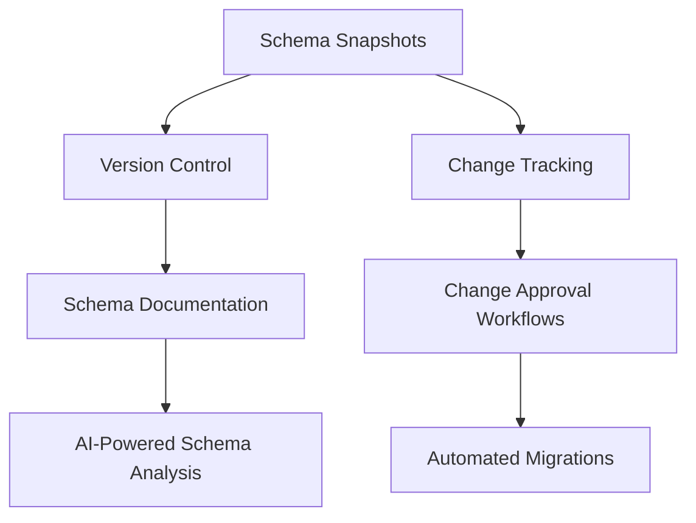
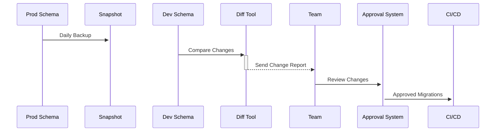

# Supabase Schema Management System

## Version History
- v1.0 (2025-09-15): Complete schema management solution for Supabase
- v1.0-RC1 (2025-09-15): Initial implementation with automated monitoring

## Overview
Integrated system for managing Supabase database schemas across environments with construction-specific validation rules and monitoring.

### Key Components:


---

## Schema Documentation References

### Essential Schema Documentation Files

**📋 Core Schema References for Schema Management:**

#### **Master Schema Guides**
- **[0300_DATABASE_SCHEMA_MASTER_GUIDE.md](../schema/0300_DATABASE_SCHEMA_MASTER_GUIDE.md)** - Master guide for database schema architecture and design patterns
- **[current-full-schema.md](../schema/current-full-schema.md)** - Authoritative current schema reference with all tables, columns, and relationships
- **[schema-part-01.md](../schema/schema-part-01.md)** - Core schema components and table definitions
- **[schema-part-02.md](../schema/schema-part-02.md)** - Advanced schema features and relationships
- **[schema-part-03.md](../schema/schema-part-03.md)** - Schema extensions and specialized tables

#### **Schema Management Scripts**
- **[update_schema.js](../schema/update_schema.js)** - Automated schema update utilities
- **[current-full-schema.sql](../schema/current-full-schema.sql)** - Executable SQL schema dump for validation
- **[extract_schema.sql](../schema/extract_schema.sql)** - Schema extraction queries
- **[run_schema_update.sh](../schema/run_schema_update.sh)** - Schema update automation script

### Schema Validation Workflow

**Pre-Schema Management Operations:**
```bash
# 1. Review current schema architecture
cat docs/schema/0300_DATABASE_SCHEMA_MASTER_GUIDE.md | head -50

# 2. Check current full schema reference
grep -A 5 "Foreign Keys" docs/schema/current-full-schema.md

# 3. Validate table relationships
grep -A 10 "RLS Policies" docs/schema/current-full-schema.md

# 4. Review RLS policies and security
grep -A 5 "RLS Policies" docs/schema/current-full-schema.md
```

**Post-Schema Management Validation:**
```bash
# 1. Extract updated schema
node docs/schema/extract_schema.js

# 2. Validate against master guide
# Compare changes with 0300_DATABASE_SCHEMA_MASTER_GUIDE.md

# 3. Update schema documentation
# Ensure current-full-schema.md reflects changes

# 4. Run security audit
# Verify RLS policies are intact
```

## 🗂 Schema Version Control System

### Daily Schema Snapshots
```bash
#!/bin/bash
# save_schema_snapshot.sh
TIMESTAMP=$(date +%Y%m%d%H%M%S)
PG_DUMP_CMD="pg_dump --schema-only -U $SUPABASE_USER -h $SUPABASE_HOST -d $SUPABASE_DB"
$PG_DUMP_CMD > schemas/snapshot_${TIMESTAMP}.sql
```

### Schema Validation Rules
```js
// schema_validation_rules.js
module.exports = {
  required_tables: [
    'projects',
    'documents',
    'contracts',
    'organizations',
    'users'
  ],
  
  construction_schema_standards: {
    contracts: {
      required_columns: ['project_id', 'value', 'start_date', 'status'],
      foreign_keys: ['project_id=>projects.id']
    },
    documents: {
      indexes: ['idx_document_project', 'idx_document_status'],
      constraints: ['document_number_unique']
    }
  }
};
```

---

## 🔄 Schema Change Management

### Schema Diff Workflow


---

## 🛠 Implementation Scripts

### Schema Comparison Tool
```js
// supabase-schema-toolkit.js
const { diff } = require('json-diff');
const db = require('./supabase-client');

class SchemaManager {
  async getCurrentSchema() {
    return db.query(`
      SELECT table_name, column_name, data_type 
      FROM information_schema.columns 
      WHERE table_schema = 'public'
    `);
  }

  async generateDiff(oldSchema, newSchema) {
    return diff(oldSchema, newSchema);
  }

  validateSchema(schema) {
    const rules = require('./schema_validation_rules');
    // Validation logic
  }
}
```

### Automated Monitoring Script
```bash
#!/bin/bash
# check_schema_changes.sh
CURRENT_SCHEMA="schemas/current.json"
LAST_APPROVED="schemas/approved.json"

npx supabase gen types typescript --schema public > $CURRENT_SCHEMA

if ! diff -q $CURRENT_SCHEMA $LAST_APPROVED; then
  send_alert "Schema changes detected!"
  generate_diff_report
fi
```

---

## 📈 Monitoring & Alerts

### Schema Health Dashboard
```js
// schema-monitoring.js
const alerts = {
  missing_indexes: {
    query: `SELECT * FROM pg_indexes WHERE tablename = $1`,
    threshold: 3
  },
  table_growth: {
    query: `SELECT count(*) FROM $1`,
    warning: 1000000,
    critical: 5000000
  }
};

module.exports = { alerts };
```

### Alert Integration
```yaml
# .github/workflows/schema-checks.yml
name: Schema Monitoring
on:
  schedule:
    - cron: "0 8 * * 1-5" # Weekdays at 8am

jobs:
  schema-check:
    runs-on: ubuntu-latest
    steps:
      - uses: actions/checkout@v4
      - run: npm install
      - run: ./check_schema_changes.sh
```

---

## 📚 Integrated Documentation

### Schema Reference Guide
```markdown
### Projects Table
- **Description:** Core construction project tracking
- **Relations:**
  - `contracts.project_id → projects.id`
  - `documents.project_id → projects.id`
- **Indexes:**
  - `idx_projects_status`: (status)
  - `idx_projects_org`: (organization_id)
```

### Data Dictionary
```sql
CREATE TABLE data_dictionary (
  table_name VARCHAR(255),
  column_name VARCHAR(255),
  data_type VARCHAR(50),
  description TEXT,
  example_value VARCHAR(255),
  -- Inherited from document management schema
  PRIMARY KEY (table_name, column_name)
);
```

---

## 🔐 Security & Compliance

### Schema Access Control
```sql
-- Row Level Security Policies
CREATE POLICY projects_org_policy ON projects
  USING (organization_id = current_setting('app.current_org_id'));

-- Audit Triggers
CREATE TRIGGER schema_changes_trigger
  AFTER DDL ON DATABASE
  EXECUTE PROCEDURE log_schema_change();
```

---

## 🚀 Implementation Roadmap

1. **Phase 1 (Week 1):** Schema Snapshot System
   - Daily automated backups
   - Basic diff reporting
   - Email alerts

2. **Phase 2 (Week 2):** Validation Framework
   - Construction-specific rules
   - CI/CD integration
   - Documentation generator

3. **Phase 3 (Week 3):** Advanced Monitoring
   - Performance metrics
   - Predictive scaling alerts
   - AI drift detection
