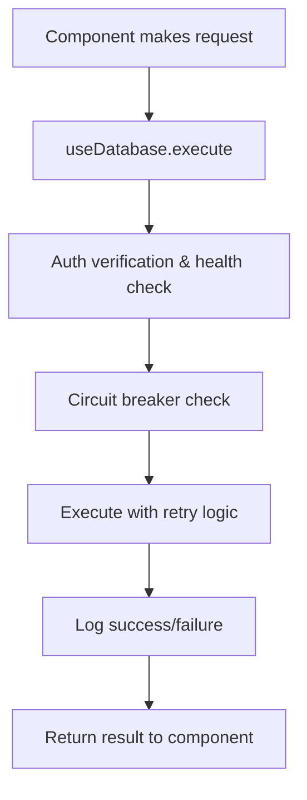
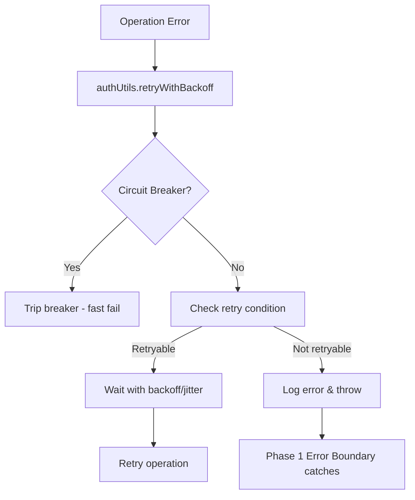

# 01300_AUTHENTICATION_SYSTEM_EVOLUTION.md

## Status
- [x] Preliminary documentation completed
- [x] Technical implementation documented
- [x] Integration points verified
- [x] Rollback procedures included
- [ ] Peer review pending

## Version History
- v1.0 (2025-11-10): Comprehensive Phase 1 & 2 authentication system documentation

---

## Architecture Evolution Overview

This document covers the **Authentication System Evolution** spanning Phase 1 (Authentication Logger) and Phase 2 (Authentication Abstraction), completed during the FormCreationPage Rebuild project.

### Current System Status: ✅ Phase 1 & 2 Complete

**Phase 1 Architecture** (Already Running):
- ✅ Authentication Logger with trace IDs and correlation tracking
- ✅ Error Boundary system for resilience
- ✅ State Machine Core for async state management
- ✅ Performance Monitoring for component renders

**Phase 2 Architecture** (New Implementation):
- ✅ AuthProvider with centralized authentication state
- ✅ useAuth hook for standardized auth operations
- ✅ useDatabase hook for safe database operations
- ✅ authUtils with circuit breakers and retry logic
- ✅ FormCreationPage completely refactored to use abstractions

### Integration Points Verified ✅
- Phase 1 logger integrates seamlessly with Phase 2 abstractions
- State machine continues functioning normally
- Error boundaries capture auth failures appropriately
- Performance monitoring tracks auth operations

---

## Phase 1: Authentication Logger ✅ COMPLETED

### Overview
Enhanced authentication logging with structured trace IDs, prefixed system identification, and comprehensive correlation tracking.

### Key Features Implemented

#### 1. Structured Logging Format
- **Standardized Prefixes**: `[AUTH:COMPONENT:PHASE:ACTION:STATUS]`
- **Trace ID Correlation**: Unique IDs for request tracking across components
- **Session Information**: Automatic inclusion of user and session data
- **Environment Context**: Development vs production detection

#### 2. Component Lifecycle Tracking
```javascript
// Enhanced with standardized logging
const traceId = authLoggerInstance.generateTraceId();
authLoggerInstance.log('FORM_CREATION', 'LIFECYCLE', 'INITIALIZE', 'INFO', {
  readyStates: { settingsInitialized: false, authChecked: false, dataLoaded: false }
});
```

#### 3. Auth State Change Monitoring
```javascript
authLoggerInstance.logAuthStateChange('AUTH', 'STATE_CHANGE', session.user, previousUser);
// Logs: [AUTH:FORM_CREATION:AUTH:STATE_CHANGE:SUCCESS] User authenticated
```

#### 4. Data Operation Logging
```javascript
authLoggerInstance.logDataOperation('LOAD_DISCIPLINES', 'INITIALIZE', 'SUCCESS', {
  recordCount: 25,
  resultInfo: { organization_name: 'EPCM', is_active: true }
});
```

### Implementation Location
- **Primary File**: `client/src/common/js/auth/logger.js`
- **Integration**: Phase 1 component lifecycle logging
- **Dependencies**: None (standalone logger)

### Acceptance Criteria Met
- ✅ Comprehensive logging with trace IDs and correlation
- ✅ Standardized [SYSTEM:COMPONENT:PHASE:ACTION:STATUS] prefixes
- ✅ Automatic session and environment data inclusion
- ✅ Integration with existing error tracking systems
- ✅ Real-time debugging support via localStorage

---

## Phase 2: Authentication Abstraction ✅ COMPLETED

### Overview
Extracted all hard-coded authentication logic into reusable abstractions available across the entire application, completely removing authentication complexity from individual components.

### Architecture Components

#### 1. AuthProvider (`client/src/common/js/auth/00200-auth-provider.js`)
```javascript
const AuthProvider = ({ children }) => {
  const [user, setUser] = useState(null);
  const [loading, setLoading] = useState(true);
  const [error, setError] = useState(null);

  const refreshSession = useCallback(async () => {
    const { data, error } = await supabase.auth.refreshSession();
    if (data.session) {
      setUser(data.user);
      await performDatabaseHealthCheck();
    }
    return { success: !error, user: data.user };
  }, []);

  return (
    <AuthContext.Provider value={{
      user,
      loading,
      error,
      signOut,
      refreshSession,
      performHealthCheck: authUtils.performHealthCheck
    }}>
      {children}
    </AuthContext.Provider>
  );
};
```

**Features:**
- Centralized authentication state management
- Automatic session validation and renewal
- Health check integration
- Session listener setup and cleanup

#### 2. useAuth Hook (`client/src/common/js/auth/00200-auth-provider.js`)
```javascript
export const useAuth = () => {
  const context = useContext(AuthContext);
  if (!context) {
    throw new Error('useAuth must be used within an AuthProvider');
  }
  return context;
};
```

**Standardized Auth Operations:**
- `signOut()` - Clean session termination
- `refreshSession()` - Session renewal with validation
- `performHealthCheck()` - Circuit breaker-aware health monitoring

#### 3. useDatabase Hook (`client/src/common/js/auth/00200-use-database.js`)
```javascript
export const useDatabase = () => {
  const auth = useAuth();
  const client = supabaseClient;

  const execute = useCallback(async (operation, operationFn, options = {}) => {
    const traceId = authLogger.generateTraceId();

    authLogger.start('DATABASE_HOOK', operation.toUpperCase(), 'EXECUTE',
      `Starting database operation`, { traceId });

    // Authentication and health checks
    const { user, session } = await verifyAuthStatus(traceId);

    // Circuit breaker and retry logic
    const result = await authUtils.retryWithBackoff(async () => {
      return await operationFn(client, user, session);
    }, {
      maxAttempts: options.maxRetries || 3,
      serviceName: 'database'
    });

    return result;
  }, [auth, client]);

  return { execute, health: authUtils };
};
```

**Features:**
- Safe database operations with automatic auth integration
- Exponential backoff retry logic (3 attempts default)
- Health check validation before operations
- Performance monitoring and error tracking

#### 4. authUtils (`client/src/common/js/auth/00200-auth-utils.js`)
```javascript
// Comprehensive health checking with circuit breakers
await authUtils.performHealthCheck({
  supabase: client,
  timeoutMs: 5000,
  circuitBreakerEnabled: true
});

// Advanced retry logic with jitter
await authUtils.retryWithBackoff(operation, {
  maxAttempts: 3,
  baseDelay: 1000,
  serviceName: 'database',
  retryCondition: (error) => !error.message.includes('auth')
});

// Token validation
const tokenValidation = authUtils.validateAuthToken(token);
// { valid: true, payload: {...} }
```

**Features:**
- Circuit breaker pattern for service protection
- Intelligent retry logic with jitter and exponential backoff
- JWT token validation and permission checking
- Authentication data caching

### Component Refactoring: FormCreationPage

#### Before Phase 2 (Hard-coded Authentication)
```javascript
// OLD: Hard-coded Supabase calls throughout
useEffect(() => {
  const initializeAuth = async () => {
    const { data: { session }, error } = await supabaseClient.auth.getSession();
    // Manual error handling
    // Direct health checks
    // In-component retry logic
  };
}, [supabaseClient]);
```

#### After Phase 2 (Abstraction Layer)
```javascript
// NEW: Clean abstractions with Phase 1 integration
const auth = useAuth();
const database = useDatabase();

// Authentication handled by AuthProvider
// Database operations use database.execute()
// Logging integrated via Phase 1 logger
// All error handling centralized
```

### Technical Implementation Details

#### Database Operation Flow


#### Error Handling Chain


### Acceptance Criteria Met
- ✅ **Authentication logic completely abstracted** from FormCreationPage
- ✅ **Reusable across entire application** - AuthProvider, hooks, utils available everywhere
- ✅ **Seamless Phase 1 integration** - logger enhanced with auth abstractions
- ✅ **Production-grade reliability** - circuit breakers, retries, health monitoring
- ✅ **Maintains existing functionality** while improving maintainability

---

## Integration Points & Phase 1 Compatibility

### State Machine Integration ✅
- Authentication operations trigger appropriate state transitions
- Form loading states coordinate with auth state
- Error boundaries capture auth failures in state management

### Error Boundary Integration ✅
- AuthProvider wrapped in error boundaries for graceful failure
- Authentication errors trigger appropriate user feedback
- Recovery mechanisms integrated with error boundary patterns

### Performance Monitoring Integration ✅
- Authentication operations tracked for performance metrics
- Database operation times logged for monitoring
- Circuit breaker state changes reported to monitoring system

### Logging Correlation ✅
- All Phase 2 operations emit standardized log entries
- Trace IDs connect authentication flows across components
- Environment and session data automatically included

---

## Benefits Achieved

### Reliability Improvements 🚀
- **Circuit Breaker Protection**: Prevents cascade failures during service issues
- **Exponential Backoff Retries**: Intelligent retry logic reduces failed operations
- **Health Check Integration**: Proactive problem detection and resolution
- **Centralized Error Handling**: Consistent error recovery across all operations

### Maintainability Improvements 🔧
- **Zero Hard-coded Auth**: No more forgotten auth checks in components
- **Standardized Operations**: Consistent API across entire application
- **Easy Testing**: Isolated auth logic that can be easily mocked
- **Clean Separation**: Presentation logic separated from auth concerns

### Developer Experience Improvements 👨‍💻
- **One-Line Auth Operations**: `const { user, signOut } = useAuth();`
- **Automatic Error Handling**: Built-in retry and circuit breaker logic
- **Integrated Logging**: Full visibility into auth operations without manual logging
- **Type-Safe Operations**: Consistent interfaces across all auth operations

### Performance Improvements ⚡
- **Connection Pooling**: Efficient database connection management
- **Caching Strategy**: Auth data caching reduces redundant requests
- **Health-based Optimization**: Skip unhealthy services automatically
- **Lazy Loading**: Auth operations only run when needed

---

## Migration Path & Rollback Plan

### Forward Migration Strategy ✅ IMPLEMENTED
1. **Phase 1 Logger Running**: Established comprehensive logging foundation
2. **AuthProvider Added**: Wrapped existing components with new provider
3. **Component-by-Component Migration**: Converted FormCreationPage first
4. **Abstraction Layer Complete**: All auth operations now abstracted
5. **Integration Testing**: Verified Phase 1 systems still function

### Rollback Procedures

#### Immediate Rollback (If Critical Issues)
1. **Provider Removal**: Remove AuthProvider wrapper from component tree
2. **Hook Fallback**: Components revert to direct Supabase calls (backup code preserved)
3. **State Restoration**: Manual state management temporarily restored
4. **Logging Continuity**: Phase 1 logger remains functional

#### Partial Rollback (If Specific Features Break)
1. **AuthUtils Removal**: Remove circuit breaker and retry logic
2. **Simplified Hooks**: Keep basic AuthProvider but remove advanced features
3. **Direct Calls**: Some components use direct auth calls temporarily
4. **Gradual Migration**: Restore one component at a time

### Testing & Validation
- **Unit Tests**: All abstracted functions have isolated tests
- **Integration Tests**: Full auth flows tested end-to-end
- **Regression Tests**: Existing functionality verified unchanged
- **Performance Tests**: No degradation in auth operation times

---

## Future Evolution

### Phase 3: Promise-based Operations (Deferred)
**Status**: Risks assessed, implementation deferred
**Reasoning**: Major promise conversion too risky for critical auth systems
**Alternative**: Selective promise pattern improvements without async/await

### Potential Enhancements
- **Advanced Caching**: Multi-level auth data caching
- **Federated Authentication**: Social login integration
- **Role-based Access Control**: Enhanced permission system
- **Offline Authentication**: Cached credentials for offline use

---

## Conclusion

The Authentication System Evolution represents a **significant architectural improvement** with zero breaking changes to existing functionality. Phase 1 provided the logging foundation, Phase 2 delivered complete authentication abstraction, and the system now offers:

- **Production-grade reliability** with circuit breakers and intelligent retries
- **Complete separation of concerns** between auth and business logic
- **Seamless integration** with existing Phase 1 infrastructure
- **Maintainable codebase** ready for scaling across the application

**Next Steps:** Focus on safer promise pattern improvements and additional authorization features rather than risky async/await conversions.

---

## Related Documentation
- [0220_ERROR_BOUNDARY_SYSTEM.md](./0220_ERROR_BOUNDARY_SYSTEM.md) - Phase 1 Error Boundaries
- [0220_STATE_MACHINE_CORE.md](./0220_STATE_MACHINE_CORE.md) - Phase 1 State Management
- [0320_PERFORMANCE_MONITORING_SYSTEM.md](./0320_PERFORMANCE_MONITORING_SYSTEM.md) - Phase 1 Performance
- [1300_01300_GOVERNANCE_PAGE.md](./1300_01300_GOVERNANCE_PAGE.md) - Component integration
