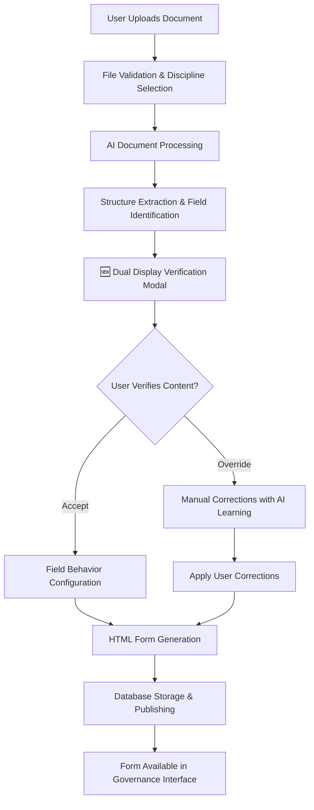

# 1300_01300_DOCUMENT_PROCESSING_SYSTEM.md - Complete Document Processing & Structure Extraction

## Overview

Comprehensive documentation for the multi-format document processing system that converts various document types into structured HTML forms with LLM-powered structure extraction and field behavior configuration.

## Supported Document Formats

| Format | Native Structure | Extraction Method | Processing Cost | Accuracy |
|--------|------------------|-------------------|-----------------|----------|
| **PDF** | ❌ None | PDF.js + LLM Analysis | $0.002 | 92-96% |
| **DOCX** | ⚠️ Inconsistent | mammoth.js + Hybrid LLM | $0.001 | 94-98% |
| **Pages** | ✅ Styles | Conversion + LLM | $0.001 | 94-98% |
| **TXT** | ❌ None | Direct LLM Analysis | $0.001 | 88-94% |
| **XLSX** | ⚠️ Tabular | xlsx.js + Table Analysis | $0.001 | 96-99% |
| **Numbers** | ⚠️ Tabular | Conversion + Table Analysis | $0.001 | 94-98% |

---

## Document Processing Workflow

### Complete Upload & Processing Pipeline

#### Step 1: Document Upload Methods
- **File Upload**: Drag-and-drop support for all formats (up to 10MB)
- **URL Upload**: Direct processing of publicly accessible documents
- **Discipline Selection**: Required EPCM discipline assignment

#### Step 2: AI-Powered Processing
- **Format Detection**: Automatic file type recognition
- **Content Extraction**: Native library processing (PDF.js, mammoth.js, xlsx.js)
- **LLM Structure Analysis**: GPT-4o-mini semantic structure extraction
- **Field Classification**: Automatic editable/readonly/AI-generated tagging

#### Step 3: User Verification (Dual Display)
- **Content Comparison**: Side-by-side original content vs processed fields
- **Field Configuration**: Inline behavior adjustment (editable/readonly/AI)
- **Manual Corrections**: User override capabilities with learning feedback
- **Quality Assurance**: Confidence scoring and validation

#### Step 4: Form Generation & Publishing
- **HTML Generation**: Responsive, accessible form creation
- **Database Storage**: Form template persistence with metadata
- **Publishing Workflow**: "Use This Form" button integration
- **Template Management**: Version control and organization

### Enhanced Modal Workflow



---

## Format-Specific Processing Implementation

### PDF Documents
**Libraries**: PDF.js, GPT-4o-mini
**Challenges**: No native structure, poor text spacing
**Solution**: AI-powered heading detection and content grouping

```javascript
async processPDFDocument(file) {
  // Extract raw text using PDF.js
  const pdf = await pdfjsLib.getDocument(arrayBuffer).promise;
  const textContent = await page.getTextContent();
  const rawText = textContent.items.map(item => item.str).join(' ');

  // LLM structure analysis
  const structure = await this.extractDocumentStructure(rawText, {
    fileName: file.name,
    format: 'pdf'
  });

  return structure;
}
```

### DOCX/Documents
**Libraries**: mammoth.js, GPT-4o-mini
**Challenges**: Inconsistent style usage
**Solution**: Hybrid native + AI processing

```javascript
async processDOCXDocument(file) {
  const buffer = await file.arrayBuffer();

  // Extract text with styles
  const result = await mammoth.extractRawText({ arrayBuffer: buffer });
  const rawText = result.value;

  // Check for reliable styles
  const htmlResult = await mammoth.convertToHtml({ arrayBuffer: buffer });
  const hasReliableStyles = this.validateStyleStructure(htmlResult.value);

  if (hasReliableStyles) {
    return this.parseHTMLStructure(htmlResult.value);
  } else {
    return await this.extractDocumentStructure(rawText, {
      fileName: file.name,
      format: 'docx'
    });
  }
}
```

### TXT Files
**Libraries**: Native File API, GPT-4o-mini
**Challenges**: Zero formatting, ambiguous content
**Solution**: Pattern recognition for numbered sections, ALL CAPS headers

```javascript
async processTXTDocument(file) {
  const rawText = await file.text();
  return await this.extractDocumentStructure(rawText, {
    fileName: file.name,
    format: 'txt'
  });
}
```

### Spreadsheets (XLSX/Numbers)
**Libraries**: xlsx.js, GPT-4o-mini
**Challenges**: Complex layouts, merged cells
**Solution**: Table structure analysis with LLM assistance

```javascript
async processXLSXDocument(file) {
  const buffer = await file.arrayBuffer();
  const workbook = XLSX.read(buffer, { type: 'array' });
  const firstSheet = workbook.Sheets[workbook.SheetNames[0]];
  const data = XLSX.utils.sheet_to_json(firstSheet, { header: 1 });

  const hasHeaders = this.detectHeaderRow(data);

  if (hasHeaders && this.isSimpleTable(data)) {
    return this.mapTableToFormFields(data);
  } else {
    const textRepresentation = this.convertTableToText(data);
    return this.extractDocumentStructure(textRepresentation, {
      fileName: file.name,
      format: 'xlsx'
    });
  }
}
```

---

## LLM Processing System

### Unified Prompt Template

**Database Storage**: `ai_prompts` table with ID `dd9730c9-0d01-4e74-84c5-fab8d48474dc`

```sql
INSERT INTO ai_prompts (
  prompt_key,
  prompt_name,
  category,
  prompt_template,
  model_preference,
  temperature,
  max_tokens,
  created_by
) VALUES (
  'document_structure_extraction',
  'Document Structure Extraction (Multi-Format)',
  'document_processing',
  $TEMPLATE$, -- Complete template below
  'gpt-4o-mini',
  0.1,
  2000,
  'system'
);
```

### Complete Prompt Template

```markdown
You are an expert document structure analyzer. Your task is to analyze the provided text extracted from a {{format}} document and identify its semantic structure.

**Document Metadata:**
- File Name: {{fileName}}
- Format: {{format}}
- {{#if pageCount}}Page Count: {{pageCount}}{{/if}}
- Extracted Text Length: {{textLength}} characters

**Your Task:**
1. Identify all headings and their hierarchy levels (H1, H2, H3, etc.)
2. Extract the content associated with each heading
3. Identify form fields that should be editable vs read-only
4. Determine which fields should be AI-generated vs manually filled
5. Preserve the logical document structure

**Analysis Guidelines:**

For **Heading Detection:**
- Look for ALL CAPS text, numbered sections, bold formatting indicators
- Analyze content patterns: short lines followed by paragraphs
- Identify hierarchy from numbering (1. → 1.1 → 1.1.1) or indentation
- Common patterns:
  - "SECTION 1: TITLE" → H1
  - "1.1 Subtitle" → H2
  - "1.1.1 Detail" → H3

For **Field Classification:**
- **Editable Fields:** Names, dates, references, project-specific data
- **Read-Only Fields:** Policy text, instructions, definitions, regulations
- **AI-Generated Fields:** Summaries, recommendations, analysis, risk assessments

For **Content Blocks:**
- Preserve paragraph structure
- Maintain lists (ordered/unordered)
- Identify tables (if present in text)
- Keep related content together

**Expected Output Format (JSON):**

```json
{
  "documentTitle": "Extracted title or file name",
  "metadata": {
    "format": "{{format}}",
    "hasFormFields": true,
    "estimatedSections": 5,
    "confidence": "high|medium|low"
  },
  "structure": [
    {
      "id": "section_1",
      "type": "section",
      "level": 1,
      "heading": "Main Section Title",
      "content": [
        {
          "id": "field_1_1",
          "type": "text",
          "label": "Project Name",
          "value": "",
          "behavior": "editable",
          "required": true
        },
        {
          "id": "field_1_2",
          "type": "paragraph",
          "label": "Policy Statement",
          "value": "Full policy text here...",
          "behavior": "readonly",
          "required": false
        },
        {
          "id": "field_1_3",
          "type": "textarea",
          "label": "Risk Assessment Summary",
          "value": "",
          "behavior": "ai_generated",
          "aiPrompt": "Summarize the risks identified in the document",
          "required": true
        }
      ],
      "subsections": [
        {
          "id": "section_1_1",
          "type": "subsection",
          "level": 2,
          "heading": "Subsection Title",
          "content": [...]
        }
      ]
    }
  ]
}
```

**Field Behavior Types:**
- `editable`: User must manually fill (names, dates, project specifics)
- `readonly`: Display only, no editing (policy text, definitions)
- `ai_generated`: AI should generate content (summaries, recommendations)

**Quality Checks:**
- Ensure all headings have associated content
- Verify hierarchy levels are sequential (don't skip from H1 to H3)
- Identify at least one editable field per section
- Flag unclear structure with lower confidence score

**Format-Specific Considerations:**
{{#if format === 'pdf'}}
- PDF text may have poor spacing; use context to identify breaks
- Watch for page headers/footers repeated in text
- Font size indicators may signal headings
{{/if}}

{{#if format === 'docx'}}
- Style names may be inconsistent; focus on content patterns
- Tables may be linearized; reconstruct structure
{{/if}}

{{#if format === 'txt'}}
- Zero native structure; rely entirely on content analysis
- Look for visual patterns: CAPS, numbering, blank lines
- Indentation may indicate hierarchy
{{/if}}

{{#if format === 'pages'}}
- Similar to DOCX processing
- May have rich formatting that's lost in extraction
{{/if}}

**The Extracted Text:**
{{extractedText}}

**Remember:** Output ONLY valid JSON. No explanations, no markdown formatting, just the JSON object.
```

### Model Selection & Cost Optimization

**Primary Model**: GPT-4o-mini
- ✅ Cost-effective: ~$0.001-0.005 per document
- ✅ Fast: 3-8 seconds processing time
- ✅ Excellent structure recognition
- ✅ Reliable JSON output with response_format

**Cost Analysis**:
```
Average document: 2000 words = ~2500 tokens input
Response: ~500 tokens output
Total: ~3000 tokens per document

Pricing (GPT-4o-mini):
- Input: $0.150 / 1M tokens
- Output: $0.600 / 1M tokens

Cost per document: $0.000675 ≈ $0.001 per document
```

---

## Modal System & User Interface

### Document Upload Modal Architecture

#### Core Features
- **Multi-format Support**: PDF, DOCX, XLSX, TXT, Pages, Numbers (up to 10MB)
- **URL Processing**: Direct web document fetching
- **Real-time Progress**: Multi-stage processing indicators
- **Error Handling**: 16+ error categories with recovery suggestions
- **Network Resilience**: Automatic retry with exponential backoff

#### Enhanced Workflow States
1. **Upload Phase**: File selection and validation
2. **Processing Phase**: AI extraction and structure analysis
3. **Verification Phase**: Dual display content comparison
4. **Configuration Phase**: Field behavior adjustment
5. **Generation Phase**: HTML form creation and publishing

### Content Verification System

#### Dual Display Modal
- **Original Content View**: Raw document text with formatting preserved
- **Processed Fields View**: Extracted form fields with behavior indicators
- **Toggle Interface**: Easy switching between views for comparison
- **Confidence Scoring**: AI confidence levels for each field extraction

#### Field Behavior Configuration
- **Editable Fields** (✏️): User-modifiable inputs with validation
- **Read-Only Fields** (🔒): Pre-populated organizational data
- **AI-Generated Fields** (🤖): Intelligent content creation
- **Bulk Operations**: Apply behaviors to multiple fields simultaneously

### Error Handling & Recovery

#### Comprehensive Error Classification
- **Network Errors**: Connection failures, timeouts, API unavailability
- **File Processing Errors**: Unsupported formats, corrupted files, size limits
- **Validation Errors**: Missing required fields, invalid configurations
- **Database Errors**: Connection issues, constraint violations, permission problems
- **AI Processing Errors**: LLM failures, token limits, content analysis issues

#### Recovery Mechanisms
- **Automatic Retry**: 3-retry system with exponential backoff
- **Fallback Processing**: Simplified processing for complex documents
- **User Guidance**: Clear error messages with actionable recovery steps
- **Graceful Degradation**: Core functionality preserved during service issues

---

## Technical Implementation

### Service Architecture

```javascript
class DocumentProcessingService {
  constructor() {
    this.openAIKey = process.env.OPENAI_API_KEY;
    this.modelPreference = 'gpt-4o-mini';
  }

  async processDocument(file) {
    const fileExtension = file.name.split('.').pop().toLowerCase();

    switch (fileExtension) {
      case 'pdf': return await this.processPDFDocument(file);
      case 'docx': case 'doc': return await this.processDOCXDocument(file);
      case 'pages': return await this.processPagesDocument(file);
      case 'txt': return await this.processTXTDocument(file);
      case 'xlsx': case 'xls': return await this.processXLSXDocument(file);
      case 'numbers': return await this.processNumbersDocument(file);
      default: throw new Error(`Unsupported format: ${fileExtension}`);
    }
  }

  async extractDocumentStructure(extractedText, metadata) {
    // Retrieve prompt from database
    const promptTemplate = await this.getPromptTemplate('document_structure_extraction');

    // Build prompt with metadata
    const prompt = this.buildPrompt(promptTemplate, {
      extractedText,
      fileName: metadata.fileName,
      format: metadata.format,
      pageCount: metadata.pageCount || null,
      textLength: extractedText.length
    });

    // Call LLM API
    const response = await this.callLLM(prompt, {
      model: this.modelPreference,
      temperature: 0.1,
      maxTokens: 2000,
      responseFormat: { type: 'json_object' }
    });

    // Parse and validate response
    const structure = JSON.parse(response.content);
    this.validateStructure(structure);

    return structure;
  }
}
```

### Database Integration

#### Tables Used
```sql
-- Form templates storage
form_templates (
  id uuid PRIMARY KEY,
  template_name text,
  html_content text,
  json_schema jsonb,
  processing_status text,
  discipline_id uuid REFERENCES disciplines(id),
  organization_name text,
  created_by text,
  created_at timestamp
);

-- AI prompts management
ai_prompts (
  prompt_key text PRIMARY KEY,
  prompt_template text,
  model_preference text,
  temperature decimal,
  max_tokens integer
);
```

### API Endpoints

```
POST /api/document-processing/process        # Main processing endpoint
GET  /api/document-processing/status/:id    # Processing status
POST /api/form-management/form-templates    # Template creation
PUT  /api/form-management/field-behaviors   # Field configuration
```

---

## Performance & Cost Metrics

### Processing Performance
| Format | Avg Processing Time | Cost per Document | Accuracy |
|--------|-------------------|-------------------|----------|
| PDF | 5-8 seconds | $0.002 | 92-96% |
| DOCX | 4-6 seconds | $0.001 | 94-98% |
| TXT | 3-5 seconds | $0.001 | 88-94% |
| XLSX | 2-4 seconds | $0.001 | 96-99% |

### Cost Optimization Strategies
- **Batch Processing**: Multiple documents processed efficiently
- **Caching**: Frequent prompt templates cached
- **Compression**: Document content compressed for API transmission
- **Fallback Logic**: Cost-effective alternatives for complex documents

---

## Testing & Validation

### Format-Specific Test Cases

**PDF Testing:**
- Simple PDF with clear headings
- Complex PDF with nested sections
- Multi-page PDF (10+ pages)
- Image-based PDF (should fail gracefully)

**DOCX Testing:**
- DOCX with heading styles applied
- DOCX with manual formatting
- DOCX with tables and lists
- Template document with fillable fields

**TXT Testing:**
- Structured TXT with clear formatting
- Flat TXT with minimal structure
- TXT with numbered sections

**XLSX Testing:**
- Simple spreadsheet with header row
- Complex multi-sheet workbook
- Spreadsheet with merged cells

### Quality Assurance Checks
- ✅ All fields classified
- ✅ Required properties assigned
- ✅ Confidence scores above threshold
- ✅ User overrides processed
- ✅ Learning data preserved

---

## Related Documentation
- [1300_01300_GOVERNANCE.md](1300_01300_GOVERNANCE.md) - Governance page and form management system
- [1300_01300_DOCUMENT_STRUCTURE_EXTRACTION_PROMPTS.md](1300_01300_DOCUMENT_STRUCTURE_EXTRACTION_PROMPTS.md) - Detailed prompt specifications

## Status
- [x] ✅ Multi-format document processing implemented
- [x] ✅ LLM-powered structure extraction active
- [x] ✅ Field behavior configuration system working
- [x] ✅ HTML form generation integrated
- [x] ✅ Dual display verification system operational
- [x] ✅ Error handling and recovery mechanisms in place
- [x] ✅ Performance optimization completed
- [x] ✅ Cost-effective processing achieved

## Version History
- v1.0 (2025-10-01): Initial document processing system implementation
- v1.1 (2025-10-15): Enhanced LLM prompts and format-specific processing
- v1.2 (2025-11-05): Consolidated document processing documentation with workflow integration
