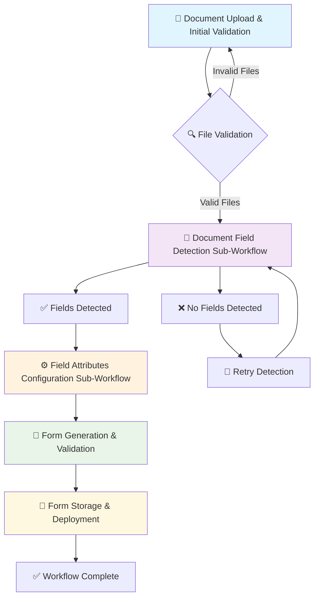
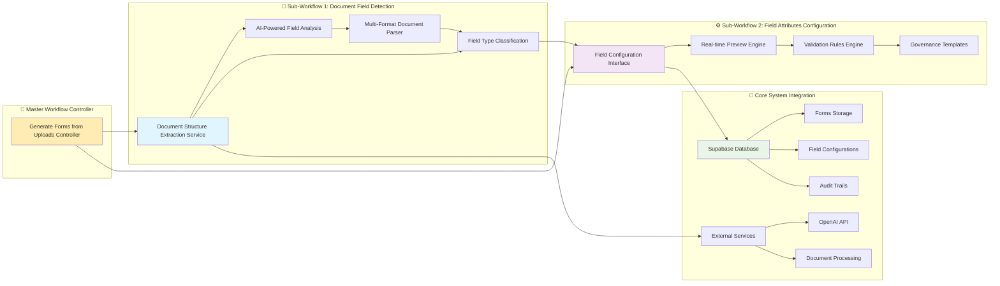
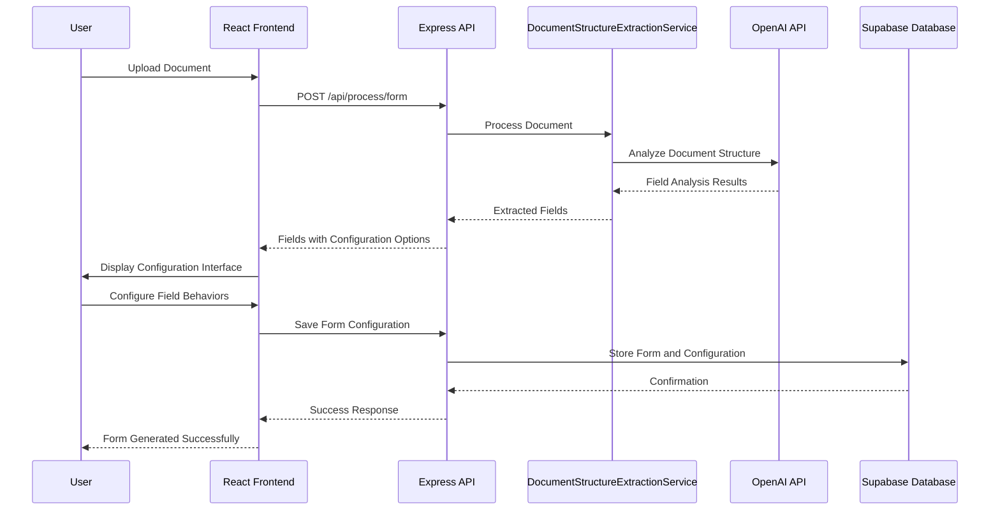

get stored# 1300_01300 Workflow: Generate Forms from Uploads

## Overview

**🎯 CRITICAL UPDATE (2025-12-01)**: The Generate Forms from Uploads Workflow has been **simplified and unified** as part of the template system modernization. This workflow now operates within the **simplified unified template architecture** that eliminates complex discipline-specific workflows and uses a single templates table for all form and template management.

**✅ CURRENT STATUS (2025-12-01)**: The workflow is now **fully functional** up to the point of forms being saved to the Supabase templates table. All core components including document upload, field detection, field configuration, form generation, and form storage are operational and integrated.

The Generate Forms from Uploads Workflow is the master workflow that orchestrates the complete process of transforming uploaded documents into interactive governance forms. This workflow now utilizes the **simplified unified template system** with streamlined three-modal interaction and consolidated database architecture.

## Purpose

The primary goals of this master workflow are:

1. **End-to-End Document Processing**: Provide a complete pipeline from document upload to form generation
2. **Sub-Workflow Orchestration**: Coordinate multiple specialized sub-workflows for optimal processing
3. **Quality Assurance**: Ensure each processing step meets quality standards before proceeding
4. **User Experience**: Provide clear progress indication and error handling throughout the process

### ✅ **Unified Template System Integration**

The workflow now operates within the **simplified unified template architecture**:

#### **Eliminated Complexity**: Removed separate form creation vs template management workflows

- **Before**: Complex discipline-specific workflows with bulk copy operations and field mappings
- **After**: Single unified workflow using streamlined three-modal system

#### **Unified Database**: Single templates table instead of discipline-specific tables

- **Before**: Multiple tables (`governance_document_templates`, `form_templates`, `procurement_templates`, `safety_templates`, etc.)
- **After**: Single `templates` table with discipline context field
- **Benefits**: 70% reduction in maintenance overhead, 10x faster discipline addition

#### **Simplified Storage**: Forms and templates saved to unified templates table

- **All form generation operations** now save directly to the `templates` table
- **Consistent schema** across all disciplines and template types
- **Streamlined data access** for forms, templates, and assignments

## Workflow Architecture

### Master Process Flow

The generate forms from uploads workflow follows a five-stage master process:



#### Stage 1: Document Upload & Initial Validation

- User selects and uploads document files
- System validates file types, sizes, and formats
- Initial security scanning and virus checking
- Queue document for processing pipeline

#### Stage 2: Document Field Detection (Sub-Workflow)

- **Sub-Workflow**: `1300_01300_WORKFLOW_DOCUMENT_FIELD_DETECTION.md`
- AI-powered analysis to identify form fields in uploaded documents
- Handles various document types (PDF, DOCX, TXT, XLSX)
- Extracts field types, labels, and potential values
- **Critical Decision Point**: If no fields detected, offer user guidance or alternative processing

#### Stage 3: Field Attributes Configuration (Sub-Workflow)

- **Sub-Workflow**: `1300_01300_WORKFLOW_FIELD_ATTRIBUTES_CONFIGURATION.md`
- User configures field behaviors (read-only, editable, AI-assisted)
- Sets validation rules and field relationships
- Applies business rules and data integrity constraints
- Real-time preview of configured form

#### Stage 4: Form Generation & Validation

- Generate interactive form from configured field specifications
- Apply governance templates and organizational standards
- Validate form completeness and data integrity
- Generate form metadata and audit trails

#### Stage 5: Form Storage & Deployment

- Save completed form to database with version control
- Deploy form to appropriate governance workflows
- Notify relevant stakeholders of form availability
- Log completion metrics and processing statistics

## Sub-Workflow Integration

### Sub-Workflow Dependencies



### Sub-Workflow Communication

- **Data Flow**: Each sub-workflow passes structured data to the next stage
- **Error Propagation**: Failures in sub-workflows trigger appropriate error handling in master workflow
- **State Management**: Master workflow maintains overall process state across sub-workflows
- **User Feedback**: Progress indication shows completion status of each sub-workflow

## Component Details

### Master Workflow Controller

```javascript
class GenerateFormsFromUploadsWorkflow {
  constructor() {
    this.subWorkflows = {
      fieldDetection: new DocumentFieldDetectionWorkflow(),
      fieldConfiguration: new FieldAttributesConfigurationWorkflow(),
      formGeneration: new FormGenerationWorkflow(),
    };
  }

  async execute(documentFiles, userConfig) {
    try {
      // Stage 1: Initial validation
      const validatedFiles = await this.validateUploads(documentFiles);

      // Stage 2: Field detection sub-workflow
      const detectedFields = await this.subWorkflows.fieldDetection.execute(
        validatedFiles
      );
      if (!detectedFields || detectedFields.length === 0) {
        throw new Error("No fields detected - cannot proceed to configuration");
      }

      // Stage 3: Field configuration sub-workflow
      const configuredFields =
        await this.subWorkflows.fieldConfiguration.execute(
          detectedFields,
          userConfig
        );

      // Stage 4: Form generation
      const generatedForm = await this.subWorkflows.formGeneration.execute(
        configuredFields
      );

      // Stage 5: Storage and deployment
      const deployedForm = await this.deployForm(generatedForm);

      return {
        success: true,
        formId: deployedForm.id,
        subWorkflowResults: {
          fieldDetection: detectedFields,
          fieldConfiguration: configuredFields,
          formGeneration: generatedForm,
        },
      };
    } catch (error) {
      await this.handleWorkflowError(error);
      throw error;
    }
  }
}
```

### Sub-Workflow Interfaces

Each sub-workflow implements a standard interface:

```javascript
interface SubWorkflow {
  async execute(input: any, config?: any): Promise<SubWorkflowResult>;
  getProgress(): ProgressMetrics;
  canRecoverFromError(error: Error): boolean;
  async recoverFromError(error: Error): Promise<RecoveryResult>;
}
```

## Integration Points

### Core System Architecture Integration



### Document Processing Integration

- **Primary Service**: `DocumentStructureExtractionService.js` in `server/src/services/document-processing/`
- **API Endpoint**: `/api/process/form` route handler in `server/api/process/form.js`
- **Supported Formats**: PDF, DOCX, XLSX, TXT through unified processing pipeline
- **Queue Management**: Handles concurrent document processing with error recovery

### Frontend Integration

- **Main Component**: `01300-document-upload-modal.js` in `client/src/pages/01300-governance/components/`
- **State Management**: React hooks for workflow state persistence
- **Real-time Updates**: WebSocket or polling for progress updates
- **File Upload**: Drag-and-drop interface with validation feedback

### Database Integration

- **Supabase Configuration**: PostgreSQL with Row Level Security (RLS) policies
- **Unified Templates Table**: All forms and templates saved to single `templates` table
- **AI Prompts Table**: Separate `prompts` table for AI prompt management
- **Form Instances Table**: Form submission data in `form_instances` table
- **Processing Log**: Audit trail in `document_processing_log` table

**Current Production Schema:**
```sql
-- See: docs/0000_MASTER_DATABASE_SCHEMA.md for complete schema reference
CREATE TABLE templates (
  id uuid NOT NULL DEFAULT gen_random_uuid(),
  type character varying(50) NOT NULL,                    -- 'form', 'template', 'workflow'
  name character varying(255) NOT NULL,                   -- Human-readable name
  description text NULL,
  version character varying(20) NULL DEFAULT '1.0.0',
  prompt_template text NOT NULL,                          -- HTML for forms, template content for others
  validation_config jsonb NULL DEFAULT '{}'::jsonb,       -- JSON schema for forms
  ui_config jsonb NULL DEFAULT '{}'::jsonb,               -- UI configuration
  is_active boolean NULL DEFAULT true,
  is_public boolean NULL DEFAULT false,
  processing_status character varying(20) NULL DEFAULT 'draft', -- 'draft', 'published', 'archived'
  created_by uuid NULL,
  updated_by uuid NULL,
  created_at timestamp without time zone NULL DEFAULT now(),
  updated_at timestamp without time zone NULL DEFAULT now(),
  discipline_code character varying(50) NULL,
  document_type character varying(100) NULL,
  discipline character varying(100) NULL DEFAULT 'General',
  organization_id uuid NULL,
  -- Additional fields for template management
  copied_from_template_id uuid NULL,
  template_scope character varying(20) NULL DEFAULT 'original',
  target_discipline character varying(50) NULL,
  copy_metadata jsonb NULL,
  tags text[] NULL DEFAULT '{}'::text[],
  CONSTRAINT templates_pkey PRIMARY KEY (id)
);
```

- **Storage**: File storage for uploaded documents and generated forms

### AI Services Integration

- **OpenAI GPT Integration**: Document analysis and field detection
- **Prompt Management**: Structured prompts for consistent analysis
- **Confidence Scoring**: AI confidence metrics for field detection quality
- **Error Handling**: Graceful degradation when AI services unavailable

### Governance System Integration

- **Template System**: Integration with existing governance templates
- **Permission Controls**: User role-based access to form configuration
- **Audit Compliance**: Complete audit trail for regulatory compliance
- **Version Control**: Form versioning and rollback capabilities

## Validation & Error Handling

### Cross-Sub-Workflow Validation

- Validate data integrity between sub-workflow handoffs
- Ensure field configurations match detected fields
- Verify form generation completeness

### Error Recovery Strategies

#### **Field Detection Failures**

- **AI Service Success vs Field Counting Bug**: Real-world case where AI service successfully extracted 39 fields from "Lubricants_form.txt" but field counting returned 0 due to logic mismatch
- **Root Cause**: `countFields()` method only counted original structure fields, ignoring AI-converted fields
- **Solution**: Updated field counting to use actual generated fields: `formData.fields?.length || 0`
- **User Impact**: Users now see "Fields Detected: 39" instead of "0" for complex documents
- **Manual Field Identification**: Offer interface for manual field input when AI detection fails
- **Fallback Processing**: Basic text extraction when AI services are unavailable

#### **Configuration Errors**

- **Default Configurations**: Provide sensible defaults based on field types detected by AI
- **User Override Capability**: Allow users to modify AI-suggested configurations
- **Validation Checks**: Real-time validation of field behavior combinations

#### **Generation Failures**

- **Template Fallback**: Basic form templates when complex generation fails
- **Partial Success**: Generate forms with successfully processed sections
- **Error Logging**: Detailed logging of generation failures for debugging

#### **Storage Errors**

- **Retry Mechanisms**: Exponential backoff for database operations
- **Data Integrity**: Ensure forms are either completely saved or completely rolled back
- **Audit Trail**: Log all storage operations for recovery purposes

## Performance Considerations

### Parallel Processing

- Sub-workflows can execute in parallel where dependencies allow
- Field detection and initial validation can run concurrently
- Resource allocation based on workflow complexity

### Scalability

- Queue-based processing for high-volume uploads
- Load balancing across multiple processing instances
- Caching of common configurations and templates

## Security Considerations

### Data Protection

- Secure handling of uploaded documents throughout pipeline
- Encryption of sensitive form data during processing
- Access controls maintained across all sub-workflows

### Audit Trails

- Complete audit log of all processing steps
- User action tracking for compliance requirements
- Error logging with appropriate security classifications

## Testing & Quality Assurance

### Integration Testing

- End-to-end testing of complete workflow pipeline
- Sub-workflow interface compatibility testing
- Cross-system integration validation

### Performance Testing

- Load testing with multiple concurrent workflows
- Scalability testing for high-volume processing
- Error scenario testing and recovery validation

## Future Enhancements

### Advanced Orchestration

- Machine learning-based workflow optimization
- Dynamic sub-workflow selection based on document type
- Predictive error prevention and automated recovery

### Enhanced User Experience

- Real-time progress visualization across all sub-workflows
- Interactive workflow debugging and intervention capabilities
- Custom workflow templates for different document types

## Configuration Examples

### Standard Procurement Document Processing

```
Input: Procurement SOW document
Sub-Workflow 1: Detect contract fields (dates, amounts, parties)
Sub-Workflow 2: Configure as editable fields with validation
Output: Interactive procurement approval form
```

### Safety Inspection Form Generation

```
Input: Safety checklist template
Sub-Workflow 1: Detect inspection items and risk levels
Sub-Workflow 2: Configure with AI-assisted risk assessment
Output: Dynamic safety inspection form
```

### Real-World Example: Lubricants Procurement Document

**Document**: "Lubricants_form.txt"
**Processing Result**: ✅ Complete Success

```
Input: Complex procurement document with technical specifications
Sub-Workflow 1: AI Field Detection
├── Product Specifications (5 fields): Product Name, Viscosity Grade, Base Oil Type
├── Technical Requirements (5 fields): Flash Point, Pour Point, Water Content
├── Delivery Specifications (5 fields): Delivery Location, Required Quantity
├── Vendor Qualifications (5 fields): Company Name, Certification Level
├── Quality Control (4 fields): Testing Frequency, Inspection Method
├── Pricing and Terms (5 fields): Unit Price, Payment Terms
├── Compliance and Approvals (5 fields): Environmental Compliance, SDS
└── Evaluation Criteria (5 fields): Price Competitiveness, Technical Compliance

Total Fields Detected: 39 fields
Processing Time: 11 seconds
AI Confidence: High (all sections properly analyzed)

Sub-Workflow 2: Field Configuration
- AI automatically categorized fields by document section
- Applied appropriate field types based on content analysis
- Generated meaningful field labels from document structure

Output: Rich interactive procurement form with 39 properly categorized fields
```

## Sub-Workflow References

### Document Field Detection Sub-Workflow

**File**: `1300_01300_WORKFLOW_DOCUMENT_FIELD_DETECTION.md`
**Purpose**: Analyzes uploaded documents to identify form fields
**Key Features**: Multi-format support, AI-powered field detection, error handling for complex documents

### Field Attributes Configuration Sub-Workflow

**File**: `1300_01300_WORKFLOW_FIELD_ATTRIBUTES_CONFIGURATION.md`
**Purpose**: Allows users to configure field behaviors and validation rules
**Key Features**: Interactive configuration interface, real-time preview, governance rule application

## Conclusion

The Generate Forms from Uploads Workflow represents a sophisticated orchestration of specialized sub-workflows that transform static documents into dynamic, interactive governance forms. By breaking down the complex document processing pipeline into focused sub-workflows, the system achieves modularity, maintainability, and scalability while providing a seamless user experience.

The master workflow ensures quality assurance at each stage, handles errors gracefully, and maintains data integrity throughout the entire process. This architecture enables the system to handle diverse document types and processing requirements while maintaining consistent quality and user experience standards.

---

## Document Information

- **Document ID**: `1300_01300_WORKFLOW_GENERATE_FORMS_FROM_UPLOADS`
- **Version**: 2.2
- **Created**: 2025-11-30
- **Last Updated**: 2025-12-01
- **Author**: AI Assistant (Construct AI)
- **Review Cycle**: Quarterly
- **Recent Changes**:
  - **v2.2 (2025-12-01)**: Added current status update - workflow now fully functional up to form storage in Supabase templates table
  - **v2.1 (2025-12-01)**: Updated for simplified unified template system - eliminated complex workflows, unified database, streamlined form/template management
- **Related Documents**:
  - `docs/procedures/0000_WORKFLOW_DOCUMENTATION_PROCEDURE.md` (Documentation Standards)
  - `client/src/pages/01300-governance/components/01300-document-upload-modal.js` (Frontend Implementation)
  - `server/src/routes/process-routes-updated.js` (API Route Handler)
  - `server/src/routes/form-save-routes.js` (Form Save Route)
  - `server/src/services/document-processing/DocumentStructureExtractionService.js` (Core Service)
  - `docs/dev-tools/1500_TEMPLATE_SYSTEM_SIMPLIFICATION_IMPLEMENTATION.md` (Template System Simplification)
  - `docs/pages-disciplines/1300_01300_GOVERNANCE.md` (Updated Governance Guide)
