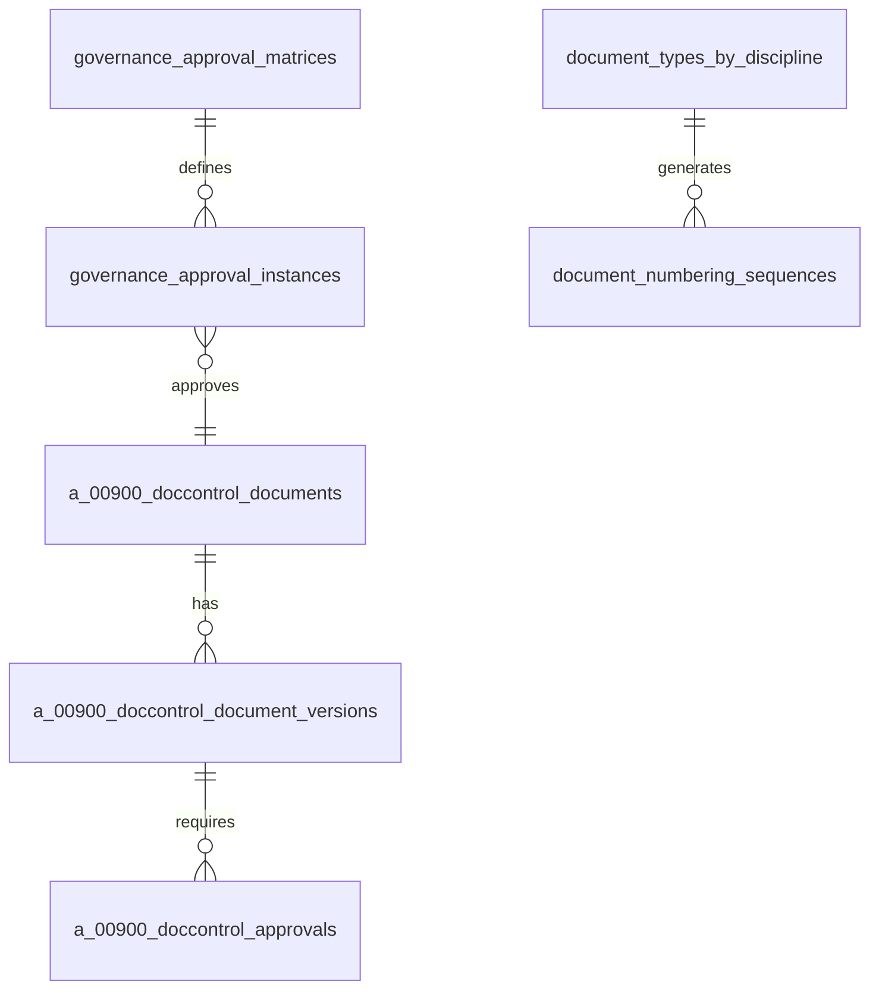

# 1300_9999_DOCUMENT_APPROVAL_WORKFLOW_MASTER_PLAN.md

## Status
- [x] Approved for implementation
- [x] Technical review completed
- [ ] Implementation in progress

## Version History
- v1.0 (2025-09-04): Comprehensive master plan for document approval workflow system

## Executive Summary

This master plan outlines the comprehensive implementation of a flexible document approval workflow system integrated with document versioning and numbering. The system provides client-specific approval matrices managed through the Governance department, with seamless integration into the existing document upload and numbering infrastructure.

### Business Objectives
- Enable client-specific document approval workflows
- Provide centralized approval matrix management
- Integrate version numbering with document numbers
- Maintain audit trails and compliance
- Support scalable, multi-tenant architecture

### Technical Scope
- **Approval Matrix Management**: Governance department page for configuring approval rules
- **Document Numbering Integration**: Version numbers included in document numbers
- **Flexible Workflow Engine**: Support for sequential/parallel approvals
- **Email Notifications**: Automated notifications with escalation
- **UI Integration**: Enhanced upload flows with approval previews
- **Database Integration**: Comprehensive schema for all document-related tables

---

## Current System Analysis

### Existing Infrastructure
1. **Document Numbering System**: Complete numbering system with discipline-specific patterns
2. **Version Control**: Major/minor/patch versioning with approval requirements
3. **Upload Flow**: 00200 all documents page with department-specific access
4. **Governance Department**: 01300 page structure for corporate governance
5. **Approvals Infrastructure**: Partially implemented approval schema and workflows

### Key Integration Points
- **Document Tables**: 30+ tables managing document lifecycle
- **Approval Workflow**: Multi-level approval chains with configurable rules
- **Email Integration**: Notification system for approval events
- **Storage Management**: Path-based storage with version organization

---

## Comprehensive Document Tables Reference

### Core Document Control Tables
| Table | Purpose | Key Fields |
|-------|---------|------------|
| **`a_00900_doccontrol_documents`** | Main document metadata | id, file_path, discipline, status, uploaded_by |
| **`a_00900_doccontrol_document_versions`** | Version history | document_id, version_number, file_path, uploaded_at |
| **`a_00900_doccontrol_data`** | Discipline metadata | document_id, transmittal_number, revision_code |
| **`a_00900_doccontrol_vector`** | AI embeddings | document_id, vector_data |

### Document Numbering System Tables
| Table | Purpose | Key Fields |
|-------|---------|------------|
| **`document_types_by_discipline`** | Type definitions | discipline_code, document_type, numbering_pattern |
| **`document_numbering_sequences`** | Sequence counters | document_type_id, sequence_key, current_number |
| **`document_numbering_methodologies`** | Numbering patterns | organization_id, methodology_name, pattern |
| **`document_number_audit_log`** | Numbering changes | document_id, old_number, new_number, changed_at |

### AI and Search Enhancement Tables
| Table | Purpose | Key Fields |
|-------|---------|------------|
| **`document_embeddings`** | AI search vectors | document_id, embedding_vector, chunk_text |
| **`document_stores`** | Flowise groupings | name, flowise_store_id, is_active |
| **`flowise_documents`** | Document tracking | flowise_id, document_id, store_id |
| **`flowise_record_manager`** | Sync status | document_id, flowise_record_id, sync_status |

### Approval and Workflow Tables
| Table | Purpose | Key Fields |
|-------|---------|------------|
| **`a_00900_doccontrol_approvals`** | Approval instances | document_id, version_id, approver_id, decision |
| **`a_00900_doccontrol_approval_rules`** | Rule definitions | document_type, approval_levels, conditions |
| **`a_00900_doccontrol_approval_rule_steps`** | Workflow steps | rule_id, step_order, approver_role |

### Specialized Document Tables
| Table | Purpose | Key Fields |
|-------|---------|------------|
| **`a_02400_contractor_vetting_documents`** | Contractor docs | id, contractor_id, document_type |
| **`contractor_vetting_document_versions`** | Version tracking | document_id, version_number, approval_status |
| **`contractor_vetting_document_hashes`** | Deduplication | document_id, hash_value, created_at |
| **`contractor_vetting_document_parts`** | Discrete parts | document_id, part_number, content |

### Governance and Access Control
| Table | Purpose | Key Fields |
|-------|---------|------------|
| **`governance_approval_matrices`** | Approval rules | organization_id, department_code, document_type |
| **`document_access`** | Access permissions | document_id, user_id, permission_level |
| **`document_department_access`** | Dept permissions | department_id, access_level |
| **`document_metadata`** | Extended metadata | document_id, metadata_type, value |

---

## Implementation Architecture

### Phase 1: Governance Approval Matrix (Week 1-2)

#### Database Schema
```sql
-- Governance Approval Matrices
CREATE TABLE governance_approval_matrices (
    id UUID PRIMARY KEY DEFAULT gen_random_uuid(),
    organization_id VARCHAR(255) NOT NULL,
    department_code VARCHAR(10) NOT NULL,
    document_type VARCHAR(100) NOT NULL,
    approval_levels JSONB NOT NULL,
    auto_approval_threshold DECIMAL(10,2),
    deadline_days INTEGER DEFAULT 7,
    escalation_rules JSONB,
    email_templates JSONB,
    is_active BOOLEAN DEFAULT true,
    created_at TIMESTAMPTZ DEFAULT NOW(),
    updated_at TIMESTAMPTZ DEFAULT NOW()
);

-- Approval Instances
CREATE TABLE governance_approval_instances (
    id UUID PRIMARY KEY DEFAULT gen_random_uuid(),
    document_id UUID REFERENCES a_00900_doccontrol_documents(id),
    matrix_id UUID REFERENCES governance_approval_matrices(id),
    current_level INTEGER DEFAULT 1,
    status VARCHAR(50) DEFAULT 'pending',
    deadline_at TIMESTAMPTZ,
    created_at TIMESTAMPTZ DEFAULT NOW()
);
```

#### UI Component: Approval Matrix Manager
```javascript
// client/src/pages/01300-governance/components/01300-01-approval-matrix.js
const ApprovalMatrixManager = () => {
  const [matrices, setMatrices] = useState([]);
  const [selectedDepartment, setSelectedDepartment] = useState(null);

  // Features:
  // - Department selection dropdown
  // - Document type approval configuration
  // - Approval level management
  // - Deadline and escalation settings
  // - Auto-approval thresholds
  // - Email template configuration
};
```

### Phase 2: Enhanced Document Numbering with Versions (Week 3-4)

#### Version Integration Service
```javascript
// Enhanced document numbering with version inclusion
const generateDocumentNumberWithVersion = async (params) => {
  const { disciplineCode, documentType, version = '1.0.0', organizationId } = params;

  // Get base number from existing system
  const baseNumber = await documentNumberingService.generateDocumentNumber({
    discipline_code: disciplineCode,
    document_type: documentType,
    organization_id: organizationId
  });

  // Append version: 00435-CL-2025-001-v1.0.0
  const versionedNumber = `${baseNumber}-v${version}`;

  // Log to audit table
  await documentNumberAuditService.logChange({
    document_id: params.documentId,
    old_number: baseNumber,
    new_number: versionedNumber,
    change_type: 'version_added'
  });

  return versionedNumber;
};
```

#### Database Integration
```sql
-- Enhanced version table with approval status
ALTER TABLE a_00900_doccontrol_document_versions
ADD COLUMN approval_status VARCHAR(50) DEFAULT 'draft',
ADD COLUMN approval_deadline TIMESTAMPTZ,
ADD COLUMN approved_at TIMESTAMPTZ;
```

### Phase 3: Flexible Approval Workflow Engine (Week 5-6)

#### Workflow Engine Architecture
```javascript
class ApprovalWorkflowEngine {
  async processApproval(params) {
    const { documentId, versionId, approvalMatrixId } = params;

    // Load approval matrix from Governance
    const matrix = await this.loadApprovalMatrix(approvalMatrixId);

    // Create approval instances
    const instances = await this.createApprovalInstances(matrix, versionId);

    // Send notifications
    await this.sendApprovalNotifications(instances);

    // Schedule deadline monitoring
    await this.scheduleDeadlineMonitoring(instances);

    return instances;
  }

  async handleApprovalResponse(approvalId, decision, comments) {
    // Update approval status
    // Check if workflow is complete
    // Trigger next steps or completion
    // Send notifications
  }
}
```

#### Email Notification System
```javascript
const emailTemplates = {
  approval_request: {
    subject: 'Document Approval Required: {documentNumber}',
    body: 'Please review and approve document {documentNumber} by {deadline}'
  },
  deadline_warning: {
    subject: 'URGENT: Document Approval Deadline Approaching',
    body: 'Document {documentNumber} requires approval within {hours} hours'
  },
  escalation: {
    subject: 'ESCALATION: Document Approval Overdue',
    body: 'Document {documentNumber} approval is overdue. Escalated to {manager}'
  }
};
```

### Phase 4: UI Integration and Testing (Week 7-8)

#### Enhanced Upload Modal
```javascript
// Integration with existing 00200 upload flow
const EnhancedDocumentUploadModal = ({ disciplineCode, organizationId }) => {
  const [approvalMatrix, setApprovalMatrix] = useState(null);
  const [versionNumber, setVersionNumber] = useState('1.0.0');

  useEffect(() => {
    loadApprovalMatrix(disciplineCode, organizationId);
  }, [disciplineCode, organizationId]);

  return (
    <Modal>
      <DocumentUploadForm />
      <ApprovalPreview matrix={approvalMatrix} />
      <VersionSelector value={versionNumber} onChange={setVersionNumber} />
      <DocumentNumberPreview
        baseNumber={generatedNumber}
        version={versionNumber}
      />
    </Modal>
  );
};
```

---

## Technical Implementation Details

### Database Relationships



### API Endpoints

#### Approval Matrix Management
- `GET /api/governance/approval-matrices` - List matrices
- `POST /api/governance/approval-matrices` - Create matrix
- `PUT /api/governance/approval-matrices/:id` - Update matrix

#### Document Approval Workflow
- `POST /api/documents/:id/versions/:versionId/submit-approval` - Submit for approval
- `POST /api/approvals/:approvalId/approve` - Approve document
- `POST /api/approvals/:approvalId/reject` - Reject document
- `POST /api/approvals/:approvalId/escalate` - Escalate approval

#### Document Numbering
- `GET /api/document-numbering/preview` - Preview document number
- `POST /api/document-numbering/generate` - Generate document number
- `GET /api/document-numbering/audit` - Get numbering audit trail

### Security Considerations

#### Row Level Security
```sql
-- Approval matrices accessible by Governance department
CREATE POLICY "governance_matrix_access"
ON governance_approval_matrices
FOR ALL USING (
  EXISTS (
    SELECT 1 FROM user_department_access
    WHERE user_id = auth.uid()
    AND department_code = '01300'
  )
);

-- Users can only approve documents in their department
CREATE POLICY "department_approval_access"
ON a_00900_doccontrol_approvals
FOR UPDATE USING (
  approver_role IN (
    SELECT role FROM user_roles WHERE user_id = auth.uid()
  )
);
```

---

## Implementation Timeline

### Week 1-2: Foundation (Database & Governance)
- [ ] Create governance approval matrix database schema
- [ ] Build approval matrix management page
- [ ] Implement basic approval workflow engine
- [ ] Add email notification infrastructure

### Week 3-4: Document Numbering Integration
- [ ] Enhance document numbering service with versions
- [ ] Update document tables with approval status fields
- [ ] Implement version number inclusion in document numbers
- [ ] Add numbering audit trail integration

### Week 5-6: Workflow Engine & Rules
- [ ] Build flexible approval workflow engine
- [ ] Implement sequential/parallel approval logic
- [ ] Add deadline monitoring and escalation
- [ ] Create approval matrix rule engine

### Week 7-8: UI Integration & Testing
- [ ] Enhance upload modal with approval preview
- [ ] Update document detail pages with approval status
- [ ] Implement approval dashboard for approvers
- [ ] Comprehensive testing and validation

### Week 9-10: Production Deployment
- [ ] Performance optimization
- [ ] Security hardening
- [ ] User training and documentation
- [ ] Go-live and monitoring

---

## Risk Assessment & Mitigation

### High-Risk Items
1. **Data Migration**: Comprehensive testing of document schema changes
2. **Email Integration**: Reliability of notification system
3. **Multi-tenant Security**: Proper isolation between organizations

### Mitigation Strategies
- **Phased Rollout**: Deploy to one organization first
- **Comprehensive Testing**: Unit, integration, and user acceptance testing
- **Fallback Procedures**: Ability to revert changes
- **Monitoring**: Real-time alerts for system issues

---

## Success Metrics

### Technical Metrics
- Document upload time: <30 seconds with approval workflow
- Approval notification delivery: >99.5% success rate
- System availability: >99.9% uptime
- Audit trail completeness: 100%

### Business Metrics
- Approval cycle time reduction: >40%
- User adoption rate: >80% within 30 days
- Error rate reduction: >60%
- Compliance audit pass rate: 100%

---

## Related Documentation

### Core System Documentation
- [0000_DOCUMENTATION_GUIDE.md](../0000_DOCUMENTATION_GUIDE.md) - Documentation standards
- [1300_01300_GOVERNANCE_PAGE.md](../1300_01300_GOVERNANCE_PAGE.md) - Governance page structure
- [1300_01300_GOVERNANCE.md](../1300_01300_GOVERNANCE.md) - Governance department overview

### Document Management System
- [1300_0200_ALL_DOCUMENTS_SYSTEM.md](../1300_0200_ALL_DOCUMENTS_SYSTEM.md) - All documents system
- [1300_00900_DOCUMENT_CONTROL_PAGE.md](../1300_00900_DOCUMENT_CONTROL_PAGE.md) - Document control interface
- [0900_DOCUMENT_TABLES_REFERENCE.md](../0900_DOCUMENT_TABLES_REFERENCE.md) - Document tables reference

### Document Numbering System
- [1300_9999_DOCUMENT_NUMBERING_COMPLETE_SYSTEM.md](../1300_9999_DOCUMENT_NUMBERING_COMPLETE_SYSTEM.md) - Document numbering system
- [1300_00200_DOCUMENT_NUMBERING_COMPLETE_SYSTEM.md](../1300_00200_DOCUMENT_NUMBERING_COMPLETE_SYSTEM.md) - Alternate numbering documentation

### Related Implementation Plans
- [1300_00220_DOCUMENT_MANAGEMENT_IMPLEMENTATION_PLAN.md](../1300_00220_DOCUMENT_MANAGEMENT_IMPLEMENTATION_PLAN.md) - Document management plan
- [1300_03040_VERSION_CONTROL_MVP.md](../1300_03040_VERSION_CONTROL_MVP.md) - Version control system

---

**Implementation Status**: Planning Phase Complete - Ready for Development  
**Next Steps**: Toggle to ACT MODE to begin implementation  
**Owner**: Document Control & Governance Teams  
**Review Date**: Monthly during implementation
