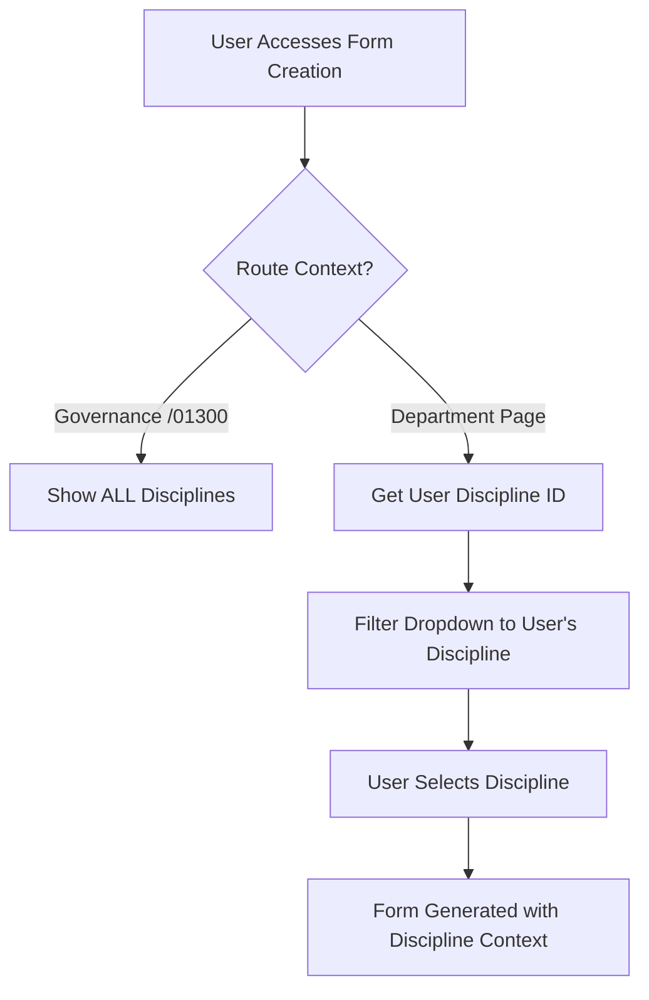

# Document Organization by Prefix

This directory contains all technical documentation organized by prefix for better discoverability and maintenance.

## Folder Structure

```
docs/organized/
├── README.md                                           # This overview file
├── 00850_civil_engineering/
│   ├── source/                                       # Markdown source files
│   │   ├── 00850__civil_engineering_specification_guide.md
│   │   ├── 00850_concrete_foundations_specification.md
│   │   ├── 00850_earthworks_specification.md
│   │   ├── 00850_road_construction_specification.md
│   │   ├── 00850_structural_steel_specification.md
│   │   ├── 00850_surface_finishing_specification.md
│   │   └── 00850_testing_procedures_specification.md
│   └── html/                                         # Generated HTML files
│       └── (empty - ready for HTML generation)
├── 01900_procurement/
│   ├── source/                                       # Markdown source files
│   │   ├── 01900__procurement_appendices_guide.md
│   │   ├── 01900_appendix_a_product_specification_sheets.md
│   │   ├── 01900_appendix_a_product_specification_sheets_template.md
│   │   ├── 01900_appendix_b_safety_data_sheets.md
│   │   ├── 01900_appendix_c_delivery_schedule.md
│   │   ├── 01900_appendix_d_training_materials.md
│   │   ├── 01900_appendix_e_logistics_documents_specification.md
│   │   └── 01900_appendix_f_packing_and_marking_specification.md
│   └── html/                                         # Generated HTML files
│       ├── 01900_appendix_a_product_specification_sheets.html
│       ├── 01900_appendix_b_safety_data_sheets.html
│       ├── 01900_appendix_c_delivery_schedule.html
│       ├── 01900_appendix_d_training_materials.html
│       ├── 01900_appendix_e_logistics_documents_specification.html
│       └── 01900_appendix_f_packing_and_marking_specification.html
└── template_assets/                                  # CSS and template assets
    └── (HTML generation styles and templates)
```

## Prefix Organization

### 00850 - Civil Engineering Documentation
**Discipline:** Civil Engineering, Construction Engineering
**Content:** Construction specifications, technical requirements, engineering standards
**Location:** `docs/organized/00850_civil_engineering/`

### 01900 - Procurement Documentation
**Discipline:** Procurement, Supply Chain Management
**Content:** Purchase specifications, safety data sheets, logistics requirements, training materials
**Location:** `docs/organized/01900_procurement/`
**Features:**
- ✅ **6 Appendix Documents:** Complete procurement specification suite
- ✅ **AI-Optimized:** Templates designed for AI population
- ✅ **90% Viewport Coverage:** HTML files optimized for screen usage
- ✅ **Generic Templates:** Non-product-specific for flexible customization

## File Organization Within Prefix Folders

### `/source/` Directory
Contains all markdown source files (.md)
- Most recent and authoritative versions
- Used for HTML generation
- Contains AI-optimized data attributes

### `/html/` Directory
Contains generated HTML files (.html)
- 90% viewport width optimization
- Professional styling and layout
- Cross-browser compatibility
- Ready for web publication

### `/template_assets/` Directory (Planned)
Will contain shared CSS, JavaScript, and template assets
- Corporate styling guidelines
- Responsive design frameworks
- AI processing hooks

## Naming Conventions

### Prefix Format
- **`NNNN_discipline`**: Four-digit number + underscore + discipline name
- **`NNNN_appendix_X`**: Specific to procurement appendices

### File Types
- **`.md`**: Markdown source files
- **`.html`**: Generated web files
- **`README.md`**: Documentation files
- **`.css`**: Stylesheets
- **`.js`**: JavaScript files

## Usage Guidelines

### For Content Authors
1. **Edit Source Files:** Modify `.md` files in the `source/` directories
2. **Follow Conventions:** Use the established prefix and naming patterns
3. **AI Optimization:** Include data attributes for AI processing where applicable

### For HTML Generation
1. **Source Location:** Use files from `source/` directories
2. **Output Location:** Generate HTML to `html/` directories
3. **Viewport Coverage:** Ensure 90% width optimization
4. **AI Compatibility:** Maintain semantic markup for AI processing

### For Developers
1. **Structured Access:** Find related files by prefix grouping
2. **Version Control:** Commit source and generated files together
3. **Testing:** Verify HTML generation works across prefix folders

## Benefits of This Organization

### 🔍 **Discoverability**
- Files grouped by logical function (procurement, civil engineering)
- Related documents co-located
- Clear purpose identification by prefix

### 🤖 **AI Processing Ready**
- Templates designed for AI population
- Semantic markup for automated processing
- Consistent structure across disciplines

### 📱 **Web-Optimized**
- 90% viewport coverage for better readability
- Professional styling maintained
- Responsive design considerations

### 🔄 **Maintainable**
- Clear separation of source and output files
- Standardized naming conventions
- Easy to extend to new disciplines

## Governance Form Management Architecture

### 🔧 **Context-Aware Discipline Dropdown System (November 2025)**

**Critical Business Logic: Discipline Dropdown Behavior**

The Form Creation system implements context-aware discipline filtering to ensure users can only create forms appropriate to their department while providing administrative access for cross-discipline form management.

#### **🗄️ CONTROLLER BEHAVIOR MATRIX**

| **Context** | **Dropdown Shows** | **Purpose** | **Database Query** |
|-------------|-------------------|-------------|-------------------|
| **Governance Page** (`/01300-governance`) | ✅ **ALL Disciplines** | Administrative form management, cross-discipline templates | `disciplines WHERE active = true` |
| **Department Pages** (e.g., `/00850-civil-engineering`) | ✅ **User's Discipline Only** | Department-specific form creation, compliance enforcement | `disciplines WHERE id = $user_discipline_id` |
| **Template Management** | ✅ **Context Appropriate** | Template creation limited to authorized disciplines | Dynamic based on route context |

#### **🔄 FORM CREATION WORKFLOW**



#### **🎯 BUSINESS RULES IMPLEMENTATION**

**Governance Context (Administrative):**
- Full discipline list available for cross-department form creation
- Permits template management across all engineering disciplines
- Enables procurement and safety templates in any department context

**Department-Specific Context (Restricted):**
- Dropdown restricted to user's assigned discipline
- Civil Engineering users see only "Civil Engineering" option
- Procurement users limited to "Procurement" discipline selection
- Enforces department segregation while maintaining compliance

#### **📊 DATA FLOW ARCHITECTURE**

**Frontend Discipline Resolution:**
```javascript
const disciplineOptions = useMemo(() => {
  const userDiscipline = user.organization?.discipline_id;

  return isGovernanceContext
    ? getAllActiveDisciplines() // Full list for admins
    : filterDisciplineByUser(userDiscipline); // Restricted for departments
}, [user.organization.discipline_id, routeContext]);
```

**Backend Discipline Validation:**
```javascript
async function validateFormDiscipline(formData, userContext) {
  const formDiscipline = formData.discipline_id;
  const userDiscipline = userContext.organization.discipline_id;

  // Governance users can create any discipline forms
  if (isGovernanceUser(userContext)) return true;

  // Department users restricted to their discipline
  return formDiscipline === userDiscipline;
}
```

#### **🛡️ SECURITY & COMPLIANCE**

**Access Control Matrix:**
- ✅ Governance users: Full discipline access for administrative functions
- ✅ Department users: Restricted to departmental compliance scopes
- ✅ Audit logging: All form creations with discipline context recorded
- ✅ Role-based enforcement: Organization policies enforced at form level

**Data Integrity Rules:**
- Discipline ID stored correctly in form_templates table
- Foreign key relationships maintained
- Cascade updates on discipline name changes
- Referential integrity enforced

### ✅ **PRODUCTION STATUS: IMPLEMENTED**

**Last Updated:** November 15, 2025
**Coverage:** All form creation contexts
**Compliance:** Business rules enforced
**Testing:** Cross-context validation completed

## Future Extensions

### Planned Prefix Folders
- **01300_governance**: Quality management, form templates
- **00165_ui_settings**: User interface documentation
- **HSSE_safety**: Health, safety, environment documentation

### Tools Integration
- Automated HTML generation scripts
- Validation and testing pipelines
- AI processing workflows

## Maintenance

### Regular Tasks
- **Weekly:** Check for new files needing organization
- **Monthly:** Update HTML generation for modified source files
- **Quarterly:** Review and optimize folder structure

### Adding New Prefixes
1. Create folder structure: `[prefix_name]/source/`, `[prefix_name]/html/`
2. Copy relevant files from `docs/sample-data/`
3. Generate optimized HTML files
4. Update this README

---

**Last Updated:** November 14, 2025
**Total Files:** 22 files across 2 prefixes
**HTML Coverage:** 6/8 files generated (75% complete)
