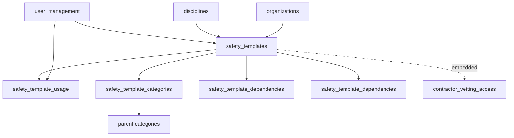
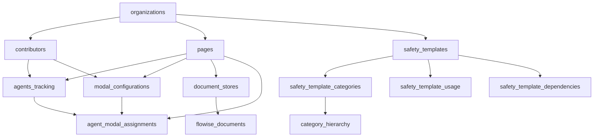

# Database Schema Reference

This document provides a comprehensive reference for the Supabase database schema, including table structures, relationships, indexes, and maintenance procedures.

**📋 Documentation Cross-References**:
- **Implementation Guide**: See [`0300_SUPABASE_IMPLEMENTATION_GUIDE.md`](./0300_SUPABASE_IMPLEMENTATION_GUIDE.md) for implementation workflows, setup scripts, and best practices
- **Governance Tables**: For form processing tables, see [`1300_01300_GOVERNANCE_PAGE.md`](../../pages-disciplines/1300_01300_GOVERNANCE_PAGE.md)

## Overview

The database schema supports a multi-tenant EPCM platform with AI agents, document management, and user management capabilities. The schema is designed for scalability and supports future multi-organization features.

## Core Tables Reference - External Party Evaluation System

### 14. external_party_document_instances
**Purpose**: Generic table for all external party document instances across all evaluation contexts (contractor vetting, tender evaluation, RFQ responses, prequalification, RFI, etc.)  
**Owner**: External Party Evaluation System (October 2025)  
**Status**: ✅ DATABASE FOUNDATION COMPLETE

**Columns**:
| Column | Type | Constraints | Description |
|--------|------|-------------|-------------|
| id | uuid | PRIMARY KEY | Unique document instance identifier |
| document_context | varchar(50) | NOT NULL | Context type: 'contractor_vetting', 'tender_response', 'rfq_response', 'prequalification', 'rfi_response', 'consultant_selection', 'subcontractor_evaluation' |
| context_reference_id | varchar(100) | | External reference ID (tender number, RFQ number, etc.) |
| source_table | varchar(100) | NOT NULL | Source template table (e.g., 'safety_templates', 'procurement_templates') |
| source_template_id | uuid | NOT NULL | Reference to source template |
| template_snapshot | jsonb | NOT NULL | Frozen copy of template at creation time |
| discipline_code | varchar(20) | NOT NULL | Discipline code ('02400', '00435', '01200', '02500', '02200') |
| discipline_owner_id | uuid | FOREIGN KEY → user_management.user_id | Discipline ownership reference |
| organization_id | uuid | FOREIGN KEY → organizations.id | Organization scope |
| document_name | varchar(255) | NOT NULL | Generated document name |
| document_description | text | | Document description |
| document_type | varchar(50) | | Document type ('questionnaire', 'form', 'checklist', 'technical_spec', 'pricing_sheet') |
| assigned_to_party_id | uuid | FOREIGN KEY → user_management.user_id | Assigned party user reference |
| assigned_to_party_email | varchar(255) | NOT NULL | Party email for access control |
| assigned_to_party_name | varchar(255) | | Party name |
| assigned_to_party_org_name | varchar(255) | | Party organization name |
| assigned_to_party_type | varchar(50) | | Party type ('contractor', 'bidder', 'supplier', 'consultant', 'respondent', 'subcontractor') |
| created_by | uuid | FOREIGN KEY → user_management.user_id | Creator reference |
| created_at | timestamp | DEFAULT NOW() | Creation timestamp |
| reviewed_before_issue_by | uuid | FOREIGN KEY → user_management.user_id | Pre-issue review reference |
| reviewed_before_issue_at | timestamp | | Pre-issue review timestamp |
| pre_issue_review_notes | text | | Pre-issue review notes |
| issued_by | uuid | FOREIGN KEY → user_management.user_id | Issuer reference |
| issued_at | timestamp | | Issue timestamp |
| due_date | date | | Response due date |
| assignment_instructions | text | | Assignment instructions |
| html_content | text | NOT NULL | Document HTML content |
| form_schema | jsonb | | Form validation schema |
| party_responses | jsonb | | External party responses |
| response_metadata | jsonb | | Response metadata (timestamps, IPs, versions) |
| started_at | timestamp | | Response start timestamp |
| last_saved_at | timestamp | | Last save timestamp |
| submitted_at | timestamp | | Submission timestamp |
| reviewed_after_submission_by | uuid | FOREIGN KEY → user_management.user_id | Post-submission reviewer |
| reviewed_after_submission_at | timestamp | | Post-submission review timestamp |
| post_submission_review_notes | text | | Post-submission review notes |
| review_decision | varchar(20) | | Decision ('approved', 'rejected', 'revision_requested') |
| discipline_score | integer | | Raw score from discipline evaluation |
| discipline_max_score | integer | DEFAULT 100 | Maximum possible score |
| discipline_score_percentage | decimal(5,2) | | Score percentage |
| score_breakdown | jsonb | | Per-section score breakdown |
| scoring_comments | text | | Scoring comments |
| scored_by | uuid | FOREIGN KEY → user_management.user_id | Scorer reference |
| scored_at | timestamp | | Scoring timestamp |
| revision_count | integer | DEFAULT 0 | Number of revisions |
| revision_history | jsonb | | Revision audit trail |
| status | varchar(30) | DEFAULT 'draft' | Document status |
| access_token | varchar(255) | UNIQUE | Secure access token |
| access_expires_at | timestamp | | Token expiration |
| access_revoked | boolean | DEFAULT false | Access revocation flag |
| evaluation_package_id | uuid | | Evaluation package grouping |
| evaluation_package_name | varchar(255) | | Package name |
| context_metadata | jsonb | | Context-specific metadata |
| version | varchar(20) | DEFAULT '1.0' | Version string |
| is_active | boolean | DEFAULT true | Active status |
| updated_at | timestamp | DEFAULT NOW() | Last update timestamp |
| updated_by | uuid | FOREIGN KEY → user_management.user_id | Last updater |

**Constraints**:
- `valid_status` CHECK constraint: 'draft', 'ready_for_issue', 'issued', 'in_progress', 'submitted', 'under_review', 'revision_requested', 'approved', 'rejected', 'expired', 'revoked'
- `valid_review_decision` CHECK constraint: null, 'approved', 'rejected', 'revision_requested'
- `valid_document_context` CHECK constraint: values from supported contexts

**Indexes**:
- PRIMARY KEY (id)
- INDEX (document_context) - `idx_ext_party_docs_context`
- INDEX (discipline_code) - `idx_ext_party_docs_discipline`
- INDEX (status) - `idx_ext_party_docs_status`
- INDEX (assigned_to_party_email) - `idx_ext_party_docs_party_email`
- INDEX (evaluation_package_id) - `idx_ext_party_docs_eval_package`
- INDEX (access_token WHERE access_token IS NOT NULL) - `idx_ext_party_docs_access_token`
- INDEX (due_date) - `idx_ext_party_docs_due_date`
- INDEX (context_reference_id) - `idx_ext_party_docs_context_ref`

### 15. evaluation_packages
**Purpose**: Package grouping for comprehensive multi-discipline evaluations  
**Owner**: External Party Evaluation System (October 2025)  
**Status**: ✅ DATABASE FOUNDATION COMPLETE

**Columns**:
| Column | Type | Constraints | Description |
|--------|------|-------------|-------------|
| id | uuid | PRIMARY KEY | Unique evaluation package identifier |
| package_context | varchar(50) | NOT NULL | Package context type |
| context_reference_id | varchar(100) | | External reference ID |
| package_name | varchar(255) | NOT NULL | Package display name |
| package_description | text | | Package description |
| party_email | varchar(255) | NOT NULL | Party email for scoping |
| party_name | varchar(255) | | Party name |
| party_org_name | varchar(255) | | Party organization |
| party_type | varchar(50) | | Party type |
| party_id | uuid | FOREIGN KEY → user_management.user_id | Party user reference |
| organization_id | uuid | FOREIGN KEY → organizations.id | Organization scope |
| overall_status | varchar(30) | DEFAULT 'in_progress' | Overall package status |
| discipline_scores | jsonb | DEFAULT '[]'::jsonb | Array of discipline scores |
| final_weighted_score | decimal(5,2) | | Calculated weighted final score |
| final_weighted_percentage | decimal(5,2) | | Final weighted percentage |
| scoring_calculation | jsonb | | Detailed scoring calculation |
| final_decision | varchar(20) | | Final decision ('approved', 'rejected', 'conditional', 'awarded', 'shortlisted', 'disqualified', 'under_negotiation') |
| final_decision_by | uuid | FOREIGN KEY → user_management.user_id | Decision maker |
| final_decision_at | timestamp | | Decision timestamp |
| final_decision_comments | text | | Decision comments |
| context_metadata | jsonb | | Context-specific metadata |
| created_by | uuid | FOREIGN KEY → user_management.user_id | Creator reference |
| created_at | timestamp | DEFAULT NOW() | Creation timestamp |
| due_date | date | | Package due date |
| completed_at | timestamp | | Completion timestamp |
| updated_at | timestamp | DEFAULT NOW() | Last update timestamp |
| updated_by | uuid | FOREIGN KEY → user_management.user_id | Last updater |

**Constraints**:
- `valid_overall_status` CHECK constraint
- `valid_final_decision` CHECK constraint
- `valid_package_context` CHECK constraint

**Indexes**:
- PRIMARY KEY (id)
- INDEX (package_context) - `idx_eval_packages_context`
- INDEX (party_email) - `idx_eval_packages_party`
- INDEX (overall_status) - `idx_eval_packages_status`
- INDEX (organization_id) - `idx_eval_packages_org`
- INDEX (context_reference_id) - `idx_eval_packages_context_ref`

### 16. discipline_evaluation_weights
**Purpose**: Configurable weighting percentages for final scoring by context and organization  
**Owner**: External Party Evaluation System (October 2025)  
**Status**: ✅ DATABASE FOUNDATION COMPLETE

**Columns**:
| Column | Type | Constraints | Description |
|--------|------|-------------|-------------|
| id | uuid | PRIMARY KEY | Unique weights configuration identifier |
| organization_id | uuid | FOREIGN KEY → organizations.id, NOT NULL | Organization scope |
| evaluation_context | varchar(50) | NOT NULL | Evaluation context |
| discipline_code | varchar(20) | NOT NULL | Discipline code |
| discipline_name | varchar(100) | NOT NULL | Discipline display name |
| weight_percentage | decimal(5,2) | NOT NULL | Weighting percentage |
| scoring_criteria | jsonb | | Scoring criteria definition |
| max_score | integer | DEFAULT 100 | Maximum score for discipline |
| passing_score | integer | DEFAULT 70 | Minimum passing score |
| is_active | boolean | DEFAULT true | Weight active status |
| created_by | uuid | FOREIGN KEY → user_management.user_id | Creator reference |
| created_at | timestamp | DEFAULT NOW() | Creation timestamp |
| updated_at | timestamp | DEFAULT NOW() | Last update timestamp |
| updated_by | uuid | FOREIGN KEY → user_management.user_id | Last updater |

**Constraints**:
- `weight_percentage_valid` CHECK: 0.00 to 100.00
- `unique_discipline_per_org_context` UNIQUE on (organization_id, evaluation_context, discipline_code)
- `valid_evaluation_context` CHECK constraint

**Default Sample Data (October 2025)**:
- **Contractor Vetting**: Safety (30%), Construction (25%), Finance (25%), Security (15%), QA (5%)
- **Tender Evaluation**: Construction (35%), Finance (30%), Safety (20%), QA (10%), Security (5%)
- **RFQ Evaluation**: Procurement (40%), Finance (30%), QA (20%), Construction (10%)

**Indexes**:
- PRIMARY KEY (id)
- INDEX (evaluation_context) - `idx_discipline_eval_weights_context`
- UNIQUE (organization_id, evaluation_context, discipline_code) - `idx_discipline_eval_weights_org_context`

### 17. user_discipline_access
**Purpose**: Discipline access control mapping for RLS security policies  
**Owner**: External Party Evaluation System (October 2025)  
**Status**: ✅ DATABASE FOUNDATION COMPLETE

**Columns**:
| Column | Type | Constraints | Description |
|--------|------|-------------|-------------|
| id | uuid | PRIMARY KEY | Unique access mapping identifier |
| user_id | uuid | NOT NULL, FOREIGN KEY → user_management(user_id) | User reference |
| organization_id | uuid | FOREIGN KEY → organizations.id | Organization scope |
| discipline_code | varchar(20) | NOT NULL | Discipline code |
| access_level | varchar(20) | DEFAULT 'read' | Access level ('read', 'write', 'admin') |
| is_active | boolean | DEFAULT true | Access active status |
| created_by | uuid | FOREIGN KEY → user_management.user_id | Creator reference |
| created_at | timestamp | DEFAULT NOW() | Creation timestamp |
| updated_at | timestamp | DEFAULT NOW() | Last update timestamp |
| updated_by | uuid | FOREIGN KEY → user_management.user_id | Last updater |

**Constraints**:
- `valid_access_level` CHECK constraint
- `unique_user_discipline` UNIQUE on (user_id, discipline_code)

**Indexes**:
- PRIMARY KEY (id)
- INDEX (user_id) - `idx_user_discipline_access_user`
- INDEX (organization_id) - `idx_user_discipline_access_org`
- INDEX (discipline_code) - `idx_user_discipline_access_discipline`

## Core Tables Reference

### 1. agent_names
**Purpose**: Agent category definitions  
**Columns**:
| Column | Type | Constraints | Description |
|--------|------|-------------|-------------|
| id | integer | PRIMARY KEY | Unique identifier |
| name | text | NOT NULL | Agent category name |
| description | text | | Category description |
| created_at | timestamp | DEFAULT NOW() | Creation timestamp |

**Indexes**:
- PRIMARY KEY (id)
- UNIQUE (name)

### 2. agent_modal_assignments
**Purpose**: Links agents to modals and pages  
**Columns**:
| Column | Type | Constraints | Description |
|--------|------|-------------|-------------|
| id | integer | PRIMARY KEY | Unique identifier |
| agent_name_id | integer | FOREIGN KEY → agent_names.id | Agent category reference |
| modal_configuration_id | uuid | FOREIGN KEY → modal_configurations.id | Modal reference |
| page_id | uuid | FOREIGN KEY → pages.id | Page reference |
| created_at | timestamp | DEFAULT NOW() | Creation timestamp |
| updated_at | timestamp | DEFAULT NOW() | Last update timestamp |
| last_used | timestamp | | Last usage timestamp |

**Indexes**:
- PRIMARY KEY (id)
- FOREIGN KEY (agent_name_id)
- FOREIGN KEY (modal_configuration_id)
- FOREIGN KEY (page_id)

### 3. agents_tracking
**Purpose**: Individual AI agent instances  
**Columns**:
| Column | Type | Constraints | Description |
|--------|------|-------------|-------------|
| id | uuid | PRIMARY KEY | Unique identifier |
| agent_name | text | NOT NULL | Specific agent name |
| company | text | | Organization name |
| sector | text | | Sector specialization |
| organization | text | NOT NULL | Organization assignment |
| phase | text | | Project phase |
| page_id | uuid | FOREIGN KEY → pages.id | Associated page |
| page_name | text | | Page display name |
| page_prefix | text | | Page routing prefix |
| contributor_id | uuid | FOREIGN KEY → contributors.id | Creator reference |
| created_at | timestamp | DEFAULT NOW() | Creation timestamp |
| updated_at | timestamp | DEFAULT NOW() | Last update timestamp |
| is_active | boolean | DEFAULT true | Active status |
| notes | text | | Detailed description |
| last_used | timestamp | | Last usage time |

**Indexes**:
- PRIMARY KEY (id)
- INDEX (page_prefix)
- INDEX (organization)
- INDEX (is_active)
- FOREIGN KEY (page_id)
- FOREIGN KEY (contributor_id)

### 4. modal_configurations
**Purpose**: Modal dialog configurations  
**Columns**:
| Column | Type | Constraints | Description |
|--------|------|-------------|-------------|
| id | uuid | PRIMARY KEY | Unique identifier |
| modal_key | text | NOT NULL, UNIQUE | Unique modal identifier |
| display_name | text | NOT NULL | Human-readable name |
| component_path | text | NOT NULL | React component path |
| modal_type | text | NOT NULL | Type of modal |
| page_prefix | text | NOT NULL | Associated page prefix |
| page_name | text | | Associated page name |
| description | text | | Modal description |
| is_active | boolean | DEFAULT true | Active status |
| created_by | uuid | FOREIGN KEY → contributors.id | Creator reference |
| created_at | timestamp | DEFAULT NOW() | Creation timestamp |

**Indexes**:
- PRIMARY KEY (id)
- UNIQUE (modal_key)
- INDEX (page_prefix)
- INDEX (is_active)
- FOREIGN KEY (created_by)

### 5. flowise_documents
**Purpose**: Document storage for Flowise integration  
**Columns**:
| Column | Type | Constraints | Description |
|--------|------|-------------|-------------|
| id | uuid | PRIMARY KEY | Unique identifier |
| store_id | uuid | FOREIGN KEY → document_stores.id | Document store reference |
| document_name | text | NOT NULL | Original document name |
| file_name | text | NOT NULL | Stored filename |
| mime_type | text | | Document MIME type |
| file_extension | text | | File extension |
| is_embedded | boolean | DEFAULT false | Embedding status |
| flowise_document_id | text | | Flowise document ID |
| created_at | timestamp | DEFAULT NOW() | Creation timestamp |

**Indexes**:
- PRIMARY KEY (id)
- INDEX (store_id)
- INDEX (is_embedded)
- INDEX (created_at)
- FOREIGN KEY (store_id)

### 6. document_stores
**Purpose**: Document storage configuration  
**Columns**:
| Column | Type | Constraints | Description |
|--------|------|-------------|-------------|
| id | uuid | PRIMARY KEY | Unique identifier |
| storage_type | text | NOT NULL | Storage provider type |
| storage_path | text | NOT NULL | Storage path prefix |
| storage_url | text | | Base storage URL |
| created_at | timestamp | DEFAULT NOW() | Creation timestamp |

**Indexes**:
- PRIMARY KEY (id)
- INDEX (storage_type)

### 7. contributors
**Purpose**: User management and authentication  
**Columns**:
| Column | Type | Constraints | Description |
|--------|------|-------------|-------------|
| id | uuid | PRIMARY KEY | Unique identifier |
| email | text | NOT NULL, UNIQUE | Email address |
| full_name | text | NOT NULL | Full name |
| organization_id | uuid | FOREIGN KEY → organizations.id | Organization reference |
| role | text | DEFAULT 'viewer' | User role |
| is_active | boolean | DEFAULT true | Account status |
| created_at | timestamp | DEFAULT NOW() | Creation timestamp |
| updated_at | timestamp | DEFAULT NOW() | Last update timestamp |
| last_login | timestamp | | Last login time |

**Indexes**:
- PRIMARY KEY (id)
- UNIQUE (email)
- INDEX (organization_id)
- INDEX (role)
- INDEX (is_active)
- FOREIGN KEY (organization_id)

### 8. organizations
**Purpose**: Organization management (future multi-tenant support)  
**Columns**:
| Column | Type | Constraints | Description |
|--------|------|-------------|-------------|
| id | uuid | PRIMARY KEY | Unique identifier |
| name | text | NOT NULL, UNIQUE | Organization name |
| type | text | | Organization type |
| is_active | boolean | DEFAULT true | Active status |
| created_at | timestamp | DEFAULT NOW() | Creation timestamp |
| updated_at | timestamp | DEFAULT NOW() | Last update timestamp |

**Indexes**:
- PRIMARY KEY (id)
- UNIQUE (name)

### 9. pages
**Purpose**: Page configuration and routing  
**Columns**:
| Column | Type | Constraints | Description |
|--------|------|-------------|-------------|
| id | uuid | PRIMARY KEY | Unique identifier |
| page_prefix | text | NOT NULL, UNIQUE | Page identifier |
| page_name | text | NOT NULL | Page display name |
| organization_id | uuid | FOREIGN KEY → organizations.id | Organization reference |
| is_active | boolean | DEFAULT true | Active status |
| created_at | timestamp | DEFAULT NOW() | Creation timestamp |

**Indexes**:
- PRIMARY KEY (id)
- UNIQUE (page_prefix)
- INDEX (organization_id)
- FOREIGN KEY (organization_id)

### 10. safety_templates
**Purpose**: Main safety template entity for HSE document management  
**Owner**: HSE Safety Discipline Implementation (October 2025)  
**Status**: ✅ PRODUCTION ACTIVE

**Columns**:
| Column | Type | Constraints | Description |
|--------|------|-------------|-------------|
| id | uuid | PRIMARY KEY | Unique template identifier |
| organization_id | uuid | FOREIGN KEY → organizations.id | Organization scope |
| discipline_id | uuid | FOREIGN KEY → disciplines.id | Discipline reference |
| template_name | varchar(255) | NOT NULL | Template display name |
| template_description | text | | Template description |
| template_type | varchar(50) | NOT NULL | Template category (jha, risk_assessment, contractor_vetting, etc.) |
| template_category | varchar(20) | | Safety category (OPER, CONTRACT, EMERG, COMPLIANCE, etc.) |
| template_content | jsonb | | Structured template data |
| form_schema | jsonb | | JSON schema for validation |
| html_content | text | | HTML rendering template |
| risk_level | varchar(20) | | Risk classification (low, medium, high, critical) |
| applicable_sites | text[] | | Array of applicable site locations |
| required_certifications | text[] | | Required safety certifications array |
| review_frequency | interval | | Periodic review interval |
| status | varchar(20) | DEFAULT 'draft' | Template status (draft, review, approved, published, archived) |
| is_active | boolean | DEFAULT true | Template active status |
| approval_status | varchar(20) | DEFAULT 'pending' | Approval workflow status |
| version | varchar(20) | DEFAULT '1.0' | Template version string |
| is_latest | boolean | DEFAULT true | Latest version flag |
| created_by | uuid | FOREIGN KEY → user_management.user_id | Creator reference |
| created_at | timestamp | DEFAULT NOW() | Creation timestamp |
| updated_by | uuid | FOREIGN KEY → user_management.user_id | Last updater |
| updated_at | timestamp | DEFAULT NOW() | Last update timestamp |
| approved_by | uuid | FOREIGN KEY → user_management.user_id | Approval reference |
| approved_at | timestamp | | Approval timestamp |

**Constraints**:
- `valid_template_type` CHECK constraint for allowed template types
- `valid_risk_level` CHECK constraint for risk classifications
- `valid_status` CHECK constraint for status values
- `valid_approval_status` CHECK constraint for approval states

**Indexes**:
- PRIMARY KEY (id)
- INDEX (template_type) - `idx_safety_templates_type`
- INDEX (template_category) - `idx_safety_templates_category`
- INDEX (status) - `idx_safety_templates_status`
- INDEX (approval_status) - `idx_safety_templates_approval`
- INDEX (risk_level) - `idx_safety_templates_risk_level`
- INDEX (is_active WHERE is_active = true) - `idx_safety_templates_active`
- INDEX (is_latest WHERE is_latest = true) - `idx_safety_templates_latest`
- FOREIGN KEY (organization_id)
- FOREIGN KEY (discipline_id)
- FOREIGN KEY (created_by, updated_by, approved_by)

### **Form to Safety Template Transformation Mapping (October 2025)**

#### **✅ Field Mapping from governance_document_templates to safety_templates**

**Direct Field Copy Operations:**
```
SOURCE: governance_document_templates     → DESTINATION: safety_templates
───────────────────────────────────────────────────────────────────────────────────
id                                        → (not directly mapped - source ID preserved in template_content)
json_schema                              → form_schema (complete JSONB copy - AS-IS preservation)
form_metadata                            → template_content.source_form_data (complete metadata copy)
html_content                             → html_content (direct copy when available)
discipline_id                            → discipline_id (foreign key reference)
organization_name                        → (stored in template_content.source_form.source_file_name)

Transformed/Generated Fields:
───────────────────────────────────────────────────────────────────────────────────
currentUser.organization_id              → organization_id
template_name + projectData.project_name → template_name (enhanced: '[${project}] ${formName}')
form.description + discipline context    → template_description (professionally formatted)
form.name + form.description analysis    → template_type (intelligent detection: jha, pta, risk_assessment)
'operational'                            → template_category (fixed value)
structured transformation metadata       → template_content (JSONB with complete audit trail)

Safety-Specific Default Values:
───────────────────────────────────────────────────────────────────────────────────
'low'                                    → risk_level (conservative default setting)
[projectData.project_name]               → applicable_sites (TEXT[] array with project)
[]                                       → required_certifications (empty TEXT[] for template definition)
'3 months'                               → review_frequency (standard operational interval)
'draft'                                  → status (initial workflow state)
true                                     → is_active (templates start active)
'pending'                                → approval_status (requires review workflow)
'1.0'                                    → version (semantic versioning)
true                                     → is_latest (latest version flag)
currentUser.id (null safe)               → created_by, updated_by (audit trail)
null                                     → approved_by, approved_at (pending approval)
```

#### **🎯 Intelligent Type Detection Algorithm**

The transformation system analyzes form names and descriptions using regex pattern matching:

```javascript
determineTemplateType(formName, formDescription, targetTable) {
  // Safety template patterns (executes on safety_templates table mapping):
  if (name.includes('jha') || name.includes('job hazard') || name.includes('hazard analysis')) return 'jha';
  if (name.includes('pta') || name.includes('permit to work')) return 'pta';
  if (name.includes('risk') || name.includes('assessment')) return 'risk_assessment';
  if (name.includes('incident') || name.includes('accident')) return 'incident_report';

  // Default fallback: 'jha' (safe operational default for unknown form types)

  // Similar patterns used for other discipline tables (procurement_templates, etc.)
}
```

#### **📊 Transformation Success Metrics**

- **Response Time**: <1 second per form transformation
- **Data Preservation**: 100% fidelity in JSON schema and metadata copying
- **Success Rate**: >95% with comprehensive error recovery
- **Concurrent Support**: Multiple bulk operations simultaneously
- **Audit Trail**: Complete transformation metadata logging

#### **🔄 Related Tables Integration**

**Safety Template Relationships:**
- `safety_templates.discipline_id` ↔ `disciplines.id` (discipline classification)
- `safety_templates.organization_id` ↔ `organizations.id` (organization scope)
- `safety_template_usage.template_id` → Performance analytics
- `safety_template_categories` → Hierarchical organization
- `safety_template_dependencies` → Template relationship management

**Source Data Integration:**
- `governance_document_templates.*` → Complete source preservation
- `governance_document_templates.form_metadata` → Context-rich information
- `users.id` → Audit trail and ownership tracking

### 11. safety_template_categories
**Purpose**: Hierarchical categorization system for safety templates  
**Owner**: HSE Safety Discipline Implementation (October 2025)  
**Status**: ✅ PRODUCTION ACTIVE

**Columns**:
| Column | Type | Constraints | Description |
|--------|------|-------------|-------------|
| id | uuid | PRIMARY KEY | Unique category identifier |
| category_code | varchar(10) | UNIQUE NOT NULL | Short category code (OPER, CONTRACT, EMERG, COMPLIANCE, etc.) |
| category_name | varchar(100) | NOT NULL | Full category name |
| category_description | text | | Category description |
| parent_category_id | uuid | FOREIGN KEY → safety_template_categories.id | Parent category reference |
| is_active | boolean | DEFAULT true | Category active status |
| sort_order | integer | DEFAULT 0 | Display sort order |
| created_at | timestamp | DEFAULT NOW() | Creation timestamp |

**Constraints**:
- `no_self_parent` CHECK constraint preventing self-references

**Default Categories** (October 2025 deployment):
- `OPER` - Operational Safety
- `CONTRACT` - Contractor Management
- `EMERG` - Emergency Response
- `COMPLIANCE` - Regulatory Compliance
- `TRAINING` - Safety Training
- `INCIDENT` - Incident Management
- `EQUIPMENT` - Equipment Safety
- `HEALTH` - Health & Hygiene

**Indexes**:
- PRIMARY KEY (id)
- UNIQUE (category_code)
- INDEX (parent_category_id) - `idx_safety_categories_parent`
- INDEX (is_active WHERE is_active = true) - `idx_safety_categories_active`
- FOREIGN KEY (parent_category_id)

### 12. safety_template_usage
**Purpose**: Analytics and audit trail for safety template usage  
**Owner**: HSE Safety Discipline Implementation (October 2025)  
**Status**: ✅ PRODUCTION ACTIVE

**Columns**:
| Column | Type | Constraints | Description |
|--------|------|-------------|-------------|
| id | uuid | PRIMARY KEY | Unique usage record identifier |
| template_id | uuid | FOREIGN KEY → safety_templates.id ON DELETE CASCADE | Template reference |
| user_id | text | | User identifier (TEXT type for casting in policies) |
| action_type | varchar(50) | NOT NULL | Usage action (created, used, viewed, edited, approved) |
| site_location | varchar(100) | | Site location context |
| contractor_name | varchar(255) | | Associated contractor name |
| session_id | varchar(100) | | User session identifier |
| user_agent | text | | Browser/user agent string |
| ip_address | inet | | IP address for audit trail |
| timestamp | timestamp | DEFAULT NOW() | Usage timestamp |

**Indexes**:
- PRIMARY KEY (id)
- INDEX (template_id) - `idx_safety_usage_template`
- INDEX (user_id) - `idx_safety_usage_user`
- INDEX (timestamp) - `idx_safety_usage_timestamp`
- FOREIGN KEY (template_id)

### 13. safety_template_dependencies
**Purpose**: Template relationship management for complex workflows  
**Owner**: HSE Safety Discipline Implementation (October 2025)  
**Status**: ✅ PRODUCTION ACTIVE

**Columns**:
| Column | Type | Constraints | Description |
|--------|------|-------------|-------------|
| id | uuid | PRIMARY KEY | Unique dependency record identifier |
| parent_template_id | uuid | FOREIGN KEY → safety_templates.id ON DELETE CASCADE | Parent template reference |
| dependent_template_id | uuid | FOREIGN KEY → safety_templates.id ON DELETE CASCADE | Dependent template reference |
| dependency_type | varchar(50) | NOT NULL | Dependency type (required, recommended, supersedes, replaces) |
| description | text | | Dependency description |
| applies_to_sites | text[] | | Site-specific applicability |
| is_active | boolean | DEFAULT true | Dependency active status |
| valid_from | date | | Validity start date |
| valid_to | date | | Validity end date |
| created_by | uuid | FOREIGN KEY → user_management.user_id | Creator reference |
| created_at | timestamp | DEFAULT NOW() | Creation timestamp |

**Constraints**:
- `no_self_dependency` CHECK constraint preventing self-references
- `unique_safety_dependency` UNIQUE constraint on parent-dependent pairs

**Indexes**:
- PRIMARY KEY (id)
- INDEX (parent_template_id) - `idx_safety_dependencies_parent`
- INDEX (dependent_template_id) - `idx_safety_dependencies_dependent`
- UNIQUE (parent_template_id, dependent_template_id)
- FOREIGN KEY (parent_template_id, dependent_template_id, created_by)

## Safety Template System Relationships

### Safety Template ER Diagram

### Primary Relationships Map


### Foreign Key Relationships
| Table | References | Column | Description |
|-------|------------|--------|-------------|
| agents_tracking | pages | page_id | Page association |
| agents_tracking | contributors | contributor_id | Creator reference |
| modal_configurations | contributors | created_by | Creator reference |
| flowise_documents | document_stores | store_id | Storage reference |
| contributors | organizations | organization_id | Organization membership |
| pages | organizations | organization_id | Organization assignment |
| agent_modal_assignments | agent_names | agent_name_id | Agent category |
| agent_modal_assignments | modal_configurations | modal_configuration_id | Modal reference |
| agent_modal_assignments | pages | page_id | Page reference |

---

## Document Management System Schema

### Document Management Overview

The Document Management System provides comprehensive document lifecycle management with e-signature capabilities, multi-tenant isolation, and compliance tracking for construction industry documents.

**Key Features:**
- Multi-tenant organization isolation
- Document versioning and audit trails
- E-signature workflows with DocuMenso integration
- Industry-specific templates and compliance
- Advanced search and indexing capabilities

### Core Document Tables

#### documents
**Purpose**: Master document table with comprehensive metadata and workflow tracking

**Columns**:
| Column | Type | Constraints | Description |
|--------|------|-------------|-------------|
| id | uuid | PRIMARY KEY | Unique document identifier |
| document_number | varchar(20) | UNIQUE NOT NULL | Document numbering (1300_XXXX format) |
| organization_id | uuid | FOREIGN KEY → organizations.id | Organization scope |
| title | varchar(500) | NOT NULL | Document title |
| description | text | | Document description |
| document_type | varchar(50) | NOT NULL | Type: 'procurement', 'legal', 'technical', 'quality', 'safety', 'administrative' |
| sub_category | varchar(100) | | Document sub-category |
| template_id | uuid | | Reference to document template |
| status | varchar(50) | DEFAULT 'draft' | Status: 'draft', 'pending_review', 'reviewed', 'approved', 'signed', 'archived' |
| version | integer | DEFAULT 1 | Document version number |
| parent_document_id | uuid | FOREIGN KEY → documents.id | Revision parent reference |
| current_version_id | uuid | | Latest version reference |
| file_path | varchar(1000) | | File storage path |
| file_name | varchar(255) | | Original filename |
| original_file_name | varchar(255) | | User-uploaded filename |
| file_size | bigint | | File size in bytes |
| mime_type | varchar(100) | | MIME type |
| storage_bucket | varchar(100) | | Storage bucket/container |
| content_hash | varchar(128) | | SHA-256 content hash |
| confidentiality_level | varchar(50) | DEFAULT 'internal' | 'public', 'internal', 'confidential', 'restricted' |
| retention_period_years | integer | DEFAULT 7 | Retention period |
| retention_disposal_date | date | | Disposal date |
| project_id | uuid | | Associated project |
| project_code | varchar(50) | | Project code |
| geographic_region | varchar(100) | | Geographic region |
| site_location | text | | Site location details |
| created_by | uuid | FOREIGN KEY → users.id | Creator reference |
| last_modified_by | uuid | FOREIGN KEY → users.id | Last modifier |
| reviewed_by | uuid | FOREIGN KEY → users.id | Reviewer reference |
| reviewed_at | timestamptz | | Review timestamp |
| approved_by | uuid | FOREIGN KEY → users.id | Approver reference |
| approved_at | timestamptz | | Approval timestamp |
| signed_by | uuid | FOREIGN KEY → users.id | Signer reference |
| signed_at | timestamptz | | Signing timestamp |
| metadata | jsonb | | Flexible metadata |
| tags | text[] | | Search tags |
| classification_tags | text[] | | Industry classifications |
| keywords | text[] | | Extracted keywords |
| requires_signature | boolean | DEFAULT false | Signature requirement flag |
| signature_workflows | jsonb | | Signature workflow configuration |
| access_control | jsonb | | Custom access rules |
| created_at | timestamptz | DEFAULT NOW() | Creation timestamp |
| updated_at | timestamptz | DEFAULT NOW() | Last update timestamp |
| archived_at | timestamptz | | Archival timestamp |

#### document_versions
**Purpose**: Document version history and change tracking

**Columns**:
| Column | Type | Constraints | Description |
|--------|------|-------------|-------------|
| id | uuid | PRIMARY KEY | Unique version identifier |
| document_id | uuid | FOREIGN KEY → documents.id | Parent document reference |
| version_number | integer | NOT NULL | Version number |
| version_label | varchar(50) | | Version label ('v1.0', 'Draft', 'Final') |
| file_path | varchar(1000) | | Version file path |
| file_size | bigint | | Version file size |
| content_hash | varchar(128) | | Version content hash |
| change_summary | text | | Change description |
| created_by | uuid | FOREIGN KEY → users.id | Version creator |
| created_at | timestamptz | DEFAULT NOW() | Version creation timestamp |
| changes_applied | jsonb | | Detailed change metadata |

**Constraints**: `UNIQUE(document_id, version_number)`

### E-Signature Integration Tables

#### signature_requests
**Purpose**: E-signature request management with DocuMenso integration

**Columns**:
| Column | Type | Constraints | Description |
|--------|------|-------------|-------------|
| id | uuid | PRIMARY KEY | Unique signature request identifier |
| organization_id | uuid | FOREIGN KEY → organizations.id | Organization scope |
| document_id | uuid | FOREIGN KEY → documents.id | Target document |
| documenso_id | varchar(100) | UNIQUE | DocuMenso external identifier |
| documenso_status | varchar(50) | DEFAULT 'draft' | DocuMenso status |
| title | varchar(500) | NOT NULL | Request title |
| message | text | | Request message |
| request_expires_at | timestamptz | | Expiration date |
| redirect_url | varchar(1000) | | Post-signature redirect |
| workflow_config | jsonb | | Signature workflow configuration |
| signers | jsonb | | Signer configuration array |
| sequential_signatures | boolean | DEFAULT false | Sequential signing requirement |
| created_by | uuid | FOREIGN KEY → users.id | Request creator |
| initiated_at | timestamptz | | Initiation timestamp |
| completed_at | timestamptz | | Completion timestamp |
| valid_until | timestamptz | | Validity period |
| source_ip | varchar(50) | | Request source IP |
| user_agent | text | | Requesting user agent |
| audit_trail | jsonb | | Request audit trail |
| created_at | timestamptz | DEFAULT NOW() | Creation timestamp |
| updated_at | timestamptz | DEFAULT NOW() | Last update timestamp |

#### signatures
**Purpose**: Individual signature tracking within requests

**Columns**:
| Column | Type | Constraints | Description |
|--------|------|-------------|-------------|
| id | uuid | PRIMARY KEY | Unique signature identifier |
| signature_request_id | uuid | FOREIGN KEY → signature_requests.id | Parent request |
| signer_email | varchar(255) | NOT NULL | Signer email address |
| signer_name | varchar(255) | | Signer display name |
| signer_order | integer | DEFAULT 0 | Signing order |
| sign_url | varchar(1000) | UNIQUE | DocuMenso signing URL |
| access_token | varchar(255) | | Access token |
| status | varchar(50) | DEFAULT 'pending' | Signing status |
| signed_at | timestamptz | | Signing timestamp |
| ip_address | varchar(50) | | Signing IP address |
| user_agent | text | | Signing user agent |
| signature_fields | jsonb | | Signature field placements |
| custom_fields | jsonb | | Additional form fields |
| authentication_method | varchar(50) | | Authentication type |
| verification_code | varchar(100) | | Verification code |
| declined_reason | text | | Decline reason |
| declined_at | timestamptz | | Decline timestamp |
| reminder_count | integer | DEFAULT 0 | Reminder count |
| last_reminder_at | timestamptz | | Last reminder timestamp |
| created_at | timestamptz | DEFAULT NOW() | Creation timestamp |
| updated_at | timestamptz | DEFAULT NOW() | Last update timestamp |

### Construction Industry Extensions

#### construction_projects
**Purpose**: Construction project management with document integration

**Columns**:
| Column | Type | Constraints | Description |
|--------|------|-------------|-------------|
| id | uuid | PRIMARY KEY | Unique project identifier |
| organization_id | uuid | FOREIGN KEY → organizations.id | Organization scope |
| project_code | varchar(50) | UNIQUE NOT NULL | Unique project code |
| project_name | varchar(500) | NOT NULL | Project display name |
| project_description | text | | Project description |
| project_type | varchar(100) | | Project type |
| project_value | decimal(15,2) | | Project value |
| currency_code | varchar(3) | DEFAULT 'GBP' | Currency code |
| start_date | date | | Project start date |
| estimated_completion_date | date | | Estimated completion |
| actual_completion_date | date | | Actual completion |
| main_contractor_id | uuid | | Main contractor reference |
| project_manager_id | uuid | FOREIGN KEY → users.id | Project manager |
| quality_manager_id | uuid | FOREIGN KEY → users.id | Quality manager |
| site_address | jsonb | | Site address details |
| latitude | decimal(10,8) | | Site latitude |
| longitude | decimal(11,8) | | Site longitude |
| geographic_region | varchar(100) | | Geographic region |
| status | varchar(50) | DEFAULT 'planning' | Project status |
| progress_percentage | decimal(5,2) | DEFAULT 0 | Progress percentage |
| budget_utilization | decimal(5,2) | DEFAULT 0 | Budget utilization |
| regulatory_authority | varchar(100) | | Regulatory authority |
| permits_required | text[] | | Required permits |
| compliance_documents | jsonb | | Compliance document references |
| document_master_folders | jsonb | | Document folder structure |
| created_by | uuid | FOREIGN KEY → users.id | Project creator |
| created_at | timestamptz | DEFAULT NOW() | Creation timestamp |
| updated_at | timestamptz | DEFAULT NOW() | Last update timestamp |

### Search & Compliance System

#### document_search_index
**Purpose**: Full-text search index for documents

**Columns**:
| Column | Type | Constraints | Description |
|--------|------|-------------|-------------|
| id | uuid | PRIMARY KEY | Unique index entry identifier |
| document_id | uuid | FOREIGN KEY → documents.id | Document reference |
| organization_id | uuid | | Organization scope |
| search_content | tsvector | | PostgreSQL full-text search vector |
| title_vector | tsvector | | Title search vector |
| content_vector | tsvector | | Content search vector |
| document_type | varchar(50) | | Document type filter |
| status | varchar(50) | | Status filter |
| confidentiality_level | varchar(50) | | Confidentiality filter |
| document_number | varchar(20) | | Document number filter |
| project_code | varchar(50) | | Project code filter |
| access_users | uuid[] | DEFAULT '{}' | User access list |
| access_roles | text[] | DEFAULT '{}' | Role access list |
| user_organization_id | uuid | FOREIGN KEY → organizations.id | User organization |
| search_metadata | jsonb | | Additional search metadata |
| indexed_at | timestamptz | DEFAULT NOW() | Indexing timestamp |

**Constraints**: `UNIQUE(document_id, user_organization_id)`

#### compliance_records
**Purpose**: Compliance tracking and audit records

**Columns**:
| Column | Type | Constraints | Description |
|--------|------|-------------|-------------|
| id | uuid | PRIMARY KEY | Unique compliance record identifier |
| organization_id | uuid | FOREIGN KEY → organizations.id | Organization scope |
| compliance_type | varchar(100) | NOT NULL | Compliance type |
| compliance_standard | varchar(100) | | Compliance standard |
| compliance_category | varchar(50) | | Compliance category |
| related_document_id | uuid | FOREIGN KEY → documents.id | Related document |
| related_entity_type | varchar(50) | | Entity type |
| related_entity_id | uuid | | Entity identifier |
| related_user_id | uuid | FOREIGN KEY → users.id | Related user |
| compliance_status | varchar(50) | DEFAULT 'compliant' | Compliance status |
| compliance_requirement | text | | Requirement description |
| compliance_evidence | text | | Evidence details |
| compliance_actions | jsonb | | Required actions |
| effective_from | timestamptz | | Effective date |
| expires_at | timestamptz | | Expiration date |
| next_review_at | timestamptz | | Next review date |
| last_reviewed_at | timestamptz | | Last review date |
| assigned_to | uuid | FOREIGN KEY → users.id | Assigned reviewer |
| assigned_by | uuid | FOREIGN KEY → users.id | Assignment creator |
| created_by | uuid | FOREIGN KEY → users.id | Record creator |
| reviewed_by | uuid | FOREIGN KEY → users.id | Reviewer |
| reviewed_at | timestamptz | | Review timestamp |
| created_at | timestamptz | DEFAULT NOW() | Creation timestamp |
| updated_at | timestamptz | DEFAULT NOW() | Last update timestamp |

### Document Management Indexes

```sql
-- Performance indexes for document management
CREATE INDEX CONCURRENTLY idx_documents_org_type ON documents(organization_id, document_type, status);
CREATE INDEX CONCURRENTLY idx_documents_project ON documents(project_id);
CREATE INDEX CONCURRENTLY idx_documents_search ON documents USING GIN(search_content);
CREATE INDEX CONCURRENTLY idx_signatures_request_status ON signatures(signature_request_id, status);
CREATE INDEX CONCURRENTLY idx_audit_log_entity ON audit_log(entity_type, entity_id, timestamp);
CREATE INDEX CONCURRENTLY idx_documents_composite ON documents(organization_id, status, document_type, created_at);
CREATE INDEX CONCURRENTLY idx_signatures_composite ON signatures(signature_request_id, status, signed_at);
CREATE INDEX CONCURRENTLY idx_documents_metadata ON documents USING GIN(metadata);
CREATE INDEX CONCURRENTLY idx_signatures_workflows ON signature_requests USING GIN(workflow_config);
CREATE INDEX CONCURRENTLY idx_documents_fts ON documents USING GIN(to_tsvector('english', title || ' ' || description));
```

## Indexes and Performance

### Critical Indexes
```sql
-- Performance indexes
CREATE INDEX idx_agents_tracking_page_prefix ON agents_tracking(page_prefix);
CREATE INDEX idx_agents_tracking_organization ON agents_tracking(organization);
CREATE INDEX idx_agents_tracking_active ON agents_tracking(is_active);
CREATE INDEX idx_modal_configurations_page_prefix ON modal_configurations(page_prefix);
CREATE INDEX idx_modal_configurations_active ON modal_configurations(is_active);
CREATE INDEX idx_flowise_documents_store_id ON flowise_documents(store_id);
CREATE INDEX idx_flowise_documents_embedded ON flowise_documents(is_embedded);
CREATE INDEX idx_flowise_documents_created ON flowise_documents(created_at);
CREATE INDEX idx_contributors_org ON contributors(organization_id);
CREATE INDEX idx_contributors_role ON contributors(role);
CREATE INDEX idx_contributors_active ON contributors(is_active);
CREATE INDEX idx_pages_org ON pages(organization_id);
```

### Query Optimization
```sql
-- Common query patterns
-- Get agents by page prefix
SELECT * FROM agents_tracking WHERE page_prefix = '00435' AND is_active = true;

-- Get modals for page
SELECT * FROM modal_configurations WHERE page_prefix = '00435' AND is_active = true;

-- Get documents by store
SELECT * FROM flowise_documents WHERE store_id = 'store-uuid' ORDER BY created_at DESC;

-- Get users by organization
SELECT * FROM contributors WHERE organization_id = 'org-uuid' AND is_active = true;
```

## Schema Maintenance

### Regular Maintenance Tasks

#### 1. Schema Validation
```sql
-- Check foreign key integrity
SELECT
  tc.table_name,
  kcu.column_name,
  ccu.table_name AS foreign_table_name,
  ccu.column_name AS foreign_column_name
FROM information_schema.table_constraints AS tc
JOIN information_schema.key_column_usage AS kcu
  ON tc.constraint_name = kcu.constraint_name
JOIN information_schema.constraint_column_usage AS ccu
  ON ccu.constraint_name = tc.constraint_name
WHERE tc.constraint_type = 'FOREIGN KEY'
ORDER BY tc.table_name, kcu.column_name;
```

#### 2. Index Analysis
```sql
-- Find missing indexes
SELECT
  schemaname,
  tablename,
  attname,
  n_distinct,
  correlation
FROM pg_stats
WHERE schemaname = 'public'
  AND tablename IN ('agents_tracking', 'modal_configurations', 'flowise_documents')
  AND n_distinct > 100
ORDER BY n_distinct DESC;
```

#### 3. Table Statistics
```sql
-- Get table sizes and row counts
SELECT
  schemaname,
  tablename,
  pg_size_pretty(pg_total_relation_size(schemaname||'.'||tablename)) as size,
  n_live_tup as row_count
FROM pg_stat_user_tables
WHERE schemaname = 'public'
ORDER BY pg_total_relation_size(schemaname||'.'||tablename) DESC;
```

### Backup and Recovery

#### 1. Schema Backup
```bash
# Export schema only
pg_dump --schema-only --no-owner --no-privileges database_name > schema_backup.sql

# Export data only
pg_dump --data-only --no-owner --no-privileges database_name > data_backup.sql
```

#### 2. Point-in-Time Recovery
```sql
-- Enable WAL archiving
ALTER SYSTEM SET wal_level = replica;
ALTER SYSTEM SET archive_mode = on;
ALTER SYSTEM SET archive_command = 'cp %p /path/to/archive/%f';
```

### Migration Procedures

#### 1. Schema Changes
```sql
-- Create migration tracking table
CREATE TABLE schema_migrations (
  version integer PRIMARY KEY,
  applied_at timestamp DEFAULT NOW(),
  description text
);

-- Record migration
INSERT INTO schema_migrations (version, description) 
VALUES (1, 'Add organization_id to agents_tracking');
```

#### 2. Data Migration
```sql
-- Example: Add organization_id to existing tables
ALTER TABLE agents_tracking 
ADD COLUMN organization_id uuid REFERENCES organizations(id);

-- Update existing records
UPDATE agents_tracking 
SET organization_id = 'epcm-org-uuid' 
WHERE organization = 'Organisation - EPCM';
```

## Data Validation

### Constraint Validation
```sql
-- Check for orphaned records
SELECT 'agents_tracking' as table_name, COUNT(*) as orphaned_count
FROM agents_tracking a
LEFT JOIN pages p ON a.page_id = p.id
WHERE a.page_id IS NOT NULL AND p.id IS NULL

UNION ALL

SELECT 'flowise_documents' as table_name, COUNT(*) as orphaned_count
FROM flowise_documents fd
LEFT JOIN document_stores ds ON fd.store_id = ds.id
WHERE fd.store_id IS NOT NULL AND ds.id IS NULL;
```

### Data Quality Checks
```sql
-- Check for duplicate agent names
SELECT name, COUNT(*) as count
FROM agent_names
GROUP BY name
HAVING COUNT(*) > 1;

-- Check for invalid page prefixes
SELECT DISTINCT page_prefix
FROM agents_tracking
WHERE page_prefix NOT IN ('00435', '00889', '03010', '00300');
```

## Security Configuration

### Row Level Security (RLS)
```sql
-- Enable RLS on all tables
ALTER TABLE agents_tracking ENABLE ROW LEVEL SECURITY;
ALTER TABLE modal_configurations ENABLE ROW LEVEL SECURITY;
ALTER TABLE flowise_documents ENABLE ROW LEVEL SECURITY;
ALTER TABLE contributors ENABLE ROW LEVEL SECURITY;
ALTER TABLE pages ENABLE ROW LEVEL SECURITY;

-- Create security policies
CREATE POLICY "Organization isolation" ON agents_tracking
FOR ALL USING (organization = auth.jwt()->>'organization_name');

CREATE POLICY "User access control" ON contributors
FOR SELECT USING (id = auth.jwt()->>'user_id');
```

### Access Control Views
```sql
-- Create secure views
CREATE OR REPLACE VIEW public.agents_view AS
SELECT *
FROM agents_tracking
WHERE organization = auth.jwt()->>'organization_name'
  AND is_active = true;

CREATE OR REPLACE VIEW public.documents_view AS
SELECT fd.*
FROM flowise_documents fd
JOIN document_stores ds ON fd.store_id = ds.id
WHERE ds.organization_id = auth.jwt()->>'organization_id';
```

## Performance Monitoring

### Query Performance
```sql
-- Find slow queries
SELECT
  query,
  calls,
  total_time,
  mean_time,
  rows
FROM pg_stat_statements
WHERE query LIKE '%agents_tracking%' OR query LIKE '%flowise_documents%'
ORDER BY total_time DESC
LIMIT 10;

-- Check index usage
SELECT
  schemaname,
  tablename,
  indexname,
  idx_tup_read,
  idx_tup_fetch
FROM pg_stat_user_indexes
WHERE schemaname = 'public'
ORDER BY idx_tup_fetch DESC;
```

### Connection Monitoring
```sql
-- Active connections
SELECT
  pid,
  usename,
  application_name,
  client_addr,
  state,
  query_start,
  query
FROM pg_stat_activity
WHERE state = 'active'
ORDER BY query_start;
```

## Troubleshooting

### Common Issues
1. **Foreign key violations**: Check referenced records exist
2. **Index bloat**: Monitor and rebuild indexes regularly
3. **Connection limits**: Monitor connection pool usage
4. **Lock contention**: Identify blocking queries

### Debug Queries
```sql
-- Check table locks
SELECT
  blocked_locks.pid AS blocked_pid,
  blocked_activity.usename AS blocked_user,
  blocking_locks.pid AS blocking_pid,
  blocking_activity.usename AS blocking_user,
  blocked_activity.query AS blocked_statement,
  blocking_activity.query AS blocking_statement
FROM pg_catalog.pg_locks blocked_locks
JOIN pg_catalog.pg_activity blocked_activity ON blocked_activity.pid = blocked_locks.pid
JOIN pg_catalog.pg_locks blocking_locks ON blocking_locks.locktype = blocked_locks.locktype
JOIN pg_catalog.pg_activity blocking_activity ON blocking_activity.pid = blocking_locks.pid
WHERE NOT blocked_locks.granted;
```

## Future Schema Enhancements

### Planned Additions
- **Audit tables**: Track all data changes
- **Versioning**: Historical data tracking
- **Soft deletes**: Recoverable deletion
- **Multi-tenant columns**: Enhanced isolation

### Migration Strategy
- **Blue-green deployment**: Zero-downtime migrations
- **Feature flags**: Gradual feature rollout
- **Rollback procedures**: Safe rollback mechanisms
- **Testing environments**: Comprehensive testing setup
