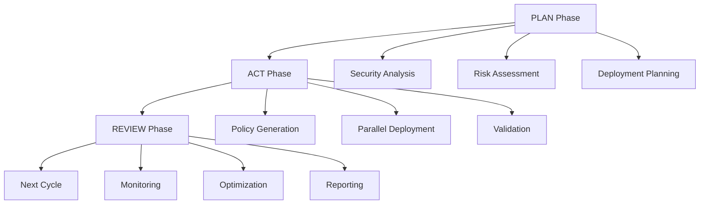

# Multi-Instance Security Agent System - Technical Architecture

**Document ID**: `MULTI_INSTANCE_SECURITY_AGENTS_ARCHITECTURE`
**Version**: 1.0
**Created**: 2026-01-13
**Last Updated**: 2026-01-13
**Author**: Construct AI Assistant

---

## System Overview

The Multi-Instance Security Agent System adapts the existing deep-agents architecture to provide automated Row Level Security (RLS) policy management across all Construct AI database tables. The system implements a Plan → Act → Review three-core-flow pattern to ensure safe, efficient, and comprehensive security policy deployment.

### Architecture Principles

#### **1. Agent-Based Design**
- **Modular Agents**: Each security function handled by specialized agents
- **Message-Based Communication**: Asynchronous agent coordination via message bus
- **Fault Isolation**: Agent failures don't compromise entire system
- **Scalable Deployment**: Agents can be scaled independently based on workload

#### **2. Three-Core-Flow Pattern**


#### **3. Safety-First Approach**
- **Zero-Trust Deployment**: Every policy change validated before application
- **Gradual Rollout**: Low-risk tables secured first, critical tables last
- **Automatic Rollback**: Immediate reversion capability on failures
- **Impact Monitoring**: Real-time performance assessment during deployment

---

## Core Components

### Agent Architecture

#### **Base Agent Class**
```python
from abc import ABC, abstractmethod
from typing import Dict, Any, Optional
from dataclasses import dataclass
from enum import Enum
import asyncio
import logging

class AgentState(Enum):
    IDLE = "idle"
    ACTIVE = "active"
    ERROR = "error"
    MAINTENANCE = "maintenance"

class AgentPriority(Enum):
    LOW = 1
    NORMAL = 2
    HIGH = 3
    CRITICAL = 4

@dataclass
class AgentMessage:
    message_id: str
    sender_id: str
    receiver_id: str
    message_type: str
    payload: Dict[str, Any]
    priority: AgentPriority
    timestamp: datetime
    correlation_id: Optional[str] = None

class BaseSecurityAgent(ABC):
    """Base class for all security agents"""

    def __init__(self, agent_id: str, config: Dict[str, Any]):
        self.agent_id = agent_id
        self.config = config
        self.state = AgentState.IDLE
        self.logger = logging.getLogger(f"{self.__class__.__name__}({agent_id})")
        self.message_queue = asyncio.Queue()
        self.active_tasks: Dict[str, asyncio.Task] = {}

    @abstractmethod
    async def process_message(self, message: AgentMessage) -> Optional[AgentMessage]:
        """Process incoming message and return response"""
        pass

    @abstractmethod
    async def initialize(self) -> bool:
        """Initialize agent resources"""
        pass

    @abstractmethod
    async def shutdown(self) -> bool:
        """Clean shutdown of agent resources"""
        pass

    async def send_message(self, message: AgentMessage) -> None:
        """Send message to communication bus"""
        await self.communication_bus.send_message(message)

    async def run(self) -> None:
        """Main agent execution loop"""
        try:
            self.state = AgentState.ACTIVE
            await self.initialize()

            while self.state == AgentState.ACTIVE:
                try:
                    message = await asyncio.wait_for(
                        self.message_queue.get(),
                        timeout=1.0
                    )

                    response = await self.process_message(message)
                    if response:
                        await self.send_message(response)

                except asyncio.TimeoutError:
                    # Perform maintenance tasks
                    await self.perform_maintenance()
                    continue

        except Exception as e:
            self.logger.error(f"Agent execution failed: {e}")
            self.state = AgentState.ERROR
        finally:
            await self.shutdown()
```

### Communication Infrastructure

#### **Message Bus Architecture**
```python
class AgentCommunicationBus:
    """Central communication hub for all agents"""

    def __init__(self):
        self.agents: Dict[str, BaseSecurityAgent] = {}
        self.message_queues: Dict[str, asyncio.Queue] = {}
        self.routing_table: Dict[str, List[str]] = {}
        self.logger = logging.getLogger("AgentCommunicationBus")

    def register_agent(self, agent: BaseSecurityAgent) -> None:
        """Register agent with communication bus"""
        self.agents[agent.agent_id] = agent
        self.message_queues[agent.agent_id] = agent.message_queue
        self.logger.info(f"Registered agent: {agent.agent_id}")

    async def send_message(self, message: AgentMessage) -> None:
        """Route message to appropriate agent"""
        if message.receiver_id in self.message_queues:
            await self.message_queues[message.receiver_id].put(message)
            self.logger.debug(f"Message {message.message_id} routed to {message.receiver_id}")
        else:
            self.logger.warning(f"No route found for message {message.message_id} to {message.receiver_id}")

    async def broadcast_message(self, message: AgentMessage, agent_types: List[str]) -> None:
        """Broadcast message to all agents of specified types"""
        for agent_id, agent in self.agents.items():
            if agent.__class__.__name__ in agent_types:
                broadcast_msg = message.copy()
                broadcast_msg.receiver_id = agent_id
                await self.send_message(broadcast_msg)
```

### Security Analysis Agent

#### **Table Security Scanner**
```python
class TableSecurityScanner:
    """Scans individual tables for security posture"""

    def __init__(self, db_connection: DatabaseConnection):
        self.db = db_connection
        self.schema_cache: Dict[str, Dict] = {}

    async def scan_table_security(self, table_name: str) -> SecurityAssessment:
        """Comprehensive security scan of a table"""

        # Get table metadata
        table_info = await self.get_table_metadata(table_name)

        # Check for RLS policies
        rls_policies = await self.get_rls_policies(table_name)

        # Analyze data sensitivity
        data_classification = await self.classify_table_data(table_info)

        # Check foreign key relationships
        relationships = await self.analyze_relationships(table_name)

        # Generate risk assessment
        risk_score = self.calculate_risk_score(table_info, rls_policies, data_classification)

        return SecurityAssessment(
            table_name=table_name,
            has_rls_policies=len(rls_policies) > 0,
            policy_count=len(rls_policies),
            data_classification=data_classification,
            risk_score=risk_score,
            relationships=relationships,
            recommendations=self.generate_recommendations(risk_score, rls_policies)
        )

    async def get_table_metadata(self, table_name: str) -> Dict[str, Any]:
        """Get comprehensive table metadata"""
        query = """
        SELECT
            c.table_name,
            c.column_name,
            c.data_type,
            c.is_nullable,
            c.column_default,
            tc.constraint_type,
            kcu.referenced_table_name,
            kcu.referenced_column_name
        FROM information_schema.columns c
        LEFT JOIN information_schema.table_constraints tc
            ON c.table_name = tc.table_name AND tc.constraint_type = 'FOREIGN KEY'
        LEFT JOIN information_schema.key_column_usage kcu
            ON tc.constraint_name = kcu.constraint_name
        WHERE c.table_name = $1
        ORDER BY c.ordinal_position;
        """

        result = await self.db.execute_query(query, [table_name])
        return self.process_metadata_result(result)

    async def get_rls_policies(self, table_name: str) -> List[Dict[str, Any]]:
        """Get all RLS policies for a table"""
        query = """
        SELECT
            schemaname,
            tablename,
            policyname,
            permissive,
            roles,
            cmd,
            qual,
            with_check
        FROM pg_policies
        WHERE schemaname = 'public' AND tablename = $1;
        """

        return await self.db.execute_query(query, [table_name])

    def classify_table_data(self, table_info: Dict) -> DataClassification:
        """Classify table data sensitivity"""
        sensitive_indicators = {
            'extreme': ['password', 'ssn', 'credit_card', 'financial', 'salary'],
            'high': ['email', 'phone', 'address', 'personal_info', 'medical'],
            'medium': ['project_data', 'client_info', 'internal_docs'],
            'low': ['public_content', 'reference_data', 'logs']
        }

        columns = table_info.get('columns', [])
        classification = DataClassification.LOW

        for column in columns:
            column_name = column['name'].lower()
            for level, indicators in sensitive_indicators.items():
                if any(indicator in column_name for indicator in indicators):
                    if level == 'extreme':
                        return DataClassification.EXTREME
                    elif level == 'high' and classification != DataClassification.EXTREME:
                        classification = DataClassification.HIGH
                    elif level == 'medium' and classification not in [DataClassification.EXTREME, DataClassification.HIGH]:
                        classification = DataClassification.MEDIUM

        return classification

    def calculate_risk_score(self, table_info: Dict, policies: List[Dict], classification: DataClassification) -> float:
        """Calculate risk score from 1-10"""
        base_score = 5.0

        # Adjust based on data classification
        classification_multipliers = {
            DataClassification.EXTREME: 2.0,
            DataClassification.HIGH: 1.5,
            DataClassification.MEDIUM: 1.0,
            DataClassification.LOW: 0.5
        }
        base_score *= classification_multipliers[classification]

        # Adjust based on policy presence
        if not policies:
            base_score *= 2.0  # No policies = high risk
        elif len(policies) < 2:
            base_score *= 1.5  # Minimal policies = medium risk
        else:
            base_score *= 0.8  # Good policy coverage = lower risk

        return min(10.0, max(1.0, base_score))
```

### Policy Generation Engine

#### **Intelligent Policy Selector**
```python
class PolicyGenerationEngine:
    """Generates appropriate RLS policies based on security assessment"""

    def __init__(self):
        self.policy_templates = self.load_policy_templates()
        self.organization_configs = self.load_organization_configs()

    def select_policy_pattern(self, assessment: SecurityAssessment) -> PolicyPattern:
        """Select appropriate policy pattern based on assessment"""

        # High-risk tables get complex multi-condition policies
        if assessment.risk_score >= 8.0:
            return PolicyPattern.COMPLEX_MULTI_CONDITION

        # Organization-scoped data gets organization isolation
        if self.has_organization_column(assessment.table_name):
            return PolicyPattern.ORGANIZATION_ISOLATION

        # User-owned data gets ownership policies
        if self.has_user_ownership_fields(assessment.table_name):
            return PolicyPattern.USER_OWNERSHIP

        # Default to authenticated access for internal data
        if assessment.data_classification in [DataClassification.MEDIUM, DataClassification.HIGH]:
            return PolicyPattern.AUTHENTICATED_ACCESS

        # Public/reference data gets service role override
        return PolicyPattern.SERVICE_ROLE_OVERRIDE

    def generate_policy(self, pattern: PolicyPattern, table_name: str, context: Dict) -> RLSPolicy:
        """Generate specific policy for table"""

        template = self.policy_templates[pattern.value]
        policy_sql = template.format(
            table=table_name,
            organization_id=context.get('organization_id', '90cd635a-380f-4586-a3b7-a09103b6df94'),
            **context
        )

        return RLSPolicy(
            table_name=table_name,
            policy_name=f"{table_name}_{pattern.value}_policy",
            policy_sql=policy_sql,
            pattern=pattern,
            risk_level=self.get_risk_level(pattern),
            requires_testing=self.requires_special_testing(pattern)
        )

    def customize_for_organization(self, base_policy: RLSPolicy, org_config: Dict) -> RLSPolicy:
        """Customize policy for specific organization requirements"""

        customized_sql = base_policy.policy_sql

        # Apply organization-specific customizations
        for key, value in org_config.items():
            if f"{{{key}}}" in customized_sql:
                customized_sql = customized_sql.replace(f"{{{key}}}", str(value))

        return RLSPolicy(
            table_name=base_policy.table_name,
            policy_name=f"{base_policy.table_name}_{org_config['org_id']}_policy",
            policy_sql=customized_sql,
            pattern=base_policy.pattern,
            risk_level=base_policy.risk_level,
            requires_testing=base_policy.requires_testing,
            organization_id=org_config['org_id']
        )

    def validate_policy_syntax(self, policy_sql: str) -> ValidationResult:
        """Validate policy SQL syntax and logic"""

        # Parse SQL to check syntax
        try:
            parsed = sqlparse.parse(policy_sql)[0]
        except Exception as e:
            return ValidationResult(valid=False, errors=[f"SQL syntax error: {e}"])

        # Check for required elements
        errors = []

        if "CREATE POLICY" not in policy_sql.upper():
            errors.append("Missing CREATE POLICY statement")

        if "FOR ALL USING" not in policy_sql.upper():
            errors.append("Missing FOR ALL USING clause")

        if "auth.uid()" not in policy_sql and "auth.role()" not in policy_sql:
            errors.append("Policy must reference auth.uid() or auth.role()")

        return ValidationResult(valid=len(errors) == 0, errors=errors)
```

### Multi-Instance Deployment Coordinator

#### **Safe Parallel Deployment**
```python
class MultiInstanceDeploymentCoordinator:
    """Coordinates safe parallel deployment across multiple instances"""

    def __init__(self, instances: List[DatabaseInstance], max_concurrent: int = 5):
        self.instances = instances
        self.max_concurrent = max_concurrent
        self.deployment_queue = asyncio.Queue()
        self.results: Dict[str, DeploymentResult] = {}

    async def plan_deployment(self, policies: List[RLSPolicy]) -> DeploymentPlan:
        """Create optimized deployment plan"""

        # Group policies by risk level
        risk_groups = self.group_policies_by_risk(policies)

        # Create deployment waves
        waves = []
        current_wave = []

        for risk_level in ['low', 'medium', 'high', 'extreme']:
            group_policies = risk_groups.get(risk_level, [])

            # Split high-risk policies into smaller batches
            if risk_level in ['high', 'extreme']:
                batch_size = 3
            else:
                batch_size = 10

            for i in range(0, len(group_policies), batch_size):
                batch = group_policies[i:i + batch_size]
                waves.append(DeploymentWave(
                    wave_id=f"wave_{len(waves)}",
                    policies=batch,
                    risk_level=risk_level,
                    estimated_duration=self.estimate_wave_duration(batch),
                    rollback_priority=self.get_rollback_priority(risk_level)
                ))

        return DeploymentPlan(
            waves=waves,
            total_policies=len(policies),
            estimated_duration=sum(w.estimated_duration for w in waves),
            rollback_plan=self.create_rollback_plan(waves)
        )

    async def execute_deployment(self, plan: DeploymentPlan) -> DeploymentResult:
        """Execute deployment plan with safety controls"""

        logger.info(f"Starting deployment of {plan.total_policies} policies in {len(plan.waves)} waves")

        for wave in plan.waves:
            logger.info(f"Executing wave {wave.wave_id} ({wave.risk_level} risk)")

            # Pre-deployment safety checks
            safety_check = await self.perform_safety_checks(wave)
            if not safety_check.passed:
                logger.error(f"Safety check failed for wave {wave.wave_id}: {safety_check.errors}")
                await self.rollback_wave(wave)
                continue

            # Execute wave across all instances
            wave_results = await self.execute_wave_parallel(wave)

            # Validate results
            validation = await self.validate_wave_results(wave_results)

            if not validation.success:
                logger.error(f"Wave {wave.wave_id} validation failed")
                await self.rollback_wave(wave)
                # Consider stopping deployment based on error severity
                if validation.critical_error:
                    break

            # Monitor impact for specified duration
            await self.monitor_post_deployment_impact(wave, duration_minutes=30)

        return self.compile_final_results(plan)

    async def execute_wave_parallel(self, wave: DeploymentWave) -> WaveResult:
        """Execute single wave across all instances in parallel"""

        semaphore = asyncio.Semaphore(self.max_concurrent)

        async def deploy_to_instance(instance: DatabaseInstance, policies: List[RLSPolicy]):
            async with semaphore:
                return await instance.deploy_policies(policies)

        # Deploy to all instances concurrently
        tasks = [
            deploy_to_instance(instance, wave.policies)
            for instance in self.instances
        ]

        results = await asyncio.gather(*tasks, return_exceptions=True)

        # Process results
        success_count = 0
        errors = []

        for i, result in enumerate(results):
            instance = self.instances[i]
            if isinstance(result, Exception):
                errors.append(f"Instance {instance.id}: {str(result)}")
            else:
                success_count += 1

        return WaveResult(
            wave_id=wave.wave_id,
            instances_attempted=len(self.instances),
            instances_successful=success_count,
            errors=errors,
            success=success_count == len(self.instances)
        )

    async def perform_safety_checks(self, wave: DeploymentWave) -> SafetyCheckResult:
        """Perform comprehensive safety checks before deployment"""

        checks = []

        # Check database connectivity
        for instance in self.instances:
            connected = await instance.test_connection()
            checks.append(SafetyCheck("connectivity", connected, f"Instance {instance.id} connectivity"))

        # Check for conflicting policies
        existing_policies = await self.check_existing_policies(wave.policies)
        checks.append(SafetyCheck("policy_conflicts", not existing_policies, "No policy conflicts detected"))

        # Check system resources
        resources_ok = await self.check_system_resources()
        checks.append(SafetyCheck("system_resources", resources_ok, "System resources adequate"))

        # Check recent backup status
        backup_ok = await self.check_backup_status()
        checks.append(SafetyCheck("backup_status", backup_ok, "Recent backup available"))

        passed = all(check.passed for check in checks)
        errors = [check.message for check in checks if not check.passed]

        return SafetyCheckResult(passed=passed, checks=checks, errors=errors)

    async def rollback_wave(self, wave: DeploymentWave) -> RollbackResult:
        """Rollback failed wave deployment"""

        logger.warning(f"Rolling back wave {wave.wave_id}")

        rollback_tasks = []
        for instance in self.instances:
            rollback_tasks.append(instance.rollback_policies(wave.policies))

        results = await asyncio.gather(*rollback_tasks, return_exceptions=True)

        success_count = sum(1 for r in results if not isinstance(r, Exception))

        return RollbackResult(
            wave_id=wave.wave_id,
            instances_attempted=len(self.instances),
            instances_successful=success_count,
            success=success_count == len(self.instances)
        )
```

### Security Monitoring System

#### **Real-Time Security Monitor**
```python
class SecurityMonitoringAgent(BaseSecurityAgent):
    """Continuous monitoring of security policy effectiveness"""

    def __init__(self, agent_id: str, config: Dict[str, Any]):
        super().__init__(agent_id, config)
        self.monitoring_interval = config.get('monitoring_interval', 300)  # 5 minutes
        self.alert_thresholds = config.get('alert_thresholds', {})
        self.performance_baselines: Dict[str, float] = {}

    async def initialize(self) -> bool:
        """Initialize monitoring baselines"""
        try:
            # Load performance baselines
            self.performance_baselines = await self.load_performance_baselines()

            # Set up monitoring queries
            self.monitoring_queries = self.prepare_monitoring_queries()

            # Initialize anomaly detection
            self.anomaly_detector = AnomalyDetector(self.config)

            self.logger.info("Security monitoring agent initialized")
            return True
        except Exception as e:
            self.logger.error(f"Failed to initialize monitoring: {e}")
            return False

    async def process_message(self, message: AgentMessage) -> Optional[AgentMessage]:
        """Process monitoring-related messages"""

        if message.message_type == "start_monitoring":
            await self.start_continuous_monitoring()
            return AgentMessage(
                message_id=f"response_{message.message_id}",
                sender_id=self.agent_id,
                receiver_id=message.sender_id,
                message_type="monitoring_started",
                payload={"status": "active"},
                priority=AgentPriority.NORMAL,
                timestamp=datetime.now()
            )

        elif message.message_type == "stop_monitoring":
            await self.stop_continuous_monitoring()
            return AgentMessage(
                message_id=f"response_{message.message_id}",
                sender_id=self.agent_id,
                receiver_id=message.sender_id,
                message_type="monitoring_stopped",
                payload={"status": "inactive"},
                priority=AgentPriority.NORMAL,
                timestamp=datetime.now()
            )

        return None

    async def start_continuous_monitoring(self) -> None:
        """Start continuous security monitoring"""

        self.logger.info("Starting continuous security monitoring")

        while self.state == AgentState.ACTIVE:
            try:
                # Collect security metrics
                metrics = await self.collect_security_metrics()

                # Analyze for anomalies
                anomalies = self.anomaly_detector.detect_anomalies(metrics)

                # Check policy effectiveness
                policy_effectiveness = await self.assess_policy_effectiveness()

                # Generate alerts if needed
                alerts = self.generate_alerts(anomalies, policy_effectiveness)

                # Send alerts to communication bus
                for alert in alerts:
                    alert_message = AgentMessage(
                        message_id=f"alert_{uuid.uuid4()}",
                        sender_id=self.agent_id,
                        receiver_id="alert_manager",
                        message_type="security_alert",
                        payload=alert,
                        priority=AgentPriority.HIGH if alert['severity'] == 'critical' else AgentPriority.NORMAL,
                        timestamp=datetime.now()
                    )
                    await self.send_message(alert_message)

                # Update performance baselines
                self.update_performance_baselines(metrics)

                # Wait for next monitoring cycle
                await asyncio.sleep(self.monitoring_interval)

            except Exception as e:
                self.logger.error(f"Monitoring cycle failed: {e}")
                await asyncio.sleep(60)  # Wait before retry

    async def collect_security_metrics(self) -> Dict[str, Any]:
        """Collect comprehensive security metrics"""

        metrics = {
            'timestamp': datetime.now().isoformat(),
            'policy_metrics': await self.get_policy_metrics(),
            'access_patterns': await self.get_access_patterns(),
            'performance_metrics': await self.get_performance_metrics(),
            'error_rates': await self.get_error_rates()
        }

        return metrics

    async def get_policy_metrics(self) -> Dict[str, Any]:
        """Get policy enforcement metrics"""

        query = """
        SELECT
            schemaname,
            tablename,
            policyname,
            permissive,
            roles
        FROM pg_policies
        WHERE schemaname = 'public';
        """

        policies = await self.db.execute_query(query)

        return {
            'total_policies': len(policies),
            'tables_with_policies': len(set(p['tablename'] for p in policies)),
            'policies_per_table': self.calculate_policies_per_table(policies)
        }

    async def get_access_patterns(self) -> Dict[str, Any]:
        """Analyze access patterns for anomalies"""

        # This would integrate with database audit logs
        # For now, return mock data structure
        return {
            'total_queries': 0,
            'blocked_queries': 0,
            'slow_queries': 0,
            'unusual_patterns': []
        }

    async def assess_policy_effectiveness(self) -> Dict[str, Any]:
        """Assess how effectively policies are working"""

        effectiveness = {
            'coverage_score': 0.0,  # Percentage of tables with policies
            'enforcement_score': 0.0,  # How well policies are blocking unauthorized access
            'performance_impact': 0.0,  # Query performance degradation
            'maintenance_score': 0.0   # How well policies are maintained
        }

        # Calculate coverage score
        total_tables = await self.get_total_table_count()
        tables_with_policies = await self.get_tables_with_policies_count()
        effectiveness['coverage_score'] = tables_with_policies / total_tables if total_tables > 0 else 0

        return effectiveness

    def generate_alerts(self, anomalies: List[Dict], effectiveness: Dict) -> List[Dict]:
        """Generate security alerts based on monitoring data"""

        alerts = []

        # Coverage alerts
        if effectiveness['coverage_score'] < 0.8:
            alerts.append({
                'type': 'coverage_gap',
                'severity': 'high',
                'message': f"RLS coverage below 80%: {effectiveness['coverage_score']:.1%}",
                'recommendation': 'Review and secure remaining tables'
            })

        # Performance alerts
        if effectiveness['performance_impact'] > 0.1:  # 10% degradation
            alerts.append({
                'type': 'performance_degradation',
                'severity': 'medium',
                'message': f"Query performance degraded by {effectiveness['performance_impact']:.1%}",
                'recommendation': 'Optimize policy queries or indexes'
            })

        # Anomaly alerts
        for anomaly in anomalies:
            if anomaly['confidence'] > 0.8:
                alerts.append({
                    'type': 'access_anomaly',
                    'severity': 'high' if anomaly['severity'] == 'critical' else 'medium',
                    'message': anomaly['description'],
                    'recommendation': 'Review access logs and consider policy adjustments'
                })

        return alerts

    def update_performance_baselines(self, metrics: Dict[str, Any]) -> None:
        """Update rolling performance baselines"""

        # Implement exponential moving average for baselines
        alpha = 0.1  # Smoothing factor

        for key, value in metrics.items():
            if isinstance(value, (int, float)):
                current_baseline = self.performance_baselines.get(key, value)
                self.performance_baselines[key] = alpha * value + (1 - alpha) * current_baseline
```

---

## Data Models & Schemas

### Core Data Classes

```python
from enum import Enum
from typing import Dict, List, Any, Optional
from dataclasses import dataclass
from datetime import datetime

class DataClassification(Enum):
    EXTREME = "extreme"  # Financial, credentials, PII
    HIGH = "high"        # Client data, internal docs
    MEDIUM = "medium"    # Project data, operational info
    LOW = "low"         # Public data, reference tables

class PolicyPattern(Enum):
    DEVELOPMENT_BYPASS = "development_bypass"
    SERVICE_ROLE_OVERRIDE = "service_role_override"
    ORGANIZATION_ISOLATION = "organization_isolation"
    USER_OWNERSHIP = "user_ownership"
    AUTHENTICATED_ACCESS = "authenticated_access"
    COMPLEX_MULTI_CONDITION = "complex_multi_condition"
    CONDITIONAL_BYPASS = "conditional_bypass"

@dataclass
class SecurityAssessment:
    table_name: str
    has_rls_policies: bool
    policy_count: int
    data_classification: DataClassification
    risk_score: float
    relationships: List[Dict[str, Any]]
    recommendations: List[str]
    assessed_at: datetime = datetime.now()

@dataclass
class RLSPolicy:
    table_name: str
    policy_name: str
    policy_sql: str
    pattern: PolicyPattern
    risk_level: str
    requires_testing: bool
    organization_id: Optional[str] = None
    created_at: datetime = datetime.now()

@dataclass
class DeploymentPlan:
    waves: List['DeploymentWave']
    total_policies: int
    estimated_duration: float
    rollback_plan: Dict[str, Any]

@dataclass
class DeploymentWave:
    wave_id: str
    policies: List[RLSPolicy]
    risk_level: str
    estimated_duration: float
    rollback_priority: int

@dataclass
class DeploymentResult:
    deployment_id: str
    total_policies: int
    successful_deployments: int
    failed_deployments: int
    errors: List[str]
    duration: float
    rollback_actions: List[Dict[str, Any]]

@dataclass
class MonitoringReport:
    timestamp: datetime
    coverage_score: float
    enforcement_score: float
    performance_impact: float
    anomalies_detected: int
    alerts_generated: int
    recommendations: List[str]
```

---

## Integration Points

### Database Layer Integration

#### **Database Connection Manager**
```python
class DatabaseConnectionManager:
    """Manages connections to multiple database instances"""

    def __init__(self, connection_configs: List[Dict[str, Any]]):
        self.instances: Dict[str, DatabaseInstance] = {}
        self.connection_pool: Dict[str, asyncio.Queue] = {}

        for config in connection_configs:
            instance = DatabaseInstance(config)
            self.instances[config['id']] = instance
            self.connection_pool[config['id']] = asyncio.Queue(maxsize=config.get('max_connections', 10))

    async def get_connection(self, instance_id: str) -> DatabaseConnection:
        """Get connection from pool"""
        pool = self.connection_pool[instance_id]

        # Wait for available connection
        connection = await pool.get()

        # Test connection health
        if not await connection.test_health():
            # Replace with healthy connection
            connection = await self.create_new_connection(instance_id)

        return connection

    async def execute_query(self, instance_id: str, query: str, params: List[Any] = None) -> List[Dict]:
        """Execute query on specific instance"""
        connection = await self.get_connection(instance_id)

        try:
            return await connection.execute_query(query, params or [])
        finally:
            # Return connection to pool
            await self.connection_pool[instance_id].put(connection)
```

### External System Integration

#### **Alert Management System**
```python
class AlertManager:
    """Central alert management and notification system"""

    def __init__(self, notification_channels: List[NotificationChannel]):
        self.channels = notification_channels
        self.alert_history: List[Alert] = []
        self.escalation_rules = self.load_escalation_rules()

    async def process_alert(self, alert: Dict[str, Any]) -> None:
        """Process and route security alerts"""

        # Enrich alert with context
        enriched_alert = await self.enrich_alert(alert)

        # Determine escalation level
        escalation_level = self.determine_escalation(enriched_alert)

        # Route to appropriate channels
        await self.route_alert(enriched_alert, escalation_level)

        # Store alert history
        self.alert_history.append(enriched_alert)

    async def enrich_alert(self, alert: Dict) -> Dict:
        """Add contextual information to alert"""

        # Add system status
        alert['system_status'] = await self.get_system_status()

        # Add related alerts
        alert['related_alerts'] = self.find_related_alerts(alert)

        # Add recommended actions
        alert['recommended_actions'] = self.generate_recommended_actions(alert)

        return alert

    def determine_escalation(self, alert: Dict) -> str:
        """Determine alert escalation level"""

        severity = alert.get('severity', 'low')
        impact = alert.get('impact', 'low')

        if severity == 'critical' or impact == 'high':
            return 'immediate'
        elif severity == 'high' or impact == 'medium':
            return 'urgent'
        else:
            return 'normal'

    async def route_alert(self, alert: Dict, escalation_level: str) -> None:
        """Route alert to appropriate notification channels"""

        for channel in self.channels:
            if channel.should_receive_alert(alert, escalation_level):
                await channel.send_alert(alert)
```

---

## Performance & Scalability

### Performance Optimizations

#### **Parallel Processing**
- **Agent Pool Management**: Dynamic scaling based on workload
- **Batch Processing**: Group similar operations for efficiency
- **Connection Pooling**: Reuse database connections across operations
- **Caching Strategy**: Cache frequently accessed metadata and policies

#### **Resource Management**
- **Memory Limits**: Prevent memory exhaustion during large deployments
- **CPU Throttling**: Adaptive CPU usage based on system load
- **I/O Optimization**: Asynchronous I/O for database operations
- **Timeout Management**: Configurable timeouts for all operations

### Scalability Features

#### **Horizontal Scaling**
- **Agent Distribution**: Deploy agents across multiple servers
- **Load Balancing**: Distribute work across available agents
- **Instance Sharding**: Partition large deployments across instances

#### **Monitoring & Auto-Scaling**
- **Performance Metrics**: Real-time monitoring of agent performance
- **Auto-Scaling Triggers**: Scale agents based on queue depth and latency
- **Resource Forecasting**: Predict resource needs for large deployments

---

## Security Considerations

### Agent Security
- **Secure Communication**: Encrypted message bus communication
- **Authentication**: Agent-to-agent authentication and authorization
- **Access Controls**: Least-privilege access for database operations
- **Audit Logging**: Comprehensive logging of all agent actions

### Policy Security
- **SQL Injection Prevention**: Parameterized queries for all policy generation
- **Policy Validation**: Multi-stage validation of generated policies
- **Rollback Security**: Secure rollback procedures prevent data exposure
- **Encryption**: Encrypt sensitive policy data at rest and in transit

### Operational Security
- **Change Management**: Formal approval process for policy deployments
- **Testing Environments**: Isolated testing environments for policy validation
- **Incident Response**: Automated incident response for security violations
- **Compliance Monitoring**: Continuous compliance checking and reporting

---

## Testing Strategy

### Unit Testing
```python
class TestSecurityAnalysisAgent:
    def test_table_security_scan(self):
        # Test table scanning functionality
        pass

    def test_risk_score_calculation(self):
        # Test risk scoring algorithm
        pass

    def test_data_classification(self):
        # Test data classification logic
        pass

class TestPolicyGenerationEngine:
    def test_policy_pattern_selection(self):
        # Test policy pattern selection
        pass

    def test_policy_sql_generation(self):
        # Test SQL generation
        pass

    def test_policy_validation(self):
        # Test policy validation
        pass
```

### Integration Testing
```python
class TestMultiInstanceDeployment:
    def test_parallel_deployment(self):
        # Test parallel deployment across instances
        pass

    def test_rollback_functionality(self):
        # Test rollback on deployment failure
        pass

    def test_safety_checks(self):
        # Test pre-deployment safety checks
        pass
```

### Performance Testing
```python
class TestSystemPerformance:
    def test_large_scale_deployment(self):
        # Test deployment of 1000+ policies
        pass

    def test_concurrent_agent_operations(self):
        # Test multiple agents operating concurrently
        pass

    def test_monitoring_system_load(self):
        # Test monitoring under high load
        pass
```

---

## Deployment & Operations

### Deployment Architecture

#### **Staged Rollout Plan**
1. **Development Environment**: Complete testing and validation
2. **Staging Environment**: Production-like testing with real data
3. **Production Rollout**: Phased deployment with monitoring
4. **Post-Deployment Monitoring**: 30-day monitoring period

#### **Rollback Procedures**
1. **Automatic Rollback**: Trigger on critical failures
2. **Manual Rollback**: Emergency rollback procedures
3. **Partial Rollback**: Rollback specific policy sets
4. **Verification**: Post-rollback system validation

### Operational Procedures

#### **Daily Operations**
- Monitor security alerts and anomalies
- Review policy effectiveness reports
- Update performance baselines
- Process automated compliance reports

#### **Weekly Operations**
- Review system performance metrics
- Update agent configurations
- Process security incident reports
- Plan upcoming deployments

#### **Monthly Operations**
- Comprehensive security audit
- Policy optimization review
- System capacity planning
- Stakeholder reporting

---

## Conclusion

This technical architecture provides a comprehensive framework for implementing a multi-instance security agent system. The design emphasizes:

- **Safety First**: Multiple layers of validation and rollback capabilities
- **Scalability**: Parallel processing and resource management
- **Maintainability**: Modular agent design and comprehensive monitoring
- **Security**: End-to-end security considerations and compliance monitoring

The system transforms the existing deep-agents architecture into a specialized security policy management platform, ensuring comprehensive RLS coverage across all 453 database tables while maintaining system stability and performance.