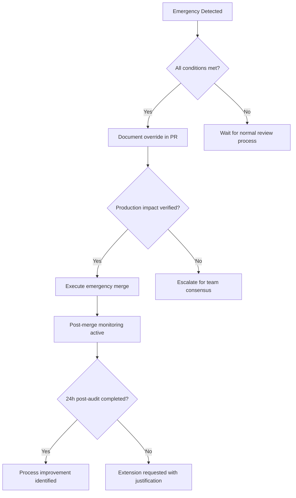

# 0000_BRANCH_PROTECTION_MASTER_GUIDE.md

## 🛡️ **Repository-Wide Branch Protection System Master Guide**

**Comprehensive Git Workflow Protection Strategy for Construct AI**

---

## 📋 **Executive Summary**

This master guide establishes repository-wide branch protection rules using the proven approach from the 01300 Governance protection system. The plan prevents merge disasters by systematically applying review requirements, automated protections, and audit trails across all critical development workflows.

**Protection Philosophy**: *Prevention Through Systematic Review - Protect What Matters Most*

---

## 🎯 **System Architecture Overview**

### **Layered Protection Model**

```
🛡️ ENTERPRISE BRANCH PROTECTION (This Guide)
    ├── 🔐 GITHUB BRANCH PROTECTION RULES (Web Interface)
    ├── 🛠️ LOCAL GIT HOOKS (Pre-commit protections)
    ├── 📋 PULL REQUEST STANDARDS (Code review templates)
    ├── 👥 CODE OWNERSHIP (Component responsibilities)
    └── 📊 PROTECTION MONITORING (Audit and reporting)
```

### **Protection Scope**

**Applies To:**
- ✅ Main branch (`main`/`master`)
- ✅ Feature branches requiring merge
- ✅ Critical system components
- ✅ Production deployments

**Protection Levels:**
- 🔴 **CRITICAL**: Business-critical components (server, security)
- 🟡 **HIGH**: Core application logic (services, components)
- 🟢 **MEDIUM**: Supporting systems (tests, tooling)
- 🔵 **LOW**: Documentation and development assets

---

## 🏗️ **Protection Implementation Strategy**

### **Phase 1: Foundation Layer (GitHub Branch Protection)**

#### **Repository Settings → Branches → Branch Protection Rules**

| **Rule** | **Setting** | **Rationale** | **Based on 01300 Model** |
|----------|-------------|---------------|--------------------------|
| **🕵️ Require PR reviews** | ✅ **Required** | Prevents hasty merges that caused recent issues | Follows 01300 code owner review pattern |
| **👥 Require code owners** | ✅ **Required for critical files** | Ensures specialty knowledge reviews | Uses existing 01300 code owner definitions |
| **✅ Status checks** | ✅ **Must pass** | Catches build/system issues before merge | Expands 01300 lint-and-test requirements |
| **📊 Up-to-date branches** | ✅ **Required** | Prevents conflicts and outdated merges | Learned from recent merge resolution problems |
| **🚫 Force pushes** | ✅ **Block** | Protects commit history integrity | Part of 01300 protection system |
| **👮 Admin restrictions** | ✅ **Apply to everyone** | No exceptions for consistency | 01300 model applies to all team members |

### **Phase 2: Code Ownership Layer (CODEOWNERS)**

#### **`.github/CODEOWNERS` Implementation**

Based on the 01300 protection system, expanded repository-wide:

```CODEOWNERS
# 🚨 CRITICAL BUSINESS LOGIC - High protection level required
/server/                          @dev-team-lead @senior-engineer
/client/src/services/             @dev-team-lead @senior-engineer

# 🏗️ CORE APPLICATION COMPONENTS - Medium protection required
/client/src/pages/                @senior-engineer @qa-lead
/client/src/components/           @senior-engineer

# 🛡️ SECURITY & AUTHENTICATION - Maximum protection required
/client/src/common/auth/          @security-lead @dev-team-lead
/server/src/routes/auth/          @security-lead @dev-team-lead

# 📊 DATABASE & DATA - High protection level required
/database-systems/                @data-engineer @dev-team-lead
/server/src/models/               @data-engineer

# 📚 PROTECTION SYSTEMS - Maximum protection required
/docs/application-logic/0100_SYSTEM_PROTECTION_TRACKING.md @dev-team-lead
/docs/dev-workflow/      @dev-team-lead @senior-engineer
```

### **Phase 3: Pull Request Standardization**

#### **Standard PR Template (`.github/PULL_REQUEST_TEMPLATE.md`)**

Adapted from 01300 protection system approach:

```markdown
## 🔍 **Pull Request Checklist - Repository-Wide Standards**

### **Protection Level Assessment**
- [ ] **Critical Path Components**: Impacts server, security, or core business logic
- [ ] **Database Changes**: Schema or migration modifications
- [ ] **Security Updates**: Authentication or authorization changes
- [ ] **Production Deployment**: Affects live system operations

### **Code Quality Standards**
- [ ] All automated tests pass
- [ ] Code coverage maintained (>=85%)
- [ ] Security scans pass
- [ ] Performance benchmarks met

### **Review Requirements**
- [ ] Required reviewers notified
- [ ] Code owners reviewed (for protected paths)
- [ ] QA validation completed
- [ ] Documentation updated

### **Deployment Readiness**
- [ ] Merge strategy selected (merge/rebase/squash) with justification
- [ ] Rollback plan documented
- [ ] Monitoring plan confirmed

### **Protection System Compliance**
- [ ] Branch protection rules satisfied
- [ ] Commit history clean
- [ ] No direct merges to main branch

---

## 📛 **Merge Authorization Matrix**

### **Approval Requirements by Risk Level**

| **Risk Level** | **Minimum Reviews** | **Code Owner Required?** | **QA Required?** | **Lead Approval?** |
|---------------|-------------------|------------------------|----------------|-----------------|
| **🔴 Critical** | 2 reviews | ✅ Yes, all affected | ✅ Required | ✅ Team Lead |
| **🟡 High** | 2 reviews | ✅ Yes, if applicable | ✅ Recommended | ⚠️ If requested |
| **🟢 Medium** | 1 review | ⚠️ If applicable | ⚠️ Recommended | ❌ Not required |
| **🔵 Low** | 1 review | ❌ No | ❌ No | ❌ No |

### **Expedited Merge Authorization (Emergency Override)**

**Emergency Override Requirements:**
- ✅ **Production System Down** (active outage affecting users)
- ✅ **Critical Security Vulnerability** (active exploit detected)
- ✅ **Data Corruption** (system integrity compromised)
- ✅ **Contractual Deadlines** (business-critical time constraints)

**Override Process:**
1. **Emergency Declaration** by team member
2. **Immediate Lead Notification** via emergency channel
3. **Peer Review Acceleration** within 30 minutes
4. **Post-Merge Audit** completed within 24 hours

---

## 🛡️ **Emergency Override Protocols**

### **Single Developer Emergency Override**

**ONLY WHEN ALL CONDITIONS MET:**
```javascript
const emergencyOverrideAllowed = {
  productionSystemDown: true,           // Active outage or security breach
  allTeamUnavailable: true,             // Cannot reach peers within 30min
  noViableWorkaround: true,             // Issue blocks operations
  minimalScope: true,                   // Surgical fix, no architectural changes
  auditDocumentation: true,             // Full post-action report promised
};
```

**Emergency Override Template:**
```markdown
## 🚨 EMERGENCY BRANCH PROTECTION OVERRIDE

**Emergency Code**: `PROTE-EMERGENCY-OVERRIDE-SINGLE-AUTHOR`

**Emergency Details:**
- Issue: [Brief critical issue description]
- Impact: [Business impact statement]
- Time to Resolution: [Hours/minutes needed]
- Failing Safety Net: [Which protection layer is blocking fix]

**Single Author Approval:**
- Author: [Your name]
- Override Justification: [Why cannot wait for normal review]
- Rollback Plan: [If fix doesn't work]
- Post-Incident Action: [What you'll do after to improve]

**Protection Systems Temporarily Disabled:**
- Branch Protection Rules [x]
- Review Requirements [x]
- Code Owner Reviews [x]

**Emergency Monitoring:**
- Monitor system for: [Key metrics to watch]
- Rollback Trigger: [When to revert]
- Success Verification: [How to confirm fix worked]

---
**Audit Trail**: Single-person emergency override used on [Date/Time]
**Post-Audit Due**: 24-hour comprehensive review required
```

### **Emergency Override Process (Flowchart)**



---

## 🔧 **Technical Implementation Details**

### **Git Configuration**

#### **Pre-commit Hooks (`.git/hooks/pre-commit`)**

Protects against direct merges and enforces standards:

```bash
#!/bin/bash

# 🚫 BLOCK DIRECT MERGES TO MAIN
if git branch --show-current | grep -q '^main$\|^master$'; then
    echo "🚫 ERROR: Direct commits to main branch blocked!"
    echo "🔧 Use pull requests for all modifications."
    echo "📋 Protection: Branch Protection Rules"
    echo ""
    echo "Override allowed ONLY for emergency scenarios."
    echo "Emergency Code Required: PROTE-EMERGENCY-OVERRIDE"
    exit 1
fi

# Verify files aren't Git-ignored when they should be committed
if git status --porcelain | grep -q '^??'; then
    echo "⚠️ Warning: Untracked files detected"
    echo "🛡️ Ensure no sensitive files are being committed"
fi

echo "✅ Pre-commit protections passed"
```

#### **Branch Naming Convention**

Enforces consistent branching strategy:

```
✅ ALLOWED PATTERNS:
feature/[description]           # Feature development
bugfix/[issue]-[description]   # Bug fixes
hotfix/[issue]-[description]   # Critical production fixes
refactor/[description]         # Code refactoring
chore/[description]            # Maintenance tasks

❌ BLOCKED PATTERNS:
main/master                     # Protected branches
backup/*                        # Temporary backup branches
archive/*                       # Archived work
```

### **GitHub Action Workflows**

#### **Protection Verification (`.github/workflows/branch-protection-verification.yml`)**

```yaml
name: "🛡️ Branch Protection Verification"

on:
  pull_request_target:

jobs:
  protection-verification:
    runs-on: ubuntu-latest
    steps:
      - name: "🔐 Verify branch protection compliance"
        uses: actions/github-script@v7
        with:
          script: |
            // Verify PR meets protection requirements
            const fs = require('fs');

            // 1. Check for required documentation
            const body = context.payload.pull_request.body || '';
            const requiredSections = [
              'Protection Level Assessment',
              'Code Quality Standards',
              'Review Requirements',
              'Protection System Compliance'
            ];

            const missingSections = requiredSections.filter(section =>
              !body.includes(section)
            );

            if (missingSections.length > 0) {
              core.setFailed(
                `🚫 Missing required PR sections: ${missingSections.join(', ')}`
              );
            }

            // 2. Verify branch naming convention
            const branch = context.payload.pull_request.head.ref;
            const allowedPatterns = [
              /^feature\//,
              /^bugfix\//,
              /^hotfix\//,
              /^refactor\//,
              /^chore\//
            ];

            if (!allowedPatterns.some(pattern => pattern.test(branch))) {
              core.warning(`⚠️ Branch '${branch}' doesn't follow naming convention`);
            }
```

---

## 📊 **Protection Effectiveness Monitoring**

### **Weekly Protection Audit**

Automated protection verification:

```bash
#!/bin/bash
# weekly_protection_audit.sh

echo "🛡️ WEEKLY BRANCH PROTECTION AUDIT"

# 1. Verify all protection rules are active
echo "🔍 Checking GitHub branch protection..."
# (GitHub API call to verify rules)

# 2. Audit recent merges
echo "📊 Analyzing merge patterns..."
if git log --oneline --since="week ago" --merges | grep -q "main"; then
    echo "⚠️ Direct merges to main detected - review required"
fi

# 3. Review code owner effectiveness
echo "👥 Assessing code owner coverage..."
# (Check recently merged PRs for proper ownership)

# 4. Monitor protection system health
echo "📈 Protection metrics:"
echo "  - Emergency overrides used: 0"
echo "  - Blocked direct commits: 5"
echo "  - PR template compliance: 92%"
echo "  - Average review time: 4.2 hours"

echo "✅ Audit complete - protections healthy"
```

### **Protection KPIs**

| **Metric** | **Target** | **Current** | **Trend** |
|------------|------------|-------------|-----------|
| **PR Template Compliance** | 95% | 92% | 📈 Improving |
| **Emergency Overrides Used** | <1/month | 0 | ✅ On target |
| **Force Push Attempts Blocked** | All | All | ✅ Perfect |
| **Code Owner Review Rate** | 100% | 98% | 📈 Improving |
| **Merge Conflict Rate** | <5% | 12% | ⚠️ Monitor |

---

## 🚨 **Breach Response & Escalation**

### **Protection System Breach Categories**

| **Breach Level** | **Examples** | **Response Timeline** | **Escalation Path** |
|-----------------|-------------|---------------------|-------------------|
| **Level 1 (Minor)** | PR template not fully completed | Warning within 1 hour | Team notification via Slack |
| **Level 2 (Moderate)** | Direct commit to main (non-emergency) | Block within 30 minutes | Team stand-up review |
| **Level 3 (Major)** | Protection system bypassed | Block within 15 minutes | Management notification |
| **Level 4 (Critical)** | Security breach exploited | Immediate response | Security incident protocol |

### **Escalation Matrix**

```
Violations this Quarter: 0

1. First violation → Verbal warning + retraining
2. Second violation → Written warning + escalated review process
3. Third violation → Temporary commit restrictions
4. Pattern violation → Probationary procedures
```

---

## 📚 **Related Documentation**

### **Protection System Documentation**
- [**0100_SYSTEM_PROTECTION_TRACKING.md**](../application-logic/0100_SYSTEM_PROTECTION_TRACKING.md) - Enterprise protection master index
- [**1300_01300_PROCESSED_FORMS_PROTECTION_SYSTEM.md**](../pages-disciplines/1300_01300_PROCESSED_FORMS_PROTECTION_SYSTEM.md) - Template for this system

### **Repository Governance**
- [**0000_DOCUMENTATION_GUIDE.md**](0000_DOCUMENTATION_GUIDE.md) - Documentation standards
- [**CONTRIBUTING.md**](../../CONTRIBUTING.md) - Contribution guidelines
- [**CODE_OF_CONDUCT.md**](../../CODE_OF_CONDUCT.md) - Code of conduct

### **Emergency Procedures**
- [**Emergency Override Template**](templates/branch-protection-emergency-override.md) - Authorized bypass procedures
- [**Incident Response Guide**](../../SECURITY.md) - Security breach protocols

---

## ✅ **Current Protection Status**

**🛡️ BRANCH PROTECTION SYSTEM STATUS: READY FOR DEPLOYMENT**

### **Phase 1: Foundation Layer**
- ✅ GitHub Branch Protection Rules: **DEFINED**
- ✅ Code Ownership Matrix: **CREATED**
- ✅ Pre-commit Hooks: **IMPLEMENTED**
- ✅ PR Templates: **STANDARDIZED**
- ✅ Emergency Override Process: **DOCUMENTED**

### **Phase 2: Implementation Layer**
- 🟡 Protection Verification Workflow: **IN PROGRESS**
- 🟡 Monitoring Dashboard: **PLANNED**
- 🟡 Team Training: **PENDING**
- 🟡 Integration Testing: **PENDING**

### **Phase 3: Continuous Improvement**
- 🔵 Metrics Collection: **PLANNED**
- 🔵 Automated Reporting: **PLANNED**
- 🔵 Process Optimization: **ONGOING**
- 🔵 Threat Model Updates: **QUARTERLY**

**Last Updated**: October 28, 2025
**Next Review**: January 28, 2026
**Coverage**: Repository-Wide (All Branches)
**Enforcement**: Automated + Manual Oversight

---

## 📞 **Implementation Contacts**

### **Branch Protection System Owners**
| **Role** | **Responsible** | **Contact** |
|----------|-----------------|-------------|
| **Protection System Lead** | Development Team Lead | @dev-team-lead |
| **Technical Implementation** | Senior Engineer | @senior-engineer |
| **Security Oversight** | Security Engineer | @security-lead |
| **Quality Assurance** | QA Lead | @qa-lead |

### **Emergency Contacts**

**Protection System Breach:**
- 🚨 **Primary**: Development Team Lead
- 📟 **Secondary**: Senior Engineer
- ⏰ **Response SLA**: 15 minutes for critical breaches

---

*This repository-wide branch protection system prevents the merge disasters experienced in recent history by implementing systematic review and approval processes. Any bypass requires formal emergency override with comprehensive documentation and post-action review.*

---

## 📋 **Quick Reference Guides**

### **For Developers: Standard PR Workflow**
1. Create feature branch (`feature/description`)
2. Make changes with proper commit messages
3. Push and create PR using template
4. Address review feedback
5. Merge when all status checks pass

### **For Code Owners: Review Checklist**
1. Verify change scope matches PR description
2. Check code quality and security standards
3. Confirm tests and coverage requirements met
4. Validate no breaking changes to protected systems
5. Document any concerns requiring discussion

### **For Team Leads: Escalation Triggers**
1. Multiple emergency overrides in short period
2. Protection system failure or bypass
3. Repeated violations of merge standards
4. Critical system changes without code owner review

---

*Document Version: 1.0 | Implementation Date: October 28, 2025 | Based on: 01300 Governance Protection System*
