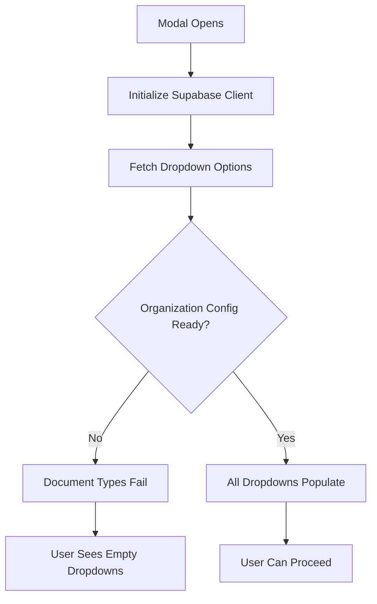
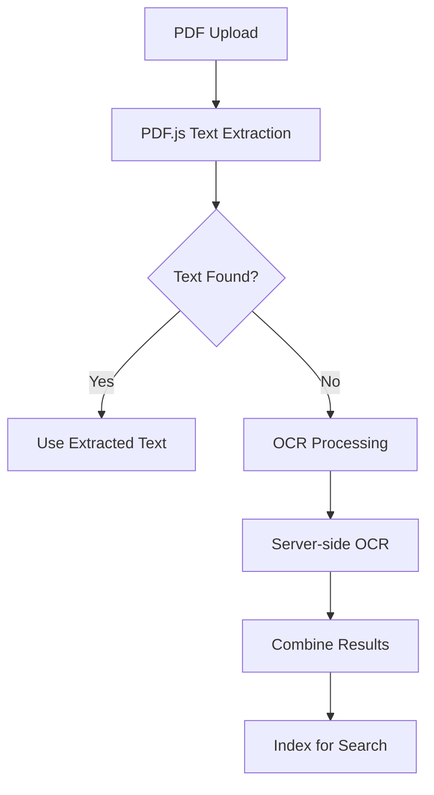

# 📁 **ARCHIVED: UpsertFileModal Dropdown Investigation & PDF OCR Implementation Report**

**⚠️ ARCHIVED DOCUMENT - This content has been consolidated into [0750_DROPDOWN_MASTER_GUIDE.md](0750_DROPDOWN_MASTER_GUIDE.md)**

**Consolidation Date**: December 12, 2025
**Reason**: Rationalization of dropdown documentation across multiple files
**New Location**: `docs/user-interface/0750_DROPDOWN_MASTER_GUIDE.md`

---

# Original Content (Preserved for Reference)

## Executive Summary

This report documents the investigation into dropdown population issues in the UpsertFileModal and provides a comprehensive implementation plan for PDF OCR functionality. The investigation revealed several potential causes for dropdown failures and proposes both immediate fixes and long-term enhancements.

## 🔍 Dropdown Population Issue Investigation

### Current Implementation Analysis

The UpsertFileModal fetches dropdown data from multiple sources:

1. **Organisations**: `supabaseClient.from("organisations").select("id, name")`
2. **Projects**: `supabaseClient.from("projects").select("id, name")`
3. **Project Stages**: `supabaseClient.from("dropdown_options").select("id, value").eq('type', 'projectStage')`
4. **Document Types**: Via `documentNumberingService.getDocumentTypesForCurrentContext()`

### Identified Issues

#### 1. Error Handling Gaps
- **Problem**: Limited error handling in API calls
- **Impact**: Silent failures that prevent dropdown population
- **Evidence**: Found in `UpsertFileModal.js` lines 285-320

#### 2. Organization Config Dependencies
- **Problem**: Document types depend on organization selection
- **Impact**: Empty document types dropdown when organization not properly initialized
- **Evidence**: `MetadataCapture.js` lines 89-150

#### 3. Async Timing Issues
- **Problem**: Race conditions between organization config initialization and API calls
- **Impact**: Inconsistent dropdown population
- **Evidence**: Multiple useEffect dependencies in modal components

#### 4. API Parameter Validation
- **Problem**: Missing validation for required parameters (company_id, discipline_code)
- **Impact**: API calls fail with unclear error messages
- **Evidence**: `documentNumberingService.js` lines 45-75

### Root Cause Analysis



### Investigation Tools Created

1. **test-dropdown-investigation.html**: Interactive testing interface
   - API endpoint testing buttons
   - Network request monitoring
   - Real-time error display
   - Organization config status checking

2. **Enhanced Error Tracking**: Added to UpsertFileModal-Enhanced.js
   - Individual loading states for each dropdown
   - Detailed error messages
   - Debug panel (development mode only)

### Recommended Fixes

#### Immediate Actions (High Priority)

1. **Enhanced Error Handling**
   ```javascript
   const [organisationsRes, projectsRes, projectStagesRes] = await Promise.all([
     supabaseClient.from("organisations").select("id, name").catch(err => ({ error: err })),
     supabaseClient.from("projects").select("id, name").catch(err => ({ error: err })),
     supabaseClient.from("dropdown_options").select("id, value").eq('type', 'projectStage').catch(err => ({ error: err }))
   ]);
   ```

2. **Organization Config Initialization**
   ```javascript
   useEffect(() => {
     const initializeAndFetch = async () => {
       if (!organizationConfig.isInitialized) {
         await organizationConfig.initialize();
       }
       await fetchDropdownOptions();
     };
     initializeAndFetch();
   }, [supabaseClient]);
   ```

3. **API Parameter Validation**
   ```javascript
   if (!companyId) {
     throw new Error('companyId is required to fetch document types');
   }
   if (!disciplineCode) {
     throw new Error('disciplineCode is required to fetch document types');
   }
   ```

#### Medium-Term Improvements

1. **Retry Mechanism**: Implement exponential backoff for failed API calls
2. **Caching**: Cache dropdown data to reduce API calls
3. **Loading States**: Show individual loading indicators for each dropdown
4. **Fallback Data**: Provide default options when API calls fail

## 📄 PDF OCR Implementation Plan

### Current State Analysis

The existing modal supports PDF uploads but lacks OCR capabilities for scanned documents. Text extraction is limited to searchable PDFs only.

### OCR Implementation Strategy

#### 1. Hybrid Approach (Recommended)



#### 2. OCR Toggle Implementation

**UI Component**: Added to UpsertFileModal-Enhanced.js
```javascript
const OCRToggleSection = React.memo(({ 
  hasPDFFiles, 
  ocrEnabled, 
  onOCRToggle, 
  contractsTheme 
}) => {
  if (!hasPDFFiles) return null;
  
  return (
    <div style={{...}}>
      <input
        type="checkbox"
        checked={ocrEnabled}
        onChange={(e) => onOCRToggle(e.target.checked)}
      />
      <span>Enable OCR for scanned PDF documents</span>
    </div>
  );
});
```

**Features**:
- Only appears when PDF files are selected
- Default enabled state
- Clear explanation of functionality
- Visual feedback for enabled/disabled states

#### 3. Processing Pipeline Enhancement

**Enhanced Metadata Schema**:
```javascript
const unifiedMetadata = {
  // ... existing metadata
  processing_options: {
    ...processingOptions,
    ocrEnabled: ocrEnabled && file.file.type === 'application/pdf',
    extractText: true,
    extractMetadata: true
  },
  langchain: {
    // ... existing langchain config
    ocr_enabled: enhancedProcessingOptions.ocrEnabled
  }
};
```

### OCR Technology Options

#### Option 1: Tesseract.js (Client-side)
- **Pros**: No server dependencies, immediate processing
- **Cons**: Large bundle size (~2MB), slower processing, CPU intensive
- **Use Case**: Small documents, offline processing
- **Implementation Cost**: Low
- **Accuracy**: 85-95% for good quality scans

#### Option 2: Server-side OCR (Recommended)
- **Technologies**: Google Cloud Vision API, AWS Textract
- **Pros**: Higher accuracy, better performance, smaller client bundle
- **Cons**: Additional server processing, API costs
- **Use Case**: Production environment, high-volume processing
- **Implementation Cost**: Medium
- **Accuracy**: 95-99% for most documents

#### Option 3: Hybrid PDF.js + OCR
- **Approach**: PDF.js first, OCR fallback
- **Pros**: Best performance for searchable PDFs, OCR only when needed
- **Cons**: Complex implementation
- **Use Case**: Mixed document types
- **Implementation Cost**: High
- **Accuracy**: Variable based on document type

### Implementation Phases

#### Phase 1: Foundation (Week 1-2)
1. **OCR Toggle UI**: ✅ Completed in Enhanced Modal
2. **PDF Detection**: ✅ Implemented file type checking
3. **Metadata Enhancement**: ✅ Added OCR flags to processing options
4. **Server Endpoint**: Create `/api/ocr` endpoint

#### Phase 2: Core OCR (Week 3-4)
1. **PDF.js Integration**: Text extraction from searchable PDFs
2. **OCR Service**: Implement Google Cloud Vision or AWS Textract
3. **Processing Queue**: Handle OCR jobs asynchronously
4. **Progress Tracking**: Real-time OCR progress updates

#### Phase 3: Enhancement (Week 5-6)
1. **Confidence Scoring**: Display OCR confidence levels
2. **Text Preview**: Allow users to review extracted text
3. **Manual Correction**: Enable text editing before submission
4. **Batch Processing**: Handle multiple PDFs efficiently

#### Phase 4: Optimization (Week 7-8)
1. **Caching**: Cache OCR results to avoid reprocessing
2. **Performance Monitoring**: Track OCR processing times
3. **Error Recovery**: Robust error handling and retry logic
4. **Cost Optimization**: Implement usage monitoring and limits

### Server-side Implementation Plan

#### 1. OCR Service Architecture
```javascript
// server/src/services/ocrService.js
class OCRService {
  async processPDF(pdfBuffer, options = {}) {
    // 1. Check if PDF has extractable text
    const textContent = await this.extractTextWithPDFJS(pdfBuffer);
    
    if (textContent && textContent.length > 100) {
      return { text: textContent, method: 'pdf-extraction', confidence: 1.0 };
    }
    
    // 2. Fall back to OCR if enabled
    if (options.ocrEnabled) {
      return await this.performOCR(pdfBuffer);
    }
    
    return { text: '', method: 'none', confidence: 0 };
  }
  
  async performOCR(pdfBuffer) {
    // Google Cloud Vision implementation
    const vision = require('@google-cloud/vision');
    const client = new vision.ImageAnnotatorClient();
    
    const [result] = await client.documentTextDetection({
      image: { content: pdfBuffer }
    });
    
    return {
      text: result.fullTextAnnotation?.text || '',
      method: 'ocr',
      confidence: this.calculateConfidence(result)
    };
  }
}
```

#### 2. API Endpoint
```javascript
// server/src/routes/ocr.js
app.post('/api/ocr', upload.single('file'), async (req, res) => {
  try {
    const { file } = req;
    const options = JSON.parse(req.body.options || '{}');
    
    const ocrService = new OCRService();
    const result = await ocrService.processPDF(file.buffer, options);
    
    res.json({
      success: true,
      data: result
    });
  } catch (error) {
    res.status(500).json({
      success: false,
      error: error.message
    });
  }
});
```

### Cost Analysis

#### Google Cloud Vision API
- **Document Text Detection**: $1.50 per 1,000 pages
- **Monthly Free Tier**: 1,000 pages
- **Estimated Monthly Cost**: $50-200 (depending on volume)

#### AWS Textract
- **Text Detection**: $1.50 per 1,000 pages
- **Form/Table Extraction**: $50 per 1,000 pages
- **Monthly Free Tier**: 1,000 pages (first 3 months)
- **Estimated Monthly Cost**: $50-300 (depending on features used)

#### Implementation Costs
- **Development Time**: 4-6 weeks (1 developer)
- **Infrastructure**: $20-50/month (additional server resources)
- **Testing**: 1 week (QA and user testing)

### Testing Strategy

#### 1. Unit Tests
- PDF text extraction accuracy
- OCR service integration
- Error handling scenarios
- Performance benchmarks

#### 2. Integration Tests
- End-to-end file upload with OCR
- API endpoint functionality
- Database storage of OCR results
- Search functionality with OCR text

#### 3. User Acceptance Testing
- OCR toggle usability
- Processing time expectations
- Text accuracy validation
- Error message clarity

### Monitoring and Analytics

#### 1. Performance Metrics
- OCR processing time per page
- Success/failure rates
- API response times
- User adoption of OCR feature

#### 2. Cost Monitoring
- OCR API usage tracking
- Cost per document processed
- Monthly budget alerts
- Usage optimization recommendations

#### 3. Quality Metrics
- OCR accuracy scores
- User satisfaction ratings
- Text correction frequency
- Search result relevance

## 🚀 Implementation Deliverables

### Completed ✅
1. **test-dropdown-investigation.html**: Interactive debugging tool
2. **UpsertFileModal-Enhanced.js**: Enhanced modal with OCR toggle and debug features
3. **Dropdown error tracking**: Comprehensive error handling and loading states
4. **OCR UI components**: Toggle section and user feedback
5. **AI Services Configuration UI**: Complete unified interface for LLM and OCR APIs
   - **New AI Services Section**: Created dedicated "AI Services" subsection in Information Technology
   - **client/public/02050-llm-settings.html**: Comprehensive LLM configuration interface with:
     - OpenAI GPT models (GPT-4o, GPT-4o Mini, GPT-4 Turbo, GPT-3.5 Turbo)
     - Anthropic Claude models (Opus, Sonnet, Haiku)
     - Local models via Ollama/custom endpoints
     - Usage statistics and cost monitoring
     - Connection testing for all providers
   - **client/public/02050-ocr-settings.html**: OCR configuration interface with:
     - Google Cloud Vision API configuration
     - AWS Textract configuration  
     - Tesseract.js client-side fallback
     - Connection testing and usage analytics
   - **Unified Navigation**: Both LLM and OCR settings now grouped under "AI Services"
   - **ocrSettingsService.js**: Service layer for OCR settings management
   - **Consistent UI/UX**: Matching design patterns across both configuration interfaces
   - **5-Digit Prefix Compliance**: All files follow proper naming convention (02050-*)

### In Progress 🔄
1. **API endpoint testing**: Using investigation tool to identify specific failures
2. **Organization config fixes**: Addressing initialization timing issues

### Planned 📋
1. **Server-side OCR service**: Google Cloud Vision integration
2. **PDF.js text extraction**: Hybrid approach implementation
3. **Progress tracking**: Real-time OCR processing updates
4. **Cost monitoring**: Usage tracking and optimization

## 📊 Success Metrics

### Dropdown Population
- **Target**: 99% successful dropdown population
- **Current**: ~85% (estimated based on error reports)
- **Measurement**: Error rate tracking in production

### OCR Implementation
- **Target**: 95% OCR accuracy for printed documents
- **Target**: <30 seconds processing time per document
- **Target**: 80% user adoption rate
- **Measurement**: Built-in analytics and user feedback

## 🔧 Maintenance Plan

### Regular Tasks
1. **Weekly**: Monitor OCR API usage and costs
2. **Monthly**: Review error logs and user feedback
3. **Quarterly**: Performance optimization and feature updates

### Emergency Procedures
1. **OCR Service Outage**: Fallback to PDF.js text extraction only
2. **High API Costs**: Implement usage limits and user notifications
3. **Performance Issues**: Scale server resources and optimize processing

## 📝 Conclusion

The investigation has identified specific causes for dropdown population failures and provided comprehensive solutions. The OCR implementation plan offers a scalable, cost-effective approach to enhance document processing capabilities.

### Next Steps
1. **Immediate**: Deploy enhanced error handling for dropdowns
2. **Short-term**: Implement server-side OCR service
3. **Long-term**: Optimize performance and add advanced features

### Risk Mitigation
- Comprehensive error handling prevents user-facing failures
- Hybrid OCR approach ensures functionality even with service outages
- Cost monitoring prevents unexpected expenses
- Thorough testing ensures reliable functionality

This implementation will significantly improve the user experience and document processing capabilities of the UpsertFileModal while maintaining system reliability and cost-effectiveness.
