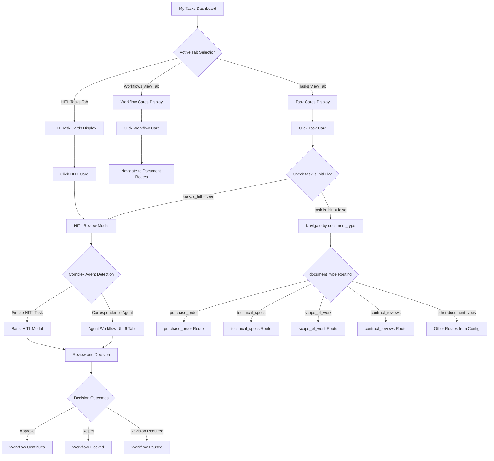

# My Tasks Dashboard Navigation Flow Diagram

## Overview

This diagram illustrates the navigation logic for the My Tasks dashboard at `http://localhost:3060/#/my-tasks`. It shows how task cards are handled based on their type and the active tab selection, ensuring HITL tasks open review modals while regular tasks navigate to document routes.

## 🚨 **COPYABLE NODE LABELS - QUICK REFERENCE GUIDE**

> **⚠️ IMPORTANT: ONLY copy labels from the YELLOW code blocks below**
> **🚫 DO NOT copy from the narrative text below - only from these code blocks!**

### **Navigation Flow Labels** - Copyable Node Labels
```yaml
My Tasks Dashboard
Active Tab Selection
Task Cards Display
Workflow Cards Display
HITL Task Cards Display
Click Task Card
Check task.is_hitl Flag
HITL Review Modal
Navigate by document_type
Complex Agent Detection
Agent Workflow UI - 6 Tabs
Basic HITL Modal
document_type Routing
purchase_order Route
technical_specs Route
scope_of_work Route
contract_reviews Route
Other Routes from Config
Click Workflow Card
Navigate to Document Routes
Click HITL Card
Review and Decision
Decision Outcomes
Workflow Continues
Workflow Blocked
Workflow Paused
```

### **Error States and Fallbacks** - Copyable Node Labels
```yaml
No HITL Tasks Available
Task Loading Error
Modal Open Failure
Route Not Found
```

---

## Primary Navigation Flow Diagram



## Detailed Implementation Sections

### **Task Click Handler Logic**

The core navigation logic implemented in `MyTasksDashboard.jsx`:

```javascript
const handleTaskClick = (task) => {
  // PRIORITY 1: Check if this is an HITL task first
  if (task.is_hitl) {
    console.log('Opening HITL review modal for task:', task.id);
    setSelectedHITLTask(task);
    setShowHITLModal(true);
    return;
  }

  // FALLBACK: Navigate to document route based on document_type
  const config = DOCUMENT_TYPE_CONFIGS[task.document_type];
  navigate(config?.route || '/my-tasks');
};
```

### **HITL Modal Decision Tree**

Complex agent detection in `01300-hitl-review-page.js`:

```javascript
// Check if this is a complex structured agent workflow
const isComplexStructuredAgent = hitlTask && (
  hitlTask.business_object_type === 'contractual_correspondence' ||
  hitlTask.metadata?.created_by_agent === 'ContractualCorrespondenceReplyAgent' ||
  hitlTask.metadata?.agent_workflow_step ||
  (hitlTask.metadata?.specialistAnalysis && Object.keys(hitlTask.metadata.specialistAnalysis).length > 0)
);

// Route to comprehensive workflow review for complex agents
if (isComplexStructuredAgent) {
  return (
    <AgentWorkflowReview
      taskId={taskId}
      show={show}
      onHide={onHide}
      onTaskResolved={onTaskResolved}
    />
  );
}
```

### **Document Route Configuration**

Route mapping in `MyTasksDashboard.jsx`:

```javascript
const DOCUMENT_TYPE_CONFIGS = {
  purchase_order: {
    title: 'Purchase Orders',
    route: '/purchase-orders',
    discipline: 'procurement'
  },
  scope_of_work: {
    title: 'Scope of Work',
    route: '/scope-of-work',
    discipline: 'engineering'
  },
  technical_specs: {
    title: 'Technical Specifications',
    route: '/technical-documents',
    discipline: 'engineering'
  },
  contract_reviews: {
    title: 'Contract Reviews',
    route: '/contracts',
    discipline: 'contracts'
  }
  // ... additional document types
};
```

## User Input Requirements

### **Navigation User Journey**

1. **User arrives** at My Tasks dashboard (`/my-tasks`)
2. **User selects tab**:
   - **Tasks View**: See all outstanding tasks (mixed HITL + regular)
   - **Workflows View**: See grouped workflow summaries
   - **HITL Tasks**: See only HITL tasks requiring review
3. **User clicks task card**:
   - **HITL tasks**: Modal opens automatically
   - **Regular tasks**: Navigate to document-specific page
4. **HITL Review Process**:
   - Complex agents → 6-tab comprehensive UI
   - Simple tasks → Basic review form
   - User makes decision → Workflow continues/rejects/pauses

### **Error Handling Scenarios**

- **No HITL Tasks**: Shows "No HITL Tasks" message in HITL tab
- **Task Loading Error**: Displays error message with retry option
- **Modal Failure**: Falls back to basic navigation
- **Route Not Found**: Redirects to `/my-tasks` with error notification

## Implementation Details

### **Data Sources**
- **HITL Tasks**: `/api/tasks/hitl` endpoint (separate from regular tasks)
- **Regular Tasks**: `tasks` table with status filters (`pending`, `in_progress`, `draft`)
- **HITL Detection**: `task.is_hitl` boolean field in database
- **Document Types**: `task.document_type` field routing logic

### **State Management**
- `selectedHITLTask`: Currently selected HITL task for modal
- `showHITLModal`: Modal visibility state
- `activeTab`: Current tab ('tasks', 'workflows', 'hitl')
- `searchFilters`: Active filters for task display

### **Performance Optimizations**
- Lazy loading of HITL tasks (only when HITL tab is clicked)
- Cached document type configurations
- Debounced search filtering
- Minimal re-renders on state changes

## Critical Path Analysis

### **Primary User Flow**
```
My Tasks → Click Task Card → Check HITL Flag → Open Appropriate Interface
```

### **Error Recovery Paths**
```
Task Click Failure → Check task.is_hitl → Fallback Navigation → Document Route
Modal Open Failure → Basic Navigation → Document Route → Error Notification
```

### **Performance Critical Points**
- Task click handler (synchronous decision logic)
- HITL modal opening (async task loading)
- Document route navigation (immediate redirect)

## **🚨 HOW TO ACCESS THE COMPLEX AGENT WORKFLOW UI**

### **Step-by-Step Guide to Trigger Correspondence Agent HITL Tasks:**

#### **Step 1: Trigger a Correspondence Agent Workflow**
```
1. Use the correspondence chatbot OR
2. Send correspondence via API to trigger analysis OR
3. Use the agent execution system to process contractual correspondence
```

#### **Step 2: Navigate to My Tasks Dashboard**
```
URL: http://localhost:3060/#/my-tasks
- This shows all outstanding tasks including HITL tasks
```

#### **Step 3: Click on HITL Task Cards**
```
✅ Look for tasks with:
- "HITL Task Review Required" in title
- Orange/red priority badges
- "contractual_correspondence" business object type
- "Correspondence Analysis" in description
```

#### **Step 4: Automatic Complex Agent Detection**
```
When you click an HITL task, the system automatically checks:
- business_object_type === 'contractual_correspondence' OR
- metadata.created_by_agent === 'ContractualCorrespondenceReplyAgent' OR
- metadata.agent_workflow_step exists OR
- metadata.specialistAnalysis has multiple entries
```

#### **Step 5: Access the Comprehensive UI**
```
✅ If complex agent detected → Agent Workflow Review UI opens:
- 📊 Overview Tab: Task metrics and workflow summary
- 🔄 Workflow Steps Tab: 7-step agent execution timeline
- 🎓 Specialist Analyses Tab: Domain expert consultations
- ⚖️ Contract Analysis Tab: Compliance and risk assessment
- ✉️ Final Response Tab: AI-generated draft correspondence
- ✅ Make Decision Tab: Structured approval/rejection interface
```

### **Alternative Direct Access Methods:**

#### **Method A: HITL Tasks Tab**
```
1. Go to My Tasks Dashboard
2. Click "HITL Tasks" tab (orange button)
3. Click any "Correspondence Analysis" task
4. Complex UI opens automatically
```

#### **Method B: Direct HITL Task URLs**
```
http://localhost:3060/#/my-tasks (then click HITL tab)
OR
Use API to create HITL tasks directly, then access via dashboard
```

#### **Method C: Agent Execution System**
```
1. Trigger correspondence agent via chatbot/API
2. Agent creates HITL task automatically
3. Access via My Tasks → HITL Tasks tab
```

## Key Takeaways

1. **HITL Priority**: All tasks are checked for `is_hitl` flag first
2. **Complex Agent Detection**: Correspondence agents get comprehensive 6-tab UI
3. **Fallback Navigation**: Regular tasks navigate by `document_type` to specific routes
4. **Error Resilience**: Multiple fallback paths ensure navigation always works
5. **Performance**: Lazy loading and caching prevent unnecessary API calls

### **🎯 QUICK ACCESS SUMMARY:**
```
Trigger Correspondence Agent → Go to My Tasks → Click HITL Task → Get Comprehensive UI
```

This navigation system ensures HITL tasks always open review modals while maintaining backward compatibility with regular task navigation.
