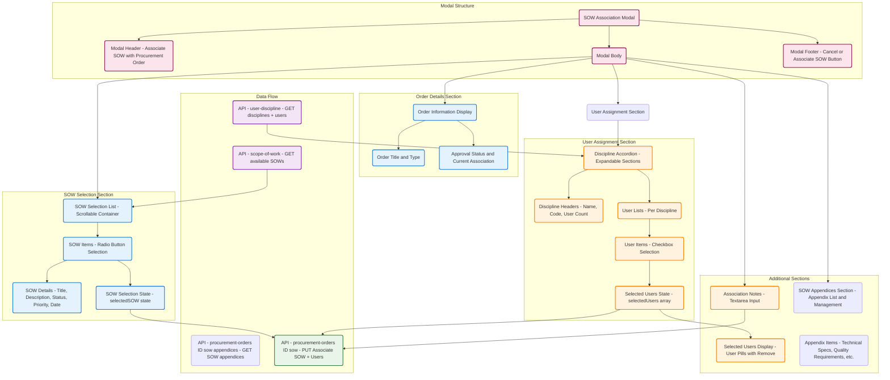

# SOW Association Modal UI Hierarchy & Data Flow



## UI Component Hierarchy Explanation

### **1. Modal Container Structure**
```
SOWAssociationModal (Root Component)
├── Modal Overlay (Backdrop)
└── Modal Container
    ├── Modal Header (Title + Close Button)
    ├── Modal Body (Main Content)
    │   ├── Order Details Section
    │   ├── SOW Selection Section
    │   ├── User Assignment Section
    │   ├── SOW Appendices Section
    │   └── Notes Section
    └── Modal Footer (Action Buttons)
```

### **2. Data Flow Architecture**
```
User Opens Modal
    ↓
Load Disciplines + Users (/api/user-discipline)
Load Available SOWs (/api/scope-of-work)
    ↓
User Selects SOW (updates selectedSOW state)
User Assigns Users (updates selectedUsers array)
User Adds Notes (updates associationNotes state)
    ↓
User Clicks "Associate SOW"
    ↓
API Call: PUT /api/procurement-orders/:id/sow
With: { sowId, assignedUsers, notes }
    ↓
Database Update: procurement_orders.sow_id = sowId
Modal Closes, UI Refreshes
```

### **3. State Management Hierarchy**
```
Component State (useState hooks)
├── selectedSOW: string | null
├── selectedUsers: string[] (user IDs)
├── associationNotes: string
├── disciplinesWithUsers: Discipline[]
├── expandedDisciplines: Set<string>
├── delegationSettings: object
└── Props from Parent
    ├── selectedOrder: object
    ├── availableSOWs: SOW[]
    └── handleSOWAssociation: function
```

### **4. User Interaction Flow**
```
1. Modal Opens → Load Data (SOWs + Disciplines)
2. User Views Order Details → Context for association
3. User Selects SOW → Radio button selection
4. User Assigns Users → Expand disciplines → Check users
5. User Adds Notes → Optional context
6. User Confirms → API call → State update → Modal close
```

## Document Hierarchy Establishment

### **Database Relationship Created**
```
Procurement Order (Parent)
├── sow_id → Scope of Work (Child)
├── Associated Users (Many-to-Many via assignment)
└── Association Notes (Metadata)
```

### **Hierarchy Levels**
```
Level 1: Procurement Order
    └── Level 2: Scope of Work (1:1 relationship)
        ├── Level 3: SOW Appendices (Technical Specs, Quality Requirements, etc.)
        ├── Level 3: Assigned Users (Many-to-many via disciplines)
        └── Level 3: Association Metadata (Notes, timestamps)
```

### **Workflow Integration**
```
Order Creation → Template Selection → SOW Association → User Assignment → Approval Workflow
    ↓              ↓                    ↓                   ↓                    ↓
Document      Auto-populate        Establish          Assign              Route for
Structure     Form Fields        Hierarchy          Responsibilities    Approval
```

## Component State Transitions

### **SOW Selection State**
```javascript
// Initial: selectedSOW = null
// User selects: selectedSOW = "sow-uuid-123"
// User changes: selectedSOW = "sow-uuid-456"
// User deselects: selectedSOW = null
```

### **User Assignment State**
```javascript
// Initial: selectedUsers = []
// User checks: selectedUsers = ["user-1", "user-2"]
// User unchecks: selectedUsers = ["user-1"]
// Modal reset: selectedUsers = []
```

### **Discipline Expansion State**
```javascript
// Initial: expandedDisciplines = new Set()
// User expands: expandedDisciplines = new Set(["discipline-1"])
// User expands another: expandedDisciplines = new Set(["discipline-1", "discipline-2"])
// User collapses: expandedDisciplines = new Set(["discipline-2"])
```

## Conditional Rendering Logic

### **Order Details Display**
```javascript
if (selectedOrder) {
  // Show order title, type, status
  // Show current SOW association if exists
}
```

### **SOW Selection Section**
```javascript
if (loadingSOWs) {
  // Show loading spinner
} else if (availableSOWs.length === 0) {
  // Show "no SOWs available" message
} else {
  // Show SOW selection list
}
```

### **User Assignment Section**
```javascript
if (selectedSOW) {
  // Show user assignment section
  if (loadingDisciplines) {
    // Show loading spinner
  } else if (disciplinesWithUsers.length === 0) {
    // Show "no disciplines available" message
  } else {
    // Show discipline accordions
  }
}
```

### **Selected Users Display**
```javascript
if (selectedUsers.length > 0) {
  // Show user pills with remove buttons
}
```

### **SOW Appendices Section**
```javascript
if (selectedSOW) {
  // Show SOW appendices section
  // Load appendices via /api/procurement-orders/:id/sow/appendices
  // Display appendix items: Technical Specs, Quality Requirements, etc.
  // Allow management/editing of appendices
}
```

### **Association Notes**
```javascript
if (selectedSOW) {
  // Show notes textarea
}
```

### **Action Button State**
```javascript
const canAssociate = selectedSOW !== null;
// Button disabled={!canAssociate}
// Button text = selectedOrder?.sow_id ? "Update Association" : "Associate SOW"
```

This diagram shows how the SOW Association Modal establishes the document hierarchy by allowing users to associate procurement orders with scope of work documents and assign responsible users from different disciplines.
