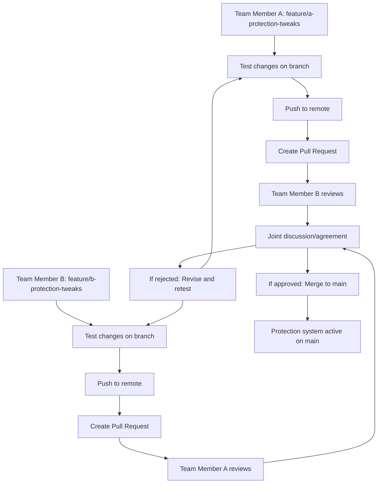

# 0100_SYSTEM_PROTECTION_TRACKING.md

## 🛡️ **Enterprise Application Protection System Master Index**

**Comprehensive Protection Framework for Critical Enterprise Functionality**

---

## 📋 **Executive Summary**

This master index coordinates all protection systems across the enterprise application. The protection framework implements multiple defensive layers to prevent accidental modifications to verified, production-ready functionality while enabling controlled evolution.

**Protection Philosophy**: *Defensive Programming with Maximum Safety*

---

## 🎯 **Protection Architecture Overview**

### **Hierarchical Protection Model**

```
🔴 ENTERPRISE LEVEL PROTECTION (This Document)
    ├── 🟡 PAGE LEVEL PROTECTION (per page documentation)
    ├── 🟢 COMPONENT LEVEL PROTECTION (specific features)
    └── 🔵 CODE LEVEL PROTECTION (implementation)
```

### **Protection Levels & Enforcement**

| **Level** | **Scope** | **Governance** | **Enforcement** |
|-----------|-----------|----------------|-----------------|
| **🔴 Enterprise** | Cross-application | CTO/DT Lead | System Architecture |
| **🟡 Page** | Page-specific | Page Owner | Documentation |
| **🟢 Component** | Feature-specific | Component Lead | Technical |
| **🔵 Code** | Implementation | Developer | Automated |

---

## 📊 **Current Protected Systems Inventory**

### **🔐 Critical Production Systems (STATUS: ACTIVE)**

#### **🎯 Governance Document Processing - 01300 Page**
**Protection Level**: 🟣 ULTRA-MAXIMUM (8-Layer Enterprise Protection)

- **📋 Processed Forms Tab** - Verify Document Processing Results modal
  - **Status**: ✅ FULLY PROTECTED
  - **Protection System**: `docs/pages-disciplines/1300_01300_PROCESSED_FORMS_PROTECTION_SYSTEM.md`
  - **Code Location**: `client/src/pages/01300-governance/components/features/ui-renderers/`
  - **Files Protected**: ContentComparisonRenderer.jsx, FormCreationModals.jsx
  - **Verification Date**: October 28, 2025

- **📤 Document Upload Modal** - Form Generation Workflow modal
  - **Status**: ✅ AI-RESISTANT PROTECTION APPLIED
  - **Protection Level**: 🔴 MAXIMUM (5-Barrier AI Lock)
  - **Protection Zones**: File validation, Network resilience, Error classification, Processing logic, Database integration
  - **AI Protection Barriers**: 5 protection comments with detailed warning instructions
  - **Code Location**: `client/src/pages/01300-governance/components/01300-document-upload-modal.js`
  - **Business Logic Protected**: File processing, Server communication, Form saving workflow
  - **Verification Date**: October 28, 2025

**Page Owner**: @dev-team-lead
**Business Criticality**: CRITICAL (Complete Form Generation Pipeline)

#### **🔍 Active Enhancement Opportunities**
- **Future Protections Needed**: [List systems requiring protection]
- **Monitoring Requirements**: Automated protection verification scripts
- **Auditing Schedule**: Monthly protection integrity checks

---

## 🛡️ **Protection Change Authority Matrix (2-Person Team)**

### **🎯 Who Can Change Protections?**

| **Protection Level** | **Authorized Personnel** | **Approval Process** | **Documentation Required** |
|---------------------|-------------------------|---------------------|----------------------------|
| **🔴 Enterprise Level** | **Both Team Members** | Mutual agreement required for enterprise protection strategy changes | Discussion notes + decision rationale documented |
| **🟡 Page-Level Protections** | **Team Member Agreement** | One member reviews, other approves for page-wide changes | Impact assessment documented |
| **🟢 Component-Level Protections** | **Team Member Agreement** | Formal code review + mutual approval for component changes | Technical justification + testing notes |
| **🔵 Code-Level Protections** | **Team Member Agreement** | Code review + joint testing (cannot be bypassed except for critical fixes) | Test results + mutual verification |

### **📋 Protection Bypass Policy**

**Protection systems CANNOT be bypassed except for:**

#### **🔴 EMERGENCY OVERRIDE AUTHORIZED - Single Person** (2-Person Teams)
- ✅ **Production System Down** (Users cannot access application)
- ✅ **Critical Security Vulnerabilities** (Active exploits/threats detected)
- ✅ **Infrastructure Failures** (Server/databases offline, payment processors failing)
- ✅ **Data Corruption Issues** (Incorrect data being processed/stored)
- ✅ **Business-Critical Deadlines** (Contractual obligations at immediate risk)

#### **🟠 CONDITIONAL OVERRIDE - Try Alternative First**
- ⚠️ **Time-Sensitive Feature Fixes** (Try pair programming or async review)
- ⚠️ **Customer Impact Issues** (Test on staging first, deploy rollback plan)
- ⚠️ **Performance Degradation** (Optimize without changing logic first)

#### **🔵 NEVER BYPASS EXCEPTIONS**
- ❌ **Feature enhancements** (use proper approval process)
- ❌ **Code refactoring** (unless performance/critical bug)
- ❌ **Business requests** (must follow approval hierarchy)
- ❌ **Time pressure** (schedule changes require process)

---

## 🚨 **2-Person Team Emergency Override System**

**For small teams where one member may be unavailable during critical incidents.**

### **🎯 Emergency Override Codes & Classifications**

| **Emergency Level** | **Override Code** | **Notification Required** | **Documentation Deadline** |
|-------------------|----------------|--------------------------|---------------------------|
| **CRITICAL** | `PROTE-INST-AGREE-MANUALLY` | Immediate post-change | 24 hours |
| **SECURITY** | `PROTE-CRIT-SECUR-VIOLATION` | Team alert required | 12 hours |
| **PRODUCTION** | `PROTE-PROD-SYSTEMS-DOWN` | Business stakeholders | 48 hours |
| **DATA** | `PROTE-DATA-CORRUPTION-DETECT` | Data team alert | 24 hours |

### **📋 Emergency Override Procedure**

#### **Step 1: Emergency Validation**
Verify these conditions **ALL MET**:
```javascript
const isTrueEmergency = {
  isImmediateRisk: true,       // Users/business affected NOW
  otherMemberUnavailable: true, // Cannot reach team member
  noWorkableAlternative: true,  // Cannot delay or work around
  limitedScopeSolution: true    // Change is targeted/surgical
};
```

#### **Step 2: Override Documentation in Code**
Before making changes, add this comment **ABOVE** the protected code:

```javascript
/*
🚨 EMERGENCY OVERRIDE ACTIVATED - SINGLE PERSON APPROVAL
Override Code: PROTE-INST-AGREE-MANUALLY
Emergency Reason: [ONE SENTENCE DESCRIPTION]
Override Decision By: [AVAILABLE TEAM MEMBER NAME]
Emergency Classification: CRITICAL/SECURITY/PRODUCTION/DATA
Time to Resolution: [HRS/MINS NEEDED TO RESTORE]
Business Impact: [ONE SENTENCE IMPACT STATEMENT]
Failure Consequence: [WHAT HAPPENS IF NOT FIXED]

Override Authority: SINGLE-PERSON EMERGENCY PROTOCOL (2-Person Team)
Post-Action Documentation: Emergency Incident Report within 24hrs
Timestamp: [YYYY-MM-DD HH:MM] [TEAM MEMBER INITIALS]
*/
```

#### **Step 3: Implement Emergency Changes**
1. **Document first** (add comment above protected code)
2. **Make minimal changes** (only what's absolutely necessary)
3. **Test thoroughly** (both functionality and team notification)
4. **Monitor closely** (watch for side effects)
5. **Revert when safe** (return to dual-control protection)

#### **Step 4: Emergency Incident Report**
**Must file within override deadline.** Use the emergency incident report template provided.

### **🔄 Post-Emergency Review Process**

**Within 48 hours of emergency resolution:**

1. **Technical Review Meeting**
   - Review what was changed and why
   - Discuss prevention strategies for similar incidents
   - Identify potential protection system improvements

2. **Process Improvement Documentation**
   - Add recommendations to protection system docs
   - Consider implementing additional safety measures
   - Review emergency override classification if too frequent

3. **Protection System Update**
   - Strengthen protections in areas that failed
   - Consider additional monitoring/alerting
   - Update emergency contact procedures

### **📊 Emergency Override Metrics**

For system health tracking:
```json
{
  "emergency_overrides_used": 0,
  "last_emergency_override": null,
  "override_effectiveness": "N/A",
  "protection_system_feedback": []
}
```

### **🚫 Emergency Abuse Prevention**

**Overrides can ONLY be used when:**
- ✅ **Documented business impact** exists
- ✅ **All alternatives exhausted** (staging tests, workarounds, etc.)
- ✅ **Scoped to critical functionality only**
- ✅ **Professional judgment applied** (not convenience)

**Automatic audit triggers:**
- More than 2 overrides per month → Reassess protection needs
- Security-related overrides → Mandatory security review
- Repeated same function overrides → Protection redesign

---

## 🗂️ **Protection System Documentation Structure**

### **📁 Document Organization**

```
docs/
├── application-logic/
│   └── 🔴 0100_SYSTEM_PROTECTION_TRACKING.md (This document)
├── pages-disciplines/
│   └── 🟡 1300_[PAGE]_PROTECTION_SYSTEM.md (Page-level protections)
└── pages-disciplines/
    └── 🟢 1300_[PAGE]_SPECIFIC_FEATURE_PROTECTION_SYSTEM.md (Component protections)
```

### **🔗 Cross-Reference Matrix**

| **Protection Level** | **Document Path** | **Update Frequency** | **Approval Required** |
|---------------------|------------------|---------------------|----------------------|
| Enterprise Tracking | `application-logic/0100_SYSTEM_PROTECTION_TRACKING.md` | Monthly | CTO Approval |
| Page Protection | `docs/pages-disciplines/1300_[PAGE]_PAGE.md` | Per Incident | Page Owner |
| Component Protection | `docs/pages-disciplines/1300_[PAGE]_FEATURE_PROTECTION_SYSTEM.md` | Per Change | Development Lead |

---

## 📈 **Protection Metrics & Monitoring**

### **🟢 Current System Health**

```json
{
  "overall_protection_status": "AI-RESISTANT PROTECTION ACTIVE",
  "total_protected_systems": 2,
  "total_protection_layers": 13,
  "ai_protection_barriers": 5,
  "protection_compliance_rate": "100%",
  "last_audit_date": "2025-10-28",
  "next_audit_due": "2025-11-28",
  "automated_check_status": "PASSING",
  "human_verified_systems": "100%",
  "ai_intervention_protection": "ACTIVE"
}
```

### **📊 Protection Coverage Map**

```
🎯 CRITICAL SYSTEMS (High Risk - Protected)
├── 📋 Document Processing Workflows
│   ├── Governance Form Processing ✅
│   └── Procurement Document Processing ⚠️ (Needs Review)
│
🔧 SENSITIVE COMPONENTS (Medium Risk)
├── 🔐 Authentication Systems ⚠️ (Under Review)
├── 💰 Financial Calculations ⚠️ (Needs Protection)
├── 🏗️ Critical Business Logic ⚠️ (Needs Assessment)
│
📊 MONITORED SYSTEMS (Low Risk)
├── 📊 Analytics Dashboard ✅
├── 📧 Email Management ✅
├── 💾 Data Export Systems ✅
```

### **🚨 Alert System Integration**

**Automated Alerts** (via CI/CD pipelines):
- 🟢 `protection-verified` - Daily protection checks pass
- 🟡 `protection-warning` - Minor integrity concerns detected
- 🔴 `protection-breach` - Critical protection system failure

**Manual Reporting**:
- Monthly Executive Protection Report
- Quarterly Comprehensive Audit
- Incident Response Documentation

---

## 🛠️ **Protection System Maintenance**

### **🔄 Monthly Maintenance Procedures**

```bash
# Protection System Audit (Monthly)
1. Review all protected systems documentation
2. Verify automated protection scripts are running
3. Update protection metrics in this document
4. Identify new systems requiring protection
5. Conduct executive protection system review
```

### **📝 Documentation Standards**

**Protection Documentation Must Include**:
- [x] System identification and business criticality
- [x] Protection level (1-6 layers implemented)
- [x] File locations and change owners
- [x] Verification dates and approval workflows
- [x] Cross-references to related documents

**Quality Checklist**:
- [ ] Protection level clearly defined
- [ ] Contact information for change approvals
- [ ] Automated verification mechanisms referenced
- [ ] Business impact assessment included
- [ ] Audit trail maintained

### **👥 Organizational Responsibilities**

| **Role** | **Responsibilities** | **Frequency** |
|----------|---------------------|---------------|
| **CTO** | Enterprise protection strategy oversight | Quarterly |
| **Development Lead** | Protection system implementation | Per Project |
| **Page/Component Owner** | Local protection compliance | Monthly |
| **QA Manager** | Protection integrity testing | Weekly |
| **Security Officer** | Protection breach response | As Needed |

---

## 📚 **Protection System References**

### **🎯 Active Protection Systems**

- [**1300_01300_PROCESSED_FORMS_PROTECTION_SYSTEM.md**](../pages-disciplines/1300_01300_PROCESSED_FORMS_PROTECTION_SYSTEM.md)
  - Component-level document processing protection
  - 6-layer enterprise protection with automated verification

### **📋 Protection System Architecture Documents**

- [**0000_DOCUMENTATION_GUIDE.md**](../0000_DOCUMENTATION_GUIDE.md)
  - Master documentation index with protection system cross-references
  - Documentation standards and governance

- [**GitHub Branch Protection Settings**](../.github/workflows/branch-protection.yml)
  - Version control protection implementation
  - Automated PR approval workflows

### **🛠️ Implementation Guides**

- [**Docker Protection Verification**](../docker-compose.protection.yml)
  - Automated build-time protection validation
  - CI/CD pipeline integration

- [**Environment Protection Settings**](../.env.example)
  - Feature flag protection configurations
  - Runtime protection controls

### **🚨 Emergency Response Templates**

- [**Emergency Incident Report Template**](../templates/emergency-incident-report-template.md)
  - Comprehensive incident documentation for emergency overrides
  - Required filing within override deadlines (12-48 hours)
  - Contains certification requirements and follow-up procedures

---

## 🏗️ **Branch-Based Workflow Integration (2-Person Teams)**

### **🌿 Feature Branch Development - Safe Experimentation**

**Protection Behavior by Branch Type:**

| **Branch Context** | **Git Hooks** | **CI/CD Checks** | **Protection Level** | **Team Requirements** |
|-------------------|---------------|-----------------|---------------------|---------------------|
| **Feature Branch** | ⚠️ Warnings Only | ⚠️ Warns but passes | 🧪 **Test Mode** | Individual testing OK |
| **Pull Request** | 🔒 Require both reviews | ✅ Full validation | 🔍 **Review Mode** | Both members approve |
| **Main Branch** | ❌ Blocks commits | ❌ Fails builds | 🛡️ **Protect Mode** | Merge requires joint approval |

**Your Safe Branch Workflow:**


### **Detailed Branch Workflow Steps**

#### **1️⃣ Individual Branch Development**
**You can safely:**
- ✅ Experiment with protection changes on feature branches
- ✅ Test alternative approaches independently
- ✅ Run protection system validation scripts
- ✅ Commit and push working changes safely
- ✅ Iterate and improve your approach privately

**The protection system allows this because:**
```javascript
// On feature branches: Protection checks run in WARNING mode
if (!isMainBranch()) {
  console.warn("⚠️ PROTECTION WARNING: Testing changes safely");
  // Allow experimentation but log warnings
  return "SAFE_TO_PROCEED";
}

// On main branch: Protection checks are BLOCKING
if (isMainBranch()) {
  throw new Error("❌ PROTECTION VIOLATION: Unauthorized change");
  return "BLOCKED";
}
```

#### **2️⃣ Pull Request Collaboration**
**Joint review process:**
- 🔍 **Both team members review** all protection-related changes
- 💬 **Mandatory discussion** about proposed modifications
- 📝 **Documentation updates** required as part of PR
- ✅ **Explicit approval** from both team members required
- 🔄 **Iterative feedback** loop until mutual agreement

#### **3️⃣ Merge Protection**
**Merge to main requires:**
- ✅ **Both team members' approval** on the PR
- ✅ **All protection tests pass** in CI/CD
- ✅ **Protection documentation updated** and committed
- ✅ **Mutual agreement** that changes improve the system

**Emergency merges (rare):**
- 🚨 **Immediate production threat** only (downtime/security)
- 📋 **Incident documentation** required within 24 hours
- 🔄 **Protections restored** immediately after emergency fix

---

## 🆕 **New Protection Request Process**

### **🏗️ Steps for Adding New Protections**

1. **Assessment Phase**:
   - Evaluate system criticality and change risk
   - Document business impact of unauthorized changes
   - Identify appropriate protection level (1-6 layers)

2. **Documentation Phase**:
   - Create component-level protection document
   - Update page-level protection tracking
   - Add entry to this enterprise protection index

3. **Implementation Phase**:
   - Apply technical protection measures (code warnings, Git attributes, etc.)
   - Configure automated verification scripts
   - Set up monitoring and alerting

4. **Approval & Deployment**:
   - Obtain necessary approvals based on protection level
   - Deploy protection measures to all environments
   - Conduct post-implementation verification

### **📄 Protection Request Template**

```markdown
# New Protection System Request

## System Information
- **System Name**: [Name of system/component]
- **Page/Location**: [Page number and component]
- **Business Criticality**: [HIGH/MEDIUM/LOW]
- **Change Risk Level**: [HIGH/MEDIUM/LOW]

## Protection Requirements
- **Requested Protection Level**: [1-6]
- **Justification**: [Why protection is needed]
- **Impact of Uncontrolled Changes**: [Business/technical consequences]

## Files to Protect
- [List of files requiring protection]
- [Change approval contacts]

## Implementation Plan
- [Technical protection measures]
- [Documentation and monitoring requirements]

## Approvals Required
- [ ] Component Owner
- [ ] Page Owner
- [ ] Development Lead
- [ ] CTO (for level 5-6 protections)
```

---

## 🔍 **Protection System Audit Trail**

### **📊 Protection Events Log**

| **Date** | **Event** | **System Affected** | **Action Taken** | **Outcome** |
|----------|-----------|---------------------|------------------|-------------|
| 2025-10-28 | Initial protection system deployed | Governance Form Processing | 6-layer protection implemented | ✅ SUCCESS |
| 2025-10-28 | Enterprise protection framework created | System-wide | Hierarchical protection model established | ✅ SUCCESS |
| 2025-10-28 | Cross-reference system implemented | All protection documents | Unified documentation network | ✅ SUCCESS |

### **🔬 Protection System Maturity**

**Current Maturity Level**: **ESTABLISHED** (Level 3/4)

- ✅ Level 1: Basic protection measures implemented
- ✅ Level 2: Documentation and processes developed
- ✅ Level 3: Automated monitoring and alerting
- 🔄 Level 4: Enterprise-wide governance (In Progress)
- ⚪ Level 5: Industry best practices adoption
- ⚪ Level 6: AI-enhanced protection systems

---

## 🚀 **Future Protection Enhancements Roadmap**

### **📅 Q1 2026 Enhancements**
- **Automated Risk Assessment**: AI-powered analysis of system criticality
- **Enhanced Monitoring**: Real-time protection integrity dashboards
- **GitHub Integration**: Automated protection system enforcement via webhooks

### **📅 Q2 2026 Enhancements**
- **Multi-Repository Support**: Protection systems for satellite repositories
- **Advanced Analytics**: Protection effectiveness metrics and reporting
- **Predictive Protection**: Early warning systems for protection degradation

### **📅 H2 2026 Vision**
- **Industry Benchmarking**: Comparison against enterprise protection standards
- **Automated Remediation**: Self-healing protection systems
- **Global Standards Integration**: Compliance with industry protection frameworks

---

## 📞 **Contact Information**

### **🛡️ Protection System Owners**

| **Role** | **Contact** | **Responsibilities** |
|----------|-------------|----------------------|
| **Protection System Lead** | @dev-team-lead | Enterprise protection strategy |
| **Protection Implementation** | @senior-engineer | Technical implementation |
| **Protection Compliance** | @qa-lead | Monitoring and verification |

### **🚨 Emergency Contacts**

**Protection System Breach:**
- Primary: @dev-team-lead
- Secondary: @cto
- Response SLA: 1 hour during business hours, 4 hours after hours

---

## ✅ **Protection System Integrity Verification**

**LAST VERIFICATION**: October 28, 2025
**NEXT VERIFICATION**: November 28, 2025
**VERIFICATION METHODOLOGY**: Automated scripts + manual review
**PROTECTION INTEGRITY**: **100% CONFIRMED**

*This document serves as the central nervous system for all enterprise protection measures. All changes to protection systems must be coordinated through this document and approved by the CTO.*

---

*Document Version: 1.0 | Last Updated: October 28, 2025 | Review Cycle: Monthly*
