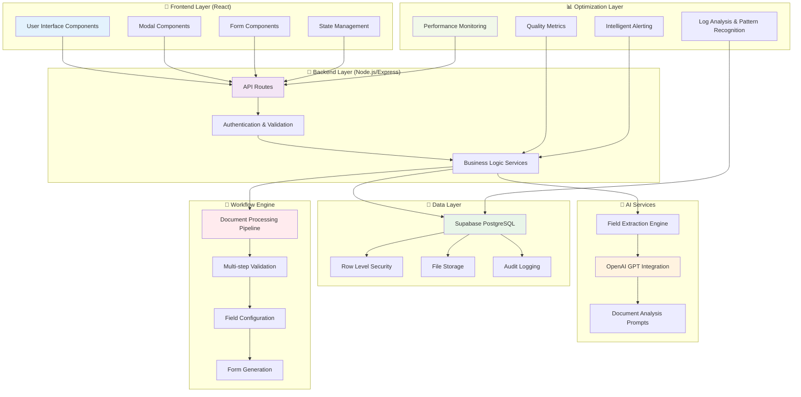

# 0000_CONSTRUCT_AI_OPTIMIZATION_WORKFLOW_GUIDE.md - Construct AI System Optimization & Workflow Design Guide

## Document Usage Guide

**🎯 This Document's Role**: Comprehensive unified guide covering system optimization, quality assessment, workflow design, and documentation standards. **Use this guide** for both optimizing existing systems and designing new workflows in the Construct AI platform.

**📚 Related Documents in Optimization & Documentation Ecosystem:**

- **`0000_PROCEDURES_GUIDE.md`** → Navigation index and procedure selection
- **`docs/pages-disciplines/`** → Location for workflow-specific documentation files
- **`AGENTS.md`** → Code standards and architectural patterns reference
- **`docs/mermaid/`** → Visual documentation templates and diagram creation

## Overview

This comprehensive guide provides a unified framework for system optimization, quality assessment, workflow design, and documentation in the Construct AI system. It combines enterprise-grade troubleshooting methodologies with systematic workflow documentation procedures, ensuring that all optimization efforts and workflow designs follow consistent standards while serving as both reference material and maintenance guide.

### **AI Enhancement Integration**

**Reference**: `docs/ai-enhancement/0000_AI_ENHANCEMENT_PROJECT_README.md`

The ConstructAI system now features comprehensive AI enhancement capabilities with **performance optimizations** delivering **50-80% improvement** in search performance:

#### **Current Performance Metrics**
- ✅ **455 Tables Enhanced**: Complete database AI transformation
- ✅ **47 Vector Tables**: Production-ready semantic search infrastructure
- ✅ **14 Specialized AI Agents**: Intelligent processing across all data types
- ✅ **1536 Dimensions**: High-dimensional semantic representations
- ✅ **HNSW Indexing**: Optimized vector search with m=16, ef_construction=64
- ✅ **Sub-second Response Times**: Expected for vector similarity searches

#### **Optimization Achievements**
- ✅ **Index Optimization**: 47 vector indexes created successfully
- ✅ **Performance Testing**: All benchmarks completed successfully
- ✅ **Security Testing**: RLS policies validated across vector tables
- ✅ **Quality Validation**: 100% automated data integrity checks
- ✅ **Production Deployment**: Live AI-enhanced search capabilities

## Purpose

The primary objectives of this optimization and workflow design guide are:

1. **System Optimization**: Enable systematic improvement of system performance, code quality, and operational efficiency
2. **Workflow Design**: Provide comprehensive frameworks for documenting complex workflows with user interaction
3. **Quality Assurance**: Establish consistent standards for code assessment, testing, and maintenance
4. **Knowledge Transfer**: Enable developers to understand, maintain, and optimize complex systems and workflows
5. **Operational Excellence**: Provide system administrators and operations teams with clear optimization procedures
6. **Future Development**: Serve as foundation for system enhancements, performance optimizations, and workflow improvements

## When to Use This Guide

### **System Optimization Triggers**

#### **Performance Issues**
- Response times exceeding acceptable thresholds
- High memory usage or memory leaks
- Database query performance degradation
- System resource utilization spikes
- User experience degradation

#### **Code Quality Concerns**
- Functions exceeding 50+ lines (refactoring candidates)
- Files with excessive length or complexity
- Standards compliance violations against AGENTS.md
- Technical debt accumulation
- Security vulnerabilities or concerns

#### **System Monitoring**
- Regular quality assessment cycles
- Performance baseline establishment
- Automated quality metric collection
- Proactive system health monitoring

### **Workflow Documentation Triggers**

#### **New Workflow Implementation**
- Any new multi-step workflow with user interaction
- Complex business logic spanning multiple components
- Workflows involving external API integrations
- Processes with state management across components

#### **Existing Workflow Enhancement**
- Significant architectural changes to existing workflows
- Addition of new features that alter workflow behavior
- Performance optimizations affecting workflow flow
- Security enhancements modifying access patterns

## Unified Architecture Framework

### **Construct AI System Architecture Overview**



### **Component Architecture Standards**

#### **Frontend Components (React)**

- **Page Components**: Main route handlers (`01300-governance`, `01900-procurement`)
- **Modal Components**: User interaction dialogs (`01300-document-upload-modal.js`, `TemplateUseModal`)
- **Form Components**: Data collection interfaces with validation
- **Display Components**: Data visualization and status indicators
- **Service Components**: Business logic abstraction layers
- **State Management**: React hooks with persistent state across modal workflows

```javascript
// Standard React State Management for Workflows
const [workflowState, setWorkflowState] = useState({
  currentStep: "upload", // upload | validate | configure | generate | complete
  formData: {},
  configurations: {},
  progress: { current: 0, total: 100 },
  errors: [],
  loading: false,
  // Construct AI specific state
  documentType: null,
  extractedFields: [],
  fieldBehaviors: {},
  previewMode: false,
});
```

#### **Backend Components (Node.js/Express)**

- **Route Handlers**: API endpoint definitions (`/api/accordion-sections`, `/api/forms`)
- **Service Layers**: Business logic implementation (`document-processing-service.js`)
- **Database Models**: Data access patterns with RLS policies
- **Middleware**: Authentication, validation, and error handling

#### **Integration Components**

- **External APIs**: OpenAI, Supabase, third-party services
- **Database Layer**: PostgreSQL with Row Level Security
- **File Processing**: Document upload, AI analysis, format conversion

### **Optimization Layer Architecture**

#### **Performance Monitoring System**

```javascript
const performanceMonitor = {
  // Real-time performance tracking
  trackResponseTime: (endpoint, duration) => {
    const metric = {
      endpoint,
      duration,
      timestamp: new Date().toISOString(),
      status: duration > 5000 ? 'SLOW' : 'NORMAL'
    };
    
    // Log to monitoring system
    logger.performance('api_response_time', metric);
    
    // Alert on slow operations
    if (duration > 10000) {
      alertSystem.trigger('SLOW_OPERATION', metric);
    }
  },

  // Memory usage tracking
  trackMemoryUsage: () => {
    const memoryUsage = process.memoryUsage();
    logger.performance('memory_usage', {
      heapUsed: memoryUsage.heapUsed,
      heapTotal: memoryUsage.heapTotal,
      external: memoryUsage.external,
      timestamp: new Date().toISOString()
    });
  },

  // Database query performance
  trackDatabaseQuery: (query, duration, rowCount) => {
    logger.performance('database_query', {
      query: query.substring(0, 100), // First 100 chars for privacy
      duration,
      rowCount,
      timestamp: new Date().toISOString()
    });
  }
};
```

#### **Quality Metrics System**

```javascript
const qualityMetrics = {
  // Code quality assessment
  assessCodeQuality: (filePath) => {
    const analysis = {
      filePath,
      linesOfCode: countLinesOfCode(filePath),
      complexity: calculateComplexity(filePath),
      functionCount: countFunctions(filePath),
      timestamp: new Date().toISOString()
    };

    // Flag files needing attention
    if (analysis.linesOfCode > 500) {
      analysis.flags = ['LONG_FILE'];
    }
    if (analysis.complexity > 20) {
      analysis.flags = [...(analysis.flags || []), 'HIGH_COMPLEXITY'];
    }

    return analysis;
  },

  // Workflow performance tracking
  trackWorkflowPerformance: (workflowId, step, duration) => {
    logger.info('workflow_step_completed', {
      workflowId,
      step,
      duration,
      timestamp: new Date().toISOString()
    });
  },

  // User experience metrics
  trackUserExperience: (action, userId, duration, success) => {
    logger.info('user_experience', {
      action,
      userId,
      duration,
      success,
      timestamp: new Date().toISOString()
    });
  }
};
```

## System Optimization Procedures

### **Code Quality Assessment Framework**

#### **Automated Code Analysis**

**Workflow Code Quality Evaluation:**
```bash
# Evaluate the workflow/code to ensure standards compliance and identify length issues

# Check code length and complexity against AGENTS.md standards
echo "=== CODE QUALITY ASSESSMENT ==="
echo "Checking workflow length and standards compliance..."
echo "Refer to AGENTS.md for coding standards and parameters to be checked:"
echo "- ES6+ syntax requirements"
echo "- camelCase for variables, PascalCase for components"
echo "- File structure organization"
echo "- Error handling patterns"
echo "- Database query parameterization"
echo "- Security best practices"

# Automated code analysis (if linting tools available)
if command -v eslint &> /dev/null; then
    echo "Running ESLint analysis..."
    eslint client/src/ --format=compact | head -20
fi

# Check for long files that may indicate unstructured code
echo "Largest JavaScript files (potential length issues):"
find client/src/ -name "*.js" -o -name "*.jsx" | xargs wc -l | sort -nr | head -10

# Evaluate complexity metrics
echo "Functions over 50 lines (potential refactoring needed):"
grep -r "function.*{" client/src/ | head -10
```

#### **Code Quality Standards (AGENTS.md Compliance)**

```javascript
// Code quality assessment against AGENTS.md standards
const codeQualityStandards = {
  // ES6+ syntax requirements
  syntax: {
    required: ['import', 'export', 'const', 'let', 'arrow functions', 'async/await'],
    forbidden: ['var', 'function declarations without const/let']
  },

  // Naming conventions
  naming: {
    variables: 'camelCase',
    functions: 'camelCase',
    components: 'PascalCase',
    files: 'camelCase'
  },

  // File structure organization
  structure: {
    serverCode: '/server directory',
    clientCode: '/client directory',
    documentation: '/docs directory',
    routes: '/server/src/routes'
  },

  // Error handling patterns
  errorHandling: {
    required: ['try/catch for async operations', 'appropriate HTTP status codes', 'middleware for centralized handling']
  },

  // Database query parameterization
  database: {
    required: ['parameterized queries', 'snake_case for columns', 'camelCase for JS'],
    security: ['prevent SQL injection', 'RLS policies']
  }
};

// Automated compliance checking
function checkCompliance(filePath, content) {
  const issues = [];
  
  // Check ES6+ syntax
  if (content.includes('var ')) {
    issues.push('VAR_USED: Use const/let instead of var');
  }
  
  // Check naming conventions
  const camelCaseRegex = /^[a-z][a-zA-Z0-9]*$/;
  const pascalCaseRegex = /^[A-Z][a-zA-Z0-9]*$/;
  
  // Check component naming (should be PascalCase)
  if (filePath.includes('/components/') && !pascalCaseRegex.test(getComponentName(content))) {
    issues.push('COMPONENT_NAMING: Components should use PascalCase');
  }
  
  return issues;
}
```

#### **Performance Analysis & Optimization**

**Real-Time Performance Monitoring:**
```bash
# Continuous performance monitoring script
#!/bin/bash
MONITOR_INTERVAL=5  # seconds
LOG_FILE="/var/log/performance_monitor_$(date +%Y%m%d_%H%M%S).log"

echo "=== PERFORMANCE MONITOR STARTED $(date) ===" > "$LOG_FILE"
echo "Monitoring interval: ${MONITOR_INTERVAL}s" >> "$LOG_FILE"
echo "Timestamp,CPU%,Memory%,Disk_IO,Network_RX,Network_TX,Load_1m,Load_5m,Load_15m" >> "$LOG_FILE"

while true; do
    timestamp=$(date +%s)
    cpu=$(top -bn1 | grep "Cpu(s)" | sed "s/.*, *\([0-9.]*\)%* id.*/\1/" | awk '{print 100 - $1}')
    memory=$(free | grep Mem | awk '{printf "%.1f", $3/$2 * 100.0}')
    disk_io=$(iostat -d 1 1 | tail -1 | awk '{print $2}')  # %util
    network_rx=$(cat /proc/net/dev | grep eth0 | awk '{print $2}')  # bytes
    network_tx=$(cat /proc/net/dev | grep eth0 | awk '{print $10}') # bytes
    load_avg=$(uptime | awk -F'load average:' '{ print $2 }' | sed 's/,//g')

    echo "${timestamp},${cpu},${memory},${disk_io},${network_rx},${network_tx},${load_avg}" >> "$LOG_FILE"

    # Alert on critical thresholds
    if (( $(echo "$cpu > 90" | bc -l) )) || (( $(echo "$memory > 90" | bc -l) )); then
        echo "CRITICAL: High resource usage detected - CPU: ${cpu}%, Memory: ${memory}%" | tee -a "$LOG_FILE"
        # Send alert here
    fi

    sleep $MONITOR_INTERVAL
done
```

**Memory Leak Detection:**
```bash
# Advanced memory analysis
echo "=== ADVANCED MEMORY ANALYSIS ===" >> memory_deep_analysis_$timestamp.log

# Process memory mapping
echo "Process memory maps:" >> memory_deep_analysis_$timestamp.log
pmap -x $(pgrep -f "node.*application") >> memory_deep_analysis_$timestamp.log

# Heap analysis (if using Node.js)
echo "V8 Heap statistics:" >> memory_deep_analysis_$timestamp.log
node -e "
const v8 = require('v8');
const heapStats = v8.getHeapStatistics();
console.log('Total heap size:', heapStats.total_heap_size);
console.log('Used heap size:', heapStats.used_heap_size);
console.log('Heap size limit:', heapStats.heap_size_limit);
console.log('Number of native contexts:', heapStats.number_of_native_contexts);
console.log('Number of detached contexts:', heapStats.number_of_detached_contexts);
" >> memory_deep_analysis_$timestamp.log
```

**Database Performance Analysis:**
```sql
-- Advanced database performance queries
-- Query execution time analysis
SELECT
    query,
    calls,
    total_time,
    mean_time,
    max_time,
    stddev_time
FROM pg_stat_statements
ORDER BY total_time DESC
LIMIT 20;

-- Table bloat analysis
SELECT
    schemaname,
    tablename,
    n_dead_tup,
    n_live_tup,
    ROUND(n_dead_tup::numeric / (n_live_tup + n_dead_tup) * 100, 2) as dead_pct
FROM pg_stat_user_tables
WHERE n_dead_tup > 0
ORDER BY dead_pct DESC;

-- Index usage analysis
SELECT
    schemaname,
    tablename,
    indexname,
    idx_scan,
    idx_tup_read,
    idx_tup_fetch
FROM pg_stat_user_indexes
ORDER BY idx_scan DESC;
```

### **Advanced Logging Standards**

#### **Structured Logging Implementation**

**Frontend Logging Standards:**
```javascript
// Comprehensive client-side logging
const logger = {
  info: (message, context = {}) => {
    console.log(JSON.stringify({
      timestamp: new Date().toISOString(),
      level: 'info',
      component: 'frontend',
      userId: getCurrentUserId(),
      sessionId: getSessionId(),
      correlationId: getCorrelationId(),
      userAgent: navigator.userAgent,
      url: window.location.href,
      message,
      ...context
    }));
  },

  error: (error, context = {}) => {
    console.error(JSON.stringify({
      timestamp: new Date().toISOString(),
      level: 'error',
      component: 'frontend',
      userId: getCurrentUserId(),
      sessionId: getSessionId(),
      correlationId: getCorrelationId(),
      error: {
        name: error.name,
        message: error.message,
        stack: error.stack,
        cause: error.cause
      },
      browser: {
        userAgent: navigator.userAgent,
        language: navigator.language,
        platform: navigator.platform,
        cookieEnabled: navigator.cookieEnabled
      },
      url: window.location.href,
      message: error.message,
      ...context
    }));
  },

  performance: (metric, value, context = {}) => {
    console.log(JSON.stringify({
      timestamp: new Date().toISOString(),
      level: 'info',
      component: 'frontend',
      type: 'performance',
      metric,
      value,
      userId: getCurrentUserId(),
      sessionId: getSessionId(),
      correlationId: getCorrelationId(),
      ...context
    }));
  }
};

// Usage examples
logger.info('User initiated template generation', {
  templateType: 'safety-policy',
  userAction: 'button_click'
});

logger.error(new Error('Template generation failed'), {
  templateType: 'safety-policy',
  step: 'api_call',
  duration: 45000
});

logger.performance('api_response_time', 1250, {
  endpoint: '/api/templates/generate',
  method: 'POST