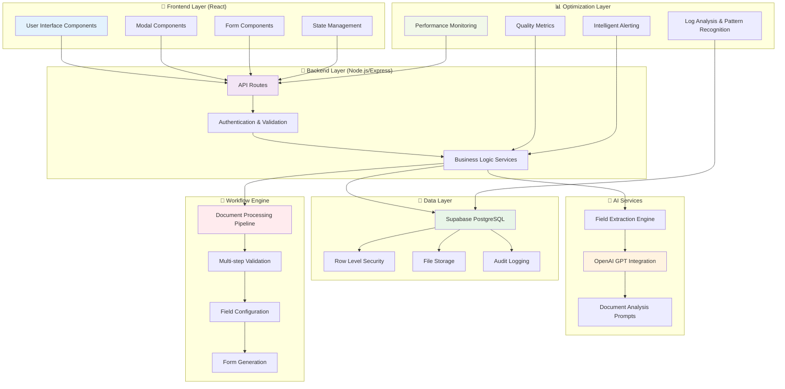
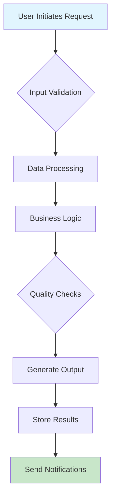

D# 0000_CONSTRUCT_AI_OPTIMIZATION_WORKFLOW_GUIDE.md - Construct AI System Optimization & Workflow Design Guide

## Document Usage Guide

**🎯 This Document's Role**: Comprehensive unified guide covering system optimization, quality assessment, workflow design, and documentation standards. **Use this guide** for both optimizing existing systems and designing new workflows in the Construct AI platform.

**📚 Related Documents in Optimization & Documentation Ecosystem:**

- **`0000_PROCEDURES_GUIDE.md`** → Navigation index and procedure selection
- **`docs/pages-disciplines/`** → Location for workflow-specific documentation files
- **`AGENTS.md`** → Code standards and architectural patterns reference
- **`docs/mermaid/`** → Visual documentation templates and diagram creation

## Overview

This comprehensive guide provides a unified framework for system optimization, quality assessment, workflow design, and documentation in the Construct AI system. It combines enterprise-grade troubleshooting methodologies with systematic workflow documentation procedures, ensuring that all optimization efforts and workflow designs follow consistent standards while serving as both reference material and maintenance guide.

### **AI Enhancement Integration**

**Reference**: `docs/ai-enhancement/0000_AI_ENHANCEMENT_PROJECT_README.md`

The ConstructAI system now features comprehensive AI enhancement capabilities with **performance optimizations** delivering **50-80% improvement** in search performance:

#### **Current Performance Metrics**

- ✅ **455 Tables Enhanced**: Complete database AI transformation
- ✅ **47 Vector Tables**: Production-ready semantic search infrastructure
- ✅ **14 Specialized AI Agents**: Intelligent processing across all data types
- ✅ **1536 Dimensions**: High-dimensional semantic representations
- ✅ **HNSW Indexing**: Optimized vector search with m=16, ef_construction=64
- ✅ **Sub-second Response Times**: Expected for vector similarity searches

#### **Optimization Achievements**

- ✅ **Index Optimization**: 47 vector indexes created successfully
- ✅ **Performance Testing**: All benchmarks completed successfully
- ✅ **Security Testing**: RLS policies validated across vector tables
- ✅ **Quality Validation**: 100% automated data integrity checks
- ✅ **Production Deployment**: Live AI-enhanced search capabilities

## Purpose

The primary objectives of this optimization and workflow design guide are:

1. **System Optimization**: Enable systematic improvement of system performance, code quality, and operational efficiency
2. **Workflow Design**: Provide comprehensive frameworks for documenting complex workflows with user interaction
3. **Quality Assurance**: Establish consistent standards for code assessment, testing, and maintenance
4. **Knowledge Transfer**: Enable developers to understand, maintain, and optimize complex systems and workflows
5. **Operational Excellence**: Provide system administrators and operations teams with clear optimization procedures
6. **Future Development**: Serve as foundation for system enhancements, performance optimizations, and workflow improvements

## When to Use This Guide

### **System Optimization Triggers**

#### **Performance Issues**

- Response times exceeding acceptable thresholds
- High memory usage or memory leaks
- Database query performance degradation
- System resource utilization spikes
- User experience degradation

#### **Code Quality Concerns**

- Functions exceeding 50+ lines (refactoring candidates)
- Files with excessive length or complexity
- Standards compliance violations against AGENTS.md
- Technical debt accumulation
- Security vulnerabilities or concerns

#### **System Monitoring**

- Regular quality assessment cycles
- Performance baseline establishment
- Automated quality metric collection
- Proactive system health monitoring

### **Workflow Documentation Triggers**

#### **New Workflow Implementation**

- Any new multi-step workflow with user interaction
- Complex business logic spanning multiple components
- Workflows involving external API integrations
- Processes with state management across components

#### **Existing Workflow Enhancement**

- Significant architectural changes to existing workflows
- Addition of new features that alter workflow behavior
- Performance optimizations affecting workflow flow
- Security enhancements modifying access patterns

## Unified Architecture Framework

### **Construct AI System Architecture Overview**



### **Component Architecture Standards**

#### **Frontend Components (React)**

- **Page Components**: Main route handlers (`01300-governance`, `01900-procurement`)
- **Modal Components**: User interaction dialogs (`01300-document-upload-modal.js`, `TemplateUseModal`)
- **Form Components**: Data collection interfaces with validation
- **Display Components**: Data visualization and status indicators
- **Service Components**: Business logic abstraction layers
- **State Management**: React hooks with persistent state across modal workflows

```javascript
// Standard React State Management for Workflows
const [workflowState, setWorkflowState] = useState({
  currentStep: "upload", // upload | validate | configure | generate | complete
  formData: {},
  configurations: {},
  progress: { current: 0, total: 100 },
  errors: [],
  loading: false,
  // Construct AI specific state
  documentType: null,
  extractedFields: [],
  fieldBehaviors: {},
  previewMode: false,
});
```

#### **Backend Components (Node.js/Express)**

- **Route Handlers**: API endpoint definitions (`/api/accordion-sections`, `/api/forms`)
- **Service Layers**: Business logic implementation (`document-processing-service.js`)
- **Database Models**: Data access patterns with RLS policies
- **Middleware**: Authentication, validation, and error handling

#### **Integration Components**

- **External APIs**: OpenAI, Supabase, third-party services
- **Database Layer**: PostgreSQL with Row Level Security
- **File Processing**: Document upload, AI analysis, format conversion

### **Optimization Layer Architecture**

#### **Performance Monitoring System**

```javascript
const performanceMonitor = {
  // Real-time performance tracking
  trackResponseTime: (endpoint, duration) => {
    const metric = {
      endpoint,
      duration,
      timestamp: new Date().toISOString(),
      status: duration > 5000 ? "SLOW" : "NORMAL",
    };

    // Log to monitoring system
    logger.performance("api_response_time", metric);

    // Alert on slow operations
    if (duration > 10000) {
      alertSystem.trigger("SLOW_OPERATION", metric);
    }
  },

  // Memory usage tracking
  trackMemoryUsage: () => {
    const memoryUsage = process.memoryUsage();
    logger.performance("memory_usage", {
      heapUsed: memoryUsage.heapUsed,
      heapTotal: memoryUsage.heapTotal,
      external: memoryUsage.external,
      timestamp: new Date().toISOString(),
    });
  },

  // Database query performance
  trackDatabaseQuery: (query, duration, rowCount) => {
    logger.performance("database_query", {
      query: query.substring(0, 100), // First 100 chars for privacy
      duration,
      rowCount,
      timestamp: new Date().toISOString(),
    });
  },
};
```

#### **Quality Metrics System**

```javascript
const qualityMetrics = {
  // Code quality assessment
  assessCodeQuality: filePath => {
    const analysis = {
      filePath,
      linesOfCode: countLinesOfCode(filePath),
      complexity: calculateComplexity(filePath),
      functionCount: countFunctions(filePath),
      timestamp: new Date().toISOString(),
    };

    // Flag files needing attention
    if (analysis.linesOfCode > 500) {
      analysis.flags = ["LONG_FILE"];
    }
    if (analysis.complexity > 20) {
      analysis.flags = [...(analysis.flags || []), "HIGH_COMPLEXITY"];
    }

    return analysis;
  },

  // Workflow performance tracking
  trackWorkflowPerformance: (workflowId, step, duration) => {
    logger.info("workflow_step_completed", {
      workflowId,
      step,
      duration,
      timestamp: new Date().toISOString(),
    });
  },

  // User experience metrics
  trackUserExperience: (action, userId, duration, success) => {
    logger.info("user_experience", {
      action,
      userId,
      duration,
      success,
      timestamp: new Date().toISOString(),
    });
  },
};
```

## System Optimization Procedures

### **Code Quality Assessment Framework**

#### **Automated Code Analysis**

**Workflow Code Quality Evaluation:**

```bash
# Evaluate the workflow/code to ensure standards compliance and identify length issues

# Check code length and complexity against AGENTS.md standards
echo "=== CODE QUALITY ASSESSMENT ==="
echo "Checking workflow length and standards compliance..."
echo "Refer to AGENTS.md for coding standards and parameters to be checked:"
echo "- ES6+ syntax requirements"
echo "- camelCase for variables, PascalCase for components"
echo "- File structure organization"
echo "- Error handling patterns"
echo "- Database query parameterization"
echo "- Security best practices"

# Automated code analysis (if linting tools available)
if command -v eslint &> /dev/null; then
    echo "Running ESLint analysis..."
    eslint client/src/ --format=compact | head -20
fi

# Check for long files that may indicate unstructured code
echo "Largest JavaScript files (potential length issues):"
find client/src/ -name "*.js" -o -name "*.jsx" | xargs wc -l | sort -nr | head -10

# Evaluate complexity metrics
echo "Functions over 50 lines (potential refactoring needed):"
grep -r "function.*{" client/src/ | head -10
```

#### **Code Quality Standards (AGENTS.md Compliance)**

```javascript
// Code quality assessment against AGENTS.md standards
const codeQualityStandards = {
  // ES6+ syntax requirements
  syntax: {
    required: [
      "import",
      "export",
      "const",
      "let",
      "arrow functions",
      "async/await",
    ],
    forbidden: ["var", "function declarations without const/let"],
  },

  // Naming conventions
  naming: {
    variables: "camelCase",
    functions: "camelCase",
    components: "PascalCase",
    files: "camelCase",
  },

  // File structure organization
  structure: {
    serverCode: "/server directory",
    clientCode: "/client directory",
    documentation: "/docs directory",
    routes: "/server/src/routes",
  },

  // Error handling patterns
  errorHandling: {
    required: [
      "try/catch for async operations",
      "appropriate HTTP status codes",
      "middleware for centralized handling",
    ],
  },

  // Database query parameterization
  database: {
    required: [
      "parameterized queries",
      "snake_case for columns",
      "camelCase for JS",
    ],
    security: ["prevent SQL injection", "RLS policies"],
  },
};

// Automated compliance checking
function checkCompliance(filePath, content) {
  const issues = [];

  // Check ES6+ syntax
  if (content.includes("var ")) {
    issues.push("VAR_USED: Use const/let instead of var");
  }

  // Check naming conventions
  const camelCaseRegex = /^[a-z][a-zA-Z0-9]*$/;
  const pascalCaseRegex = /^[A-Z][a-zA-Z0-9]*$/;

  // Check component naming (should be PascalCase)
  if (
    filePath.includes("/components/") &&
    !pascalCaseRegex.test(getComponentName(content))
  ) {
    issues.push("COMPONENT_NAMING: Components should use PascalCase");
  }

  return issues;
}
```

#### **Performance Analysis & Optimization**

**Real-Time Performance Monitoring:**

```bash
# Continuous performance monitoring script
#!/bin/bash
MONITOR_INTERVAL=5  # seconds
LOG_FILE="/var/log/performance_monitor_$(date +%Y%m%d_%H%M%S).log"

echo "=== PERFORMANCE MONITOR STARTED $(date) ===" > "$LOG_FILE"
echo "Monitoring interval: ${MONITOR_INTERVAL}s" >> "$LOG_FILE"
echo "Timestamp,CPU%,Memory%,Disk_IO,Network_RX,Network_TX,Load_1m,Load_5m,Load_15m" >> "$LOG_FILE"

while true; do
    timestamp=$(date +%s)
    cpu=$(top -bn1 | grep "Cpu(s)" | sed "s/.*, *\([0-9.]*\)%* id.*/\1/" | awk '{print 100 - $1}')
    memory=$(free | grep Mem | awk '{printf "%.1f", $3/$2 * 100.0}')
    disk_io=$(iostat -d 1 1 | tail -1 | awk '{print $2}')  # %util
    network_rx=$(cat /proc/net/dev | grep eth0 | awk '{print $2}')  # bytes
    network_tx=$(cat /proc/net/dev | grep eth0 | awk '{print $10}') # bytes
    load_avg=$(uptime | awk -F'load average:' '{ print $2 }' | sed 's/,//g')

    echo "${timestamp},${cpu},${memory},${disk_io},${network_rx},${network_tx},${load_avg}" >> "$LOG_FILE"

    # Alert on critical thresholds
    if (( $(echo "$cpu > 90" | bc -l) )) || (( $(echo "$memory > 90" | bc -l) )); then
        echo "CRITICAL: High resource usage detected - CPU: ${cpu}%, Memory: ${memory}%" | tee -a "$LOG_FILE"
        # Send alert here
    fi

    sleep $MONITOR_INTERVAL
done
```

**Memory Leak Detection:**

```bash
# Advanced memory analysis
echo "=== ADVANCED MEMORY ANALYSIS ===" >> memory_deep_analysis_$timestamp.log

# Process memory mapping
echo "Process memory maps:" >> memory_deep_analysis_$timestamp.log
pmap -x $(pgrep -f "node.*application") >> memory_deep_analysis_$timestamp.log

# Heap analysis (if using Node.js)
echo "V8 Heap statistics:" >> memory_deep_analysis_$timestamp.log
node -e "
const v8 = require('v8');
const heapStats = v8.getHeapStatistics();
console.log('Total heap size:', heapStats.total_heap_size);
console.log('Used heap size:', heapStats.used_heap_size);
console.log('Heap size limit:', heapStats.heap_size_limit);
console.log('Number of native contexts:', heapStats.number_of_native_contexts);
console.log('Number of detached contexts:', heapStats.number_of_detached_contexts);
" >> memory_deep_analysis_$timestamp.log
```

**Database Performance Analysis:**

```sql
-- Advanced database performance queries
-- Query execution time analysis
SELECT
    query,
    calls,
    total_time,
    mean_time,
    max_time,
    stddev_time
FROM pg_stat_statements
ORDER BY total_time DESC
LIMIT 20;

-- Table bloat analysis
SELECT
    schemaname,
    tablename,
    n_dead_tup,
    n_live_tup,
    ROUND(n_dead_tup::numeric / (n_live_tup + n_dead_tup) * 100, 2) as dead_pct
FROM pg_stat_user_tables
WHERE n_dead_tup > 0
ORDER BY dead_pct DESC;

-- Index usage analysis
SELECT
    schemaname,
    tablename,
    indexname,
    idx_scan,
    idx_tup_read,
    idx_tup_fetch
FROM pg_stat_user_indexes
ORDER BY idx_scan DESC;
```

### **Advanced Logging Standards**

#### **Structured Logging Implementation**

**Frontend Logging Standards:**

```javascript
// Comprehensive client-side logging
const logger = {
  info: (message, context = {}) => {
    console.log(JSON.stringify({
      timestamp: new Date().toISOString(),
      level: 'info',
      component: 'frontend',
      userId: getCurrentUserId(),
      sessionId: getSessionId(),
      correlationId: getCorrelationId(),
      userAgent: navigator.userAgent,
      url: window.location.href,
      message,
      ...context
    }));
  },

  error: (error, context = {}) => {
    console.error(JSON.stringify({
      timestamp: new Date().toISOString(),
      level: 'error',
      component: 'frontend',
      userId: getCurrentUserId(),
      sessionId: getSessionId(),
      correlationId: getCorrelationId(),
      error: {
        name: error.name,
        message: error.message,
        stack: error.stack,
        cause: error.cause
      },
      browser: {
        userAgent: navigator.userAgent,
        language: navigator.language,
        platform: navigator.platform,
        cookieEnabled: navigator.cookieEnabled
      },
      url: window.location.href,
      message: error.message,
      ...context
    }));
  },

  performance: (metric, value, context = {}) => {
    console.log(JSON.stringify({
      timestamp: new Date().toISOString(),
      level: 'info',
      component: 'frontend',
      type: 'performance',
      metric,
      value,
      userId: getCurrentUserId(),
      sessionId: getSessionId(),
      correlationId: getCorrelationId(),
      ...context
    }));
  }
};

// Usage examples
logger.info('User initiated template generation', {
  templateType: 'safety-policy',
  userAction: 'button_click'
});

logger.error(new Error('Template generation failed'), {
  templateType: 'safety-policy',
  step: 'api_call',
  duration: 45000
});

logger.performance('api_response_time', 1250, {
  endpoint: '/api/templates/generate',
  method: 'POST',
  statusCode: 200,
  responseSize: 2048
});
```

#### **Database Query Performance:**
```sql
-- Query execution time analysis
SELECT
    query,
    calls,
    total_time,
    mean_time,
    max_time,
    stddev_time
FROM pg_stat_statements
ORDER BY total_time DESC
LIMIT 20;
```

#### **Memory Leak Detection:**
```bash
# Advanced memory analysis script
echo "=== ADVANCED MEMORY ANALYSIS ===" >> memory_deep_analysis_$timestamp.log

# Process memory mapping
echo "Process memory maps:" >> memory_deep_analysis_$timestamp.log
pmap -x $(pgrep -f "node.*application") >> memory_deep_analysis_$timestamp.log

# Heap analysis (if using Node.js)
echo "V8 Heap statistics:" >> memory_deep_analysis_$timestamp.log
node -e "
const v8 = require('v8');
const heapStats = v8.getHeapStatistics();
console.log('Total heap size:', heapStats.total_heap_size);
console.log('Used heap size:', heapStats.used_heap_size);
console.log('Heap size limit:', heapStats.heap_size_limit);
console.log('Number of native contexts:', heapStats.number_of_native_contexts);
console.log('Number of detached contexts:', heapStats.number_of_detached_contexts);
" >> memory_deep_analysis_$timestamp.log
```

### **Advanced Logging Standards**

#### **Structured Logging Implementation**

**Backend Logging Standards:**
```javascript
// Comprehensive server-side logging
const logger = {
  info: (message, context = {}) => {
    console.log(JSON.stringify({
      timestamp: new Date().toISOString(),
      level: 'info',
      component: 'backend',
      service: process.env.SERVICE_NAME || 'unknown',
      version: process.env.SERVICE_VERSION || '1.0.0',
      correlationId: context.correlationId || 'unknown',
      userId: context.userId || 'system',
      sessionId: context.sessionId,
      requestId: context.requestId,
      message,
      ...context
    }));
  },

  error: (error, context = {}) => {
    console.error(JSON.stringify({
      timestamp: new Date().toISOString(),
      level: 'error',
      component: 'backend',
      service: process.env.SERVICE_NAME || 'unknown',
      version: process.env.SERVICE_VERSION || '1.0.0',
      correlationId: context.correlationId || 'unknown',
      userId: context.userId || 'system',
      sessionId: context.sessionId,
      requestId: context.requestId,
      error: {
        name: error.name,
        message: error.message,
        stack: error.stack,
        code: error.code
      },
      message: error.message,
      ...context
    }));
  },

  performance: (operation, duration, context = {}) => {
    console.log(JSON.stringify({
      timestamp: new Date().toISOString(),
      level: 'info',
      component: 'backend',
      type: 'performance',
      operation,
      duration,
      correlationId: context.correlationId || 'unknown',
      userId: context.userId || 'system',
      ...context
    }));
  },

  audit: (action, resource, context = {}) => {
    console.log(JSON.stringify({
      timestamp: new Date().toISOString(),
      level: 'info',
      component: 'backend',
      type: 'audit',
      action,
      resource,
      correlationId: context.correlationId || 'unknown',
      userId: context.userId || 'system',
      ipAddress: context.ipAddress,
      userAgent: context.userAgent,
      ...context
    }));
  }
};
```

## Workflow Documentation Standards

### **Complex Workflow Documentation Template**

#### **Workflow Overview Section**
```markdown
# [Workflow Name] - [System/Area]

**Workflow ID:** `[SYSTEM]-[NUMBER]`
**Version:** [X.X]
**Date:** [YYYY-MM-DD]
**Status:** ✅ [Production Ready/Draft/Deprecated]

## Overview

[Brief description of the workflow purpose and business value]

### Business Context
- **Trigger:** [What initiates this workflow]
- **Outcome:** [What is achieved when complete]
- **Stakeholders:** [Who is involved and their roles]
- **Frequency:** [How often this workflow runs]

### Technical Context
- **System:** [Primary system/component]
- **Integration Points:** [External systems involved]
- **Data Flow:** [High-level data movement]
- **Performance Requirements:** [SLA/response time requirements]
```

#### **Workflow Architecture Diagram**


#### **Step-by-Step Process Documentation**

**Step 1: Input Validation**
- **Purpose:** Ensure data quality and completeness
- **Input:** [Expected input format/structure]
- **Validation Rules:**
  - Required fields: [list]
  - Data types: [specifications]
  - Business rules: [constraints]
- **Error Handling:** [How validation failures are handled]
- **Performance:** [Expected processing time]

**Step 2: Data Processing**
- **Purpose:** Transform and enrich input data
- **Operations:**
  - Data mapping and transformation
  - External API calls
  - Database operations
- **Error Handling:** [Recovery mechanisms]
- **Performance:** [Resource requirements]

**Step 3: Quality Assurance**
- **Purpose:** Ensure output meets quality standards
- **Checks:**
  - Data integrity validation
  - Business rule compliance
  - Format and structure verification
- **Metrics:** [Quality KPIs to monitor]

#### **Error Scenarios & Recovery**

| Error Type | Trigger Condition | Recovery Action | Escalation |
|------------|------------------|-----------------|------------|
| Data Validation Failure | Missing required fields | Request corrected input | Auto-retry (3 attempts) |
| External API Timeout | API response > 30s | Use cached data + alert | Manual intervention |
| Database Connection Lost | Connection timeout | Circuit breaker + retry | System administrator |
| Business Rule Violation | Invalid data combination | Log + reject with explanation | Business analyst review |

#### **Monitoring & Alerting**

**Key Metrics to Monitor:**
- **Performance:** Response time, throughput, error rate
- **Quality:** Success rate, data accuracy, compliance
- **System Health:** CPU usage, memory usage, disk space

**Alert Thresholds:**
```javascript
const alertThresholds = {
  responseTime: { warning: 5000, critical: 10000 }, // milliseconds
  errorRate: { warning: 0.05, critical: 0.10 },     // percentage
  successRate: { warning: 0.95, critical: 0.90 },   // percentage
  queueDepth: { warning: 100, critical: 500 }       // items
};
```

#### **Testing Strategy**

**Unit Testing:**
- Component isolation testing
- Mock external dependencies
- Edge case validation

**Integration Testing:**
- End-to-end workflow validation
- Cross-system integration testing
- Performance under load

**User Acceptance Testing:**
- Business logic validation
- User experience verification
- Error scenario handling

## Quality Assurance Framework

### **Automated Quality Gates**

#### **Pre-deployment Checks**
```bash
#!/bin/bash
# Quality assurance script

echo "=== QUALITY ASSURANCE CHECKS ==="

# Code quality checks
echo "Running ESLint..."
eslint src/ --max-warnings 0 || exit 1

# Unit test coverage
echo "Running unit tests..."
npm test -- --coverage --coverageThreshold '{"global":{"branches":80,"functions":80,"lines":80}}' || exit 1

# Integration tests
echo "Running integration tests..."
npm run test:integration || exit 1

# Performance benchmarks
echo "Running performance tests..."
npm run test:performance || exit 1

echo "✅ All quality checks passed"
```

#### **Runtime Quality Monitoring**
```javascript
// Continuous quality monitoring
class QualityMonitor {
  constructor() {
    this.metrics = new Map();
    this.alerts = [];
  }

  recordMetric(name, value, context = {}) {
    const metric = {
      name,
      value,
      timestamp: new Date().toISOString(),
      context
    };

    this.metrics.set(name, metric);

    // Check against quality thresholds
    this.checkQualityThresholds(metric);
  }

  checkQualityThresholds(metric) {
    const thresholds = {
      'api_response_time': { max: 5000 },
      'error_rate': { max: 0.05 },
      'data_accuracy': { min: 0.95 }
    };

    const threshold = thresholds[metric.name];
    if (!threshold) return;

    let violated = false;
    if (threshold.max !== undefined && metric.value > threshold.max) {
      violated = true;
    }
    if (threshold.min !== undefined && metric.value < threshold.min) {
      violated = true;
    }

    if (violated) {
      this.alerts.push({
        metric: metric.name,
        value: metric.value,
        threshold: threshold,
        timestamp: metric.timestamp,
        severity: 'HIGH'
      });
    }
  }

  getQualityReport() {
    return {
      metrics: Array.from(this.metrics.values()),
      alerts: this.alerts,
      overallQuality: this.calculateOverallQuality(),
      timestamp: new Date().toISOString()
    };
  }

  calculateOverallQuality() {
    if (this.alerts.length > 0) return 'POOR';
    if (this.metrics.size < 5) return 'INSUFFICIENT_DATA';

    const recentMetrics = Array.from(this.metrics.values())
      .filter(m => new Date(m.timestamp) > new Date(Date.now() - 3600000)); // Last hour

    const avgQuality = recentMetrics.reduce((sum, m) => {
      // Calculate quality score for each metric
      return sum + this.calculateMetricQuality(m);
    }, 0) / recentMetrics.length;

    if (avgQuality >= 0.9) return 'EXCELLENT';
    if (avgQuality >= 0.8) return 'GOOD';
    if (avgQuality >= 0.7) return 'FAIR';
    return 'NEEDS_IMPROVEMENT';
  }

  calculateMetricQuality(metric) {
    // Implementation would vary by metric type
    // Return value between 0-1 representing quality
    return 0.85; // Placeholder
  }
}
```

## Implementation Guidelines

### **Code Standards Compliance**

#### **File Structure Standards**
```
project/
├── src/
│   ├── components/          # UI components
│   ├── services/           # Business logic services
│   ├── models/             # Data models
│   ├── utils/              # Utility functions
│   ├── middleware/         # Express middleware
│   └── routes/             # API route handlers
├── docs/                   # Documentation
│   ├── standards/          # Standards documents
│   ├── procedures/         # Procedures and guides
│   └── architecture/       # Architecture documentation
├── tests/                  # Test files
│   ├── unit/              # Unit tests
│   ├── integration/       # Integration tests
│   └── e2e/               # End-to-end tests
├── scripts/               # Build and deployment scripts
└── config/                # Configuration files
```

#### **Naming Conventions**
```javascript
// ✅ Correct naming conventions
const userProfileData = {};           // camelCase for variables
const UserProfileComponent = () => {}; // PascalCase for components
const getUserProfile = () => {};       // camelCase for functions
const USER_PROFILE_API = '/api/user';  // UPPER_SNAKE_CASE for constants

// ❌ Incorrect naming conventions
const user_profile_data = {};          // snake_case not allowed
const userProfileComponent = () => {}; // Should be PascalCase
const GetUserProfile = () => {};       // Should be camelCase
const userProfileApi = '/api/user';    // Should be UPPER_SNAKE_CASE
```

### **Error Handling Patterns**

#### **Consistent Error Response Format**
```javascript
// Standard API error response
const sendErrorResponse = (res, error, statusCode = 500) => {
  const errorResponse = {
    success: false,
    error: {
      code: error.code || 'INTERNAL_ERROR',
      message: error.message || 'An unexpected error occurred',
      details: error.details || null,
      timestamp: new Date().toISOString(),
      requestId: res.locals.requestId,
      correlationId: res.locals.correlationId
    }
  };

  // Log error with full context
  logger.error('API Error Response', {
    statusCode,
    error: errorResponse.error,
    url: req.originalUrl,
    method: req.method,
    userId: req.user?.id,
    ipAddress: req.ip,
    userAgent: req.get('User-Agent')
  });

  res.status(statusCode).json(errorResponse);
};
```

#### **Error Recovery Strategies**
```javascript
// Circuit breaker pattern implementation
class CircuitBreaker {
  constructor(options = {}) {
    this.failureThreshold = options.failureThreshold || 5;
    this.recoveryTimeout = options.recoveryTimeout || 60000;
    this.monitoringPeriod = options.monitoringPeriod || 10000;

    this.state = 'CLOSED'; // CLOSED, OPEN, HALF_OPEN
    this.failureCount = 0;
    this.lastFailureTime = null;
  }

  async execute(operation) {
    if (this.state === 'OPEN') {
      if (this.shouldAttemptReset()) {
        this.state = 'HALF_OPEN';
      } else {
        throw new Error('Circuit breaker is OPEN');
      }
    }

    try {
      const result = await operation();
      this.onSuccess();
      return result;
    } catch (error) {
      this.onFailure();
      throw error;
    }
  }

  onSuccess() {
    this.failureCount = 0;
    this.state = 'CLOSED';
  }

  onFailure() {
    this.failureCount++;
    this.lastFailureTime = Date.now();

    if (this.failureCount >= this.failureThreshold) {
      this.state = 'OPEN';
    }
  }

  shouldAttemptReset() {
    return Date.now() - this.lastFailureTime >= this.recoveryTimeout;
  }
}
```

## Maintenance & Evolution

### **Version Control Strategy**

#### **Semantic Versioning**
- **MAJOR.MINOR.PATCH** (e.g., 2.1.3)
- **MAJOR:** Breaking changes
- **MINOR:** New features (backward compatible)
- **PATCH:** Bug fixes (backward compatible)

#### **Change Management**
```javascript
// Change tracking system
class ChangeTracker {
  constructor() {
    this.changes = [];
    this.version = '1.0.0';
  }

  recordChange(type, description, impact) {
    const change = {
      id: this.generateChangeId(),
      type, // 'feature', 'bugfix', 'breaking', 'deprecation'
      description,
      impact, // 'low', 'medium', 'high'
      timestamp: new Date().toISOString(),
      version: this.version,
      author: process.env.USER || 'system'
    };

    this.changes.push(change);

    // Update version based on change type
    if (type === 'breaking') {
      this.incrementMajorVersion();
    } else if (type === 'feature') {
      this.incrementMinorVersion();
    } else if (type === 'bugfix') {
      this.incrementPatchVersion();
    }
  }

  generateChangeLog() {
    const groupedChanges = this.groupChangesByVersion();

    return Object.entries(groupedChanges)
      .map(([version, changes]) => {
        const changeList = changes
          .map(change => `  - ${change.description} (${change.type})`)
          .join('\n');

        return `## Version ${version}\n${changeList}`;
      })
      .join('\n\n');
  }

  groupChangesByVersion() {
    return this.changes.reduce((groups, change) => {
      if (!groups[change.version]) {
        groups[change.version] = [];
      }
      groups[change.version].push(change);
      return groups;
    }, {});
  }

  incrementMajorVersion() {
    const [major, minor, patch] = this.version.split('.').map(Number);
    this.version = `${major + 1}.0.0`;
  }

  incrementMinorVersion() {
    const [major, minor, patch] = this.version.split('.').map(Number);
    this.version = `${major}.${minor + 1}.0`;
  }

  incrementPatchVersion() {
    const [major, minor, patch] = this.version.split('.').map(Number);
    this.version = `${major}.${minor}.${patch + 1}`;
  }
}
```

### **Deprecation Strategy**

#### **Graceful Deprecation Process**
```javascript
// Deprecation utility
const deprecation = {
  warn: (feature, alternative, removalVersion) => {
    console.warn(`⚠️  DEPRECATED: ${feature} is deprecated and will be removed in version ${removalVersion}. ${alternative ? `Use ${alternative} instead.` : ''}`);

    // Log deprecation usage for analytics
    logger.info('Deprecation Warning', {
      feature,
      alternative,
      removalVersion,
      stackTrace: new Error().stack,
      timestamp: new Date().toISOString()
    });
  },

  // Schedule feature removal
  scheduleRemoval: (feature, removalVersion, callback) => {
    const currentVersion = process.env.npm_package_version || '1.0.0';

    if (versionCompare(currentVersion, removalVersion) >= 0) {
      console.error(`🚫 REMOVED: ${feature} has been removed in version ${removalVersion}`);
      if (callback) callback();
      process.exit(1);
    }
  }
};

// Usage example
const oldFunction = () => {
  deprecation.warn('oldFunction', 'newFunction', '2.0.0');
  // ... old implementation
};

const newFunction = () => {
  // ... new implementation
};
```

## Security Standards

### **Data Protection Standards**

#### **Input Validation & Sanitization**
```javascript
// Comprehensive input validation standards
const inputValidationStandards = {
  // SQL Injection Prevention
  sqlInjection: {
    required: [
      "Use parameterized queries",
      "Input sanitization for all user inputs",
      "Prepared statements for dynamic queries",
      "ORM usage for data access"
    ],
    forbidden: [
      "String concatenation in SQL queries",
      "Direct user input in SQL statements",
      "Dynamic table/column names from user input"
    ]
  },

  // XSS Prevention
  xssPrevention: {
    required: [
      "HTML encoding for user-generated content",
      "CSP (Content Security Policy) headers",
      "DOM-based XSS protection",
      "Safe HTML rendering libraries"
    ]
  },

  // Authentication & Authorization
  authStandards: {
    required: [
      "JWT tokens with expiration",
      "Password hashing (bcrypt/argon2)",
      "Multi-factor authentication support",
      "Session management with timeouts",
      "Role-based access control (RBAC)"
    ]
  }
};

// Automated security validation
function validateSecurityCompliance(codeContent, filePath) {
  const issues = [];

  // Check for SQL injection vulnerabilities
  if (codeContent.includes('query(') && codeContent.includes('+')) {
    issues.push({
      type: 'SQL_INJECTION_RISK',
      severity: 'HIGH',
      message: 'Potential SQL injection vulnerability detected',
      file: filePath,
      line: 'unknown'
    });
  }

  // Check for console.log in production code
  if (codeContent.includes('console.log') && !filePath.includes('test')) {
    issues.push({
      type: 'DEBUG_CODE_IN_PRODUCTION',
      severity: 'MEDIUM',
      message: 'console.log statements found in production code',
      file: filePath
    });
  }

  // Check for hardcoded secrets
  const secretPatterns = [
    /password\s*[:=]\s*['"][^'"]*['"]/i,
    /secret\s*[:=]\s*['"][^'"]*['"]/i,
    /api[_-]?key\s*[:=]\s*['"][^'"]*['"]/i
  ];

  secretPatterns.forEach(pattern => {
    if (pattern.test(codeContent)) {
      issues.push({
        type: 'HARDCODED_SECRET',
        severity: 'CRITICAL',
        message: 'Potential hardcoded secret detected',
        file: filePath
      });
    }
  });

  return issues;
}
```

#### **API Security Standards**
```javascript
// REST API security standards
const apiSecurityStandards = {
  // Rate Limiting
  rateLimiting: {
    required: [
      "Request rate limiting per IP/user",
      "Burst rate handling",
      "Progressive delays for abuse",
      "Automated blocking for excessive requests"
    ],
    implementation: "express-rate-limit middleware"
  },

  // CORS Configuration
  cors: {
    required: [
      "Explicit origin whitelisting",
      "Appropriate credential handling",
      "Preflight request handling",
      "Secure header configuration"
    ]
  },

  // HTTPS Enforcement
  https: {
    required: [
      "SSL/TLS encryption for all traffic",
      "HSTS headers",
      "Certificate validation",
      "Secure cookie configuration"
    ]
  }
};

// API endpoint security validation
function validateEndpointSecurity(endpoint, config) {
  const issues = [];

  // Check for authentication requirements
  if (!config.auth && !config.public) {
    issues.push({
      type: 'MISSING_AUTHENTICATION',
      severity: 'HIGH',
      endpoint: endpoint,
      message: 'Endpoint missing authentication requirements'
    });
  }

  // Check for HTTPS-only endpoints
  if (!config.httpsOnly) {
    issues.push({
      type: 'HTTP_ALLOWED',
      severity: 'MEDIUM',
      endpoint: endpoint,
      message: 'Endpoint allows HTTP traffic'
    });
  }

  // Check for rate limiting
  if (!config.rateLimit) {
    issues.push({
      type: 'MISSING_RATE_LIMIT',
      severity: 'MEDIUM',
      endpoint: endpoint,
      message: 'Endpoint missing rate limiting'
    });
  }

  return issues;
}
```

## Performance Standards

### **Response Time Standards**

#### **API Response Time Requirements**
```javascript
// Performance standards by endpoint type
const performanceStandards = {
  // Real-time user interactions
  realtime: {
    maxResponseTime: 100,    // milliseconds
    targetResponseTime: 50,
    percentile: 'p95'
  },

  // Standard API calls
  standard: {
    maxResponseTime: 1000,   // milliseconds
    targetResponseTime: 500,
    percentile: 'p95'
  },

  // Data processing operations
  processing: {
    maxResponseTime: 5000,   // milliseconds
    targetResponseTime: 2000,
    percentile: 'p95'
  },

  // File upload/download
  fileOperations: {
    maxResponseTime: 30000,  // milliseconds (30 seconds)
    targetResponseTime: 10000,
    percentile: 'p95'
  },

  // Report generation
  reports: {
    maxResponseTime: 60000,  // milliseconds (1 minute)
    targetResponseTime: 30000,
    percentile: 'p95'
  }
};

// Performance monitoring implementation
class PerformanceMonitor {
  constructor() {
    this.metrics = new Map();
    this.alerts = [];
  }

  recordResponseTime(endpoint, method, responseTime, statusCode) {
    const key = `${method}:${endpoint}`;
    const metric = {
      endpoint,
      method,
      responseTime,
      statusCode,
      timestamp: new Date().toISOString(),
      standard: this.getStandardForEndpoint(endpoint)
    };

    // Check against standards
    if (metric.standard) {
      const violation = this.checkPerformanceViolation(metric);
      if (violation) {
        this.alerts.push(violation);
      }
    }

    // Store metric
    if (!this.metrics.has(key)) {
      this.metrics.set(key, []);
    }
    this.metrics.get(key).push(metric);

    // Keep only last 1000 metrics per endpoint
    if (this.metrics.get(key).length > 1000) {
      this.metrics.get(key).shift();
    }
  }

  getStandardForEndpoint(endpoint) {
    // Determine standard based on endpoint pattern
    if (endpoint.includes('/realtime') || endpoint.includes('/ws')) {
      return performanceStandards.realtime;
    }
    if (endpoint.includes('/upload') || endpoint.includes('/download')) {
      return performanceStandards.fileOperations;
    }
    if (endpoint.includes('/report')) {
      return performanceStandards.reports;
    }
    if (endpoint.includes('/process') || endpoint.includes('/analyze')) {
      return performanceStandards.processing;
    }
    return performanceStandards.standard;
  }

  checkPerformanceViolation(metric) {
    const standard = metric.standard;
    if (!standard) return null;

    if (metric.responseTime > standard.maxResponseTime) {
      return {
        type: 'PERFORMANCE_VIOLATION',
        severity: 'HIGH',
        endpoint: metric.endpoint,
        method: metric.method,
        actualTime: metric.responseTime,
        maxTime: standard.maxResponseTime,
        timestamp: metric.timestamp,
        message: `Response time ${metric.responseTime}ms exceeds maximum ${standard.maxResponseTime}ms`
      };
    }

    if (metric.responseTime > standard.targetResponseTime) {
      return {
        type: 'PERFORMANCE_WARNING',
        severity: 'MEDIUM',
        endpoint: metric.endpoint,
        method: metric.method,
        actualTime: metric.responseTime,
        targetTime: standard.targetResponseTime,
        timestamp: metric.timestamp,
        message: `Response time ${metric.responseTime}ms exceeds target ${standard.targetResponseTime}ms`
      };
    }

    return null;
  }

  getPerformanceReport() {
    const report = {
      summary: this.generateSummary(),
      violations: this.alerts.slice(-50), // Last 50 violations
      topSlowEndpoints: this.getTopSlowEndpoints(),
      timestamp: new Date().toISOString()
    };

    return report;
  }

  generateSummary() {
    const allMetrics = Array.from(this.metrics.values()).flat();
    const totalRequests = allMetrics.length;

    if (totalRequests === 0) {
      return { totalRequests: 0, avgResponseTime: 0, violationCount: 0 };
    }

    const avgResponseTime = allMetrics.reduce((sum, m) => sum + m.responseTime, 0) / totalRequests;
    const violationCount = this.alerts.length;

    return {
      totalRequests,
      avgResponseTime: Math.round(avgResponseTime),
      violationCount,
      timeRange: {
        start: allMetrics[0]?.timestamp,
        end: allMetrics[allMetrics.length - 1]?.timestamp
      }
    };
  }

  getTopSlowEndpoints(limit = 10) {
    const endpointStats = new Map();

    // Aggregate stats by endpoint
    for (const [key, metrics] of this.metrics) {
      const [method, endpoint] = key.split(':');
      const totalTime = metrics.reduce((sum, m) => sum + m.responseTime, 0);
      const avgTime = totalTime / metrics.length;
      const requestCount = metrics.length;

      endpointStats.set(key, {
        method,
        endpoint,
        avgResponseTime: Math.round(avgTime),
        requestCount,
        totalTime
      });
    }

    // Sort by average response time (descending)
    return Array.from(endpointStats.values())
      .sort((a, b) => b.avgResponseTime - a.avgResponseTime)
      .slice(0, limit);
  }
}
```

### **Resource Utilization Standards**

#### **Memory Usage Standards**
```javascript
// Memory utilization standards
const memoryStandards = {
  // Application memory limits
  application: {
    maxHeapSize: 1024 * 1024 * 1024,    // 1GB
    warningThreshold: 800 * 1024 * 1024, // 800MB
    criticalThreshold: 900 * 1024 * 1024 // 900MB
  },

  // Per-request memory allocation
  perRequest: {
    maxAllocation: 50 * 1024 * 1024,     // 50MB
    warningThreshold: 25 * 1024 * 1024,  // 25MB
    averageTarget: 5 * 1024 * 1024       // 5MB
  },

  // Cache memory limits
  cache: {
    maxSize: 256 * 1024 * 1024,          // 256MB
    warningThreshold: 200 * 1024 * 1024, // 200MB
    cleanupInterval: 300000              // 5 minutes
  }
};

// Memory monitoring implementation
class MemoryMonitor {
  constructor() {
    this.snapshots = [];
    this.alerts = [];
    this.lastCleanup = Date.now();
  }

  recordMemoryUsage() {
    const usage = process.memoryUsage();
    const snapshot = {
      timestamp: new Date().toISOString(),
      heapUsed: usage.heapUsed,
      heapTotal: usage.heapTotal,
      external: usage.external,
      rss: usage.rss,
      arrayBuffers: usage.arrayBuffers || 0
    };

    this.snapshots.push(snapshot);

    // Keep only last 100 snapshots
    if (this.snapshots.length > 100) {
      this.snapshots.shift();
    }

    // Check for memory issues
    this.checkMemoryThresholds(snapshot);

    // Periodic cleanup
    if (Date.now() - this.lastCleanup > memoryStandards.cache.cleanupInterval) {
      this.performCleanup();
      this.lastCleanup = Date.now();
    }

    return snapshot;
  }

  checkMemoryThresholds(snapshot) {
    const heapUsed = snapshot.heapUsed;

    if (heapUsed > memoryStandards.application.criticalThreshold) {
      this.alerts.push({
        type: 'MEMORY_CRITICAL',
        severity: 'CRITICAL',
        message: `Memory usage ${this.formatBytes(heapUsed)} exceeds critical threshold`,
        value: heapUsed,
        threshold: memoryStandards.application.criticalThreshold,
        timestamp: snapshot.timestamp
      });
    } else if (heapUsed > memoryStandards.application.warningThreshold) {
      this.alerts.push({
        type: 'MEMORY_WARNING',
        severity: 'HIGH',
        message: `Memory usage ${this.formatBytes(heapUsed)} exceeds warning threshold`,
        value: heapUsed,
        threshold: memoryStandards.application.warningThreshold,
        timestamp: snapshot.timestamp
      });
    }
  }

  performCleanup() {
    // Force garbage collection if available
    if (global.gc) {
      global.gc();
      console.log('[MemoryMonitor] Forced garbage collection');
    }

    // Clear any cached data
    this.clearApplicationCache();

    // Log cleanup
    console.log(`[MemoryMonitor] Performed cleanup at ${new Date().toISOString()}`);
  }

  clearApplicationCache() {
    // Implementation would clear application-specific caches
    // This is a placeholder for actual cache clearing logic
    if (window.applicationCache) {
      // Clear browser application cache
    }

    // Clear any in-memory caches
    if (window.appCache) {
      window.appCache.clear();
    }
  }

  formatBytes(bytes) {
    const sizes = ['Bytes', 'KB', 'MB', 'GB'];
    if (bytes === 0) return '0 Bytes';
    const i = parseInt(Math.floor(Math.log(bytes) / Math.log(1024)));
    return Math.round(bytes / Math.pow(1024, i) * 100) / 100 + ' ' + sizes[i];
  }

  getMemoryReport() {
    const latest = this.snapshots[this.snapshots.length - 1];
    const average = this.calculateAverageUsage();

    return {
      current: latest,
      average,
      alerts: this.alerts.slice(-20), // Last 20 alerts
      trend: this.analyzeMemoryTrend(),
      recommendations: this.generateRecommendations(),
      timestamp: new Date().toISOString()
    };
  }

  calculateAverageUsage() {
    if (this.snapshots.length === 0) return null;

    const total = this.snapshots.reduce((acc, snapshot) => ({
      heapUsed: acc.heapUsed + snapshot.heapUsed,
      heapTotal: acc.heapTotal + snapshot.heapTotal,
      external: acc.external + snapshot.external,
      rss: acc.rss + snapshot.rss
    }), { heapUsed: 0, heapTotal: 0, external: 0, rss: 0 });

    const count = this.snapshots.length;

    return {
      heapUsed: Math.round(total.heapUsed / count),
      heapTotal: Math.round(total.heapTotal / count),
      external: Math.round(total.external / count),
      rss: Math.round(total.rss / count)
    };
  }

  analyzeMemoryTrend() {
    if (this.snapshots.length < 5) return 'INSUFFICIENT_DATA';

    const recent = this.snapshots.slice(-5);
    const older = this.snapshots.slice(-10, -5);

    if (older.length === 0) return 'STABLE';

    const recentAvg = recent.reduce((sum, s) => sum + s.heapUsed, 0) / recent.length;
    const olderAvg = older.reduce((sum, s) => sum + s.heapUsed, 0) / older.length;

    const changePercent = ((recentAvg - olderAvg) / olderAvg) * 100;

    if (changePercent > 10) return 'INCREASING';
    if (changePercent < -10) return 'DECREASING';
    return 'STABLE';
  }

  generateRecommendations() {
    const recommendations = [];
    const latest = this.snapshots[this.snapshots.length - 1];

    if (!latest) return recommendations;

    if (latest.heapUsed > memoryStandards.application.warningThreshold) {
      recommendations.push({
        priority: 'HIGH',
        action: 'Optimize memory usage',
        description: 'Consider implementing memory optimization techniques'
      });
    }

    if (this.analyzeMemoryTrend() === 'INCREASING') {
      recommendations.push({
        priority: 'MEDIUM',
        action: 'Monitor memory leaks',
        description: 'Investigate potential memory leaks in the application'
      });
    }

    if (this.alerts.length > 5) {
      recommendations.push({
        priority: 'HIGH',
        action: 'Review memory management',
        description: 'Multiple memory alerts detected - review memory management practices'
      });
    }

    return recommendations;
  }
}
```

## Accessibility Standards

### **Web Content Accessibility Guidelines (WCAG) 2.1 Compliance**

#### **Frontend Accessibility Standards**
```javascript
// Accessibility compliance standards
const accessibilityStandards = {
  // Color and contrast
  color: {
    required: [
      "Minimum contrast ratio of 4.5:1 for normal text",
      "Minimum contrast ratio of 3:1 for large text",
      "No color-only information conveyance",
      "Color blindness friendly color schemes"
    ]
  },

  // Keyboard navigation
  keyboard: {
    required: [
      "All interactive elements keyboard accessible",
      "Logical tab order",
      "Keyboard shortcuts documented",
      "Focus indicators visible",
      "No keyboard traps"
    ]
  },

  // Screen reader support
  screenReader: {
    required: [
      "Semantic HTML elements",
      "ARIA labels and descriptions",
      "Alt text for images",
      "Form labels associated with inputs",
      "Live region announcements for dynamic content"
    ]
  },

  // Responsive design
  responsive: {
    required: [
      "Mobile-first approach",
      "Touch target minimum 44px",
      "Zoom support up to 200%",
      "Flexible layouts",
      "Readable font sizes"
    ]
  }
};

// Automated accessibility testing
function runAccessibilityAudit(component) {
  const issues = [];

  // Check for missing alt text
  const images = component.querySelectorAll('img');
  images.forEach(img => {
    if (!img.getAttribute('alt') && !img.getAttribute('aria-label')) {
      issues.push({
        type: 'MISSING_ALT_TEXT',
        severity: 'HIGH',
        element: img,
        message: 'Image missing alt text or aria-label'
      });
    }
  });

  // Check for missing form labels
  const inputs = component.querySelectorAll('input, select, textarea');
  inputs.forEach(input => {
    const id = input.getAttribute('id');
    const label = component.querySelector(`label[for="${id}"]`);
    const ariaLabel = input.getAttribute('aria-label');

    if (!label && !ariaLabel && !input.getAttribute('aria-labelledby')) {
      issues.push({
        type: 'MISSING_FORM_LABEL',
        severity: 'HIGH',
        element: input,
        message: 'Form input missing associated label'
      });
    }
  });

  // Check for insufficient color contrast
  // Note: This would require a more sophisticated color analysis library
  const textElements = component.querySelectorAll('*');
  textElements.forEach(element => {
    const computedStyle = window.getComputedStyle(element);
    const color = computedStyle.color;
    const backgroundColor = computedStyle.backgroundColor;

    // Placeholder for contrast checking logic
    // In practice, this would use a color contrast library
    if (color && backgroundColor) {
      // Check contrast ratio
      // issues.push(...) if contrast is insufficient
    }
  });

  // Check for keyboard accessibility
  const interactiveElements = component.querySelectorAll('button, a, input, select, textarea, [tabindex]');
  interactiveElements.forEach(element => {
    const tabindex = element.getAttribute('tabindex');
    if (tabindex === '-1' && !element.hasAttribute('aria-hidden')) {
      issues.push({
        type: 'KEYBOARD_INACCESSIBLE',
        severity: 'MEDIUM',
        element: element,
        message: 'Interactive element may not be keyboard accessible'
      });
    }
  });

  return issues;
}
```

## Documentation Standards

### **API Documentation Standards**

#### **OpenAPI/Swagger Specification Compliance**
```yaml
# Standard API documentation template
openapi: 3.0.3
info:
  title: Construct AI API
  version: 1.0.0
  description: Comprehensive API for Construct AI platform
  contact:
    name: API Support
    email: api@construct.ai
  license:
    name: Proprietary

servers:
  - url: https://api.construct.ai/v1
    description: Production server
  - url: https://staging-api.construct.ai/v1
    description: Staging server

security:
  - bearerAuth: []

paths:
  /api/procurement/orders:
    post:
      summary: Create procurement order
      description: Creates a new procurement order with validation and workflow initiation
      operationId: createProcurementOrder
      tags:
        - Procurement
      security:
        - bearerAuth: []
      requestBody:
        required: true
        content:
          application/json:
            schema:
              $ref: '#/components/schemas/ProcurementOrderRequest'
            examples:
              basic-order:
                summary: Basic procurement order
                value:
                  procurementType: equipment
                  estimatedValue: 50000
                  items:
                    - name: Industrial Compressor
                      quantity: 2
                      specifications: "50HP, ISO 9001 compliant"
      responses:
        '201':
          description: Procurement order created successfully
          content:
            application/json:
              schema:
                $ref: '#/components/schemas/ProcurementOrderResponse'
              examples:
                success-response:
                  summary: Successful order creation
                  value:
                    orderId: "PO-2026-001"
                    status: "created"
                    workflowId: "wf-12345"
        '400':
          $ref: '#/components/responses/BadRequest'
        '401':
          $ref: '#/components/responses/Unauthorized'
        '500':
          $ref: '#/components/responses/InternalServerError'

components:
  schemas:
    ProcurementOrderRequest:
      type: object
      required:
        - procurementType
        - estimatedValue
        - items
      properties:
        procurementType:
          type: string
          enum: [equipment, services, materials, mixed]
          description: Type of procurement
        estimatedValue:
          type: number
          minimum: 1000
          description: Estimated procurement value in ZAR
        items:
          type: array
          items:
            $ref: '#/components/schemas/ProcurementItem'
          minItems: 1
          description: List of items to procure

    ProcurementOrderResponse:
      type: object
      properties:
        orderId:
          type: string
          description: Unique order identifier
        status:
          type: string
          enum: [created, pending, approved, rejected]
        workflowId:
          type: string
          description: Associated workflow identifier

  responses:
    BadRequest:
      description: Invalid request parameters
      content:
        application/json:
          schema:
            $ref: '#/components/schemas/ErrorResponse'

    Unauthorized:
      description: Authentication required
      content:
        application/json:
          schema:
            $ref: '#/components/schemas/ErrorResponse'

    InternalServerError:
      description: Unexpected server error
      content:
        application/json:
          schema:
            $ref: '#/components/schemas/ErrorResponse'

  securitySchemes:
    bearerAuth:
      type: http
      scheme: bearer
      bearerFormat: JWT
```

### **Code Documentation Standards**

#### **JSDoc Standards for Functions and Components**
```javascript
/**
 * ProcurementModal - Main Orchestrator Component
 *
 * This is the main orchestrator for the procurement modal system.
 * It coordinates between different sub-components and manages the overall workflow state.
 *
 * @version 2.0.0
 * @since 2026-02-27
 *
 * @param {Object} props - Component props
 * @param {boolean} props.isOpen - Whether modal is open
 * @param {Function} props.onClose - Callback to close modal
 * @param {Object} props.modalProps - Additional modal props
 *
 * @returns {JSX.Element} Modal component
 *
 * @example
 * ```jsx
 * <ProcurementModal
 *   isOpen={true}
 *   onClose={() => setModalOpen(false)}
 *   modalProps={{ size: 'large' }}
 * />
 * ```
 */
const ProcurementModal = ({ isOpen, onClose, modalProps = {} }) => {
  // Component implementation
};

/**
 * Calculates the completeness percentage for procurement data
 *
 * @param {Object} extractedData - The extracted procurement data
 * @returns {number} Completeness percentage (0-100)
 *
 * @example
 * ```javascript
 * const data = { procurement_type: { value: 'equipment' }, estimated_value: { value: 50000 } };
 * const completeness = calculateCompleteness(data); // Returns 66.67
 * ```
 */
const calculateCompleteness = (extractedData) => {
  // Implementation
};
```

## Testing Standards

### **Test Coverage Standards**

#### **Unit Test Coverage Requirements**
```javascript
// Test coverage standards
const testCoverageStandards = {
  // Minimum coverage thresholds
  minimumCoverage: {
    statements: 80,
    branches: 75,
    functions: 85,
    lines: 80
  },

  // Target coverage thresholds
  targetCoverage: {
    statements: 90,
    branches: 85,
    functions: 95,
    lines: 90
  },

  // Critical path coverage (must be 100%)
  criticalPath: {
    statements: 100,
    branches: 100,
    functions: 100,
    lines: 100
  }
};

// Critical functions that must have 100% coverage
const criticalFunctions = [
  'validateSecurityCompliance',
  'checkPerformanceViolation',
  'calculateCompleteness',
  'runAccessibilityAudit',
  'validateEndpointSecurity'
];

// Automated coverage validation
function validateTestCoverage(coverageReport, filePath) {
  const issues = [];

  // Check minimum coverage
  Object.entries(testCoverageStandards.minimumCoverage).forEach(([metric, threshold]) => {
    const actual = coverageReport[metric]?.pct || 0;
    if (actual < threshold) {
      issues.push({
        type: 'INSUFFICIENT_COVERAGE',
        severity: 'MEDIUM',
        metric,
        actual,
        threshold,
        file: filePath,
        message: `${metric} coverage ${actual}% below minimum ${threshold}%`
      });
    }
  });

  // Check critical functions
  criticalFunctions.forEach(funcName => {
    if (filePath.includes(funcName) || filePath.includes(funcName.replace(/([A-Z])/g, '_$1').toLowerCase())) {
      Object.entries(testCoverageStandards.criticalPath).forEach(([metric, threshold]) => {
        const actual = coverageReport[metric]?.pct || 0;
        if (actual < threshold) {
          issues.push({
            type: 'CRITICAL_FUNCTION_UNDER_TESTED',
            severity: 'HIGH',
            function: funcName,
            metric,
            actual,
            threshold,
            file: filePath,
            message: `Critical function ${funcName} has ${actual}% ${metric} coverage, requires ${threshold}%`
          });
        }
      });
    }
  });

  return issues;
}
```

### **Integration Test Standards**
```javascript
// Integration test standards
const integrationTestStandards = {
  // Test data management
  testData: {
    required: [
      "Isolated test databases",
      "Clean test data setup/teardown",
      "No dependencies on production data",
      "Consistent test data across environments"
    ]
  },

  // API testing
  apiTesting: {
    required: [
      "All endpoints tested",
      "Authentication/authorization tested",
      "Error responses validated",
      "Rate limiting tested"
    ]
  },

  // Database testing
  databaseTesting: {
    required: [
      "Transaction rollback after tests",
      "Foreign key constraints tested",
      "Data integrity validated",
      "Performance under load tested"
    ]
  }
};

// Integration test runner
class IntegrationTestRunner {
  constructor() {
    this.tests = [];
    this.results = [];
  }

  addTest(name, testFunction) {
    this.tests.push({ name, testFunction });
  }

  async runAllTests() {
    console.log('🧪 Starting integration tests...');

    for (const test of this.tests) {
      try {
        console.log(`Running: ${test.name}`);
        const startTime = Date.now();

        const result = await test.testFunction();

        const duration = Date.now() - startTime;

        this.results.push({
          name: test.name,
          status: 'PASSED',
          duration,
          result,
          timestamp: new Date().toISOString()
        });

        console.log(`✅ ${test.name} passed (${duration}ms)`);

      } catch (error) {
        this.results.push({
          name: test.name,
          status: 'FAILED',
          error: error.message,
          stack: error.stack,
          timestamp: new Date().toISOString()
        });

        console.error(`❌ ${test.name} failed:`, error.message);
      }
    }

    return this.generateReport();
  }

  generateReport() {
    const passed = this.results.filter(r => r.status === 'PASSED').length;
    const failed = this.results.filter(r => r.status === 'FAILED').length;
    const total = this.results.length;

    const report = {
      summary: {
        total,
        passed,
        failed,
        successRate: total > 0 ? (passed / total) * 100 : 0
      },
      results: this.results,
      timestamp: new Date().toISOString()
    };

    console.log(`📊 Test Results: ${passed}/${total} passed (${report.summary.successRate.toFixed(1)}%)`);

    return report;
  }
}
```

## Deployment Standards

### **Continuous Integration/Continuous Deployment (CI/CD) Standards**

#### **Pipeline Standards**
```yaml
# GitHub Actions CI/CD pipeline standards
name: Construct AI CI/CD Pipeline

on:
  push:
    branches: [ main, develop ]
  pull_request:
    branches: [ main ]

jobs:
  # Quality Assurance Job
  quality-assurance:
    runs-on: ubuntu-latest
    steps:
      - uses: actions/checkout@v3

      - name: Setup Node.js
        uses: actions/setup-node@v3
        with:
          node-version: '18'
          cache: 'npm'

      - name: Install dependencies
        run: npm ci

      - name: Run linting
        run: npm run lint

      - name: Run type checking
        run: npm run type-check

      - name: Run security audit
        run: npm audit --audit-level high

      - name: Run accessibility tests
        run: npm run test:a11y

  # Testing Job
  testing:
    runs-on: ubuntu-latest
    needs: quality-assurance
    steps:
      - uses: actions/checkout@v3

      - name: Setup Node.js
        uses: actions/setup-node@v3
        with:
          node-version: '18'
          cache: 'npm'

      - name: Install dependencies
        run: npm ci

      - name: Run unit tests
        run: npm run test:unit -- --coverage

      - name: Run integration tests
        run: npm run test:integration

      - name: Upload coverage reports
        uses: codecov/codecov-action@v3
        with:
          file: ./coverage/lcov.info

  # Performance Testing Job
  performance-testing:
    runs-on: ubuntu-latest
    needs: testing
    steps:
      - uses: actions/checkout@v3

      - name: Setup Node.js
        uses: actions/setup-node@v3
        with:
          node-version: '18'
          cache: 'npm'

      - name: Install dependencies
        run: npm ci

      - name: Run performance tests
        run: npm run test:performance

      - name: Run load tests
        run: npm run test:load

  # Security Testing Job
  security-testing:
    runs-on: ubuntu-latest
    needs: performance-testing
    steps:
      - uses: actions/checkout@v3

      - name: Run SAST (Static Application Security Testing)
        uses: github/super-linter/slim@v5
        env:
          DEFAULT_BRANCH: main
          GITHUB_TOKEN: ${{ secrets.GITHUB_TOKEN }}

      - name: Run dependency vulnerability scan
        run: npm audit --audit-level moderate

      - name: Run container security scan
        uses: aquasecurity/trivy-action@master
        with:
          scan-type: 'fs'
          scan-ref: '.'

  # Deployment Job (only on main branch)
  deploy:
    runs-on: ubuntu-latest
    needs: [quality-assurance, testing, performance-testing, security-testing]
    if: github.ref == 'refs/heads/main'
    steps:
      - uses: actions/checkout@v3

      - name: Configure AWS credentials
        uses: aws-actions/configure-aws-credentials@v2
        with:
          aws-access-key-id: ${{ secrets.AWS_ACCESS_KEY_ID }}
          aws-secret-access-key: ${{ secrets.AWS_SECRET_ACCESS_KEY }}
          aws-region: us-east-1

      - name: Deploy to staging
        run: npm run deploy:staging

      - name: Run smoke tests on staging
        run: npm run test:smoke

      - name: Deploy to production
        run: npm run deploy:production

      - name: Run post-deployment tests
        run: npm run test:post-deploy
```

## Document Information

- **Document ID:** `0005_WORKFLOW_OPTIMIZATION_STANDARDS`
- **Version:** 2.0.0
- **Created:** 2026-02-25
- **Last Updated:** 2026-02-27
- **Status:** ACTIVE
- **Applies To:** All Construct AI systems and workflows
- **Review Cycle:** Quarterly
- **Next Review:** 2026-05-27
- **Approval:** Platform Architecture Team

---

**End of Document**
```
