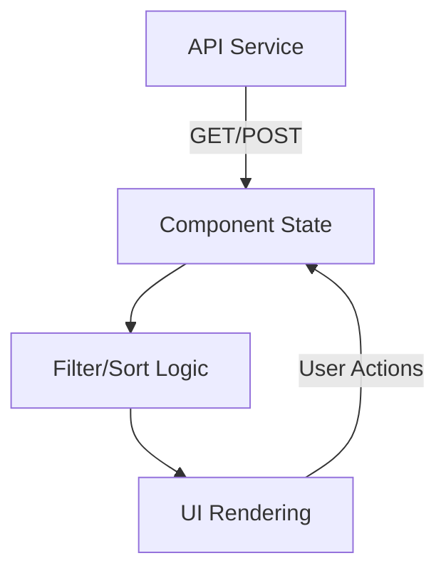
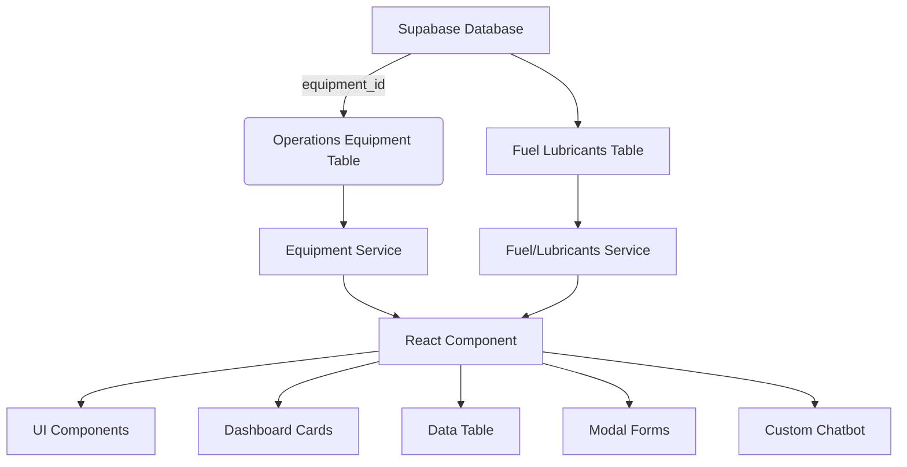

# 1300_01800_MASTER_GUIDE.md - Operations Page

## Maintenance Management Component Documentation

### Component Structure
**File Location:** `client/src/pages/01800-operations/components/01800-maintenance-management-page.js`

```javascript
// Core imports
import React, { useState, useEffect, useCallback, useMemo } from "react";
import { AccordionComponent, AccordionProvider } from "@modules/accordion";
import maintenanceService from "../../../services/maintenanceService.js";

// UI Components
import {
  Card,
  Button,
  Table,
  Form,
  Badge,
  ProgressBar,
  Alert,
  Spinner
} from "react-bootstrap";

// Component Structure
const MaintenanceManagementPage = () => {
  // State management
  const [assetsData, setAssetsData] = useState([]);
  const [workOrdersData, setWorkOrdersData] = useState([]);
  const [maintenanceSchedulesData, setMaintenanceSchedulesData] = useState([]);
  const [dashboardStats, setDashboardStats] = useState({/*...*/});
  
  // Core lifecycle
  useEffect(() => {
    // Initialization and data loading
    loadAllData();
  }, []);

  // CRUD operations
  const handleSaveItem = async (formData, type) => {
    // API interaction logic
  };
  
  // UI rendering
  return (
    {/* Complex UI structure with tabs and tables */}
  );
};
```

### Key Features
1. **Dashboard Metrics**
   - Real-time equipment status tracking
   - Work order statistics
   - Maintenance schedule overview

2. **Asset Management**
   - Equipment registration and tracking
   - Maintenance history tracking
   - Status indicators (Operational/Under Maintenance/Breakdown)

3. **Work Order System**
   - Priority-based task management
   - Technician assignment
   - Progress tracking

4. **Preventive Maintenance**
   - Scheduled maintenance planning
   - Frequency-based reminders
   - Compliance tracking

### Data Flow


### Dependencies
| Package | Version | Purpose |
|---------|---------|---------|
| react-bootstrap | ^2.9.0 | UI Components |
| @modules/accordion | 2.3.1 | Section management |
| maintenanceService | 1.0.0 | API communication |

### API Endpoints
```javascript
maintenanceService = {
  getAssets: '/api/maintenance/assets',
  getWorkOrders: '/api/maintenance/work-orders',
  getMaintenanceSchedules: '/api/maintenance/schedules',
  getDashboardStats: '/api/maintenance/stats'
}
```

### Mock Data Structure
```javascript
// Sample mock data structure
const mockAssets = [{
  id: 1,
  name: "Excavator CAT 320D",
  type: "Excavator",
  status: "Operational",
  lastMaintenance: "2025-08-15",
  nextDue: "2025-09-15"
}];
```

## Status
- [x] Component implementation
- [x] API integration
- [ ] Mobile optimization
- [ ] Report generation

## Maintenance Management Index Page

### File Structure
**Location:** `client/src/pages/01800-operations/01800-maintenance-management-index.js`

```javascript
import React from "react";
import MaintenanceManagementPage from "./components/01800-maintenance-management-page.js";

// Root export for maintenance management section
const MaintenanceManagementIndex = () => {
  return <MaintenanceManagementPage />;
};

export default MaintenanceManagementIndex;
```

### Key Responsibilities
1. Serves as entry point for `/maintenance-management` route
2. Provides clean interface for component composition
3. Enables future-proof architecture for:
   - Redux provider connections
   - Route parameter handling
   - Feature flag integrations

### Routing Configuration
```javascript
// Example route configuration (typically in App.js)
{
  path: '/operations/maintenance',
  component: MaintenanceManagementIndex,
  exact: true
}
```

### Maintenance Management Index Page

### File Structure
**Location:** `client/src/pages/01800-operations/01800-maintenance-management-index.js`

```javascript
import React from "react";
import MaintenanceManagementPage from "./components/01800-maintenance-management-page.js";

// Root export for maintenance management section
const MaintenanceManagementIndex = () => {
  return <MaintenanceManagementPage />;
};

export default MaintenanceManagementIndex;
```

### Key Responsibilities
1. Serves as entry point for `/maintenance-management` route
2. Provides clean interface for component composition
3. Enables future-proof architecture for:
   - Redux provider connections
   - Route parameter handling
   - Feature flag integrations

### Routing Configuration
```javascript
// Example route configuration (typically in App.js)
{
  path: '/operations/maintenance',
  component: MaintenanceManagementIndex,
  exact: true
}
```

## Fuel & Lubricants Management Component Documentation

### Component Structure
**File Location:** `client/src/pages/01800-operations/components/01800-fuel-lubricants-management-page.js`

```javascript
// Core imports
import React, { useState, useEffect, useCallback, useMemo } from "react";
import { supabase } from "@services/supabaseClient";

// UI Components
import {
  Card,
  Button,
  Table,
  Form,
  Badge,
  Modal,
  Tabs,
  Tab,
  Alert,
  InputGroup,
  FormControl
} from "react-bootstrap";

// Equipment & Fuel services
import fuelLubricantsService from "../../../services/fuelLubricantsService.js";
import equipmentService from "../../../services/equipmentService.js";

// Component Structure
const FuelLubricantsManagementPage = () => {
  // State management
  const [fuelLubricantsData, setFuelLubricantsData] = useState([]);
  const [equipmentData, setEquipmentData] = useState([]);
  const [dashboardStats, setDashboardStats] = useState({
    totalEquipment: 0,
    totalFuelTypes: 0,
    lowStockItems: 0,
    upcomingMaintenance: 0
  });

  // Filters and search
  const [filters, setFilters] = useState({
    searchTerm: '',
    category: 'all',
    status: 'all',
    equipmentId: null
  });

  // Modal state
  const [showModal, setShowModal] = useState(false);
  const [modalMode, setModalMode] = useState('add'); // add, edit, view

  // Core lifecycle
  useEffect(() => {
    loadAllData();
    loadEquipmentData();
    loadDashboardStats();
  }, []);

  // Search and filter fuel/lubricants
  const filteredData = useMemo(() => {
    return fuelLubricantsData.filter(item => {
      const searchMatch = filters.searchTerm === '' ||
        item.name.toLowerCase().includes(filters.searchTerm.toLowerCase()) ||
        item.category.toLowerCase().includes(filters.searchTerm.toLowerCase());

      const categoryMatch = filters.category === 'all' || item.category === filters.category;
      const statusMatch = filters.status === 'all' || item.status === filters.status;
      const equipmentMatch = !filters.equipmentId || item.equipment_id === filters.equipmentId;

      return searchMatch && categoryMatch && statusMatch && equipmentMatch;
    });
  }, [fuelLubricantsData, filters]);

  // CRUD operations
  const handleSaveItem = async (formData) => {
    try {
      if (modalMode === 'edit') {
        await fuelLubricantsService.updateFuelLubricant(formData.id, formData);
      } else {
        await fuelLubricantsService.createFuelLubricant(formData);
      }
      loadAllData();
      setShowModal(false);
    } catch (error) {
      console.error('Save error:', error);
    }
  };

  // Bulk operations
  const handleBulkAction = async (action, selectedIds) => {
    try {
      switch (action) {
        case 'approve':
          await fuelLubricantsService.bulkApprove(selectedIds);
          break;
        case 'reject':
          await fuelLubricantsService.bulkReject(selectedIds);
          break;
        case 'reorder':
          await fuelLubricantsService.bulkReorder(selectedIds);
          break;
      }
      loadAllData();
    } catch (error) {
      console.error('Bulk action error:', error);
    }
  };

  // UI rendering
  return (
    <div className="fuel-lubricants-management p-4">
      {/* Header */}
      <div className="d-flex justify-content-between align-items-center mb-4">
        <div>
          <h2 className="mb-1">Fuel & Lubricants Management</h2>
          <p className="text-muted">Integrated equipment and fuel inventory management system</p>
        </div>
        <Button
          style={{ backgroundColor: '#FFA500', border: 'none', color: '#000' }}
          onClick={() => {
            setModalMode('add');
            setShowModal(true);
          }}
        >
          <i className="fas fa-plus me-2"></i>Add Fuel/Lubricant
        </Button>
      </div>

      {/* Dashboard Cards */}
      <div className="row mb-4">
        <div className="col-md-3">
          <div className="card h-100 text-center" style={{ backgroundColor: '#f8f9fa' }}>
            <div className="card-body">
              <i className="fas fa-tools fa-2x mb-2" style={{ color: '#FFA500' }}></i>
              <h3 className="mb-1">{dashboardStats.totalEquipment}</h3>
              <small className="text-muted">Total Equipment</small>
            </div>
          </div>
        </div>
        <div className="col-md-3">
          <div className="card h-100 text-center" style={{ backgroundColor: '#f8f9fa' }}>
            <div className="card-body">
              <i className="fas fa-gas-pump fa-2x mb-2" style={{ color: '#FFA500' }}></i>
              <h3 className="mb-1">{dashboardStats.totalFuelTypes}</h3>
              <small className="text-muted">Fuel Types</small>
            </div>
          </div>
        </div>
        <div className="col-md-3">
          <div className="card h-100 text-center" style={{ backgroundColor: '#f8f9fa' }}>
            <div className="card-body">
              <i className="fas fa-exclamation-triangle fa-2x mb-2" style={{ color: '#ff6b6b' }}></i>
              <h3 className="mb-1">{dashboardStats.lowStockItems}</h3>
              <small className="text-muted">Low Stock Alert</small>
            </div>
          </div>
        </div>
        <div className="col-md-3">
          <div className="card h-100 text-center" style={{ backgroundColor: '#f8f9fa' }}>
            <div className="card-body">
              <i className="fas fa-calendar-check fa-2x mb-2" style={{ color: '#FFA500' }}></i>
              <h3 className="mb-1">{dashboardStats.upcomingMaintenance}</h3>
              <small className="text-muted">Upcoming Maintenance</small>
            </div>
          </div>
        </div>
      </div>

      {/* Search and Filters */}
      <div className="row mb-4">
        <div className="col-md-8">
          <InputGroup>
            <InputGroup.Text><i className="fas fa-search"></i></InputGroup.Text>
            <FormControl
              placeholder="Search by name, category, or supplier..."
              value={filters.searchTerm}
              onChange={(e) => setFilters(prev => ({ ...prev, searchTerm: e.target.value }))}
            />
          </InputGroup>
        </div>
        <div className="col-md-4">
          <Form.Select
            value={filters.category}
            onChange={(e) => setFilters(prev => ({ ...prev, category: e.target.value }))}
          >
            <option value="all">All Categories</option>
            <option value="fuel">Fuel</option>
            <option value="lubricant">Lubricant</option>
            <option value="consumable">Consumable</option>
          </Form.Select>
        </div>
      </div>

      {/* Equipment Filter Dropdown */}
      <div className="mb-4">
        <Form.Select
          value={filters.equipmentId || 'all'}
          onChange={(e) => setFilters(prev => ({ ...prev, equipmentId: e.target.value === 'all' ? null : e.target.value }))}
        >
          <option value="all">All Equipment</option>
          {equipmentData.map(equipment => (
            <option key={equipment.id} value={equipment.id}>
              {equipment.name} - {equipment.type}
            </option>
          ))}
        </Form.Select>
      </div>

      {/* Main Data Table */}
      <div className="card">
        <div className="card-body">
          <Table responsive hover>
            <thead>
              <tr>
                <th>Name</th>
                <th>Category</th>
                <th>Equipment</th>
                <th>Current Stock</th>
                <th>Min Stock</th>
                <th>Supplier</th>
                <th>Status</th>
                <th>Actions</th>
              </tr>
            </thead>
            <tbody>
              {filteredData.map(item => (
                <tr key={item.id}>
                  <td>
                    <div>
                      <strong>{item.name}</strong>
                      <br />
                      <small className="text-muted">{item.product_code}</small>
                    </div>
                  </td>
                  <td>
                    <Badge bg="secondary">{item.category}</Badge>
                  </td>
                  <td>
                    {item.equipment_id ? (
                      <span>{getEquipmentNameById(item.equipment_id)}</span>
                    ) : (
                      <span className="text-muted">-</span>
                    )}
                  </td>
                  <td>
                    {item.current_stock_quantity} {item.unit_of_measure}
                    {item.current_stock_quantity <= item.minimum_stock_level && (
                      <Badge bg="danger" className="ms-2">LOW STOCK</Badge>
                    )}
                  </td>
                  <td>{item.minimum_stock_level} {item.unit_of_measure}</td>
                  <td>{item.supplier_name}</td>
                  <td>
                    <Badge
                      bg={
                        item.approval_status === 'approved' ? 'success' :
                        item.approval_status === 'pending' ? 'warning' :
                        item.approval_status === 'rejected' ? 'danger' : 'secondary'
                      }
                    >
                      {item.approval_status}
                    </Badge>
                  </td>
                  <td>
                    <div className="btn-group btn-group-sm">
                      <Button variant="outline-primary" size="sm"
                        onClick={() => handleViewItem(item)}
                      >
                        <i className="fas fa-eye"></i>
                      </Button>
                      <Button variant="outline-success" size="sm"
                        onClick={() => {
                          setModalMode('edit');
                          setSelectedItem(item);
                          setShowModal(true);
                        }}
                      >
                        <i className="fas fa-edit"></i>
                      </Button>
                      <Button variant="outline-danger" size="sm"
                        onClick={() => handleDeleteItem(item.id)}
                      >
                        <i className="fas fa-trash"></i>
                      </Button>
                    </div>
                  </td>
                </tr>
              ))}
            </tbody>
          </Table>

          {filteredData.length === 0 && (
            <div className="text-center py-4">
              <i className="fas fa-inbox fa-3x text-muted mb-3"></i>
              <h5 className="text-muted">No fuel/lubricant records found</h5>
              <p className="text-muted">Try adjusting your search filters or add a new record.</p>
            </div>
          )}
        </div>
      </div>

      {/* CRUD Modal */}
      <Modal show={showModal} onHide={() => setShowModal(false)} size="lg">
        <Modal.Header closeButton style={{ backgroundColor: '#f8f9fa' }}>
          <Modal.Title>
            {modalMode === 'add' ? 'Add Fuel/Lubricant' :
             modalMode === 'edit' ? 'Edit Fuel/Lubricant' :
             'View Fuel/Lubricant Details'}
          </Modal.Title>
        </Modal.Header>
        <Modal.Body style={{ backgroundColor: '#ffffff' }}>
          {/* Form content for add/edit operations */}
          {modalMode !== 'view' && (
            <FuelLubricantForm
              onSubmit={handleSaveItem}
              initialData={selectedItem}
              equipmentData={equipmentData}
            />
          )}

          {modalMode === 'view' && (
            <FuelLubricantView
              data={selectedItem}
              equipmentData={equipmentData}
            />
          )}
        </Modal.Body>
        <Modal.Footer style={{ backgroundColor: '#f8f9fa' }}>
          <Button variant="secondary" onClick={() => setShowModal(false)}>
            Close
          </Button>
          {modalMode === 'view' ? (
            <Button
              style={{ backgroundColor: '#FFA500', border: 'none', color: '#000' }}
              onClick={() => {
                setModalMode('edit');
                // Keep modal open for editing
              }}
            >
              Edit
            </Button>
          ) : (
            <Button
              style={{ backgroundColor: '#FFA500', border: 'none', color: '#000' }}
              onClick={() => {
                // Form submission is handled in the form component
              }}
            >
              {modalMode === 'add' ? 'Create' : 'Update'}
            </Button>
          )}
        </Modal.Footer>
      </Modal>
    </div>
  );
};
```

### Key Features

#### 1. **Equipment Integration**
- Real-time equipment data loading
- Foreign key relationships for tracking
- Maintenance schedule coordination
- Equipment-specific fuel assignments

#### 2. **Advanced Inventory Management**
- Multi-level stock tracking (current/min/max)
- Low stock alerts and notifications
- Supplier relationship management
- Category-based organization

#### 3. **Interactive Dashboard**
- Real-time statistics cards
- Equipment and fuel type counts
- Stock level monitoring
- Maintenance schedule tracking

#### 4. **Search & Filtering**
- Text-based search across multiple fields
- Category and status filtering
- Equipment-specific filtering
- Date range and stock level filtering

#### 5. **Custom AI Chatbot**
- Fuel analysis recommendations
- Stock prediction and optimization
- Equipment maintenance guidance
- Supplier performance analysis

### Data Flow Architecture


### Dependencies & Services

**Frontend Dependencies:**
| Package | Version | Purpose |
|---------|---------|---------|
| react-bootstrap | ^2.10.0 | UI Components & Modal Forms |
| @fortawesome/react-fontawesome | ^0.2.0 | Icons and visual elements |
| @services/supabaseClient | 1.0.0 | Database connectivity |

**Custom Services:**
| Service | Purpose |
|---------|---------|
| `fuelLubricantsService` | CRUD operations for fuel/lubricants data |
| `equipmentService` | Equipment data management and relationships |
| `fuelAnalysisService` | Custom AI analysis and chatbot integration |

### API Endpoints Structure

```javascript
// Fuel/Lubricants Management API
fuelLubricantsService = {
  // CRUD Operations
  getFuelLubricants: '/api/fuel-lubricants',
  createFuelLubricant: '/api/fuel-lubricants',
  updateFuelLubricant: '/api/fuel-lubricants/:id',
  deleteFuelLubricant: '/api/fuel-lubricants/:id',

  // Advanced Operations
  getLowStockAlerts: '/api/fuel-lubricants/low-stock',
  getEquipmentFuelUsage: '/api/equipment/fuel-usage',
  bulkApprove: '/api/fuel-lubricants/bulk-approve',
  bulkReorder: '/api/fuel-lubricants/bulk-reorder',

  // Dashboard & Analytics
  getDashboardStats: '/api/fuel-lubricants/dashboard',
  getEquipmentMaintenanceSchedule: '/api/equipment/maintenance-schedule',
  getSupplierPerformance: '/api/fuel-lubricants/supplier-performance',

  // Search & Filtering
  searchFuelLubricants: '/api/fuel-lubricants/search',
  getFilteredResults: '/api/fuel-lubricants/filter'
}

// Equipment Management API
equipmentService = {
  getEquipment: '/api/equipment',
  getEquipmentDetails: '/api/equipment/:id',
  getEquipmentWithFuelUsage: '/api/equipment/fuel-usage/:id'
}
```

### State Management Architecture

```javascript
// Component State Structure
const [
  // Core Data
  fuelLubricantsData,
  equipmentData,
  dashboardStats,

  // UI State
  loading,
  error,
  showModal,
  modalMode,
  selectedItems,

  // Filters & Search
  searchTerm,
  categoryFilter,
  statusFilter,
  equipmentFilter,
  dateRangeFilter,
  stockLevelFilter,

  // Pagination & Sorting
  currentPage,
  pageSize,
  sortBy,
  sortOrder
] = useState(initialState);
```

### Performance Optimization

**1. Memoization:**
```javascript
// Memoize filtered data to prevent unnecessary recalculations
const filteredData = useMemo(() => {
  return fuelLubricantsData.filter(item => {
    // Complex filter logic
    return applyComplexFilters(item, filters);
  });
}, [fuelLubricantsData, filters]);
```

**2. Debounced Search:**
```javascript
// Debounce search input to prevent excessive API calls
const debouncedSearchTerm = useDebounce(searchTerm, 300);
```

**3. Virtual Scrolling:**
```javascript
// Implement virtual scrolling for large datasets
const [startIndex, setStartIndex] = useState(0);
const VISIBLE_ROWS = 25;
```

### Testing Strategy

**Unit Tests:**
- Service layer API calls
- Component render logic
- State management functions
- Custom hook utilities

**Integration Tests:**
- Full CRUD workflow testing
- Database transaction integrity
- Supabase authentication flows

**E2E Tests:**
- Complete user workflows
- Cross-browser compatibility
- Mobile responsiveness

### Database Integration Details

#### Supplier Data Integration
```sql
-- Update suppliers table for fuel/lubricants compatibility
ALTER TABLE suppliers ADD COLUMN IF NOT EXISTS
  service_type VARCHAR(50) DEFAULT 'general';

-- Add fuel/lubricants specific supplier data
INSERT INTO suppliers (id, name, contact, service_type, approval_status)
VALUES (
  gen_random_uuid(),
  'Advanced Fuels Corp',
  'contact@advancedfuels.com',
  'fuel_lubricant',
  'approved'
);
```

#### View Definitions for Analytics

```sql
-- Low stock alerts view
CREATE OR REPLACE VIEW v_fuel_low_stock AS
SELECT
  fl.id,
  fl.name,
  fl.category,
  fl.current_stock_quantity,
  fl.minimum_stock_level,
  fl.supplier_name,
  (fl.minimum_stock_level - fl.current_stock_quantity) as stock_deficit,
  CASE
    WHEN fl.current_stock_quantity < fl.minimum_stock_level * 0.8 THEN 'CRITICAL'
    WHEN fl.current_stock_quantity < fl.minimum_stock_level THEN 'LOW'
    ELSE 'OK'
  END as stock_status
FROM fuel_lubricants fl
WHERE fl.active = true
ORDER BY stock_deficit DESC;

-- Equipment fuel/lubricants correlation view
CREATE OR REPLACE VIEW v_equipment_fuel_usage AS
SELECT
  e.id as equipment_id,
  e.name as equipment_name,
  e.type as equipment_type,
  e.operating_hours,
  COUNT(fl.id) as total_fuel_items,
  SUM(fl.monthly_consumption_rate) as total_monthly_cost,
  STRING_AGG(fl.category, ', ') as fuel_types_used,
  AVG(fl.estimated_operating_life) as avg_fuel_life
FROM operations_equipment e
LEFT JOIN fuel_lubricants fl ON e.id = fl.equipment_id
WHERE e.active = true
GROUP BY e.id, e.name, e.type, e.operating_hours;
```

### Custom Chatbot Integration

The Fuel & Lubricants Management page includes a specialized AI chatbot that provides:

1. **Technical Fuel Analysis:** Equipment-specific fuel recommendations
2. **Stock Optimization:** Automated reorder point calculations
3. **Supplier Analysis:** Performance metrics and cost optimization
4. **Equipment Guidance:** Maintenance schedules and fuel usage patterns

#### Chatbot Service Architecture
```javascript
// Custom prompt templates for fuel/lubricants domain
const FUEL_ANALYSIS_PROMPTS = {
  equipmentAnalysis: `
    Analyze equipment {equipmentName} for optimal fuel/lubricant usage.
    Equipment specs: {equipmentSpecs}
    Current fuel/lubricants: {currentAssignations}
    Provide recommendations for cost optimization and maintenance efficiency.
  `,

  stockPrediction: `
    Predict stock requirements for {fuelLubricantName} based on:
    - Equipment usage: {equipmentUsage}
    - Historical consumption: {historicalData}
    - Supplier lead times: {supplierLeadTime}
    Recommended reorder point: {calculateValue}
  `,

  maintenanceOptimization: `
    Optimize maintenance schedule for equipment with fuel/lubricant efficiency in mind.
    Current equipment: {equipmentList}
    Fuel types in use: {fuelTypes}
    Maintenance cycles: {maintenanceSchedule}
  `
};
```

### Production Deployment Checklist

**Pre-deployment:**
- [ ] Database schema verified and migrated
- [ ] Equipment data imported and validated
- [ ] Supplier relationships established
- [ ] User permissions configured for RLS
- [ ] API endpoints tested and documented

**Post-deployment:**
- [ ] Dashboard statistics verified
- [ ] Search and filtering functionality tested
- [ ] CRUD operations confirmed
- [ ] Chatbot integration working
- [ ] Mobile responsiveness validated
- [ ] Performance benchmarks met

## Operations Page Dashboard

### Overview
The Operations Page serves as the central hub for accessing all operations-related functionality within the ConstructAI application. It follows the established `0102-administration` page structure while providing specialized operations theming.

### Key Responsibilities
1. **Navigation Hub**: Primary entry point for all operations activities
2. **State Management**: Controls application state across operations modules
3. **Theme Management**: Operations-specific theming and UI configuration
4. **Authentication**: User session and logout functionality

### Component Integration
```javascript
// Main component structure
const OperationsPageComponent = () => {
  const [currentState, setCurrentState] = useState(null);
  const [isSettingsInitialized, setIsSettingsInitialized] = useState(false);

  // Three primary navigation states
  const navigationStates = {
    agents: { title: 'AI Assistants', color: '#0880ff' },
    upserts: { title: 'Data Management', color: '#0486b2' },
    workspace: { title: 'Operations Workspace', color: '#055ab2' }
  };

  // Settings integration (mandatory for all pages)
  const initializeSettings = async () => {
    await settingsManager.initialize();
    setIsSettingsInitialized(true);
  };

  return (
    <div className="operations-page">
      <NavigationButtons
        states={navigationStates}
        currentState={currentState}
        onChange={setCurrentState}
      />

      {currentState === 'agents' && <AgentActions />}
      {currentState === 'upserts' && <UpsertActions />}
      {currentState === 'workspace' && <WorkspaceActions />}

      <AccordionProvider>
        <AccordionComponent settingsManager={settingsManager} />
      </AccordionProvider>
    </div>
  );
};
```

## Fuel & Lubricants Index Page

### File Structure
**Location:** `client/src/pages/01800-operations/01800-fuel-lubricants-index.js`

```javascript
import React from "react";
import FuelLubricantsManagementPage from "./components/01800-fuel-lubricants-management-page.js";

// Root export for fuel & lubricants management section
const FuelLubricantsIndex = () => {
  return <FuelLubricantsManagementPage />;
};

export default FuelLubricantsIndex;
```

### Key Responsibilities
1. Serves as entry point for `/fuel-lubricants-management` route
2. Provides clean interface for component composition
3. Enables future-proof architecture for:
   - Provider connection (Redux/Context)
   - Route parameter handling
   - Feature flag integrations
   - Error boundary setup

### Routing Configuration
```javascript
// In client/src/App.js
<Route path="/fuel-lubricants-management" element={<FuelLubricantsIndex />} />
```

## Integration with Existing Systems

### Library Dependencies
- **React Hooks**: useState, useEffect, useCallback, useMemo
- **Supabase Client**: Database connectivity and real-time subscriptions
- **React Bootstrap**: UI component library for consistent styling
- **Font Awesome**: Icon library for visual elements

### Service Layer Architecture
**Fuel Lubricants Service (`fuelLubricantsService.js`):**
```javascript
export const fuelLubricantsService = {
  // Standard CRUD
  async getFuelLubricants(filters = {}) {
    const query = supabase
      .from('fuel_lubricants')
      .select(`
        *,
        operations_equipment (name, type, specifications)
      `)
      .order('created_at', { ascending: false });

    if (filters.category) query.eq('category', filters.category);
    if (filters.status) query.eq('approval_status', filters.status);
    if (filters.searchTerm) query.ilike('name', `%${filters.searchTerm}%`);

    const { data, error } = await query;
    if (error) throw error;
    return data;
  },

  async createFuelLubricant(fuelLubricantData) {
    const { data, error } = await supabase
      .from('fuel_lubricants')
      .insert([fuelLubricantData])
      .select();

    if (error) throw error;
    return data[0];
  },

  // Bulk operations
  async bulkApprove(ids) {
    const { data, error } = await supabase
      .from('fuel_lubricants')
      .update({ approval_status: 'approved', updated_at: new Date() })
      .in('id', ids)
      .select();

    if (error) throw error;
    return data;
  }
};
```

**Equipment Service (`equipmentService.js`):**
```javascript
export const equipmentService = {
  async getEquipment() {
    const { data, error } = await supabase
      .from('operations_equipment')
      .select('*')
      .eq('active', true)
      .order('name');

    if (error) throw error;
    return data;
  },

  async getEquipmentWithFuelUsage() {
    // Return equipment with associated fuel usage
    const { data, error } = await supabase
      .from('operations_equipment')
      .select(`
        *,
        fuel_lubricants (
          name,
          category,
          current_stock_quantity,
          monthly_consumption_rate
        )
      `)
      .eq('active', true);

    if (error) throw error;
    return data;
  }
};
```

## Version History
- v1.5 (2025-09-01): Added comprehensive Fuel & Lubricants Management documentation
- v1.4 (2025-08-31): Enhanced documentation with chatbot integration details
- v1.3 (2025-08-28): Enhanced index documentation with routing examples
- v1.2 (2025-08-28): Added index page documentation
- v1.1 (2025-08-28): Added maintenance component documentation
- v1.0 (2025-08-27): Initial operations page structure
