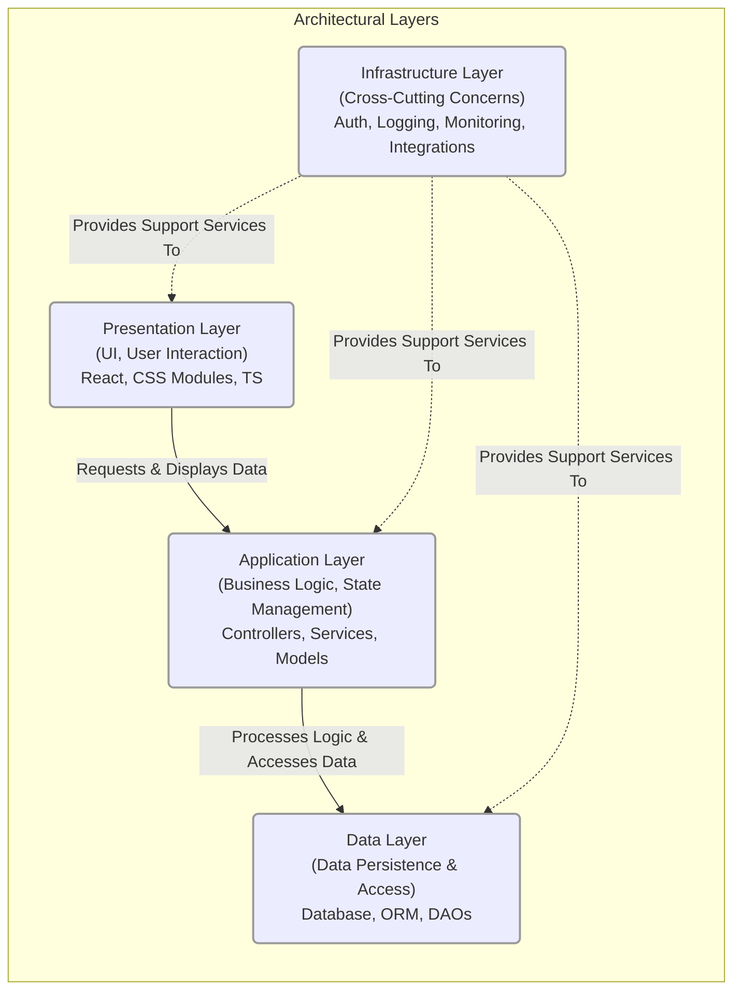
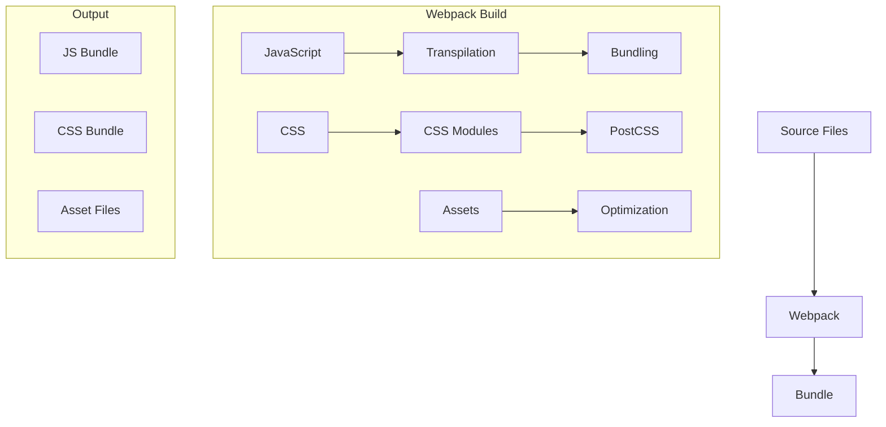

# System Architecture (0200)

## Overview

The system follows a modular, component-based architecture designed for scalability and maintainability, fully utilizing a webpack-based architecture with React components. Key architectural principles include:

1. **Separation of Concerns**: Clear boundaries between presentation, business logic, and data layers
2. **Modular Design**: Independent, reusable components with well-defined interfaces
3. **Layered Architecture**: Strict hierarchy of dependencies between layers
4. **Event-Driven Communication**: Components communicate through well-defined events and React context
5. **Webpack Integration**: Modern module bundling and asset management
6. **React Components**: Reusable UI components with proper state management

## Architectural Layers

The system is structured into the following primary layers, each with distinct responsibilities and components. The diagram below illustrates their relationships:



### Presentation Layer

- React components for UI rendering
- CSS modules for scoped styling
- Hooks for state management
- Context for shared state
- Components: React, CSS Modules, TypeScript

### Application Layer

- Implements business logic
- Manages application state
- Handles data transformation
- Components: Controllers, Services, Models

### Data Layer

- Manages data persistence
- Implements data access patterns
- Handles data validation
- Components: Database, ORM, Data Access Objects

### Infrastructure Layer

- Provides cross-cutting concerns
- Implements security, logging, and monitoring
- Handles external integrations
- Components: Authentication, Logging, Monitoring

## Optimized Architecture for Organization-Specific Deployments

This section outlines the recommended architecture for supporting multiple organizations with bespoke requirements through independent deployments. This approach eliminates the complexity of multi-tenancy by providing each organization with its own customized application instance.

### Architecture Overview

The system is designed around **organization-specific deployments** where each organization receives:
- **Separate codebase**: Customized from a master template
- **Independent deployment**: Own domain/subdomain and infrastructure
- **Isolated development**: No shared runtime state or data concerns
- **Bespoke customization**: Full freedom to modify templates as needed

### Template-Based Organization Creation

#### Master Template Structure
```
project/
├── templates/
│   └── base-template/           # Master template (Organization A)
│       ├── client/src/pages/    # Page components (00100-03010 range)
│       ├── client/src/common/   # Shared components and utilities
│       └── client/public/assets/ # Default assets and themes
├── organizations/
│   ├── orgA/                   # Original template (00100-03010)
│   ├── orgB/                   # Generated template (03100-04999)
│   ├── orgC/                   # Generated template (05000-06999)
│   └── orgD/                   # Generated template (07000-08999)
└── scripts/
    ├── create-org-template.sh   # Automated template generation
    ├── update-prefixes.js       # Prefix renumbering utility
    └── deploy-org.sh           # Organization-specific deployment
```

#### Available Prefix Space Management

**Current Usage Analysis:**
- **Template Organization A**: 00100-03010 (approximately 2,910 prefixes used)
- **Available Space**: 03011-09999 (approximately 6,989 prefixes remaining)

**Recommended Prefix Allocation:**
```
Organization A (Template): 00100-03010  (~2,910 prefixes)
Organization B:            03100-04999  (~1,900 prefixes)
Organization C:            05000-06999  (~2,000 prefixes)
Organization D:            07000-08999  (~2,000 prefixes)
Organization E:            09000-09999  (~1,000 prefixes)
```

This allocation provides substantial room for growth while maintaining clear separation between organizations.

### Implementation Strategy

#### 1. Organization-Specific Configuration Architecture

Each organization maintains separate configuration files:

```javascript
// Organization A (Template)
client/src/common/js/config/00200-sector-config-orgA.js
client/src/common/js/config/00200-ui-display-mappings-orgA.js

// Organization B
client/src/common/js/config/00200-sector-config-orgB.js
client/src/common/js/config/00200-ui-display-mappings-orgB.js
```

**Build-Time Organization Selection:**
```javascript
// webpack.config.js or environment configuration
const ORG_ID = process.env.ORG_ID || 'orgA';
const sectorConfig = require(`./00200-sector-config-${ORG_ID}.js`);
const uiMappings = require(`./00200-ui-display-mappings-${ORG_ID}.js`);
```

#### 2. Organization-Specific Asset Management

```
client/public/assets/
├── orgA/
│   ├── backgrounds/     # Organization-specific background images
│   ├── logos/          # Branding assets
│   ├── themes/         # Color schemes and styling
│   └── documents/      # Organization-specific documents
├── orgB/
│   ├── backgrounds/
│   ├── logos/
│   ├── themes/
│   └── documents/
└── shared/             # Common assets used across organizations
    ├── icons/
    ├── fonts/
    └── base-styles/
```

#### 3. Automated Template Generation Process

**Template Creation Script (`create-org-template.sh`):**
```bash
#!/bin/bash
# Usage: ./create-org-template.sh --source=orgA --target=orgB --prefix-start=03100

SOURCE_ORG=$1
TARGET_ORG=$2
PREFIX_START=$3

# Step 1: Copy entire source organization structure
cp -r organizations/$SOURCE_ORG organizations/$TARGET_ORG

# Step 2: Renumber all prefixes (00100 → 03100, 00200 → 03200, etc.)
node scripts/update-prefixes.js --org=$TARGET_ORG --start=$PREFIX_START

# Step 3: Update configuration files
node scripts/update-org-config.js --org=$TARGET_ORG

# Step 4: Create organization-specific asset directories
mkdir -p organizations/$TARGET_ORG/client/public/assets/$TARGET_ORG

# Step 5: Update import statements and references
node scripts/update-imports.js --org=$TARGET_ORG
```

**Prefix Renumbering Logic (`update-prefixes.js`):**
```javascript
// Automatically updates:
// - File names: 00300-construction/ → 03300-construction/
// - Component names: Construction00300 → Construction03300
// - CSS class names: .A-0300-* → .A-3300-*
// - Import statements: './00300-*' → './03300-*'
// - Asset references: '/assets/00300.*' → '/assets/03300.*'
```

#### 4. Organization-Specific Customization Workflow

**Post-Template Generation Customization:**
1. **Page Modification**: Add, remove, or modify pages within assigned prefix range
2. **Branding Updates**: Replace logos, color schemes, and styling
3. **Business Logic**: Implement organization-specific workflows and features
4. **Content Customization**: Update text, images, and documentation
5. **Integration Setup**: Configure organization-specific APIs and services

### Deployment Architecture

#### Independent Deployment Strategy

Each organization maintains:
- **Separate Build Pipeline**: Independent CI/CD for each organization
- **Isolated Infrastructure**: Own servers, databases, and domains
- **Custom Domain/Subdomain**:
  - `orgA.company.com` or `company-orgA.com`
  - `orgB.company.com` or `company-orgB.com`
- **Environment-Specific Configuration**: Development, staging, production per organization

#### Deployment Benefits

**Eliminated Complexities:**
- ❌ **No Organization Switching Logic**: Each deployment serves single organization
- ❌ **No Shared State Management**: Complete isolation between organizations
- ❌ **No Runtime Filtering**: All pages belong to single organization
- ❌ **No Data Leakage Concerns**: Separate databases and infrastructure
- ❌ **No Multi-Tenant Security Issues**: Standard single-tenant security model

**Operational Advantages:**
- ✅ **Independent Release Cycles**: Organizations can deploy updates independently
- ✅ **Isolated Troubleshooting**: Issues affect only single organization
- ✅ **Flexible Scaling**: Scale infrastructure per organization needs
- ✅ **Custom Integrations**: Organization-specific third-party integrations
- ✅ **Compliance Isolation**: Meet organization-specific regulatory requirements

### Development Workflow

#### Template Maintenance Strategy

**Master Template Updates:**
1. **Core Improvements**: Bug fixes and feature enhancements in base template
2. **Selective Propagation**: Organizations choose which updates to adopt
3. **Merge Strategy**: Use git merge/rebase to incorporate template updates
4. **Testing Protocol**: Comprehensive testing before propagating changes

**Organization-Specific Development:**
1. **Dedicated Branches**: Each organization maintains development branches
2. **Feature Development**: Implement organization-specific features independently
3. **Code Review Process**: Organization-specific review and approval workflows
4. **Quality Assurance**: Independent testing and validation per organization

#### Version Control Strategy

**Recommended Repository Structure:**
```
project-repo/
├── main                    # Master template branch
├── org-a/main             # Organization A main branch
├── org-a/development      # Organization A development
├── org-b/main             # Organization B main branch
├── org-b/development      # Organization B development
└── shared/                # Shared utilities and documentation
```

### Technical Implementation Details

#### Configuration Management

**Environment-Specific Settings:**
```javascript
// .env.orgA
ORG_ID=orgA
ORG_NAME="Organization A"
ORG_DOMAIN=orga.company.com
ORG_PREFIX_START=100
ORG_PREFIX_END=3010
DATABASE_URL=postgresql://orga-db.company.com
API_ENDPOINT=https://api-orga.company.com

// .env.orgB  
ORG_ID=orgB
ORG_NAME="Organization B"
ORG_DOMAIN=orgb.company.com
ORG_PREFIX_START=3100
ORG_PREFIX_END=4999
DATABASE_URL=postgresql://orgb-db.company.com
API_ENDPOINT=https://api-orgb.company.com
```

#### Build Process Optimization

**Organization-Specific Webpack Configuration:**
```javascript
// webpack.config.js
const orgId = process.env.ORG_ID || 'orgA';
const orgConfig = require(`./config/org-${orgId}.config.js`);

module.exports = {
  entry: {
    index: `./client/src/organizations/${orgId}/index.jsx`
  },
  resolve: {
    alias: {
      '@org-config': path.resolve(__dirname, `./config/org-${orgId}`),
      '@org-assets': path.resolve(__dirname, `./public/assets/${orgId}`)
    }
  },
  plugins: [
    new webpack.DefinePlugin({
      'process.env.ORG_CONFIG': JSON.stringify(orgConfig)
    })
  ]
};
```

### Risk Assessment and Mitigation

#### Low-Risk Factors

**Simplified Architecture:**
- **No Multi-Tenancy Complexity**: Standard single-application deployment model
- **Proven Technology Stack**: Uses existing React/Webpack architecture
- **Clear Separation**: No shared runtime dependencies between organizations
- **Standard Security Model**: Traditional single-tenant security approaches

#### Potential Challenges and Solutions

**Challenge 1: Template Synchronization**
- **Risk**: Keeping organization codebases in sync with template improvements
- **Solution**: Automated merge tools and selective update mechanisms
- **Mitigation**: Clear documentation of breaking changes and migration guides

**Challenge 2: Code Duplication**
- **Risk**: Duplicated code across organization deployments
- **Solution**: Shared utility libraries and common component packages
- **Mitigation**: Regular refactoring to extract common functionality

**Challenge 3: Maintenance Overhead**
- **Risk**: Managing multiple codebases and deployments
- **Solution**: Automated deployment pipelines and monitoring tools
- **Mitigation**: Standardized operational procedures and documentation

### Implementation Timeline

#### Phase 1: Template Generation Infrastructure (Weeks 1-2)
- Develop automated template creation scripts
- Implement prefix renumbering utilities
- Create organization-specific configuration management
- Set up basic deployment pipeline

#### Phase 2: First Organization Template (Weeks 3-4)
- Generate Organization B from template
- Test prefix renumbering and asset management
- Validate independent deployment process
- Perform comprehensive functionality testing

#### Phase 3: Scaling and Optimization (Weeks 5-6)
- Create additional organization templates
- Optimize build and deployment processes
- Implement monitoring and maintenance tools
- Document operational procedures

### Success Metrics

**Technical Metrics:**
- Template generation time: < 30 minutes per organization
- Build time: Comparable to single-organization builds
- Deployment success rate: > 99%
- Cross-organization isolation: 100% (no shared runtime state)

**Operational Metrics:**
- Independent release capability: Each organization can deploy independently
- Customization flexibility: Organizations can modify 100% of their codebase
- Maintenance efficiency: Template updates propagate to organizations within 1 week
- Developer productivity: No coordination overhead between organization teams

This architecture provides a robust, scalable solution for organization-specific deployments while maintaining the simplicity and reliability of single-tenant applications.

## Directory Structure and Organization
## Optimized Architecture for Organization-Specific Deployments

This section outlines the recommended architecture for supporting multiple organizations with bespoke requirements through independent deployments. This approach eliminates the complexity of multi-tenancy by providing each organization with its own customized application instance.

### Architecture Overview

The system is designed around **organization-specific deployments** where each organization receives:
- **Separate codebase**: Customized from a master template
- **Independent deployment**: Own domain/subdomain and infrastructure
- **Isolated development**: No shared runtime state or data concerns
- **Bespoke customization**: Full freedom to modify templates as needed

### Template-Based Organization Creation

#### Master Template Structure
```
project/
├── templates/
│   └── base-template/           # Master template (Organization A)
│       ├── client/src/pages/    # Page components (00100-03010 range)
│       ├── client/src/common/   # Shared components and utilities
│       └── client/public/assets/ # Default assets and themes
├── organizations/
│   ├── orgA/                   # Original template (00100-03010)
│   ├── orgB/                   # Generated template (03100-04999)
│   ├── orgC/                   # Generated template (05000-06999)
│   └── orgD/                   # Generated template (07000-08999)
└── scripts/
    ├── create-org-template.sh   # Automated template generation
    ├── update-prefixes.js       # Prefix renumbering utility
    └── deploy-org.sh           # Organization-specific deployment
```

#### Available Prefix Space Management

**Current Usage Analysis:**
- **Template Organization A**: 00100-03010 (approximately 2,910 prefixes used)
- **Available Space**: 03011-09999 (approximately 6,989 prefixes remaining)

**Recommended Prefix Allocation:**
```
Organization A (Template): 00100-03010  (~2,910 prefixes)
Organization B:            03100-04999  (~1,900 prefixes)
Organization C:            05000-06999  (~2,000 prefixes)
Organization D:            07000-08999  (~2,000 prefixes)
Organization E:            09000-09999  (~1,000 prefixes)
```

This allocation provides substantial room for growth while maintaining clear separation between organizations.

### Implementation Strategy

#### 1. Organization-Specific Configuration Architecture

Each organization maintains separate configuration files:

```javascript
// Organization A (Template)
client/src/common/js/config/00200-sector-config-orgA.js
client/src/common/js/config/00200-ui-display-mappings-orgA.js

// Organization B
client/src/common/js/config/00200-sector-config-orgB.js
client/src/common/js/config/00200-ui-display-mappings-orgB.js
```

**Build-Time Organization Selection:**
```javascript
// webpack.config.js or environment configuration
const ORG_ID = process.env.ORG_ID || 'orgA';
const sectorConfig = require(`./config/org-${orgId}.config.js`);
const uiMappings = require(`./00200-ui-display-mappings-${ORG_ID}.js`);
```

#### 2. Organization-Specific Asset Management

```
client/public/assets/
├── orgA/
│   ├── backgrounds/     # Organization-specific background images
│   ├── logos/          # Branding assets
│   ├── themes/         # Color schemes and styling
│   └── documents/      # Organization-specific documents
├── orgB/
│   ├── backgrounds/
│   ├── logos/
│   ├── themes/
│   └── documents/
└── shared/             # Common assets used across organizations
    ├── icons/
    ├── fonts/
    └── base-styles/
```

#### 3. Automated Template Generation Process

**Template Creation Script (`create-org-template.sh`):**
```bash
#!/bin/bash
# Usage: ./create-org-template.sh --source=orgA --target=orgB --prefix-start=03100

SOURCE_ORG=$1
TARGET_ORG=$2
PREFIX_START=$3

# Step 1: Copy entire source organization structure
cp -r organizations/$SOURCE_ORG organizations/$TARGET_ORG

# Step 2: Renumber all prefixes (00100 → 03100, 00200 → 03200, etc.)
node scripts/update-prefixes.js --org=$TARGET_ORG --start=$PREFIX_START

# Step 3: Update configuration files
node scripts/update-org-config.js --org=$TARGET_ORG

# Step 4: Create organization-specific asset directories
mkdir -p organizations/$TARGET_ORG/client/public/assets/$TARGET_ORG

# Step 5: Update import statements and references
node scripts/update-imports.js --org=$TARGET_ORG
```

**Prefix Renumbering Logic (`update-prefixes.js`):**
```javascript
// Automatically updates:
// - File names: 00300-construction/ → 03300-construction/
// - Component names: Construction00300 → Construction03300
// - CSS class names: .A-0300-* → .A-3300-*
// - Import statements: './00300-*' → './03300-*'
// - Asset references: '/assets/00300.*' → '/assets/03300.*'
```

#### 4. Organization-Specific Customization Workflow

**Post-Template Generation Customization:**
1. **Page Modification**: Add, remove, or modify pages within assigned prefix range
2. **Branding Updates**: Replace logos, color schemes, and styling
3. **Business Logic**: Implement organization-specific workflows and features
4. **Content Customization**: Update text, images, and documentation
5. **Integration Setup**: Configure organization-specific APIs and services

### Deployment Architecture

#### Independent Deployment Strategy

Each organization maintains:
- **Separate Build Pipeline**: Independent CI/CD for each organization
- **Isolated Infrastructure**: Own servers, databases, and domains
- **Custom Domain/Subdomain**:
  - `orgA.company.com` or `company-orgA.com`
  - `orgB.company.com` or `company-orgB.com`
- **Environment-Specific Configuration**: Development, staging, production per organization

#### Deployment Benefits

**Eliminated Complexities:**
- ❌ **No Organization Switching Logic**: Each deployment serves single organization
- ❌ **No Shared State Management**: Complete isolation between organizations
- ❌ **No Runtime Filtering**: All pages belong to single organization
- ❌ **No Data Leakage Concerns**: Separate databases and infrastructure
- ❌ **No Multi-Tenant Security Issues**: Standard single-tenant security model

**Operational Advantages:**
- ✅ **Independent Release Cycles**: Organizations can deploy updates independently
- ✅ **Isolated Troubleshooting**: Issues affect only single organization
- ✅ **Flexible Scaling**: Scale infrastructure per organization needs
- ✅ **Custom Integrations**: Organization-specific third-party integrations
- ✅ **Compliance Isolation**: Meet organization-specific regulatory requirements

### Development Workflow

#### Template Maintenance Strategy

**Master Template Updates:**
1. **Core Improvements**: Bug fixes and feature enhancements in base template
2. **Selective Propagation**: Organizations choose which updates to adopt
3. **Merge Strategy**: Use git merge/rebase to incorporate template updates
4. **Testing Protocol**: Comprehensive testing before propagating changes

**Organization-Specific Development:**
1. **Dedicated Branches**: Each organization maintains development branches
2. **Feature Development**: Implement organization-specific features independently
3. **Code Review Process**: Organization-specific review and approval workflows
4. **Quality Assurance**: Independent testing and validation per organization

#### Version Control Strategy

**Recommended Repository Structure:**
```
project-repo/
├── main                    # Master template branch
├── org-a/main             # Organization A main branch
├── org-a/development      # Organization A development
├── org-b/main             # Organization B main branch
├── org-b/development      # Organization B development
└── shared/                # Shared utilities and documentation
```

### Technical Implementation Details

#### Configuration Management

**Environment-Specific Settings:**
```javascript
// .env.orgA
ORG_ID=orgA
ORG_NAME="Organization A"
ORG_DOMAIN=orga.company.com
ORG_PREFIX_START=100
ORG_PREFIX_END=3010
DATABASE_URL=postgresql://orga-db.company.com
API_ENDPOINT=https://api-orga.company.com

// .env.orgB  
ORG_ID=orgB
ORG_NAME="Organization B"
ORG_DOMAIN=orgb.company.com
ORG_PREFIX_START=3100
ORG_PREFIX_END=4999
DATABASE_URL=postgresql://orgb-db.company.com
API_ENDPOINT=https://api-orgb.company.com
```

#### Build Process Optimization

**Organization-Specific Webpack Configuration:**
```javascript
// webpack.config.js
const orgId = process.env.ORG_ID || 'orgA';
const orgConfig = require(`./config/org-${orgId}.config.js`);

module.exports = {
  entry: {
    index: `./client/src/organizations/${orgId}/index.jsx`
  },
  resolve: {
    alias: {
      '@org-config': path.resolve(__dirname, `./config/org-${orgId}`),
      '@org-assets': path.resolve(__dirname, `./public/assets/${orgId}`)
    }
  },
  plugins: [
    new webpack.DefinePlugin({
      'process.env.ORG_CONFIG': JSON.stringify(orgConfig)
    })
  ]
};
```

### Risk Assessment and Mitigation

#### Low-Risk Factors

**Simplified Architecture:**
- **No Multi-Tenancy Complexity**: Standard single-application deployment model
- **Proven Technology Stack**: Uses existing React/Webpack architecture
- **Clear Separation**: No shared runtime dependencies between organizations
- **Standard Security Model**: Traditional single-tenant security approaches

#### Potential Challenges and Solutions

**Challenge 1: Template Synchronization**
- **Risk**: Keeping organization codebases in sync with template improvements
- **Solution**: Automated merge tools and selective update mechanisms
- **Mitigation**: Clear documentation of breaking changes and migration guides

**Challenge 2: Code Duplication**
- **Risk**: Duplicated code across organization deployments
- **Solution**: Shared utility libraries and common component packages
- **Mitigation**: Regular refactoring to extract common functionality

**Challenge 3: Maintenance Overhead**
- **Risk**: Managing multiple codebases and deployments
- **Solution**: Automated deployment pipelines and monitoring tools
- **Mitigation**: Standardized operational procedures and documentation

### Implementation Timeline

#### Phase 1: Template Generation Infrastructure (Weeks 1-2)
- Develop automated template creation scripts
- Implement prefix renumbering utilities
- Create organization-specific configuration management
- Set up basic deployment pipeline

#### Phase 2: First Organization Template (Weeks 3-4)
- Generate Organization B from template
- Test prefix renumbering and asset management
- Validate independent deployment process
- Perform comprehensive functionality testing

#### Phase 3: Scaling and Optimization (Weeks 5-6)
- Create additional organization templates
- Optimize build and deployment processes
- Implement monitoring and maintenance tools
- Document operational procedures

### Success Metrics

**Technical Metrics:**
- Template generation time: < 30 minutes per organization
- Build time: Comparable to single-organization builds
- Deployment success rate: > 99%
- Cross-organization isolation: 100% (no shared runtime state)

**Operational Metrics:**
- Independent release capability: Each organization can deploy independently
- Customization flexibility: Organizations can modify 100% of their codebase
- Maintenance efficiency: Template updates propagate to organizations within 1 week
- Developer productivity: No coordination overhead between organization teams

This architecture provides a robust, scalable solution for organization-specific deployments while maintaining the simplicity and reliability of single-tenant applications.

## Directory Structure and Organization
</final_file_content>

IMPORTANT: For any future changes to this file, use the final_file_content shown above as your reference. This content reflects the current state of the file, including any auto-formatting (e.g., if you used single quotes but the formatter converted them to double quotes). Always base your SEARCH/REPLACE operations on this final version to ensure accuracy.

<environment_details>
# VSCode Visible Files
docs/0000_DOCUMENTATION_GUIDE.md

# VSCode Open Tabs
docs/1300_01900_PROCUREMENT_PAGE.md
docs/1300_02050_INFORMATION_TECHNOLOGY_PAGE.md
docs/0700_UI_SETTINGS.md
docs/0750_IMAGE_THEME_SETTINGS.md
docs/0950_ACCORDION_MANAGEMENT.md
docs/0950_SECTOR_MANAGEMENT.md
client/src/common/js/config/00200-sector-config.js
docs/0200_SYSTEM_ARCHITECTURE.md
docs/0000_DOCUMENTATION_GUIDE.md
docs/0100_GETTING_STARTED.md
docs/0250_UTILITIES_ARCHITECTURE.md
client/src/App.js
scripts/generateAccordionConfig.js
docs/0950_ACCORDION_MANAGEMENT_AUDIT.md

# Current Time
14/06/2025, 10:19:59 am (Africa/Johannesburg, UTC+2:00)

# Context Window Usage
307,782 / 1,048.576K tokens used (29%)

# Current Mode
ACT MODE
</environment_details>

### Root Directory Structure

```
construct_AI/
├── client/           # Frontend application
│   └── src/         # Webpack source files
├── server/          # Backend server
├── docs/           # Project documentation
├── test/           # Test files
├── vs-extensions/  # VSCode extensions
├── scripts/        # Development scripts
├── config/         # Configuration files
├── utils/          # Utility scripts and tools
│   └── pdf-processing/  # PDF processing utilities
│       ├── python/     # Python utilities
│       ├── node/      # Node.js utilities
│       └── scripts/   # Shell scripts
├── docs/0250_UTILITIES_ARCHITECTURE.md # Utilities Architecture
├── *.sql           # Database setup files
└── Configuration files (.env.example, .gitignore, etc.)
```

### Client Directory Structure

```
client/
├── src/                      # Webpack source files
│   ├── index.js             # Main entry point
│   ├── App.js               # Root React component
│   ├── components/          # Shared React components
│   │   ├── Button/
│   │   ├── Modal/
│   │   └── Accordion/
│   ├── pages/              # Page components
│   │   ├── 00100-home/
│   │   └── 02400-safety/
│   ├── common/             # Shared resources
│   │   ├── hooks/         # React hooks
│   │   ├── context/       # React context
│   │   ├── assets/        # Static assets (copied to dist2)
│   │   ├── css/          # Stylesheets (copied to dist2)
│   │   └── utils/        # Utility functions
│   └── services/          # API services
│
├── dist2/               # Build output directory
│   ├── index.html      # Generated from src/pages templates
│   ├── assets/         # Copied from src/common/assets
│   └── css/           # Copied from src/common/css
│
└── config/             # Build configuration
    └── webpack.config.js # Webpack settings
```

### Build System



### Core Directory Principles

1. **Webpack Organization**
   - Source files in src/ directory
   - Components follow React conventions
   - CSS modules for scoped styles
   - TypeScript for type safety
   - Proper code splitting

2. **File Organization Rules**
   - React components in src/components/
   - Page components in src/pages/
   - Common utilities in src/common/

3. **Numerical Prefix System**
   - Files prefixed with 5-digit numbers
   - Consistent across the codebase
   - Indicates module/section
   - Maintains clear organization

### Testing Architecture

```
test/
├── unit/              # Unit tests
│   ├── components/   # Component tests
│   └── services/     # Service tests
├── integration/      # Integration tests
└── e2e/             # End-to-end tests
```

### Documentation Structure

```
docs/
├── 0000_DOCUMENTATION_GUIDE.md
├── 0100_GETTING_STARTED.md
├── 0200_SYSTEM_ARCHITECTURE.md
├── [numbered documentation files]
└── Company Management/
    ├── 00600_COMPANY_MANAGEMENT.md
    ├── 00601_COMPANY_IMPLEMENTATION.md
    ├── 00602_COMPANY_TROUBLESHOOTING.md
    └── 00603_COMPANY_INTEGRATION.md
